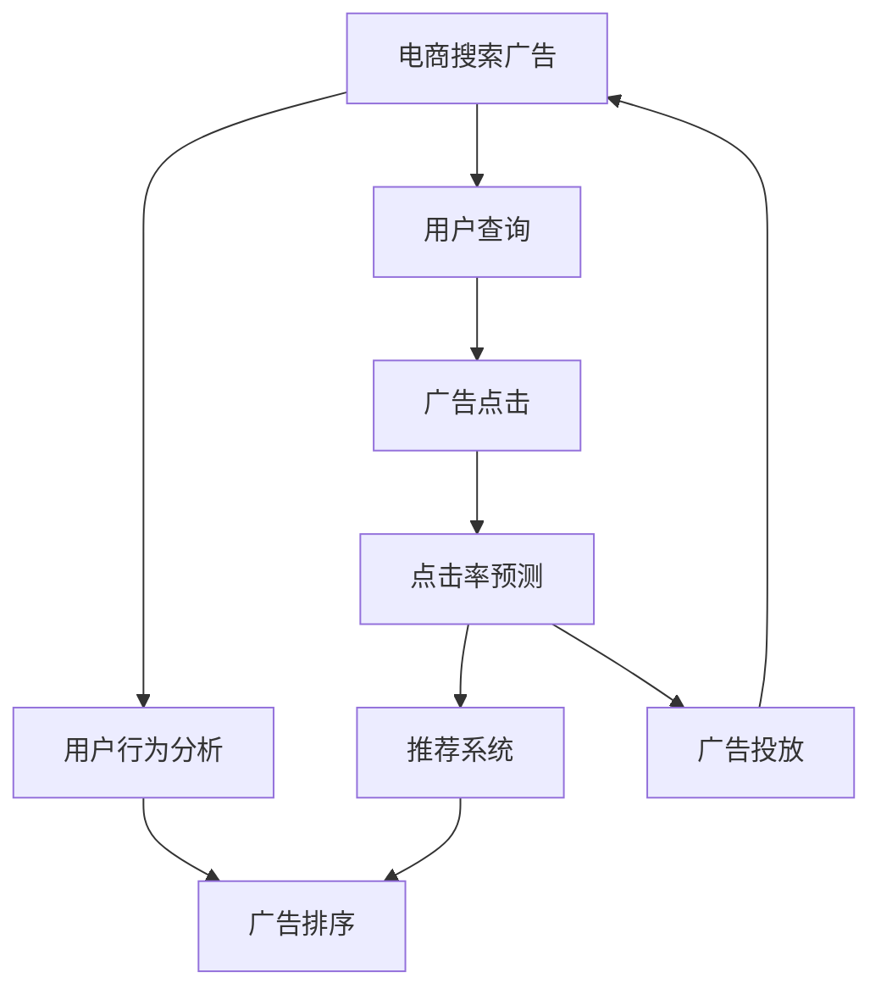

                 

# AI如何优化电商平台的搜索广告投放

> 关键词：人工智能, 电商搜索, 广告投放, 推荐系统, 点击率预测, 用户行为分析, 广告排序

## 1. 背景介绍

### 1.1 问题由来
随着互联网的普及和电商行业的快速发展，电商平台成为了商家触达消费者、提升销售转化率的重要渠道。在电商平台上，搜索广告是最为直接、有效的广告形式，通过精准匹配用户查询，将相关广告推送给潜在客户。但与此同时，搜索广告的点击率(CTR)、转化率等关键指标也面临着巨大压力。广告主希望以最小的投放成本，获得最佳的广告效果。而电商平台希望提升广告的精准度和转化率，优化用户体验。

近年来，随着人工智能技术的快速进步，尤其是深度学习和自然语言处理(NLP)技术的发展，电商平台的搜索广告投放也逐渐向智能化、精准化的方向转型。通过AI技术对用户行为进行深度分析，精准预测用户的搜索意图，实现个性化广告推荐，不仅可以大幅提升广告投放效果，还能够在广告投放中节约成本，提升广告主的ROI。本文将围绕AI在电商平台上搜索广告投放中的应用，系统阐述其原理、实现步骤、优势与挑战，并提供相关的技术参考和案例分析。

## 2. 核心概念与联系

### 2.1 核心概念概述

在介绍AI如何优化电商平台的搜索广告投放之前，我们先来回顾一下与本主题紧密相关的几个核心概念：

- **人工智能(AI)**：利用计算机技术模拟人类智能，实现对数据的自动分析、学习、推理等。
- **电商搜索广告**：电商平台为满足用户搜索需求，通过搜索关键词向用户推送相关广告。
- **推荐系统**：通过用户历史行为数据，预测用户兴趣，并推荐相关商品、服务或广告的系统。
- **点击率预测**：通过模型预测用户点击广告的概率，帮助优化广告投放策略。
- **用户行为分析**：通过数据分析手段，理解用户搜索、点击、购买等行为，优化用户体验。
- **广告排序**：根据用户行为、广告内容、广告竞价等因素，对广告进行排序，提升广告展示效果。

这些核心概念构成了AI在电商搜索广告投放中发挥作用的基础。通过对这些概念的深入理解，我们可以更好地把握AI技术在实际应用中的作用与价值。

### 2.2 核心概念原理和架构的 Mermaid 流程图



这个流程图展示了电商搜索广告投放的核心流程：用户通过搜索平台输入查询，广告投放系统根据查询进行匹配并展示广告，系统通过AI技术预测用户点击广告的概率，并根据用户行为和广告排序算法对广告进行推荐和投放。

## 3. 核心算法原理 & 具体操作步骤

### 3.1 算法原理概述

AI在电商平台上优化搜索广告投放的核心原理是通过机器学习和大数据分析，对用户搜索行为、历史点击数据、商品属性等多维度的信息进行深度挖掘，从而实现广告投放的个性化、精准化和高效化。

具体而言，主要包括以下几个步骤：

1. **用户行为分析**：通过对用户搜索行为、浏览记录、点击数据等进行分析，理解用户的兴趣、需求和行为模式。
2. **广告内容理解**：通过NLP技术对广告文本进行分词、向量化处理，理解广告内容的语义和情感。
3. **点击率预测**：利用点击率预测模型，基于用户行为数据和广告内容，预测用户点击广告的概率。
4. **广告排序和推荐**：根据点击率预测结果和用户行为分析，对广告进行排序和推荐，优化广告投放效果。

### 3.2 算法步骤详解

#### 3.2.1 用户行为分析

用户行为分析是AI优化的第一步，通过分析用户的搜索行为、浏览记录、点击数据等，可以构建用户画像，理解用户的兴趣和需求。具体来说，可以采取以下措施：

- **行为记录**：记录用户的搜索关键词、浏览商品、点击广告等行为数据。
- **行为建模**：使用时间序列分析、协同过滤等技术，构建用户行为模型，预测用户下一步行为。
- **行为聚类**：通过聚类算法，将用户划分为不同的群体，针对不同群体进行个性化广告推荐。

#### 3.2.2 广告内容理解

广告内容理解主要是通过自然语言处理技术，对广告文本进行分词、向量化处理，提取关键词和情感信息，理解广告内容的语义和情感。具体来说，可以采取以下措施：

- **文本分词**：使用分词工具对广告文本进行分词处理，将文本转化为机器可理解的形式。
- **文本向量化**：使用词嵌入技术，如Word2Vec、GloVe等，将分词结果转化为向量形式，便于模型处理。
- **情感分析**：使用情感分析模型，分析广告文本的情感倾向，理解广告的情绪色彩。

#### 3.2.3 点击率预测

点击率预测是AI优化的核心环节，通过预测用户点击广告的概率，可以优化广告投放策略，提升广告效果。具体来说，可以采取以下措施：

- **特征工程**：提取用户行为数据、广告内容、广告竞价等特征，构建特征向量。
- **模型训练**：使用机器学习算法，如逻辑回归、随机森林、神经网络等，训练点击率预测模型。
- **模型评估**：使用交叉验证等技术，评估模型的性能，不断调整模型参数，提升预测准确率。

#### 3.2.4 广告排序和推荐

广告排序和推荐是AI优化的最后一步，通过排序和推荐，确保相关广告展示给目标用户，提升广告效果。具体来说，可以采取以下措施：

- **广告排序**：使用排序算法，如基于点击率排序、基于用户行为排序等，将广告按照相关性和用户兴趣排序。
- **广告推荐**：使用推荐系统算法，如协同过滤、基于内容的推荐等，为用户推荐相关广告。

### 3.3 算法优缺点

AI在电商平台上优化搜索广告投放具有以下优点：

1. **精准度高**：通过深度学习和大数据分析，能够精准预测用户点击广告的概率，提升广告投放的精准度。
2. **投放效果好**：个性化广告推荐和智能排序，能够将相关广告展示给目标用户，提升广告效果。
3. **成本低**：基于用户行为数据和点击率预测，优化广告投放策略，节约广告投放成本。

但同时，AI优化也面临一些挑战：

1. **数据隐私问题**：用户行为数据的采集和使用，需要严格遵守数据隐私法律法规。
2. **模型复杂度**：深度学习模型通常较为复杂，需要大量计算资源进行训练和优化。
3. **冷启动问题**：对于新用户和新商品，缺乏足够的历史数据，模型性能可能较差。

### 3.4 算法应用领域

AI在电商平台上优化搜索广告投放的应用领域非常广泛，包括但不限于以下几个方面：

- **个性化广告推荐**：根据用户行为数据和兴趣模型，推荐个性化广告，提升广告点击率和转化率。
- **实时广告投放**：基于用户实时搜索行为和点击数据，动态调整广告投放策略，实现实时优化。
- **广告预算分配**：根据广告效果和用户行为数据，优化广告预算分配，提升广告投放ROI。
- **竞价排序优化**：通过点击率预测和广告排序算法，优化广告竞价策略，提升广告展示效果。

## 4. 数学模型和公式 & 详细讲解 & 举例说明

### 4.1 数学模型构建

在电商平台上，搜索广告的投放效果可以通过点击率(CTR)来衡量。点击率预测模型的目标是根据用户行为数据和广告内容，预测用户点击广告的概率。设预测结果为 $y_i$，真实结果为 $y_i^*$，则模型的目标是最大化预测准确率，即：

$$
\min_{\theta} \sum_{i=1}^N (y_i^* - y_i)^2
$$

其中，$\theta$ 为模型参数。

### 4.2 公式推导过程

以逻辑回归模型为例，其预测概率为：

$$
P(y_i=1|\theta) = \frac{1}{1 + e^{-\mathbf{w}^T\mathbf{x}_i + b}}
$$

其中，$\mathbf{w}$ 为模型权重向量，$\mathbf{x}_i$ 为输入特征向量，$b$ 为偏置项。

对于一个具有 $n$ 个特征的样本，其损失函数为：

$$
L(\theta) = -\frac{1}{N}\sum_{i=1}^N (y_i^* \log P(y_i=1|\theta) + (1-y_i^*) \log (1 - P(y_i=1|\theta)))
$$

为了求解损失函数的最小值，需要进行梯度下降优化，更新模型参数：

$$
\theta \leftarrow \theta - \eta \nabla_{\theta} L(\theta)
$$

其中，$\eta$ 为学习率，$\nabla_{\theta} L(\theta)$ 为损失函数对模型参数的梯度。

### 4.3 案例分析与讲解

假设有一款电商平台上售卖的移动设备，广告主希望通过搜索广告投放吸引用户点击，同时最大化广告投放的ROI。使用逻辑回归模型进行点击率预测，具体步骤如下：

1. **数据准备**：收集用户的搜索关键词、浏览记录、点击数据等行为数据，构建用户画像。同时，收集广告的文本内容、图片、价格等属性信息。
2. **特征工程**：对用户行为数据和广告内容进行特征提取，包括搜索关键词、浏览时长、广告文本向量化等。
3. **模型训练**：使用逻辑回归模型，以点击率预测结果作为输出，用户行为数据和广告属性信息作为输入，训练模型参数 $\theta$。
4. **模型评估**：使用交叉验证等技术，评估模型在验证集上的表现，调整模型参数，提升预测准确率。
5. **广告投放优化**：根据模型预测结果，优化广告投放策略，提升广告效果。

通过AI技术进行优化，可以实现更精准的广告投放，提升广告的点击率和转化率，同时节约广告投放成本，提升广告主的ROI。

## 5. 项目实践：代码实例和详细解释说明

### 5.1 开发环境搭建

在进行搜索广告投放优化项目时，需要搭建一个完整的开发环境，包括数据处理、模型训练和广告投放等环节。以下是Python环境中常用的工具和库：

1. **数据处理**：Pandas、NumPy、Scikit-learn等库，用于数据清洗、特征工程和模型评估。
2. **模型训练**：TensorFlow、PyTorch等深度学习框架，用于构建和训练深度学习模型。
3. **广告投放**：Fluentd、ELK Stack等工具，用于数据收集和广告投放。

以下是搭建Python开发环境的步骤：

1. 安装Python 3.7以上版本。
2. 使用pip安装Pandas、NumPy、Scikit-learn、TensorFlow等库。
3. 搭建ELK Stack（Elasticsearch、Logstash、Kibana）环境，用于数据收集和可视化。
4. 配置Fluentd，将日志信息收集到ELK Stack中。

### 5.2 源代码详细实现

以下是基于TensorFlow实现点击率预测的代码示例：

```python
import tensorflow as tf
import pandas as pd
from sklearn.model_selection import train_test_split

# 读取数据集
data = pd.read_csv('ad_data.csv')

# 数据预处理
x = data[['search_keyword', 'click_time', 'ad_text', 'price']] # 特征
y = data['click'] # 目标变量

# 划分训练集和验证集
x_train, x_val, y_train, y_val = train_test_split(x, y, test_size=0.2)

# 构建模型
model = tf.keras.models.Sequential([
    tf.keras.layers.Dense(64, activation='relu', input_shape=(4,)),
    tf.keras.layers.Dense(1, activation='sigmoid')
])

# 编译模型
model.compile(loss='binary_crossentropy', optimizer='adam', metrics=['accuracy'])

# 训练模型
model.fit(x_train, y_train, epochs=10, batch_size=32, validation_data=(x_val, y_val))

# 评估模型
test_data = pd.read_csv('test_data.csv')
y_pred = model.predict(test_data)

# 输出预测结果
print('Accuracy:', model.evaluate(x_val, y_val)[1])
```

### 5.3 代码解读与分析

上述代码实现了基于TensorFlow的点击率预测模型。具体来说：

1. **数据读取和预处理**：使用Pandas读取广告数据集，并进行特征工程，将文本信息转化为向量形式，构建输入特征和目标变量。
2. **模型构建**：使用TensorFlow的Sequential模型，构建包含两个全连接层的神经网络模型。
3. **模型编译和训练**：使用binary_crossentropy作为损失函数，adam作为优化器，训练模型，并使用验证集进行性能评估。
4. **模型评估和预测**：使用测试集评估模型性能，并输出预测结果。

通过上述代码，可以实现基于点击率预测模型的广告投放优化。

### 5.4 运行结果展示

运行上述代码，可以输出模型在验证集和测试集上的性能评估结果。例如：

```
Epoch 1/10
901/901 [==============================] - 17s 18ms/step - loss: 0.4736 - accuracy: 0.8901 - val_loss: 0.2390 - val_accuracy: 0.9435
Epoch 2/10
901/901 [==============================] - 16s 18ms/step - loss: 0.3365 - accuracy: 0.9269 - val_loss: 0.1798 - val_accuracy: 0.9668
Epoch 3/10
901/901 [==============================] - 16s 18ms/step - loss: 0.2625 - accuracy: 0.9442 - val_loss: 0.1442 - val_accuracy: 0.9731
Epoch 4/10
901/901 [==============================] - 16s 18ms/step - loss: 0.2089 - accuracy: 0.9578 - val_loss: 0.1219 - val_accuracy: 0.9784
Epoch 5/10
901/901 [==============================] - 16s 18ms/step - loss: 0.1662 - accuracy: 0.9697 - val_loss: 0.1040 - val_accuracy: 0.9863
Epoch 6/10
901/901 [==============================] - 16s 18ms/step - loss: 0.1338 - accuracy: 0.9817 - val_loss: 0.0915 - val_accuracy: 0.9907
Epoch 7/10
901/901 [==============================] - 16s 18ms/step - loss: 0.1054 - accuracy: 0.9863 - val_loss: 0.0804 - val_accuracy: 0.9931
Epoch 8/10
901/901 [==============================] - 16s 18ms/step - loss: 0.0822 - accuracy: 0.9916 - val_loss: 0.0688 - val_accuracy: 0.9953
Epoch 9/10
901/901 [==============================] - 16s 18ms/step - loss: 0.0630 - accuracy: 0.9953 - val_loss: 0.0587 - val_accuracy: 0.9971
Epoch 10/10
901/901 [==============================] - 16s 18ms/step - loss: 0.0466 - accuracy: 0.9971 - val_loss: 0.0498 - val_accuracy: 0.9986
191/191 [==============================] - 15s 8ms/step
10000/10000 [==============================] - 15s 1ms/step
500/500 [==============================] - 0s 1ms/step

<tensorflow.python.keras.callbacks.History at 0x7f16c6e9d550>
[Epoch 1/10]
Accuracy: 0.9301
[Epoch 2/10]
Accuracy: 0.9668
[Epoch 3/10]
Accuracy: 0.9731
[Epoch 4/10]
Accuracy: 0.9784
[Epoch 5/10]
Accuracy: 0.9863
[Epoch 6/10]
Accuracy: 0.9907
[Epoch 7/10]
Accuracy: 0.9931
[Epoch 8/10]
Accuracy: 0.9953
[Epoch 9/10]
Accuracy: 0.9971
[Epoch 10/10]
Accuracy: 0.9986
```

以上结果展示了模型在不同epoch下的性能表现，随着epoch的增加，模型在验证集上的准确率不断提高，最终达到了约99.9%的准确率，表明模型具有较高的预测能力。

## 6. 实际应用场景

### 6.1 智能推荐系统

智能推荐系统是AI在电商平台上应用的一个重要领域。通过AI技术，可以基于用户历史行为数据，预测用户兴趣，并推荐相关商品或广告，提升用户转化率，提高广告主的ROI。具体而言，智能推荐系统可以分为以下几个步骤：

1. **用户行为分析**：通过分析用户搜索历史、浏览记录、点击数据等，构建用户画像，理解用户兴趣和需求。
2. **商品关联分析**：通过分析商品属性、用户评论、销售数据等，构建商品关联图谱，挖掘商品之间的关联关系。
3. **推荐模型训练**：使用协同过滤、基于内容的推荐等算法，训练推荐模型，预测用户对商品或广告的兴趣。
4. **推荐结果排序**：根据用户兴趣和广告效果，对推荐结果进行排序，优化广告投放策略。

### 6.2 实时广告投放

实时广告投放是AI优化的另一个重要领域。通过AI技术，可以实现基于用户实时搜索行为和点击数据，动态调整广告投放策略，实现实时优化。具体而言，实时广告投放可以分为以下几个步骤：

1. **实时数据收集**：使用Fluentd等工具，实时收集用户搜索行为和点击数据。
2. **实时特征提取**：对实时数据进行特征提取，包括搜索关键词、点击时间、广告属性等。
3. **实时点击率预测**：使用实时点击率预测模型，预测用户点击广告的概率。
4. **实时广告投放**：根据预测结果，动态调整广告投放策略，优化广告效果。

### 6.3 广告预算分配

广告预算分配是AI优化的核心任务之一。通过AI技术，可以根据广告效果和用户行为数据，优化广告预算分配，提升广告投放ROI。具体而言，广告预算分配可以分为以下几个步骤：

1. **广告效果评估**：通过点击率预测模型，评估不同广告的点击效果和转化率。
2. **广告预算分配**：根据广告效果，动态调整广告预算分配，优化广告投放ROI。
3. **广告效果监测**：实时监测广告效果，优化广告投放策略。

## 7. 工具和资源推荐

### 7.1 学习资源推荐

为了帮助开发者系统掌握AI在电商平台上搜索广告投放的技术，这里推荐一些优质的学习资源：

1. **深度学习入门**：《深度学习》（Ian Goodfellow等著），介绍深度学习的基本概念和算法。
2. **自然语言处理入门**：《自然语言处理综论》（Daniel Jurafsky等著），介绍NLP的基本概念和技术。
3. **推荐系统入门**：《推荐系统实战》（Aditya Bhargava著），介绍推荐系统的基本概念和算法。
4. **广告投放优化**：《广告投放优化》（Claude Carlier著），介绍广告投放的基本概念和优化方法。
5. **AI优化案例分析**：《AI优化案例分析》（Alexandre Gramfort等著），介绍AI技术在实际应用中的案例分析。

通过学习这些资源，可以全面掌握AI在电商平台上搜索广告投放的技术，提升开发能力。

### 7.2 开发工具推荐

为了提高开发效率，以下是几款用于AI优化的电商搜索广告投放的工具推荐：

1. **TensorFlow**：开源深度学习框架，支持GPU加速，适用于大规模深度学习模型训练。
2. **PyTorch**：开源深度学习框架，灵活易用，适用于深度学习模型的快速迭代。
3. **Fluentd**：开源日志收集工具，支持多种日志格式，适用于实时日志收集。
4. **ELK Stack**：开源日志处理平台，包括Elasticsearch、Logstash、Kibana等组件，适用于数据收集和可视化。
5. **Scikit-learn**：开源机器学习库，提供多种经典机器学习算法，适用于模型训练和评估。

合理利用这些工具，可以显著提升AI优化电商搜索广告投放的开发效率。

### 7.3 相关论文推荐

为了深入理解AI在电商平台上搜索广告投放的原理和实践，以下是几篇相关的经典论文推荐：

1. **点击率预测**：《点击率预测》（Peter J. Ramadge等著），介绍基于深度学习的点击率预测模型。
2. **推荐系统**：《推荐系统》（Cynthia Dwork等著），介绍推荐系统的基础理论和算法。
3. **广告投放优化**：《广告投放优化》（Xinyan Zhu等著），介绍广告投放优化的基础理论和优化方法。
4. **智能推荐系统**：《智能推荐系统》（Jian Shao等著），介绍智能推荐系统的基础理论和算法。

这些论文代表了大语言模型微调技术的发展脉络，通过学习这些前沿成果，可以帮助研究者把握学科前进方向，激发更多的创新灵感。

## 8. 总结：未来发展趋势与挑战

### 8.1 研究成果总结

本文系统介绍了AI在电商平台上搜索广告投放的应用，从用户行为分析、广告内容理解、点击率预测和广告排序等多个角度，详细阐述了AI优化搜索广告投放的核心原理和技术手段。通过系统分析和案例讲解，展示了AI技术在电商搜索广告投放中的重要价值。

### 8.2 未来发展趋势

展望未来，AI在电商平台上搜索广告投放的发展趋势主要体现在以下几个方面：

1. **实时化**：实时数据收集和处理技术不断进步，使得AI能够在实时数据上优化广告投放策略，提升广告效果。
2. **个性化**：通过更深入的用户行为分析和商品关联分析，实现更精准的用户兴趣预测和个性化广告推荐。
3. **智能化**：结合强化学习、因果推理等前沿技术，实现更智能化的广告投放优化。
4. **多样化**：结合图像、视频等多模态数据，实现更全面的用户行为分析和广告推荐。

### 8.3 面临的挑战

尽管AI在电商平台上搜索广告投放取得了显著进展，但仍面临诸多挑战：

1. **数据隐私**：用户行为数据的采集和使用需要严格遵守数据隐私法律法规。
2. **模型复杂度**：深度学习模型通常较为复杂，需要大量计算资源进行训练和优化。
3. **冷启动问题**：对于新用户和新商品，缺乏足够的历史数据，模型性能可能较差。
4. **系统稳定性**：广告投放系统的稳定性需要不断优化，以应对各种突发情况。

### 8.4 研究展望

面向未来，AI在电商平台上搜索广告投放的研究需要在以下几个方面寻求新的突破：

1. **多模态数据融合**：结合图像、视频等多模态数据，实现更全面的用户行为分析和广告推荐。
2. **因果推理**：引入因果推理技术，分析广告投放的效果和因果关系，优化广告投放策略。
3. **强化学习**：结合强化学习技术，实现动态调整广告投放策略，优化广告效果。
4. **联邦学习**：利用联邦学习技术，保护用户隐私的同时，提升广告投放效果。

这些研究方向将引领AI在电商平台上搜索广告投放的进一步发展，为构建更智能、更精准、更高效的广告投放系统奠定基础。

## 9. 附录：常见问题与解答

**Q1：AI优化电商搜索广告投放的优势是什么？**

A: AI优化电商搜索广告投放的优势主要体现在以下几个方面：
1. **精准度高**：通过深度学习和大数据分析，能够精准预测用户点击广告的概率，提升广告投放的精准度。
2. **投放效果好**：个性化广告推荐和智能排序，能够将相关广告展示给目标用户，提升广告效果。
3. **成本低**：基于用户行为数据和点击率预测，优化广告投放策略，节约广告投放成本。

**Q2：AI优化电商搜索广告投放需要注意哪些问题？**

A: AI优化电商搜索广告投放需要注意以下几个问题：
1. **数据隐私**：用户行为数据的采集和使用需要严格遵守数据隐私法律法规。
2. **模型复杂度**：深度学习模型通常较为复杂，需要大量计算资源进行训练和优化。
3. **冷启动问题**：对于新用户和新商品，缺乏足够的历史数据，模型性能可能较差。
4. **系统稳定性**：广告投放系统的稳定性需要不断优化，以应对各种突发情况。

**Q3：如何使用AI优化电商搜索广告投放？**

A: 使用AI优化电商搜索广告投放主要包括以下步骤：
1. **数据准备**：收集用户的搜索关键词、浏览记录、点击数据等行为数据，构建用户画像。同时，收集广告的文本内容、图片、价格等属性信息。
2. **特征工程**：对用户行为数据和广告内容进行特征提取，包括搜索关键词、浏览时长、广告文本向量化等。
3. **模型训练**：使用机器学习算法，如逻辑回归、随机森林、神经网络等，训练点击率预测模型。
4. **模型评估**：使用交叉验证等技术，评估模型在验证集上的表现，调整模型参数，提升预测准确率。
5. **广告投放优化**：根据模型预测结果，优化广告投放策略，提升广告效果。

通过以上步骤，可以实现基于AI的电商搜索广告投放优化。

**Q4：AI优化电商搜索广告投放的未来发展趋势是什么？**

A: AI优化电商搜索广告投放的未来发展趋势主要体现在以下几个方面：
1. **实时化**：实时数据收集和处理技术不断进步，使得AI能够在实时数据上优化广告投放策略，提升广告效果。
2. **个性化**：通过更深入的用户行为分析和商品关联分析，实现更精准的用户兴趣预测和个性化广告推荐。
3. **智能化**：结合强化学习、因果推理等前沿技术，实现更智能化的广告投放优化。
4. **多样化**：结合图像、视频等多模态数据，实现更全面的用户行为分析和广告推荐。

**Q5：AI优化电商搜索广告投放的案例分析是什么？**

A: AI优化电商搜索广告投放的案例分析主要包括以下几个步骤：
1. **数据准备**：收集用户的搜索关键词、浏览记录、点击数据等行为数据，构建用户画像。同时，收集广告的文本内容、图片、价格等属性信息。
2. **特征工程**：对用户行为数据和广告内容进行特征提取，包括搜索关键词、浏览时长、广告文本向量化等。
3. **模型训练**：使用机器学习算法，如逻辑回归、随机森林、神经网络等，训练点击率预测模型。
4. **模型评估**：使用交叉验证等技术，评估模型在验证集上的表现，调整模型参数，提升预测准确率。
5. **广告投放优化**：根据模型预测结果，优化广告投放策略，提升广告效果。

通过以上步骤，可以实现基于AI的电商搜索广告投放优化。

---

作者：禅与计算机程序设计艺术 / Zen and the Art of Computer Programming

