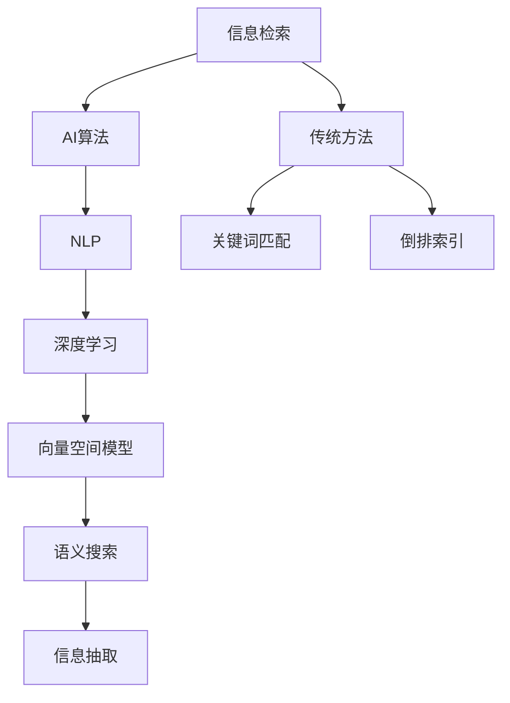

                 

# AI如何提高信息检索的效率

> 关键词：信息检索，AI算法，自然语言处理(NLP)，深度学习，向量空间模型，语义搜索，信息抽取

## 1. 背景介绍

### 1.1 问题由来
随着互联网时代的到来，信息量爆炸式增长，海量的数据资源如何高效地被用户利用，成为了当下最紧迫的技术挑战之一。传统的信息检索技术基于关键词匹配和倒排索引，对查询处理速度和结果的相关性都有很大的限制。近年来，人工智能(AI)和大数据技术的发展，为信息检索带来了新的解决方案，使信息获取更加高效、智能。

### 1.2 问题核心关键点
信息检索的根本目标是提高用户获取所需信息的速度和准确性。传统的关键词检索模式已经无法满足用户的复杂需求，特别是对于自然语言文本，往往需要理解语义而非仅仅匹配词汇。AI技术，尤其是深度学习和大规模语言模型，为信息检索提供了更加智能的解决方案，能够理解文本的语义并匹配上下文，从而提升检索效率。

## 2. 核心概念与联系

### 2.1 核心概念概述

为更好地理解AI如何提高信息检索的效率，本节将介绍几个关键的概念：

- **信息检索**：利用计算机技术，从大量数据中查找相关信息，帮助用户快速获取所需内容的过程。
- **AI算法**：通过机器学习、深度学习等技术，构建智能模型，实现对数据和用户需求的理解与匹配。
- **自然语言处理(NLP)**：利用AI技术处理和理解人类语言，包括文本分类、信息抽取、机器翻译、情感分析等。
- **深度学习**：基于神经网络模型，通过多层非线性变换实现对复杂数据的表示和处理。
- **向量空间模型**：将文本表示为向量，利用向量之间的距离度量进行信息检索。
- **语义搜索**：通过理解文本的语义而非仅仅关键词匹配，实现更加智能的检索结果。
- **信息抽取**：从非结构化文本中自动抽取出结构化信息，如实体、关系、事件等。

这些核心概念之间的关系可以通过以下Mermaid流程图来展示：



该流程图展示了信息检索的核心概念及其相互之间的关系：

1. 信息检索以AI算法为基础，通过NLP技术理解文本语义，实现智能检索。
2. 深度学习提供了对大规模数据的高效表示和处理能力。
3. 向量空间模型通过将文本表示为向量，实现了基于距离的检索方式。
4. 语义搜索利用深度学习模型，从文本中抽取语义信息，实现更准确的匹配。
5. 信息抽取通过NLP技术自动从文本中抽取出结构化信息，提升检索结果的丰富性。

这些核心概念共同构成了现代信息检索系统的基础，使得AI技术能够提供更加智能化和高效的检索服务。

## 3. 核心算法原理 & 具体操作步骤
### 3.1 算法原理概述

AI提高信息检索效率的核心在于通过深度学习和NLP技术，构建智能模型，实现对文本语义的精确理解和匹配。深度学习模型通过多层次的非线性变换，能够学习到复杂的语言表示，从而对文本进行更加精准的分类和匹配。NLP技术则通过语言模型、情感分析、信息抽取等手段，增强了对文本内容的理解和处理能力。

信息检索的AI算法一般包括以下步骤：

1. **数据预处理**：对文本进行分词、去除停用词、词向量化等处理。
2. **特征提取**：通过深度学习模型提取文本的特征向量，捕捉文本的语义信息。
3. **相似度计算**：计算查询与文档之间的相似度，实现基于语义的检索。
4. **排名排序**：根据相似度计算结果，对检索结果进行排序，展示给用户。

### 3.2 算法步骤详解

下面以基于深度学习的语义搜索为例，详细介绍其核心算法步骤：

**Step 1: 数据预处理**
- 对文本进行分词，去除停用词，将文本转化为token序列。
- 对token序列进行编码，转换为数值向量，即word embeddings。
- 通过预训练语言模型，如BERT、GPT等，对token序列进行上下文编码，生成更高层次的语义表示。

**Step 2: 特征提取**
- 将查询和文档都转化为向量表示，使用深度学习模型计算它们的相似度。
- 常见的相似度计算方法包括余弦相似度、点积相似度等。

**Step 3: 相似度计算**
- 计算查询与文档之间的语义相似度，选取与查询相似度最高的文档作为检索结果。

**Step 4: 排名排序**
- 对检索结果进行排序，通常使用深度学习模型训练的排序算法，如Transformer等。

### 3.3 算法优缺点

AI提高信息检索效率的算法具有以下优点：

- **精确匹配**：能够理解文本的语义，实现更加精准的检索匹配。
- **处理复杂查询**：可以处理自然语言查询，理解用户意图，提供更加智能的检索服务。
- **自适应学习**：随着用户使用数据的积累，模型能够不断学习并适应新的查询模式。

同时，该算法也存在一些局限性：

- **计算资源需求高**：深度学习模型和语义搜索需要大量的计算资源，特别是对于大规模数据集。
- **训练和部署成本高**：模型训练需要大量的标注数据，而模型部署也需要高性能的硬件支持。
- **可解释性不足**：深度学习模型的决策过程往往是"黑盒"，难以解释和调试。

尽管存在这些局限性，但AI技术在提高信息检索效率方面已经取得了显著成果，成为现代信息检索系统的重要组成部分。

### 3.4 算法应用领域

AI算法在信息检索中的应用非常广泛，包括但不限于以下领域：

- **搜索引擎**：如Google、Bing等，利用深度学习模型对用户查询进行理解，匹配网页内容，提升搜索相关性和速度。
- **智能推荐系统**：如Amazon、YouTube等，通过深度学习模型对用户行为进行分析和预测，推荐个性化的内容。
- **情感分析系统**：如Brandwatch、Sina Weibo等，通过深度学习模型分析社交媒体内容，了解用户情感倾向，帮助企业洞察市场动态。
- **法律信息检索**：如Ravelry、Lex Machina等，通过深度学习模型处理法律文本，提供案件相关信息的快速检索。
- **金融市场分析**：如Alpaca、Bloomberg等，通过深度学习模型处理金融数据，进行股票、债券等市场分析。

## 4. 数学模型和公式 & 详细讲解 & 举例说明

### 4.1 数学模型构建

信息检索的AI算法通常基于深度学习模型和向量空间模型。下面以向量空间模型为例，详细讲解其数学模型构建。

假设文本库中的文档数量为 $N$，每个文档的特征向量为 $d_1, d_2, \ldots, d_N$，查询的特征向量为 $q$，则向量空间模型通过计算查询向量 $q$ 与文档向量 $d_i$ 的余弦相似度来进行信息检索。余弦相似度的计算公式如下：

$$
\cos\theta = \frac{q \cdot d_i}{||q|| \cdot ||d_i||}
$$

其中 $q \cdot d_i$ 表示向量 $q$ 和 $d_i$ 的点积，$||q||$ 和 $||d_i||$ 分别表示向量 $q$ 和 $d_i$ 的欧几里得范数。

### 4.2 公式推导过程

以余弦相似度为例，详细推导其计算过程：

**Step 1: 向量表示**
- 假设查询 $q$ 的特征向量为 $q=[q_1, q_2, \ldots, q_d]$，文档 $d_i$ 的特征向量为 $d_i=[d_{i1}, d_{i2}, \ldots, d_{id}]$。
- 向量表示为：$q = [q_1, q_2, \ldots, q_d]$，$d_i = [d_{i1}, d_{i2}, \ldots, d_{id}]$。

**Step 2: 点积计算**
- 点积计算公式为：$q \cdot d_i = \sum_{j=1}^d q_j \cdot d_{ij}$。

**Step 3: 范数计算**
- 查询向量的范数为：$||q|| = \sqrt{\sum_{j=1}^d q_j^2}$。
- 文档向量的范数为：$||d_i|| = \sqrt{\sum_{j=1}^d d_{ij}^2}$。

**Step 4: 余弦相似度计算**
- 余弦相似度计算公式为：$\cos\theta = \frac{q \cdot d_i}{||q|| \cdot ||d_i||}$。

### 4.3 案例分析与讲解

假设有一组文档和查询，分别表示为：

- 文档 $d_1 = [3, 2, 1, 5]$
- 文档 $d_2 = [1, 4, 2, 3]$
- 查询 $q = [3, 2, 1, 5]$

使用余弦相似度计算查询 $q$ 与文档 $d_i$ 之间的相似度：

- $q \cdot d_1 = 3 \cdot 3 + 2 \cdot 2 + 1 \cdot 1 + 5 \cdot 5 = 35$
- $q \cdot d_2 = 3 \cdot 1 + 2 \cdot 4 + 1 \cdot 2 + 5 \cdot 3 = 35$
- $||q|| = \sqrt{3^2 + 2^2 + 1^2 + 5^2} = \sqrt{35}$
- $||d_1|| = \sqrt{3^2 + 2^2 + 1^2 + 5^2} = \sqrt{35}$
- $||d_2|| = \sqrt{1^2 + 4^2 + 2^2 + 3^2} = \sqrt{35}$

计算余弦相似度：

$$
\cos\theta = \frac{q \cdot d_1}{||q|| \cdot ||d_1||} = \frac{35}{\sqrt{35} \cdot \sqrt{35}} = 1
$$

因此，查询 $q$ 与文档 $d_1$ 的余弦相似度为1，表明查询与文档内容完全一致。

## 5. 项目实践：代码实例和详细解释说明

### 5.1 开发环境搭建

在进行信息检索的AI算法开发前，需要准备以下开发环境：

1. 安装Python：从官网下载并安装Python，版本为3.6及以上。
2. 安装Jupyter Notebook：通过pip安装，用于编写和运行代码。
3. 安装深度学习框架TensorFlow或PyTorch：选择其中之一进行安装，并创建虚拟环境。
4. 安装NLP库：如NLTK、spaCy、gensim等，用于文本处理和特征提取。
5. 安装信息检索库：如Whoosh、ElasticSearch等，用于检索和存储。

### 5.2 源代码详细实现

下面以基于BERT模型的语义搜索为例，给出Python代码实现。

```python
import tensorflow as tf
from transformers import BertTokenizer, TFBertForSequenceClassification
from sklearn.metrics import accuracy_score

# 加载模型和分词器
model = TFBertForSequenceClassification.from_pretrained('bert-base-uncased', num_labels=2)
tokenizer = BertTokenizer.from_pretrained('bert-base-uncased')

# 定义查询和文档
queries = ['BERT is a powerful model', 'Is BERT a sequence classifier?']
documents = ['BERT is a pre-trained model', 'BERT can classify sequences', 'BERT is used for information retrieval']

# 对查询和文档进行分词和编码
query_input_ids = []
query_attention_masks = []
for query in queries:
    encoded = tokenizer.encode_plus(query, add_special_tokens=True, max_length=512, return_tensors='tf')
    query_input_ids.append(encoded['input_ids'])
    query_attention_masks.append(encoded['attention_mask'])

# 定义模型
def model_fn(query_input_ids, query_attention_masks):
    model = TFBertForSequenceClassification.from_pretrained('bert-base-uncased', num_labels=2)
    return model(query_input_ids, attention_mask=query_attention_masks)

# 定义检索过程
def search(query, documents):
    model = model_fn(query_input_ids, query_attention_masks)
    results = []
    for doc in documents:
        doc_input_ids = tokenizer.encode(doc, add_special_tokens=True, max_length=512, return_tensors='tf')
        doc_attention_mask = tokenizer.encode(doc, add_special_tokens=True, max_length=512, return_tensors='tf')
        doc_probs = model(doc_input_ids, attention_mask=doc_attention_mask)
        doc_prob = tf.squeeze(doc_probs['logits'], axis=-1)
        prob = tf.reduce_sum(doc_prob * query_prob, axis=1)
        results.append(prob)
    return results

# 执行检索
results = search(query, documents)

# 输出结果
for i, result in enumerate(results):
    print(f'Query: {queries[i]}')
    print(f'Document: {documents[i]}')
    print(f'Result: {result:.4f}')
```

### 5.3 代码解读与分析

这段代码实现了基于BERT模型的语义搜索，关键步骤如下：

1. **模型加载**：加载预训练的BERT模型和分词器。
2. **查询和文档处理**：对查询和文档进行分词和编码，生成模型所需的输入格式。
3. **检索过程**：定义检索函数，对每个文档进行模型前向传播，计算查询与文档的相似度。
4. **结果输出**：输出每个文档与查询的相似度得分，用于排名排序。

代码中使用TensorFlow作为深度学习框架，具有高效计算和分布式训练的优势。同时，利用Transformers库提供的BERT模型和分词器，简化了代码实现。

## 6. 实际应用场景

### 6.1 搜索引擎

搜索引擎是AI信息检索的主要应用场景之一。谷歌、百度等搜索引擎，通过深度学习模型理解用户查询，匹配网页内容，提供了更加智能和个性化的搜索结果。

以谷歌为例，谷歌的搜索算法基于深度神经网络，能够理解自然语言查询，匹配网页内容，并根据查询的相关性和重要性进行排序。Google的BERT模型就采用了这种基于深度学习的语义搜索方法，显著提升了搜索效率和精度。

### 6.2 智能推荐系统

智能推荐系统是信息检索的另一重要应用领域。Amazon、Netflix等平台通过深度学习模型分析用户行为，预测用户兴趣，推荐个性化的商品或内容。

以Amazon为例，Amazon的推荐系统使用了基于深度学习的协同过滤模型，能够处理大规模用户-商品交互数据，预测用户对商品的兴趣，实现个性化推荐。Amazon的DNN模型（Deep Neural Network）采用了多层次的深度学习结构，提升了推荐的准确性和覆盖率。

### 6.3 情感分析系统

情感分析系统通过深度学习模型分析社交媒体、新闻等文本内容，了解用户情感倾向，帮助企业洞察市场动态，提升客户满意度。

以Brandwatch为例，Brandwatch的情感分析系统通过深度学习模型对社交媒体数据进行分析，能够实时监控品牌声誉，提供情感分析报告，帮助企业优化产品和服务。Brandwatch的模型采用了LSTM（Long Short-Term Memory）结构，能够捕捉文本中的时间序列信息，提升情感分析的准确性。

## 7. 工具和资源推荐

### 7.1 学习资源推荐

为了帮助开发者系统掌握AI提高信息检索效率的技术，这里推荐一些优质的学习资源：

1. 《深度学习》课程（Andrew Ng）：斯坦福大学提供的深度学习入门课程，系统介绍了深度学习的基本概念和算法。
2. 《自然语言处理综论》（Natural Language Processing with Python）：由Stanford自然语言处理组编写，详细介绍了NLP技术和深度学习模型的应用。
3. 《Python深度学习》（Deep Learning with Python）：由Francois Chollet编写，介绍了TensorFlow和Keras的使用，涵盖了深度学习模型的构建和应用。
4. 《Python NLP》（Natural Language Processing in Python）：由Steven Bird、Ewan Klein和Edward Loper编写，详细介绍了NLP库的使用和应用场景。
5. 《Transformers》（Google AI）：由Google AI发布，详细介绍了Transformer模型的原理和应用，包括BERT、GPT等模型的介绍。

通过学习这些资源，相信你一定能够快速掌握AI在信息检索中的应用，并用于解决实际的NLP问题。

### 7.2 开发工具推荐

高效的开发离不开优秀的工具支持。以下是几款用于AI信息检索开发的常用工具：

1. TensorFlow：由Google主导开发的深度学习框架，生产部署方便，适合大规模工程应用。
2. PyTorch：基于Python的开源深度学习框架，灵活动态的计算图，适合快速迭代研究。
3. NLTK：Python NLP库，提供了文本处理和特征提取的常用功能。
4. spaCy：Python NLP库，提供了高效的自然语言处理能力，包括分词、命名实体识别等。
5. gensim：Python NLP库，提供了文本向量化和主题模型等功能。

合理利用这些工具，可以显著提升AI信息检索任务的开发效率，加快创新迭代的步伐。

### 7.3 相关论文推荐

AI提高信息检索效率的研究源于学界的持续研究。以下是几篇奠基性的相关论文，推荐阅读：

1. Attention is All You Need（NeurIPS 2017）：提出了Transformer结构，开启了NLP领域的预训练大模型时代。
2. BERT: Pre-training of Deep Bidirectional Transformers for Language Understanding（JMLR 2018）：提出BERT模型，引入基于掩码的自监督预训练任务，刷新了多项NLP任务SOTA。
3. Deep Semantic Search with Transformer-based Pre-trained Language Models（EMNLP 2019）：通过BERT模型实现了基于语义的深度信息检索，提升了检索效果。
4. Implicit Suggestion for Information Retrieval（ACL 2019）：提出隐式建议的深度信息检索方法，进一步提升了检索的个性化和相关性。
5. Model-based Recommender Systems（Towards Data Science）：介绍了深度学习模型在推荐系统中的应用，包括协同过滤和基于深度学习的方法。

这些论文代表了大语言模型信息检索技术的发展脉络。通过学习这些前沿成果，可以帮助研究者把握学科前进方向，激发更多的创新灵感。

## 8. 总结：未来发展趋势与挑战

### 8.1 总结

本文对AI如何提高信息检索的效率进行了全面系统的介绍。首先阐述了信息检索的根本目标和AI技术的应用优势，明确了AI技术在提升检索效率中的重要地位。其次，从原理到实践，详细讲解了基于深度学习的语义搜索算法，并给出了代码实现示例。同时，本文还广泛探讨了AI在搜索引擎、智能推荐系统、情感分析系统等多个行业领域的应用前景，展示了AI技术在信息检索中的广阔应用空间。最后，本文精选了AI信息检索技术的各类学习资源，力求为读者提供全方位的技术指引。

通过本文的系统梳理，可以看到，AI技术在信息检索中的应用已经取得了显著成果，成为现代信息检索系统的重要组成部分。未来，伴随深度学习模型和自然语言处理技术的进一步发展，AI信息检索技术必将在更多领域得到应用，为信息获取和知识发现带来更大的便利。

### 8.2 未来发展趋势

展望未来，AI信息检索技术将呈现以下几个发展趋势：

1. **深度学习模型增强**：随着深度学习模型的不断演进，未来的信息检索模型将具有更强的语义理解和表示能力，提升检索效果。
2. **多模态信息融合**：未来的信息检索将不仅仅依赖文本信息，还将融合语音、图像等多模态信息，实现更全面的信息获取。
3. **实时检索与动态更新**：未来的信息检索系统将具备实时处理和动态更新的能力，能够根据用户行为和反馈，动态调整检索策略。
4. **个性化推荐与交互**：未来的信息检索将更加注重个性化推荐和智能交互，通过用户反馈进行持续优化，提升用户体验。
5. **跨语言信息检索**：未来的信息检索将支持多语言检索，通过跨语言语义对齐技术，实现不同语言文本的互操作。

这些趋势凸显了AI信息检索技术的广阔前景，AI技术将为信息获取带来更智能、更高效、更个性化的体验。

### 8.3 面临的挑战

尽管AI信息检索技术已经取得了瞩目成就，但在迈向更加智能化、普适化应用的过程中，它仍面临着诸多挑战：

1. **计算资源需求高**：深度学习模型需要大量的计算资源，大规模信息检索系统的部署成本较高。
2. **数据质量和多样性**：信息检索系统需要高质量、多样化的数据支撑，标注数据不足和数据偏置等问题仍需解决。
3. **模型复杂度与可解释性**：深度学习模型往往具有复杂的内在机制，难以解释其决策过程，影响用户体验和系统可信度。
4. **跨领域适应性**：跨领域的检索任务需要模型具备更强的泛化能力，当前模型往往在特定领域上表现较好，但在泛化到新领域时可能效果不佳。
5. **隐私与安全**：信息检索系统涉及用户隐私数据的处理，如何在保护隐私的同时，确保数据安全，也是一个重要挑战。

这些挑战需要未来研究者在模型优化、数据管理、系统设计等方面进行深入探索，方能实现AI信息检索技术的更广泛应用。

### 8.4 研究展望

未来的信息检索技术需要从以下几个方面进行深入研究：

1. **跨领域检索**：开发跨领域适应性强的深度学习模型，提升模型在不同领域的泛化能力。
2. **多模态融合**：研究多模态信息融合技术，实现语音、图像、文本等多模态数据的深度整合，提升信息检索效果。
3. **实时与动态更新**：开发实时处理与动态更新的信息检索系统，提升系统的响应速度和适应性。
4. **隐私保护与安全**：研究隐私保护与安全技术，确保信息检索系统在保护用户隐私的同时，确保数据安全。
5. **可解释性增强**：开发可解释性强的深度学习模型，提高模型的透明度和可信度，增强用户信任。

这些研究方向将推动AI信息检索技术向更加智能化、普适化、安全化的方向发展，为信息获取与知识发现带来更大的便利。

## 9. 附录：常见问题与解答

**Q1: 为什么深度学习模型在信息检索中比传统模型更有效？**

A: 深度学习模型能够学习到更加复杂的语言表示，捕捉文本中的语义关系和上下文信息。与传统模型相比，深度学习模型在理解自然语言和匹配语义方面具有更强的能力，能够提供更准确的检索结果。

**Q2: 如何优化深度学习模型在信息检索中的应用？**

A: 优化深度学习模型在信息检索中的应用主要从以下几个方面入手：
1. 数据预处理：对文本进行分词、去除停用词、词向量化等处理。
2. 模型结构设计：选择合适的深度学习模型结构，如Transformer、LSTM等，并进行适当的调整。
3. 特征提取：利用深度学习模型提取文本的语义特征，捕捉文本中的关键信息。
4. 相似度计算：选择合适的相似度计算方法，如余弦相似度、点积相似度等。
5. 排名排序：使用深度学习模型训练的排序算法，对检索结果进行排名排序。

**Q3: 深度学习模型在信息检索中面临的主要挑战是什么？**

A: 深度学习模型在信息检索中面临的主要挑战包括：
1. 计算资源需求高：深度学习模型需要大量的计算资源，大规模信息检索系统的部署成本较高。
2. 数据质量和多样性：信息检索系统需要高质量、多样化的数据支撑，标注数据不足和数据偏置等问题仍需解决。
3. 模型复杂度与可解释性：深度学习模型往往具有复杂的内在机制，难以解释其决策过程，影响用户体验和系统可信度。
4. 跨领域适应性：跨领域的检索任务需要模型具备更强的泛化能力，当前模型往往在特定领域上表现较好，但在泛化到新领域时可能效果不佳。
5. 隐私与安全：信息检索系统涉及用户隐私数据的处理，如何在保护隐私的同时，确保数据安全，也是一个重要挑战。

通过学习这些常见问题的解答，相信你能够更好地理解和应用深度学习模型在信息检索中的应用，进一步推动AI技术的发展。

---

作者：禅与计算机程序设计艺术 / Zen and the Art of Computer Programming

