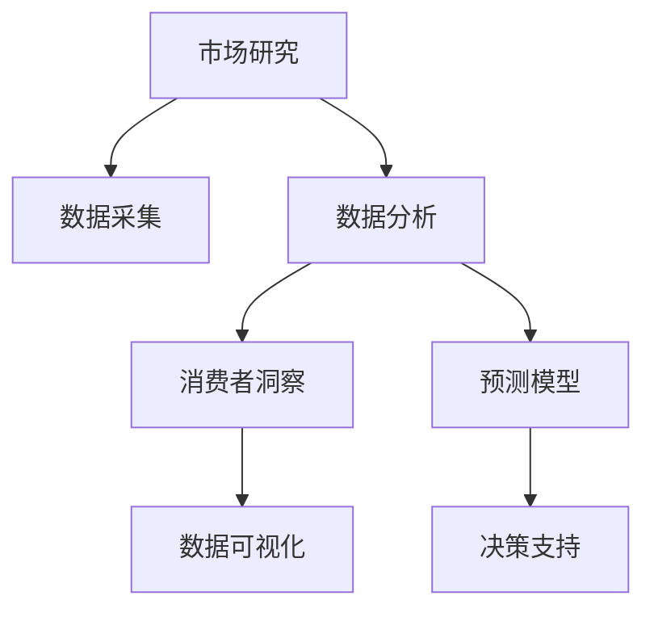

                 

# AI如何改变市场研究和消费者洞察

> 关键词：AI市场研究,消费者洞察,数据分析,预测模型,数据可视化,自然语言处理

## 1. 背景介绍

### 1.1 问题由来
市场研究和消费者洞察长期以来一直是企业决策的核心。然而，传统市场调研方法依赖于人工访谈和问卷调查，耗时耗力，且难以覆盖更广泛的消费者群体。随着人工智能技术的崛起，尤其是自然语言处理(NLP)和机器学习的进步，市场研究和消费者洞察的实践方式正在发生深刻变革。AI技术可以处理海量数据，自动化分析过程，提升调研效率和精准度，助力企业更快速、更全面地理解市场动向和消费者需求。

### 1.2 问题核心关键点
本文聚焦于AI在市场研究和消费者洞察中的应用，重点介绍以下内容：
1. AI如何提升市场研究的数据处理能力。
2. 消费者洞察中，AI技术如何自动分析消费者行为和情感。
3. 预测模型如何根据历史数据和实时信息做出精准的市场预测。
4. 数据可视化工具如何帮助企业从繁杂数据中提取关键洞察。
5. AI驱动的自然语言处理技术如何增强消费者反馈分析。

### 1.3 问题研究意义
AI在市场研究和消费者洞察中的应用，对于企业决策具有重要意义：
1. 提高调研效率：AI可以自动处理海量数据，节省人工时间和成本。
2. 增强数据分析能力：通过机器学习算法，AI能够挖掘数据背后的深层模式和趋势。
3. 提升预测准确性：基于历史和实时数据的预测模型，帮助企业做出更有信心的决策。
4. 优化消费者洞察：AI分析消费者情感和行为，为企业产品改进和市场策略制定提供支持。
5. 促进数据驱动决策：AI技术将数据转化为可操作的洞察，帮助企业做出数据驱动的决策。

## 2. 核心概念与联系

### 2.1 核心概念概述

为更好地理解AI在市场研究和消费者洞察中的应用，本节将介绍几个密切相关的核心概念：

- **市场研究**：通过对市场环境、消费者行为、竞争对手等信息的收集和分析，帮助企业做出有依据的决策。
- **消费者洞察**：深入理解消费者的需求、偏好、行为和情感，为产品设计和市场营销提供支持。
- **自然语言处理(NLP)**：一种使计算机能够理解、解释和生成人类语言的技术，是AI在市场研究中广泛应用的基础。
- **机器学习(ML)**：通过训练数据模型，使计算机能够从数据中自动学习规律和趋势，提高决策的准确性。
- **数据可视化**：将复杂数据转换为直观的图表和图形，帮助企业直观理解数据洞察。

这些核心概念之间的逻辑关系可以通过以下Mermaid流程图来展示：



这个流程图展示了一系列从数据采集到决策支持的过程：市场研究通过数据采集和分析，获取消费者洞察；预测模型基于历史数据和实时信息，做出市场预测；数据可视化将数据转化为可操作洞察；最终决策支持指导企业制定数据驱动的决策。

## 3. 核心算法原理 & 具体操作步骤

### 3.1 算法原理概述

AI在市场研究和消费者洞察中的应用，主要通过以下几个算法原理实现：

- **数据清洗与预处理**：通过自动化算法，清洗和标准化数据，去除噪声和异常值。
- **自然语言处理(NLP)**：使用文本分析、情感分析等技术，从消费者评论、社交媒体数据中提取有价值的信息。
- **机器学习(ML)**：通过分类、回归等模型，对消费者行为、市场趋势进行预测和分类。
- **强化学习(Reinforcement Learning)**：通过模拟和迭代优化，不断优化市场策略和消费者互动策略。
- **数据可视化**：使用图表、热图等可视化工具，将数据洞察直观呈现，帮助企业快速理解分析结果。

### 3.2 算法步骤详解

AI在市场研究和消费者洞察中的应用，主要包含以下几个步骤：

**Step 1: 数据采集与预处理**

- **数据来源**：从市场调研问卷、社交媒体、电子商务平台等渠道获取数据。
- **数据清洗**：去除重复、噪声和异常值，确保数据质量。
- **数据标准化**：对不同来源的数据进行格式和单位的统一，便于后续分析。

**Step 2: 自然语言处理(NLP)**

- **文本分析**：使用分词、词性标注、命名实体识别等技术，提取文本中的关键信息。
- **情感分析**：通过分析消费者的评论和反馈，评估其情感倾向（如积极、消极、中性）。
- **话题建模**：通过主题模型，识别出文本中的主要讨论话题和趋势。

**Step 3: 机器学习(ML)**

- **特征工程**：从清洗后的数据中提取有意义的特征，用于训练预测模型。
- **模型训练**：选择合适的机器学习算法（如随机森林、支持向量机、神经网络等），训练预测模型。
- **模型评估**：使用交叉验证、ROC曲线等方法评估模型性能，调整模型参数。

**Step 4: 强化学习(Reinforcement Learning)**

- **策略设计**：设计市场互动策略，如价格调整、促销活动等。
- **模拟与优化**：通过模拟市场环境，不断优化互动策略，提升效果。
- **策略部署**：将优化后的策略部署到实际市场，评估效果并进行调整。

**Step 5: 数据可视化**

- **数据转换**：将预测结果和模型输出转换为图表、热图等可视化形式。
- **关键指标**：确定关键指标（如销售额、市场份额、用户满意度等）进行展示。
- **互动展示**：提供交互式可视化工具，支持用户自定义查询和深入分析。

### 3.3 算法优缺点

AI在市场研究和消费者洞察中的应用，具有以下优点：

1. **高效性**：AI可以处理海量数据，快速分析市场动向和消费者行为。
2. **全面性**：AI能够涵盖广泛的数据源，提供多维度的市场洞察。
3. **精确性**：机器学习算法通过历史数据训练，提供高精度的预测和分类。
4. **可扩展性**：AI技术可以不断迭代优化，适应不同市场环境和消费者需求。

同时，该方法也存在一些局限性：

1. **数据质量依赖**：AI模型对数据质量要求较高，低质量数据可能导致误导性分析结果。
2. **模型解释性不足**：某些AI模型（如深度神经网络）难以解释其决策过程，导致结果难以理解。
3. **过度拟合风险**：复杂模型可能过拟合训练数据，降低泛化能力。
4. **隐私和伦理问题**：消费者数据涉及隐私，不当使用可能导致伦理问题。

尽管存在这些局限性，但就目前而言，AI技术在市场研究和消费者洞察中的应用，已展现出巨大的潜力和广泛的应用前景。未来相关研究的重点在于如何进一步提升模型的解释性和鲁棒性，确保数据使用的合法性和道德性。

### 3.4 算法应用领域

AI在市场研究和消费者洞察中的应用，已经在多个领域得到广泛应用，例如：

- **市场趋势分析**：通过分析历史数据和实时信息，预测市场趋势，帮助企业制定战略。
- **消费者行为研究**：通过分析社交媒体、电子商务数据，深入理解消费者行为和偏好。
- **竞争对手分析**：通过分析竞争对手的市场行为和产品表现，制定竞争策略。
- **产品创新与改进**：通过消费者反馈分析，指导产品设计和功能改进。
- **品牌定位与传播**：通过情感分析，了解消费者对品牌的情感倾向，优化品牌传播策略。
- **渠道优化**：通过消费者行为数据，优化销售渠道和营销策略。

## 4. 数学模型和公式 & 详细讲解 & 举例说明

### 4.1 数学模型构建

本节将使用数学语言对AI在市场研究和消费者洞察中的应用进行更加严格的刻画。

假设市场调研数据集为 $D=\{(x_i,y_i)\}_{i=1}^N$，其中 $x_i$ 表示市场特征和消费者行为数据，$y_i$ 表示市场表现（如销售额、市场份额等）。目标是通过训练数据集 $D$ 上的模型 $M$，预测未来市场表现。

定义模型 $M$ 在输入 $x$ 上的输出为 $\hat{y}=M(x)$，则预测误差定义为：

$$
e=\hat{y}-y
$$

其中 $y$ 为实际市场表现，$\hat{y}$ 为模型预测值。目标是最小化预测误差 $e$，即：

$$
\min_{M} \sum_{i=1}^N e_i^2
$$

常见的预测模型包括线性回归、决策树、随机森林、神经网络等。这里以线性回归为例，模型的训练目标为：

$$
\min_{\theta} \frac{1}{2N}\sum_{i=1}^N (\hat{y}_i - y_i)^2
$$

其中 $\theta$ 为模型的参数，$\hat{y}_i$ 为模型对样本 $i$ 的预测值。

### 4.2 公式推导过程

以下我们以线性回归模型为例，推导其训练和预测过程的数学公式。

假设模型 $M$ 为线性回归模型，形式化为：

$$
\hat{y} = \theta_0 + \sum_{i=1}^d \theta_i x_{i}
$$

其中 $\theta_0$ 为截距，$\theta_i$ 为特征系数。模型的训练目标为：

$$
\min_{\theta} \frac{1}{2N}\sum_{i=1}^N (\hat{y}_i - y_i)^2
$$

通过计算梯度，可以求得模型参数的更新公式为：

$$
\theta \leftarrow \theta - \frac{\eta}{N} \sum_{i=1}^N (y_i - \hat{y}_i) x_i
$$

其中 $\eta$ 为学习率，$\sum_{i=1}^N (y_i - \hat{y}_i) x_i$ 为梯度。通过不断迭代更新模型参数，使预测误差最小化。

### 4.3 案例分析与讲解

以电商平台的销售数据分析为例，展示线性回归模型的应用过程。

假设电商平台的历史销售数据为 $D=\{(x_i,y_i)\}_{i=1}^N$，其中 $x_i$ 包括时间、类别、广告投入等特征，$y_i$ 为销售额。通过线性回归模型 $M$ 预测未来销售量。

1. **数据采集与预处理**：收集电商平台的销售历史数据，进行清洗和标准化处理。

2. **特征工程**：提取时间、类别、广告投入等特征，用于训练线性回归模型。

3. **模型训练**：使用历史销售数据训练线性回归模型 $M$，调整模型参数 $\theta$。

4. **模型评估**：在验证集上评估模型性能，使用MAE、RMSE等指标衡量预测误差。

5. **模型预测**：将新数据输入模型 $M$，预测未来销售量。

## 5. 项目实践：代码实例和详细解释说明

### 5.1 开发环境搭建

在进行AI驱动的市场研究和消费者洞察实践前，我们需要准备好开发环境。以下是使用Python进行Scikit-Learn和TensorFlow开发的环境配置流程：

1. 安装Anaconda：从官网下载并安装Anaconda，用于创建独立的Python环境。

2. 创建并激活虚拟环境：
```bash
conda create -n market-research python=3.8 
conda activate market-research
```

3. 安装Scikit-Learn：
```bash
conda install scikit-learn
```

4. 安装TensorFlow：
```bash
conda install tensorflow
```

5. 安装各类工具包：
```bash
pip install pandas numpy matplotlib scikit-learn tensorflow
```

完成上述步骤后，即可在`market-research`环境中开始AI驱动的市场研究和消费者洞察实践。

### 5.2 源代码详细实现

下面我们以电商平台销售数据分析为例，给出使用Scikit-Learn对线性回归模型进行训练的PyTorch代码实现。

首先，定义数据处理函数：

```python
import pandas as pd
from sklearn.model_selection import train_test_split
from sklearn.linear_model import LinearRegression

def load_data(file_path):
    data = pd.read_csv(file_path)
    features = ['time', 'category', 'ad_spending']
    target = 'sales'
    X = data[features]
    y = data[target]
    X_train, X_test, y_train, y_test = train_test_split(X, y, test_size=0.2, random_state=42)
    return X_train, X_test, y_train, y_test

# 加载数据
X_train, X_test, y_train, y_test = load_data('sales_data.csv')
```

然后，定义模型和优化器：

```python
from sklearn.linear_model import LinearRegression

model = LinearRegression()
model.fit(X_train, y_train)

# 使用测试集进行预测
y_pred = model.predict(X_test)

# 评估模型性能
print('R^2 score:', model.score(X_test, y_test))
```

最后，在测试集上评估模型性能：

```python
from sklearn.metrics import mean_squared_error, mean_absolute_error

# 计算MAE
mae = mean_absolute_error(y_test, y_pred)
print('MAE:', mae)
```

以上就是使用Scikit-Learn对线性回归模型进行训练和评估的完整代码实现。可以看到，Scikit-Learn库提供了方便的API接口，使得模型训练和评估过程非常简单快捷。

### 5.3 代码解读与分析

让我们再详细解读一下关键代码的实现细节：

**load_data函数**：
- 使用Pandas加载销售数据，提取特征和目标变量。
- 将数据集划分为训练集和测试集，确保模型训练和评估的独立性。

**LinearRegression模型**：
- 使用Scikit-Learn的LinearRegression类，定义线性回归模型。
- 使用fit方法训练模型，输入训练集特征和目标变量。
- 使用predict方法进行预测，输入测试集特征。

**模型评估**：
- 使用score方法计算模型在测试集上的R^2得分，衡量模型拟合程度。
- 使用mean_squared_error和mean_absolute_error方法计算MAE，评估模型预测精度。

**代码实现**：
- 加载数据集，并进行数据预处理。
- 定义线性回归模型，并使用训练数据拟合模型。
- 在测试集上评估模型性能，输出MAE和R^2得分。

通过这一简单代码示例，展示了使用Scikit-Learn进行线性回归模型训练和评估的完整流程。开发者可以根据具体任务，进一步优化模型设计和参数调优，以提高模型预测准确性。

## 6. 实际应用场景

### 6.1 电商平台销售预测

AI在电商平台中的应用，可以显著提升销售预测的准确性和效率。通过分析历史销售数据，预测未来销售趋势，电商平台可以更好地规划库存、制定促销策略，提高运营效率。

具体而言，可以收集电商平台的销售历史数据，包括时间、类别、广告投入等特征，使用线性回归等模型进行训练，预测未来销售量。在模型训练过程中，可以利用数据增强、正则化等技术提升模型鲁棒性，确保预测结果的准确性。

### 6.2 市场趋势分析

AI驱动的市场趋势分析，可以帮助企业快速洞察市场动向，制定应对策略。通过对历史市场数据进行分析和预测，企业可以预判市场变化，及时调整业务方向。

具体而言，可以收集各行业的市场数据，包括销售额、价格、品牌影响力等，使用时间序列分析、回归模型等方法进行建模。在模型训练过程中，可以引入季节性、节假日等特征，提升预测精度。模型训练完成后，可以在实时数据上做出预测，帮助企业抓住市场机会。

### 6.3 消费者行为研究

AI在消费者行为研究中的应用，可以深入理解消费者的需求和行为模式，为产品设计、市场营销提供数据支持。通过对社交媒体、在线评论等数据进行分析，可以挖掘消费者的偏好和反馈，优化产品功能和用户体验。

具体而言，可以收集社交媒体平台上的评论数据，使用情感分析、主题建模等技术，提取消费者的情感倾向和主要讨论话题。通过分析不同时间段和不同用户群体的评论，可以了解消费者对产品的满意度和改进需求。

## 7. 工具和资源推荐

### 7.1 学习资源推荐

为了帮助开发者系统掌握AI在市场研究和消费者洞察中的应用，这里推荐一些优质的学习资源：

1. 《Python数据科学手册》系列书籍：涵盖数据分析、机器学习、深度学习等领域的经典教材，是进入数据科学领域的必备资源。

2. Coursera《机器学习》课程：由斯坦福大学教授Andrew Ng主讲，全面介绍了机器学习的基本概念和算法。

3. Udacity《深度学习》纳米学位：涵盖深度学习理论和实践的课程，适合希望深入学习AI技术的开发者。

4. Kaggle平台：提供丰富的数据集和机器学习竞赛，是实践AI技术的重要平台。

5. HuggingFace官方文档：介绍自然语言处理和深度学习模型的开发和部署，是入门AI技术的重要资源。

通过对这些资源的学习实践，相信你一定能够快速掌握AI在市场研究和消费者洞察中的应用，并用于解决实际的商业问题。

### 7.2 开发工具推荐

高效的开发离不开优秀的工具支持。以下是几款用于AI市场研究和消费者洞察开发的常用工具：

1. Scikit-Learn：Python的数据科学库，提供各种机器学习算法和工具，适合快速原型设计和模型评估。

2. TensorFlow：由Google主导开发的深度学习框架，生产部署方便，适合大规模工程应用。

3. Keras：高层次的神经网络API，易于上手，支持多种深度学习模型。

4. Tableau：强大的数据可视化工具，支持复杂的数据分析和大规模数据展示。

5. Apache Spark：大规模数据处理框架，支持分布式计算和数据流处理，适合大数据应用。

6. Jupyter Notebook：免费的开源笔记本，支持Python、R等多种编程语言，方便开发者进行交互式开发和调试。

合理利用这些工具，可以显著提升AI驱动的市场研究和消费者洞察任务的开发效率，加快创新迭代的步伐。

### 7.3 相关论文推荐

AI在市场研究和消费者洞察中的应用，源于学界的持续研究。以下是几篇奠基性的相关论文，推荐阅读：

1. "An Introduction to Statistical Learning"（《统计学习方法》）：李航著，全面介绍了统计学习的基本理论和方法，是机器学习领域的经典教材。

2. "Deep Learning"（《深度学习》）：Ian Goodfellow、Yoshua Bengio、Aaron Courville合著，涵盖了深度学习的基本理论和实践，是深度学习领域的必读之作。

3. "AI for Market Research"（《AI在市场研究中的应用》）：探讨AI技术如何改变市场研究，提高数据分析效率和准确性。

4. "Machine Learning in Marketing"（《市场营销中的机器学习》）：分析了机器学习在市场营销中的应用，包括客户细分、营销效果评估等。

5. "Natural Language Processing for Market Research"（《市场研究中的自然语言处理》）：讨论了自然语言处理技术在市场研究中的应用，如情感分析、话题建模等。

这些论文代表了大数据和AI技术在市场研究领域的发展脉络。通过学习这些前沿成果，可以帮助研究者把握学科前进方向，激发更多的创新灵感。

## 8. 总结：未来发展趋势与挑战

### 8.1 总结

本文对AI在市场研究和消费者洞察中的应用进行了全面系统的介绍。首先阐述了AI如何提升数据处理能力、分析消费者行为和情感、做出市场预测，并提供了数据可视化和自然语言处理技术支持。其次，介绍了基于Scikit-Learn的线性回归模型实现和性能评估过程，给出了完整的代码实例。最后，探讨了AI在电商平台销售预测、市场趋势分析、消费者行为研究等实际应用场景中的应用，展示了AI技术的广阔前景。

通过本文的系统梳理，可以看到，AI在市场研究和消费者洞察中的应用，正在改变传统的调研和分析方法，提升企业决策的科学性和准确性。未来，随着AI技术的不断进步，市场研究和消费者洞察的实践将更加高效、全面和智能化，为企业的市场竞争和产品创新提供强大支持。

### 8.2 未来发展趋势

展望未来，AI在市场研究和消费者洞察中的应用将呈现以下几个发展趋势：

1. **自动化和智能化**：AI技术将进一步自动化市场研究和消费者洞察过程，提升数据处理效率和分析精度。

2. **多模态数据融合**：通过融合文本、图像、音频等多模态数据，提升对消费者行为的全面理解和分析能力。

3. **实时分析和预测**：基于实时数据流，AI模型可以实现对市场动态的实时分析和预测，帮助企业快速做出决策。

4. **跨领域应用**：AI技术将不仅仅局限于市场研究领域，还将应用于医疗、金融、教育等多个行业，提供跨领域的数据洞察。

5. **增强现实(AR)和虚拟现实(VR)**：通过AR和VR技术，AI可以模拟市场环境和消费者行为，提供更加沉浸式的数据分析体验。

6. **AI伦理和隐私保护**：随着AI技术的广泛应用，数据隐私和伦理问题将受到更多关注，研究将更加注重隐私保护和公平性。

以上趋势凸显了AI在市场研究和消费者洞察领域的广阔前景。这些方向的探索发展，必将进一步提升企业决策的科学性和合理性，为市场竞争和企业创新提供更强大的技术支撑。

### 8.3 面临的挑战

尽管AI在市场研究和消费者洞察中的应用已经取得了显著进展，但在迈向更加智能化、普适化应用的过程中，仍面临诸多挑战：

1. **数据质量和多样性**：数据质量不高、数据来源多样化等因素可能导致模型分析结果的偏差。

2. **模型复杂性和可解释性**：复杂的AI模型难以解释其决策过程，导致结果难以理解，增加了企业应用的复杂性。

3. **计算资源需求**：大规模数据的处理和复杂模型的训练需要大量的计算资源，可能对企业的IT基础设施造成负担。

4. **数据隐私和安全**：消费者数据涉及隐私，不当使用可能导致伦理问题，增加了数据使用的风险。

5. **模型泛化能力**：模型在训练数据上的表现可能无法泛化到未知数据，导致预测结果的不可靠性。

6. **跨行业应用挑战**：不同行业的业务特性和数据结构差异较大，AI技术需要在不同行业进行定制化应用，增加了应用难度。

正视AI在市场研究和消费者洞察应用中面临的挑战，积极应对并寻求突破，将是大数据和AI技术走向成熟的必由之路。相信随着学界和产业界的共同努力，这些挑战终将一一被克服，AI技术必将在市场研究和消费者洞察领域带来更加深刻的变革。

### 8.4 研究展望

面对AI在市场研究和消费者洞察应用中面临的挑战，未来的研究需要在以下几个方面寻求新的突破：

1. **数据增强和清洗**：通过数据增强技术，提高数据质量，减少噪声和异常值的影响。

2. **可解释性AI**：研究可解释性AI技术，增强模型决策过程的可理解性，提高企业对AI技术的信任度。

3. **联邦学习**：通过联邦学习技术，在保护数据隐私的前提下，联合多源数据进行模型训练，提升模型泛化能力。

4. **多模态融合**：研究多模态数据的融合技术，提升AI对消费者行为和情感的全面理解。

5. **实时数据处理**：研究实时数据流处理技术，支持对市场动态的实时分析和预测。

6. **跨行业应用**：探索AI技术在不同行业中的应用，提供跨领域的市场洞察和消费者行为分析。

这些研究方向将进一步推动AI技术在市场研究和消费者洞察中的应用，为企业的市场竞争和产品创新提供更加强大的技术支持。面向未来，AI技术将结合大数据、区块链、边缘计算等前沿技术，实现更加智能化、普适化的应用，构建更加全面、准确的市场洞察系统。

## 9. 附录：常见问题与解答

**Q1: AI在市场研究和消费者洞察中如何处理数据质量问题？**

A: AI在市场研究和消费者洞察中，数据质量问题是一个重要挑战。为了处理数据质量问题，可以采取以下措施：

1. 数据清洗：使用数据清洗技术，去除重复、噪声和异常值，确保数据质量。

2. 特征工程：从清洗后的数据中提取有意义的特征，减少特征维度，提升模型效果。

3. 数据增强：使用数据增强技术，增加数据多样性，提高模型泛化能力。

4. 数据融合：通过多源数据融合，提高数据质量，减少单一数据源带来的偏见。

5. 数据标注：对关键数据进行人工标注，提升数据准确性，减少模型过拟合风险。

**Q2: AI在消费者洞察中如何进行情感分析？**

A: 情感分析是AI在消费者洞察中的重要应用之一。情感分析的实现主要包括以下步骤：

1. 数据收集：收集消费者的评论、反馈、社交媒体数据等。

2. 文本预处理：使用自然语言处理技术，对文本进行分词、词性标注、去除停用词等预处理。

3. 情感分类：使用情感分类模型，如SVM、RNN、LSTM等，对文本情感进行分类。

4. 情感评分：使用情感评分模型，对文本情感进行量化评分，输出情感强度。

5. 结果可视化：将情感分析结果可视化，展示消费者情感倾向和主要情感话题。

**Q3: 如何评估AI在市场研究中的模型性能？**

A: 评估AI在市场研究中的模型性能，主要通过以下指标：

1. 精度和召回率：使用分类任务的精度、召回率等指标，衡量模型的分类效果。

2. R^2得分：使用回归任务的R^2得分，衡量模型的拟合程度和预测准确性。

3. MAE和RMSE：使用均方误差和均方根误差等指标，衡量模型的预测精度。

4. F1得分：使用文本分类任务的F1得分，衡量模型的分类效果和均衡性。

5. ROC曲线：使用ROC曲线，衡量分类模型的性能和鲁棒性。

通过这些指标，可以全面评估AI在市场研究中的模型性能，并进行优化和调整。

**Q4: 如何使用AI进行消费者行为研究？**

A: 使用AI进行消费者行为研究，主要通过以下步骤：

1. 数据收集：收集消费者的在线评论、社交媒体数据、交易记录等。

2. 数据预处理：使用数据清洗技术，去除重复、噪声和异常值，确保数据质量。

3. 特征提取：使用特征提取技术，提取消费者行为特征，如购买频率、消费金额等。

4. 模型训练：使用机器学习模型，如分类模型、回归模型等，对消费者行为进行建模。

5. 结果分析：使用可视化工具，将结果直观展示，提取消费者行为模式和趋势。

通过这些步骤，可以深入理解消费者的需求和行为模式，为产品设计和市场营销提供数据支持。

**Q5: 如何平衡AI在市场研究中的模型复杂性和可解释性？**

A: 平衡AI在市场研究中的模型复杂性和可解释性，主要通过以下措施：

1. 选择可解释性强的模型：选择决策过程可解释性强的模型，如线性回归、决策树等，减少模型复杂性。

2. 特征重要性分析：使用特征重要性分析方法，理解模型中各个特征的贡献度，提升模型可解释性。

3. 模型简化：使用模型简化技术，减少模型参数，提升模型可解释性。

4. 可解释性工具：使用可解释性工具，如LIME、SHAP等，解释模型决策过程，提升模型可解释性。

5. 模型可视化：使用模型可视化工具，展示模型决策路径和关键特征，提升模型可解释性。

通过这些措施，可以在保证模型性能的前提下，提升模型的可解释性，帮助企业更好地理解AI模型的决策过程。

---

作者：禅与计算机程序设计艺术 / Zen and the Art of Computer Programming

