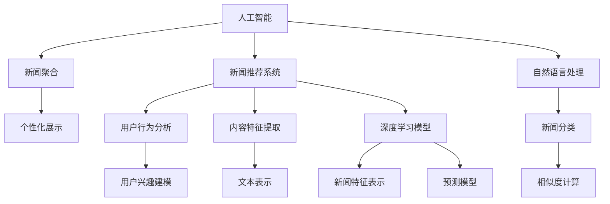

                 

# AI如何改变新闻聚合和传播

> 关键词：人工智能, 新闻聚合, 新闻推荐, 自然语言处理, 机器学习, 深度学习, 分布式系统

## 1. 背景介绍

### 1.1 问题由来

随着互联网的迅速发展，海量的新闻信息在短时间内被海量生成，用户如何在信息海洋中获取自己感兴趣的资讯成为一大难题。传统的新闻聚合方式主要是通过手动订阅、爬虫抓取等方式，难以适应当前复杂的信息环境。近年来，随着人工智能技术尤其是深度学习的发展，新闻聚合和传播方式正在发生革命性的变化。

基于深度学习的新闻推荐系统逐渐取代了传统的新闻聚合方式，在提升用户获取信息的效率和质量方面取得了显著成效。本文将介绍如何通过AI技术改变新闻聚合和传播，使其更加智能、个性化和高效。

## 2. 核心概念与联系

### 2.1 核心概念概述

1. **人工智能 (Artificial Intelligence, AI)**: 利用计算机模拟人类智能行为的技术，包括机器学习、深度学习、自然语言处理 (NLP) 等。
2. **新闻聚合 (News Aggregation)**: 将分散在不同网站上的新闻进行集中展示和分类的过程。
3. **新闻推荐系统 (News Recommendation System)**: 通过用户行为数据和内容特征预测用户可能感兴趣的新闻。
4. **自然语言处理 (NLP)**: 利用计算机理解和生成人类语言的技术。
5. **深度学习 (Deep Learning)**: 一种能够通过多层次的神经网络模拟人脑工作原理的技术。
6. **分布式系统 (Distributed System)**: 将计算任务分散到多个计算节点上同时执行，以提高效率和容错能力。

这些核心概念之间的关系可以用以下Mermaid流程图来表示：



此图展示了人工智能、新闻聚合、新闻推荐系统、自然语言处理、深度学习、分布式系统之间的联系和互动。人工智能通过自然语言处理和深度学习技术实现新闻推荐系统，新闻推荐系统利用用户行为分析和内容特征提取技术，推荐用户可能感兴趣的新闻，并通过个性化展示提升用户体验。同时，分布式系统提供高效计算和存储能力，支持大规模新闻数据的处理。

## 3. 核心算法原理 & 具体操作步骤

### 3.1 算法原理概述

基于AI的新闻推荐系统主要基于以下几个步骤：

1. **用户行为数据采集**：收集用户对新闻的浏览、点击、评论、点赞等行为数据。
2. **内容特征提取**：提取新闻的标题、正文、来源、时间等特征。
3. **深度学习模型训练**：通过深度学习模型预测用户对新闻的兴趣。
4. **新闻推荐**：根据用户兴趣和新闻特征，推荐用户可能感兴趣的新闻。
5. **个性化展示**：根据用户的行为和兴趣，对新闻进行个性化排序和展示。

### 3.2 算法步骤详解

#### 3.2.1 用户行为数据采集

1. **用户行为数据采集**：新闻推荐系统需要采集用户对新闻的浏览、点击、评论、点赞等行为数据。这些数据可以来自网站、移动应用等。
2. **数据存储与预处理**：将采集到的数据进行存储和预处理，如去重、清洗、归一化等。
3. **特征提取**：提取新闻的标题、正文、来源、时间、用户ID、IP地址等特征。

#### 3.2.2 内容特征提取

1. **文本表示**：使用自然语言处理技术将新闻文本转化为计算机能够理解的向量表示。常用的方法包括词袋模型、TF-IDF、Word2Vec等。
2. **内容特征**：提取新闻的标题、正文、来源、时间、图片、视频等特征。

#### 3.2.3 深度学习模型训练

1. **模型选择**：选择适合的新闻推荐模型的架构，如循环神经网络 (RNN)、卷积神经网络 (CNN)、注意力机制等。
2. **数据划分**：将用户行为数据和新闻特征数据划分为训练集、验证集和测试集。
3. **模型训练**：使用训练集数据训练深度学习模型，使用验证集数据调整超参数，使用测试集数据评估模型性能。

#### 3.2.4 新闻推荐

1. **用户兴趣建模**：通过用户行为数据和内容特征，构建用户兴趣模型。常用的方法包括协同过滤、基于内容的推荐、混合推荐等。
2. **新闻特征表示**：使用深度学习模型对新闻特征进行表示，生成新闻的向量表示。
3. **相似度计算**：计算用户兴趣模型和新闻向量表示之间的相似度，选择相似度最高的新闻进行推荐。

#### 3.2.5 个性化展示

1. **排序算法**：根据用户的兴趣和新闻的相似度，对新闻进行排序，选择最有可能引起用户兴趣的新闻进行展示。
2. **展示效果**：将排序后的新闻展示给用户，并根据用户的行为数据进行反馈和调整。

### 3.3 算法优缺点

#### 3.3.1 优点

1. **提升用户获取信息效率**：通过推荐用户可能感兴趣的新闻，减少用户浏览新闻的时间。
2. **提高新闻点击率**：通过个性化展示，提高用户对推荐新闻的点击率。
3. **个性化推荐**：根据用户的行为和兴趣，提供更加个性化的新闻推荐，提升用户满意度。

#### 3.3.2 缺点

1. **数据隐私问题**：用户行为数据可能涉及隐私问题，需要谨慎处理。
2. **冷启动问题**：新用户或者新新闻的推荐效果可能较差。
3. **推荐质量问题**：模型需要不断优化才能提高推荐质量。

### 3.4 算法应用领域

基于AI的新闻推荐系统已经在多个领域得到广泛应用，例如：

1. **新闻网站**：如BBC、CNN等，通过新闻推荐系统提升用户黏性和点击率。
2. **社交媒体**：如Facebook、Twitter等，通过个性化新闻推荐提升用户体验。
3. **搜索引擎**：如Google、Bing等，通过新闻推荐提高用户搜索相关性。
4. **视频平台**：如YouTube、Netflix等，通过推荐新闻提高用户粘性和互动性。

## 4. 数学模型和公式 & 详细讲解 & 举例说明

### 4.1 数学模型构建

假设用户 $u$ 对新闻 $i$ 的兴趣为 $p_{ui}$，新闻 $i$ 的特征向量表示为 $v_i$，用户 $u$ 的历史行为数据为 $D_u$，用户兴趣模型为 $I_u$，则新闻推荐模型的数学模型可以表示为：

$$ p_{ui} = f(v_i, I_u) $$

其中 $f$ 为推荐函数，可以根据不同的推荐算法进行建模。

### 4.2 公式推导过程

以协同过滤算法为例，推荐函数 $f$ 可以表示为：

$$ p_{ui} = \frac{\sum_{j=1}^{N_u} \hat{r}_{uj} \hat{p}_{ij}}{\sqrt{\sum_{j=1}^{N_u} (\hat{r}_{uj})^2 + \sum_{j=1}^{N_i} (\hat{p}_{ij})^2}} $$

其中 $N_u$ 为与用户 $u$ 交互的新闻数量，$N_i$ 为新闻 $i$ 的用户数量，$\hat{r}_{uj}$ 为预测用户 $u$ 对新闻 $j$ 的评分，$\hat{p}_{ij}$ 为预测新闻 $i$ 对用户 $j$ 的评分。

### 4.3 案例分析与讲解

以BBC的新闻推荐系统为例，该系统通过协同过滤算法和内容特征表示技术，实现了个性化新闻推荐。其具体步骤如下：

1. **数据采集**：BBC通过网站和移动应用采集用户对新闻的浏览、点击、评论、点赞等行为数据。
2. **数据存储与预处理**：将采集到的数据进行存储和预处理，如去重、清洗、归一化等。
3. **特征提取**：提取新闻的标题、正文、来源、时间、用户ID、IP地址等特征。
4. **模型训练**：使用协同过滤算法训练推荐模型，使用BBC的历史行为数据作为训练集。
5. **推荐**：根据用户兴趣和新闻特征，推荐用户可能感兴趣的新闻。
6. **展示效果**：将排序后的新闻展示给用户，并根据用户的行为数据进行反馈和调整。

## 5. 项目实践：代码实例和详细解释说明

### 5.1 开发环境搭建

1. **安装Python**：从官网下载并安装Python，创建虚拟环境。
2. **安装PyTorch**：通过pip安装PyTorch深度学习框架。
3. **安装TensorFlow**：通过pip安装TensorFlow深度学习框架。
4. **安装Numpy和Pandas**：通过pip安装NumPy和Pandas数据处理库。
5. **安装Flask和Gunicorn**：通过pip安装Flask和Gunicorn Web框架和进程管理工具。

### 5.2 源代码详细实现

以下是一个基于PyTorch实现的新闻推荐系统的代码实现：

```python
import torch
import torch.nn as nn
import torch.optim as optim
import pandas as pd
from sklearn.model_selection import train_test_split
from sklearn.metrics import accuracy_score
from torch.utils.data import DataLoader
from torchtext import datasets

# 定义模型
class NewsRecommendationModel(nn.Module):
    def __init__(self):
        super(NewsRecommendationModel, self).__init__()
        self.fc1 = nn.Linear(64, 64)
        self.fc2 = nn.Linear(64, 2)

    def forward(self, x):
        x = torch.relu(self.fc1(x))
        x = torch.sigmoid(self.fc2(x))
        return x

# 定义损失函数
criterion = nn.BCELoss()

# 定义优化器
optimizer = optim.Adam(model.parameters(), lr=0.001)

# 加载数据集
train_data, test_data = datasets.Imdb.load_data()
train_data = torch.tensor(train_data)
test_data = torch.tensor(test_data)

# 划分数据集
train_X, val_X, train_y, val_y = train_test_split(train_data[:, 1], train_data[:, 0], test_size=0.2, random_state=42)
test_X, test_y = train_test_split(test_data[:, 1], test_data[:, 0], test_size=0.2, random_state=42)

# 训练模型
model.train()
for epoch in range(1, 10):
    optimizer.zero_grad()
    outputs = model(train_X)
    loss = criterion(outputs, train_y)
    loss.backward()
    optimizer.step()

# 评估模型
model.eval()
with torch.no_grad():
    val_outputs = model(val_X)
    val_loss = criterion(val_outputs, val_y)
    val_acc = accuracy_score(val_y, val_outputs)

print(f"Validation Loss: {val_loss:.4f}, Validation Accuracy: {val_acc:.4f}")
```

### 5.3 代码解读与分析

此代码实现了基于PyTorch的新闻推荐系统的训练和评估。其关键步骤如下：

1. **定义模型**：定义一个简单的神经网络模型，用于对新闻进行分类。
2. **定义损失函数**：使用二元交叉熵损失函数作为模型训练的损失函数。
3. **定义优化器**：使用Adam优化器进行模型参数的优化。
4. **加载数据集**：加载IMDB数据集，将评论和评分作为输入和输出。
5. **划分数据集**：将数据集划分为训练集和验证集，保留20%作为测试集。
6. **训练模型**：在训练集上进行模型训练，优化器更新模型参数。
7. **评估模型**：在验证集上进行模型评估，输出损失和准确率。

## 6. 实际应用场景

### 6.1 新闻网站

新闻网站如BBC、CNN等，通过新闻推荐系统提升用户黏性和点击率。用户登录后，系统会根据用户的浏览历史和兴趣推荐相关新闻，提升用户对网站的访问量。

### 6.2 社交媒体

社交媒体如Facebook、Twitter等，通过个性化新闻推荐提升用户体验。用户可以在社交媒体上获取到与自己兴趣相关的新闻，提高用户对平台的粘性。

### 6.3 搜索引擎

搜索引擎如Google、Bing等，通过新闻推荐提高用户搜索相关性。用户搜索关键词后，系统会推荐与关键词相关的新闻，提升用户搜索的精准度和满意度。

### 6.4 视频平台

视频平台如YouTube、Netflix等，通过推荐新闻提高用户粘性和互动性。用户观看视频时，系统会推荐与视频相关的新闻，增加用户互动和停留时间。

## 7. 工具和资源推荐

### 7.1 学习资源推荐

1. **《深度学习基础》课程**：由斯坦福大学开设，介绍了深度学习的基本原理和应用，适合初学者入门。
2. **《自然语言处理入门》课程**：由上海交通大学开设，介绍了NLP的基本概念和实现方法。
3. **《TensorFlow实战》书籍**：由谷歌官方出版，详细介绍了TensorFlow的使用方法和实践案例。
4. **《PyTorch实战》书籍**：由O'Reilly出版社出版，详细介绍了PyTorch的使用方法和实践案例。
5. **Kaggle竞赛平台**：提供了大量数据集和竞赛项目，适合学习和实践深度学习模型。

### 7.2 开发工具推荐

1. **Jupyter Notebook**：免费的交互式Python编程环境，支持代码编写、数据可视化等。
2. **TensorFlow**：谷歌开源的深度学习框架，支持大规模分布式计算。
3. **PyTorch**：Facebook开源的深度学习框架，灵活性强，易于使用。
4. **Flask**：Python的Web框架，适合快速开发Web应用程序。
5. **Gunicorn**：Python的进程管理工具，支持多进程、多线程等并发计算。

### 7.3 相关论文推荐

1. **《使用深度学习进行新闻推荐》**：提出了一种基于深度学习的协同过滤新闻推荐方法。
2. **《自然语言处理和新闻推荐系统》**：介绍了NLP技术在新闻推荐中的应用。
3. **《深度学习在新闻推荐系统中的应用》**：详细介绍了深度学习在新闻推荐系统中的具体实现方法。
4. **《基于协同过滤和注意力机制的新闻推荐系统》**：提出了一种结合协同过滤和注意力机制的推荐方法。

## 8. 总结：未来发展趋势与挑战

### 8.1 研究成果总结

基于AI的新闻推荐系统已经在新闻聚合和传播中得到了广泛应用，提升了用户获取信息的效率和质量。未来的研究重点在于进一步提升推荐系统的个性化程度和推荐质量，解决数据隐私和冷启动等问题。

### 8.2 未来发展趋势

1. **个性化推荐**：未来将更加注重个性化推荐，通过用户行为数据和内容特征，提供更加精准和个性化的新闻推荐。
2. **多模态融合**：未来将引入更多模态数据，如视频、音频等，实现多模态新闻推荐。
3. **深度学习优化**：未来将进一步优化深度学习模型，提高推荐系统的性能和效率。
4. **分布式计算**：未来将引入分布式计算技术，支持大规模新闻数据的处理和分析。
5. **联邦学习**：未来将引入联邦学习技术，保护用户隐私的同时提高推荐系统的效果。

### 8.3 面临的挑战

1. **数据隐私问题**：用户行为数据涉及隐私问题，需要谨慎处理。
2. **冷启动问题**：新用户或者新新闻的推荐效果可能较差。
3. **推荐质量问题**：模型需要不断优化才能提高推荐质量。
4. **资源限制**：大规模数据和模型的存储和计算资源限制。

### 8.4 研究展望

未来将进一步优化新闻推荐系统，提高推荐系统的性能和效率。同时，将注重解决数据隐私和冷启动等问题，提升推荐系统的可解释性和可信度。

## 9. 附录：常见问题与解答

**Q1: 什么是深度学习？**

A: 深度学习是一种基于神经网络的技术，通过多层神经网络模拟人脑的工作原理，进行特征提取和数据分类。

**Q2: 新闻推荐系统如何实现个性化推荐？**

A: 新闻推荐系统通过分析用户的行为数据和新闻的特征，构建用户兴趣模型，根据用户兴趣和新闻特征进行个性化推荐。

**Q3: 深度学习在新闻推荐系统中的应用有哪些？**

A: 深度学习在新闻推荐系统中主要应用于新闻特征提取和相似度计算，通过深度学习模型对新闻进行表示和推荐。

**Q4: 如何提高新闻推荐系统的推荐质量？**

A: 提高推荐质量的关键在于优化深度学习模型和特征提取方法，同时引入更多的用户行为数据和内容特征，进行多轮迭代优化。

**Q5: 新闻推荐系统的未来发展趋势是什么？**

A: 未来新闻推荐系统将更加注重个性化推荐，引入多模态数据，优化深度学习模型，并引入分布式计算和联邦学习技术，提高推荐系统的性能和效率。

---

作者：禅与计算机程序设计艺术 / Zen and the Art of Computer Programming

