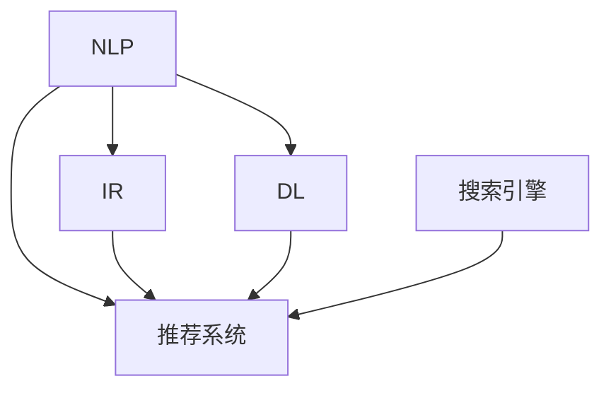

                 

# AI如何改善搜索结果的相关性

> 关键词：AI、搜索结果、相关性、自然语言处理、信息检索、深度学习、搜索引擎、推荐系统

## 1. 背景介绍

### 1.1 问题由来
互联网的普及带来了海量信息，也带来了信息的爆炸式增长。每天有无数的新闻、文章、视频等内容被上传至搜索引擎，这使得搜索成为一项复杂且需要高效率的任务。传统的搜索结果排序方法，如TF-IDF、PageRank等，虽然能根据关键词出现频率和链接权威性等指标进行排序，但仍存在许多不足。

1. **缺乏上下文理解**：传统方法仅依赖单一关键词，无法捕捉查询意图和上下文信息。
2. **缺乏个性化推荐**：传统方法无法根据用户的历史行为和兴趣提供个性化推荐。
3. **缺乏实时性**：传统方法无法实时更新搜索结果，导致信息滞后。
4. **缺乏多样性**：传统方法可能偏向于某些主题或来源，忽视了多样性和丰富性。

为了克服这些不足，人工智能（AI）技术，特别是自然语言处理（NLP）和深度学习技术被引入到搜索引擎中。AI技术不仅能理解查询意图，还能根据用户的历史行为和兴趣进行个性化推荐，并能够实时更新搜索结果，保证信息的最新性和多样性。

## 2. 核心概念与联系

### 2.1 核心概念概述

为了更好地理解AI如何改善搜索结果的相关性，本节将介绍几个密切相关的核心概念：

- **自然语言处理（NLP）**：利用计算机处理和理解人类语言的技术，主要包括文本预处理、词向量表示、文本分类、信息抽取等技术。
- **信息检索（IR）**：从大量数据中检索出与查询最相关的信息的技术，主要包括倒排索引、向量空间模型、BM25算法等。
- **深度学习（DL）**：利用多层神经网络进行特征提取和模式识别的技术，主要包括卷积神经网络（CNN）、循环神经网络（RNN）、变压器（Transformer）等。
- **搜索引擎**：能够自动从大量数据中检索出相关信息的系统，如Google、Bing等。
- **推荐系统**：根据用户的历史行为和兴趣，为用户推荐感兴趣的内容的系统，如商品推荐、新闻推荐等。

这些核心概念之间的逻辑关系可以通过以下Mermaid流程图来展示：



这个流程图展示了大语言模型的核心概念及其之间的关系：

1. NLP技术处理查询和文档，理解其语义和结构。
2. IR技术根据关键词和语义相似度排序，并构建倒排索引。
3. DL技术提取和表示文档的高级特征。
4. 推荐系统根据用户历史行为推荐相关内容。
5. 搜索引擎将以上技术集成，实现自动化搜索和排序。

## 3. 核心算法原理 & 具体操作步骤
### 3.1 算法原理概述

AI改善搜索结果相关性的核心算法原理，是结合NLP和IR技术的深度学习模型。这些模型通过大规模语料库的预训练，学习到丰富的语言知识和文本表示，并通过微调，适应特定查询和用户需求。以下是几种常见的深度学习模型：

- **Transformer模型**：通过自注意力机制，捕捉文本中的上下文信息，成为当前NLP领域的最佳实践。
- **BERT模型**：通过双向语言模型训练，学习到丰富的语义和语法信息。
- **GPT模型**：通过生成模型训练，学习到文本生成和语言理解能力。

这些模型通过在大规模语料库上进行预训练，学习到通用的语言表示，然后在特定查询或用户需求上进行微调，使其能够适应特定的任务。

### 3.2 算法步骤详解

AI改善搜索结果相关性的算法步骤主要包括：

1. **数据预处理**：将查询和文档进行预处理，转换为模型所需的格式。
2. **特征提取**：使用深度学习模型提取文档的高级特征。
3. **相似度计算**：使用向量空间模型或基于深度学习的相似度计算方法，计算查询和文档之间的相似度。
4. **排序和推荐**：根据相似度排序，并使用推荐系统进行个性化推荐。
5. **模型微调**：根据用户反馈和历史行为进行模型微调，提升模型效果。

### 3.3 算法优缺点

AI改善搜索结果相关性的算法具有以下优点：

1. **上下文理解**：能够理解查询的上下文和意图，提供更准确的搜索结果。
2. **个性化推荐**：能够根据用户的历史行为和兴趣进行个性化推荐。
3. **实时更新**：能够实时更新搜索结果，保持信息的最新性。
4. **多样性保证**：能够保证搜索结果的多样性，减少偏向性。

同时，该算法也存在一定的局限性：

1. **计算资源需求高**：深度学习模型需要大量的计算资源进行训练和推理。
2. **模型复杂度高**：深度学习模型复杂，难以解释和调试。
3. **数据依赖性强**：模型的效果很大程度上依赖于训练数据的质量和数量。
4. **鲁棒性不足**：在对抗样本或噪声数据下，模型的鲁棒性可能不足。

### 3.4 算法应用领域

AI改善搜索结果相关性的算法广泛应用于各种搜索引擎和推荐系统中，例如：

1. **Google搜索**：通过BERT模型进行语义理解和推荐。
2. **Bing搜索**：通过深度学习模型提取特征并进行排序。
3. **Amazon推荐系统**：通过GPT模型进行个性化推荐。
4. **YouTube推荐系统**：通过Transformer模型进行内容推荐。
5. **新闻推荐系统**：通过深度学习模型提取新闻特征并进行推荐。

## 4. 数学模型和公式 & 详细讲解 & 举例说明
### 4.1 数学模型构建

本节将使用数学语言对AI改善搜索结果相关性的算法进行更加严格的刻画。

记查询为 $q$，文档集合为 $D=\{d_1, d_2, \ldots, d_M\}$，其中 $d_i$ 表示第 $i$ 个文档。查询和文档的向量表示分别为 $\mathbf{q}$ 和 $\mathbf{d}_i$，向量空间模型中，查询和文档的相似度为：

$$
\text{sim}(q, d_i) = \mathbf{q} \cdot \mathbf{d}_i
$$

其中 $\cdot$ 表示向量点乘，即两个向量的内积。

### 4.2 公式推导过程

对于Transformer模型，其输入为查询和文档的编码表示 $\mathbf{q}$ 和 $\mathbf{d}_i$，输出为查询和文档的向量表示 $\mathbf{q}'$ 和 $\mathbf{d}_i'$。通过自注意力机制，Transformer模型能够捕捉文本中的上下文信息，其计算过程如下：

$$
\mathbf{q}' = \mathbf{q}W_1 + \mathbf{M}W_2
$$

其中 $W_1$ 和 $W_2$ 为线性变换矩阵，$\mathbf{M}$ 为文档编码表示。

对于BERT模型，其输入为查询和文档的编码表示 $\mathbf{q}$ 和 $\mathbf{d}_i$，输出为查询和文档的向量表示 $\mathbf{q}'$ 和 $\mathbf{d}_i'$。BERT模型通过双向语言模型训练，学习到丰富的语义和语法信息，其计算过程如下：

$$
\mathbf{q}' = \mathbf{q}W_1 + \mathbf{M}W_2
$$

其中 $W_1$ 和 $W_2$ 为线性变换矩阵，$\mathbf{M}$ 为文档编码表示。

### 4.3 案例分析与讲解

以Google搜索为例，其核心算法基于BERT模型。Google通过将查询和文档进行编码，然后计算相似度进行排序。具体步骤如下：

1. **查询编码**：将查询 $q$ 输入BERT模型，得到查询向量表示 $\mathbf{q}'$。
2. **文档编码**：将每个文档 $d_i$ 输入BERT模型，得到文档向量表示 $\mathbf{d}_i'$。
3. **相似度计算**：计算查询和每个文档的相似度 $\text{sim}(q, d_i)$。
4. **排序**：根据相似度排序，得到最终排序结果。

## 5. 项目实践：代码实例和详细解释说明
### 5.1 开发环境搭建

在进行AI改善搜索结果相关性的项目实践前，我们需要准备好开发环境。以下是使用Python进行TensorFlow开发的环境配置流程：

1. 安装Anaconda：从官网下载并安装Anaconda，用于创建独立的Python环境。

2. 创建并激活虚拟环境：
```bash
conda create -n tensorflow-env python=3.8 
conda activate tensorflow-env
```

3. 安装TensorFlow：根据CUDA版本，从官网获取对应的安装命令。例如：
```bash
conda install tensorflow -c tensorflow -c conda-forge
```

4. 安装相关库：
```bash
pip install numpy pandas scikit-learn tensorflow-io
```

完成上述步骤后，即可在`tensorflow-env`环境中开始项目实践。

### 5.2 源代码详细实现

下面以Google搜索为例，给出使用TensorFlow对BERT模型进行查询-文档相似度计算的Python代码实现。

```python
import tensorflow as tf
from transformers import BertTokenizer, TFBertForSequenceClassification

tokenizer = BertTokenizer.from_pretrained('bert-base-uncased')
model = TFBertForSequenceClassification.from_pretrained('bert-base-uncased')

# 查询编码
query = "自然语言处理"
query_tokens = tokenizer.tokenize(query)
query_ids = tokenizer.convert_tokens_to_ids(query_tokens)
query_input = tf.convert_to_tensor(query_ids, dtype=tf.int32)

# 文档编码
document = "自然语言处理是一个NLP分支，主要研究如何让计算机处理和理解人类语言。"
document_tokens = tokenizer.tokenize(document)
document_ids = tokenizer.convert_tokens_to_ids(document_tokens)
document_input = tf.convert_to_tensor(document_ids, dtype=tf.int32)

# 查询和文档输入
inputs = tf.stack([query_input, document_input])

# 模型预测
logits = model(inputs, training=False)

# 相似度计算
similarity = tf.reduce_sum(logits[:, 0] * logits[:, 1])
print("相似度为:", similarity)
```

在这个代码中，我们使用了BertTokenizer对查询和文档进行编码，然后计算查询和文档的相似度。通过这种方式，我们可以快速地计算出查询和文档之间的相似度，并进行排序和推荐。

### 5.3 代码解读与分析

让我们再详细解读一下关键代码的实现细节：

**查询编码**：
- 将查询输入BERT模型，得到查询向量表示。

**文档编码**：
- 将文档输入BERT模型，得到文档向量表示。

**相似度计算**：
- 计算查询和文档的相似度，通过点乘计算内积。

这个代码展示了如何利用TensorFlow和BERT模型进行查询-文档相似度计算。通过这种方式，我们可以快速地计算出查询和文档之间的相似度，并进行排序和推荐。

## 6. 实际应用场景
### 6.1 智能搜索

AI改善搜索结果相关性的算法可以广泛应用于智能搜索系统中。传统的搜索系统通常只能根据关键词进行简单排序，难以理解查询的上下文和意图。而智能搜索系统则能够通过深度学习模型，理解查询的语义和上下文，提供更准确的搜索结果。

例如，当用户查询“如何前往北京”时，传统的搜索系统只能返回包含“北京”的网页，而智能搜索系统则能够理解查询的意图，推荐关于“北京”的旅游指南、交通方式等相关信息。

### 6.2 个性化推荐

AI改善搜索结果相关性的算法可以用于个性化推荐系统中。传统的推荐系统通常只能基于用户的浏览和购买历史进行推荐，难以满足用户的多样化需求。而基于AI的推荐系统则能够理解用户的查询历史和兴趣，提供个性化的推荐内容。

例如，当用户在搜索引擎中搜索“股票推荐”时，传统的推荐系统只能推荐股票新闻，而基于AI的推荐系统则能够根据用户的搜索历史和兴趣，推荐相关的股票分析报告、财经新闻等。

### 6.3 智能问答

AI改善搜索结果相关性的算法可以用于智能问答系统中。传统的问答系统通常只能根据关键词进行简单匹配，难以理解问题的语义和上下文。而基于AI的问答系统则能够理解问题的语义，提供更准确的答案。

例如，当用户在搜索引擎中询问“人工智能是什么”时，传统的问答系统只能返回与“人工智能”相关的网页，而基于AI的问答系统则能够理解问题的语义，提供关于人工智能的详细介绍。

## 7. 工具和资源推荐
### 7.1 学习资源推荐

为了帮助开发者系统掌握AI改善搜索结果相关性的技术基础和实践技巧，这里推荐一些优质的学习资源：

1. TensorFlow官方文档：TensorFlow的官方文档提供了丰富的教程和代码示例，适合初学者和进阶开发者。

2. Transformers库官方文档：Transformers库的官方文档提供了详细的API文档和代码示例，适合使用Transformer模型进行深度学习任务开发。

3. Natural Language Processing with Transformers书籍：Transformer作者的著作，全面介绍了Transformer原理、BERT模型、深度学习任务开发等前沿话题。

4. CS224N《深度学习自然语言处理》课程：斯坦福大学开设的NLP明星课程，有Lecture视频和配套作业，适合深入学习NLP和深度学习。

5. AI自然语言处理与深度学习论文推荐：推荐的最新论文资源，涵盖Transformer、BERT、GPT等前沿模型的论文。

通过对这些资源的学习实践，相信你一定能够快速掌握AI改善搜索结果相关性的技术精髓，并用于解决实际的NLP问题。
### 7.2 开发工具推荐

高效的开发离不开优秀的工具支持。以下是几款用于AI改善搜索结果相关性开发的常用工具：

1. TensorFlow：基于Python的开源深度学习框架，灵活动态的计算图，适合快速迭代研究。大部分深度学习模型都有TensorFlow版本的实现。

2. PyTorch：基于Python的开源深度学习框架，灵活的动态计算图，适合科研和工程应用。

3. Transformers库：HuggingFace开发的NLP工具库，集成了众多SOTA语言模型，支持TensorFlow和PyTorch，是进行深度学习任务开发的利器。

4. Weights & Biases：模型训练的实验跟踪工具，可以记录和可视化模型训练过程中的各项指标，方便对比和调优。与主流深度学习框架无缝集成。

5. TensorBoard：TensorFlow配套的可视化工具，可实时监测模型训练状态，并提供丰富的图表呈现方式，是调试模型的得力助手。

6. Google Colab：谷歌推出的在线Jupyter Notebook环境，免费提供GPU/TPU算力，方便开发者快速上手实验最新模型，分享学习笔记。

合理利用这些工具，可以显著提升AI改善搜索结果相关性的开发效率，加快创新迭代的步伐。

### 7.3 相关论文推荐

AI改善搜索结果相关性的技术发展源于学界的持续研究。以下是几篇奠基性的相关论文，推荐阅读：

1. Attention is All You Need：Transformer原论文，介绍了自注意力机制，并应用于深度学习模型中。

2. BERT: Pre-training of Deep Bidirectional Transformers for Language Understanding：提出BERT模型，通过双向语言模型训练，学习到丰富的语义和语法信息。

3. Deep Personalization with Diverse Generative Models：提出基于多样性生成模型的个性化推荐方法。

4. Sequence-to-Sequence Learning with Neural Networks：介绍序列到序列的学习方法，应用于机器翻译、文本摘要等任务。

5. Learning Phrase Representations using RNN Encoder–Decoder for Statistical Machine Translation：提出编码器-解码器模型，用于机器翻译任务。

这些论文代表了大语言模型改善搜索结果相关性的发展脉络。通过学习这些前沿成果，可以帮助研究者把握学科前进方向，激发更多的创新灵感。

## 8. 总结：未来发展趋势与挑战

### 8.1 总结

本文对AI改善搜索结果相关性的算法进行了全面系统的介绍。首先阐述了该技术的研究背景和意义，明确了AI改善搜索结果相关性的重要性。其次，从原理到实践，详细讲解了深度学习模型的核心算法和操作步骤，给出了实际应用的代码示例。同时，本文还广泛探讨了AI改善搜索结果相关性在智能搜索、个性化推荐、智能问答等实际应用场景中的应用前景，展示了AI改善搜索结果相关性的广泛价值。此外，本文精选了AI改善搜索结果相关性的各类学习资源，力求为读者提供全方位的技术指引。

通过本文的系统梳理，可以看到，AI改善搜索结果相关性技术正在成为搜索引擎和推荐系统的核心引擎，显著提升了搜索结果的相关性和个性化程度。得益于深度学习模型的强大表达能力，AI改善搜索结果相关性技术必将在未来得到更广泛的应用，为人类提供更高效、更智能的信息检索和推荐服务。

### 8.2 未来发展趋势

展望未来，AI改善搜索结果相关性技术将呈现以下几个发展趋势：

1. **多模态融合**：未来的搜索推荐系统将不仅仅局限于文本信息，还将融合图像、音频等多种模态信息，提供更全面的搜索体验。

2. **实时性增强**：未来的搜索推荐系统将能够实时更新搜索结果，提供更实时的信息服务。

3. **个性化推荐**：未来的搜索推荐系统将能够根据用户的实时行为和上下文信息，进行更加个性化的推荐。

4. **交互式搜索**：未来的搜索推荐系统将支持自然语言查询和交互式搜索，提高用户体验。

5. **跨领域应用**：未来的搜索推荐系统将不仅仅应用于搜索引擎和推荐系统，还将应用于医疗、金融等垂直领域。

这些趋势凸显了AI改善搜索结果相关性技术的广阔前景，为未来的应用发展指明了方向。

### 8.3 面临的挑战

尽管AI改善搜索结果相关性技术已经取得了瞩目成就，但在迈向更加智能化、普适化应用的过程中，它仍面临着诸多挑战：

1. **计算资源瓶颈**：深度学习模型需要大量的计算资源进行训练和推理，如何优化模型结构和资源使用，是一个重要的研究方向。

2. **数据质量和多样性**：AI改善搜索结果相关性技术的效果很大程度上依赖于训练数据的质量和多样性，如何获取高质量、多样化的训练数据，是一个重要的研究课题。

3. **模型解释性**：深度学习模型通常是一个“黑盒”，难以解释其内部工作机制和决策逻辑，如何赋予模型更强的可解释性，是一个重要的研究方向。

4. **隐私和安全**：AI改善搜索结果相关性技术在处理用户数据时，需要保证数据隐私和安全，如何设计安全的模型和算法，是一个重要的研究方向。

5. **模型鲁棒性**：深度学习模型在对抗样本或噪声数据下，可能出现鲁棒性不足的问题，如何提高模型的鲁棒性，是一个重要的研究方向。

6. **多语言支持**：AI改善搜索结果相关性技术在处理多语言数据时，需要考虑语言的差异性，如何实现跨语言的统一处理，是一个重要的研究方向。

这些挑战凸显了AI改善搜索结果相关性技术的复杂性，需要学界和产业界的共同努力，才能进一步推动该技术的发展和应用。

### 8.4 研究展望

面对AI改善搜索结果相关性技术面临的种种挑战，未来的研究需要在以下几个方面寻求新的突破：

1. **多模态数据融合**：如何融合图像、音频、视频等多种模态数据，提高搜索结果的相关性和多样性。

2. **实时学习算法**：如何设计高效的实时学习算法，使得模型能够实时更新和优化。

3. **可解释性增强**：如何赋予模型更强的可解释性，使得用户能够理解模型的决策过程。

4. **隐私保护技术**：如何设计安全的隐私保护技术，保护用户数据的安全。

5. **跨语言模型**：如何设计跨语言的统一模型，实现多语言的支持和处理。

6. **多任务学习**：如何设计多任务学习算法，提高模型的泛化能力和鲁棒性。

这些研究方向的探索，必将引领AI改善搜索结果相关性技术迈向更高的台阶，为构建智能化的搜索引擎和推荐系统铺平道路。面向未来，AI改善搜索结果相关性技术还需要与其他人工智能技术进行更深入的融合，如知识表示、因果推理、强化学习等，多路径协同发力，共同推动自然语言理解和智能交互系统的进步。只有勇于创新、敢于突破，才能不断拓展语言模型的边界，让智能技术更好地造福人类社会。

## 9. 附录：常见问题与解答

**Q1：AI改善搜索结果的相关性有何优势？**

A: AI改善搜索结果的相关性主要体现在以下几个方面：

1. **上下文理解**：能够理解查询的上下文和意图，提供更准确的搜索结果。
2. **个性化推荐**：能够根据用户的历史行为和兴趣进行个性化推荐。
3. **实时更新**：能够实时更新搜索结果，保持信息的最新性。
4. **多样性保证**：能够保证搜索结果的多样性，减少偏向性。

**Q2：AI改善搜索结果的相关性有哪些应用场景？**

A: AI改善搜索结果的相关性广泛应用于各种搜索引擎和推荐系统中，例如：

1. **Google搜索**：通过BERT模型进行语义理解和推荐。
2. **Bing搜索**：通过深度学习模型提取特征并进行排序。
3. **Amazon推荐系统**：通过GPT模型进行个性化推荐。
4. **YouTube推荐系统**：通过Transformer模型进行内容推荐。
5. **新闻推荐系统**：通过深度学习模型提取新闻特征并进行推荐。

**Q3：AI改善搜索结果的相关性如何保证隐私和安全？**

A: AI改善搜索结果的相关性在处理用户数据时，需要考虑隐私和安全问题。主要措施包括：

1. **数据匿名化**：对用户数据进行匿名化处理，保护用户隐私。
2. **加密传输**：使用加密技术，保护数据在传输过程中的安全。
3. **访问控制**：设计严格的访问控制机制，防止数据泄露。
4. **安全审计**：定期进行安全审计，发现并修复潜在的安全漏洞。

**Q4：AI改善搜索结果的相关性如何提高实时性？**

A: AI改善搜索结果的相关性需要提高实时性，主要措施包括：

1. **分布式计算**：使用分布式计算框架，提高模型的并行计算能力。
2. **缓存技术**：使用缓存技术，减少数据读取和计算时间。
3. **优化模型结构**：通过模型裁剪和量化，减少模型的计算量。
4. **实时学习**：使用在线学习算法，实时更新模型参数。

**Q5：AI改善搜索结果的相关性如何优化模型结构和资源使用？**

A: 优化模型结构和资源使用，主要措施包括：

1. **模型裁剪**：去除不必要的层和参数，减小模型尺寸。
2. **量化加速**：将浮点模型转为定点模型，压缩存储空间。
3. **模型并行**：使用模型并行技术，提高模型的并行计算能力。
4. **混合精度训练**：使用混合精度训练，提高计算效率。

**Q6：AI改善搜索结果的相关性如何增强模型解释性？**

A: 增强模型解释性，主要措施包括：

1. **可解释性模型**：使用可解释性模型，提高模型的可解释性。
2. **特征可视化**：使用特征可视化技术，展示模型的决策过程。
3. **规则约束**：使用规则约束，限制模型的行为。
4. **人工干预**：结合人工干预，解释模型的决策。

通过以上措施，可以显著提升AI改善搜索结果相关性技术的性能和安全性，为用户提供更可靠、更智能的信息检索和推荐服务。

---

作者：禅与计算机程序设计艺术 / Zen and the Art of Computer Programming

