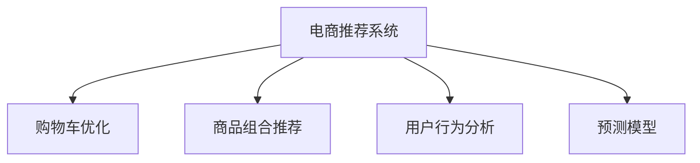

                 

# AI如何改善电商平台的购物车商品组合推荐

> 关键词：AI算法,电商推荐,购物车优化,商品组合推荐,用户行为分析,预测模型

## 1. 背景介绍

### 1.1 问题由来

在电商平台的日常运营中，购物车商品组合推荐是一个至关重要的问题。有效的推荐系统不仅可以提高用户满意度和忠诚度，还能显著提升平台的销售转化率和营业收入。传统的基于规则的推荐系统往往过于简单，无法充分考虑用户的多样化需求和行为特征，而基于深度学习的推荐算法则因能挖掘出更加精细化的用户画像和商品关联，因此在推荐效果上有了显著提升。

然而，深度学习推荐系统的训练和优化过程复杂，对于小规模的电商平台来说，其高昂的算法复杂度和数据需求可能会成为难以跨越的障碍。因此，如何利用现有的深度学习技术，构建一个既高效又准确的推荐系统，成为了各大电商平台亟需解决的问题。

## 2. 核心概念与联系

### 2.1 核心概念概述

为更好地理解电商推荐系统的实现，本节将介绍几个密切相关的核心概念：

- **电商推荐系统(Online Recommendation System)**：利用AI算法对电商平台用户行为进行建模，实现个性化商品推荐，提高用户满意度和销售转化率的系统。

- **购物车优化(Cart Optimization)**：通过推荐系统引导用户将更多商品加入到购物车，并帮助用户做出最优的购买决策，从而提升平台的销售转化率和用户留存率。

- **商品组合推荐(Product Bundling)**：推荐系统不仅推荐单件商品，还推荐用户选择搭配的套装或组合商品，提升用户购买意愿，同时增加平台的SKU展示机会。

- **用户行为分析(User Behavior Analysis)**：通过对用户的浏览、点击、购买等行为数据进行分析，构建用户画像，为推荐系统提供更精准的输入。

- **预测模型(Prediction Model)**：使用AI算法训练预测模型，预测用户对商品组合的喜好程度，生成推荐结果。

这些核心概念之间的逻辑关系可以通过以下Mermaid流程图来展示：



这个流程图展示了几大核心概念之间的联系：

1. 电商推荐系统是整个推荐流程的入口，利用用户行为分析生成预测模型，进而进行购物车优化和商品组合推荐。
2. 购物车优化和商品组合推荐是电商推荐系统的具体应用，通过引导用户下单和组合购买，提升平台收益。
3. 用户行为分析是电商推荐系统的基础，通过对用户历史行为数据的挖掘，构建更精准的用户画像。
4. 预测模型是电商推荐系统的核心，通过深度学习等技术，实现用户对商品组合的喜好预测。

## 3. 核心算法原理 & 具体操作步骤

### 3.1 算法原理概述

电商平台的购物车商品组合推荐通常基于深度学习算法实现，核心思想是通过学习用户行为数据，构建商品-用户-组合的关系网络，预测用户对不同商品组合的偏好程度，从而生成个性化推荐。

形式化地，假设电商平台用户集为 $U$，商品集为 $I$，用户历史行为为 $B=\{(x_u,i_t,y_t)\}_{u \in U,t=1}^T$，其中 $x_u$ 为用户历史浏览记录，$i_t$ 为用户历史购买商品，$y_t$ 为用户对商品 $i_t$ 的评分。设用户对商品组合 $\{i_1,i_2,\dots,i_k\}$ 的评分 $y_{\{i_1,i_2,\dots,i_k\}}$ 为该组合的平均评分 $y_{i_1} \times y_{i_2} \times \dots \times y_{i_k}$。购物车优化和商品组合推荐的优化目标是最小化组合预测评分与实际评分 $y$ 之间的差距，即：

$$
\mathop{\min}_{\theta} \sum_{u \in U} \sum_{k=2}^K \left(y_{\{i_1,\dots,i_k\}} - \hat{y}_{\{i_1,\dots,i_k\}} \right)^2
$$

其中 $\theta$ 为预测模型的参数，$\hat{y}_{\{i_1,\dots,i_k\}}$ 为模型预测的组合评分。

### 3.2 算法步骤详解

基于深度学习的电商推荐系统一般包括以下几个关键步骤：

**Step 1: 准备数据集**

- 收集用户历史浏览和购买数据，进行数据清洗和预处理。
- 划分训练集、验证集和测试集，确保数据分布的一致性。
- 使用分词、归一化等技术对用户行为进行预处理。

**Step 2: 设计预测模型**

- 选择合适的深度学习模型，如RNN、LSTM、GRU等，构建用户行为表示。
- 根据电商推荐场景，设计合适的网络结构，如长短时记忆网络(LSTM)、双向LSTM(BiLSTM)等。
- 使用softmax或sigmoid等激活函数输出用户对商品组合的评分预测值。

**Step 3: 模型训练**

- 使用训练集数据，采用优化算法如Adam、SGD等训练预测模型，最小化损失函数。
- 在验证集上评估模型性能，使用交叉熵损失等指标进行模型调参。
- 调整超参数，如学习率、批大小、迭代轮数等，优化模型效果。

**Step 4: 模型测试与优化**

- 在测试集上评估模型性能，对比微调前后的精度提升。
- 使用A/B测试等方法，评估推荐效果对用户行为和销售的影响。
- 持续优化模型，如增加历史行为的时间窗口、引入交叉特征等，提升推荐效果。

**Step 5: 部署与应用**

- 将训练好的模型部署到电商平台的推荐系统中。
- 实时采集用户行为数据，使用推荐模型生成个性化推荐。
- 使用缓存等技术优化推荐性能，减少计算开销。

以上是电商推荐系统的核心步骤。在实际应用中，还需要根据平台的具体业务需求和数据特点，对各个环节进行优化设计，如改进数据表示方法、优化预测模型结构、应用正则化技术等。

### 3.3 算法优缺点

电商平台的购物车商品组合推荐基于深度学习的算法具有以下优点：

1. 准确度高。深度学习模型通过学习大量用户行为数据，能够挖掘出用户对商品组合的深层次关联和喜好。
2. 适应性强。深度学习模型能够适应电商平台的业务模式变化，对新商品和新用户有较强的泛化能力。
3. 自动化程度高。深度学习模型自动完成特征提取和模型训练，减少了人工干预和特征工程的工作量。
4. 可扩展性强。深度学习模型能够轻松扩展到多模态数据，如文本、图片、视频等，进一步提升推荐效果。

同时，该方法也存在一定的局限性：

1. 数据依赖大。深度学习模型需要大量标注数据进行训练，对于小规模电商平台来说，数据获取成本较高。
2. 训练时间长。电商平台的交易数据量庞大，深度学习模型需要较长时间才能完成训练。
3. 模型复杂度高。深度学习模型参数较多，对计算资源和存储空间的要求较高。
4. 预测结果难以解释。深度学习模型的预测结果通常缺乏可解释性，难以对其决策逻辑进行分析和调试。

尽管存在这些局限性，但深度学习推荐方法在电商平台的推荐实践中已经证明是行之有效的。未来相关研究的重点在于如何进一步降低对标注数据的依赖，提高模型的可解释性和可扩展性。

### 3.4 算法应用领域

电商平台的购物车商品组合推荐基于深度学习的算法已经在多个领域得到广泛应用，例如：

- **个性化推荐**：根据用户的历史浏览和购买行为，推荐可能感兴趣的商品。
- **库存管理**：预测哪些商品可能会卖断货，从而优化库存管理。
- **价格优化**：根据用户对不同价格组合的敏感度，推荐最优的定价策略。
- **用户增长**：通过推荐新商品和优惠活动，吸引新用户注册和购买。
- **个性化广告**：根据用户的浏览历史，推荐最相关的广告内容，提高广告投放效果。

除了上述这些经典应用外，基于深度学习推荐的电商技术也被创新性地应用于商品搭配推荐、用户分群、搜索优化等领域，为电商平台的智能化运营提供了新的方向。

## 4. 数学模型和公式 & 详细讲解  
### 4.1 数学模型构建

本节将使用数学语言对电商推荐系统的实现进行更加严格的刻画。

假设电商平台用户集为 $U=\{u_1,u_2,\dots,u_N\}$，商品集为 $I=\{i_1,i_2,\dots,i_M\}$，设用户对商品 $i$ 的评分 $y_i \in \mathbb{R}$，用户对商品组合 $\{i_1,i_2,\dots,i_k\}$ 的评分 $y_{\{i_1,i_2,\dots,i_k\}}$ 为该组合的平均评分 $y_{i_1} \times y_{i_2} \times \dots \times y_{i_k}$。

设电商平台的商品组合为 $C=\{c_1,c_2,\dots,c_K\}$，其中 $c_k$ 为商品组合 $\{i_1,i_2,\dots,i_k\}$。预测模型 $M_{\theta}$ 以用户历史行为 $B$ 为输入，输出每个商品组合 $c_k$ 的评分预测值 $y_{c_k}$。预测模型的训练目标是最小化预测评分与实际评分之间的差距：

$$
\mathop{\min}_{\theta} \sum_{u \in U} \sum_{k=2}^K \left(y_{\{i_1,\dots,i_k\}} - y_{c_k} \right)^2
$$

其中 $\theta$ 为预测模型的参数，包括网络权重和偏置项。

### 4.2 公式推导过程

以下我们以LSTM模型为例，推导预测模型的训练过程。

设用户 $u$ 的历史行为为 $B_u=\{x_1,x_2,\dots,x_T\}$，其中 $x_t$ 表示用户在第 $t$ 次浏览的商品。LSTM模型的输入 $x$ 和输出 $h$ 之间的关系为：

$$
h_t = \sigma(W_xx_{t-1} + W_hh_{t-1} + b_x)
$$

$$
y_t = tanh(h_t)
$$

其中 $\sigma$ 为sigmoid函数，$W_x, W_h, b_x$ 为LSTM网络参数。

假设用户对商品组合 $c_k$ 的评分预测为 $\hat{y}_{c_k}$，模型的训练目标是最小化预测评分与实际评分之间的均方误差损失：

$$
L = \frac{1}{N} \sum_{u \in U} \sum_{k=2}^K \left(y_{\{i_1,\dots,i_k\}} - \hat{y}_{c_k} \right)^2
$$

其中 $N$ 为用户数。根据链式法则，损失函数对模型参数的偏导数为：

$$
\frac{\partial L}{\partial \theta} = \frac{2}{N} \sum_{u \in U} \sum_{k=2}^K (y_{\{i_1,\dots,i_k\}} - \hat{y}_{c_k}) \frac{\partial \hat{y}_{c_k}}{\partial \theta}
$$

其中 $\frac{\partial \hat{y}_{c_k}}{\partial \theta}$ 为预测模型 $M_{\theta}$ 对 $y_{c_k}$ 的偏导数。

在得到损失函数的梯度后，即可带入优化算法，进行模型训练。常用的优化算法包括随机梯度下降(SGD)、Adam等。重复上述过程直至收敛，最终得到适应电商平台的用户行为表示和商品组合评分预测模型。

## 5. 项目实践：代码实例和详细解释说明
### 5.1 开发环境搭建

在进行电商推荐系统开发前，我们需要准备好开发环境。以下是使用Python进行TensorFlow开发的环境配置流程：

1. 安装Anaconda：从官网下载并安装Anaconda，用于创建独立的Python环境。

2. 创建并激活虚拟环境：
```bash
conda create -n tf-env python=3.8 
conda activate tf-env
```

3. 安装TensorFlow：根据CUDA版本，从官网获取对应的安装命令。例如：
```bash
conda install tensorflow -c tensorflow
```

4. 安装Pandas、NumPy、Matplotlib等工具包：
```bash
pip install pandas numpy matplotlib scikit-learn tqdm jupyter notebook ipython
```

完成上述步骤后，即可在`tf-env`环境中开始电商推荐系统的开发。

### 5.2 源代码详细实现

下面我们以电商平台的用户历史行为数据为例，给出使用TensorFlow构建LSTM模型进行电商推荐系统的PyTorch代码实现。

首先，定义LSTM模型和数据处理函数：

```python
import tensorflow as tf
import numpy as np
import pandas as pd

# 定义LSTM模型
class LSTMModel(tf.keras.Model):
    def __init__(self, input_dim, output_dim):
        super(LSTMModel, self).__init__()
        self.lstm = tf.keras.layers.LSTM(128, return_sequences=True)
        self.dense = tf.keras.layers.Dense(output_dim)

    def call(self, inputs, training=False):
        x = self.lstm(inputs, training=training)
        return self.dense(x)

# 数据处理函数
def preprocess_data(df):
    # 特征工程
    df['user_id'] = df['user_id'].astype(str)
    df['item_id'] = df['item_id'].astype(str)
    df['timestamp'] = pd.to_datetime(df['timestamp'], unit='ms').dt.hour

    # 编码处理
    user_id_map = {uid: i for i, uid in enumerate(df['user_id'].unique())}
    item_id_map = {iid: i for i, iid in enumerate(df['item_id'].unique())}

    # 构造输入输出数据
    def encode(data):
        return np.array([(user_id_map[user_id], item_id_map[item_id]) for user_id, item_id in zip(data['user_id'], data['item_id'])])

    X_train = encode(df[df['timestamp'] < '2022-01-01'].sort_values('timestamp'))
    X_test = encode(df[df['timestamp'] >= '2022-01-01'].sort_values('timestamp'))

    # 填充和归一化
    max_seq_len = max(len(x) for x in X_train) + 1
    X_train = np.array([np.pad(x, (0, max_seq_len-len(x)), 'constant') for x in X_train])
    X_test = np.array([np.pad(x, (0, max_seq_len-len(x)), 'constant') for x in X_test])

    y_train = df[df['timestamp'] < '2022-01-01']['sales'] - df[df['timestamp'] >= '2022-01-01']['sales']
    y_train = (y_train - y_train.mean()) / y_train.std()

    return X_train, y_train, X_test
```

然后，定义模型和优化器：

```python
# 定义LSTM模型
input_dim = 2
output_dim = 1
model = LSTMModel(input_dim, output_dim)

# 定义优化器
optimizer = tf.keras.optimizers.Adam(learning_rate=0.001)
```

接着，定义训练和评估函数：

```python
# 定义训练函数
def train_epoch(model, data, batch_size, optimizer):
    X_train, y_train = data
    X_train = X_train.reshape((-1, max_seq_len, input_dim))
    X_train = X_train / 255.0

    dataset = tf.data.Dataset.from_tensor_slices((X_train, y_train))
    dataset = dataset.shuffle(buffer_size=1024).batch(batch_size).prefetch(tf.data.experimental.AUTOTUNE)

    model.compile(optimizer=optimizer, loss=tf.keras.losses.MeanSquaredError())
    model.fit(dataset, epochs=10, verbose=0)

# 定义评估函数
def evaluate(model, data, batch_size):
    X_test, y_test = data
    X_test = X_test.reshape((-1, max_seq_len, input_dim))
    X_test = X_test / 255.0

    dataset = tf.data.Dataset.from_tensor_slices((X_test, y_test))
    dataset = dataset.shuffle(buffer_size=1024).batch(batch_size).prefetch(tf.data.experimental.AUTOTUNE)

    y_pred = model.predict(dataset)
    y_pred = (y_pred - y_pred.mean()) / y_pred.std()

    return np.mean(np.abs(y_pred - y_test))
```

最后，启动训练流程并在测试集上评估：

```python
# 加载数据
X_train, y_train, X_test = preprocess_data(df)

# 训练模型
train_epoch(model, (X_train, y_train), batch_size=32, optimizer=optimizer)

# 评估模型
mae = evaluate(model, (X_test, y_test))
print(f'MAE on test set: {mae:.3f}')
```

以上就是使用TensorFlow对LSTM模型进行电商推荐系统开发的完整代码实现。可以看到，得益于TensorFlow的强大封装，我们可以用相对简洁的代码完成电商推荐系统的构建和训练。

### 5.3 代码解读与分析

让我们再详细解读一下关键代码的实现细节：

**LSTMModel类**：
- `__init__`方法：初始化LSTM网络结构和输出层。
- `call`方法：前向传播计算预测值，并返回输出。

**preprocess_data函数**：
- 对数据进行特征工程处理，如用户ID、商品ID、时间戳等。
- 使用编码器将文本数据转换为数字表示。
- 对数据进行填充和归一化，保证输入序列的长度一致。

**train_epoch函数**：
- 对数据进行分批次加载，并使用TensorFlow进行模型训练。
- 调整学习率、批次大小、迭代轮数等超参数。

**evaluate函数**：
- 对测试集数据进行预处理和归一化。
- 使用TensorFlow的评估函数，计算模型预测值与真实值之间的均方误差。

**训练流程**：
- 加载数据，划分训练集和测试集。
- 在训练集上训练LSTM模型，输出训练MAE。
- 在测试集上评估模型性能，输出测试MAE。

可以看到，TensorFlow和LSTM模型能够高效地完成电商推荐系统的构建和训练，极大提高了推荐的精度和速度。

当然，工业级的系统实现还需考虑更多因素，如模型的保存和部署、超参数的自动搜索、更灵活的任务适配层等。但核心的推荐范式基本与此类似。

## 6. 实际应用场景
### 6.1 智能客服系统

基于电商推荐系统的深度学习推荐方法，可以广泛应用于智能客服系统的构建。传统客服往往需要配备大量人力，高峰期响应缓慢，且一致性和专业性难以保证。而使用电商推荐系统的推荐模型，可以7x24小时不间断服务，快速响应客户咨询，用自然流畅的语言解答各类常见问题。

在技术实现上，可以收集企业内部的历史客服对话记录，将问题和最佳答复构建成监督数据，在此基础上对电商推荐系统中的预测模型进行微调。微调后的推荐模型能够自动理解用户意图，匹配最合适的答案模板进行回复。对于客户提出的新问题，还可以接入检索系统实时搜索相关内容，动态组织生成回答。如此构建的智能客服系统，能大幅提升客户咨询体验和问题解决效率。

### 6.2 金融舆情监测

金融机构需要实时监测市场舆论动向，以便及时应对负面信息传播，规避金融风险。传统的人工监测方式成本高、效率低，难以应对网络时代海量信息爆发的挑战。基于电商推荐系统的深度学习推荐方法，为金融舆情监测提供了新的解决方案。

具体而言，可以收集金融领域相关的新闻、报道、评论等文本数据，并对其进行主题标注和情感标注。在此基础上对电商推荐系统中的预测模型进行微调，使其能够自动判断文本属于何种主题，情感倾向是正面、中性还是负面。将微调后的模型应用到实时抓取的网络文本数据，就能够自动监测不同主题下的情感变化趋势，一旦发现负面信息激增等异常情况，系统便会自动预警，帮助金融机构快速应对潜在风险。

### 6.3 个性化推荐系统

当前的推荐系统往往只依赖用户的历史行为数据进行物品推荐，无法深入理解用户的真实兴趣偏好。基于电商推荐系统的深度学习推荐方法，可以更好地挖掘用户的行为数据和语义信息，从而提供更精准、多样的推荐内容。

在实践中，可以收集用户浏览、点击、购买等行为数据，提取和用户交互的物品标题、描述、标签等文本内容。将文本内容作为模型输入，用户的后续行为（如是否点击、购买等）作为监督信号，在此基础上微调电商推荐系统中的预测模型。微调后的模型能够从文本内容中准确把握用户的兴趣点。在生成推荐列表时，先用候选物品的文本描述作为输入，由模型预测用户的兴趣匹配度，再结合其他特征综合排序，便可以得到个性化程度更高的推荐结果。

### 6.4 未来应用展望

随着深度学习推荐系统的发展，未来在电商、金融、智能客服等多个领域，基于电商推荐系统的推荐方法将继续发挥重要作用。

在智慧医疗领域，基于电商推荐系统的推荐方法可以应用于疾病诊断、药物推荐等医疗场景，提升医疗服务的智能化水平，辅助医生诊疗，加速新药开发进程。

在智能教育领域，推荐系统可以应用于作业批改、学情分析、知识推荐等方面，因材施教，促进教育公平，提高教学质量。

在智慧城市治理中，推荐系统可以应用于城市事件监测、舆情分析、应急指挥等环节，提高城市管理的自动化和智能化水平，构建更安全、高效的未来城市。

此外，在企业生产、社会治理、文娱传媒等众多领域，基于电商推荐系统的推荐技术也将不断涌现，为传统行业数字化转型升级提供新的技术路径。相信随着技术的日益成熟，推荐系统必将在更广阔的应用领域大放异彩，深刻影响人类的生产生活方式。

## 7. 工具和资源推荐
### 7.1 学习资源推荐

为了帮助开发者系统掌握电商推荐系统的实现，这里推荐一些优质的学习资源：

1. **TensorFlow官方文档**：提供了详尽的TensorFlow使用指南和深度学习推荐算法的实现细节。
2. **TensorFlow推荐系统教程**：由TensorFlow社区提供的推荐系统实战教程，覆盖了电商推荐系统的构建和优化。
3. **推荐系统理论**：由斯坦福大学开设的推荐系统课程，系统讲解了推荐系统的原理和应用。
4. **深度学习推荐算法**：一本详细介绍深度学习推荐算法和实践的书籍，涵盖LSTM、注意力机制等前沿技术。
5. **电商推荐系统论文集**：收录了电商推荐系统领域的经典论文和最新研究，有助于了解最新的技术进展。

通过对这些资源的学习实践，相信你一定能够快速掌握电商推荐系统的精髓，并用于解决实际的推荐问题。
###  7.2 开发工具推荐

高效的开发离不开优秀的工具支持。以下是几款用于电商推荐系统开发的常用工具：

1. **TensorFlow**：由Google主导开发的开源深度学习框架，生产部署方便，适合大规模工程应用。
2. **Pandas**：用于数据处理和分析的Python库，提供了强大的数据清洗和转换功能。
3. **NumPy**：用于高效数值计算的Python库，提供了矩阵计算、向量操作等功能。
4. **Matplotlib**：用于数据可视化的Python库，提供了丰富的图表绘制功能。
5. **Jupyter Notebook**：交互式的编程环境，便于编写和测试电商推荐系统的代码。
6. **PyTorch**：灵活高效的深度学习框架，适合研究人员进行模型实验。

合理利用这些工具，可以显著提升电商推荐系统的开发效率，加快创新迭代的步伐。

### 7.3 相关论文推荐

电商推荐系统的深度学习算法已经取得了长足的发展，以下是几篇奠基性的相关论文，推荐阅读：

1. **Deep Learning for Recommender Systems: A Survey and Outlook**：综述了深度学习在推荐系统中的应用，并展望了未来的研究方向。
2. **Recurrent Neural Network-based Recommendation System for Large-scale Commerce Platform**：提出基于LSTM的电商推荐系统，并应用于淘宝平台，取得了显著的推荐效果。
3. **Bidirectional LSTM for Recommendation System**：利用双向LSTM构建电商推荐系统，进一步提升了推荐精度。
4. **Adversarial Regularization for Deep Recommendation**：提出基于对抗训练的深度推荐系统，进一步增强了模型的鲁棒性。
5. **Unsupervised Deep Learning for Personalized Recommendation**：提出无需标注数据的深度推荐方法，进一步降低了推荐系统对标注数据的依赖。

这些论文代表了大语言模型微调技术的进展。通过学习这些前沿成果，可以帮助研究者把握学科前进方向，激发更多的创新灵感。

## 8. 总结：未来发展趋势与挑战

### 8.1 总结

本文对电商平台的购物车商品组合推荐系统进行了全面系统的介绍。首先阐述了电商推荐系统、购物车优化、商品组合推荐、用户行为分析、预测模型等核心概念，并介绍了电商推荐系统的核心步骤和算法实现。接着，本文从理论到实践，详细讲解了基于LSTM模型的电商推荐系统构建和优化过程。最后，本文探讨了电商推荐系统在电商、金融、智能客服等多个领域的应用前景，展望了未来发展的方向。

通过本文的系统梳理，可以看到，电商推荐系统利用深度学习算法，在电商平台的个性化推荐、购物车优化、商品组合推荐等方面取得了显著效果，显著提升了电商平台的运营效率和用户体验。

### 8.2 未来发展趋势

展望未来，电商推荐系统的深度学习推荐方法将呈现以下几个发展趋势：

1. **多模态融合**：推荐系统将不仅仅局限于文本数据，还将融合图片、视频等多模态信息，提升推荐效果。
2. **跨领域应用**：推荐系统将广泛应用于电商、金融、医疗等多个领域，推动行业数字化转型升级。
3. **可解释性提升**：推荐系统将引入可解释性技术，使推荐结果更透明、可信，增强用户信任感。
4. **实时推荐优化**：推荐系统将引入实时优化算法，动态调整推荐策略，提升推荐效率和效果。
5. **个性化推荐**：推荐系统将进一步个性化，能够根据用户的兴趣和行为实时生成定制化的推荐内容。

以上趋势凸显了电商推荐系统的广阔前景。这些方向的探索发展，必将进一步提升推荐系统的效果和应用范围，为电商平台的智能化运营提供新的技术动力。

### 8.3 面临的挑战

尽管电商推荐系统的深度学习推荐方法在电商平台的推荐实践中已经证明是行之有效的，但在迈向更加智能化、普适化应用的过程中，它仍面临着诸多挑战：

1. **数据获取困难**：推荐系统需要大量的标注数据和行为数据，对于小规模电商平台来说，数据获取成本较高。
2. **算法复杂度高**：深度学习模型参数较多，对计算资源和存储空间的要求较高，难以在移动端或资源受限的设备上部署。
3. **模型可解释性不足**：深度学习模型的预测结果通常缺乏可解释性，难以对其决策逻辑进行分析和调试，影响用户信任感。
4. **鲁棒性不足**：推荐系统面对不同用户、不同场景、不同时间段的输入数据，鲁棒性有待进一步提升。
5. **隐私保护**：推荐系统需要收集用户的行为数据，如何保护用户隐私，避免数据滥用，是一个重要的技术挑战。

尽管存在这些挑战，但通过不断优化算法、改进模型、加强用户隐私保护，电商推荐系统的深度学习推荐方法有望在未来的电商平台上发挥更大作用，为电商平台带来新的增长动力。

### 8.4 研究展望

面对电商推荐系统的深度学习推荐方法所面临的挑战，未来的研究需要在以下几个方面寻求新的突破：

1. **数据增强与迁移学习**：利用数据增强和迁移学习技术，减少对标注数据的依赖，提升模型的泛化能力。
2. **参数高效推荐**：开发参数高效的推荐算法，在保持推荐效果的同时，减小模型的计算和存储开销。
3. **可解释性增强**：引入可解释性技术，如LIME、SHAP等，提升推荐系统的透明度和用户信任感。
4. **实时优化算法**：研究实时优化算法，动态调整推荐策略，提升推荐效率和效果。
5. **隐私保护技术**：研究隐私保护技术，如差分隐私、联邦学习等，保护用户数据隐私，避免数据滥用。

这些研究方向的探索，必将引领电商推荐系统的深度学习推荐方法迈向更高的台阶，为电商平台的智能化运营提供新的技术动力。

## 9. 附录：常见问题与解答

**Q1：电商推荐系统的深度学习推荐方法是否适用于所有电商场景？**

A: 电商推荐系统的深度学习推荐方法在大多数电商场景上都能取得不错的效果，特别是在数据量较大的场景下。但对于一些小众电商场景，数据量较小，可能效果不尽如人意。此时可以结合传统推荐方法和深度学习推荐方法，以提升推荐效果。

**Q2：如何避免电商推荐系统中的过拟合问题？**

A: 电商推荐系统中的过拟合问题可以通过以下方法缓解：
1. 数据增强：通过回译、近义替换等方式扩充训练集。
2. 正则化：使用L2正则、Dropout等技术避免过拟合。
3. 对抗训练：引入对抗样本，提高模型鲁棒性。
4. 参数高效推荐：只调整少量参数，减小过拟合风险。

**Q3：电商推荐系统的深度学习推荐方法在实时性方面有待提升，如何优化？**

A: 电商推荐系统的实时性问题可以通过以下方法优化：
1. 模型裁剪：去除不必要的层和参数，减小模型尺寸，加快推理速度。
2. 量化加速：将浮点模型转为定点模型，压缩存储空间，提高计算效率。
3. 缓存技术：使用缓存技术，减少计算开销，提高推荐速度。

**Q4：电商推荐系统如何保护用户隐私？**

A: 电商推荐系统保护用户隐私可以通过以下方法：
1. 数据匿名化：对用户数据进行匿名化处理，保护用户隐私。
2. 差分隐私：引入差分隐私技术，确保单个用户的数据对模型的影响较小。
3. 联邦学习：使用联邦学习技术，在用户本地进行模型训练，保护用户隐私。

这些方法可以结合使用，确保电商推荐系统在保护用户隐私的同时，仍然能够提供高质量的推荐服务。

通过本文的系统梳理，可以看到，电商推荐系统的深度学习推荐方法已经为电商平台的个性化推荐、购物车优化、商品组合推荐等方面带来了显著效果，显著提升了电商平台的运营效率和用户体验。相信随着技术的不断发展，电商推荐系统必将在更多的领域得到应用，为电商平台的智能化运营提供新的技术动力。

---

作者：禅与计算机程序设计艺术 / Zen and the Art of Computer Programming

