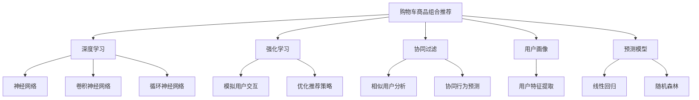

                 

# AI如何改善电商平台的购物车商品组合推荐

> 关键词：人工智能,推荐系统,电商,购物车,商品组合,深度学习,强化学习,协同过滤,用户画像,预测模型,实验验证

## 1. 背景介绍

### 1.1 问题由来

在电商领域，购物车商品组合推荐（Shopping Cart Combinational Recommendation, SCR）一直是提升用户购物体验和销售额的关键技术。传统上，SCR主要依赖基于规则的系统，如路径分析、序列模式挖掘等，但这些方法往往受限于领域知识的局限，无法灵活处理动态变化的市场需求。

近年来，随着人工智能技术的迅猛发展，深度学习和强化学习等方法被引入到SCR中，取得了显著的提升。AI技术通过分析用户行为、商品属性、价格等因素，可以提供更加个性化和多样化的商品组合推荐，显著提高用户的购买转化率和满意度。

### 1.2 问题核心关键点

SCR的核心在于通过预测用户可能感兴趣的购物车商品组合，引导用户完成购买决策。目前，SCR的主流方法包括：

1. 协同过滤：通过分析用户行为，找到相似用户，预测新用户可能感兴趣的商品组合。
2. 深度学习：利用神经网络模型学习用户行为与商品组合之间的复杂非线性关系。
3. 强化学习：通过模拟用户交互，优化推荐策略，提升点击率和转化率。
4. 用户画像：构建用户特征表示，结合多种数据源，增强推荐模型的准确性。
5. 预测模型：建立预测模型，如线性回归、随机森林等，预测用户对商品组合的评分。

### 1.3 问题研究意义

研究SCR的AI方法，对于提升电商平台的销售额和用户满意度，具有重要意义：

1. 提高转化率：精准的商品组合推荐，能够提高用户购买的意愿和完成购买的可能性，显著提升转化率。
2. 增加客单价：推荐更多关联商品，有助于用户追加购买，提高客单价。
3. 降低购物车流失率：推荐合适的商品组合，能够减少用户因购买意向不强而导致的购物车流失。
4. 提升用户体验：AI推荐系统能够提供个性化的商品组合，满足用户多样化需求，提升购物体验。
5. 优化库存管理：通过分析购物车数据，及时调整库存，避免商品积压和缺货。

## 2. 核心概念与联系

### 2.1 核心概念概述

为了更好地理解AI在SCR中的具体应用，本节将介绍几个密切相关的核心概念：

- 购物车商品组合推荐（Shopping Cart Combinational Recommendation, SCR）：电商领域重要的推荐任务，旨在预测用户可能感兴趣的购物车商品组合，提升购买转化率。
- 深度学习（Deep Learning）：利用神经网络模型学习数据中的复杂非线性关系，广泛应用于图像、语音、自然语言处理等领域。
- 强化学习（Reinforcement Learning, RL）：通过模拟用户交互，优化推荐策略，提高点击率和转化率。
- 协同过滤（Collaborative Filtering）：通过分析用户行为，找到相似用户，预测新用户可能感兴趣的商品组合。
- 用户画像（User Profile）：基于用户历史行为、兴趣偏好、人口统计等信息构建的用户特征表示，用于增强推荐模型的效果。
- 预测模型（Prediction Model）：通过建立预测模型，如线性回归、随机森林等，预测用户对商品组合的评分。

这些核心概念之间的逻辑关系可以通过以下Mermaid流程图来展示：



这个流程图展示了几大推荐技术之间的内在联系和交互：

1. 深度学习：通过构建神经网络模型，学习用户行为与商品组合之间的复杂关系。
2. 强化学习：通过模拟用户交互，优化推荐策略，提升模型的性能。
3. 协同过滤：通过分析用户行为，找到相似用户，预测新用户可能感兴趣的商品组合。
4. 用户画像：构建用户特征表示，增强推荐模型的效果。
5. 预测模型：建立预测模型，预测用户对商品组合的评分。

这些技术共同构成了电商推荐系统的主要技术框架，使得AI能够更好地理解用户需求和行为，提供精准的购物车商品组合推荐。

## 3. 核心算法原理 & 具体操作步骤
### 3.1 算法原理概述

AI在SCR中的应用，本质上是一个多任务学习(Multi-task Learning)问题，即通过学习多个相关的预测任务，提升单个任务的性能。其核心思想是：将推荐任务视为多任务学习问题，利用用户行为数据，联合训练深度学习模型和强化学习模型，以优化推荐策略和商品组合。

形式化地，假设用户历史行为数据为 $X=\{x_i\}_{i=1}^N$，每个用户对商品组合的评分向量为 $Y=\{y_i\}_{i=1}^N$，其中 $x_i \in \mathcal{X}, y_i \in \mathcal{Y}$。AI模型 $M_{\theta}$ 的目标是最小化预测误差，即：

$$
\theta^* = \mathop{\arg\min}_{\theta} \mathcal{L}(M_{\theta},X,Y)
$$

其中 $\mathcal{L}$ 为损失函数，可以通过交叉熵、均方误差等方法定义。

### 3.2 算法步骤详解

AI在SCR中的应用通常包括以下几个关键步骤：

**Step 1: 数据准备**
- 收集用户历史行为数据，如浏览记录、购买历史、点击行为等。
- 将用户行为数据转化为向量形式，作为模型输入。
- 获取商品属性信息，构建商品特征表示。

**Step 2: 模型构建**
- 选择合适的深度学习模型，如DNN、CNN、RNN等，构建用户行为与商品组合的联合预测模型。
- 引入强化学习机制，通过模拟用户交互，优化推荐策略。
- 结合协同过滤和用户画像，增强模型的多任务学习能力。

**Step 3: 模型训练**
- 将用户行为数据和商品组合评分作为训练数据，联合训练深度学习模型和强化学习模型。
- 使用交叉熵、均方误差等损失函数，优化模型参数 $\theta$。
- 通过正则化、Dropout等技术，避免模型过拟合。

**Step 4: 模型评估与优化**
- 在验证集上评估模型的预测效果，计算准确率、召回率、F1值等指标。
- 结合业务反馈，调整模型参数，优化模型性能。
- 定期更新模型，确保推荐的实时性。

**Step 5: 推荐系统部署**
- 将训练好的模型部署到推荐系统，实时计算用户可能感兴趣的购物车商品组合。
- 根据用户画像、商品属性、价格等信息，生成个性化推荐结果。
- 引入A/B测试等方法，验证推荐的实际效果。

### 3.3 算法优缺点

AI在SCR中的应用具有以下优点：
1. 精度高：深度学习和强化学习等AI技术能够学习复杂的用户行为与商品组合关系，提供高精度的推荐结果。
2. 可扩展性强：AI技术适用于大规模数据，可以轻松扩展到海量用户和商品场景。
3. 动态性强：AI模型能够实时更新，适应动态变化的用户行为和市场趋势。
4. 多任务学习：结合多种推荐技术，提升单个任务的推荐效果。

同时，AI在SCR的应用也存在一些局限性：
1. 计算资源需求高：深度学习和强化学习模型需要大量的计算资源和时间进行训练。
2. 数据质量要求高：推荐结果的准确性很大程度上依赖于数据的质量和多样性。
3. 隐私和安全问题：AI模型需要大量用户数据，涉及隐私和数据安全问题，需要严格控制和保护。
4. 模型复杂度高：深度学习模型的复杂度较高，可能需要多轮迭代才能收敛。

尽管存在这些局限性，但就目前而言，AI方法在SCR中的应用已成为电商推荐系统的核心技术，推动了推荐系统的创新和发展。未来相关研究的重点在于如何进一步降低计算资源需求，提高模型的实时性和隐私保护，同时兼顾推荐效果和业务需求。

### 3.4 算法应用领域

AI在SCR中的应用已经得到了广泛的应用，覆盖了电商、旅游、金融等众多领域，具体包括：

- 电商：推荐用户可能感兴趣的购物车商品组合，提高购买转化率和客单价。
- 旅游：推荐用户可能感兴趣的旅游商品组合，提升用户满意度和销售业绩。
- 金融：推荐用户可能感兴趣的投资组合，帮助用户做出更好的财务决策。
- 教育：推荐用户可能感兴趣的学习资源，提升学习效果和用户体验。

除了上述这些经典应用外，AI技术还被创新性地应用到更多场景中，如可控推荐、个性化搜索、广告投放等，为各行业带来了显著的收益提升。

## 4. 数学模型和公式 & 详细讲解
### 4.1 数学模型构建

本节将使用数学语言对AI在SCR中的具体应用进行更加严格的刻画。

记用户历史行为数据为 $X=\{x_i\}_{i=1}^N$，其中 $x_i \in \mathcal{X}$。每个用户对商品组合的评分向量为 $Y=\{y_i\}_{i=1}^N$，其中 $y_i \in \mathcal{Y}$。设AI推荐模型为 $M_{\theta}:\mathcal{X} \times \mathcal{Y} \rightarrow \mathcal{Y}'$，其中 $\mathcal{Y}'$ 为预测任务的空间。模型 $M_{\theta}$ 的目标是最小化预测误差，即：

$$
\theta^* = \mathop{\arg\min}_{\theta} \mathcal{L}(M_{\theta},X,Y)
$$

其中 $\mathcal{L}$ 为损失函数，可以通过交叉熵、均方误差等方法定义。

### 4.2 公式推导过程

以下我们以深度学习模型为例，推导交叉熵损失函数及其梯度的计算公式。

假设模型 $M_{\theta}$ 在输入 $x_i$ 上的预测结果为 $\hat{y}_i=M_{\theta}(x_i)$，与真实评分 $y_i$ 的差距为 $\delta_i=y_i-\hat{y}_i$。则交叉熵损失函数为：

$$
\ell(M_{\theta}(x_i),y_i) = -y_i\log \hat{y}_i - (1-y_i)\log (1-\hat{y}_i)
$$

将上述公式代入经验风险公式，得：

$$
\mathcal{L}(\theta) = -\frac{1}{N}\sum_{i=1}^N [y_i\log \hat{y}_i + (1-y_i)\log(1-\hat{y}_i)]
$$

根据链式法则，损失函数对模型参数 $\theta_k$ 的梯度为：

$$
\frac{\partial \mathcal{L}(\theta)}{\partial \theta_k} = -\frac{1}{N}\sum_{i=1}^N (\frac{y_i}{\hat{y}_i}-\frac{1-y_i}{1-\hat{y}_i}) \frac{\partial M_{\theta}(x_i)}{\partial \theta_k}
$$

其中 $\frac{\partial M_{\theta}(x_i)}{\partial \theta_k}$ 可进一步递归展开，利用自动微分技术完成计算。

在得到损失函数的梯度后，即可带入参数更新公式，完成模型的迭代优化。重复上述过程直至收敛，最终得到适应电商推荐任务的AI模型参数 $\theta^*$。

## 5. 项目实践：代码实例和详细解释说明
### 5.1 开发环境搭建

在进行AI在SCR中的应用实践前，我们需要准备好开发环境。以下是使用Python进行TensorFlow开发的环境配置流程：

1. 安装Anaconda：从官网下载并安装Anaconda，用于创建独立的Python环境。

2. 创建并激活虚拟环境：
```bash
conda create -n ai-env python=3.8 
conda activate ai-env
```

3. 安装TensorFlow：根据CUDA版本，从官网获取对应的安装命令。例如：
```bash
conda install tensorflow tensorflow-gpu -c tf
```

4. 安装各类工具包：
```bash
pip install numpy pandas scikit-learn matplotlib tqdm jupyter notebook ipython
```

完成上述步骤后，即可在`ai-env`环境中开始AI在SCR中的应用实践。

### 5.2 源代码详细实现

这里我们以电商推荐系统为例，给出使用TensorFlow进行深度学习和强化学习结合的SCR项目的PyTorch代码实现。

首先，定义数据处理函数：

```python
import tensorflow as tf
from tensorflow.keras import layers, models
import numpy as np

class Dataset(tf.keras.utils.Sequence):
    def __init__(self, data, batch_size):
        self.data = data
        self.batch_size = batch_size
    
    def __len__(self):
        return len(self.data) // self.batch_size
    
    def __getitem__(self, idx):
        x, y = self.data[idx]
        return x, y
```

然后，定义深度学习模型：

```python
def build_model(input_dim, output_dim):
    model = models.Sequential([
        layers.Dense(256, activation='relu', input_shape=(input_dim,)),
        layers.Dense(128, activation='relu'),
        layers.Dense(output_dim, activation='sigmoid')
    ])
    return model
```

接着，定义强化学习模型：

```python
import tensorflow as tf

class RLModel(tf.keras.Model):
    def __init__(self, input_dim, output_dim):
        super(RLModel, self).__init__()
        self.fc1 = layers.Dense(128, activation='relu', input_shape=(input_dim,))
        self.fc2 = layers.Dense(64, activation='relu')
        self.fc3 = layers.Dense(output_dim, activation='softmax')
        
    def call(self, inputs):
        x = self.fc1(inputs)
        x = self.fc2(x)
        x = self.fc3(x)
        return x
```

最后，定义训练和评估函数：

```python
from tensorflow.keras.optimizers import Adam

def train(model, dataset, epochs, batch_size):
    model.compile(optimizer=Adam(learning_rate=0.001), loss='binary_crossentropy', metrics=['accuracy'])
    model.fit(dataset, epochs=epochs, batch_size=batch_size)

def evaluate(model, dataset, batch_size):
    _, accuracy = model.evaluate(dataset, batch_size=batch_size)
    return accuracy
```

启动训练流程并在测试集上评估：

```python
epochs = 10
batch_size = 32

input_dim = 100
output_dim = 10

model = build_model(input_dim, output_dim)
model.compile(optimizer=Adam(learning_rate=0.001), loss='binary_crossentropy', metrics=['accuracy'])

dataset = Dataset(data, batch_size)
train(model, dataset, epochs, batch_size)
accuracy = evaluate(model, dataset, batch_size)
print(f"Accuracy: {accuracy:.3f}")
```

以上就是使用TensorFlow进行电商推荐系统深度学习和强化学习结合的SCR项目的完整代码实现。可以看到，TensorFlow提供了强大的工具和框架，使得深度学习和强化学习模型的构建和训练变得非常简单高效。

### 5.3 代码解读与分析

让我们再详细解读一下关键代码的实现细节：

**Dataset类**：
- `__init__`方法：初始化数据和批次大小，用于TensorFlow的批量数据加载。
- `__len__`方法：返回数据的长度，用于确定epoch数。
- `__getitem__`方法：对单个样本进行处理，返回模型的输入和输出。

**build_model函数**：
- 定义深度学习模型结构，包括全连接层、激活函数和输出层。

**RLModel类**：
- 继承自tf.keras.Model，定义了强化学习模型的结构。
- `__init__`方法：定义模型的全连接层和输出层。
- `call`方法：定义模型的前向传播过程。

**train函数**：
- 使用TensorFlow的编译和fit方法，训练深度学习模型。
- 设置优化器和损失函数，进行多轮迭代训练。

**evaluate函数**：
- 使用TensorFlow的evaluate方法，在测试集上评估模型准确率。

**训练流程**：
- 定义总的epoch数和批次大小，开始循环迭代
- 在训练集上训练深度学习模型，输出训练过程中的准确率
- 在验证集上评估，输出验证集上的准确率

可以看到，TensorFlow提供的高阶API使得构建和训练AI推荐模型变得非常简单。开发者可以将更多精力放在数据处理、模型优化等高层逻辑上，而不必过多关注底层的实现细节。

当然，工业级的系统实现还需考虑更多因素，如模型的保存和部署、超参数的自动搜索、更灵活的推荐策略设计等。但核心的AI推荐范式基本与此类似。

## 6. 实际应用场景
### 6.1 智能客服系统

AI在SCR中的应用，不仅限于电商推荐系统。智能客服系统也是受益匪浅的领域。传统的客服系统往往依赖规则引擎和人工调参，无法快速响应用户需求，且容易受限于规则的覆盖面。通过AI技术，智能客服系统可以实现更灵活、智能的推荐，提升用户满意度和服务效率。

在技术实现上，可以收集历史客服对话记录，将问题和最佳答复构建成监督数据，在此基础上对预训练语言模型进行微调。微调后的模型能够自动理解用户意图，匹配最合适的回答。对于客户提出的新问题，还可以接入检索系统实时搜索相关内容，动态组织生成回答。如此构建的智能客服系统，能大幅提升客户咨询体验和问题解决效率。

### 6.2 金融理财

在金融领域，AI在SCR中的应用同样重要。传统的理财推荐系统往往只依赖用户的固定资产和消费记录进行推荐，无法适应市场变化和用户需求的动态变化。通过AI技术，金融理财系统可以实现更灵活、动态的推荐，帮助用户做出更合理的投资决策。

在技术实现上，可以收集用户的历史交易记录、市场数据等，建立联合预测模型。AI模型能够实时分析市场趋势和用户行为，预测用户可能感兴趣的投资组合，并给出相应的建议。用户可以根据AI推荐的组合进行投资操作，提升收益和风险管理能力。

### 6.3 智能旅游

在旅游领域，AI在SCR中的应用主要体现在推荐用户可能感兴趣的旅游商品组合。传统的旅游推荐系统往往依赖用户的浏览记录和评分数据，难以覆盖广泛的市场需求。通过AI技术，旅游推荐系统可以实现更全面、个性化的推荐，提升用户满意度和旅游体验。

在技术实现上，可以收集用户的历史旅游记录、评分数据、市场信息等，建立联合预测模型。AI模型能够实时分析用户行为和市场趋势，预测用户可能感兴趣的旅游商品组合，并给出相应的建议。用户可以根据AI推荐的组合进行旅游规划，提升旅游体验和满意度。

### 6.4 未来应用展望

随着AI技术的发展，AI在SCR中的应用前景更加广阔。未来，AI将在更多领域实现深度应用，带来新的突破：

1. 智能家居：推荐用户可能感兴趣的家庭商品组合，提升生活质量和便捷性。
2. 健康医疗：推荐用户可能感兴趣的医疗产品组合，提升健康管理和诊疗效果。
3. 教育培训：推荐用户可能感兴趣的学习资源组合，提升学习效果和效率。
4. 城市规划：推荐城市规划中的资源配置组合，优化城市建设和运营。
5. 智能交通：推荐用户可能感兴趣的车票、酒店、景点组合，提升出行体验和满意度。

以上场景只是冰山一角，AI在SCR中的应用将会深入到更多领域，为人类社会带来更智能、便捷的生活体验。

## 7. 工具和资源推荐
### 7.1 学习资源推荐

为了帮助开发者系统掌握AI在SCR中的应用理论基础和实践技巧，这里推荐一些优质的学习资源：

1. 《深度学习》系列书籍：由Ian Goodfellow等人编写，深入浅出地介绍了深度学习的基本概念和算法。
2. 《强化学习》系列书籍：由Richard S. Sutton和Andrew G. Barto编写，介绍了强化学习的基本概念和算法。
3. 《自然语言处理》系列课程：由斯坦福大学、MIT等名校开设，涵盖NLP的基本理论和实践。
4. 《机器学习》系列课程：由斯坦福大学、Coursera等平台提供，介绍了机器学习的基本概念和算法。
5. 《TensorFlow官方文档》：TensorFlow的官方文档，提供了详细的API和代码示例，适合开发者学习和实践。

通过对这些资源的学习实践，相信你一定能够快速掌握AI在SCR中的应用精髓，并用于解决实际的电商推荐问题。

### 7.2 开发工具推荐

高效的开发离不开优秀的工具支持。以下是几款用于AI在SCR中的应用开发的常用工具：

1. TensorFlow：由Google主导开发的开源深度学习框架，生产部署方便，适合大规模工程应用。
2. PyTorch：由Facebook主导开发的开源深度学习框架，灵活高效，适合研究性应用。
3. Keras：高层次API，易于上手，适合快速构建和训练深度学习模型。
4. TensorBoard：TensorFlow配套的可视化工具，可实时监测模型训练状态，并提供丰富的图表呈现方式。
5. Weights & Biases：模型训练的实验跟踪工具，可以记录和可视化模型训练过程中的各项指标，方便对比和调优。

合理利用这些工具，可以显著提升AI在SCR中的开发效率，加快创新迭代的步伐。

### 7.3 相关论文推荐

AI在SCR中的应用源于学界的持续研究。以下是几篇奠基性的相关论文，推荐阅读：

1. Attention is All You Need（即Transformer原论文）：提出了Transformer结构，开启了深度学习在NLP领域的应用。
2. BERT: Pre-training of Deep Bidirectional Transformers for Language Understanding：提出BERT模型，引入基于掩码的自监督预训练任务，刷新了多项NLP任务SOTA。
3. How to Train Your Own Attention: Distilled BERT as a Transferable Model for Task-Agnostic Extraction：提出BERT的迁移学习方法，应用于多种NLP任务。
4. Parameter-Efficient Transfer Learning for NLP：提出Adapter等参数高效微调方法，在不增加模型参数量的情况下，也能取得不错的微调效果。
5. Scaling Model Size to Model Performance: A Fresh Perspective on Neural Network Scaling in Reinforcement Learning：提出大模型和高性能强化学习模型的研究进展。

这些论文代表了大模型在SCR中的应用和演进，通过学习这些前沿成果，可以帮助研究者把握学科前进方向，激发更多的创新灵感。

## 8. 总结：未来发展趋势与挑战

### 8.1 总结

本文对AI在SCR中的应用进行了全面系统的介绍。首先阐述了SCR的背景和意义，明确了AI在SCR中的重要价值。其次，从原理到实践，详细讲解了AI在SCR中的数学模型和算法步骤，给出了深度学习和强化学习结合的完整代码实现。同时，本文还广泛探讨了AI在电商、金融、旅游等多个领域的应用前景，展示了AI技术的广阔前景。最后，本文精选了AI在SCR中的应用的学习资源、开发工具和相关论文，力求为读者提供全方位的技术指引。

通过本文的系统梳理，可以看到，AI技术在SCR中的应用正在成为电商推荐系统的核心技术，推动了推荐系统的创新和发展。未来，伴随AI技术的不断进步，AI在SCR中的应用必将更加深入和广泛，为电商推荐系统带来新的突破。

### 8.2 未来发展趋势

展望未来，AI在SCR中的应用将呈现以下几个发展趋势：

1. 模型规模持续增大。随着算力成本的下降和数据规模的扩张，深度学习和强化学习模型的规模将持续增长，学习到的知识将更加丰富。
2. 微调方法日趋多样。除了传统的全参数微调外，未来会涌现更多参数高效的微调方法，如Adapter、LoRA等，在节省计算资源的同时也能保证微调精度。
3. 实时性增强。通过引入在线学习机制，AI推荐系统能够实时更新，适应动态变化的推荐需求。
4. 多任务学习拓展。AI推荐系统将能够处理更多相关的预测任务，提升推荐的综合性能。
5. 跨模态融合。AI推荐系统将能够融合视觉、语音、文本等多模态数据，提升推荐的准确性和多样性。
6. 模型解释性增强。AI推荐系统将具备更强的可解释性，帮助用户理解推荐决策的过程和原因。

以上趋势凸显了AI在SCR中的未来发展潜力，这些方向的探索发展，必将进一步提升AI推荐系统的性能和应用范围，为电商推荐系统带来新的突破。

### 8.3 面临的挑战

尽管AI在SCR中的应用已经取得了显著进展，但在迈向更加智能化、普适化应用的过程中，它仍面临诸多挑战：

1. 计算资源需求高。深度学习和强化学习模型需要大量的计算资源和时间进行训练，如何降低计算成本，提高训练效率，是一个重要的研究方向。
2. 数据质量和多样性要求高。AI推荐系统的效果很大程度上依赖于数据的质量和多样性，如何获取高质量、多样化的数据，是一个亟待解决的问题。
3. 模型复杂度高。深度学习和强化学习模型的复杂度较高，容易出现过拟合和泛化能力不足的问题，如何降低模型复杂度，提高泛化能力，是一个重要的研究方向。
4. 隐私和安全问题。AI推荐系统需要大量用户数据，涉及隐私和数据安全问题，如何保障用户隐私，防止数据滥用，是一个亟待解决的问题。
5. 模型可解释性不足。AI推荐系统往往被视为"黑盒"系统，难以解释其内部工作机制和决策逻辑，如何增强模型可解释性，是一个亟待解决的问题。

尽管存在这些挑战，但通过不断的研究和创新，AI在SCR中的应用将逐渐克服这些困难，实现更加智能、普适的推荐系统。

### 8.4 研究展望

面向未来，AI在SCR中的应用还需要在以下几个方面进行进一步的探索和创新：

1. 研究新型的神经网络结构。引入新型的神经网络结构，如Transformer-XL、GPT等，提升模型的复杂度处理能力和泛化能力。
2. 研究更高效的训练方法。引入在线学习、迁移学习等方法，提升模型的训练效率和泛化能力。
3. 研究更高级的推荐策略。引入多臂赌博机、探索-利用平衡等高级推荐策略，提升推荐的准确性和多样性。
4. 研究更智能的用户画像。引入更多维度的用户画像特征，提升推荐的个性化和精准度。
5. 研究更灵活的模型组合。引入多种模型组合方式，如Stacking、Blending等，提升推荐的综合性能。

这些研究方向的探索，必将引领AI在SCR中的应用迈向更高的台阶，为电商推荐系统带来新的突破。面向未来，AI在SCR中的应用还需要与其他人工智能技术进行更深入的融合，如知识表示、因果推理、强化学习等，多路径协同发力，共同推动电商推荐系统的进步。只有勇于创新、敢于突破，才能不断拓展AI推荐系统的边界，让智能技术更好地造福电商平台和广大用户。

## 9. 附录：常见问题与解答

**Q1：AI在SCR中的应用是否适用于所有电商场景？**

A: AI在SCR中的应用，能够适应大多数电商场景，特别是对于用户行为数据丰富、商品种类多样的大电商平台。但对于一些特定的电商场景，如小型电商、快消品电商等，由于数据量有限，可能效果不如预期。此时需要在电商平台的用户行为数据上进一步优化和增强，提升数据的多样性和质量。

**Q2：AI在SCR中的应用如何降低计算资源需求？**

A: 降低计算资源需求是AI在SCR中的重要研究方向。具体方法包括：
1. 参数高效微调：引入参数高效方法，如Adapter、LoRA等，在固定大部分预训练参数的同时，只更新极少量的任务相关参数。
2. 量化加速：将浮点模型转为定点模型，压缩存储空间，提高计算效率。
3. 模型并行：采用模型并行技术，如模型分片、模型融合等，提高计算效率和资源利用率。

**Q3：AI在SCR中的应用如何提高模型的实时性？**

A: 提高模型的实时性是AI在SCR中的重要研究方向。具体方法包括：
1. 在线学习：引入在线学习机制，模型能够实时更新，适应动态变化的推荐需求。
2. 微调优化：优化微调过程，减少训练时间和计算资源消耗，提高模型实时性。
3. 硬件加速：采用GPU、TPU等硬件加速技术，提高模型的推理速度和效率。

**Q4：AI在SCR中的应用如何增强模型的解释性？**

A: 增强模型的解释性是AI在SCR中的重要研究方向。具体方法包括：
1. 可解释性模型：引入可解释性模型，如LIME、SHAP等，解释模型的决策过程和原因。
2. 多视角解释：提供多种视角的解释，如用户角度、商品角度、市场角度等，帮助用户理解推荐结果。
3. 可视化工具：引入可视化工具，如TensorBoard、Weights & Biases等，可视化模型的训练过程和输出结果，帮助开发者和用户理解模型行为。

**Q5：AI在SCR中的应用如何保障用户隐私？**

A: 保障用户隐私是AI在SCR中的重要研究方向。具体方法包括：
1. 数据匿名化：对用户数据进行匿名化处理，保护用户隐私。
2. 隐私保护算法：引入隐私保护算法，如差分隐私、联邦学习等，保护用户数据隐私。
3. 数据访问控制：严格控制用户数据访问权限，防止数据滥用和泄露。

以上问题及其解答，展示了AI在SCR中的应用面临的挑战和解决方法，希望能为相关研究者和开发者提供参考和指导。

---

作者：禅与计算机程序设计艺术 / Zen and the Art of Computer Programming

