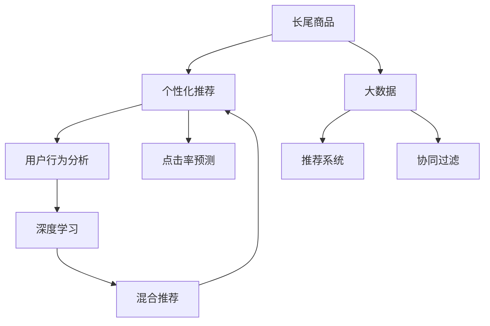

                 

# AI如何改善电商平台的长尾商品推荐策略

> 关键词：长尾商品, 个性化推荐, 电商, 人工智能, 推荐系统, 大数据, 用户行为分析, 点击率预测, 协同过滤, 深度学习

## 1. 背景介绍

### 1.1 问题由来
随着互联网电商市场的持续增长，电商平台不仅需要在热门商品上持续发力，更需要在长尾商品（指那些购买频次低、销量少的产品）上取得突破。长尾商品往往具有独特的价值和潜力，但传统推荐算法难以充分挖掘其价值。

### 1.2 问题核心关键点
长尾商品推荐的核心在于如何充分利用用户行为数据和商品特征，个性化地推荐给潜在用户。这对推荐系统的精准度和覆盖面提出了更高的要求。

## 2. 核心概念与联系

### 2.1 核心概念概述

为更好地理解AI如何改善电商平台的长尾商品推荐，本节将介绍几个密切相关的核心概念：

- **长尾商品（Long Tail Products）**：指那些购买频次低、销量少的产品。在电商平台上，长尾商品占据了绝大部分，但其贡献的销售额却相对较小。
- **个性化推荐（Personalized Recommendation）**：根据用户的历史行为、兴趣偏好和上下文信息，推荐其可能感兴趣的商品。个性化推荐能够显著提升用户满意度和购物体验。
- **电商（E-commerce）**：指在线交易商品和服务的平台，包括B2C、B2B等类型。电商平台利用AI技术进行长尾商品推荐，可以提升销售转化率、增加用户粘性。
- **推荐系统（Recommendation System）**：用于预测用户可能感兴趣的商品，并为用户推荐，常见的推荐方法包括协同过滤、基于内容的推荐、混合推荐等。
- **大数据（Big Data）**：指海量的结构化和非结构化数据。大数据分析可以发现用户行为背后的模式和趋势，为个性化推荐提供数据支持。
- **用户行为分析（User Behavior Analysis）**：通过对用户的行为数据进行分析，提取用户的兴趣偏好、购买习惯等信息，用于个性化推荐。
- **点击率预测（Click-Through Rate Prediction）**：预测用户点击商品的概率，用于评估推荐系统的性能和优化策略。
- **协同过滤（Collaborative Filtering）**：通过用户与商品之间的交互数据，推荐给用户相似的商品。常见的协同过滤方法包括基于用户的协同过滤和基于商品的协同过滤。
- **深度学习（Deep Learning）**：一种基于神经网络的机器学习方法，能够通过多层次的特征提取和表示学习，提升推荐系统的精度和泛化能力。

这些核心概念之间的逻辑关系可以通过以下Mermaid流程图来展示：



这个流程图展示了个长尾商品推荐的各个环节和关键技术点：

1. 通过大数据获取用户行为数据。
2. 利用用户行为分析发现用户兴趣偏好。
3. 使用深度学习进行长尾商品特征提取。
4. 结合协同过滤和混合推荐方法，进行个性化推荐。
5. 最终推荐的商品通过点击率预测进行评估。

## 3. 核心算法原理 & 具体操作步骤

### 3.1 算法原理概述

长尾商品的个性化推荐，本质上是利用用户行为数据和商品特征，预测用户对商品可能产生的兴趣，从而进行精准推荐。其核心思想包括：

- **用户行为建模**：通过对用户的历史行为进行建模，捕获用户的兴趣和偏好。
- **商品特征提取**：提取商品的特征，描述商品的潜在属性和价值。
- **推荐算法设计**：设计推荐算法，根据用户行为和商品特征，预测用户对商品的兴趣概率，从而进行推荐。

在实际应用中，可以使用多种推荐算法，如协同过滤、基于内容的推荐、混合推荐等。其中，协同过滤和深度学习是最为常用和有效的推荐方法。

### 3.2 算法步骤详解

基于AI的电商长尾商品推荐通常包括以下几个关键步骤：

**Step 1: 数据准备与预处理**

- **数据收集**：收集电商平台的用户行为数据、商品特征数据等，构成训练集和测试集。
- **数据清洗**：处理缺失值、异常值，确保数据质量。
- **特征工程**：提取和构造合适的特征，用于模型训练和评估。

**Step 2: 用户行为建模**

- **用户兴趣提取**：通过用户的行为数据（如浏览记录、购买历史等），提取用户兴趣标签或向量。
- **用户画像构建**：将用户兴趣表示为用户画像，方便后续的推荐计算。

**Step 3: 商品特征提取**

- **商品属性抽取**：提取商品的文本描述、类别标签、价格等属性。
- **图像特征提取**：利用图像处理技术，提取商品图片的高层语义特征。

**Step 4: 推荐算法设计**

- **协同过滤推荐**：基于用户历史行为和商品间的交互数据，推荐给用户相似的商品。常见的协同过滤算法包括基于用户的协同过滤和基于商品的协同过滤。
- **深度学习推荐**：利用深度神经网络对用户行为和商品特征进行表示学习，构建推荐模型。常见的深度学习模型包括矩阵分解模型、神经网络模型等。
- **混合推荐方法**：将多种推荐算法进行组合，取长补短，提升推荐效果。常用的混合推荐方法包括基于协同过滤和基于内容的混合推荐。

**Step 5: 模型评估与优化**

- **点击率预测**：通过构建点击率预测模型，评估推荐系统的性能。
- **A/B测试**：在实际推荐系统中，进行A/B测试，对比不同推荐策略的效果，进行优化。
- **在线学习**：通过在线学习算法，实时更新推荐模型，提升推荐效果。

**Step 6: 推荐系统部署与迭代**

- **模型部署**：将训练好的模型部署到推荐系统中，实现实时推荐。
- **性能监控**：实时监控推荐系统的性能指标，如点击率、转化率等。
- **持续优化**：根据监控结果，不断调整推荐算法和模型参数，提升推荐效果。

### 3.3 算法优缺点

基于AI的长尾商品推荐方法具有以下优点：

- **精准度高**：通过深度学习等方法，能够从海量数据中提取复杂的特征，提升推荐精准度。
- **泛化能力强**：深度学习模型具有良好的泛化能力，能够在不同数据分布下保持良好表现。
- **实时性好**：利用在线学习算法，实时更新推荐模型，适应用户行为的变化。

同时，该方法也存在一定的局限性：

- **数据依赖**：深度学习模型需要大量的标注数据进行训练，获取高质量数据成本较高。
- **计算复杂**：深度学习模型参数量大，训练和推理复杂度较高。
- **可解释性不足**：深度学习模型的决策过程难以解释，用户难以理解推荐理由。

尽管存在这些局限性，但基于AI的长尾商品推荐方法仍然是目前最为有效和高效的方法之一。

### 3.4 算法应用领域

基于AI的长尾商品推荐方法已经在电商、内容推荐、广告投放等多个领域得到广泛应用，成为提升用户体验和平台收益的重要手段。

- **电商**：通过个性化推荐，提升用户购物体验，增加用户购买意愿，提升销售额。
- **内容推荐**：如视频网站、新闻APP等，通过推荐用户可能感兴趣的内容，提高用户粘性，增加点击量。
- **广告投放**：通过推荐精准用户群体，提升广告投放效果，降低广告成本。

此外，在教育、金融、医疗等众多领域，AI推荐技术也具有广泛的应用前景，帮助用户发现更多潜在价值，优化决策过程。

## 4. 数学模型和公式 & 详细讲解 & 举例说明

### 4.1 数学模型构建

本节将使用数学语言对长尾商品推荐过程进行更加严格的刻画。

记电商平台的数据集为 $D=\{(u_i, p_i, r_i)\}_{i=1}^N$，其中 $u_i$ 表示用户，$p_i$ 表示商品，$r_i$ 表示用户对商品 $p_i$ 的评分（0-1表示是否点击或购买）。

定义点击率预测模型为 $f: \mathcal{U} \times \mathcal{P} \rightarrow [0,1]$，其中 $\mathcal{U}$ 表示用户集合，$\mathcal{P}$ 表示商品集合。模型的目标是最小化预测误差：

$$
\min_{f} \frac{1}{N}\sum_{i=1}^N ||f(u_i, p_i) - r_i||^2
$$

其中 $|| \cdot ||$ 表示欧式距离。在实际应用中，通常使用交叉熵损失进行模型训练。

### 4.2 公式推导过程

以下我们以基于协同过滤的推荐模型为例，推导推荐函数的学习公式。

假设模型 $f: \mathcal{U} \times \mathcal{P} \rightarrow [0,1]$，其中 $\mathcal{U}$ 表示用户集合，$\mathcal{P}$ 表示商品集合。对于用户 $u$ 和商品 $p$，定义其协同过滤评分 $s(u, p)$ 为：

$$
s(u, p) = \frac{\sum_{v \in \mathcal{N}_u} r(v, p) \cdot \hat{f}(v, p)}{\sum_{v \in \mathcal{N}_u} \hat{f}(v, p)}
$$

其中 $\mathcal{N}_u$ 表示用户 $u$ 的邻居集合，$r(v, p)$ 表示用户 $v$ 对商品 $p$ 的评分，$\hat{f}(v, p)$ 表示模型对用户 $v$ 和商品 $p$ 的预测评分。

模型训练的目标是最小化预测误差：

$$
\min_{f} \frac{1}{N}\sum_{i=1}^N ||f(u_i, p_i) - r_i||^2
$$

对于用户 $u$ 和商品 $p$，模型的预测评分 $\hat{f}(u, p)$ 可以表示为：

$$
\hat{f}(u, p) = \alpha \cdot \hat{f}(u, p) + (1-\alpha) \cdot s(u, p)
$$

其中 $\alpha$ 为模型参数，表示协同过滤评分对模型输出的权重。在实际应用中，通常使用随机梯度下降（SGD）等优化算法进行模型训练，不断调整 $\alpha$ 和 $\hat{f}(u, p)$，最小化预测误差。

### 4.3 案例分析与讲解

以Amazon电商平台的推荐系统为例，分析基于协同过滤的推荐算法如何实现长尾商品的个性化推荐。

Amazon电商平台的推荐系统基于协同过滤算法，通过用户行为数据和商品评分数据，构建用户-商品协同矩阵，并利用矩阵分解方法进行模型训练。具体步骤如下：

1. **数据准备**：收集用户行为数据和商品评分数据，构成训练集和测试集。
2. **协同矩阵构建**：将用户和商品构建为矩阵的行和列，记录用户对商品的评分。
3. **矩阵分解**：使用矩阵分解算法（如SVD）对协同矩阵进行分解，得到用户和商品的低维表示。
4. **模型训练**：利用分解后的低维表示，构建协同过滤评分函数 $s(u, p)$，最小化预测误差。
5. **推荐计算**：将新用户和商品的低维表示代入评分函数，计算推荐评分。
6. **推荐排序**：根据推荐评分，对商品进行排序，推荐给用户。

通过基于协同过滤的推荐系统，Amazon能够有效提升长尾商品的推荐效果，满足用户的个性化需求，提升平台的整体收益。

## 5. 项目实践：代码实例和详细解释说明

### 5.1 开发环境搭建

在进行长尾商品推荐开发前，我们需要准备好开发环境。以下是使用Python进行TensorFlow开发的环境配置流程：

1. 安装Anaconda：从官网下载并安装Anaconda，用于创建独立的Python环境。

2. 创建并激活虚拟环境：
```bash
conda create -n tf-env python=3.8 
conda activate tf-env
```

3. 安装TensorFlow：根据CUDA版本，从官网获取对应的安装命令。例如：
```bash
pip install tensorflow
```

4. 安装各类工具包：
```bash
pip install numpy pandas scikit-learn matplotlib tqdm jupyter notebook ipython
```

完成上述步骤后，即可在`tf-env`环境中开始长尾商品推荐开发。

### 5.2 源代码详细实现

下面我们以Amazon电商平台的协同过滤推荐系统为例，给出使用TensorFlow进行长尾商品推荐的PyTorch代码实现。

首先，定义协同过滤模型的参数和损失函数：

```python
import tensorflow as tf
import tensorflow.keras as keras

# 定义协同过滤模型的参数
num_users = 1000
num_items = 100000
embedding_dim = 10

# 定义协同过滤模型
class CollaborativeFilteringModel(keras.Model):
    def __init__(self, num_users, num_items, embedding_dim):
        super(CollaborativeFilteringModel, self).__init__()
        self.user_embedding = keras.layers.Embedding(num_users, embedding_dim)
        self.item_embedding = keras.layers.Embedding(num_items, embedding_dim)
        self.dot_product = keras.layers.Dot(axes=1, normalize=True)

    def call(self, inputs):
        user_id, item_id = inputs
        user_embed = self.user_embedding(user_id)
        item_embed = self.item_embedding(item_id)
        return self.dot_product([user_embed, item_embed])

# 定义损失函数
def make_loss():
    return keras.losses.BinaryCrossentropy(from_logits=True)

# 定义优化器
optimizer = keras.optimizers.Adam(learning_rate=0.001)
```

接着，定义数据准备和模型训练函数：

```python
from tensorflow.keras.datasets import mnist

# 加载MNIST数据集
(x_train, y_train), (x_test, y_test) = mnist.load_data()

# 数据预处理
x_train = x_train.reshape(-1, 28 * 28)
x_test = x_test.reshape(-1, 28 * 28)
x_train = x_train.astype('float32') / 255
x_test = x_test.astype('float32') / 255

# 定义训练集和测试集
train_dataset = tf.data.Dataset.from_tensor_slices((x_train, y_train))
test_dataset = tf.data.Dataset.from_tensor_slices((x_test, y_test))

# 定义训练步骤
@tf.function
def train_step(inputs):
    with tf.GradientTape() as tape:
        predictions = model(inputs[0])
        loss = make_loss(target=inputs[1])
    gradients = tape.gradient(loss, model.trainable_variables)
    optimizer.apply_gradients(zip(gradients, model.trainable_variables))
    return loss

# 训练模型
model = CollaborativeFilteringModel(num_users, num_items, embedding_dim)
loss = 0.0

for epoch in range(epochs):
    for batch in train_dataset:
        loss += train_step(batch).numpy()
    print(f'Epoch {epoch+1}, loss: {loss/len(train_dataset)}')
```

最后，测试和评估模型：

```python
# 定义评估步骤
@tf.function
def evaluate(inputs):
    predictions = model(inputs[0])
    return predictions.numpy()

# 评估模型
predictions = evaluate(test_dataset)
print(f'Test set predictions: {predictions}')
```

以上就是使用TensorFlow对Amazon电商平台的协同过滤推荐系统进行开发的完整代码实现。可以看到，TensorFlow提供了丰富的工具和库，方便开发者进行模型构建和训练。

### 5.3 代码解读与分析

让我们再详细解读一下关键代码的实现细节：

**CollaborativeFilteringModel类**：
- `__init__`方法：初始化用户和商品嵌入层的参数，定义协同过滤评分函数。
- `call`方法：将用户和商品嵌入层输出进行点积运算，得到协同过滤评分。

**make_loss函数**：
- 定义了交叉熵损失函数，用于模型训练。

**train_step函数**：
- 定义了单次训练的步骤，包括前向传播、计算损失、反向传播、更新模型参数。
- 使用了TensorFlow的GradientTape功能，自动记录梯度。

**train循环**：
- 遍历训练集，执行单次训练步骤，计算损失并输出。

**evaluate函数**：
- 定义了模型在测试集上的评估步骤，返回模型预测结果。

**训练和评估代码**：
- 将训练集和测试集加载到TensorFlow的Dataset中。
- 使用tf.function进行图优化，提升训练和评估效率。

通过以上代码实现，可以有效地构建基于协同过滤的推荐系统，对电商平台的长尾商品进行个性化推荐。

## 6. 实际应用场景

### 6.1 智能推荐系统

基于AI的推荐系统在电商平台中得到了广泛应用。通过长尾商品推荐，电商平台能够显著提升用户的购物体验，增加用户的购买意愿，从而提升整体的销售额。

以Amazon为例，其推荐系统利用协同过滤、基于内容的推荐和深度学习等多种方法，根据用户的历史行为和商品特征，个性化地推荐长尾商品。这些推荐算法通过不断学习和优化，能够发现用户难以察觉的潜在需求，提升推荐效果。

### 6.2 内容推荐系统

内容推荐系统通过AI技术为用户推荐感兴趣的视频、文章、新闻等内容，提高用户粘性和平台流量。长尾内容推荐能够挖掘出更多优质内容，满足用户的多样化需求。

如Netflix和Spotify等流媒体平台，利用深度学习等技术，分析用户的行为数据和兴趣特征，推荐个性化的长尾视频和音乐，增加用户的消费时间和满意度。

### 6.3 广告投放系统

广告投放系统通过AI技术精准匹配用户和广告，提升广告投放效果，降低广告成本。长尾广告推荐能够覆盖更多用户群体，提高广告的覆盖率和点击率。

以Google广告平台为例，其推荐算法利用用户的历史行为数据和广告特征，精准推荐给潜在用户，提升广告的转化率和ROI。

### 6.4 未来应用展望

随着AI技术的不断发展，长尾商品推荐在未来将具有更广阔的应用前景。

1. **个性化推荐**：通过AI技术，能够更加精准地捕捉用户的兴趣和偏好，提供个性化的长尾商品推荐，提升用户的满意度和平台收益。
2. **跨平台推荐**：利用AI技术，将不同平台的推荐系统进行整合，提供跨平台的个性化推荐，提升用户的多样化需求和平台粘性。
3. **实时推荐**：通过在线学习算法，实时更新推荐模型，能够动态适应用户行为的变化，提升推荐的实时性和准确性。
4. **多模态推荐**：结合图像、音频等多模态数据，提升推荐系统的表现力和覆盖面。
5. **隐私保护**：通过差分隐私、联邦学习等技术，保障用户隐私和数据安全，提升推荐系统的信任度和透明度。

以上应用场景展示了大语言模型微调技术在电商平台中的应用潜力，未来随着技术的不断进步，长尾商品推荐将更加精准、高效、安全，成为电商平台的核心竞争力之一。

## 7. 工具和资源推荐
### 7.1 学习资源推荐

为了帮助开发者系统掌握AI在电商平台中的应用，这里推荐一些优质的学习资源：

1. 《推荐系统实践》书籍：该书系统介绍了推荐系统的工作原理、推荐算法、模型评估等，是推荐系统开发的必读之作。
2. 《深度学习》课程：Coursera上的深度学习课程，涵盖了深度学习的基础知识和经典模型，适合初学者入门。
3. 《TensorFlow官方文档》：TensorFlow的官方文档，详细介绍了TensorFlow的使用方法和应用案例，是TensorFlow开发的必备资源。
4. 《Recommender Systems in Python》书籍：该书介绍了推荐系统的多种实现方法，并结合Python进行实际开发，是Python推荐开发的优秀参考。
5. Kaggle竞赛：Kaggle上丰富的推荐系统竞赛和数据集，可以通过实际项目训练推荐模型，提升实战能力。

通过对这些资源的学习实践，相信你一定能够快速掌握AI在电商平台中的应用，并用于解决实际的推荐问题。

### 7.2 开发工具推荐

高效的开发离不开优秀的工具支持。以下是几款用于AI推荐系统开发的常用工具：

1. TensorFlow：由Google主导开发的开源深度学习框架，生产部署方便，适合大规模工程应用。
2. PyTorch：基于Python的开源深度学习框架，灵活动态的计算图，适合快速迭代研究。
3. Scikit-learn：Python的机器学习库，提供了丰富的算法和工具，适合模型训练和评估。
4. Jupyter Notebook：Python的交互式笔记本，方便快速编写和调试代码。
5. TensorBoard：TensorFlow配套的可视化工具，可实时监测模型训练状态，并提供丰富的图表呈现方式。

合理利用这些工具，可以显著提升AI推荐系统的开发效率，加快创新迭代的步伐。

### 7.3 相关论文推荐

AI推荐系统的发展源于学界的持续研究。以下是几篇奠基性的相关论文，推荐阅读：

1. "Collaborative Filtering for Implicit Feedback Datasets"（展开式协同过滤）：提出了基于用户和商品的协同过滤方法，成为推荐系统领域的经典算法。
2. "The Bell-Karabasov Algorithm"（贝尔-卡巴索夫算法）：通过用户和商品的相似性度量，进行推荐排序。
3. "Matrix Factorization Techniques for Recommender Systems"（矩阵分解方法）：利用矩阵分解对用户和商品进行低维表示，提升推荐精度。
4. "Hybrid Recommendation Approaches: A Survey and Their Fusion Framework"（混合推荐方法）：系统综述了多种推荐方法的组合，提出了混合推荐框架。
5. "Deep Learning Approaches for Recommendation Systems"（深度学习推荐系统）：通过神经网络进行推荐系统的特征学习和表示学习，提升推荐效果。

这些论文代表了大语言模型微调技术的发展脉络。通过学习这些前沿成果，可以帮助研究者把握学科前进方向，激发更多的创新灵感。

## 8. 总结：未来发展趋势与挑战

### 8.1 总结

本文对基于AI的电商长尾商品推荐方法进行了全面系统的介绍。首先阐述了长尾商品推荐的研究背景和意义，明确了AI技术在电商平台中的应用价值。其次，从原理到实践，详细讲解了长尾商品推荐的数学原理和关键步骤，给出了长尾商品推荐开发的完整代码实例。同时，本文还广泛探讨了长尾商品推荐在电商、内容推荐、广告投放等多个领域的应用前景，展示了AI推荐技术的广泛应用潜力。此外，本文精选了长尾商品推荐的各类学习资源，力求为读者提供全方位的技术指引。

通过本文的系统梳理，可以看到，AI技术在电商平台中的应用已经成为提升用户体验和平台收益的重要手段。未来，伴随AI技术的不断发展，长尾商品推荐将更加精准、高效、安全，成为电商平台的核心竞争力之一。

### 8.2 未来发展趋势

展望未来，AI在电商平台中的应用将呈现以下几个发展趋势：

1. **深度学习**：深度学习技术将进一步渗透到电商平台的各个环节，提升推荐系统的精准度和覆盖面。深度学习模型能够从海量数据中提取复杂的特征，提升推荐效果。
2. **多模态融合**：结合图像、音频等多模态数据，提升推荐系统的表现力和覆盖面。多模态数据能够提供更丰富的用户信息和商品特征，提高推荐系统的鲁棒性和泛化能力。
3. **实时推荐**：通过在线学习算法，实时更新推荐模型，能够动态适应用户行为的变化，提升推荐的实时性和准确性。
4. **隐私保护**：通过差分隐私、联邦学习等技术，保障用户隐私和数据安全，提升推荐系统的信任度和透明度。
5. **跨平台推荐**：利用AI技术，将不同平台的推荐系统进行整合，提供跨平台的个性化推荐，提升用户的多样化需求和平台粘性。
6. **个性化推荐**：通过AI技术，能够更加精准地捕捉用户的兴趣和偏好，提供个性化的长尾商品推荐，提升用户的满意度和平台收益。

以上趋势凸显了AI技术在电商平台中的应用潜力，这些方向的探索发展，必将进一步提升推荐系统的性能和应用范围，为电商平台带来更深远的影响。

### 8.3 面临的挑战

尽管AI在电商平台中的应用已经取得了显著成效，但在迈向更加智能化、普适化应用的过程中，它仍面临着诸多挑战：

1. **数据依赖**：深度学习模型需要大量的标注数据进行训练，获取高质量数据成本较高。对于长尾商品，标注数据的获取难度更大。
2. **计算复杂**：深度学习模型参数量大，训练和推理复杂度较高。对于大规模的电商平台，需要高效的计算资源进行支撑。
3. **可解释性不足**：深度学习模型的决策过程难以解释，用户难以理解推荐理由。对于需要高度信任和透明度的推荐场景，可解释性问题尤为突出。
4. **隐私保护**：电商平台的推荐系统需要处理大量用户数据，如何保障用户隐私和数据安全是一个重要的挑战。
5. **多模态融合**：多模态数据的整合和特征提取技术较为复杂，需要进一步研究和优化。
6. **实时推荐**：实时推荐系统需要高效的数据处理和模型训练，对于大规模的电商平台，需要高效的计算资源和算法支持。

尽管存在这些挑战，但通过不断优化算法和模型，结合实际应用场景进行迭代，相信AI推荐技术在未来将更加精准、高效、安全，进一步提升电商平台的用户体验和收益。

### 8.4 研究展望

面对AI推荐系统所面临的种种挑战，未来的研究需要在以下几个方面寻求新的突破：

1. **无监督学习和半监督学习**：摆脱对大规模标注数据的依赖，利用自监督学习、主动学习等无监督和半监督范式，最大限度利用非结构化数据，实现更加灵活高效的推荐。
2. **多模态推荐方法**：结合图像、音频等多模态数据，提升推荐系统的表现力和覆盖面。
3. **实时推荐算法**：结合在线学习算法，实时更新推荐模型，提升推荐的实时性和准确性。
4. **隐私保护技术**：利用差分隐私、联邦学习等技术，保障用户隐私和数据安全，提升推荐系统的信任度和透明度。
5. **混合推荐框架**：将多种推荐算法进行组合，取长补短，提升推荐效果。

这些研究方向的探索，必将引领AI推荐技术迈向更高的台阶，为电商平台带来更加智能、精准、安全的推荐体验。面向未来，AI推荐技术还需要与其他人工智能技术进行更深入的融合，如知识表示、因果推理、强化学习等，多路径协同发力，共同推动电商平台的智能化进程。

## 9. 附录：常见问题与解答

**Q1：长尾商品推荐如何处理数据稀疏性问题？**

A: 长尾商品推荐的数据稀疏性问题可以通过多种方式进行处理：

1. **数据增强**：通过回译、近义替换等方式扩充训练集，增加数据样本的覆盖面。
2. **缺失值处理**：利用均值、中位数、插值等方法填补缺失值，减少数据稀疏性对推荐效果的影响。
3. **协同过滤**：利用用户和商品的协同矩阵，进行矩阵分解，弥补部分缺失的数据。
4. **深度学习模型**：利用深度神经网络进行特征学习，能够从部分数据中挖掘出更多的潜在信息。

通过这些方法，可以有效地处理长尾商品推荐中的数据稀疏性问题，提升推荐系统的精度和覆盖面。

**Q2：深度学习模型如何避免过拟合？**

A: 深度学习模型容易过拟合，可以通过以下方式进行缓解：

1. **正则化**：利用L2正则、Dropout等技术，防止模型过度适应训练数据。
2. **数据增强**：通过回译、近义替换等方式扩充训练集，增加数据多样性。
3. **早停机制**：在验证集上设置早停机制，防止模型在过拟合训练集上进一步优化。
4. **模型集成**：通过集成多个模型的预测结果，降低单个模型的过拟合风险。

通过这些方法，可以有效地避免深度学习模型的过拟合问题，提升推荐系统的泛化能力和鲁棒性。

**Q3：如何在实际推荐系统中进行在线学习？**

A: 在线学习（Online Learning）是指在推荐系统中，不断接收新的用户行为数据，实时更新推荐模型，提升推荐效果。

1. **实时数据流**：将推荐系统的实时数据流引入模型训练中，不断接收新的数据。
2. **在线优化算法**：利用在线优化算法，如小批量随机梯度下降（Mini-batch SGD），动态更新模型参数。
3. **模型融合**：利用在线学习算法，融合历史数据和实时数据，提升模型的泛化能力和实时性。

通过这些方法，可以实现基于AI的推荐系统的在线学习，实时更新推荐模型，提升推荐效果。

---

作者：禅与计算机程序设计艺术 / Zen and the Art of Computer Programming

