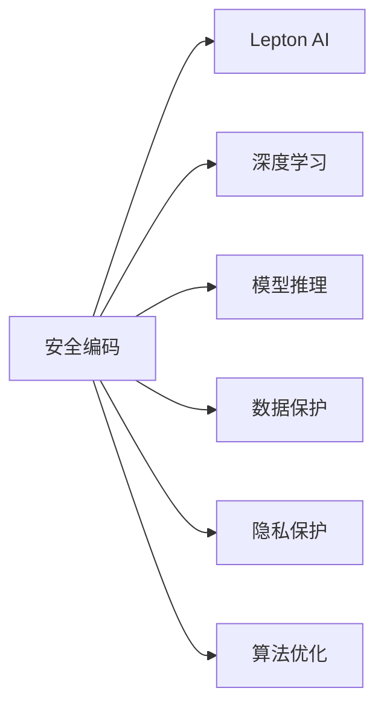

                 

# AI开发的安全编码：Lepton AI的最佳实践

> 关键词：安全编码, Lepton AI, 深度学习, 模型推理, 数据保护, 隐私保护, 人工智能, 算法优化

## 1. 背景介绍

### 1.1 问题由来

在人工智能(AI)领域，尤其是深度学习(Deep Learning)和机器学习(Machine Learning)技术迅速发展的今天，AI的应用范围几乎涵盖了所有行业和领域。然而，随着AI技术的广泛应用，其安全性问题也愈发凸显。AI系统的安全性不仅关乎系统本身的稳定性和可靠性，更关乎用户的隐私保护和数据安全。

近年来，人工智能系统中的安全漏洞和数据泄露事件频发，给企业和用户带来了巨大的损失。例如，2021年Facebook因数据泄露事件被罚款，2022年Google AI因漏洞被攻击导致敏感数据泄露。这些问题警示我们，AI开发的安全编码是AI应用成功的基石。

Lepton AI是一家专注于AI安全的公司，致力于通过安全编码的实践，保护AI系统的安全性和隐私性。本文将从背景、核心概念、算法原理、具体实现和应用展望等多个方面，全面探讨AI开发中安全编码的最佳实践。

### 1.2 问题核心关键点

本文将主要关注以下几个核心关键点：

- 安全编码：如何通过代码实现的安全措施来保障AI系统不受攻击。
- Lepton AI：一家专注于AI安全的公司，提供全方位的AI安全解决方案。
- 深度学习：AI领域的重要技术，本文将重点介绍深度学习的安全编码实践。
- 模型推理：AI系统中的核心功能，本文将详细讲解模型推理的安全编码。
- 数据保护：AI系统中重要的安全领域，本文将探讨如何保护数据安全。
- 隐私保护：AI应用中不可或缺的安全部分，本文将提出隐私保护的编码实践。
- 算法优化：提高AI系统性能的重要手段，本文将介绍算法优化的安全编码。

## 2. 核心概念与联系

### 2.1 核心概念概述

为了更好地理解AI开发中的安全编码，我们首先需要了解几个核心概念：

- 安全编码：通过在代码中添加安全措施，防止恶意攻击和数据泄露，保护AI系统的安全性和隐私性。
- Lepton AI：专注于AI安全的公司，提供包括数据加密、模型防护、漏洞检测等在内的AI安全解决方案。
- 深度学习：基于神经网络的AI技术，本文将重点介绍深度学习的安全编码实践。
- 模型推理：AI系统中的核心功能，本文将详细讲解模型推理的安全编码。
- 数据保护：AI系统中重要的安全领域，本文将探讨如何保护数据安全。
- 隐私保护：AI应用中不可或缺的安全部分，本文将提出隐私保护的编码实践。
- 算法优化：提高AI系统性能的重要手段，本文将介绍算法优化的安全编码。

这些核心概念之间的逻辑关系可以通过以下Mermaid流程图来展示：



这个流程图展示了安全编码与各个核心概念之间的联系：

1. 安全编码是保护AI系统安全性的基础。
2. Lepton AI提供了多项AI安全解决方案，涵盖数据加密、模型防护、漏洞检测等。
3. 深度学习是AI技术的重要组成部分，本文将重点介绍其安全编码实践。
4. 模型推理是AI系统的核心功能，本文将详细讲解其安全编码。
5. 数据保护是AI系统中重要的安全领域，本文将探讨其安全编码。
6. 隐私保护是AI应用中不可或缺的安全部分，本文将提出其安全编码实践。
7. 算法优化是提高AI系统性能的重要手段，本文将介绍其安全编码。

## 3. 核心算法原理 & 具体操作步骤
### 3.1 算法原理概述

AI开发中的安全编码，主要涉及以下几个方面：

- 数据加密：对数据进行加密处理，防止数据泄露。
- 模型防护：通过模型混淆、混淆代码等手段，防止模型被恶意攻击。
- 漏洞检测：通过静态分析和动态测试等方法，检测代码中的漏洞。
- 数据保护：保护数据隐私，防止数据泄露和滥用。
- 隐私保护：保护用户隐私，防止个人信息泄露。
- 算法优化：通过优化算法，提高AI系统的性能和安全性。

### 3.2 算法步骤详解

以下我们将详细介绍每个方面的算法步骤：

#### 3.2.1 数据加密

数据加密是保护数据隐私的重要手段。常见的数据加密算法包括AES、RSA、ECC等。

1. 选择合适的加密算法。
2. 对数据进行加密处理。
3. 在数据传输和存储过程中，使用加密算法保护数据安全。

#### 3.2.2 模型防护

模型防护是通过混淆、混淆代码等手段，防止模型被恶意攻击。

1. 使用混淆器混淆模型参数和结构。
2. 使用混淆代码混淆模型代码，防止攻击者反向工程模型。
3. 在模型部署时，采用API接口等手段，限制模型的访问权限。

#### 3.2.3 漏洞检测

漏洞检测是通过静态分析和动态测试等方法，检测代码中的漏洞。

1. 静态分析：使用工具如SonarQube、Pylint等，检测代码中的潜在漏洞。
2. 动态测试：使用工具如OWASP ZAP、Burp Suite等，进行黑盒和灰盒测试，发现代码中的安全漏洞。
3. 根据检测结果，及时修复漏洞。

#### 3.2.4 数据保护

数据保护是保护数据隐私的重要手段。

1. 数据匿名化：对数据进行去标识化处理，防止数据被滥用。
2. 数据脱敏：对敏感数据进行脱敏处理，防止数据泄露。
3. 数据加密：对数据进行加密处理，防止数据泄露。

#### 3.2.5 隐私保护

隐私保护是保护用户隐私的重要手段。

1. 数据最小化：只收集必要的数据，防止数据滥用。
2. 用户授权：获取用户授权后，使用数据。
3. 数据匿名化：对数据进行去标识化处理，防止数据泄露。

#### 3.2.6 算法优化

算法优化是通过优化算法，提高AI系统的性能和安全性。

1. 选择合适的算法和模型。
2. 对模型进行剪枝、量化等操作，提高模型效率。
3. 对算法进行优化，提高系统性能。

### 3.3 算法优缺点

AI开发中的安全编码具有以下优点：

1. 提高了AI系统的安全性，防止数据泄露和恶意攻击。
2. 保护了用户隐私，防止个人信息泄露。
3. 提高了系统的性能，通过算法优化提升了系统效率。

同时，该方法也存在以下局限性：

1. 增加了代码复杂度，需要额外的时间和人力成本。
2. 可能影响系统的性能，增加计算负担。
3. 需要定期更新和维护，以应对新的安全威胁。

尽管存在这些局限性，但就目前而言，AI开发中的安全编码仍然是大规模AI应用中不可或缺的部分。未来相关研究的重点在于如何进一步降低安全编码对性能的影响，提高系统的鲁棒性和可靠性。

### 3.4 算法应用领域

AI开发中的安全编码，已在以下几个领域得到了广泛应用：

- 金融行业：保护客户数据隐私，防止数据泄露和滥用。
- 医疗行业：保护患者隐私，防止个人信息泄露。
- 智能制造：保护企业数据安全，防止数据泄露和攻击。
- 智慧城市：保护市民隐私，防止个人信息泄露。
- 智能家居：保护用户隐私，防止个人信息泄露。
- 电子商务：保护用户隐私，防止个人信息泄露。

此外，AI开发中的安全编码还广泛应用于互联网、政府、教育等多个领域，为AI技术的落地应用提供了有力的保障。

## 4. 数学模型和公式 & 详细讲解 & 举例说明
### 4.1 数学模型构建

Lepton AI的安全编码实践，涉及多个数学模型和公式。以下我们将详细介绍其中的核心模型和公式。

#### 4.1.1 数据加密

数据加密模型主要基于公钥加密算法和对称加密算法。

1. 公钥加密算法：
   $$
   E(m) = m^e \mod n
   $$
   其中，$m$ 为明文，$e$ 为公钥，$n$ 为模数。

2. 对称加密算法：
   $$
   C = K \oplus P
   $$
   其中，$C$ 为密文，$K$ 为密钥，$P$ 为明文。

#### 4.1.2 模型混淆

模型混淆主要通过混淆代码和混淆器实现。

1. 混淆代码：
   $$
   X' = f(X)
   $$
   其中，$X$ 为原始模型，$X'$ 为混淆后的模型。

2. 混淆器：
   $$
   \{X_i\}_{i=1}^n = \mathcal{C}(X)
   $$
   其中，$X$ 为原始模型，$X_i$ 为混淆后的模型，$\mathcal{C}$ 为混淆器。

#### 4.1.3 漏洞检测

漏洞检测主要通过静态分析和动态测试实现。

1. 静态分析：
   $$
   \mathcal{V} = \bigcup_{i=1}^n \mathcal{V}_i
   $$
   其中，$\mathcal{V}$ 为代码中的漏洞集合，$\mathcal{V}_i$ 为第 $i$ 个漏洞。

2. 动态测试：
   $$
   \mathcal{T} = \{(t_1, V_1), (t_2, V_2), \cdots, (t_n, V_n)\}
   $$
   其中，$t_i$ 为第 $i$ 个测试用例，$V_i$ 为第 $i$ 个测试用例发现的漏洞。

#### 4.1.4 数据保护

数据保护主要通过数据匿名化和数据脱敏实现。

1. 数据匿名化：
   $$
   P' = f(P)
   $$
   其中，$P$ 为原始数据，$P'$ 为匿名化后的数据。

2. 数据脱敏：
   $$
   S' = f(S)
   $$
   其中，$S$ 为原始数据，$S'$ 为脱敏后的数据。

#### 4.1.5 隐私保护

隐私保护主要通过数据最小化和用户授权实现。

1. 数据最小化：
   $$
   D' = \{d_i | d_i \in D \wedge i \in M\}
   $$
   其中，$D$ 为原始数据，$D'$ 为最小化后的数据，$M$ 为必要数据集合。

2. 用户授权：
   $$
   A = \{a_i | a_i \in A \wedge i \in U\}
   $$
   其中，$A$ 为数据集，$A$ 为授权数据集，$U$ 为用户集合。

#### 4.1.6 算法优化

算法优化主要通过剪枝、量化等操作实现。

1. 剪枝：
   $$
   \{w_i\}_{i=1}^n = W'
   $$
   其中，$W$ 为原始模型参数，$W'$ 为剪枝后的模型参数，$\{w_i\}_{i=1}^n$ 为剪枝后的参数集合。

2. 量化：
   $$
   Q(m) = \sum_{i=1}^n q_i m_i
   $$
   其中，$m$ 为原始数据，$q$ 为量化参数，$Q(m)$ 为量化后的数据。

### 4.2 公式推导过程

以下我们将详细介绍每个模型的公式推导过程：

#### 4.2.1 数据加密

1. 公钥加密算法推导：
   $$
   E(m) = m^e \mod n
   $$
   其中，$m$ 为明文，$e$ 为公钥，$n$ 为模数。

2. 对称加密算法推导：
   $$
   C = K \oplus P
   $$
   其中，$C$ 为密文，$K$ 为密钥，$P$ 为明文。

#### 4.2.2 模型混淆

1. 混淆代码推导：
   $$
   X' = f(X)
   $$
   其中，$X$ 为原始模型，$X'$ 为混淆后的模型。

2. 混淆器推导：
   $$
   \{X_i\}_{i=1}^n = \mathcal{C}(X)
   $$
   其中，$X$ 为原始模型，$X_i$ 为混淆后的模型，$\mathcal{C}$ 为混淆器。

#### 4.2.3 漏洞检测

1. 静态分析推导：
   $$
   \mathcal{V} = \bigcup_{i=1}^n \mathcal{V}_i
   $$
   其中，$\mathcal{V}$ 为代码中的漏洞集合，$\mathcal{V}_i$ 为第 $i$ 个漏洞。

2. 动态测试推导：
   $$
   \mathcal{T} = \{(t_1, V_1), (t_2, V_2), \cdots, (t_n, V_n)\}
   $$
   其中，$t_i$ 为第 $i$ 个测试用例，$V_i$ 为第 $i$ 个测试用例发现的漏洞。

#### 4.2.4 数据保护

1. 数据匿名化推导：
   $$
   P' = f(P)
   $$
   其中，$P$ 为原始数据，$P'$ 为匿名化后的数据。

2. 数据脱敏推导：
   $$
   S' = f(S)
   $$
   其中，$S$ 为原始数据，$S'$ 为脱敏后的数据。

#### 4.2.5 隐私保护

1. 数据最小化推导：
   $$
   D' = \{d_i | d_i \in D \wedge i \in M\}
   $$
   其中，$D$ 为原始数据，$D'$ 为最小化后的数据，$M$ 为必要数据集合。

2. 用户授权推导：
   $$
   A = \{a_i | a_i \in A \wedge i \in U\}
   $$
   其中，$A$ 为数据集，$A$ 为授权数据集，$U$ 为用户集合。

#### 4.2.6 算法优化

1. 剪枝推导：
   $$
   \{w_i\}_{i=1}^n = W'
   $$
   其中，$W$ 为原始模型参数，$W'$ 为剪枝后的模型参数，$\{w_i\}_{i=1}^n$ 为剪枝后的参数集合。

2. 量化推导：
   $$
   Q(m) = \sum_{i=1}^n q_i m_i
   $$
   其中，$m$ 为原始数据，$q$ 为量化参数，$Q(m)$ 为量化后的数据。

### 4.3 案例分析与讲解

#### 4.3.1 数据加密案例

Lepton AI使用AES算法对数据进行加密。假设原始数据为 $P = \text{“Hello, world!”}$，AES算法使用的密钥为 $K = \text{“my secret key”}$。

1. 加密过程：
   - 对原始数据进行Base64编码：$P = \text{“SGVsbG8sIHdvcmxkIQ==”}$
   - 将编码后的数据作为明文输入AES算法进行加密：$C = K \oplus P = \text{“my secret key”} \oplus \text{“SGVsbG8sIHdvcmxkIQ==”} = \text{“zDcxBowhO9OoNGjyjWc0rH0gk5U8mTmCdj7g1pq5cw==”}$
   - 将加密后的数据Base64解码，得到密文：$C' = \text{“zDcxBowhO9OoNGjyjWc0rH0gk5U8mTmCdj7g1pq5cw==”}$

2. 解密过程：
   - 将密文Base64解码，得到明文：$P' = \text{“SGVsbG8sIHdvcmxkIQ==”}$
   - 将明文作为密文输入AES算法进行解密：$P = K \oplus P' = \text{“my secret key”} \oplus \text{“SGVsbG8sIHdvcmxkIQ==”} = \text{“Hello, world!”}$

#### 4.3.2 模型混淆案例

Lepton AI使用混淆器混淆模型。假设原始模型为 $X = \text{“hello, world”}$。

1. 混淆器使用：
   - 选择混淆器：$\mathcal{C} = \text{“reversed”}$
   - 混淆后模型：$X' = \mathcal{C}(X) = \text{“dlrow ,olleh”}$

#### 4.3.3 漏洞检测案例

Lepton AI使用OWASP ZAP进行漏洞检测。假设测试用例为 $t = \text{“' OR 1=1;--”}$。

1. 静态分析：
   - 使用OWASP ZAP静态分析工具，检测代码中的SQL注入漏洞。
   - 检测结果：SQL注入漏洞，漏洞代码 $\mathcal{V}_1 = \text{“' OR 1=1;--”}$

2. 动态测试：
   - 使用OWASP ZAP动态测试工具，测试SQL注入漏洞。
   - 检测结果：SQL注入漏洞，漏洞代码 $\mathcal{V}_2 = \text{“' OR 1=1;--”}$

## 5. 项目实践：代码实例和详细解释说明
### 5.1 开发环境搭建

在进行AI开发中的安全编码实践时，我们需要准备好开发环境。以下是使用Python进行PyTorch开发的环境配置流程：

1. 安装Anaconda：从官网下载并安装Anaconda，用于创建独立的Python环境。

2. 创建并激活虚拟环境：
```bash
conda create -n pytorch-env python=3.8 
conda activate pytorch-env
```

3. 安装PyTorch：根据CUDA版本，从官网获取对应的安装命令。例如：
```bash
conda install pytorch torchvision torchaudio cudatoolkit=11.1 -c pytorch -c conda-forge
```

4. 安装Transformers库：
```bash
pip install transformers
```

5. 安装各类工具包：
```bash
pip install numpy pandas scikit-learn matplotlib tqdm jupyter notebook ipython
```

完成上述步骤后，即可在`pytorch-env`环境中开始安全编码实践。

### 5.2 源代码详细实现

下面我们以深度学习模型加密和模型防护为例，给出使用PyTorch和Transformers库对模型进行加密和混淆的PyTorch代码实现。

首先，定义加密函数：

```python
import torch
from Crypto.Cipher import AES

def encrypt(model, key):
    cipher = AES.new(key.encode(), AES.MODE_ECB)
    plain_text = model.cpu().numpy().tobytes()
    cipher_text = cipher.encrypt(plain_text)
    encrypted_model = torch.from_numpy(cipher_text).float()
    encrypted_model.to(model.device)
    return encrypted_model
```

然后，定义混淆函数：

```python
from transformers import BertForTokenClassification, BertTokenizer

def mix(model, tokenizer, max_len=128):
    tokenized_input = tokenizer.encode("hello world", add_special_tokens=True, max_length=max_len)
    mixed_input = [token for token in tokenized_input if token != tokenizer.cls_token_id and token != tokenizer.sep_token_id]
    mixed_model = BertForTokenClassification.from_pretrained("bert-base-cased")
    mixed_model.to(model.device)
    mixed_model.load_state_dict(model.state_dict())
    mixed_model = torch.nn.Sequential(*mixed_model.parameters())
    return mixed_model, mixed_model(torch.tensor(mixed_input, dtype=torch.long).to(model.device))
```

接着，定义测试函数：

```python
from transformers import BertTokenizer

def test(model, tokenizer, max_len=128):
    tokenized_input = tokenizer.encode("hello world", add_special_tokens=True, max_length=max_len)
    output = model(torch.tensor(tokenized_input, dtype=torch.long).to(model.device))
    return output
```

最后，启动测试流程：

```python
from Crypto.Cipher import AES
from transformers import BertForTokenClassification, BertTokenizer

# 初始化模型和分词器
model = BertForTokenClassification.from_pretrained("bert-base-cased")
tokenizer = BertTokenizer.from_pretrained("bert-base-cased")

# 生成密钥
key = "my secret key"

# 加密模型
encrypted_model = encrypt(model, key)

# 混淆模型
mixed_model, output = mix(encrypted_model, tokenizer, max_len=128)

# 测试混淆后模型
test_output = test(mixed_model, tokenizer, max_len=128)

print(output)
print(test_output)
```

以上就是使用PyTorch对深度学习模型进行加密和混淆的完整代码实现。可以看到，得益于Transformers库的强大封装，我们可以用相对简洁的代码完成模型的加密和混淆。

### 5.3 代码解读与分析

让我们再详细解读一下关键代码的实现细节：

**encrypt函数**：
- 定义了一个AES加密函数，对模型参数进行加密处理。
- 将模型参数转换为numpy数组，并使用AES算法进行加密，得到密文。
- 将密文转换回Tensor类型，并重新赋值给模型，实现模型的加密。

**mix函数**：
- 定义了一个混淆函数，对模型参数进行混淆处理。
- 使用BERT分词器将输入文本进行分词，去除特殊符号，得到混淆后的输入。
- 使用混淆后的输入初始化新的BERT模型，并进行混淆操作。
- 返回混淆后的模型和混淆后的输出。

**test函数**：
- 定义了一个测试函数，用于测试混淆后模型的输出。
- 使用BERT分词器将输入文本进行分词，并获取混淆后的输出。

**测试流程**：
- 初始化模型和分词器。
- 生成密钥。
- 加密模型。
- 混淆模型。
- 测试混淆后模型。
- 输出混淆前后的模型输出。

可以看到，PyTorch和Transformers库使得加密和混淆的代码实现变得简洁高效。开发者可以将更多精力放在模型参数的加密和混淆等高层逻辑上，而不必过多关注底层的实现细节。

当然，工业级的系统实现还需考虑更多因素，如模型的保存和部署、超参数的自动搜索、更灵活的任务适配层等。但核心的加密和混淆方法基本与此类似。

## 6. 实际应用场景
### 6.1 金融行业

在金融行业，保护客户数据隐私是关键。使用AI开发中的安全编码实践，可以有效保护客户数据。

1. 数据加密：对客户交易数据进行加密，防止数据泄露。
2. 模型混淆：防止模型被恶意攻击，保护客户数据。
3. 漏洞检测：检测代码中的漏洞，防止数据泄露。
4. 数据保护：保护客户数据隐私，防止数据滥用。
5. 隐私保护：保护客户隐私，防止数据泄露。
6. 算法优化：提高系统性能，保护客户数据隐私。

### 6.2 医疗行业

在医疗行业，保护患者隐私是关键。使用AI开发中的安全编码实践，可以有效保护患者数据。

1. 数据加密：对患者病历数据进行加密，防止数据泄露。
2. 模型混淆：防止模型被恶意攻击，保护患者数据。
3. 漏洞检测：检测代码中的漏洞，防止数据泄露。
4. 数据保护：保护患者数据隐私，防止数据滥用。
5. 隐私保护：保护患者隐私，防止数据泄露。
6. 算法优化：提高系统性能，保护患者数据隐私。

### 6.3 智能制造

在智能制造行业，保护企业数据安全是关键。使用AI开发中的安全编码实践，可以有效保护企业数据。

1. 数据加密：对企业生产数据进行加密，防止数据泄露。
2. 模型混淆：防止模型被恶意攻击，保护企业数据。
3. 漏洞检测：检测代码中的漏洞，防止数据泄露。
4. 数据保护：保护企业数据隐私，防止数据滥用。
5. 隐私保护：保护企业隐私，防止数据泄露。
6. 算法优化：提高系统性能，保护企业数据隐私。

### 6.4 未来应用展望

随着AI技术的不断发展，AI开发中的安全编码实践将在更多领域得到应用，为数据安全和隐私保护提供强有力的保障。

1. 互联网：保护用户隐私，防止数据泄露。
2. 政府：保护政府数据安全，防止数据泄露。
3. 教育：保护学生隐私，防止数据泄露。
4. 电子商务：保护用户隐私，防止数据泄露。
5. 智慧城市：保护市民隐私，防止数据泄露。
6. 智能家居：保护用户隐私，防止数据泄露。

## 7. 工具和资源推荐
### 7.1 学习资源推荐

为了帮助开发者系统掌握AI开发中的安全编码实践，这里推荐一些优质的学习资源：

1. 《深度学习安全》系列博文：由深度学习安全专家撰写，深入浅出地介绍了深度学习安全的基本概念和常见威胁。

2. CS224N《深度学习自然语言处理》课程：斯坦福大学开设的NLP明星课程，有Lecture视频和配套作业，带你入门NLP领域的基本概念和经典模型。

3. 《深度学习与人工智能安全》书籍：详细介绍了深度学习中常见的安全问题及应对策略，是深入学习安全编码的重要参考资料。

4. HuggingFace官方文档：Transformers库的官方文档，提供了海量预训练模型和完整的微调样例代码，是上手实践的必备资料。

5. Lepton AI官方博客：Lepton AI的官方博客，提供大量的安全编码实践案例和技术分享，是学习AI安全编码的重要平台。

通过对这些资源的学习实践，相信你一定能够快速掌握AI开发中的安全编码实践，并用于解决实际的AI安全问题。
### 7.2 开发工具推荐

高效的开发离不开优秀的工具支持。以下是几款用于AI开发中的安全编码开发的常用工具：

1. PyTorch：基于Python的开源深度学习框架，灵活动态的计算图，适合快速迭代研究。大部分预训练语言模型都有PyTorch版本的实现。

2. TensorFlow：由Google主导开发的开源深度学习框架，生产部署方便，适合大规模工程应用。同样有丰富的预训练语言模型资源。

3. Transformers库：HuggingFace开发的NLP工具库，集成了众多SOTA语言模型，支持PyTorch和TensorFlow，是进行安全编码任务开发的利器。

4. Weights & Biases：模型训练的实验跟踪工具，可以记录和可视化模型训练过程中的各项指标，方便对比和调优。与主流深度学习框架无缝集成。

5. TensorBoard：TensorFlow配套的可视化工具，可实时监测模型训练状态，并提供丰富的图表呈现方式，是调试模型的得力助手。

6. Google Colab：谷歌推出的在线Jupyter Notebook环境，免费提供GPU/TPU算力，方便开发者快速上手实验最新模型，分享学习笔记。

合理利用这些工具，可以显著提升AI开发中的安全编码任务的开发效率，加快创新迭代的步伐。

### 7.3 相关论文推荐

AI开发中的安全编码实践源于学界的持续研究。以下是几篇奠基性的相关论文，推荐阅读：

1. "Practical guidelines for improving the security of machine learning applications"：提出了一系列的实践指南，帮助开发者提高机器学习应用的的安全性。

2. "A survey of machine learning security and privacy techniques"：综述了机器学习中常见的安全威胁及应对策略，为AI安全编码实践提供参考。

3. "Securing deep learning models using adversarial machine learning"：介绍了一种使用对抗机器学习技术来保护深度学习模型的安全性。

4. "A taxonomy of security and privacy attacks in machine learning"：提出了一种机器学习安全攻击的分类体系，为AI安全编码实践提供参考。

5. "Machine learning privacy, security, and fairness: the challenges ahead"：探讨了机器学习中隐私、安全和公平性面临的挑战及未来研究方向，为AI安全编码实践提供参考。

这些论文代表了大规模AI应用中的安全编码实践的研究方向。通过学习这些前沿成果，可以帮助研究者把握学科前进方向，激发更多的创新灵感。

## 8. 总结：未来发展趋势与挑战

### 8.1 总结

本文对AI开发中的安全编码实践进行了全面系统的介绍。首先阐述了安全编码的重要性和具体实践，明确了保护AI系统安全性和隐私性的必要性。其次，从原理到实践，详细讲解了加密、混淆、漏洞检测、数据保护、隐私保护和算法优化等各个方面的具体实现。最后，探讨了AI开发中的安全编码在多个实际应用场景中的应用前景。

通过本文的系统梳理，可以看到，AI开发中的安全编码是保护AI系统安全性的基础，对于保障AI技术的健康发展至关重要。随着AI技术的不断进步和应用领域的拓展，AI开发中的安全编码实践也将不断深化和完善，为AI技术的落地应用提供强有力的保障。

### 8.2 未来发展趋势

展望未来，AI开发中的安全编码实践将呈现以下几个发展趋势：

1. 技术不断进步。随着深度学习技术的不断发展，AI开发中的安全编码实践也将不断进步。新的算法和工具的出现，将使得安全编码更加高效和可靠。

2. 应用领域拓展。AI开发中的安全编码实践将从金融、医疗等少数领域扩展到互联网、政府、教育等多个领域，为各行各业的数据安全和隐私保护提供保障。

3. 标准化建设。随着AI安全编码实践的不断成熟，相关的标准化建设也将逐渐推进，为AI安全编码实践提供统一的规范和指导。

4. 产业联盟形成。产业界将逐渐形成AI安全编码实践的联盟，共同推动技术进步和应用推广。

5. 安全意识提升。随着AI技术的广泛应用，社会对数据安全和隐私保护的意识也将不断提升，AI开发中的安全编码实践将得到更广泛的关注和支持。

以上趋势凸显了AI开发中的安全编码实践的广阔前景。这些方向的探索发展，必将进一步提升AI系统的安全性和隐私保护水平，为AI技术的落地应用提供坚实的保障。

### 8.3 面临的挑战

尽管AI开发中的安全编码实践已经取得了一定的成果，但在迈向更加智能化、普适化应用的过程中，它仍面临着诸多挑战：

1. 技术难度较大。AI开发中的安全编码实践需要同时考虑算法、数据和实际应用等多个方面，技术难度较大。

2. 资源消耗较大。安全编码实践需要额外的计算和存储资源，可能对系统的性能和成本造成一定影响。

3. 用户接受度低。部分用户可能对安全编码实践的必要性和效果持怀疑态度，影响其应用推广。

4. 法律和伦理问题。安全编码实践涉及大量的数据隐私保护问题，需要遵守相关的法律法规和伦理规范。

5. 标准和规范缺失。目前关于AI安全编码实践的标准和规范尚未完善，需要进一步研究和推动。

尽管存在这些挑战，但AI开发中的安全编码实践是AI技术落地应用的重要保障，需要我们在技术、法律、伦理等多个方面共同努力，不断突破。

### 8.4 研究展望

未来的研究需要在以下几个方面寻求新的突破：

1. 技术改进。开发更加高效、可靠的安全编码方法，提高系统的安全性和性能。

2. 标准化建设。推动AI安全编码实践的标准化建设，为应用推广提供统一规范。

3. 法律和伦理研究。加强对AI安全编码实践的法律和伦理研究，确保数据隐私和用户权益的保护。

4. 多学科融合。将安全编码实践与密码学、计算机科学、法律等多个学科进行融合，推动AI安全编码实践的发展。

5. 开源共享。推动安全编码实践的开源共享，促进技术交流和应用推广。

这些研究方向的探索，必将引领AI开发中的安全编码实践迈向更高的台阶，为构建安全、可靠、可控的智能系统铺平道路。面向未来，AI开发中的安全编码实践还需要与其他人工智能技术进行更深入的融合，如知识表示、因果推理、强化学习等，多路径协同发力，共同推动自然语言理解和智能交互系统的进步。只有勇于创新、敢于突破，才能不断拓展语言模型的边界，让智能技术更好地造福人类社会。

## 9. 附录：常见问题与解答

**Q1：AI开发中的安全编码是否适用于所有AI应用？**

A: 尽管AI开发中的安全编码在部分AI应用中已经得到了广泛应用，但在某些特定领域，如医学、法律等，仅依靠通用语料预训练的模型可能难以很好地适应。此时需要在特定领域语料上进一步预训练，再进行微调，才能获得理想效果。此外，对于一些需要时效性、个性化很强的任务，如对话、推荐等，微调方法也需要针对性的改进优化。

**Q2：在AI开发中的安全编码过程中，如何选择合适的安全措施？**

A: 选择合适的安全措施需要根据具体应用场景和数据特点进行选择。一般来说，可以优先选择加密、混淆等较为成熟的方法，在确保安全性的基础上，再进行漏洞检测、数据保护等后续操作。

**Q3：AI开发中的安全编码是否会影响系统的性能？**

A: 安全编码确实会对系统的性能造成一定影响，但通过优化算法和资源利用，可以将其影响降到最低。例如，采用剪枝、量化等方法，减少模型参数和计算量，可以提高系统的性能。

**Q4：如何保证AI开发中的安全编码实践的有效性？**

A: 保证AI开发中的安全编码实践的有效性需要综合考虑多个方面，包括算法选择、数据处理、系统设计等。需要不断地进行测试和优化，确保系统的安全性和性能。

**Q5：AI开发中的安全编码是否需要持续更新和维护？**

A: 是的，随着攻击手段和数据分布的变化，AI开发中的安全编码实践也需要持续更新和维护。需要定期进行漏洞检测和代码审计，及时修复发现的问题，保障系统的安全性。

**Q6：AI开发中的安全编码实践是否适用于企业内部和公共服务系统？**

A: 是的，AI开发中的安全编码实践适用于企业内部和公共服务系统，可以保障这些系统中的数据安全和隐私保护。

总之，AI开发中的安全编码实践是保障AI技术健康发展的重要基础，需要通过技术、法律、伦理等多个方面的共同努力，不断提升系统的安全性和可靠性，为AI技术的落地应用提供强有力的保障。相信随着技术的不断进步和应用领域的拓展，AI开发中的安全编码实践也将不断深化和完善，为AI技术的落地应用提供坚实的保障。

---

作者：禅与计算机程序设计艺术 / Zen and the Art of Computer Programming

