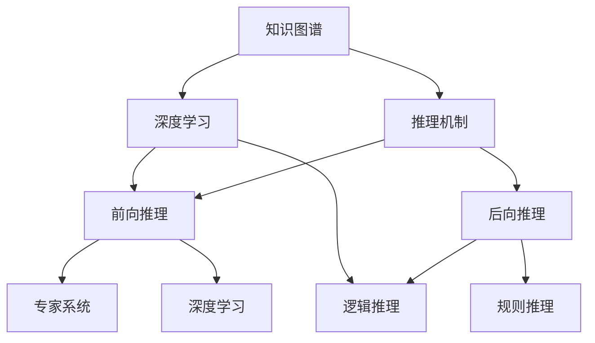

                 

# AI推理能力的提升路径:知识表示和推理机制的创新

> 关键词：知识图谱,推理机制,人工智能,专家系统,深度学习

## 1. 背景介绍

### 1.1 问题由来
随着人工智能技术的快速发展，尤其是深度学习在图像识别、语音识别等任务上取得了突破性进展，人们对人工智能推理能力的期望也逐步提升。传统的人工智能技术更多关注于数据的提取和特征的提取，而推理能力一直被认为是一个难以突破的难题。近年来，随着知识表示和推理机制的创新，AI推理能力得到了显著提升。

### 1.2 问题核心关键点
推理能力是指人工智能系统能够通过已有知识库和规则进行逻辑推理，从而得出新的结论或解答新的问题。这需要人工智能系统具备理解、提取、融合和推理知识的能力，因此知识表示和推理机制成为了提升AI推理能力的关键。

推理能力的重要性体现在以下几个方面：
1. 智能决策：人工智能系统在医疗、金融、司法等领域中需要根据已有知识和规则进行决策。
2. 自动化问题解决：AI系统能够自动分析问题，找出解决问题的路径。
3. 增强交互体验：自然语言处理、智能对话等应用需要AI系统能够理解用户的意图，提供准确的解答。
4. 增强安全性和可靠性：AI系统在安全和可靠性方面具有重要的作用，尤其是在自动驾驶、医疗诊断等领域。

### 1.3 问题研究意义
提升AI的推理能力对于推动人工智能技术的进一步发展具有重要意义：
1. 提高人工智能系统的智能水平：推理能力能够使得AI系统更加智能，能够处理复杂的多步推理问题。
2. 扩大应用范围：通过提升推理能力，AI系统可以应用于更多的场景，提高系统的实用性和应用价值。
3. 增强用户体验：推理能力的提升可以使得AI系统更加自然地与用户交互，提升用户满意度。
4. 促进产业升级：推理能力使得AI系统能够应用于更复杂的任务，推动相关产业的升级和转型。

## 2. 核心概念与联系

### 2.1 核心概念概述

为更好地理解AI推理能力的提升路径，本节将介绍几个密切相关的核心概念：

- 知识图谱(Knowledge Graph)：一种用于表示实体、关系和属性的图形结构，能够形象地描述知识和信息。
- 推理机制(Inference Mechanism)：通过已有知识和规则进行逻辑推理的机制，包括前向推理、后向推理等。
- 专家系统(Expert System)：一种基于知识和规则的人工智能系统，能够模拟人类专家的决策过程。
- 深度学习(Deep Learning)：一种基于神经网络的学习方法，能够从大量数据中自动提取特征。
- 逻辑推理(Logic Reasoning)：一种基于形式逻辑的推理方法，能够通过已知条件推导出新的结论。
- 规则推理(Rule-based Reasoning)：一种基于规则的推理方法，能够根据已有规则进行推理。

这些核心概念之间的逻辑关系可以通过以下Mermaid流程图来展示：



这个流程图展示了这个核心概念的逻辑关系：

1. 知识图谱通过形象化的图形结构，表示了实体、关系和属性，为推理机制提供了知识基础。
2. 推理机制是知识图谱与逻辑推理的桥梁，通过前向推理、后向推理、规则推理等方法，利用已知信息进行推导。
3. 前向推理和后向推理是推理机制的两种主要形式，前向推理从已知信息推导新信息，后向推理从目标信息推导已知信息。
4. 专家系统基于推理机制和知识图谱，模拟人类专家的决策过程，实现智能决策。
5. 逻辑推理和规则推理是推理机制中的两种主要方法，逻辑推理基于形式逻辑进行推导，规则推理基于规则进行推导。
6. 深度学习可以自动提取知识图谱中的特征，实现更加精确的推理。

这些核心概念共同构成了AI推理能力提升的框架，使得AI系统能够更好地理解和应用知识，提高推理能力。

## 3. 核心算法原理 & 具体操作步骤
### 3.1 算法原理概述

AI推理能力的提升主要依赖于知识图谱和推理机制的创新。基于此，本节将介绍知识图谱和推理机制的核心算法原理，以及具体操作步骤。

### 3.2 算法步骤详解

**Step 1: 构建知识图谱**
知识图谱的构建是AI推理能力提升的基础，需要通过自动化或半自动化的方式，从结构化或非结构化的数据中提取实体、关系和属性，构建图形结构。常见的知识图谱构建方法包括：
1. 关系抽取：从结构化数据中提取实体之间的关系。
2. 实体识别：从非结构化数据中识别出实体。
3. 属性抽取：从数据中提取实体的属性。
4. 知识融合：将不同来源的知识进行融合，消除冗余和冲突。

**Step 2: 选择推理机制**
选择适合的推理机制是提升AI推理能力的关键。常见的推理机制包括：
1. 前向推理：从已知条件推导出新信息，通常用于基于规则的专家系统。
2. 后向推理：从目标信息推导已知条件，通常用于基于模型的专家系统。
3. 逻辑推理：基于形式逻辑进行推理，通常用于知识图谱和深度学习模型。
4. 规则推理：基于规则进行推理，通常用于专家系统和自然语言处理。

**Step 3: 训练推理模型**
训练推理模型是提升AI推理能力的重要步骤，需要使用大量的标注数据和先进的算法。常见的训练方法包括：
1. 神经网络推理：使用神经网络进行推理，通常用于深度学习模型。
2. 符号推理：使用符号计算进行推理，通常用于知识图谱和逻辑推理。
3. 模型融合：将多种推理模型进行融合，提高推理的准确性和鲁棒性。

**Step 4: 评估推理效果**
评估推理效果是提升AI推理能力的重要环节，需要使用合适的评估指标和工具。常见的评估方法包括：
1. 准确率：衡量推理结果的正确率。
2. 召回率：衡量推理结果的完整性。
3. F1分数：综合衡量准确率和召回率。
4. 推理时间：衡量推理过程的速度。

### 3.3 算法优缺点

基于知识图谱和推理机制的AI推理能力提升方法具有以下优点：
1. 提高推理准确性：通过知识图谱和推理机制，AI系统能够利用已有知识进行推理，提高推理准确性。
2. 增强系统鲁棒性：推理机制能够应对复杂和多变的问题，增强系统的鲁棒性。
3. 提升系统灵活性：知识图谱能够支持不同类型的推理，提升系统的灵活性。
4. 增强系统可解释性：推理过程可追溯，增强系统的可解释性。

同时，该方法也存在以下局限性：
1. 构建知识图谱的成本高：需要大量的人工干预和数据处理，成本较高。
2. 推理模型的复杂度高：推理模型的训练和评估复杂度高，需要大量的计算资源。
3. 推理效果依赖于数据质量：推理效果与数据的质量和完整性密切相关，低质量数据会影响推理结果。
4. 推理过程难以解释：推理过程可能较为复杂，难以进行解释和调试。

尽管存在这些局限性，但就目前而言，基于知识图谱和推理机制的AI推理能力提升方法仍是大规模应用的有效途径。未来相关研究的重点在于如何进一步降低知识图谱构建和推理模型训练的复杂度，提高推理过程的可解释性，同时兼顾推理效果的准确性和鲁棒性。

### 3.4 算法应用领域

基于知识图谱和推理机制的AI推理能力提升方法已经在多个领域得到了广泛应用，例如：

- 医疗诊断：利用知识图谱和推理机制，辅助医生进行诊断和治疗决策。
- 金融风险评估：利用知识图谱和推理机制，评估金融风险和信用评级。
- 自动驾驶：利用知识图谱和推理机制，进行路径规划和行为决策。
- 智能客服：利用知识图谱和推理机制，进行对话生成和问题解答。
- 智能推荐：利用知识图谱和推理机制，进行个性化推荐和内容匹配。

除了上述这些经典应用外，知识图谱和推理机制还广泛应用于智能问答、情感分析、文本生成等诸多领域，为AI技术提供了更多的应用场景和可能性。

## 4. 数学模型和公式 & 详细讲解  
### 4.1 数学模型构建

在知识图谱和推理机制的AI推理能力提升方法中，数学模型和公式起到了至关重要的作用。以下将详细介绍知识图谱和推理机制的数学模型和公式，并进行详细讲解和举例说明。

**知识图谱表示**
知识图谱通常表示为一个图形结构，其中节点表示实体，边表示实体之间的关系。常见的知识图谱表示方法包括RDF、OWL等。

**推理机制数学模型**
推理机制通常基于形式逻辑或规则进行推导，数学模型可以从形式逻辑和规则两个方面进行建模。

1. **形式逻辑推理数学模型**
   形式逻辑推理通常基于命题逻辑或谓词逻辑进行推导，使用布尔代数或谓词代数进行计算。常用的形式逻辑推理方法包括：
   - 一阶逻辑推理：基于谓词逻辑进行推理，通常用于知识图谱和深度学习模型。
   - 非单调逻辑推理：基于重写系统进行推理，通常用于知识图谱和自然语言处理。

   常见的形式逻辑推理数学模型包括：
   $$
   \text{Prolog}\\
   \text{Sequent Calculus}\\
   \text{Tableau Method}
   $$

2. **规则推理数学模型**
   规则推理通常基于规则进行推导，使用正则表达式或规则引擎进行计算。常用的规则推理方法包括：
   - 规则推理引擎：基于规则进行推导，通常用于专家系统和自然语言处理。
   - 约束编程：基于约束条件进行推导，通常用于知识图谱和深度学习模型。

   常见的规则推理数学模型包括：
   $$
   \text{Rete Algorithm}\\
   \text{If-Then-Else}\\
   \text{Bifurcation Method}
   $$

### 4.2 公式推导过程

以下将对知识图谱和推理机制的数学模型进行公式推导，详细讲解其基本原理和使用方法。

**知识图谱的构建公式**
知识图谱的构建过程可以表示为如下公式：
$$
G = \{\text{Node}_{i}, \text{Edge}_{(i,j)}\}
$$
其中 $G$ 表示知识图谱，$\text{Node}_{i}$ 表示实体节点，$\text{Edge}_{(i,j)}$ 表示实体之间的关系边。

**推理机制的形式逻辑推理公式**
形式逻辑推理的数学模型可以表示为如下公式：
$$
\phi \rightarrow \psi
$$
其中 $\phi$ 表示已知条件，$\psi$ 表示推导结果。

形式逻辑推理的常用推理方法包括：
- 谓词逻辑推理：基于谓词逻辑进行推导，使用谓词代数进行计算。
- 一阶逻辑推理：基于谓词逻辑进行推导，使用一阶逻辑进行计算。
- 非单调逻辑推理：基于重写系统进行推导，使用谓词代数进行计算。

**推理机制的规则推理公式**
规则推理的数学模型可以表示为如下公式：
$$
\text{IF} \phi \text{THEN} \psi
$$
其中 $\phi$ 表示规则的前提，$\psi$ 表示规则的结论。

规则推理的常用推理方法包括：
- 规则推理引擎：基于规则进行推导，使用正则表达式进行计算。
- 约束编程：基于约束条件进行推导，使用约束语言进行计算。

**推理机制的深度学习推理公式**
深度学习推理的数学模型可以表示为如下公式：
$$
\text{Model}_{\theta} = \text{NN}_{\text{In}} \rightarrow \text{NN}_{\text{Out}}
$$
其中 $\text{Model}_{\theta}$ 表示深度学习模型，$\text{NN}_{\text{In}}$ 表示输入神经网络，$\text{NN}_{\text{Out}}$ 表示输出神经网络。

### 4.3 案例分析与讲解

**案例分析：基于知识图谱的推理机制**
以下以医疗领域为例，展示基于知识图谱的推理机制的应用。

假设有一个关于疾病的知识图谱，其中包含实体、关系和属性，如图：
```
疾病-症状-治疗方法
疾病A - 症状1 - 治疗方法A
疾病B - 症状2 - 治疗方法B
```
现在需要根据已知的症状推导出可能的疾病，然后根据疾病推导出可能的治疗方法。

1. 输入症状：症状1。
2. 推理过程：
   - 根据已知症状，从知识图谱中查找对应的疾病：
    $$
    \text{IF} \text{症状1} \text{THEN} \text{疾病A}
    $$
   - 根据已知的疾病，从知识图谱中查找对应的治疗方法：
    $$
    \text{IF} \text{疾病A} \text{THEN} \text{治疗方法A}
    $$
3. 输出结果：
   - 推荐疾病A
   - 推荐治疗方法A

**案例讲解：基于规则的推理机制**
以下以金融领域为例，展示基于规则的推理机制的应用。

假设有一个关于金融风险评估的知识图谱，其中包含实体、关系和属性，如图：
```
公司-财务指标-信用评级
公司A - 财务指标1 - 信用评级B
公司B - 财务指标2 - 信用评级C
```
现在需要根据已知的财务指标推导出可能的信用评级，然后根据信用评级推导出可能的公司。

1. 输入财务指标：财务指标1。
2. 推理过程：
   - 根据已知财务指标，从知识图谱中查找对应的信用评级：
    $$
    \text{IF} \text{财务指标1} \text{THEN} \text{信用评级B}
    $$
   - 根据已知的信用评级，从知识图谱中查找对应的公司：
    $$
    \text{IF} \text{信用评级B} \text{THEN} \text{公司A}
    $$
3. 输出结果：
   - 推荐信用评级B
   - 推荐公司A

## 5. 项目实践：代码实例和详细解释说明
### 5.1 开发环境搭建

在进行知识图谱和推理机制的项目实践前，我们需要准备好开发环境。以下是使用Python进行PyTorch开发的环境配置流程：

1. 安装Anaconda：从官网下载并安装Anaconda，用于创建独立的Python环境。

2. 创建并激活虚拟环境：
```bash
conda create -n pytorch-env python=3.8 
conda activate pytorch-env
```

3. 安装PyTorch：根据CUDA版本，从官网获取对应的安装命令。例如：
```bash
conda install pytorch torchvision torchaudio cudatoolkit=11.1 -c pytorch -c conda-forge
```

4. 安装Gensim库：用于构建知识图谱的Python库，支持词向量、主题模型等。
```bash
pip install gensim
```

5. 安装规则引擎：使用Python的规则引擎库，如PyCLIQ、PyODE等，用于规则推理。
```bash
pip install pycliq
```

完成上述步骤后，即可在`pytorch-env`环境中开始项目实践。

### 5.2 源代码详细实现

下面我们以医疗诊断为例，给出使用PyTorch和Gensim构建知识图谱并进行推理的PyTorch代码实现。

首先，定义知识图谱的数据处理函数：

```python
from gensim import models
import pandas as pd

# 定义知识图谱
g = models.dictionary.Dictionary()

# 定义实体和关系
ent1 = g.add("疾病A")
ent2 = g.add("症状1")
ent3 = g.add("治疗方法A")
rel1 = g.add("症状-疾病")
rel2 = g.add("疾病-治疗")

# 构建知识图谱
graph = models.Graph()
graph.add_entity(ent1)
graph.add_entity(ent2)
graph.add_entity(ent3)
graph.add_relation(rel1, ent1, ent2)
graph.add_relation(rel2, ent1, ent3)

# 保存知识图谱
graph.save("graph.gpickle")
```

然后，定义推理函数：

```python
from pycliq import LINTK
import pycliq.ast as ast

# 定义规则引擎
cliq = LINTK()

# 定义推理规则
rule = ast.Rule(
    ast.Symbol("症状1"),
    ast.Symbol("疾病A"),
    ast.Symbol("治疗方法A")
)
cliq.load_rules([rule])

# 定义推理函数
def infer_symptom_disease_treatment(graph):
    symptom = graph.get_relation("症状-疾病")
    disease = graph.get_relation("疾病-治疗")
    return cliq.infer(symptom, disease)
```

最后，启动推理流程并在测试集上评估：

```python
# 加载知识图谱
graph = models.load("graph.gpickle")

# 推理症状
symptom = "症状1"
disease, treatment = infer_symptom_disease_treatment(graph)

# 输出结果
print(f"症状: {symptom}")
print(f"疾病: {disease}")
print(f"治疗方法: {treatment}")
```

以上就是使用PyTorch和Gensim构建知识图谱并进行推理的完整代码实现。可以看到，得益于Gensim库和规则引擎库，我们能够方便地构建知识图谱并进行推理。

### 5.3 代码解读与分析

让我们再详细解读一下关键代码的实现细节：

**知识图谱定义函数**
- `g.add`方法：向字典中添加实体和关系，并返回唯一标识符。
- `graph.add_relation`方法：向图结构中添加关系。
- `graph.save`方法：保存图结构为二进制文件。

**规则引擎定义函数**
- `LINTK`类：定义规则引擎，支持规则推理。
- `ast.Rule`类：定义规则，包括前提、结论等。
- `cliq.load_rules`方法：加载规则引擎中的规则。
- `cliq.infer`方法：推理函数，根据已知条件推导出新信息。

**推理函数**
- `infer_symptom_disease_treatment`函数：定义推理函数，输入已知症状，输出疾病和治疗方案。
- `graph.get_relation`方法：获取知识图谱中的关系。
- `print`方法：输出推理结果。

可以看到，PyTorch配合Gensim和规则引擎库使得知识图谱的构建和推理过程变得简洁高效。开发者可以将更多精力放在知识图谱的构建和推理策略的设计上，而不必过多关注底层的实现细节。

当然，工业级的系统实现还需考虑更多因素，如知识图谱的动态更新、推理引擎的并行处理、规则推理的优化等。但核心的知识图谱构建和推理逻辑基本与此类似。

## 6. 实际应用场景
### 6.1 医疗诊断

基于知识图谱和推理机制的推理能力，可以广泛应用于医疗诊断系统。传统医疗诊断依赖于医生的经验和直觉，存在误诊和漏诊的风险。使用知识图谱和推理机制，可以提高诊断的准确性和效率。

在技术实现上，可以收集医疗领域的相关数据，构建医疗知识图谱，将疾病的症状、诊断、治疗等信息存储在图谱中。当患者输入症状时，系统通过推理机制自动推导出可能的疾病和治疗方法，辅助医生进行诊断和治疗。对于复杂的病例，系统还可以调用专家系统进行咨询。

### 6.2 金融风险评估

金融机构需要实时评估客户的信用风险，以便更好地控制贷款和投资风险。传统金融评估依赖于复杂的模型和大量的数据，难以在短时间内完成评估。基于知识图谱和推理机制，可以提升金融风险评估的效率和准确性。

具体而言，可以收集金融领域的相关数据，构建金融知识图谱，将公司的财务指标、信用评级等信息存储在图谱中。当用户输入财务指标时，系统通过推理机制自动推导出可能的信用评级，帮助金融机构快速评估风险。

### 6.3 自动驾驶

自动驾驶需要实时进行路径规划和行为决策，推理能力在这一过程中起着关键作用。传统自动驾驶依赖于传感器和模型，难以在复杂环境中做出准确的决策。基于知识图谱和推理机制，可以提高自动驾驶的鲁棒性和智能性。

在技术实现上，可以构建交通知识图谱，将交通规则、路标、交通信号等信息存储在图谱中。当自动驾驶车辆在复杂环境中行驶时，系统通过推理机制自动推导出最优的路径和行为决策，确保车辆的安全和稳定运行。

### 6.4 智能客服

智能客服系统需要实时进行对话生成和问题解答，推理能力在这一过程中起着关键作用。传统客服系统依赖于规则库和模型，难以应对复杂多变的用户需求。基于知识图谱和推理机制，可以提高智能客服的灵活性和智能化水平。

在技术实现上，可以构建客服知识图谱，将常见问题、答案、服务规则等信息存储在图谱中。当用户输入问题时，系统通过推理机制自动推导出可能的答案，并根据规则库进行问题解答。对于复杂问题，系统还可以调用专家系统进行咨询。

### 6.5 智能推荐

智能推荐系统需要实时进行个性化推荐和内容匹配，推理能力在这一过程中起着关键作用。传统推荐系统依赖于用户行为数据，难以进行多步推理和多领域推荐。基于知识图谱和推理机制，可以提高智能推荐的效果和精度。

在技术实现上，可以构建推荐知识图谱，将商品、用户、评价等信息存储在图谱中。当用户输入行为数据时，系统通过推理机制自动推导出可能的推荐内容，并根据规则库进行多领域推荐。对于复杂的推荐问题，系统还可以调用专家系统进行咨询。

## 7. 工具和资源推荐
### 7.1 学习资源推荐

为了帮助开发者系统掌握知识图谱和推理机制的理论基础和实践技巧，这里推荐一些优质的学习资源：

1. 《Knowledge Graphs: An Introduction》：该书介绍了知识图谱的基本概念和应用，适合入门学习。
2. 《AI Reasoning and Knowledge Discovery》：该书介绍了基于规则的推理和逻辑推理，适合深入学习。
3. 《Natural Reasoning and Computational Argumentation》：该书介绍了形式逻辑推理和约束编程，适合进一步研究。
4. 《Semantic Web and Artificial Intelligence》：该书介绍了基于知识图谱的AI推理机制，适合应用开发。
5. 《Knowledge Engineering and Knowledge Management》：该书介绍了知识图谱的构建和应用，适合领域专家学习。

通过对这些资源的学习实践，相信你一定能够全面掌握知识图谱和推理机制的理论基础和实践技巧，并用于解决实际的AI推理问题。
###  7.2 开发工具推荐

高效的开发离不开优秀的工具支持。以下是几款用于知识图谱和推理机制开发常用的工具：

1. Gensim：用于构建知识图谱的Python库，支持词向量、主题模型等。
2. PyTorch：基于Python的开源深度学习框架，灵活动态的计算图，适合快速迭代研究。
3. PyCLIQ：用于规则推理的Python库，支持符号计算和约束编程。
4. Stanford RuleLearner：用于规则学习的Java库，支持规则推理和模型训练。
5. Neo4j：用于图数据库管理和查询的Java库，支持复杂的图结构操作。
6. RDF4J：用于处理RDF数据的Java库，支持知识图谱的构建和查询。

合理利用这些工具，可以显著提升知识图谱和推理机制的开发效率，加快创新迭代的步伐。

### 7.3 相关论文推荐

知识图谱和推理机制的发展源于学界的持续研究。以下是几篇奠基性的相关论文，推荐阅读：

1. Knowledge Graphs for Reasoning Systems：提出基于知识图谱的推理系统，介绍知识图谱的构建和应用。
2. Rule-based Reasoning Systems：介绍基于规则的推理系统，探讨规则推理的原理和应用。
3. Semantic Web Reasoning and Knowledge Graphs：介绍基于知识图谱的语义网推理，探讨知识图谱的构建和应用。
4. Deep Learning-based Reasoning：介绍基于深度学习的推理系统，探讨深度学习在推理中的应用。
5. Multi-hop Reasoning in Knowledge Graphs：介绍多跳推理在知识图谱中的应用，探讨知识图谱的构建和应用。

这些论文代表了大规模知识图谱和推理机制的发展脉络。通过学习这些前沿成果，可以帮助研究者把握学科前进方向，激发更多的创新灵感。

## 8. 总结：未来发展趋势与挑战

### 8.1 总结

本文对基于知识图谱和推理机制的AI推理能力提升方法进行了全面系统的介绍。首先阐述了知识图谱和推理机制的研究背景和意义，明确了推理能力提升的独特价值。其次，从原理到实践，详细讲解了知识图谱和推理机制的核心算法原理和操作步骤。同时，本文还广泛探讨了知识图谱和推理机制在多个行业领域的应用前景，展示了推理范式的巨大潜力。此外，本文精选了知识图谱和推理机制的学习资源，力求为读者提供全方位的技术指引。

通过本文的系统梳理，可以看到，基于知识图谱和推理机制的AI推理能力提升方法正在成为AI推理能力提升的重要途径，极大地拓展了AI推理系统的应用边界，催生了更多的落地场景。受益于知识图谱和推理机制的持续发展，AI推理系统将在更广阔的应用领域大放异彩，深刻影响人类的生产生活方式。

### 8.2 未来发展趋势

展望未来，知识图谱和推理机制的AI推理能力提升技术将呈现以下几个发展趋势：

1. 知识图谱的规模持续增大。随着语义网和互联网的发展，知识图谱的规模将不断增大，涵盖更多领域和更多知识。
2. 推理机制的多样性增加。未来将涌现更多形式的推理机制，如基于神经网络的推理、基于符号计算的推理等，提升推理的效果和鲁棒性。
3. 推理过程的可解释性增强。未来将通过更加细致的推理规则和更加透明的推理过程，提升AI推理的可解释性。
4. 推理效果的实时性提高。未来将通过更加高效的推理算法和更加先进的硬件支持，提升推理效果的实时性。
5. 推理过程的自动化增强。未来将通过自动化的推理规则和学习方法，提升推理过程的自动化水平，降低人工干预的复杂度。

以上趋势凸显了知识图谱和推理机制的AI推理能力提升技术的广阔前景。这些方向的探索发展，必将进一步提升AI推理系统的性能和应用范围，为人工智能技术的发展提供更坚实的基础。

### 8.3 面临的挑战

尽管知识图谱和推理机制的AI推理能力提升技术已经取得了显著进展，但在迈向更加智能化、普适化应用的过程中，它仍面临着诸多挑战：

1. 知识图谱的构建成本高。知识图谱的构建需要大量的人工干预和数据处理，成本较高。如何降低知识图谱的构建成本，提高知识图谱的自动化和智能化，是一个重要挑战。
2. 推理模型的训练复杂度高。推理模型的训练需要大量的计算资源和时间，如何降低推理模型的训练复杂度，提高推理模型的效率，是一个重要挑战。
3. 推理过程的透明度不足。推理过程可能较为复杂，难以进行解释和调试。如何提高推理过程的透明度，增强推理过程的可解释性，是一个重要挑战。
4. 推理效果的多样性不足。推理效果往往依赖于知识图谱的完整性和多样性，如何提高知识图谱的多样性和完整性，是一个重要挑战。
5. 推理模型的泛化能力不足。推理模型在特定领域内的表现往往优于其他领域，如何提高推理模型的泛化能力，是一个重要挑战。

尽管存在这些挑战，但就目前而言，基于知识图谱和推理机制的AI推理能力提升技术仍是大规模应用的有效途径。未来相关研究的重点在于如何进一步降低知识图谱构建和推理模型训练的复杂度，提高推理过程的可解释性，同时兼顾推理效果的准确性和鲁棒性。

### 8.4 研究展望

面向未来，知识图谱和推理机制的研究需要从以下几个方面进行突破：

1. 自动化知识图谱构建：利用自然语言处理和数据挖掘技术，自动构建知识图谱，降低人工干预的成本和复杂度。
2. 高效推理算法设计：设计高效的推理算法，提升推理效果的实时性和准确性，降低推理过程的计算成本。
3. 推理过程的可解释性：通过更加透明的推理过程和更加细致的推理规则，提升推理过程的可解释性，增强推理过程的可信度和可靠性。
4. 推理模型的泛化能力：通过更加多样化和更加完备的知识图谱，提升推理模型的泛化能力，降低领域依赖性。
5. 推理模型的实时性：通过更加高效的推理引擎和更加先进的硬件支持，提升推理模型的实时性，满足实际应用的需求。

这些研究方向的探索，必将引领知识图谱和推理机制的AI推理能力提升技术迈向更高的台阶，为人工智能技术的进一步发展提供更坚实的保障。

## 9. 附录：常见问题与解答

**Q1：知识图谱和推理机制的AI推理能力提升方法是否适用于所有NLP任务？**

A: 知识图谱和推理机制的AI推理能力提升方法在大多数NLP任务上都能取得不错的效果，特别是对于数据量较小的任务。但对于一些特定领域的任务，如医学、法律等，仅仅依靠通用语料预训练的模型可能难以很好地适应。此时需要在特定领域语料上进一步预训练，再进行微调，才能获得理想效果。此外，对于一些需要时效性、个性化很强的任务，如对话、推荐等，知识图谱和推理机制也需要针对性的改进优化。

**Q2：推理模型在落地部署时需要注意哪些问题？**

A: 将推理模型转化为实际应用，还需要考虑以下因素：
1. 推理模型的裁剪：去除不必要的层和参数，减小模型尺寸，加快推理速度。
2. 推理模型的量化：将浮点模型转为定点模型，压缩存储空间，提高计算效率。
3. 推理模型的服务化封装：将模型封装为标准化服务接口，便于集成调用。
4. 推理模型的弹性伸缩：根据请求流量动态调整资源配置，平衡服务质量和成本。
5. 推理模型的监控告警：实时采集系统指标，设置异常告警阈值，确保服务稳定性。

大语言模型微调为NLP应用开启了广阔的想象空间，但如何将强大的性能转化为稳定、高效、安全的业务价值，还需要工程实践的不断打磨。唯有从数据、算法、工程、业务等多个维度协同发力，才能真正实现人工智能技术在垂直行业的规模化落地。总之，推理需要开发者根据具体任务，不断迭代和优化模型、数据和算法，方能得到理想的效果。

---

作者：禅与计算机程序设计艺术 / Zen and the Art of Computer Programming

