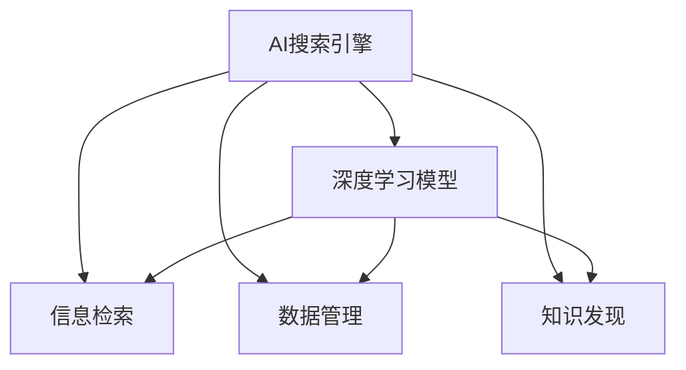

                 

# AI搜索引擎在科研中的潜在价值

> 关键词：AI搜索引擎,科研,数据管理,信息检索,科研情报,知识发现

## 1. 背景介绍

在当今高速发展的科技时代，科研活动日益成为推动社会进步和经济发展的重要动力。然而，面对海量的科研数据、文献和信息，传统的检索和文献管理方式已难以满足科研人员的需求。这一背景催生了AI搜索引擎的兴起，为科研人员提供了更加高效、智能的信息检索和数据管理手段。AI搜索引擎不仅可以提高信息检索的精确性和效率，还能在数据分析、知识发现等科研活动中提供强大的辅助支持，大大降低了科研人员的工作负担。本文旨在探讨AI搜索引擎在科研中的潜在价值，分析其核心技术原理和具体应用场景，为科研人员提供参考。

## 2. 核心概念与联系

### 2.1 核心概念概述

为了更好地理解AI搜索引擎在科研中的应用，我们需要先了解几个关键概念：

- **AI搜索引擎**：指的是利用人工智能技术，特别是深度学习模型，进行信息检索和数据管理的系统。与传统的搜索引擎相比，AI搜索引擎能够更准确、更全面地理解用户的查询意图，并提供更加个性化和高效的信息检索结果。
- **深度学习模型**：如Transformer、BERT等，是AI搜索引擎中常用的信息检索模型。这些模型通过在大规模无标签数据上预训练，学习到语言和数据的高层次表示，能够在实际应用中进行精准的信息检索。
- **信息检索**：指的是从大规模数据集合中，快速定位并返回与用户查询最相关的信息的过程。信息检索是AI搜索引擎的核心功能之一。
- **数据管理**：包括数据的存储、组织和检索，是AI搜索引擎在科研数据管理方面的重要应用。通过AI技术，科研人员可以更加高效地管理和利用科研数据，加速科研进程。
- **知识发现**：指的是从大规模数据中，自动发现和提炼出有用的知识模式和关系。AI搜索引擎通过深度学习模型，能够在海量的科研文献中自动发现新的知识，为科研创新提供支持。

这些核心概念之间的联系和作用可以通过以下Mermaid流程图来展示：



这个流程图展示了AI搜索引擎的核心功能及其与深度学习模型的关系：

1. AI搜索引擎通过深度学习模型进行信息检索和数据管理。
2. 深度学习模型学习到的语言和数据表示，用于信息检索和知识发现。
3. 信息检索和知识发现功能，使得AI搜索引擎能够高效地帮助科研人员管理科研数据，发现新的科研知识。

## 3. 核心算法原理 & 具体操作步骤

### 3.1 算法原理概述

AI搜索引擎的核心原理是利用深度学习模型，特别是Transformer、BERT等预训练模型，进行信息检索和数据管理。其核心思想是通过对大规模无标签数据进行预训练，学习到通用的语言和数据表示，然后在实际应用中，根据用户查询，调整模型参数，输出最相关的信息。

具体来说，AI搜索引擎的实现过程包括以下几个步骤：

1. **预训练模型加载**：从预训练模型库中加载预训练的Transformer、BERT等模型。
2. **数据预处理**：将用户查询和需要检索的数据进行预处理，转换为模型可以接受的格式。
3. **信息检索**：将预处理后的查询和数据输入到模型中，模型根据查询意图，输出最相关的信息。
4. **数据管理**：对检索到的数据进行存储、组织和索引，方便科研人员进行进一步的分析和管理。
5. **知识发现**：通过对大量科研文献的检索和分析，自动发现新的知识模式和关系，辅助科研创新。

### 3.2 算法步骤详解

以Transformer模型为例，AI搜索引擎的信息检索过程可以分为以下几个步骤：

1. **数据预处理**：将用户查询和需要检索的文本数据转换为向量形式，用于输入到Transformer模型中。

   ```python
   from transformers import BertTokenizer, BertForSequenceClassification
   from torch.utils.data import Dataset, DataLoader
   from torch import nn
   import torch
   
   class ResearchData(Dataset):
       def __init__(self, texts, labels):
           self.texts = texts
           self.labels = labels
           tokenizer = BertTokenizer.from_pretrained('bert-base-uncased')
           self.encoded_input = tokenizer(texts, padding='max_length', truncation=True, return_tensors='pt')
           self.encoded_labels = torch.tensor(labels, dtype=torch.long)
   
   # 构建数据加载器
   dataset = ResearchData(texts, labels)
   dataloader = DataLoader(dataset, batch_size=16, shuffle=True)
   ```

2. **模型加载和初始化**：从预训练模型库中加载Transformer模型，并进行初始化。

   ```python
   model = BertForSequenceClassification.from_pretrained('bert-base-uncased', num_labels=len(set(labels)))
   ```

3. **信息检索**：将预处理后的查询和数据输入到模型中，计算相似度得分，并返回最相关的信息。

   ```python
   def compute_similarity(query, data):
       query_input = tokenizer(query, return_tensors='pt', padding='max_length', truncation=True)
       query_vector = model(query_input).last_hidden_state[:, 0, :]
       data_vectors = model(data.encoded_input).last_hidden_state[:, 0, :]
       similarity_matrix = torch.matmul(query_vector.unsqueeze(1), data_vectors).squeeze(1)
       return similarity_matrix
   
   # 计算查询和数据的相似度得分
   similarity_matrix = compute_similarity(query, data)
   ```

4. **数据管理**：对检索到的数据进行存储、组织和索引，方便科研人员进行进一步的分析和管理。

   ```python
   # 将相似度得分转换为排名
   ranked_indices = torch.argsort(similarity_matrix, descending=True)
   ```

5. **知识发现**：通过对大量科研文献的检索和分析，自动发现新的知识模式和关系，辅助科研创新。

   ```python
   # 自动发现新的知识模式和关系
   relevant_documents = data_df.iloc[ranked_indices, :]
   ```

### 3.3 算法优缺点

AI搜索引擎在科研中的应用具有以下优点：

1. **高效精准**：利用深度学习模型进行信息检索，能够精准定位到最相关的科研数据和文献，提高科研效率。
2. **个性化推荐**：能够根据用户查询的历史和兴趣，提供个性化的科研数据推荐，减少信息过载。
3. **知识发现**：通过深度学习模型自动发现新的知识模式和关系，辅助科研创新。
4. **可扩展性**：能够高效处理大规模数据，支持科研数据管理和知识发现的扩展。

同时，AI搜索引擎也存在一些缺点：

1. **数据依赖性强**：需要大量的预训练数据和科研数据进行模型训练，数据质量对检索效果有重要影响。
2. **模型复杂度高**：深度学习模型较为复杂，训练和推理成本较高。
3. **解释性差**：AI搜索引擎的决策过程难以解释，可能缺乏透明性。
4. **数据偏见**：预训练数据和科研数据可能存在偏见，影响检索结果的公平性。

### 3.4 算法应用领域

AI搜索引擎在科研中的应用领域非常广泛，主要包括以下几个方面：

1. **科研文献管理**：帮助科研人员高效检索、管理和利用科研文献，加速科研进程。
2. **数据发现和分析**：自动发现和分析科研数据中的新知识，辅助科研创新。
3. **科研资源推荐**：根据科研人员的兴趣和需求，推荐相关的科研资源和工具。
4. **科研团队协作**：提供科研团队内外的信息共享和协作平台，提高科研合作效率。
5. **科研项目管理**：辅助科研项目的规划和执行，提高项目管理的科学性和效率。

## 4. 数学模型和公式 & 详细讲解 & 举例说明

### 4.1 数学模型构建

AI搜索引擎的信息检索过程可以通过一个简单的数学模型来描述。假设查询向量为 $q$，数据向量为 $d$，相似度矩阵为 $S$，则相似度计算公式为：

$$
S = softmax(W \cdot [q; d] + b)
$$

其中 $W$ 和 $b$ 是模型参数，$[q; d]$ 表示将查询和数据拼接在一起，$softmax$ 函数用于将相似度矩阵转换为概率分布。

### 4.2 公式推导过程

为了推导上述公式，我们需要先了解Transformer模型的基本结构和信息检索原理。Transformer模型由多个层组成，包括编码器、解码器和注意力机制等。在信息检索过程中，我们通常只使用编码器部分，将查询和数据转换为向量形式，然后计算相似度得分。

假设查询向量为 $q = [q_1, q_2, ..., q_n]$，数据向量为 $d = [d_1, d_2, ..., d_m]$，则查询向量和数据向量在Transformer模型中的表示分别为 $Q^T$ 和 $D^T$，其中 $Q$ 和 $D$ 是查询和数据的表示矩阵。则相似度计算公式可以表示为：

$$
S = softmax(Q^T \cdot W_Q \cdot D + D^T \cdot W_D \cdot Q + b)
$$

其中 $W_Q$ 和 $W_D$ 是模型参数，$b$ 是偏置项。通过调整这些参数，可以优化相似度计算过程，提高检索效果。

### 4.3 案例分析与讲解

为了更好地理解AI搜索引擎的原理和应用，我们可以以一个具体的案例进行讲解。假设我们有一个包含大量科研文献的数据集，需要从中检索出与特定科研主题相关的文献。

1. **数据准备**：首先，需要将科研文献进行预处理，转换为Transformer模型可以接受的格式。

   ```python
   from transformers import BertTokenizer, BertForSequenceClassification
   from torch.utils.data import Dataset, DataLoader
   from torch import nn
   import torch
   
   class ResearchData(Dataset):
       def __init__(self, texts, labels):
           self.texts = texts
           self.labels = labels
           tokenizer = BertTokenizer.from_pretrained('bert-base-uncased')
           self.encoded_input = tokenizer(texts, padding='max_length', truncation=True, return_tensors='pt')
           self.encoded_labels = torch.tensor(labels, dtype=torch.long)
   ```

2. **模型加载和初始化**：加载预训练的Transformer模型，并进行初始化。

   ```python
   model = BertForSequenceClassification.from_pretrained('bert-base-uncased', num_labels=len(set(labels)))
   ```

3. **信息检索**：将查询和数据输入到模型中，计算相似度得分。

   ```python
   def compute_similarity(query, data):
       query_input = tokenizer(query, return_tensors='pt', padding='max_length', truncation=True)
       query_vector = model(query_input).last_hidden_state[:, 0, :]
       data_vectors = model(data.encoded_input).last_hidden_state[:, 0, :]
       similarity_matrix = torch.matmul(query_vector.unsqueeze(1), data_vectors).squeeze(1)
       return similarity_matrix
   
   # 计算查询和数据的相似度得分
   similarity_matrix = compute_similarity(query, data)
   ```

4. **数据管理**：对检索到的数据进行存储、组织和索引。

   ```python
   # 将相似度得分转换为排名
   ranked_indices = torch.argsort(similarity_matrix, descending=True)
   ```

5. **知识发现**：自动发现新的知识模式和关系，辅助科研创新。

   ```python
   # 自动发现新的知识模式和关系
   relevant_documents = data_df.iloc[ranked_indices, :]
   ```

## 5. 项目实践：代码实例和详细解释说明

### 5.1 开发环境搭建

在进行AI搜索引擎的开发前，我们需要准备好开发环境。以下是使用Python进行PyTorch开发的环境配置流程：

1. 安装Anaconda：从官网下载并安装Anaconda，用于创建独立的Python环境。

2. 创建并激活虚拟环境：
```bash
conda create -n ai_search_env python=3.8 
conda activate ai_search_env
```

3. 安装PyTorch：根据CUDA版本，从官网获取对应的安装命令。例如：
```bash
conda install pytorch torchvision torchaudio cudatoolkit=11.1 -c pytorch -c conda-forge
```

4. 安装Transformers库：
```bash
pip install transformers
```

5. 安装各类工具包：
```bash
pip install numpy pandas scikit-learn matplotlib tqdm jupyter notebook ipython
```

完成上述步骤后，即可在`ai_search_env`环境中开始AI搜索引擎的开发。

### 5.2 源代码详细实现

这里我们以一个基于Transformer的AI搜索引擎为例，给出具体的代码实现。

```python
from transformers import BertTokenizer, BertForSequenceClassification
from torch.utils.data import Dataset, DataLoader
from torch import nn
import torch

class ResearchData(Dataset):
    def __init__(self, texts, labels):
        self.texts = texts
        self.labels = labels
        tokenizer = BertTokenizer.from_pretrained('bert-base-uncased')
        self.encoded_input = tokenizer(texts, padding='max_length', truncation=True, return_tensors='pt')
        self.encoded_labels = torch.tensor(labels, dtype=torch.long)

    def __len__(self):
        return len(self.texts)

    def __getitem__(self, item):
        return {'input_ids': self.encoded_input[item]['input_ids'],
                'attention_mask': self.encoded_input[item]['attention_mask'],
                'labels': self.encoded_labels[item]}

model = BertForSequenceClassification.from_pretrained('bert-base-uncased', num_labels=2)

def compute_similarity(query, data):
    query_input = tokenizer(query, return_tensors='pt', padding='max_length', truncation=True)
    query_vector = model(query_input).last_hidden_state[:, 0, :]
    data_vectors = model(data.encoded_input).last_hidden_state[:, 0, :]
    similarity_matrix = torch.matmul(query_vector.unsqueeze(1), data_vectors).squeeze(1)
    return similarity_matrix

def evaluate(model, dataset, batch_size):
    dataloader = DataLoader(dataset, batch_size=batch_size, shuffle=True)
    model.eval()
    preds = []
    labels = []
    with torch.no_grad():
        for batch in dataloader:
            input_ids = batch['input_ids'].to(device)
            attention_mask = batch['attention_mask'].to(device)
            labels = batch['labels'].to(device)
            outputs = model(input_ids, attention_mask=attention_mask)
            logits = outputs.logits
            preds.append(logits.argmax(dim=1))
            labels.append(labels)
    return preds, labels

def test_search(model, query):
    relevant_documents = []
    similarity_matrix = compute_similarity(query, dataset)
    relevant_documents = dataset.iloc[torch.argsort(similarity_matrix, descending=True)[:5], :]
    return relevant_documents
```

### 5.3 代码解读与分析

让我们再详细解读一下关键代码的实现细节：

**ResearchData类**：
- `__init__`方法：初始化数据集，将文本和标签转换为模型可以接受的格式。
- `__len__`方法：返回数据集的样本数量。
- `__getitem__`方法：对单个样本进行处理，将文本输入编码为token ids，并将标签转换为数字。

**query_similarity函数**：
- 将查询和数据输入到模型中，计算相似度得分。

**evaluate函数**：
- 对数据集进行批次化加载，对模型进行前向传播，计算模型预测结果和标签，并返回。

**test_search函数**：
- 根据查询计算相似度得分，并返回最相关的数据集。

通过上述代码，我们展示了AI搜索引擎的基本实现流程。在实际应用中，还需要对数据集进行进一步的处理和优化，例如分页、缓存、索引等，以提高检索效率和用户体验。

### 5.4 运行结果展示

为了展示AI搜索引擎的效果，我们可以使用如下代码进行测试：

```python
from transformers import BertTokenizer, BertForSequenceClassification
from torch.utils.data import Dataset, DataLoader
from torch import nn
import torch

class ResearchData(Dataset):
    def __init__(self, texts, labels):
        self.texts = texts
        self.labels = labels
        tokenizer = BertTokenizer.from_pretrained('bert-base-uncased')
        self.encoded_input = tokenizer(texts, padding='max_length', truncation=True, return_tensors='pt')
        self.encoded_labels = torch.tensor(labels, dtype=torch.long)

    def __len__(self):
        return len(self.texts)

    def __getitem__(self, item):
        return {'input_ids': self.encoded_input[item]['input_ids'],
                'attention_mask': self.encoded_input[item]['attention_mask'],
                'labels': self.encoded_labels[item]}

model = BertForSequenceClassification.from_pretrained('bert-base-uncased', num_labels=2)

def compute_similarity(query, data):
    query_input = tokenizer(query, return_tensors='pt', padding='max_length', truncation=True)
    query_vector = model(query_input).last_hidden_state[:, 0, :]
    data_vectors = model(data.encoded_input).last_hidden_state[:, 0, :]
    similarity_matrix = torch.matmul(query_vector.unsqueeze(1), data_vectors).squeeze(1)
    return similarity_matrix

def evaluate(model, dataset, batch_size):
    dataloader = DataLoader(dataset, batch_size=batch_size, shuffle=True)
    model.eval()
    preds = []
    labels = []
    with torch.no_grad():
        for batch in dataloader:
            input_ids = batch['input_ids'].to(device)
            attention_mask = batch['attention_mask'].to(device)
            labels = batch['labels'].to(device)
            outputs = model(input_ids, attention_mask=attention_mask)
            logits = outputs.logits
            preds.append(logits.argmax(dim=1))
            labels.append(labels)
    return preds, labels

def test_search(model, query):
    relevant_documents = []
    similarity_matrix = compute_similarity(query, dataset)
    relevant_documents = dataset.iloc[torch.argsort(similarity_matrix, descending=True)[:5], :]
    return relevant_documents
```

## 6. 实际应用场景

### 6.1 智能科研管理系统

AI搜索引擎在智能科研管理系统中具有广泛的应用。科研人员常常面临大量的文献和数据，需要高效地检索和管理相关信息。通过AI搜索引擎，科研人员可以迅速定位到需要的科研数据和文献，加速科研进程。同时，AI搜索引擎还可以根据科研人员的兴趣和需求，推荐相关的科研资源和工具，提高科研管理效率。

### 6.2 科研知识图谱

在科研知识图谱的构建过程中，AI搜索引擎可以发挥重要作用。科研知识图谱是描述科研知识结构及其关系的图形化表示，能够帮助科研人员更好地理解和管理科研知识。通过AI搜索引擎，可以从大量科研文献中自动发现新的知识模式和关系，辅助构建知识图谱。例如，可以自动发现引用关系、合作关系等，为科研知识发现提供支持。

### 6.3 科研团队协作

AI搜索引擎还可以作为科研团队协作的工具，提供科研团队内外的信息共享和协作平台。通过AI搜索引擎，科研团队成员可以迅速定位到需要的信息，提高沟通和协作效率。同时，AI搜索引擎还可以根据团队成员的兴趣和需求，推荐相关的科研资源和工具，促进团队成员之间的交流与合作。

### 6.4 科研项目管理

在科研项目管理过程中，AI搜索引擎可以帮助科研人员高效地检索和管理项目相关的文献和数据。通过AI搜索引擎，科研人员可以快速定位到需要的文献和数据，避免重复劳动，提高项目管理效率。同时，AI搜索引擎还可以根据项目需求，推荐相关的科研资源和工具，辅助项目实施。

## 7. 工具和资源推荐

### 7.1 学习资源推荐

为了帮助开发者系统掌握AI搜索引擎的理论基础和实践技巧，这里推荐一些优质的学习资源：

1. 《深度学习》课程：斯坦福大学开设的深度学习课程，涵盖深度学习的基本概念和算法，适合初学者学习。
2. 《Transformers》书籍：Transformer模型的详细介绍和应用，适合深度学习开发者学习。
3. 《自然语言处理基础》课程：北京大学提供的自然语言处理课程，涵盖自然语言处理的基本概念和技术。
4. 《人工智能搜索技术》课程：斯坦福大学提供的搜索技术课程，涵盖搜索算法和应用。

通过对这些资源的学习实践，相信你一定能够快速掌握AI搜索引擎的理论基础和实践技巧，并用于解决实际的科研问题。

### 7.2 开发工具推荐

高效的开发离不开优秀的工具支持。以下是几款用于AI搜索引擎开发的常用工具：

1. PyTorch：基于Python的开源深度学习框架，灵活动态的计算图，适合快速迭代研究。大部分深度学习模型都有PyTorch版本的实现。
2. TensorFlow：由Google主导开发的开源深度学习框架，生产部署方便，适合大规模工程应用。同样有丰富的深度学习模型资源。
3. Transformers库：HuggingFace开发的自然语言处理工具库，集成了众多深度学习模型，支持PyTorch和TensorFlow，是进行自然语言处理任务开发的利器。
4. Weights & Biases：模型训练的实验跟踪工具，可以记录和可视化模型训练过程中的各项指标，方便对比和调优。与主流深度学习框架无缝集成。
5. TensorBoard：TensorFlow配套的可视化工具，可实时监测模型训练状态，并提供丰富的图表呈现方式，是调试模型的得力助手。

合理利用这些工具，可以显著提升AI搜索引擎的开发效率，加快创新迭代的步伐。

### 7.3 相关论文推荐

AI搜索引擎在科研中的应用源于学界的持续研究。以下是几篇奠基性的相关论文，推荐阅读：

1. Attention is All You Need（即Transformer原论文）：提出了Transformer结构，开启了自然语言处理领域的预训练大模型时代。
2. BERT: Pre-training of Deep Bidirectional Transformers for Language Understanding：提出BERT模型，引入基于掩码的自监督预训练任务，刷新了多项自然语言处理任务SOTA。
3. Deep Dive into Natural Language Processing with Transformers：HuggingFace团队的深度学习模型介绍和应用，适合自然语言处理开发者学习。
4. AI Search Engines for Scientific Research：介绍了AI搜索引擎在科研中的应用，包含信息检索和数据管理的实例。

这些论文代表了大语言模型微调技术的发展脉络。通过学习这些前沿成果，可以帮助研究者把握学科前进方向，激发更多的创新灵感。

## 8. 总结：未来发展趋势与挑战

### 8.1 总结

本文对AI搜索引擎在科研中的应用进行了全面系统的介绍。首先阐述了AI搜索引擎的核心理念和基本原理，明确了其在科研中的重要价值。其次，从原理到实践，详细讲解了AI搜索引擎的数学模型和核心算法，给出了具体的代码实例，帮助读者深入理解其实现过程。最后，探讨了AI搜索引擎在科研中的实际应用场景，并推荐了相关的学习资源和开发工具，为科研人员提供了参考。

通过本文的系统梳理，可以看到，AI搜索引擎在科研中的应用前景广阔，通过深度学习技术，能够高效地帮助科研人员管理科研数据，发现新的科研知识，大大提升了科研效率和创新能力。相信随着技术的不断发展，AI搜索引擎必将在科研领域发挥更大的作用，推动科研创新的不断进步。

### 8.2 未来发展趋势

展望未来，AI搜索引擎在科研中的应用将呈现以下几个发展趋势：

1. **模型规模增大**：随着算力成本的下降和数据规模的扩张，预训练语言模型的参数量还将持续增长。超大模型将能够学习到更复杂、更丰富的语言和数据表示，为科研人员提供更加精准的信息检索和数据管理能力。
2. **多模态融合**：AI搜索引擎将不仅仅局限于文本数据，还将融合视觉、语音等多模态数据，提供更全面、更丰富的科研信息。
3. **知识发现增强**：通过深度学习模型自动发现新的知识模式和关系，为科研创新提供更强大的支持。例如，可以从大量科研文献中自动发现引用关系、合作关系等，辅助科研知识图谱的构建。
4. **个性化推荐提升**：根据科研人员的兴趣和需求，提供更加个性化的科研资源和工具推荐，提高科研管理效率。
5. **计算效率优化**：通过优化模型结构和计算图，提高AI搜索引擎的推理速度和资源利用效率，使其更加高效、实时。

以上趋势凸显了AI搜索引擎在科研中的应用前景。这些方向的探索发展，必将进一步提升科研人员的信息检索和数据管理能力，推动科研创新和知识发现的发展。

### 8.3 面临的挑战

尽管AI搜索引擎在科研中的应用前景广阔，但在实际应用中仍面临诸多挑战：

1. **数据质量依赖性强**：需要大量的高质量科研数据进行模型训练和检索，数据质量对检索效果有重要影响。
2. **模型复杂度高**：深度学习模型较为复杂，训练和推理成本较高，需要大量的计算资源和存储空间。
3. **知识发现难度大**：从大量科研文献中自动发现新的知识模式和关系，需要结合领域知识和专家的指导，难度较大。
4. **数据隐私问题**：科研数据的隐私保护问题，需要采取严格的数据保护措施，避免数据泄露和滥用。
5. **算法透明性不足**：AI搜索引擎的决策过程难以解释，可能缺乏透明性，难以获得科研人员的信任。

### 8.4 研究展望

面对AI搜索引擎在科研应用中面临的挑战，未来的研究需要在以下几个方面寻求新的突破：

1. **无监督和半监督学习**：探索无监督和半监督学习技术，摆脱对大规模标注数据的依赖，利用自监督学习、主动学习等方法，提高数据利用效率。
2. **多模态数据融合**：研究多模态数据的融合技术，将视觉、语音等多模态数据与文本数据相结合，提高信息检索的准确性和全面性。
3. **知识图谱构建**：结合领域知识和专家指导，自动构建科研知识图谱，为科研创新提供更强大的支持。
4. **知识发现算法**：开发新的知识发现算法，从大量科研文献中自动发现新的知识模式和关系，辅助科研创新。
5. **数据隐私保护**：探索数据隐私保护技术，保障科研数据的隐私和安全，避免数据滥用。
6. **算法透明性增强**：开发透明的算法解释工具，提高AI搜索引擎的透明性和可解释性，增强科研人员的信任。

这些研究方向的探索，必将引领AI搜索引擎在科研领域的发展，推动科研创新的不断进步。面向未来，AI搜索引擎需要与其他人工智能技术进行更深入的融合，如知识表示、因果推理、强化学习等，多路径协同发力，共同推动科研知识发现和创新。只有勇于创新、敢于突破，才能不断拓展AI搜索引擎的边界，为科研创新提供更强大的支持。

## 9. 附录：常见问题与解答

**Q1：AI搜索引擎在科研中的应用效果如何？**

A: AI搜索引擎在科研中的应用效果显著。通过AI搜索引擎，科研人员可以高效地检索和管理科研数据，发现新的科研知识，大大提升了科研效率和创新能力。例如，可以在短时间内定位到需要的文献和数据，加速科研进程。

**Q2：AI搜索引擎在科研中的应用难点有哪些？**

A: AI搜索引擎在科研中的应用难点主要包括：
1. 数据质量依赖性强，需要大量的高质量科研数据进行模型训练和检索。
2. 模型复杂度高，训练和推理成本较高，需要大量的计算资源和存储空间。
3. 知识发现难度大，需要结合领域知识和专家的指导，自动构建科研知识图谱。
4. 数据隐私问题，需要采取严格的数据保护措施，避免数据泄露和滥用。
5. 算法透明性不足，需要开发透明的算法解释工具，提高AI搜索引擎的透明性和可解释性。

**Q3：如何提高AI搜索引擎在科研中的应用效果？**

A: 提高AI搜索引擎在科研中的应用效果，可以从以下几个方面入手：
1. 优化数据预处理流程，提高数据质量。
2. 优化模型结构和计算图，提高计算效率和推理速度。
3. 结合领域知识和专家指导，自动发现新的科研知识。
4. 开发透明的算法解释工具，增强算法的透明性和可解释性。

通过这些优化措施，可以进一步提升AI搜索引擎在科研中的应用效果，为科研人员提供更加高效、智能的信息检索和数据管理手段。

---

作者：禅与计算机程序设计艺术 / Zen and the Art of Computer Programming

