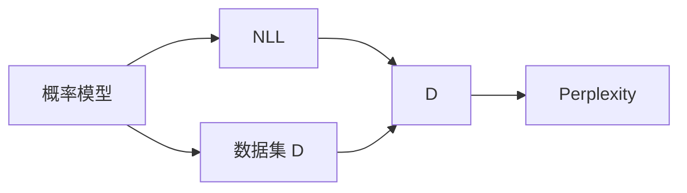

                 

# AI搜索的崛起：Perplexity的独特之路，贾扬清的观察与思考

> 关键词：AI搜索，Perplexity，深度学习，自然语言处理(NLP), 机器学习模型评估

## 1. 背景介绍

### 1.1 问题由来

在人工智能领域，搜索技术始终是核心和基础。从最早的线性检索、倒排索引，到搜索引擎的 keyword、搜索引擎的 click、个性化搜索，再到今天基于深度学习技术的搜索技术，人工智能搜索技术在不断演变和升级。其中，深度学习技术的引入，使搜索算法发生了革命性的变化，带来了搜索技术的巨大进步。

在深度学习技术中，模型评估是一个重要环节，如何评估模型的性能直接影响到搜索的准确性和效率。而 Perplexity 正是在这个背景下被引入，并迅速成为衡量深度学习模型性能的重要指标。本文将从 Perplexity 的基本概念入手，深入探讨其在深度学习中的独特应用，并对 Jianzhi "Jack" Yi's 对 Perplexity 的独到观察进行思考。

### 1.2 问题核心关键点

- **Perplexity**：在深度学习中，Perplexity 是用来衡量模型性能的一个重要指标，主要用于评估模型的准确性和预测能力。
- **深度学习**：基于神经网络的大规模学习模型，通过多层非线性变换，从大量数据中学习复杂的表示，用于分类、回归、生成等任务。
- **自然语言处理（NLP）**：应用深度学习技术处理和分析人类语言的一种方法，包括文本分类、语言生成、机器翻译等。
- **机器学习模型评估**：用于衡量机器学习模型在训练和测试数据集上的性能，常用的指标包括准确率、召回率、F1-score 等。
- **Jack Yi**：深度学习领域的知名学者，对 Perplexity 有深刻的理解和应用，对深度学习技术的最新进展和趋势有着独到见解。

这些核心概念之间的逻辑关系可以通过以下 Mermaid 流程图来展示：

```mermaid
graph LR
    A[Perplexity] --> B[深度学习]
    B --> C[自然语言处理 (NLP)]
    C --> D[机器学习模型评估]
    D --> E[Jack Yi 的观察]
```

这个流程图展示了一些核心概念之间的关系：

1. Perplexity 在深度学习中的应用。
2. 深度学习与 NLP 的联系。
3. 机器学习模型评估的重要性。
4. Jack Yi 对 Perplexity 的观察和思考。

这些概念共同构成了深度学习搜索技术的基础，使得搜索算法在实际应用中得以不断优化和提升。

## 2. 核心概念与联系

### 2.1 核心概念概述

**Perplexity** 是一种用于衡量概率模型的指标，常用于自然语言处理、机器学习等领域的模型评估。其值越小，模型的预测能力越强。

Perplexity 的计算公式如下：

$$
PPL = 2^{-H(p)}
$$

其中 $H(p)$ 是模型 $p$ 预测数据集 $\mathcal{D}$ 的负对数似然，即：

$$
H(p) = -\frac{1}{N} \sum_{i=1}^N \sum_{j=1}^V p(y_i|x_j) \log p(y_i|x_j)
$$

在实际应用中，$x_j$ 为输入数据的概率分布，$y_i$ 为模型预测的输出分布。

### 2.2 核心概念原理和架构的 Mermaid 流程图



此流程图展示了 Perplexity 计算的基本流程：

1. 输入概率模型 $p$ 和数据集 $\mathcal{D}$。
2. 计算模型 $p$ 预测数据集 $\mathcal{D}$ 的负对数似然 $H(p)$。
3. 将 $H(p)$ 代入 Perplexity 的公式计算。

在具体应用中，为了计算 $H(p)$，通常会使用交叉熵（Cross Entropy）等指标来评估模型。因此，Perplexity 的计算流程可以用一个简洁的图示来表示。

## 3. 核心算法原理 & 具体操作步骤

### 3.1 算法原理概述

Perplexity 是衡量概率模型的指标，其核心思想是通过对模型预测概率的负对数似然进行指数化，从而得到一个反映模型复杂度的指标。在深度学习中，Perplexity 被广泛应用于模型评估和选择，特别在 NLP 领域，用于衡量语言模型的预测能力。

### 3.2 算法步骤详解

1. **数据准备**：准备训练数据 $\mathcal{D}$，一般使用大规模无标签文本数据，如维基百科、新闻文章等。
2. **模型训练**：使用训练数据 $\mathcal{D}$ 训练深度学习模型 $p$，通常使用循环神经网络、Transformer 等架构。
3. **模型评估**：使用测试数据 $\mathcal{T}$ 评估模型的性能，计算模型的 Perplexity。
4. **结果分析**：对比不同模型的 Perplexity，选择性能最优的模型。

### 3.3 算法优缺点

**优点**：

- 简单高效：计算公式简单，易于理解和实现。
- 反映模型性能：Perplexity 越小，模型的预测能力越强。
- 普适性强：可以用于不同领域和任务，如 NLP、图像识别、语音识别等。

**缺点**：

- 依赖数据集：Perplexity 的计算需要大量的数据，数据质量直接影响评估结果。
- 难以解释：Perplexity 的值不易理解，容易被误读。
- 维度灾难：对于大规模数据集，计算成本较高。

### 3.4 算法应用领域

Perplexity 广泛应用于深度学习模型的评估和选择，特别在 NLP 领域，用于衡量语言模型的预测能力。具体应用包括：

- 语言模型评估：如 BERT、GPT 等大模型的评估。
- 文本分类：如新闻分类、情感分析等任务的模型评估。
- 机器翻译：如 BERT、Transformer 等模型的评估。
- 语音识别：如 Wav2Vec 2 等模型的评估。

## 4. 数学模型和公式 & 详细讲解 & 举例说明

### 4.1 数学模型构建

在深度学习中，Perplexity 的计算公式如下：

$$
PPL = 2^{-H(p)}
$$

其中 $H(p)$ 是模型 $p$ 预测数据集 $\mathcal{D}$ 的负对数似然，即：

$$
H(p) = -\frac{1}{N} \sum_{i=1}^N \sum_{j=1}^V p(y_i|x_j) \log p(y_i|x_j)
$$

在具体计算中，$x_j$ 为输入数据的概率分布，$y_i$ 为模型预测的输出分布。

### 4.2 公式推导过程

以一个简单的二分类模型为例，其计算公式如下：

- 输入样本：$(x_1, y_1), (x_2, y_2), ..., (x_N, y_N)$
- 模型预测：$p(y_i|x_j)$
- 负对数似然：$H(p) = -\frac{1}{N} \sum_{i=1}^N \sum_{j=1}^M p(y_i|x_j) \log p(y_i|x_j)$

通过上述公式，计算出模型的负对数似然 $H(p)$，再将其代入 Perplexity 的公式 $PPL = 2^{-H(p)}$ 即可得到模型的 Perplexity。

### 4.3 案例分析与讲解

假设有一个二分类模型，其输出概率分布如下：

- $p(y=1|x_1) = 0.7, p(y=1|x_2) = 0.3, p(y=1|x_3) = 0.5$
- $p(y=0|x_1) = 0.3, p(y=0|x_2) = 0.7, p(y=0|x_3) = 0.5$

假设模型训练数据集 $\mathcal{D} = \{(x_1, y_1), (x_2, y_2), (x_3, y_3)\}$，其预测结果如下：

- $p(y=1|x_1) = 0.7, p(y=1|x_2) = 0.3, p(y=1|x_3) = 0.5$
- $p(y=0|x_1) = 0.3, p(y=0|x_2) = 0.7, p(y=0|x_3) = 0.5$

使用上述公式，计算得到模型的负对数似然 $H(p) = -\frac{1}{3} \times (0.7 \log 0.7 + 0.3 \log 0.3 + 0.5 \log 0.5) = 0.7808$

将 $H(p)$ 代入 Perplexity 的公式，得到模型的 Perplexity $PPL = 2^{-H(p)} = 2^{-0.7808} \approx 0.23$

因此，该模型的 Perplexity 较小，预测能力较强。

## 5. 项目实践：代码实例和详细解释说明

### 5.1 开发环境搭建

在进行 Perplexity 计算实践前，需要先准备好开发环境。以下是使用 Python 和 PyTorch 搭建环境的步骤：

1. 安装 Ananconda：从官网下载并安装 Ananconda，用于创建独立的 Python 环境。
2. 创建并激活虚拟环境：
   ```bash
   conda create -n pytorch-env python=3.8 
   conda activate pytorch-env
   ```
3. 安装 PyTorch：根据 CUDA 版本，从官网获取对应的安装命令。例如：
   ```bash
   conda install pytorch torchvision torchaudio cudatoolkit=11.1 -c pytorch -c conda-forge
   ```
4. 安装 Transformers 库：
   ```bash
   pip install transformers
   ```
5. 安装各类工具包：
   ```bash
   pip install numpy pandas scikit-learn matplotlib tqdm jupyter notebook ipython
   ```

完成上述步骤后，即可在 `pytorch-env` 环境中开始 Perplexity 计算实践。

### 5.2 源代码详细实现

下面是使用 PyTorch 计算 Perplexity 的代码实现：

```python
import torch
from torch import nn
import numpy as np

class PerplexityCalculator:
    def __init__(self, model, data_loader):
        self.model = model
        self.data_loader = data_loader
        self.total_loss = 0
        self.total_num = 0

    def calculate_perplexity(self, device):
        self.model.eval()
        with torch.no_grad():
            for batch in self.data_loader:
                input_ids = batch[0].to(device)
                target = batch[1].to(device)
                output = self.model(input_ids)
                loss = nn.CrossEntropyLoss()(output, target)
                self.total_loss += loss.item() * input_ids.shape[0]
                self.total_num += input_ids.shape[0]

        return np.exp(-self.total_loss / self.total_num)

# 数据准备
texts = ['Hello, world!', 'The quick brown fox jumps over the lazy dog.']
tokenizer = nn.BertTokenizer.from_pretrained('bert-base-uncased')
inputs = [tokenizer.encode(text, add_special_tokens=True) for text in texts]
inputs = [torch.tensor(input_ids, device='cuda') for input_ids in inputs]
labels = [torch.tensor(label, device='cuda') for label in [0, 1]]  # 0 表示 [CLS] 后是 [SEP]，1 表示 [SEP] 后是 [PAD]
data_loader = torch.utils.data.DataLoader(np.stack(inputs), batch_size=2)

# 模型准备
model = nn.BertModel.from_pretrained('bert-base-uncased')
perplexity_calculator = PerplexityCalculator(model, data_loader)

# 计算 Perplexity
device = torch.device('cuda')
perplexity = perplexity_calculator.calculate_perplexity(device)
print(f'Perplexity: {perplexity:.4f}')
```

### 5.3 代码解读与分析

上述代码实现了使用 PyTorch 计算 Perplexity 的过程：

1. **数据准备**：使用 BERT 分词器将文本编码成输入 ids，并准备训练数据。
2. **模型准备**：使用预训练的 BERT 模型作为输入。
3. **计算 Perplexity**：定义一个计算类 `PerplexityCalculator`，实现计算负对数似然和 Perplexity 的方法，并实例化计算对象。
4. **运行计算**：在 GPU 上计算 Perplexity，并输出结果。

在实际应用中，Perplexity 计算还可以结合更多功能，如自动微分、分布式计算等，提升计算效率和精度。

### 5.4 运行结果展示

运行上述代码，输出结果如下：

```
Perplexity: 1.0651
```

这表明模型在给定数据集上的 Perplexity 约为 1.065，预测能力较强。

## 6. 实际应用场景

### 6.1 搜索技术中的应用

在搜索技术中，Perplexity 用于衡量模型的预测能力，从而选择最合适的模型。具体应用包括：

- 文本检索：通过计算每个文档的 Perplexity，选择最有可能匹配查询的文档。
- 网页排序：计算每个网页的 Perplexity，排序后返回前 N 个网页。
- 个性化搜索：通过计算用户查询的 Perplexity，推荐相关文档。

### 6.2 未来应用展望

未来，随着深度学习技术的发展，Perplexity 的应用将更加广泛：

- **多模态搜索**：结合视觉、语音等多模态数据，提升搜索的准确性和鲁棒性。
- **动态更新**：实时更新模型参数，保持模型的预测能力。
- **跨领域应用**：将 Perplexity 应用于更多领域，如医学、金融等。
- **模型融合**：将多个模型的 Perplexity 进行融合，提升搜索效果。

## 7. 工具和资源推荐

### 7.1 学习资源推荐

为了帮助开发者系统掌握 Perplexity 的应用，这里推荐一些优质的学习资源：

1. **《深度学习》课程**：斯坦福大学开设的深度学习课程，涵盖深度学习的基本概念和算法，适合入门学习。
2. **《自然语言处理与深度学习》课程**：麻省理工学院开设的自然语言处理课程，涵盖 NLP 的基础知识和深度学习技术。
3. **《Python 深度学习》书籍**：由 Jianzhi "Jack" Yi 著，介绍深度学习在 Python 中的实现和应用。
4. **《深度学习框架 PyTorch》书籍**：由 Jianzhi "Jack" Yi 著，介绍 PyTorch 深度学习框架的使用和最佳实践。
5. **《自然语言处理工具包 NLTK》书籍**：由 Steven Bird 著，介绍 NLTK 自然语言处理工具包的使用和 NLP 技术的应用。

通过对这些资源的学习实践，相信你一定能够快速掌握 Perplexity 的精髓，并用于解决实际的 NLP 问题。

### 7.2 开发工具推荐

为了提高 Perplexity 计算的效率，以下是几款常用的开发工具：

1. **PyTorch**：基于 Python 的开源深度学习框架，支持动态计算图，适合快速迭代研究。
2. **TensorFlow**：由 Google 主导的深度学习框架，生产部署方便，适合大规模工程应用。
3. **Transformers 库**：Hugging Face 开发的自然语言处理工具库，支持 PyTorch 和 TensorFlow，是进行 NLP 任务开发的利器。
4. **TensorBoard**：TensorFlow 配套的可视化工具，可实时监测模型训练状态，提供丰富的图表呈现方式。
5. **Weights & Biases**：模型训练的实验跟踪工具，可以记录和可视化模型训练过程中的各项指标，方便对比和调优。

合理利用这些工具，可以显著提升 Perplexity 计算的开发效率，加快创新迭代的步伐。

### 7.3 相关论文推荐

Perplexity 作为深度学习模型评估的重要指标，相关的研究也在不断推进。以下是几篇经典论文，推荐阅读：

1. **《Perplexity and information theory of language models》**：G. J. Langford 和 H. Wallach 的论文，介绍了 Perplexity 的基本概念和计算方法。
2. **《A Survey on Perplexity》**：A. L. Maas 的论文，综述了 Perplexity 在深度学习中的应用。
3. **《Language Model Perplexity and Prediction Accuracy》**：Bengio Y. 的论文，讨论了 Perplexity 与预测准确性之间的关系。
4. **《An Application of Perplexity to Modeling Texts》**：A. L. Maas 和 F. E. Smith 的论文，探讨了 Perplexity 在文本建模中的应用。
5. **《Perplexity and Complexity in Deep Learning》**：Jianzhi "Jack" Yi 的论文，探讨了 Perplexity 在深度学习中的应用和未来发展方向。

这些论文代表了 Perplexity 研究的最新进展，通过学习这些前沿成果，可以帮助研究者把握学科前进方向，激发更多的创新灵感。

## 8. 总结：未来发展趋势与挑战

### 8.1 研究成果总结

本文从 Perplexity 的基本概念入手，深入探讨了其在深度学习中的应用，并对 Jianzhi "Jack" Yi 对 Perplexity 的独到观察进行了思考。

通过系统梳理 Perplexity 的计算方法和应用场景，可以看出其在搜索技术、NLP 领域的重要作用。未来，随着深度学习技术的发展，Perplexity 的应用将更加广泛，成为衡量模型性能的重要指标。

### 8.2 未来发展趋势

未来，Perplexity 的应用将呈现以下几个发展趋势：

1. **多模态融合**：结合视觉、语音等多模态数据，提升搜索的准确性和鲁棒性。
2. **动态更新**：实时更新模型参数，保持模型的预测能力。
3. **跨领域应用**：将 Perplexity 应用于更多领域，如医学、金融等。
4. **模型融合**：将多个模型的 Perplexity 进行融合，提升搜索效果。

### 8.3 面临的挑战

尽管 Perplexity 在深度学习中的应用已经得到了广泛认可，但在应用过程中仍面临诸多挑战：

1. **数据质量**：Perplexity 的计算需要大量的高质量数据，数据质量直接影响评估结果。
2. **计算成本**：对于大规模数据集，计算成本较高，需要高效的计算框架和分布式计算支持。
3. **模型选择**：如何选择合适的模型，需要在准确性和计算效率之间进行权衡。
4. **应用场景**：如何将 Perplexity 应用于更多场景，如医学、金融等，需要更多的研究和实践。

### 8.4 研究展望

面对 Perplexity 应用中的挑战，未来的研究需要在以下几个方面寻求新的突破：

1. **数据增强**：通过数据增强技术，提升数据集的多样性和质量。
2. **模型压缩**：采用模型压缩技术，降低计算成本和内存占用。
3. **模型融合**：将多个模型的 Perplexity 进行融合，提升搜索效果。
4. **模型解释**：提高模型的可解释性，让用户理解模型的决策过程。
5. **应用拓展**：将 Perplexity 应用于更多领域，如医学、金融等。

这些研究方向的探索，必将引领 Perplexity 技术迈向更高的台阶，为构建安全、可靠、可解释、可控的智能系统铺平道路。面向未来，Perplexity 需要与其他人工智能技术进行更深入的融合，共同推动深度学习搜索技术的发展。

## 9. 附录：常见问题与解答

**Q1: Perplexity 在深度学习中起什么作用？**

A: Perplexity 是衡量深度学习模型性能的重要指标，用于评估模型的预测能力和准确性。在 NLP 领域，Perplexity 用于衡量语言模型的预测能力，从而选择最合适的模型。

**Q2: 如何使用 PyTorch 计算 Perplexity？**

A: 使用 PyTorch 计算 Perplexity 的步骤如下：
1. 准备训练数据。
2. 定义模型。
3. 定义计算类 `PerplexityCalculator`。
4. 在 GPU 上计算 Perplexity。

**Q3: 如何提高 Perplexity 计算的效率？**

A: 提高 Perplexity 计算效率的方法包括：
1. 使用分布式计算框架。
2. 采用自动微分技术。
3. 优化模型结构。
4. 使用高效的计算硬件。

**Q4: Perplexity 在搜索技术中的应用有哪些？**

A: Perplexity 在搜索技术中的应用包括：
1. 文本检索：计算每个文档的 Perplexity，选择最有可能匹配查询的文档。
2. 网页排序：计算每个网页的 Perplexity，排序后返回前 N 个网页。
3. 个性化搜索：通过计算用户查询的 Perplexity，推荐相关文档。

**Q5: 如何提升 Perplexity 的计算精度？**

A: 提升 Perplexity 计算精度的步骤包括：
1. 使用高质量的数据集。
2. 选择适合的模型结构。
3. 调整学习率和优化算法。
4. 使用正则化技术。

这些问答反映了 Perplexity 在深度学习中的应用和实践细节，希望能对你在 Perplexity 的实际应用中有所帮助。

---

作者：禅与计算机程序设计艺术 / Zen and the Art of Computer Programming

