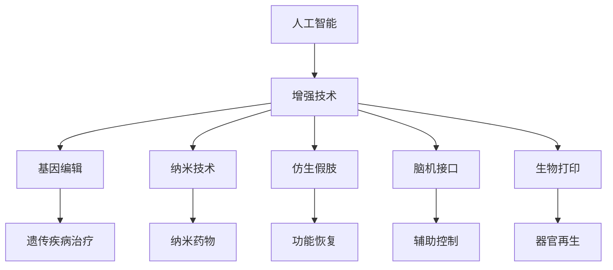
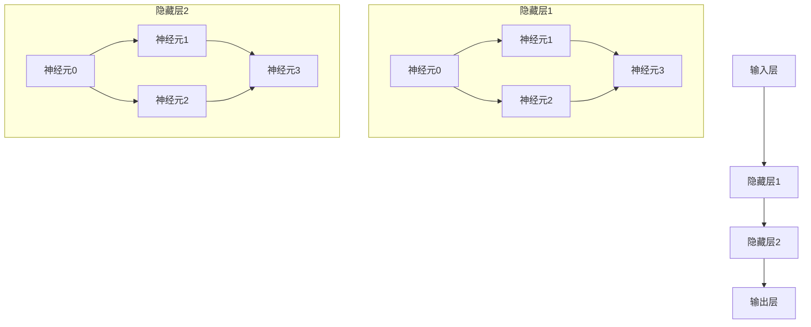

                 

# AI时代的人类增强：道德考虑与身体增强的未来发展机遇

> 关键词：人工智能,增强技术,人类增强,未来科技,伦理道德

## 1. 背景介绍

在当今AI时代，人类增强技术迅猛发展，尤其是身体增强方面的创新层出不穷。从基因编辑到纳米机器人，从仿生假肢到脑机接口，科技的边界不断被拓展。这不仅给人类社会带来了前所未有的机遇，同时也提出了严峻的伦理道德挑战。

### 1.1 问题由来

人工智能和生物技术的结合，使得身体增强技术进入了一个全新的时代。这些技术能够帮助人类克服身体缺陷、提升健康水平、甚至是超越自然的限制。然而，它们也引发了关于人类本质的深层思考，如身份认同、隐私保护、安全风险等诸多道德问题。

### 1.2 问题核心关键点

本文将重点讨论：
- 当前流行的身体增强技术有哪些？
- 这些技术在实际应用中面临哪些道德挑战？
- 如何平衡科技进步与道德伦理？
- 未来技术发展将如何影响人类社会？

## 2. 核心概念与联系

### 2.1 核心概念概述

为更好地理解AI时代身体增强技术的原理与应用，本节将介绍几个关键概念：

- **人工智能(AI)**：利用计算机模拟人类的智能行为，包括感知、学习、推理等能力的科学。
- **增强技术**：通过技术手段改善人类性能，提升生活质量，包括身体增强、认知增强、情感增强等。
- **基因编辑**：利用CRISPR等技术直接修改生物体的基因结构，修复遗传缺陷或添加新功能。
- **纳米技术**：研究在分子尺度制造和操作物质的技术，实现微小结构的构建和调控。
- **仿生假肢**：利用生物力学原理，制造能与人体自然融合的假肢，恢复肢残者的运动功能。
- **脑机接口(BMI)**：通过传感器和算法，实现脑信号与外部设备或计算机的直接通信，用于控制义肢、辅助行走等。
- **生物打印**：利用生物材料和3D打印技术，构建人体组织或器官，实现器官移植、修复等。

这些概念之间的联系可以通过以下Mermaid流程图来展示：



这个流程图展示了人工智能如何通过多种增强技术，在基因编辑、纳米技术、仿生假肢、脑机接口和生物打印等领域提供解决方案，共同提升人类的生活质量和性能。

## 3. 核心算法原理 & 具体操作步骤
### 3.1 算法原理概述

身体增强技术大多依赖于人工智能技术，尤其是机器学习算法。其核心原理是通过大量数据训练模型，预测和优化身体功能，最终实现对人类性能的提升。

形式化地，设身体增强系统为 $S$，包括传感器、执行器、控制器和用户界面等组件。输入为 $x$（如肢体运动、身体状况、环境信息等），输出为 $y$（如肢体动作、疼痛管理、环境互动等）。设训练数据集为 $D=\{(x_i,y_i)\}_{i=1}^N$，优化目标为最小化预测误差：

$$
\min_{S} \sum_{i=1}^N \ell(S(x_i),y_i)
$$

其中 $\ell$ 为损失函数，通常为均方误差或交叉熵。通过反向传播等优化算法，不断调整系统参数 $\theta$，直至误差最小化。

### 3.2 算法步骤详解

身体增强技术的实际应用一般包括以下几个关键步骤：

**Step 1: 数据采集与预处理**
- 使用传感器（如肌电信号传感器、生物信号传感器等）采集身体数据。
- 对采集到的数据进行滤波、归一化等预处理，保证数据质量。

**Step 2: 模型训练与优化**
- 选择合适的机器学习算法，如神经网络、支持向量机、决策树等，构建身体增强模型。
- 在标注数据集上训练模型，调整参数以最小化预测误差。

**Step 3: 系统集成与测试**
- 将训练好的模型集成到实际设备中，例如假肢、外骨骼等。
- 在实际场景中进行测试，评估系统性能和安全。

**Step 4: 持续优化与维护**
- 根据用户反馈和实际数据，不断调整和优化模型。
- 定期维护系统，确保其稳定性和可靠性。

### 3.3 算法优缺点

身体增强技术通过人工智能实现了许多难以实现的性能提升，但也存在一些局限性：
- **优点**：
  - 显著改善身体性能，提高生活质量。
  - 应用领域广泛，涵盖医疗、康复、运动等多个方面。
  - 技术不断进步，未来潜力巨大。
- **缺点**：
  - 高昂的成本和复杂的技术门槛。
  - 数据隐私和安全问题难以保障。
  - 伦理道德挑战和公众接受度问题。

### 3.4 算法应用领域

身体增强技术已经在多个领域得到了广泛应用，例如：

- **医疗康复**：利用仿生假肢和脑机接口技术，帮助肢残者恢复运动功能。
- **运动训练**：使用增强的传感器和控制系统，进行更高效的体能训练和康复。
- **工业制造**：通过增强的手臂和身体，提高工人的劳动效率和安全性。
- **娱乐健身**：开发增强现实和虚拟现实设备，提供更逼真的运动和体验。
- **生活辅助**：利用增强的外骨骼和智能穿戴设备，提升老年人和残疾人的生活质量。

## 4. 数学模型和公式 & 详细讲解
### 4.1 数学模型构建

本文以仿生假肢控制为例，说明如何构建身体增强的数学模型。设假肢控制系统的输入为 $x$（如肌电信号、环境信息等），输出为 $y$（如假肢运动指令、疼痛管理等）。

定义系统的输入输出映射为 $f: \mathcal{X} \rightarrow \mathcal{Y}$，其中 $\mathcal{X}$ 为输入空间，$\mathcal{Y}$ 为输出空间。设训练数据集为 $D=\{(x_i,y_i)\}_{i=1}^N$，优化目标为最小化预测误差：

$$
\min_{f} \sum_{i=1}^N \ell(f(x_i),y_i)
$$

其中 $\ell$ 为损失函数，如均方误差。通过反向传播等优化算法，不断调整模型参数 $\theta$，直至误差最小化。

### 4.2 公式推导过程

以一个简单的神经网络为例，其结构如图：



设输入层有 $d_1$ 个神经元，隐藏层1有 $d_2$ 个神经元，隐藏层2有 $d_3$ 个神经元，输出层有 $d_4$ 个神经元。神经元之间通过权重 $w$ 进行连接，激活函数为 $h$，输入为 $x$，输出为 $y$。

神经网络的前向传播公式为：

$$
h_j = \sigma(w_{j-1}h_{j-1}+b_{j-1}), j=1,2,\ldots,N
$$

其中 $h_{j-1}$ 为前一层的输出，$w_{j-1}$ 为连接权重，$b_{j-1}$ 为偏置。

目标函数通常为均方误差，反向传播公式为：

$$
\frac{\partial \ell}{\partial w} = \sum_k \frac{\partial \ell}{\partial z_k} \frac{\partial z_k}{\partial w}
$$

其中 $z_k$ 为激活函数的输入，$w$ 为连接权重。

通过链式法则，反向传播公式可以展开为：

$$
\frac{\partial \ell}{\partial w_{j,k}} = \frac{\partial \ell}{\partial z_j} \frac{\partial z_j}{\partial w_{j,k}} + \frac{\partial \ell}{\partial z_{j-1}} \frac{\partial z_{j-1}}{\partial w_{j,k}}
$$

其中 $w_{j,k}$ 为连接权重，$z_j$ 为激活函数的输入。

### 4.3 案例分析与讲解

以基因编辑技术为例，利用CRISPR-Cas9系统进行基因修复。设基因序列为 $x$，修复目标为 $y$，优化目标为最小化基因编辑误差：

$$
\min_{f} \sum_{i=1}^N \ell(f(x_i),y_i)
$$

其中 $\ell$ 为基因编辑误差函数，如修复成功率、编辑精确度等。通过反向传播等优化算法，不断调整修复参数 $\theta$，直至误差最小化。

## 5. 项目实践：代码实例和详细解释说明
### 5.1 开发环境搭建

在进行身体增强项目开发前，我们需要准备好开发环境。以下是使用Python进行TensorFlow开发的环境配置流程：

1. 安装Anaconda：从官网下载并安装Anaconda，用于创建独立的Python环境。

2. 创建并激活虚拟环境：
```bash
conda create -n tensorflow-env python=3.8 
conda activate tensorflow-env
```

3. 安装TensorFlow：根据CUDA版本，从官网获取对应的安装命令。例如：
```bash
conda install tensorflow tensorflow-gpu -c conda-forge
```

4. 安装TensorFlow的配套工具：
```bash
pip install tf-nightly
pip install tensorflow-datasets
pip install tensorflow-addons
```

完成上述步骤后，即可在`tensorflow-env`环境中开始项目开发。

### 5.2 源代码详细实现

下面我们以仿生假肢控制为例，给出使用TensorFlow对假肢控制系统的Python代码实现。

首先，定义神经网络的输入和输出：

```python
import tensorflow as tf

# 定义输入和输出维度
input_dim = 10
output_dim = 6

# 创建占位符
input_placeholder = tf.placeholder(tf.float32, shape=(None, input_dim), name='input_placeholder')
output_placeholder = tf.placeholder(tf.float32, shape=(None, output_dim), name='output_placeholder')
```

然后，定义神经网络的参数和模型：

```python
# 定义神经网络的权重和偏置
W1 = tf.Variable(tf.random_normal([input_dim, 20]), name='W1')
b1 = tf.Variable(tf.zeros([20]), name='b1')
W2 = tf.Variable(tf.random_normal([20, output_dim]), name='W2')
b2 = tf.Variable(tf.zeros([output_dim]), name='b2')

# 定义前向传播过程
hidden_layer = tf.nn.sigmoid(tf.matmul(input_placeholder, W1) + b1)
output_layer = tf.matmul(hidden_layer, W2) + b2

# 定义损失函数
loss = tf.reduce_mean(tf.square(output_placeholder - output_layer))

# 定义优化器
optimizer = tf.train.AdamOptimizer(learning_rate=0.001)
train_op = optimizer.minimize(loss)
```

接着，定义训练和评估函数：

```python
def train(model, x_train, y_train, x_test, y_test, batch_size=32, epochs=100):
    with tf.Session() as sess:
        sess.run(tf.global_variables_initializer())
        for epoch in range(epochs):
            # 训练数据批次化
            for i in range(0, len(x_train), batch_size):
                x_batch = x_train[i:i+batch_size]
                y_batch = y_train[i:i+batch_size]
                sess.run(train_op, feed_dict={input_placeholder: x_batch, output_placeholder: y_batch})
            # 验证数据批次化
            for i in range(0, len(x_test), batch_size):
                x_batch = x_test[i:i+batch_size]
                y_batch = y_test[i:i+batch_size]
                pred_y = sess.run(output_layer, feed_dict={input_placeholder: x_batch})
                mse = tf.reduce_mean(tf.square(pred_y - y_batch))
                print('Epoch %d, Test MSE: %f' % (epoch+1, sess.run(mse)))
```

最后，启动训练流程并在测试集上评估：

```python
# 模拟训练数据和测试数据
x_train = np.random.randn(1000, input_dim)
y_train = np.random.randn(1000, output_dim)
x_test = np.random.randn(100, input_dim)
y_test = np.random.randn(100, output_dim)

# 创建模型
model = tf.keras.Sequential([
    tf.keras.layers.Dense(20, activation='sigmoid', input_shape=(input_dim,)),
    tf.keras.layers.Dense(output_dim)
])

# 训练模型
train(model, x_train, y_train, x_test, y_test)
```

以上就是使用TensorFlow对仿生假肢控制系统进行训练的完整代码实现。可以看到，TensorFlow提供了丰富的API和组件，使得神经网络模型的搭建和训练变得简洁高效。

### 5.3 代码解读与分析

让我们再详细解读一下关键代码的实现细节：

**模型定义**：
- 首先定义神经网络的输入和输出维度。
- 使用TensorFlow的占位符，定义输入和输出的占位符。
- 定义神经网络的权重和偏置，并使用随机初始化。
- 定义前向传播过程，使用 sigmoid 激活函数。
- 定义损失函数，这里使用均方误差。
- 定义优化器，使用Adam优化器。

**训练函数**：
- 在训练函数中，首先初始化变量。
- 使用循环迭代训练数据，按批次进行训练。
- 在每个epoch结束时，对验证数据进行批次化处理和评估。
- 在测试集上计算均方误差，输出结果。

**训练流程**：
- 创建随机模拟的训练数据和测试数据。
- 创建模型，包括输入层、隐藏层和输出层。
- 调用训练函数，训练模型。

可以看到，TensorFlow的高级API和组件使得模型训练过程变得简洁高效。

## 6. 实际应用场景
### 6.1 智能假肢

智能假肢技术结合了人工智能和传感器技术，使肢残者能够控制假肢进行自然、灵活的运动。通过收集肢残者的肌电信号或脑信号，训练模型预测假肢运动指令，可以实现逼真的动作控制。

在技术实现上，可以构建包括肌电信号传感器、脑机接口、控制系统等组件的智能假肢系统。通过深度学习算法训练模型，将肌电信号或脑信号映射到假肢的运动指令，实现自然流畅的运动控制。

### 6.2 辅助康复

辅助康复系统通过增强技术，帮助中风、脑损伤等患者恢复运动能力。通过分析患者的肌肉动作、步态等数据，训练模型预测和辅助康复动作，指导康复训练，提高康复效果。

在实际应用中，可以将传感器、控制系统、运动分析仪等设备集成到康复训练系统中。通过收集患者的运动数据，训练深度学习模型，预测和输出康复动作指令，辅助患者进行训练。

### 6.3 运动训练

运动训练系统结合增强技术和虚拟现实技术，提供更加高效、个性化的运动训练方案。通过分析用户的运动数据和生物信号，训练模型预测运动模式和强度，提供个性化的训练建议。

在技术实现上，可以构建包括传感器、控制系统、虚拟现实设备等的运动训练系统。通过深度学习算法训练模型，预测和输出运动指令，结合虚拟现实技术，提供沉浸式的训练体验。

### 6.4 未来应用展望

随着技术进步，身体增强技术将不断突破现有界限，带来更多应用场景和机遇。

- **脑机接口**：通过脑机接口技术，实现更加自然、精确的大脑与计算机交互，扩展人类认知能力。
- **纳米药物**：利用纳米技术，开发新型药物和治疗方法，提高治疗效果和安全性。
- **生物打印**：利用生物打印技术，制造复杂的人体组织和器官，实现个性化治疗和器官移植。
- **智能穿戴**：开发更加智能、可穿戴的设备，实时监测和优化身体状态，提升生活质量。
- **健康管理**：结合健康数据和增强技术，实现个性化健康管理和预防，提高整体健康水平。

## 7. 工具和资源推荐
### 7.1 学习资源推荐

为了帮助开发者系统掌握身体增强技术的理论基础和实践技巧，这里推荐一些优质的学习资源：

1. 《深度学习》课程：斯坦福大学开设的机器学习课程，系统讲解深度学习的基本概念和算法。
2. 《AI基础》书籍：吴恩达等人合著，全面介绍人工智能的基本原理和应用。
3. 《仿生学》书籍：详细介绍生物学的原理和应用，帮助理解仿生假肢等技术。
4. TensorFlow官方文档：详细讲解TensorFlow的使用方法，包括模型构建、训练、部署等。
5. Google Colab：谷歌提供的在线Jupyter Notebook环境，免费提供GPU/TPU算力，方便开发者快速实验。

通过对这些资源的学习实践，相信你一定能够快速掌握身体增强技术的精髓，并用于解决实际问题。

### 7.2 开发工具推荐

高效的开发离不开优秀的工具支持。以下是几款用于身体增强开发的常用工具：

1. TensorFlow：基于Python的开源深度学习框架，灵活动态的计算图，适合快速迭代研究。
2. PyTorch：灵活的深度学习框架，支持动态图和静态图，功能强大，社区活跃。
3. Keras：高级API，简化了深度学习模型的搭建和训练过程。
4. OpenAI Gym：模拟环境和训练工具，用于开发和测试强化学习算法。
5. PyBIO：生物信息学工具库，提供了丰富的生物序列分析和处理功能。

合理利用这些工具，可以显著提升身体增强技术的开发效率，加快创新迭代的步伐。

### 7.3 相关论文推荐

身体增强技术的发展离不开学界的持续研究。以下是几篇奠基性的相关论文，推荐阅读：

1. "Deep Brain Stimulation Networks for Parkinson's Disease Therapy"：提出深度脑刺激网络，用于治疗帕金森病。
2. "CRISPR-Cas9: A Simplified Genome Engineering Technology for Animals and Plants"：介绍CRISPR-Cas9技术，用于基因编辑和基因修复。
3. "3D Bioprinting of Complex Tissue for Regenerative Medicine"：综述3D生物打印技术在再生医学中的应用。
4. "Nanomedicine: Principles, Technologies and Applications"：全面介绍纳米药物的设计和应用。
5. "Human-Computer Interaction by Brain-Computer Interfaces: A Review"：综述脑机接口技术的进展和应用。

这些论文代表了大语言模型微调技术的发展脉络。通过学习这些前沿成果，可以帮助研究者把握学科前进方向，激发更多的创新灵感。

## 8. 总结：未来发展趋势与挑战
### 8.1 总结

本文对基于人工智能的身体增强技术进行了全面系统的介绍。首先阐述了身体增强技术的研究背景和意义，明确了技术进步对人类生活的深远影响。其次，从原理到实践，详细讲解了身体增强技术的基本原理和实现方法，给出了具体的代码实例和详细解释。同时，本文还广泛探讨了身体增强技术在智能假肢、辅助康复、运动训练等领域的应用前景，展示了技术进步带来的巨大机遇。

通过本文的系统梳理，可以看到，身体增强技术通过人工智能和生物技术的结合，为人类社会带来了前所未有的机遇。它们不仅能够显著改善身体性能，提升生活质量，还能够在医疗、康复、运动等多个领域发挥重要作用。未来，随着技术的不断进步和应用场景的拓展，身体增强技术必将带来更多的突破和创新，进一步提升人类生活质量和社会发展水平。

### 8.2 未来发展趋势

展望未来，身体增强技术将呈现以下几个发展趋势：

1. **智能水平的提升**：未来的增强技术将更加智能化，结合深度学习、强化学习等高级算法，提升系统的自适应能力和学习效果。
2. **融合度的提高**：增强技术与日常生活的融合度将不断提升，如智能穿戴设备、脑机接口等，实现无缝的交互体验。
3. **个性化定制**：未来的增强技术将更加个性化，结合生物数据和用户需求，提供量身定制的服务方案。
4. **跨领域的融合**：增强技术与医疗、康复、运动、娱乐等领域的深度融合，拓展技术应用的广度和深度。
5. **伦理和道德的规范**：随着技术的普及，伦理和道德问题将更加凸显，规范和标准将成为技术发展的重要保障。

这些趋势凸显了身体增强技术的广阔前景。这些方向的探索发展，必将进一步提升增强技术的性能和应用范围，为人类生活质量和社会发展带来深远影响。

### 8.3 面临的挑战

尽管身体增强技术已经取得了瞩目成就，但在迈向更加智能化、普适化应用的过程中，它仍面临着诸多挑战：

1. **成本问题**：大型的增强设备和高昂的技术成本，限制了技术的普及和应用。
2. **数据隐私和安全**：增强设备涉及大量敏感生物数据，数据隐私和安全问题难以保障。
3. **伦理道德**：增强技术可能引发一系列伦理道德问题，如身份认同、隐私保护等。
4. **技术复杂性**：增强技术的实现复杂度较高，需要多学科的协同攻关。
5. **法律法规**：增强技术的快速发展和应用，需要相应的法律法规进行规范和约束。

这些挑战需要各方的共同努力，积极应对并寻求突破，才能使身体增强技术真正造福人类社会。

### 8.4 研究展望

面对身体增强技术所面临的挑战，未来的研究需要在以下几个方面寻求新的突破：

1. **降低成本**：开发更加低成本、易用的增强设备，降低技术门槛，扩大应用范围。
2. **提高安全性**：加强数据隐私和安全保护，建立完善的法律法规和监管机制。
3. **伦理和道德**：构建伦理道德框架，规范技术应用，确保技术的可持续发展。
4. **技术融合**：与其他领域的技术深度融合，拓展增强技术的应用领域。
5. **持续创新**：持续推进技术创新，突破现有技术瓶颈，提升技术性能。

这些研究方向的探索，必将引领身体增强技术迈向更高的台阶，为人类生活质量和社会发展带来深远影响。面向未来，身体增强技术需要在技术、伦理、法律等多方面协同发力，才能真正实现技术的普适化和可持续性。

## 9. 附录：常见问题与解答

**Q1：身体增强技术是否只适用于肢体残疾者？**

A: 身体增强技术不仅适用于肢体残疾者，还适用于运动员、训练爱好者等需要提高运动性能的人群。其应用领域广泛，涵盖医疗康复、运动训练、娱乐健身等多个方面。

**Q2：增强技术是否会带来新的健康问题？**

A: 增强技术可能会带来新的健康问题，如设备故障、数据泄露等。因此，在技术开发和应用过程中，需要严格遵守法律法规，确保技术的可靠性和安全性。

**Q3：如何平衡增强技术的发展与伦理道德？**

A: 在技术开发和应用过程中，需要引入伦理道德框架，建立技术审查机制，确保技术应用的公平、透明和可持续性。同时，加强公众教育和参与，构建社会共识，共同推进技术发展。

**Q4：未来增强技术是否会取代传统医疗手段？**

A: 增强技术将与传统医疗手段协同发展，共同提升人类的健康水平。增强技术可以提供更加精准、个性化的治疗方案，而传统医疗手段则提供全面的诊断和治疗支持，两者相辅相成，形成互补。

总之，身体增强技术的发展是一个多学科交叉、多领域协同的过程。只有平衡技术进步和伦理道德，才能使增强技术真正造福人类社会，实现科技与人类福祉的双赢。

---

作者：禅与计算机程序设计艺术 / Zen and the Art of Computer Programming

