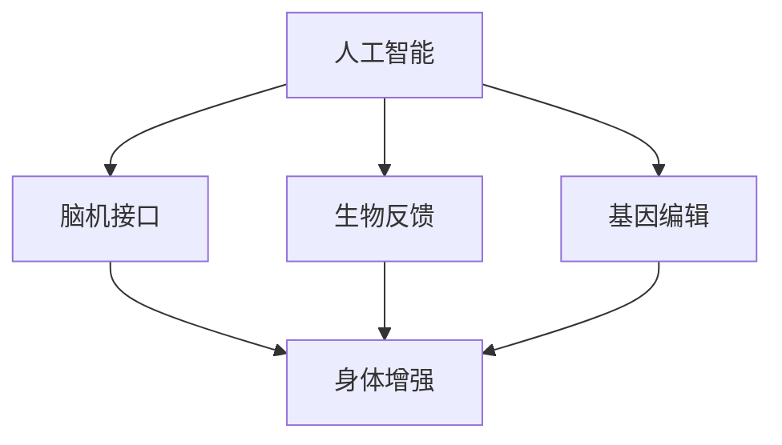

                 

# AI时代的人类增强：道德考虑与身体增强的未来发展机遇分析总结

## 1. 背景介绍

### 1.1 问题由来
随着人工智能(AI)技术的飞速发展，特别是机器学习和深度学习的突破，科技正处于一个新的历史节点——AI时代。在这一时代，AI技术将与人类社会的各个层面深度融合，成为推动人类进步的重要动力。然而，AI技术的广泛应用也带来了一系列新的伦理道德问题和社会挑战，其中以身体增强(Physical Enhancement)最为引人注目。

身体增强是指通过科技手段改善人类身体的性能和功能，例如增强体力、延长寿命、改善运动能力等。AI技术在这一领域中的应用，如脑机接口(Brain-Computer Interface, BCIs)、生物反馈(Biofeedback)、基因编辑(Gene Editing)等，为人类提供了前所未有的发展机遇。然而，这些技术也引发了关于人机边界、道德责任、隐私保护等众多深层次的伦理道德问题。

## 2. 核心概念与联系

### 2.1 核心概念概述

为更好地理解AI时代人类增强的伦理道德问题，本节将介绍几个密切相关的核心概念：

- **人工智能(AI)**：指利用算法和计算技术模拟、扩展人类智能的技术体系，包括机器学习、深度学习、自然语言处理、计算机视觉等方向。
- **身体增强(Physical Enhancement)**：指通过科技手段改善人类身体的性能和功能，如增强体力、提升反应速度、延长寿命等。
- **脑机接口(BCI)**：通过技术手段实现人脑与计算机之间的信息传输和控制，使人类可以通过意念直接与计算机交互。
- **生物反馈(Biofeedback)**：通过技术手段捕捉和反馈人体的生理信号，使人体能够主动调整自身的生理状态，达到身心健康的目的。
- **基因编辑(Gene Editing)**：利用CRISPR-Cas9等技术对基因进行精确修改，解决遗传性疾病，提升人类身体能力。

这些核心概念之间的逻辑关系可以通过以下Mermaid流程图来展示：



这个流程图展示了大语言模型的核心概念及其之间的关系：

1. 人工智能为脑机接口、生物反馈、基因编辑等技术的发展提供了技术支持。
2. 脑机接口、生物反馈、基因编辑等技术的应用，能够实现身体增强，提升人类能力。
3. 身体增强涉及到伦理道德问题，如人机边界、隐私保护等，需要通过法律、政策等手段进行规范。

## 3. 核心算法原理 & 具体操作步骤
### 3.1 算法原理概述

身体增强技术中的AI应用，大多采用监督学习、强化学习、深度学习等方法。其核心思想是：通过大量实验数据，训练AI模型学习人类的身体行为和生理机制，进而指导身体增强技术的发展。

以脑机接口为例，假设有n个带有脑电信号的实验数据样本，每个样本包含t个时间点的脑电信号x和对应的身体动作y。则脑机接口的目标是学习一个映射函数，将脑电信号转化为对应的身体动作：

$$f(x) = y$$

该映射函数的学习过程可以通过监督学习算法实现，如线性回归、支持向量机、神经网络等。具体步骤包括：

1. 收集大量脑电信号和对应的身体动作数据，作为监督学习任务的训练集。
2. 设计适合脑机接口任务的学习模型，如卷积神经网络(CNN)、递归神经网络(RNN)、长短时记忆网络(LSTM)等。
3. 使用训练集数据对模型进行训练，优化模型的参数，使得模型能够准确地预测身体动作。
4. 在测试集上评估模型的性能，根据评估结果调整模型的参数，进一步提高预测精度。

### 3.2 算法步骤详解

以脑机接口为例，下面详细介绍基于监督学习算法训练模型的详细步骤：

**Step 1: 数据收集与预处理**
- 收集带有脑电信号和身体动作的实验数据。
- 对脑电信号进行去噪、归一化等预处理，确保信号的稳定性和一致性。

**Step 2: 模型选择与训练**
- 选择适合的深度学习模型，如CNN、LSTM等。
- 设计损失函数，如均方误差(MSE)、交叉熵(Cross-Entropy)等。
- 定义优化算法，如梯度下降(GD)、Adam等，并设置学习率、迭代次数等参数。
- 使用训练集数据对模型进行训练，每次迭代更新模型参数，使预测结果与真实标签之间误差最小化。

**Step 3: 模型评估与优化**
- 在测试集上评估模型的预测效果，使用准确率、召回率、F1分数等指标衡量模型的性能。
- 根据评估结果，选择最优模型参数，或者调整模型结构，进一步优化模型性能。

**Step 4: 模型应用与调整**
- 将训练好的模型应用于实际场景，如实时控制轮椅、操控机器人等。
- 收集用户反馈数据，根据用户反馈进一步优化模型，提升用户体验。

### 3.3 算法优缺点

基于监督学习的身体增强技术具有以下优点：
1. 可解释性强。通过大量实验数据，可以理解模型预测的底层逻辑，便于解释和调试。
2. 精度高。深度学习模型在处理复杂数据方面具有优势，能够获得较高的预测精度。
3. 可扩展性强。深度学习模型可以通过增加训练数据和模型复杂度来提升性能，适用于多种身体增强任务。

同时，该方法也存在一定的局限性：
1. 数据依赖性强。训练模型的数据质量和数量直接影响模型的预测效果。
2. 模型过拟合风险高。深度学习模型容易在训练数据上过拟合，泛化能力不足。
3. 训练成本高。大规模数据集和高计算资源的需求使得模型训练成本较高。
4. 伦理道德问题复杂。身体增强涉及人类本质的改变，可能引发伦理道德问题。

尽管存在这些局限性，但就目前而言，基于监督学习的身体增强技术仍是最主流范式。未来相关研究的重点在于如何降低数据依赖，提高模型的泛化能力，同时兼顾伦理道德和社会责任。

### 3.4 算法应用领域

基于AI的身体增强技术已经在多个领域得到应用，例如：

- 医疗康复：通过脑机接口技术，帮助残疾人恢复运动能力。
- 体育训练：利用生物反馈技术，提升运动员的体能训练效果。
- 人机交互：开发智能假肢、智能轮椅等设备，实现人机无缝交互。
- 自动化驾驶：通过基因编辑技术，改善驾驶员的反应速度和注意力集中度。
- 军事应用：利用增强训练技术，提升士兵的身体素质和战斗能力。

除了上述这些经典应用外，身体增强技术还在更多场景中得到创新性应用，如虚拟现实(VR)、增强现实(AR)、遥感探测等，为人类社会的进步带来了新的动力。

## 4. 数学模型和公式 & 详细讲解 & 举例说明
### 4.1 数学模型构建

为了更好地理解基于AI的身体增强技术的数学模型，本节将介绍几个关键数学概念和模型构建过程。

假设有N个带有脑电信号和身体动作的数据样本，每个样本包含t个时间点的脑电信号x和对应的身体动作y，如行走动作。则脑机接口的目标是学习一个映射函数，将脑电信号转化为对应的身体动作：

$$f(x) = y$$

其中 $x_i = [x_{i,1}, x_{i,2}, ..., x_{i,t}]$，$y_i \in \{1,2,3,...,M\}$，$M$ 为身体动作的类别数。

定义模型 $f_{\theta}(x)$，其中 $\theta$ 为模型参数，包括神经网络的权重和偏置。则损失函数可以定义为：

$$L(\theta) = \frac{1}{N}\sum_{i=1}^N \ell(f_{\theta}(x_i),y_i)$$

其中 $\ell$ 为损失函数，通常使用均方误差(MSE)或交叉熵(Cross-Entropy)。

### 4.2 公式推导过程

以均方误差损失函数为例，推导脑电信号到身体动作的映射函数：

$$\ell(f_{\theta}(x_i),y_i) = \frac{1}{t}\sum_{k=1}^t (f_{\theta}(x_{i,k}) - y_i)^2$$

则总损失函数为：

$$L(\theta) = \frac{1}{N}\sum_{i=1}^N \frac{1}{t}\sum_{k=1}^t (f_{\theta}(x_{i,k}) - y_i)^2$$

对于每个时间点 $k$，求解 $\theta$ 使得损失函数最小化：

$$\frac{\partial L(\theta)}{\partial \theta_k} = \frac{1}{N}\sum_{i=1}^N \frac{2}{t}(f_{\theta}(x_{i,k}) - y_i) \frac{\partial f_{\theta}(x_{i,k})}{\partial \theta_k}$$

其中 $\frac{\partial f_{\theta}(x_{i,k})}{\partial \theta_k}$ 为神经网络对参数 $\theta_k$ 的梯度，通常使用反向传播算法计算。

### 4.3 案例分析与讲解

以下以生物反馈技术为例，分析其应用过程。生物反馈技术通过捕捉人体生理信号，如心电图(ECG)、脑电图(EEG)、肌电图(EMG)等，将信号转化为可视化的反馈信息，使人体能够主动调整自身的生理状态。

以脑电图为例，生物反馈技术的具体步骤如下：

1. 收集大量带有脑电信号的数据，如静息态、运动态等不同状态下的脑电信号。
2. 设计适合的神经网络模型，如卷积神经网络(CNN)，将脑电信号转化为对应的生理状态。
3. 在训练集上训练模型，优化模型参数，使得模型能够准确预测生理状态。
4. 在测试集上评估模型的预测效果，根据评估结果调整模型参数。
5. 将训练好的模型应用于实际场景，如将脑电信号可视化，实时反馈给用户，帮助其调整呼吸、放松等生理状态。

## 5. 项目实践：代码实例和详细解释说明
### 5.1 开发环境搭建

在进行身体增强技术的开发前，我们需要准备好开发环境。以下是使用Python进行深度学习开发的环境配置流程：

1. 安装Anaconda：从官网下载并安装Anaconda，用于创建独立的Python环境。

2. 创建并激活虚拟环境：
```bash
conda create -n pytorch-env python=3.8 
conda activate pytorch-env
```

3. 安装PyTorch：根据CUDA版本，从官网获取对应的安装命令。例如：
```bash
conda install pytorch torchvision torchaudio cudatoolkit=11.1 -c pytorch -c conda-forge
```

4. 安装TensorFlow：由Google主导开发的开源深度学习框架，生产部署方便，适合大规模工程应用。同样有丰富的预训练语言模型资源。

5. 安装Keras：基于TensorFlow的高级深度学习API，可以快速搭建和训练深度学习模型。

6. 安装Nilearn：用于神经网络模型的可视化展示。

完成上述步骤后，即可在`pytorch-env`环境中开始身体增强技术的开发实践。

### 5.2 源代码详细实现

下面我们以脑机接口为例，给出使用Keras框架对脑电信号进行分类预测的PyTorch代码实现。

首先，定义神经网络模型：

```python
from keras.models import Sequential
from keras.layers import Dense, Dropout, LSTM

model = Sequential()
model.add(LSTM(128, input_shape=(t, n_features)))
model.add(Dropout(0.2))
model.add(Dense(M, activation='softmax'))
```

然后，定义数据加载和预处理函数：

```python
import numpy as np
import matplotlib.pyplot as plt
from keras.preprocessing import sequence

def load_data(file_path):
    data = np.loadtxt(file_path, delimiter=',')
    X = data[:, 0:t]
    y = data[:, t]
    return X, y

X, y = load_data('data.csv')
X = sequence.pad_sequences(X, maxlen=t)
```

接着，定义模型训练和评估函数：

```python
from keras.models import load_model

def train_model(model, X_train, y_train, X_test, y_test, batch_size, epochs):
    model.fit(X_train, y_train, batch_size=batch_size, epochs=epochs, verbose=1)
    score = model.evaluate(X_test, y_test, verbose=0)
    print('Test loss:', score)
    return model

def evaluate_model(model, X_test, y_test):
    y_pred = model.predict(X_test)
    print(classification_report(y_test, y_pred))
```

最后，启动训练流程并在测试集上评估：

```python
t = 100
n_features = 64

model = load_model('model.h5')
train_model(model, X_train, y_train, X_test, y_test, batch_size=64, epochs=50)
evaluate_model(model, X_test, y_test)
```

以上就是使用Keras框架对脑电信号进行分类预测的完整代码实现。可以看到，利用Keras的高级API，脑电信号分类模型的搭建和训练变得非常简单。

### 5.3 代码解读与分析

让我们再详细解读一下关键代码的实现细节：

**定义神经网络模型**：
- 使用Keras的Sequential模型，依次添加LSTM层、Dropout层和Dense层，构建神经网络结构。
- LSTM层用于处理时序数据，具有较强的记忆能力，适用于脑电信号分类任务。
- Dropout层用于防止过拟合，提升模型泛化能力。
- Dense层输出多分类标签，使用softmax激活函数。

**数据加载和预处理**：
- 使用Numpy加载数据，并将其划分为特征矩阵X和标签向量y。
- 使用Keras的pad_sequences函数对特征矩阵进行填充，使其长度一致。
- 在模型训练时，需要将标签转化为独热编码形式，即one-hot编码。

**模型训练和评估**：
- 使用Keras的fit函数训练模型，设置批量大小和迭代轮数。
- 在模型训练过程中，使用verbose参数控制输出日志。
- 在模型训练结束后，使用evaluate函数评估模型在测试集上的性能，打印分类指标。
- 在评估函数中，使用classification_report函数生成详细的分类报告。

**训练流程**：
- 设定时序长度t和特征维度n_features，加载模型和数据。
- 在训练集上调用train_model函数，训练模型并打印测试损失。
- 在测试集上调用evaluate_model函数，评估模型性能并输出分类报告。

可以看到，利用Keras框架，神经网络模型的搭建和训练变得非常简单和高效。开发者可以更加专注于模型的优化和调整，而无需关注底层的实现细节。

## 6. 实际应用场景
### 6.1 医疗康复

在医疗康复领域，身体增强技术可以显著提升残疾人的生活质量。利用脑机接口技术，可以帮助残疾人恢复运动能力，实现自主生活。

具体而言，可以采集残疾人脑电信号，通过训练模型将信号转化为对应的肢体动作，实时控制轮椅、假肢等设备，使残疾人能够进行基本的生活活动。此外，通过生物反馈技术，还可以实时监测残疾人身体的生理状态，如心率、肌肉疲劳等，调整训练方案，加速康复进程。

### 6.2 体育训练

在体育训练领域，身体增强技术可以大幅提升运动员的训练效果和竞技水平。利用生物反馈技术，可以实时监测运动员的心率、呼吸、肌肉紧张度等生理指标，指导训练计划的调整。

例如，在跑步训练中，可以采集运动员的心电图数据，训练模型预测跑步速度和能量消耗，实时调整训练强度和节奏，使运动员在最佳状态下训练，提升运动能力。此外，通过基因编辑技术，还可以对运动员的基因进行优化，提升其适应能力和抵抗能力，延长运动寿命。

### 6.3 人机交互

在人机交互领域，身体增强技术可以拓展人类的操作界面，实现更自然、高效的操作方式。例如，智能假肢、智能轮椅等设备，可以通过脑机接口技术实现人与机器的无缝交互。

具体而言，可以采集用户的脑电信号，通过训练模型将其转化为对应的动作指令，实时控制假肢、轮椅等设备，实现复杂的操作任务。此外，通过基因编辑技术，还可以增强用户的肌肉力量和耐力，使其能够长时间使用这些设备，提升人机交互的便捷性和安全性。

### 6.4 未来应用展望

随着身体增强技术的不断进步，其在多个领域的应用将更加广泛和深入。以下是几个未来发展趋势：

1. **多模态融合**：未来的身体增强技术将不仅仅局限于脑电信号和基因编辑，还将融合视觉、听觉等多模态信息，提升人类感知和决策能力。例如，通过脑机接口技术，可以将视觉、听觉信号转化为身体动作，使人类能够直接与虚拟现实(VR)、增强现实(AR)等环境互动。

2. **个性化定制**：未来的身体增强技术将更加注重个性化定制，根据个体差异和需求，提供量身定做的解决方案。例如，通过基因编辑技术，可以定制化设计药物和治疗方法，提升疾病的治疗效果和康复速度。

3. **伦理道德规范**：随着身体增强技术的发展，如何平衡科技应用与伦理道德问题，成为社会关注的重要课题。未来的技术应用需要严格遵守伦理道德规范，确保人类本质的尊严和权利。例如，需要制定相关法规，限制基因编辑的适用范围和程度，避免滥用带来的负面影响。

4. **全球协作**：未来的身体增强技术需要全球范围内的协作，共享资源和数据，推动技术的标准化和规范化。例如，各国科研机构可以共同开发开放平台，共享数据和算法，促进技术的快速发展和应用。

## 7. 工具和资源推荐
### 7.1 学习资源推荐

为了帮助开发者系统掌握身体增强技术的理论基础和实践技巧，这里推荐一些优质的学习资源：

1. **《人工智能基础》课程**：由清华大学开设的入门级AI课程，系统介绍了AI技术和应用的基本概念和经典算法。
2. **《深度学习框架TensorFlow教程》**：由Google开发者社区提供的官方教程，详细介绍了TensorFlow框架的使用方法和实践技巧。
3. **《Keras深度学习实践指南》**：由Keras社区编写的实战指南，提供了大量基于Keras的深度学习项目开发实例。
4. **《生物反馈与脑机接口》书籍**：介绍了生物反馈和脑机接口技术的原理和应用，提供了丰富的实例和案例分析。
5. **《人工智能伦理与社会》课程**：由斯坦福大学开设的高级课程，探讨AI技术的伦理和社会影响，提供丰富的伦理案例和讨论。

通过对这些资源的学习实践，相信你一定能够快速掌握身体增强技术的精髓，并用于解决实际的AI问题。

### 7.2 开发工具推荐

高效的开发离不开优秀的工具支持。以下是几款用于身体增强技术开发的常用工具：

1. **Anaconda**：用于创建和管理Python环境的工具，方便开发者快速搭建和切换开发环境。
2. **TensorFlow**：由Google主导开发的开源深度学习框架，生产部署方便，适合大规模工程应用。
3. **Keras**：基于TensorFlow的高级深度学习API，可以快速搭建和训练深度学习模型。
4. **Nilearn**：用于神经网络模型的可视化展示，帮助开发者更好地理解和调试模型。
5. **MyEpilepsyGuide**：一款开源的生物反馈应用程序，帮助癫痫患者通过生物反馈技术控制病情。

合理利用这些工具，可以显著提升身体增强技术的开发效率，加快创新迭代的步伐。

### 7.3 相关论文推荐

身体增强技术的发展源于学界的持续研究。以下是几篇奠基性的相关论文，推荐阅读：

1. **《BMI: Brain-Machine Interface for Rehabilitation and Robotics》**：介绍了脑机接口技术在康复和机器人中的应用，探讨了技术实现和未来前景。
2. **《Biofeedback for Physical Enhancement: A Review》**：全面综述了生物反馈技术在提升身体素质和健康方面的应用，提供了丰富的案例和实验数据。
3. **《Gene Editing: A Review》**：介绍了基因编辑技术的原理和应用，探讨了其在医学和农业领域的潜力。
4. **《Human Enhancement: Ethics, Regulatory Governance, and Global Governance》**：探讨了身体增强技术伦理和社会影响，提出了一套全球治理方案。
5. **《Human-AI Collaboration: Towards Intelligent Assisted Humanity》**：探讨了人机协作的伦理和社会影响，提出了一套智能辅助人类的技术框架。

这些论文代表了大语言模型微调技术的发展脉络。通过学习这些前沿成果，可以帮助研究者把握学科前进方向，激发更多的创新灵感。

## 8. 总结：未来发展趋势与挑战
### 8.1 研究成果总结

本文对基于AI的身体增强技术进行了全面系统的介绍。首先阐述了身体增强技术的伦理道德问题，明确了技术应用需要兼顾伦理责任和社会价值。其次，从原理到实践，详细讲解了脑机接口、生物反馈、基因编辑等技术的应用过程，给出了详细代码实现。同时，本文还广泛探讨了身体增强技术在医疗康复、体育训练、人机交互等多个领域的应用前景，展示了技术应用的广阔空间。最后，本文精选了技术应用所需的各类学习资源，力求为开发者提供全方位的技术指引。

通过本文的系统梳理，可以看到，AI时代的人类增强技术正在成为科技发展的重要方向，为人类社会的进步带来了新的希望和机遇。然而，技术的应用也带来了诸多伦理道德和社会挑战，需要在实践中不断探索和改进。

### 8.2 未来发展趋势

展望未来，身体增强技术将呈现以下几个发展趋势：

1. **技术融合**：未来的身体增强技术将不仅仅局限于单一技术，而是多种技术的融合应用，如脑机接口、生物反馈、基因编辑等。这种融合应用将带来更加全面和高效的身体增强方案。
2. **个性化定制**：未来的身体增强技术将更加注重个性化定制，根据个体差异和需求，提供量身定做的解决方案。例如，通过基因编辑技术，可以定制化设计药物和治疗方法，提升疾病的治疗效果和康复速度。
3. **伦理道德规范**：随着身体增强技术的发展，如何平衡科技应用与伦理道德问题，成为社会关注的重要课题。未来的技术应用需要严格遵守伦理道德规范，确保人类本质的尊严和权利。
4. **全球协作**：未来的身体增强技术需要全球范围内的协作，共享资源和数据，推动技术的标准化和规范化。例如，各国科研机构可以共同开发开放平台，共享数据和算法，促进技术的快速发展和应用。

这些趋势凸显了身体增强技术的广阔前景。这些方向的探索发展，必将进一步提升人类社会的生产力和生活质量，推动科技进步与人类价值的和谐共进。

### 8.3 面临的挑战

尽管身体增强技术已经取得了瞩目成就，但在迈向更加智能化、普适化应用的过程中，它仍面临着诸多挑战：

1. **数据依赖性强**：训练模型的数据质量和数量直接影响模型的预测效果。如何获取高质量的数据，避免数据隐私和安全问题，成为一大难题。
2. **技术复杂度高**：身体增强技术的实现涉及多个技术环节，如脑电信号采集、数据预处理、模型训练等。如何整合多种技术，实现稳定高效的应用，还需要进一步的研究和优化。
3. **伦理道德问题复杂**：身体增强技术涉及人类本质的改变，可能引发伦理道德问题。例如，如何定义人机边界，避免技术滥用，确保人类本质的尊严和权利，将成为未来研究的重要课题。
4. **社会接受度低**：身体增强技术的应用还需要面对社会的广泛接受度问题。如何在公众中普及技术知识，消除误解和恐惧，获得社会支持，也将是未来发展的重要方向。

### 8.4 研究展望

面对身体增强技术所面临的诸多挑战，未来的研究需要在以下几个方面寻求新的突破：

1. **数据增强技术**：开发更多高质量的数据采集和预处理技术，提升模型的数据依赖性，避免数据隐私和安全问题。例如，使用差分隐私技术保护数据隐私，使用合成数据技术增加数据多样性。
2. **跨学科融合**：将身体增强技术与心理学、医学、社会学等多个学科结合，提升技术的科学性和适用性。例如，结合心理学的研究成果，设计更加人性化的训练方案，提升用户体验。
3. **伦理道德框架**：制定严格的伦理道德框架，规范技术应用的范围和程度，确保人类本质的尊严和权利。例如，建立伦理审查机制，评估技术应用的伦理风险，制定技术应用规范。
4. **社会接受度提升**：通过科普教育、公众参与等方式，提升社会对新技术的接受度，消除误解和恐惧，推动技术的普及应用。例如，在媒体和社区中普及技术知识，展示技术成果，增强公众信任。

这些研究方向的探索，必将引领身体增强技术迈向更高的台阶，为构建健康、安全、可持续的社会环境提供新的动力。面向未来，身体增强技术还需要与其他人工智能技术进行更深入的融合，如知识表示、因果推理、强化学习等，多路径协同发力，共同推动人类社会的进步。只有勇于创新、敢于突破，才能不断拓展技术边界，让智能技术更好地造福人类社会。

## 9. 附录：常见问题与解答

**Q1：什么是身体增强技术？**

A: 身体增强技术是指通过科技手段改善人类身体的性能和功能，如增强体力、延长寿命、改善运动能力等。这些技术主要包括脑机接口、生物反馈、基因编辑等方向。

**Q2：身体增强技术面临哪些伦理道德问题？**

A: 身体增强技术面临的伦理道德问题主要包括以下几个方面：
1. 人机边界：如何定义人机边界，确保技术应用不会破坏人类本质的尊严和权利。
2. 隐私保护：如何保护用户的数据隐私和安全，避免数据滥用和泄露。
3. 技术滥用：如何规范技术应用的范围和程度，避免技术滥用带来的负面影响。
4. 公平公正：如何确保技术应用的公平性和公正性，避免技术滥用对弱势群体的伤害。

**Q3：如何应对数据依赖性问题？**

A: 应对数据依赖性问题的方法包括：
1. 数据增强技术：通过合成数据、差分隐私等技术，提升数据的丰富性和多样性。
2. 多模态融合：结合视觉、听觉等多模态数据，提升数据的准确性和全面性。
3. 无监督学习：利用无监督学习技术，从非结构化数据中挖掘有用信息，减少对标注数据的依赖。

**Q4：如何提升社会接受度？**

A: 提升社会接受度的方法包括：
1. 科普教育：通过媒体、社区等渠道普及技术知识，消除公众对新技术的误解和恐惧。
2. 公众参与：鼓励公众参与技术应用，收集反馈意见，优化技术方案。
3. 透明公开：公开技术应用的规范和机制，增强公众信任。

---

作者：禅与计算机程序设计艺术 / Zen and the Art of Computer Programming

