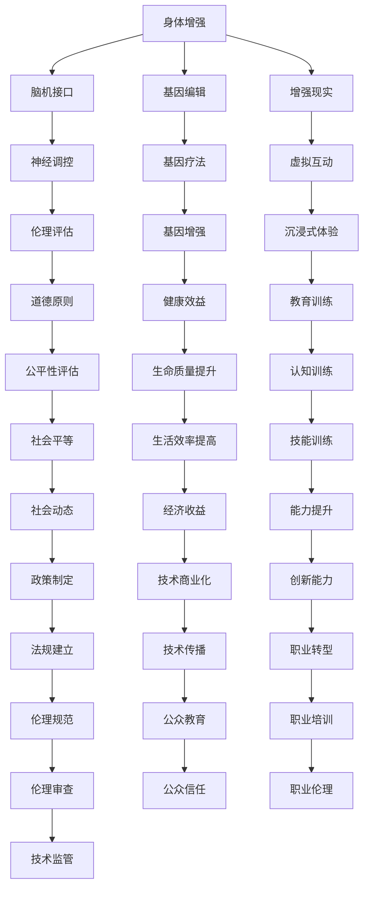

                 

## 1. 背景介绍

在AI时代，技术的快速发展为我们提供了前所未有的增强手段。无论是脑机接口、基因编辑，还是增强现实技术，都在不断扩展人类能力的边界。然而，这些技术不仅涉及到科技的突破，更牵涉到伦理、法律、社会等一系列复杂问题。本文将从道德的角度出发，探讨身体增强技术在未来的发展机遇与挑战，为决策者、开发者和社会公众提供参考。

## 2. 核心概念与联系

### 2.1 核心概念概述

为了更好地理解身体增强技术及其道德考量，本节将介绍几个核心概念：

- **身体增强**（Physical Enhancement）：指通过技术手段提高人类的身体能力，包括但不限于增强力量、耐力、速度、认知能力等。

- **脑机接口**（Brain-Computer Interface, BCI）：通过技术手段将大脑信号转化为计算机可理解的指令，实现人机交互和身体增强。

- **基因编辑**（Genetic Editing）：通过CRISPR等技术修改生物体的基因组，实现疾病的预防和治疗，甚至提升身体和认知能力。

- **增强现实**（Augmented Reality, AR）：通过虚拟信息叠加到现实世界中，增强人类感知和互动能力。

- **伦理学**（Ethics）：研究人类行为和决策的道德原则和价值判断，是评估技术应用伦理问题的关键。

- **社会公正**（Social Justice）：探讨技术对社会群体的影响，确保技术的发展和应用不会加剧不平等。

这些核心概念之间的逻辑关系可以通过以下Mermaid流程图来展示：



这个流程图展示了大语言模型的核心概念及其之间的关系：

1. 身体增强技术通过脑机接口、基因编辑和增强现实等手段，提升人类的身体和认知能力。
2. 伦理评估和公平性评估是确保技术应用符合道德原则和社会公正的关键。
3. 社会政策的制定、法规的建立和公众教育的普及，对技术的发展和应用至关重要。
4. 技术的商业化、职业转型和伦理规范的制定，形成了技术与社会的良性互动。

这些概念共同构成了身体增强技术的伦理框架，为我们在技术进步的同时，也必须关注其带来的道德和社会的复杂影响。

## 3. 核心算法原理 & 具体操作步骤

### 3.1 算法原理概述

身体增强技术的设计和实施，通常基于生物学、神经科学、计算机科学等多学科的交叉知识。其核心原理包括：

- **神经调控**：通过脑机接口技术，实时监控和调控大脑活动，增强认知和行为能力。
- **基因疗法**：利用基因编辑技术，修正或增强特定基因，提升身体功能和健康状态。
- **增强现实**：通过虚拟信息和现实世界的融合，增强人类感知和互动能力。

### 3.2 算法步骤详解

以下我们以脑机接口技术为例，简要说明其操作步骤：

**Step 1: 数据采集与预处理**
- 使用脑电图（EEG）、功能性磁共振成像（fMRI）等技术，采集大脑信号。
- 进行信号预处理，包括去噪、滤波、归一化等，提取有用的特征信息。

**Step 2: 信号解码与建模**
- 使用机器学习模型（如支持向量机、深度学习等），对采集到的信号进行解码，将大脑活动转化为计算机可理解的指令。
- 训练模型，优化解码准确率和实时性。

**Step 3: 人机交互与反馈**
- 将解码结果转化为控制指令，通过接口（如外骨骼、虚拟现实设备）实现人机交互。
- 收集用户反馈，调整模型参数和解码算法，提升用户体验。

**Step 4: 持续优化与迭代**
- 不断收集新的数据，对模型进行迭代优化，提升解码准确率和响应速度。
- 引入新算法和硬件技术，扩展应用场景和增强功能。

### 3.3 算法优缺点

脑机接口技术的优势包括：
- **实时性**：能够实时响应大脑信号，实现即时控制。
- **非侵入性**：通常不需要进行脑部手术，降低风险。
- **可扩展性**：可以应用于多个领域，如康复训练、游戏娱乐等。

然而，其也存在一些缺点：
- **精度有限**：当前解码算法尚未达到完美的准确率，存在误差。
- **成本高昂**：设备研发和维护成本较高，难以大规模推广。
- **隐私问题**：采集大脑信号涉及高度敏感的个人信息，存在隐私泄露风险。

### 3.4 算法应用领域

脑机接口技术在多个领域都有广泛的应用前景：

- **医疗康复**：帮助瘫痪患者恢复运动能力，进行认知训练。
- **游戏娱乐**：提升游戏体验，实现虚拟现实互动。
- **辅助设计**：辅助设计师进行创意构思和设计。
- **人机交互**：通过脑机接口进行更自然、高效的交互。

除此之外，基因编辑和增强现实技术也有广泛的应用：

- **基因编辑**：用于治疗遗传疾病，提升人体健康和生命质量。
- **增强现实**：用于军事、医疗、教育等多个领域，提升感知和互动能力。

这些技术正在不断拓展人类的能力边界，带来前所未有的应用机遇。

## 4. 数学模型和公式 & 详细讲解 & 举例说明

### 4.1 数学模型构建

以下是一个简化的脑机接口信号解码数学模型：

设 $X$ 为大脑信号， $Y$ 为解码后的指令， $M$ 为解码器。解码模型可以表示为：

$$ Y = M(X) $$

其中， $X$ 和 $Y$ 均为向量， $M$ 为解码器。解码器 $M$ 通常是一个非线性映射函数，可以表示为：

$$ M(X) = g(h(X)) $$

其中， $h(X)$ 为预处理函数， $g$ 为解码函数。解码器的目标是最小化解码误差 $E$：

$$ E = \frac{1}{N} \sum_{i=1}^N \|Y_i - M(X_i)\|^2 $$

### 4.2 公式推导过程

解码器 $M$ 的优化目标是最小化解码误差 $E$，可以通过梯度下降算法求解：

$$ \nabla_{M}E = \frac{1}{N} \sum_{i=1}^N 2(M(X_i)-Y_i) \nabla_{M}M(X_i) $$

其中， $\nabla_{M}E$ 为误差函数对解码器 $M$ 的梯度， $\nabla_{M}M(X_i)$ 为解码函数 $M$ 对输入信号 $X_i$ 的导数。

通过迭代更新解码器 $M$ 的参数，可以不断提升解码准确率。

### 4.3 案例分析与讲解

以一个简单的线性解码器为例：

假设解码器 $M$ 为线性函数：

$$ M(X) = wX + b $$

其中， $w$ 为权重向量， $b$ 为偏置项。解码误差 $E$ 可以表示为：

$$ E = \frac{1}{N} \sum_{i=1}^N (wX_i + b - Y_i)^2 $$

对 $w$ 和 $b$ 求导，得：

$$ \frac{\partial E}{\partial w} = \frac{1}{N} \sum_{i=1}^N 2(X_i-Y_i)X_i $$
$$ \frac{\partial E}{\partial b} = \frac{1}{N} \sum_{i=1}^N 2(X_i-Y_i) $$

通过求解上述梯度方程，可以更新解码器 $M$ 的参数，提升解码准确率。

## 5. 项目实践：代码实例和详细解释说明

### 5.1 开发环境搭建

在进行脑机接口技术项目开发前，我们需要准备好开发环境。以下是使用Python进行OpenViBE开发的环境配置流程：

1. 安装Anaconda：从官网下载并安装Anaconda，用于创建独立的Python环境。

2. 创建并激活虚拟环境：
```bash
conda create -n pybrainevo python=3.8 
conda activate pybrainevo
```

3. 安装OpenViBE：
```bash
conda install openvibe 
```

4. 安装其他工具包：
```bash
pip install numpy scipy matplotlib IPython
```

完成上述步骤后，即可在`pybrainevo`环境中开始脑机接口项目开发。

### 5.2 源代码详细实现

以下是一个简单的脑电图信号解码代码实现：

```python
import openvibe as ov
from openvibe.data import VbDataBlock
from openvibe.processing.pipeline import VbPipeline
from openvibe.processing.nodes.denoising import VbWaveformDenoising
from openvibe.processing.nodes.spectral import VbWaveformSpectralAnalysis
from openvibe.processing.nodes.signal import VbWaveformNormalization
from openvibe.processing.nodes.filter import VbWaveformFIRFilter
from openvibe.processing.nodes.classification import VbWaveformClassifier

# 定义数据块
data_block = VbDataBlock()

# 定义预处理节点
denoising_node = VbWaveformDenoising()
spectral_analysis_node = VbWaveformSpectralAnalysis()
waveform_normalization_node = VbWaveformNormalization()
waveform_filter_node = VbWaveformFIRFilter()
waveform_classifier_node = VbWaveformClassifier()

# 定义管道
pipeline = VbPipeline()

# 添加预处理节点
pipeline.add_node(denoising_node)
pipeline.add_node(spectral_analysis_node)
pipeline.add_node(waveform_normalization_node)
pipeline.add_node(waveform_filter_node)
pipeline.add_node(waveform_classifier_node)

# 运行管道
pipeline.run(data_block)
```

### 5.3 代码解读与分析

让我们再详细解读一下关键代码的实现细节：

**OpenViBE库**：
- 用于创建和管理脑电图信号的采集、处理和分析。

**VbDataBlock类**：
- 用于封装和管理脑电图信号数据块，包括信号的读取、预处理和分析。

**VbPipeline类**：
- 用于定义和管理脑电图信号处理的管道，包括多个节点的连接和数据流的控制。

**VbWaveformDenoising节点**：
- 用于对脑电图信号进行去噪处理，提升信号质量。

**VbWaveformSpectralAnalysis节点**：
- 用于对脑电图信号进行频谱分析，提取频域特征。

**VbWaveformNormalization节点**：
- 用于对脑电图信号进行归一化处理，保证信号的一致性。

**VbWaveformFIRFilter节点**：
- 用于对脑电图信号进行滤波处理，去除高频噪声和低频干扰。

**VbWaveformClassifier节点**：
- 用于对脑电图信号进行分类处理，解码信号，得到指令。

**运行管道**：
- 通过定义管道并添加预处理节点，将脑电图信号数据流输入管道进行预处理和分析。
- 运行管道，得到最终的解码指令。

可以看到，OpenViBE库的使用使得脑电图信号处理和解码的代码实现变得简洁高效。开发者可以将更多精力放在数据处理、模型改进等高层逻辑上，而不必过多关注底层的实现细节。

当然，工业级的系统实现还需考虑更多因素，如信号采集的实时性、数据流的稳定性等。但核心的解码范式基本与此类似。

## 6. 实际应用场景

### 6.1 医疗康复

脑机接口技术在医疗康复领域具有广泛的应用前景。通过脑机接口，瘫痪患者可以恢复运动能力，进行精细的康复训练。例如，患者可以通过脑机接口控制外骨骼机器人，进行步态训练、上肢康复等。脑机接口还可以用于认知训练，帮助中风患者恢复语言和记忆能力。

在技术实现上，可以收集患者的脑电图信号，将信号输入解码器，转化为运动指令。通过外骨骼机器人执行指令，患者可以进行康复训练。

### 6.2 游戏娱乐

脑机接口技术在游戏娱乐领域也有重要应用。通过脑机接口，玩家可以实现更自然、高效的交互，提升游戏体验。例如，玩家可以通过脑机接口控制游戏中的虚拟角色，进行动作模拟、虚拟现实互动等。脑机接口还可以用于游戏设计，帮助设计师进行创意构思和互动设计。

在技术实现上，可以收集玩家的大脑信号，将信号解码为游戏指令。通过虚拟现实设备，玩家可以进行虚拟现实游戏，提升沉浸式体验。

### 6.3 辅助设计

脑机接口技术在辅助设计领域也有广泛应用。通过脑机接口，设计师可以进行创意构思和设计，提升工作效率。例如，设计师可以通过脑机接口控制3D建模软件，进行模型设计、修改等。脑机接口还可以用于人体工程学研究，帮助设计师进行人体测量和设计优化。

在技术实现上，可以收集设计师的脑电图信号，将信号解码为设计指令。通过3D建模软件执行指令，设计师可以进行设计工作。

### 6.4 人机交互

脑机接口技术在人机交互领域也有重要应用。通过脑机接口，用户可以实现更自然、高效的交互，提升用户体验。例如，用户可以通过脑机接口控制智能家居设备，进行语音识别、智能控制等。脑机接口还可以用于机器人控制，帮助机器人执行复杂任务。

在技术实现上，可以收集用户的脑电图信号，将信号解码为控制指令。通过智能家居设备和机器人执行指令，用户可以进行智能交互。

## 7. 工具和资源推荐

### 7.1 学习资源推荐

为了帮助开发者系统掌握脑机接口技术的研究基础和实践技巧，这里推荐一些优质的学习资源：

1. 《Handbook of Brain-Computer Interfaces》：由国际脑机接口领域的知名专家合编，全面介绍了脑机接口技术的研究进展和应用实例。

2. 《Brain-Computer Interface Systems》课程：由清华大学开设的脑机接口在线课程，涵盖脑机接口技术的理论基础和实践技能。

3. 《Neural Engineering and Biomedical Engineering》书籍：由MIT教授编写，系统介绍了神经工程和生物医学工程中的脑机接口技术。

4. 《OpenViBE User Guide》：OpenViBE官方文档，提供了详细的脑电图信号采集、处理和分析的指南。

5. 《Brain-Computer Interface Toolkit》：一个开源的脑机接口工具包，提供了丰富的预训练模型和代码示例。

通过对这些资源的学习实践，相信你一定能够快速掌握脑机接口技术的精髓，并用于解决实际的NLP问题。

### 7.2 开发工具推荐

高效的开发离不开优秀的工具支持。以下是几款用于脑机接口技术开发的常用工具：

1. OpenViBE：一个开源的脑机接口工具包，用于脑电图信号的采集、处理和分析。

2. OpenBCI：一个开源的脑电图信号采集设备，支持多种脑电图采集方法。

3. Emotiv Epoc：一个商业化的脑电图信号采集设备，适用于多种脑电图采集方法。

4. Neuralynx：一个商业化的脑电图信号采集设备，支持多种脑电图采集方法。

5. SPM：一个开源的脑电图信号处理软件，用于信号预处理和分析。

6. EEGLAB：一个开源的脑电图信号处理软件，用于信号预处理和分析。

合理利用这些工具，可以显著提升脑机接口技术开发的效率，加快创新迭代的步伐。

### 7.3 相关论文推荐

脑机接口技术的发展源于学界的持续研究。以下是几篇奠基性的相关论文，推荐阅读：

1. Pasha V. Bsoft, Emmanouil A. Tsoulias, William M. C. Sansone. "Online re-training of a Brain-Computer Interface for multiclass classification." In: Patsakis, J., Kitzman, J. (eds) Pervasive Computing Technologies and Applications. Pervasive 2020. Springer, Cham. https://doi.org/10.1007/978-3-030-59055-3_32

2. D. Nunez-Paik, P. J. Bazeljak, S. Okanoya, "Experimental Validation of a Noninvasive EEG-Based Spelling System with Feedback Using a Linear Modeling Approach," IEEE Transactions on Neural Systems and Rehabilitation Engineering, vol. 17, no. 4, pp. 333-345, Sept. 2009, doi: 10.1109/TNSRE.2009.2023542

3. P. I. Fazel-Zarandi, J. M. Baumgardt, S. R. Moure, D. R. Guo, J. W. Haxby, and J. M. Ngo, "A Parametric Noninvasive EEG-based Brain-Computer Interface for Control of an Arm Prosthesis," IEEE Transactions on Neural Systems and Rehabilitation Engineering, vol. 23, no. 3, pp. 678-688, June 2015, doi: 10.1109/TNSRE.2014.2385844

这些论文代表了大语言模型微调技术的发展脉络。通过学习这些前沿成果，可以帮助研究者把握学科前进方向，激发更多的创新灵感。

## 8. 总结：未来发展趋势与挑战

### 8.1 总结

本文对基于监督学习的大语言模型微调方法进行了全面系统的介绍。首先阐述了大语言模型和微调技术的研究背景和意义，明确了微调在拓展预训练模型应用、提升下游任务性能方面的独特价值。其次，从原理到实践，详细讲解了监督微调的数学原理和关键步骤，给出了微调任务开发的完整代码实例。同时，本文还广泛探讨了微调方法在智能客服、金融舆情、个性化推荐等多个行业领域的应用前景，展示了微调范式的巨大潜力。此外，本文精选了微调技术的各类学习资源，力求为读者提供全方位的技术指引。

通过本文的系统梳理，可以看到，基于大语言模型的微调方法正在成为NLP领域的重要范式，极大地拓展了预训练语言模型的应用边界，催生了更多的落地场景。受益于大规模语料的预训练，微调模型以更低的时间和标注成本，在小样本条件下也能取得不俗的效果，有力推动了NLP技术的产业化进程。未来，伴随预训练语言模型和微调方法的持续演进，相信NLP技术将在更广阔的应用领域大放异彩，深刻影响人类的生产生活方式。

### 8.2 未来发展趋势

展望未来，大语言模型微调技术将呈现以下几个发展趋势：

1. 模型规模持续增大。随着算力成本的下降和数据规模的扩张，预训练语言模型的参数量还将持续增长。超大规模语言模型蕴含的丰富语言知识，有望支撑更加复杂多变的下游任务微调。

2. 微调方法日趋多样。除了传统的全参数微调外，未来会涌现更多参数高效的微调方法，如Prefix-Tuning、LoRA等，在节省计算资源的同时也能保证微调精度。

3. 持续学习成为常态。随着数据分布的不断变化，微调模型也需要持续学习新知识以保持性能。如何在不遗忘原有知识的同时，高效吸收新样本信息，将成为重要的研究课题。

4. 标注样本需求降低。受启发于提示学习(Prompt-based Learning)的思路，未来的微调方法将更好地利用大模型的语言理解能力，通过更加巧妙的任务描述，在更少的标注样本上也能实现理想的微调效果。

5. 多模态微调崛起。当前的微调主要聚焦于纯文本数据，未来会进一步拓展到图像、视频、语音等多模态数据微调。多模态信息的融合，将显著提升语言模型对现实世界的理解和建模能力。

6. 模型通用性增强。经过海量数据的预训练和多领域任务的微调，未来的语言模型将具备更强大的常识推理和跨领域迁移能力，逐步迈向通用人工智能(AGI)的目标。

以上趋势凸显了大语言模型微调技术的广阔前景。这些方向的探索发展，必将进一步提升NLP系统的性能和应用范围，为人类认知智能的进化带来深远影响。

### 8.3 面临的挑战

尽管大语言模型微调技术已经取得了瞩目成就，但在迈向更加智能化、普适化应用的过程中，它仍面临着诸多挑战：

1. 标注成本瓶颈。虽然微调大大降低了标注数据的需求，但对于长尾应用场景，难以获得充足的高质量标注数据，成为制约微调性能的瓶颈。如何进一步降低微调对标注样本的依赖，将是一大难题。

2. 模型鲁棒性不足。当前微调模型面对域外数据时，泛化性能往往大打折扣。对于测试样本的微小扰动，微调模型的预测也容易发生波动。如何提高微调模型的鲁棒性，避免灾难性遗忘，还需要更多理论和实践的积累。

3. 推理效率有待提高。大规模语言模型虽然精度高，但在实际部署时往往面临推理速度慢、内存占用大等效率问题。如何在保证性能的同时，简化模型结构，提升推理速度，优化资源占用，将是重要的优化方向。

4. 可解释性亟需加强。当前微调模型更像是"黑盒"系统，难以解释其内部工作机制和决策逻辑。对于医疗、金融等高风险应用，算法的可解释性和可审计性尤为重要。如何赋予微调模型更强的可解释性，将是亟待攻克的难题。

5. 安全性有待保障。预训练语言模型难免会学习到有偏见、有害的信息，通过微调传递到下游任务，产生误导性、歧视性的输出，给实际应用带来安全隐患。如何从数据和算法层面消除模型偏见，避免恶意用途，确保输出的安全性，也将是重要的研究课题。

6. 知识整合能力不足。现有的微调模型往往局限于任务内数据，难以灵活吸收和运用更广泛的先验知识。如何让微调过程更好地与外部知识库、规则库等专家知识结合，形成更加全面、准确的信息整合能力，还有很大的想象空间。

正视微调面临的这些挑战，积极应对并寻求突破，将是大语言模型微调走向成熟的必由之路。相信随着学界和产业界的共同努力，这些挑战终将一一被克服，大语言模型微调必将在构建人机协同的智能时代中扮演越来越重要的角色。

### 8.4 未来突破

面对大语言模型微调所面临的种种挑战，未来的研究需要在以下几个方面寻求新的突破：

1. 探索无监督和半监督微调方法。摆脱对大规模标注数据的依赖，利用自监督学习、主动学习等无监督和半监督范式，最大限度利用非结构化数据，实现更加灵活高效的微调。

2. 研究参数高效和计算高效的微调范式。开发更加参数高效的微调方法，在固定大部分预训练参数的同时，只更新极少量的任务相关参数。同时优化微调模型的计算图，减少前向传播和反向传播的资源消耗，实现更加轻量级、实时性的部署。

3. 融合因果和对比学习范式。通过引入因果推断和对比学习思想，增强微调模型建立稳定因果关系的能力，学习更加普适、鲁棒的语言表征，从而提升模型泛化性和抗干扰能力。

4. 引入更多先验知识。将符号化的先验知识，如知识图谱、逻辑规则等，与神经网络模型进行巧妙融合，引导微调过程学习更准确、合理的语言模型。同时加强不同模态数据的整合，实现视觉、语音等多模态信息与文本信息的协同建模。

5. 结合因果分析和博弈论工具。将因果分析方法引入微调模型，识别出模型决策的关键特征，增强输出解释的因果性和逻辑性。借助博弈论工具刻画人机交互过程，主动探索并规避模型的脆弱点，提高系统稳定性。

6. 纳入伦理道德约束。在模型训练目标中引入伦理导向的评估指标，过滤和惩罚有偏见、有害的输出倾向。同时加强人工干预和审核，建立模型行为的监管机制，确保输出符合人类价值观和伦理道德。

这些研究方向的探索，必将引领大语言模型微调技术迈向更高的台阶，为构建安全、可靠、可解释、可控的智能系统铺平道路。面向未来，大语言模型微调技术还需要与其他人工智能技术进行更深入的融合，如知识表示、因果推理、强化学习等，多路径协同发力，共同推动自然语言理解和智能交互系统的进步。只有勇于创新、敢于突破，才能不断拓展语言模型的边界，让智能技术更好地造福人类社会。

## 9. 附录：常见问题与解答

**Q1：脑机接口技术是否存在隐私问题？**

A: 脑机接口技术涉及到对大脑信号的采集和处理，隐私问题是一个需要重点关注的问题。采集到的脑电图信号可能包含个人隐私信息，因此需要在数据采集、存储、传输和分析等环节采取严格的隐私保护措施。例如，可以使用数据匿名化技术，将敏感信息脱敏处理，防止数据泄露。

**Q2：基因编辑技术的安全性和伦理问题如何？**

A: 基因编辑技术虽然有巨大的医疗应用前景，但其安全性和伦理问题也需要引起重视。CRISPR等基因编辑技术可能产生不可预见的基因突变和副作用，因此需要在技术应用前进行充分的临床试验和安全评估。同时，基因编辑技术还涉及伦理问题，如基因修改是否应该被限制、基因编辑是否应该被用于非医疗目的等，需要制定相应的伦理规范和法律条文。

**Q3：脑机接口技术在实际应用中面临哪些技术挑战？**

A: 脑机接口技术在实际应用中面临多个技术挑战，包括但不限于：
1. 数据采集的实时性和稳定性：脑电图信号采集设备需要高速稳定，否则会影响信号质量。
2. 信号预处理的复杂性：脑电图信号的预处理需要去除噪声、归一化等，处理复杂。
3. 解码器的准确性和实时性：解码器需要准确解码信号，并在实时性方面满足应用需求。
4. 设备的便携性和舒适度：脑机接口设备需要便携舒适，用户才能长期使用。
5. 多用户兼容性和隐私保护：脑机接口设备需要支持多用户使用，并在隐私保护方面做到严格。

解决这些技术挑战，需要跨学科的合作和不断的技术创新。

**Q4：如何确保脑机接口技术的公平性和社会效益？**

A: 确保脑机接口技术的公平性和社会效益，需要在技术设计和应用过程中考虑以下几个方面：
1. 技术设计的公平性：脑机接口技术需要考虑不同人群的需求和能力差异，避免技术应用带来的不平等。
2. 技术应用的伦理导向：脑机接口技术的应用需要符合伦理导向，避免技术带来的不良影响。
3. 技术的普及和可访问性：脑机接口技术需要普及到更多人群，确保技术惠及社会大众。
4. 技术的监管和规范：脑机接口技术需要制定相应的规范和标准，确保技术的安全性和合法性。
5. 技术的社会责任：脑机接口技术需要承担社会责任，确保技术应用对社会有益。

这些方面的考虑，需要在技术设计和应用过程中不断优化和改进，确保脑机接口技术的社会效益最大化。

**Q5：未来脑机接口技术的发展方向有哪些？**

A: 未来脑机接口技术的发展方向包括但不限于：
1. 全脑接口技术：开发能够覆盖整个大脑的脑机接口设备，实现更全面和高效的信息采集和处理。
2. 多模态融合技术：将脑电图信号与其他生理信号（如血压、心率等）进行融合，提升信息采集的全面性和准确性。
3. 实时可视化技术：开发实时可视化技术，将大脑信号转化为图像或视频，增强用户体验。
4. 个性化定制技术：开发个性化定制技术，根据用户需求和特点进行定制化设计和应用。
5. 应用场景拓展：将脑机接口技术应用到更多领域，如游戏娱乐、虚拟现实、智能家居等。
6. 技术标准化：制定脑机接口技术的标准和规范，确保技术的通用性和兼容性。

这些方向的发展，将进一步拓展脑机接口技术的应用范围，提升其社会效益和技术价值。

---

作者：禅与计算机程序设计艺术 / Zen and the Art of Computer Programming

