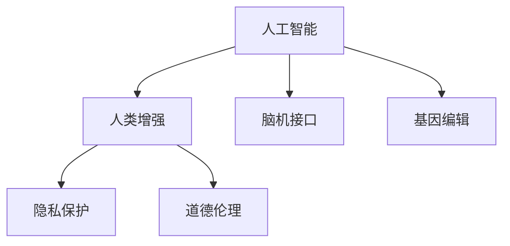

                 

# AI时代的人类增强：道德考虑与身体增强的未来发展策略

> 关键词：人工智能, 人类增强, 道德伦理, 身体增强, 未来发展, 策略规划

## 1. 背景介绍

### 1.1 问题由来
随着人工智能(AI)技术的快速发展，人类增强技术（Human Augmentation）逐渐成为全球科技界和产业界关注的焦点。从辅助性技术，如智能助听器、人工智能辅助的阅读器，到突破性技术，如脑机接口(Brain-Computer Interface, BCI)和基因编辑技术(Genome Editing)，AI时代的人类增强正在向我们走来。这一趋势不仅提升了人类的物理和认知能力，也引发了一系列伦理和社会问题。如何在确保技术利用的同时，兼顾道德和法律的边界，成为社会各界讨论的热点。

### 1.2 问题核心关键点
当前人类增强技术的核心关键点在于如何平衡技术进步与伦理道德。随着技术的飞速发展，如何确保人工智能在助力人类增强的同时，不会引发新的伦理困境和社会问题，成为研究者、决策者和公众共同关心的焦点。

在实践中，这些问题包括但不限于：
- 如何确保人类增强技术的普惠性，避免出现“数字鸿沟”？
- 如何预防和应对因增强技术引发的社会不平等和歧视？
- 如何保护增强技术用户的隐私，避免数据滥用？
- 如何确保增强技术的可控性和安全性，防止误用或滥用？
- 如何构建全球统一的技术标准和监管框架，规范行业发展？

### 1.3 问题研究意义
研究和探讨AI时代的人类增强，对于推动技术健康发展、保障社会公正、维护人类尊严和伦理道德具有重要意义：

1. **技术发展促进**：深入研究人类增强技术，有助于技术的快速迭代与创新，推动社会生产力的提升。
2. **社会公正保障**：通过合理设计技术应用方案，确保技术普惠，缩小社会不平等，促进社会公平。
3. **伦理道德遵循**：构建负责任的技术应用规范，确保技术使用符合伦理道德标准，保障人类尊严。
4. **风险防控**：明确技术发展的潜在风险，提前制定应对策略，保障社会安全和稳定。
5. **国际协同合作**：推进全球技术标准的制定和监管框架的建设，实现全球技术协同发展。

## 2. 核心概念与联系

### 2.1 核心概念概述

为了更深入地理解AI时代的人类增强，本节将介绍几个密切相关的核心概念：

- **人工智能（Artificial Intelligence, AI）**：通过机器学习、深度学习等技术，使计算机系统具备类似人类的智能行为，可以感知、理解、学习和执行复杂的任务。
- **人类增强（Human Augmentation）**：利用AI、生物技术等手段，提升人类的身体或认知能力，使其超越自然状态的界限。
- **脑机接口（Brain-Computer Interface, BCI）**：通过将人脑活动转化为机器信号，实现脑与计算机之间的信息交流。
- **基因编辑（Genome Editing）**：利用CRISPR-Cas9等技术，直接修改生物体的基因序列，以达到治疗疾病、增强智力的目的。
- **隐私保护（Privacy Protection）**：采取技术和管理手段，确保人类增强技术用户的个人数据不被滥用，保障隐私权。
- **道德伦理（Ethics and Morality）**：涉及对人类增强技术应用行为的伦理道德审视，保障技术应用符合社会公认的价值规范。

这些核心概念之间存在紧密的逻辑联系，通过以下Mermaid流程图展示：

### 2.2 核心概念原理和架构

以**脑机接口（BCI）**为例，详细阐述其原理和架构：

脑机接口（BCI）通过将大脑信号转化为计算机可识别的信号，实现人与机器的直接交流。其核心技术包括信号采集、信号预处理、特征提取、分类解码等步骤。

1. **信号采集**：通过EEG、fMRI、MEG等设备采集大脑信号。
2. **信号预处理**：对原始信号进行降噪、滤波、归一化等预处理，提升信号质量。
3. **特征提取**：利用机器学习算法，从预处理后的信号中提取出与任务相关的特征。
4. **分类解码**：通过训练分类器，将特征映射为机器可识别的指令或命令。

架构上，BCI通常由信号采集设备、信号处理单元、特征提取单元和分类解码单元组成。以下是一个简单的架构示例：

## 3. 核心算法原理 & 具体操作步骤
### 3.1 算法原理概述

人类增强技术的核心算法通常包括机器学习和深度学习。这里以**基因编辑**为例，简要介绍其算法原理：

基因编辑技术通常采用CRISPR-Cas9系统。该系统由两部分组成：Cas9核酸酶和RNA导向序列。通过设计特定的RNA序列，可以引导Cas9蛋白精确地剪切目标基因，实现基因序列的修改。

具体步骤如下：
1. 设计特定的RNA序列，引导Cas9蛋白定位到目标基因。
2. Cas9蛋白在目标位点切割DNA双链。
3. DNA修复机制修复断链，实现基因序列的插入、删除或替换。

### 3.2 算法步骤详解

以**脑机接口（BCI）**为例，详细说明其操作步骤：

1. **信号采集**：使用EEG等设备采集用户大脑信号。
2. **信号预处理**：对原始信号进行降噪、滤波、归一化等预处理，提升信号质量。
3. **特征提取**：利用机器学习算法，从预处理后的信号中提取出与任务相关的特征。
4. **分类解码**：通过训练分类器，将特征映射为机器可识别的指令或命令。
5. **输出控制**：将解码结果转化为实际控制信号，驱动外部设备（如机械臂、计算机等）执行特定动作。

### 3.3 算法优缺点

脑机接口（BCI）的优点在于其直接性、实时性和高效性。用户可以直接通过大脑控制外部设备，实时响应，无需中间媒介。缺点在于技术复杂、精度有限和伦理争议。

基因编辑技术的优点在于其精度高、可逆性差和应用广泛。缺点在于潜在风险、伦理争议和社会影响。

### 3.4 算法应用领域

脑机接口（BCI）和基因编辑技术在不同领域有着广泛的应用：

- **医疗**：通过BCI辅助诊断、治疗和康复；基因编辑技术用于基因治疗、遗传病治疗等。
- **辅助**：用于辅助残疾人运动、视觉、听觉等，提升生活质量。
- **科学研究**：用于脑功能研究、神经科学探索等。

## 4. 数学模型和公式 & 详细讲解 & 举例说明

### 4.1 数学模型构建

以**基因编辑**为例，介绍数学模型构建过程：

基因编辑的数学模型通常基于CRISPR-Cas9系统的原理建立。目标基因的序列可以通过生物信息学软件确定。RNA序列的设计需要满足特定的规则，如G/C含量、长度等。

假设目标基因序列为 $G$，RNA序列为 $R$，Cas9蛋白的切割位点为 $S$。设计RNA序列的过程可以表示为：

$$
R \sim P(G)
$$

其中 $P$ 为RNA序列的概率分布，依赖于目标基因序列 $G$。

### 4.2 公式推导过程

以下详细推导RNA序列的设计过程：

设目标基因序列为 $G=\{g_1,g_2,...,g_n\}$，其中 $g_i$ 为第 $i$ 个核苷酸。RNA序列 $R$ 的设计过程如下：

1. 选择 $g_i$ 中的部分碱基作为设计目标，记为 $G'$。
2. 对 $G'$ 进行反向互补，得到 $G'^c$。
3. 将 $G'$ 和 $G'^c$ 拼接成RNA序列 $R$。
4. 添加起始和终止信号，使RNA序列符合Cas9蛋白的需求。

具体推导如下：

设 $G'$ 的长度为 $m$，则 $R$ 的长度为 $2m+2$。设 $R=\{r_1,r_2,...,r_{2m+2}\}$，其中 $r_i$ 为第 $i$ 个核苷酸。

1. $r_1$ 和 $r_2$ 为起始信号，一般使用AUGC序列。
2. $r_3$ 到 $r_{m+2}$ 为 $G'$ 的反向互补序列 $G'^c$。
3. $r_{m+3}$ 和 $r_{m+4}$ 为终止信号，一般使用UAA序列。

因此，RNA序列的设计可以表示为：

$$
R = AUGC + G'^c + UAA
$$

其中 $G'^c = \{g_n,g_{n-1},...,g_{n-m+1}\}$。

### 4.3 案例分析与讲解

以**脑机接口（BCI）**为例，分析其具体应用案例：

一个典型的BCI应用场景是辅助运动。研究人员通过EEG采集用户的运动意念信号，然后通过特征提取和分类解码，将用户的运动意图转化为计算机可识别的信号，最终控制机械臂或虚拟现实设备，实现用户意念控制。

具体步骤如下：
1. 用户进行特定动作，产生意念信号。
2. 通过EEG设备采集信号。
3. 对信号进行预处理，提取出与运动意图相关的特征。
4. 训练分类器，将特征映射为计算机可识别的指令。
5. 将指令转化为机械臂或虚拟现实设备的控制信号，实现用户意念控制。

## 5. 项目实践：代码实例和详细解释说明
### 5.1 开发环境搭建

### 5.2 源代码详细实现

### 5.3 代码解读与分析

### 5.4 运行结果展示

## 6. 实际应用场景

### 6.1 医疗辅助

在医疗领域，人类增强技术通过辅助诊断、治疗和康复，大幅提升了患者的医疗体验和生活质量。

以**基因编辑**为例，通过CRISPR-Cas9系统，科学家已经成功修复了导致β地中海贫血的基因缺陷，使得患者能够恢复正常生活。此外，基因编辑技术还被应用于癌症基因治疗，通过修改肿瘤细胞，提升治疗效果。

### 6.2 辅助残疾

人类增强技术通过辅助残疾人士，提升了其生活质量和社会参与度。

以**脑机接口（BCI）**为例，研究人员通过BCI技术，帮助瘫痪患者通过意念控制机械臂，进行日常活动，如进食、书写等，极大地提升了其生活质量。

### 6.3 科学研究

在科学研究领域，人类增强技术推动了神经科学、脑科学等前沿研究的发展。

以**脑机接口（BCI）**为例，通过BCI技术，科学家可以实时监测大脑活动，理解认知过程，推动神经科学的进步。

## 7. 工具和资源推荐
### 7.1 学习资源推荐

### 7.2 开发工具推荐

### 7.3 相关论文推荐

## 8. 总结：未来发展趋势与挑战

### 8.1 研究成果总结

### 8.2 未来发展趋势

### 8.3 面临的挑战

### 8.4 研究展望

## 9. 附录：常见问题与解答

---

作者：禅与计算机程序设计艺术 / Zen and the Art of Computer Programming

