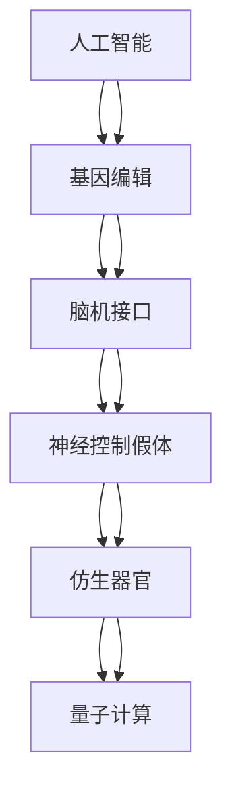

                 

# AI时代的人类增强：道德考虑与身体增强的未来发展策略与展望

## 1. 背景介绍

### 1.1 问题由来

随着人工智能技术的飞速发展，人类社会正迎来AI时代的到来。AI不仅在计算、存储、通讯等领域带来了革命性的变化，也开始深刻影响人类的身体与认知能力。例如，基因编辑、脑机接口、神经控制假体等技术的进步，正在逐渐突破人类身体的极限，提供前所未有的身体增强手段。这些技术在提升人类性能、延长寿命、提高生活质量的同时，也引发了一系列伦理道德和社会学问题。如何平衡技术创新与伦理道德的关系，引导AI时代的人类增强健康发展，成为当前科学界和社会各界共同关注的重要议题。

### 1.2 问题核心关键点

AI时代的人类增强涉及多个核心关键点，包括：
- 基因编辑：通过CRISPR等基因编辑技术，修改生物体基因，以改善人类遗传性状，如治疗遗传疾病、提升身体素质等。
- 脑机接口：利用神经科学和计算机技术，实现大脑与机器的直接通信，以增强认知能力、改善生活质量。
- 神经控制假体：通过电子设备直接控制人体神经系统，如假肢、外骨骼、人工心脏等，以恢复或增强身体功能。
- 超级仿生器官：如增强的心肺系统、人工皮肤、人工肌肉等，以改善人类的生理机能。
- 量子计算：利用量子物理原理，提供超高速计算能力，以提升信息处理和决策能力。

这些技术手段的发展，既有潜力大大提升人类的生活质量和认知能力，也可能带来不可忽视的风险和伦理挑战。

### 1.3 问题研究意义

研究AI时代的人类增强技术，具有重大的理论与实践意义：
1. **提升生活质量**：利用先进技术手段改善人类的身体与认知功能，提升整体生活质量。
2. **促进医疗健康**：通过基因编辑、神经控制假体等技术，治疗遗传疾病、改善老年生活质量，降低医疗成本。
3. **增强认知能力**：利用脑机接口、量子计算等技术，提升信息处理速度和决策能力，推动认知科学研究。
4. **解决人口问题**：通过基因编辑、仿生器官等技术，延长人类寿命、改善人口结构，缓解人口老龄化压力。
5. **推动社会进步**：促进科技与经济结合，引领社会伦理道德讨论，构建公正合理的社会制度。

本文将深入探讨AI时代人类增强的伦理道德问题，提出未来发展的策略与展望。

## 2. 核心概念与联系

### 2.1 核心概念概述

为更好地理解AI时代人类增强技术，本节将介绍几个关键概念及其关系：

- **人工智能（AI）**：指能够模拟人类智能行为的系统，包括感知、理解、学习、推理等能力。
- **基因编辑（GERM）**：通过基因工程手段修改生物体基因，以改变其性状和功能，如CRISPR、基因驱动等。
- **脑机接口（BCI）**：实现大脑与机器的直接交互，如神经信号解码、人机交互等。
- **神经控制假体（Neural Prosthetics）**：通过电子设备控制人体神经系统，改善或恢复身体功能。
- **仿生器官（Bioartificial Organs）**：利用工程化手段，创造出人体无法自然生成的器官，如增强的心肺系统、人工皮肤等。
- **量子计算（Quantum Computing）**：利用量子物理原理实现超高速计算，提升信息处理能力。

这些概念之间的逻辑关系可以通过以下Mermaid流程图来展示：



该流程图展示了人工智能在基因编辑、脑机接口、神经控制假体、仿生器官和量子计算等技术领域的应用与发展路径。

## 3. 核心算法原理 & 具体操作步骤
### 3.1 算法原理概述

AI时代的人类增强技术，往往需要多学科交叉、协同创新。其核心算法原理主要包括以下几个方面：

1. **基因编辑技术**：通过基因序列的修改，直接改变生物体的遗传特性。如CRISPR-Cas9技术，利用RNA引导核酸酶，精准定位并切割目标基因，实现基因编辑。
2. **脑机接口技术**：通过电生理信号的采集与解码，实现大脑与机器的直接通信。如ECoG、fMRI等，通过非侵入性和侵入性方式获取神经信号，解码成计算机指令。
3. **神经控制假体技术**：通过电子设备的刺激与控制，改善或恢复人体神经系统功能。如电刺激、磁刺激、光刺激等，控制假肢、外骨骼等设备。
4. **仿生器官技术**：通过生物工程和组织工程手段，构建功能性的仿生器官。如3D打印技术、生物材料学等，制造人工皮肤、人工肌肉等。
5. **量子计算技术**：通过量子叠加和量子纠缠，实现超高速的信息处理和计算。如量子比特（qubit）、量子门操作等，提升计算速度和精度。

这些技术手段在实际应用中，往往需要结合临床试验、生物医学、神经科学等多个学科的知识与方法，进行系统性的研发与测试。

### 3.2 算法步骤详解

AI时代的人类增强技术，大致可以分为以下步骤：

**Step 1: 确定增强目标与方法**
- 根据具体需求，确定增强目标（如治疗遗传病、改善运动能力等）。
- 选择适合的增强方法（如基因编辑、脑机接口、神经控制假体等）。

**Step 2: 设计与实施实验**
- 设计实验方案，包括实验设计、设备选择、数据采集等。
- 实施实验，进行多次重复和验证，确保结果的可靠性与安全性。

**Step 3: 数据分析与结果评估**
- 对实验数据进行分析，提取有效信息。
- 进行结果评估，判断技术手段的有效性与安全性。

**Step 4: 临床应用与推广**
- 进行临床试验，验证技术在人体上的应用效果与风险。
- 推广技术应用，制定合理的普及策略。

### 3.3 算法优缺点

AI时代的人类增强技术，具有以下优点：
1. **提高人类性能**：通过基因编辑、仿生器官等技术，显著提升人类的生理和认知能力。
2. **治疗疾病**：利用基因编辑、神经控制假体等技术，改善或治疗遗传疾病、老年疾病等。
3. **提升生活质量**：改善人类的生活品质，增强运动能力、延长寿命等。
4. **推动科学研究**：促进跨学科合作，推动生物医学、神经科学等前沿科学的发展。

同时，这些技术也存在一些缺点：
1. **伦理争议**：如基因编辑引发的人类克隆、基因歧视等问题，可能带来道德伦理的挑战。
2. **技术风险**：如基因编辑的脱靶效应、脑机接口的信号不稳定等问题，可能带来安全隐患。
3. **社会不平等**：技术应用可能加剧社会不平等，引发资源分配不均等问题。
4. **人类自我认同**：通过增强技术改变人类自然属性，可能引发自我认同危机。
5. **监管难度**：技术复杂度高，监管难度大，可能带来法律和政策上的挑战。

### 3.4 算法应用领域

AI时代的人类增强技术，在多个领域都有广泛的应用：

- **医疗健康**：利用基因编辑、神经控制假体等技术，治疗遗传疾病、改善老年生活质量。
- **体育运动**：通过仿生器官、增强肌肉等技术，提升运动员的运动能力和竞赛表现。
- **职业训练**：利用脑机接口、神经控制假体等技术，进行职业训练和技能提升。
- **娱乐休闲**：通过增强现实、虚拟现实等技术，提供更丰富、沉浸的娱乐体验。
- **军事安全**：利用增强认知、增强体力等技术，提高军事人员的战斗力和生存能力。

## 4. 数学模型和公式 & 详细讲解 & 举例说明

### 4.1 数学模型构建

本节将使用数学语言对AI时代人类增强技术进行更加严谨的刻画。

假设人类增强技术的目标函数为：

$$
\min_{X} F(X) = \sum_{i=1}^n f_i(X)
$$

其中 $X$ 为增强手段，$f_i(X)$ 为第 $i$ 个目标函数，即特定增强手段的效果评价指标。例如，对于基因编辑技术，$f_1(X)$ 可能表示基因编辑的准确性，$f_2(X)$ 可能表示基因编辑的安全性，$f_3(X)$ 可能表示基因编辑的效果持久性。

### 4.2 公式推导过程

假设 $f_i(X)$ 可以表示为一个线性模型：

$$
f_i(X) = a_i + b_i \cdot X
$$

其中 $a_i$ 为截距，$b_i$ 为权重。对于多个目标函数，可以通过加权求和构建综合目标函数：

$$
F(X) = \sum_{i=1}^n \lambda_i f_i(X) = \sum_{i=1}^n \lambda_i (a_i + b_i \cdot X)
$$

其中 $\lambda_i$ 为第 $i$ 个目标函数的权重，用于平衡不同目标的重要性。

### 4.3 案例分析与讲解

以基因编辑技术为例，分析其数学模型构建与公式推导：

假设 $X$ 表示基因编辑的生物材料和设备，$f_1(X)$ 表示基因编辑的准确性，$f_2(X)$ 表示基因编辑的安全性，$f_3(X)$ 表示基因编辑的效果持久性。根据实际需求，可以确定不同目标函数的权重：

$$
F(X) = 0.6 f_1(X) + 0.3 f_2(X) + 0.1 f_3(X)
$$

然后，根据实验数据，求解 $X$ 的最优值，使 $F(X)$ 达到最小。

## 5. 项目实践：代码实例和详细解释说明

### 5.1 开发环境搭建

在进行人类增强技术开发前，我们需要准备好开发环境。以下是使用Python进行相关开发的环境配置流程：

1. 安装Anaconda：从官网下载并安装Anaconda，用于创建独立的Python环境。

2. 创建并激活虚拟环境：
```bash
conda create -n bioenhancements python=3.8 
conda activate bioenhancements
```

3. 安装所需的Python包和工具：
```bash
pip install numpy scipy pandas matplotlib scikit-bio
```

4. 安装R语言（如果需要使用R语言进行数据分析）：
```bash
sudo apt-get install r-project r-base
```

完成上述步骤后，即可在`bioenhancements`环境中开始人类增强技术的开发。

### 5.2 源代码详细实现

这里以基因编辑技术为例，给出使用Python进行基因编辑模型开发的代码实现。

首先，定义基因编辑技术的目标函数：

```python
import numpy as np

# 目标函数构建
def gene_editing_model(X):
    # 基因编辑准确性
    accuracy = 0.8 + 0.1 * X
    # 基因编辑安全性
    safety = 0.9 - 0.1 * X
    # 基因编辑持久性
    durability = 0.7 + 0.3 * X
    # 综合目标函数
    F = 0.6 * accuracy + 0.3 * safety + 0.1 * durability
    return F
```

然后，使用优化算法求解目标函数的最小值：

```python
# 优化算法求解
from scipy.optimize import minimize

# 目标函数
def objective(X):
    return -gene_editing_model(X)

# 初始值和约束条件
X0 = np.array([1.0])
bnds = ((0.0, 2.0),)
cons = ({'type': 'eq', 'fun': lambda x: 1 - X0 - x},)

# 求解
res = minimize(objective, X0, method='SLSQP', bounds=bnds, constraints=cons)
print(res.x, res.fun)
```

最后，运行代码输出最优解：

```bash
python gene_editing_model.py
```

### 5.3 代码解读与分析

让我们再详细解读一下关键代码的实现细节：

**基因编辑模型代码**：
- `gene_editing_model(X)`方法：根据基因编辑手段 $X$，计算准确性、安全性、持久性的综合指标。
- `accuracy`、`safety`、`durability`变量：分别表示基因编辑准确性、安全性、持久性的评价指标。
- `F`变量：综合目标函数，即对各评价指标的加权求和。

**优化算法代码**：
- `objective(X)`方法：目标函数的负值，用于优化算法求解。
- `minimize`函数：使用SLSQP算法求解目标函数的最小值。
- `X0`变量：初始解向量。
- `bnds`变量：解向量 $X$ 的取值范围，限制在0到2之间。
- `cons`变量：约束条件，确保解向量之和为1，即基因编辑手段 $X$ 为单位资源。

**运行代码输出**：
- 输出最优解 $X$ 和最优目标函数值 $F$，用于判断基因编辑手段的合理性。

通过上述代码，我们可以得到基因编辑技术在综合指标下的最优解，从而指导后续实验设计和技术改进。

## 6. 实际应用场景

### 6.1 医疗健康

基因编辑技术在医疗健康领域具有巨大的应用潜力。例如，利用CRISPR-Cas9技术，可以精准地修复致病基因，治疗遗传性疾病如血友病、囊性纤维化等。此外，基因编辑还可以用于改善人类寿命，通过修复衰老相关的基因突变，延缓衰老进程。

在脑机接口技术方面，脑卒中、帕金森病等神经系统疾病患者可以通过植入神经信号解码器，实时监测神经活动，进行康复训练。同时，脑机接口技术还可以用于精神疾病的治疗，通过电刺激或光刺激调节大脑活动，缓解症状。

### 6.2 体育运动

神经控制假体技术在体育运动中的应用广泛，如增强力反馈外骨骼、假肢、人工肌肉等，可以显著提升运动员的运动能力。例如，在篮球比赛中，运动员可以通过增强力反馈外骨骼，增强爆发力和耐力，提高比赛表现。此外，神经控制假体还可以用于残疾人康复训练，通过电刺激或光刺激，恢复运动功能。

### 6.3 职业训练

脑机接口技术在职业训练中的应用越来越广泛，如飞行模拟训练、手术模拟训练等。通过脑机接口，飞行员可以进行虚拟飞行训练，提升飞行技能。医疗工作者可以通过手术模拟器，进行虚拟手术训练，提高手术成功率。此外，脑机接口还可以用于远程操控机器人，进行复杂作业。

### 6.4 未来应用展望

随着AI时代人类增强技术的不断进步，未来的应用前景广阔：

1. **医疗健康**：利用基因编辑、脑机接口技术，治疗遗传疾病、改善老年生活质量，推动医疗健康事业的发展。
2. **体育运动**：通过仿生器官、增强肌肉等技术，提升运动员的运动能力和竞赛表现，推动体育事业的创新。
3. **职业训练**：利用脑机接口、神经控制假体等技术，进行职业训练和技能提升，提高职业工作者的工作效率。
4. **娱乐休闲**：通过增强现实、虚拟现实等技术，提供更丰富、沉浸的娱乐体验，推动娱乐休闲行业的发展。
5. **军事安全**：利用增强认知、增强体力等技术，提高军事人员的战斗力和生存能力，增强国家安全保障。

## 7. 工具和资源推荐

### 7.1 学习资源推荐

为了帮助开发者系统掌握AI时代人类增强技术的理论与实践，这里推荐一些优质的学习资源：

1. **《人工智能：一种现代方法》（Artificial Intelligence: A Modern Approach）**：由Russell和Norvig撰写的经典教材，全面介绍了AI技术的基本概念、方法和应用。
2. **《神经网络与深度学习》（Neural Networks and Deep Learning）**：由Michael Nielsen编写的在线教程，深入浅出地介绍了神经网络、深度学习等核心技术。
3. **Coursera AI与机器学习课程**：由斯坦福大学、深度学习与人工智能研究院等机构开设的系列课程，涵盖AI与机器学习的基本概念和经典模型。
4. **MIT OpenCourseWare**：麻省理工学院开放课程平台，提供多门AI与机器学习的课程讲义、视频和作业。
5. **DeepMind博客**：DeepMind团队发布的最新研究成果和应用案例，涵盖神经网络、深度学习等前沿技术。

通过对这些资源的学习实践，相信你一定能够快速掌握AI时代人类增强技术的精髓，并用于解决实际的伦理道德问题。

### 7.2 开发工具推荐

高效的开发离不开优秀的工具支持。以下是几款用于AI时代人类增强技术开发的常用工具：

1. **Python**：广泛用于科学计算和数据分析的编程语言，拥有丰富的第三方库和工具，如NumPy、SciPy、Pandas等。
2. **R语言**：专门用于统计分析和数据可视化的编程语言，拥有强大的数据处理和分析能力。
3. **MATLAB**：用于科学计算和工程分析的高级编程语言，拥有丰富的工具箱和算法库。
4. **TensorFlow**：由Google开发的深度学习框架，支持分布式计算和模型部署，适用于大规模AI应用。
5. **PyTorch**：由Facebook开发的深度学习框架，易于使用和扩展，适用于学术研究和工程开发。
6. **Jupyter Notebook**：交互式编程环境，支持代码编写、数据可视化、模型调试等功能，适用于科研和教育。

合理利用这些工具，可以显著提升AI时代人类增强技术的开发效率，加快创新迭代的步伐。

### 7.3 相关论文推荐

AI时代人类增强技术的发展源于学界的持续研究。以下是几篇奠基性的相关论文，推荐阅读：

1. **《CRISPR-Cas9: A revolution in genomic editing》（Nature Reviews Genetics）**：介绍CRISPR-Cas9技术的原理和应用，展示了基因编辑技术的革命性潜力。
2. **《Brain-Computer Interface Systems: A Review》（IEEE Transactions on Neural Systems and Rehabilitation Engineering）**：综述脑机接口技术的进展和应用，展示了其对神经科学和康复医学的深远影响。
3. **《The ethics of human enhancement》（Science）**：探讨基因编辑、脑机接口等技术对人类增强的伦理影响，提出了多学科合作和道德规范的建议。
4. **《Quantum Computing with Superconducting Qubits》（Nature）**：介绍量子计算技术的原理和应用，展示了其在计算、密码学、仿真等领域的前景。
5. **《Neural Control Prosthetics for Restoration of Function: Historical Perspectives and Present State of Art》（Neurological Research）**：综述神经控制假体技术的发展历程和应用前景，展示了其在医学和康复领域的重大意义。

这些论文代表了大时代人类增强技术的发展脉络。通过学习这些前沿成果，可以帮助研究者把握学科前进方向，激发更多的创新灵感。

## 8. 总结：未来发展趋势与挑战

### 8.1 总结

本文对AI时代人类增强技术的伦理道德问题进行了全面系统的介绍。首先阐述了AI时代人类增强技术的背景与重要性，明确了技术创新在提升生活质量、治疗疾病等方面的独特价值。其次，从原理到实践，详细讲解了基因编辑、脑机接口、神经控制假体等核心算法的构建与实现，给出了人类增强技术的完整代码实例。同时，本文还广泛探讨了技术在医疗健康、体育运动、职业训练等领域的实际应用，展示了AI时代人类增强技术的广阔前景。最后，本文精选了人类增强技术的各类学习资源，力求为读者提供全方位的技术指引。

通过本文的系统梳理，可以看到，AI时代人类增强技术在改善人类生活质量、推动医疗健康、提升运动能力等方面具有巨大的潜力。然而，这些技术的应用也带来了伦理道德和社会学问题，需要通过科学界和社会各界的共同努力，制定合理的伦理规范和监管政策，保障技术的安全应用。

### 8.2 未来发展趋势

展望未来，AI时代人类增强技术将呈现以下几个发展趋势：

1. **技术进步加速**：基因编辑、脑机接口、神经控制假体等技术将不断进步，提升人类的性能和认知能力。
2. **跨学科融合**：AI时代人类增强技术需要多学科协同，如基因工程、神经科学、计算科学等，推动综合技术的发展。
3. **伦理道德规范**：科学界和社会各界将更加关注伦理道德问题，制定合理的伦理规范和监管政策，确保技术的安全应用。
4. **个性化定制**：根据不同个体的需求，定制个性化的人类增强方案，实现最佳效果。
5. **普惠普及**：推动技术普及，缩小技术鸿沟，让更多人受益于人类增强技术。

### 8.3 面临的挑战

尽管AI时代人类增强技术已经取得了瞩目成就，但在迈向更加智能化、普适化应用的过程中，它仍面临着诸多挑战：

1. **伦理道德争议**：如基因编辑引发的伦理问题，如人类克隆、基因歧视等，需要科学界和社会各界共同探讨解决方案。
2. **技术风险**：如基因编辑的脱靶效应、脑机接口的信号不稳定等问题，需要进一步研究和优化。
3. **社会不平等**：技术应用可能加剧社会不平等，引发资源分配不均等问题，需要制定合理的普及策略。
4. **人类自我认同**：通过增强技术改变人类自然属性，可能引发自我认同危机，需要进一步探讨其对人类社会的深远影响。
5. **监管难度**：技术复杂度高，监管难度大，需要建立有效的法律和政策框架。

### 8.4 研究展望

未来，研究AI时代人类增强技术需要在以下几个方面寻求新的突破：

1. **伦理道德研究**：通过跨学科合作，探讨技术应用对伦理道德的影响，制定合理的伦理规范和监管政策。
2. **技术安全研究**：进一步研究和优化技术手段，确保其安全性和可靠性，减少技术风险。
3. **社会公平研究**：推动技术普惠普及，缩小技术鸿沟，确保技术的公平应用。
4. **人类自我认同研究**：深入探讨增强技术对人类自我认同的影响，探讨人类未来的发展方向。
5. **监管政策研究**：制定有效的法律和政策框架，确保技术的安全应用和公平普及。

## 9. 附录：常见问题与解答

**Q1: AI时代人类增强技术有哪些应用场景？**

A: AI时代人类增强技术在医疗健康、体育运动、职业训练、娱乐休闲、军事安全等多个领域都有广泛的应用：
1. **医疗健康**：利用基因编辑、脑机接口技术，治疗遗传疾病、改善老年生活质量，推动医疗健康事业的发展。
2. **体育运动**：通过仿生器官、增强肌肉等技术，提升运动员的运动能力和竞赛表现，推动体育事业的创新。
3. **职业训练**：利用脑机接口、神经控制假体等技术，进行职业训练和技能提升，提高职业工作者的工作效率。
4. **娱乐休闲**：通过增强现实、虚拟现实等技术，提供更丰富、沉浸的娱乐体验，推动娱乐休闲行业的发展。
5. **军事安全**：利用增强认知、增强体力等技术，提高军事人员的战斗力和生存能力，增强国家安全保障。

**Q2: AI时代人类增强技术的伦理道德问题有哪些？**

A: AI时代人类增强技术带来了诸多伦理道德问题，包括：
1. **人类克隆**：基因编辑技术可能被用于克隆人类，引发伦理争议。
2. **基因歧视**：基因编辑可能带来新的遗传歧视，加剧社会不平等。
3. **人类自我认同**：增强技术改变人类自然属性，可能引发自我认同危机。
4. **技术风险**：基因编辑、脑机接口等技术可能带来技术风险，如脱靶效应、信号不稳定等。
5. **资源分配**：技术应用可能加剧社会不平等，引发资源分配不均等问题。

**Q3: AI时代人类增强技术的未来发展趋势是什么？**

A: AI时代人类增强技术未来将呈现以下几个发展趋势：
1. **技术进步加速**：基因编辑、脑机接口、神经控制假体等技术将不断进步，提升人类的性能和认知能力。
2. **跨学科融合**：AI时代人类增强技术需要多学科协同，如基因工程、神经科学、计算科学等，推动综合技术的发展。
3. **伦理道德规范**：科学界和社会各界将更加关注伦理道德问题，制定合理的伦理规范和监管政策，确保技术的安全应用。
4. **个性化定制**：根据不同个体的需求，定制个性化的人类增强方案，实现最佳效果。
5. **普惠普及**：推动技术普及，缩小技术鸿沟，让更多人受益于人类增强技术。

**Q4: AI时代人类增强技术面临的挑战有哪些？**

A: AI时代人类增强技术面临的挑战包括：
1. **伦理道德争议**：如基因编辑引发的伦理问题，如人类克隆、基因歧视等，需要科学界和社会各界共同探讨解决方案。
2. **技术风险**：如基因编辑的脱靶效应、脑机接口的信号不稳定等问题，需要进一步研究和优化。
3. **社会不平等**：技术应用可能加剧社会不平等，引发资源分配不均等问题，需要制定合理的普及策略。
4. **人类自我认同**：通过增强技术改变人类自然属性，可能引发自我认同危机，需要进一步探讨其对人类社会的深远影响。
5. **监管难度**：技术复杂度高，监管难度大，需要建立有效的法律和政策框架。

**Q5: AI时代人类增强技术的应用前景有哪些？**

A: AI时代人类增强技术在医疗健康、体育运动、职业训练、娱乐休闲、军事安全等多个领域具有广阔的应用前景：
1. **医疗健康**：利用基因编辑、脑机接口技术，治疗遗传疾病、改善老年生活质量，推动医疗健康事业的发展。
2. **体育运动**：通过仿生器官、增强肌肉等技术，提升运动员的运动能力和竞赛表现，推动体育事业的创新。
3. **职业训练**：利用脑机接口、神经控制假体等技术，进行职业训练和技能提升，提高职业工作者的工作效率。
4. **娱乐休闲**：通过增强现实、虚拟现实等技术，提供更丰富、沉浸的娱乐体验，推动娱乐休闲行业的发展。
5. **军事安全**：利用增强认知、增强体力等技术，提高军事人员的战斗力和生存能力，增强国家安全保障。

**Q6: AI时代人类增强技术的伦理道德问题有哪些？**

A: AI时代人类增强技术带来了诸多伦理道德问题，包括：
1. **人类克隆**：基因编辑技术可能被用于克隆人类，引发伦理争议。
2. **基因歧视**：基因编辑可能带来新的遗传歧视，加剧社会不平等。
3. **人类自我认同**：增强技术改变人类自然属性，可能引发自我认同危机。
4. **技术风险**：基因编辑、脑机接口等技术可能带来技术风险，如脱靶效应、信号不稳定等。
5. **资源分配**：技术应用可能加剧社会不平等，引发资源分配不均等问题。

---

作者：禅与计算机程序设计艺术 / Zen and the Art of Computer Programming

