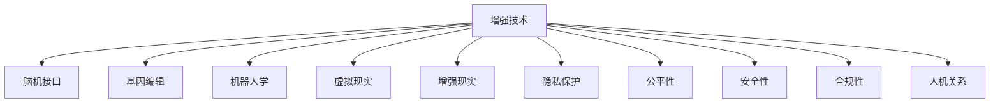

                 

# AI时代的人类增强：道德考虑与身体增强的未来发展策略展望

在AI技术飞速发展的今天，人们对于增强技术（Human Augmentation）的兴趣日益浓厚。从脑机接口到生物增强，从基因编辑到智能假肢，各种前沿技术不断涌现，为人类能力的提升提供了无限可能。然而，这些技术的应用并非没有问题，道德伦理的考量尤为重要。本文将从伦理、技术、社会三个维度，深入探讨AI时代人类增强的现状、挑战与未来发展策略。

## 1. 背景介绍

### 1.1 人类增强技术概述

人类增强技术旨在通过科技手段，提升人类的生理和心理能力。这些技术通常涉及生物工程、神经科学、机器人学、信息科学等多个领域。常见的增强技术包括但不限于：

- **神经接口技术**：利用脑机接口(Brain-Computer Interface, BCI)实现人脑与计算机的直接互动，如控制假肢、执行脑力劳动等。
- **生物增强技术**：通过基因编辑、纳米医疗、药物输送等方式，改善人类的生理健康，如增强肌肉力量、改善视力等。
- **认知增强技术**：通过智能工具、脑波刺激、药物等手段，提高人类的认知能力，如提升注意力、记忆力等。
- **机器人与虚拟现实（VR）技术**：通过机器人或虚拟现实环境，为人类提供更多交互方式和感官体验，如虚拟旅行、远程医疗等。

### 1.2 增强技术的伦理争议

随着增强技术的发展，伦理问题日益凸显。增强技术的伦理争议主要集中在以下几个方面：

- **隐私保护**：增强技术涉及大量个人数据，如何在数据收集和使用过程中保护隐私成为一大挑战。
- **公平性问题**：增强技术的应用可能加剧社会不平等，使得部分群体被排除在外。
- **安全性与合规性**：增强技术的安全性和合规性要求高，需确保其长期应用不会对人类健康造成损害。
- **人机关系**：增强技术对人类身份和自我认知的影响，以及与机器的关系如何界定，也是伦理争议的重要话题。

## 2. 核心概念与联系

### 2.1 核心概念概述

为更好地理解AI时代人类增强的伦理和技术问题，本节将介绍几个密切相关的核心概念：

- **增强技术（Human Augmentation）**：利用科技手段提升人类的能力，包括生理、认知、情感等方面。
- **脑机接口（Brain-Computer Interface, BCI）**：实现人脑与计算机的直接互动，用于控制假肢、增强认知等。
- **基因编辑（Gene Editing）**：通过CRISPR等技术修改人类基因，改善疾病、增强智力等。
- **机器人学（Robotics）**：研究如何设计和制造能够执行复杂任务的机器人，为人类提供辅助。
- **虚拟现实（Virtual Reality, VR）**：利用计算机生成的仿真环境，提供沉浸式体验。
- **增强现实（Augmented Reality, AR）**：在真实世界中添加数字信息，增强现实环境感知。
- **隐私保护（Privacy Protection）**：确保在增强技术应用中，个人数据的安全和隐私得到保障。
- **公平性（Equity）**：确保增强技术的应用不会加剧社会不平等，促进社会公平。
- **安全性（Safety）**：确保增强技术的应用不会对人类健康造成损害。
- **合规性（Compliance）**：确保增强技术的开发和应用符合法律法规。
- **人机关系（Human-Machine Relationship）**：探讨增强技术如何影响人类身份、自我认知以及与机器的关系。

这些概念之间的逻辑关系可以通过以下Mermaid流程图来展示：



这个流程图展示了一系列的增强技术及其相关概念，反映了增强技术的复杂性和多样性。

## 3. 核心算法原理 & 具体操作步骤

### 3.1 算法原理概述

增强技术的应用通常依赖于复杂的算法和数据处理。以脑机接口技术为例，其核心原理包括：

- **信号采集**：通过电极、磁共振成像等手段，采集大脑的电信号或生理信号。
- **信号预处理**：对采集到的信号进行滤波、降噪等预处理，提取有用的特征。
- **特征提取与分类**：利用机器学习算法，对提取到的特征进行分类，识别用户意图。
- **控制输出**：根据分类结果，控制外部设备（如假肢、虚拟环境）的动作。

### 3.2 算法步骤详解

脑机接口技术的应用步骤包括：

1. **信号采集**：在用户的大脑上安装电极，采集其电信号。
2. **信号预处理**：使用滤波器去除噪声，提取脑电信号中的有用信息。
3. **特征提取**：通过傅里叶变换、小波变换等方法，将脑电信号转换为特征向量。
4. **分类训练**：使用支持向量机(SVM)、神经网络等算法，训练分类器。
5. **控制输出**：根据分类器输出，控制假肢的动作或虚拟环境的交互。

### 3.3 算法优缺点

脑机接口技术的优点包括：

- **非侵入性**：相比侵入性手术，脑机接口技术对用户的伤害较小。
- **高精度**：脑电信号具有较高的分辨率，能够准确反映用户的意图。
- **实时性**：信号处理速度快，可以实时控制外部设备。

其缺点包括：

- **复杂性高**：需要高精度的信号采集设备和复杂的算法处理。
- **设备依赖**：依赖于高性能的硬件设备，限制了应用场景。
- **隐私风险**：涉及大量个人数据，存在隐私泄露的风险。

### 3.4 算法应用领域

脑机接口技术广泛应用于：

- **医疗康复**：通过控制假肢、机器人辅助康复，帮助肢体残障人士恢复日常生活能力。
- **辅助训练**：通过控制虚拟环境，帮助运动员进行模拟训练。
- **游戏娱乐**：通过控制虚拟角色，提供更加沉浸式的游戏体验。
- **人机交互**：通过控制计算机界面，实现更自然的人机交互方式。

## 4. 数学模型和公式 & 详细讲解 & 举例说明

### 4.1 数学模型构建

脑机接口技术的数学模型主要包括以下几个部分：

- **信号采集模型**：描述信号的采集过程，通常为线性模型。
- **信号预处理模型**：描述信号的滤波、降噪等处理步骤，包括傅里叶变换、小波变换等。
- **特征提取模型**：描述特征向量的提取过程，如PCA、ICA等。
- **分类模型**：描述分类器的训练过程，包括SVM、神经网络等。

### 4.2 公式推导过程

以神经网络分类器为例，其数学模型可以表示为：

$$
f(x; \theta) = \sigma(Wx + b)
$$

其中 $f(x; \theta)$ 为输出函数，$x$ 为输入特征向量，$W$ 和 $b$ 为神经网络的权重和偏置，$\sigma$ 为激活函数。

假设训练数据集为 $\{(x_i, y_i)\}_{i=1}^N$，其中 $y_i \in \{0,1\}$ 表示分类标签。分类器的损失函数通常为交叉熵损失：

$$
L(\theta) = -\frac{1}{N}\sum_{i=1}^N [y_i \log f(x_i; \theta) + (1-y_i) \log (1-f(x_i; \theta))]
$$

通过梯度下降算法优化损失函数：

$$
\theta \leftarrow \theta - \eta \nabla_{\theta} L(\theta)
$$

其中 $\eta$ 为学习率。

### 4.3 案例分析与讲解

以康复机器人为例，其数学模型可以表示为：

$$
\theta \leftarrow \theta - \eta \nabla_{\theta} \mathcal{L}(\theta)
$$

其中 $\mathcal{L}(\theta)$ 为模型在康复数据集上的损失函数。通过优化模型参数，使得机器人能够根据用户的脑电信号控制其动作。

## 5. 项目实践：代码实例和详细解释说明

### 5.1 开发环境搭建

开发脑机接口技术需要高性能的计算机和专门的设备。以下是使用Python进行开发的环境配置流程：

1. **安装Python**：下载并安装Python 3.x版本。
2. **安装脑电信号采集设备**：如Electrodes，用于采集脑电信号。
3. **安装信号处理库**：如MNE-Python，用于信号预处理和特征提取。
4. **安装机器学习库**：如Scikit-learn，用于训练分类器。
5. **安装虚拟环境**：如Anaconda，用于创建和管理开发环境。

### 5.2 源代码详细实现

以下是一个简化的脑机接口分类器实现示例：

```python
import numpy as np
from sklearn.datasets import make_classification
from sklearn.model_selection import train_test_split
from sklearn.svm import SVC
from sklearn.metrics import accuracy_score

# 生成模拟数据
X, y = make_classification(n_samples=1000, n_features=10, random_state=42)
X_train, X_test, y_train, y_test = train_test_split(X, y, test_size=0.2, random_state=42)

# 定义SVM分类器
svm = SVC(gamma='scale', C=1.0)

# 训练模型
svm.fit(X_train, y_train)

# 预测并评估
y_pred = svm.predict(X_test)
accuracy = accuracy_score(y_test, y_pred)
print(f"Accuracy: {accuracy:.2f}")
```

### 5.3 代码解读与分析

**SVM分类器**：
- 使用Scikit-learn库中的SVM分类器，并设置参数。
- SVM是一种常用的分类器，能够有效地处理高维数据。

**生成模拟数据**：
- 使用Scikit-learn库中的make_classification函数生成模拟数据，用于训练和测试。

**训练模型**：
- 将数据集划分为训练集和测试集，并使用train_test_split函数。
- 使用SVM分类器训练模型。

**预测并评估**：
- 使用训练好的模型对测试集进行预测，并计算预测准确率。

## 6. 实际应用场景

### 6.1 医疗康复

脑机接口技术在医疗康复中的应用，主要体现在假肢控制和康复训练方面。通过脑电信号控制假肢，可以大大提高肢体残障人士的生活质量。在康复训练中，通过虚拟环境模拟复杂的动作，可以帮助康复患者更快地恢复。

### 6.2 游戏娱乐

脑机接口技术在游戏娱乐中的应用，主要体现在控制虚拟角色和环境方面。玩家可以通过脑电信号控制游戏中的角色，实现更加沉浸式的游戏体验。在虚拟现实中，脑机接口技术可以实现更加自然的人机交互。

### 6.3 人机交互

脑机接口技术在人机交互中的应用，主要体现在控制计算机界面方面。通过脑电信号控制鼠标、键盘等输入设备，可以实现更加自然、高效的人机交互。在辅助训练和辅助教学中，脑机接口技术也可以提供更加沉浸式的学习体验。

## 7. 工具和资源推荐

### 7.1 学习资源推荐

为了帮助开发者系统掌握脑机接口技术的理论基础和实践技巧，这里推荐一些优质的学习资源：

1. **《脑机接口技术》**：深入介绍脑机接口技术的原理、算法和应用。
2. **《神经科学与脑机接口》**：涵盖神经科学和脑机接口技术的最新进展。
3. **《Python脑机接口编程》**：详细介绍如何使用Python实现脑机接口技术。
4. **在线课程**：Coursera、edX等平台上的脑机接口相关课程，如MIT的《Brain-Computer Interfaces》。

### 7.2 开发工具推荐

高效的开发离不开优秀的工具支持。以下是几款用于脑机接口开发的常用工具：

1. **Python**：易于学习和使用，是脑机接口技术开发的主流语言。
2. **MNE-Python**：用于脑电信号预处理和特征提取。
3. **Scikit-learn**：用于机器学习和分类任务。
4. **OpenBCI**：开源的脑电信号采集设备。
5. **Neurogamer**：开源的游戏开发框架，支持脑电信号控制。

### 7.3 相关论文推荐

脑机接口技术的发展源于学界的持续研究。以下是几篇奠基性的相关论文，推荐阅读：

1. **《人类大脑信息与计算机信息交互》**：介绍脑机接口技术的原理和应用。
2. **《脑电信号特征提取与分类》**：详细介绍脑电信号的预处理和特征提取方法。
3. **《深度学习在脑机接口中的应用》**：探讨深度学习在脑机接口中的应用。

## 8. 总结：未来发展趋势与挑战

### 8.1 研究成果总结

脑机接口技术在AI时代的应用前景广阔，但其伦理和技术挑战也不容忽视。本文从伦理、技术、社会三个维度，深入探讨了脑机接口技术的现状、挑战与未来发展策略。通过系统的理论分析与实践指导，为开发者提供了全面的参考。

### 8.2 未来发展趋势

展望未来，脑机接口技术将呈现以下几个发展趋势：

1. **非侵入性技术普及**：非侵入性脑机接口技术，如EEG、fMRI等，将逐渐普及，降低应用成本。
2. **多模态融合**：结合视觉、听觉等多种传感信息，实现更加全面和准确的数据采集。
3. **实时性提升**：通过优化算法和硬件设备，提升脑机接口的实时性，实现更加自然的交互。
4. **安全性保障**：在数据采集和传输过程中，采用加密和匿名化技术，保障数据安全。
5. **伦理规范完善**：在技术应用过程中，建立伦理规范，确保技术应用的公正性和安全性。
6. **用户界面优化**：优化脑机接口的用户界面，提高用户体验和接受度。

### 8.3 面临的挑战

尽管脑机接口技术的发展前景广阔，但在迈向大规模应用的过程中，仍面临以下挑战：

1. **信号采集精度**：提高信号采集的精度和稳定性，降低噪声干扰。
2. **算法优化**：优化特征提取和分类算法，提升模型的准确率和鲁棒性。
3. **用户接受度**：提升用户对脑机接口技术的接受度，降低心理和生理上的抵触感。
4. **伦理规范**：制定伦理规范，确保技术应用的合法性和道德性。
5. **社会公平**：确保脑机接口技术的应用不会加剧社会不平等，促进社会公平。

### 8.4 研究展望

未来的研究需要在以下几个方面寻求新的突破：

1. **数据融合与处理**：研究如何融合多种传感器数据，提高数据采集的全面性和准确性。
2. **算法创新**：研究新的特征提取和分类算法，提升模型的性能和鲁棒性。
3. **人机协同**：研究如何实现人机协同工作，提高脑机接口技术的实用性和可扩展性。
4. **伦理与法律**：研究脑机接口技术的伦理与法律问题，制定相应的规范和标准。
5. **社会应用**：研究脑机接口技术在社会各个领域的应用，推动技术落地。

这些研究方向的探索，必将引领脑机接口技术迈向更高的台阶，为构建更加智能、安全、公平的社会奠定坚实基础。

## 9. 附录：常见问题与解答

**Q1：脑机接口技术目前有哪些应用场景？**

A: 脑机接口技术目前的应用场景包括但不限于：

- **医疗康复**：通过控制假肢、机器人辅助康复，帮助肢体残障人士恢复日常生活能力。
- **辅助训练**：通过控制虚拟环境，帮助运动员进行模拟训练。
- **游戏娱乐**：通过控制虚拟角色，提供更加沉浸式的游戏体验。
- **人机交互**：通过控制计算机界面，实现更加自然、高效的人机交互。

**Q2：脑机接口技术存在哪些伦理争议？**

A: 脑机接口技术存在的伦理争议主要包括：

- **隐私保护**：涉及大量个人数据，存在隐私泄露的风险。
- **公平性问题**：技术的应用可能加剧社会不平等，使得部分群体被排除在外。
- **安全性与合规性**：需确保其长期应用不会对人类健康造成损害。
- **人机关系**：对人类身份和自我认知的影响，以及与机器的关系如何界定。

**Q3：脑机接口技术的未来发展方向是什么？**

A: 脑机接口技术的未来发展方向包括：

- **非侵入性技术普及**：降低应用成本。
- **多模态融合**：结合视觉、听觉等多种传感信息。
- **实时性提升**：优化算法和硬件设备，提升实时性。
- **安全性保障**：采用加密和匿名化技术，保障数据安全。
- **伦理规范完善**：制定伦理规范，确保技术应用的合法性和道德性。

**Q4：脑机接口技术的开发过程中，需要注意哪些问题？**

A: 脑机接口技术的开发过程中，需要注意以下问题：

- **信号采集精度**：提高信号采集的精度和稳定性。
- **算法优化**：优化特征提取和分类算法。
- **用户接受度**：提升用户对技术的接受度。
- **伦理规范**：制定伦理规范，确保技术应用的合法性和道德性。

**Q5：脑机接口技术在社会各个领域的应用前景是什么？**

A: 脑机接口技术在社会各个领域的应用前景包括：

- **医疗康复**：通过控制假肢、机器人辅助康复，提高生活质量。
- **游戏娱乐**：提供更加沉浸式的游戏体验。
- **人机交互**：实现更加自然、高效的人机交互。

---

作者：禅与计算机程序设计艺术 / Zen and the Art of Computer Programming

