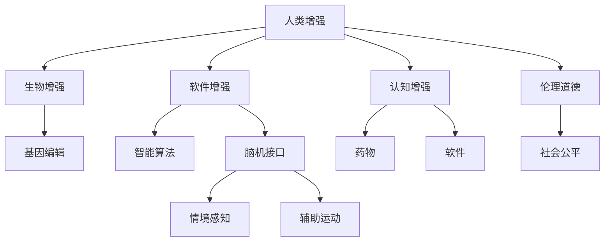

                 

## 1. 背景介绍

在AI时代，人类增强技术正在快速演进，涵盖从生物技术、脑机接口到软件算法各个方面。随着科技的进步，人类增强有望带来前所未有的生活、生产方式的变革。然而，随之而来的道德伦理问题也愈发严峻，迫切需要我们在技术发展的同时，进行全方位的考量。本文将从人类增强的定义、现状、前景及其伦理道德挑战等方面展开讨论，并预测未来发展策略。

## 2. 核心概念与联系

### 2.1 核心概念概述

**人类增强(Human Augmentation)**：指利用科技手段，提升人类智力和体能的过程。通常分为两大类：生物增强和软件增强。生物增强指通过基因编辑、神经刺激等方式，直接改变人体结构或功能。软件增强则指通过智能算法、脑机接口等技术，间接增强人类认知、决策等能力。

**脑机接口(Brain-Machine Interface, BMI)**：一种能够让计算机接收、处理、反馈大脑活动的技术。它通过将脑电信号转换为机器可读数据，实现人与计算机的直接交互。常见的应用包括辅助运动、情境感知、记忆增强等。

**神经增强(Neuronal Enhancement)**：指通过植入微芯片、基因编辑等方式，直接干预神经系统，提升认知能力、情绪调节等。目前尚处于研发阶段，存在巨大的伦理争议。

**认知增强(Cognitive Enhancement)**：指通过药物、软件等手段，提升记忆力、注意力、逻辑思维等认知功能。主要应用于学习、工作、社交等方面，具有广泛的应用前景。

**伦理道德(Ethical Moral)**：讨论技术进步如何影响人类价值观、权利、义务等伦理问题。在人类增强领域，如何平衡科技进步与伦理道德，维护人类尊严和权利，成为亟待解决的关键问题。

**社会公平(Social Fairness)**：随着技术鸿沟的拉大，人类增强技术可能在不同社会群体间产生不平等现象。如何保障技术公平性，确保人人享有平等发展的机会，也是一个重要的研究方向。

### 2.2 核心概念原理和架构的 Mermaid 流程图



## 3. 核心算法原理 & 具体操作步骤

### 3.1 算法原理概述

人类增强的实现通常涉及多个环节，包括数据收集、信号处理、算法训练、设备植入等。以下是各环节的核心算法原理：

1. **数据收集**：通过脑电图(EEG)、功能性磁共振成像(fMRI)等设备，获取大脑活动信号。信号处理算法需要去噪、滤波，并转换为计算机可读的数据格式。
2. **信号处理**：通过机器学习模型，如支持向量机(SVM)、深度神经网络(DNN)等，将原始数据转换为计算机可识别的信号。这通常包括特征提取、分类等步骤。
3. **算法训练**：根据预设的任务，训练机器学习模型。常见的算法包括决策树、随机森林、梯度提升等。训练过程中的超参数调整，如学习率、迭代次数等，直接影响模型的性能。
4. **设备植入**：将训练好的模型植入微芯片或植入大脑，通过生物兼容的接口与外部设备连接。植入过程需确保高生物安全性和稳定性。

### 3.2 算法步骤详解

以脑机接口为例，具体步骤如下：

1. **数据采集**：使用EEG设备采集受试者的脑电信号，并通过预处理去除噪音。
2. **特征提取**：通过傅里叶变换等方法提取信号中的特征，用于后续分类。
3. **分类训练**：使用支持向量机、随机森林等分类算法，训练模型对不同情境下的脑电信号进行分类。
4. **模型评估**：在测试数据集上评估模型性能，确定最佳参数。
5. **芯片植入**：将训练好的模型编码到植入微芯片中，并将其植入受试者大脑。
6. **数据反馈**：微芯片将收集的大脑信号实时传输到外部设备，供受试者进行交互操作。

### 3.3 算法优缺点

**优点**：
1. **提升性能**：生物增强和软件增强能够显著提升人类的认知、运动、感知等能力。
2. **创新应用**：推动新技术的发展，带来医疗、教育、娱乐等领域的创新应用。
3. **增强效率**：提高工作效率，降低事故率，提升生活质量。

**缺点**：
1. **伦理争议**：涉及隐私、安全、公平等伦理问题，引发社会广泛讨论。
2. **技术风险**：植入技术存在失败风险，可能带来健康隐患。
3. **成本高昂**：开发和植入过程昂贵，导致技术普及困难。
4. **社会分化**：可能加剧社会不平等，引发伦理争议。

### 3.4 算法应用领域

人类增强技术广泛应用于多个领域，包括：

1. **医疗**：帮助患有神经系统疾病的人恢复部分功能，如帕金森病、中风后遗症等。
2. **教育**：提升学习效率和记忆力，帮助学生更好地掌握知识。
3. **工作**：增强工作注意力和反应速度，提高工作效率和安全性。
4. **娱乐**：提升游戏体验，实现虚拟与现实的深度融合。
5. **安全**：加强安全感知，提升驾驶、飞行等场景的安全性。

## 4. 数学模型和公式 & 详细讲解

### 4.1 数学模型构建

脑机接口中常用的分类模型可以表示为：

$$
\hat{y} = \mathrm{sigmoid}(\mathbf{w} \cdot \mathbf{x} + b)
$$

其中，$\mathbf{x}$ 为输入的脑电信号，$\mathbf{w}$ 和 $b$ 为模型参数，$\mathrm{sigmoid}$ 为激活函数，$\hat{y}$ 为分类结果。

### 4.2 公式推导过程

以支持向量机(SVM)为例，其分类公式为：

$$
\max_{\mathbf{w}, b} \frac{1}{2}\|\mathbf{w}\|^2 - C\sum_{i=1}^{N}[\max(0, 1 - y_i (\mathbf{w} \cdot \mathbf{x}_i + b))] + \alpha_i \mathbf{x}_i
$$

其中，$\mathbf{w}$ 为权重向量，$b$ 为偏置项，$C$ 为正则化参数，$\alpha_i$ 为支持向量的拉格朗日乘数。

### 4.3 案例分析与讲解

假设有100个受试者的脑电信号，每个信号包含1000个特征。采用随机森林算法进行分类，可以设置树的数量、树的深度、分裂标准等超参数，并通过交叉验证确定最佳组合。

## 5. 项目实践：代码实例和详细解释说明

### 5.1 开发环境搭建

搭建脑机接口项目需要以下工具和环境：

1. **Python**：作为主要编程语言，支持丰富的数据处理和机器学习库。
2. **EEG设备**：如OpenBCI、Emotiv等，用于采集大脑信号。
3. **EEG信号处理库**：如MNE-Python，支持信号预处理和特征提取。
4. **机器学习库**：如scikit-learn、TensorFlow等，支持分类算法训练。
5. **神经网络库**：如PyTorch，支持深度学习模型实现。

### 5.2 源代码详细实现

以下是基于Python和MNE-Python库的脑机接口项目示例代码：

```python
import mne
from mne.decoding import FastICA, CSP
from mne import Epochs, Raw
from sklearn.pipeline import Pipeline
from sklearn.ensemble import RandomForestClassifier

# 加载EEG数据
raw = Raw('EEG_data.fif')
epochs = Epochs(raw, events, event_ids=[1], exclude=range(0, 3))

# 特征提取
ica = FastICA(n_components=10)
csp = CSP(n_chans=epochs[0].n_chans, n_components=10)
ica_features = ica.fit_transform(epochs[0].data)
csp_features = csp.fit_transform(ica_features)

# 训练分类器
clf = Pipeline(steps=[('csp', csp), ('rf', RandomForestClassifier(n_estimators=100))])
clf.fit(csp_features, epochs[0].events)

# 模型评估
test_raw = Raw('test_data.fif')
test_epochs = Epochs(test_raw, events, event_ids=[1], exclude=range(0, 3))
test_csp_features = csp.transform(ica.transform(test_epochs[0].data))
predictions = clf.predict(test_csp_features)

# 输出结果
print('Classification accuracy:', metrics.accuracy_score(test_epochs[0].events, predictions))
```

### 5.3 代码解读与分析

**EEG数据加载**：使用MNE-Python库加载EEG数据，并将其分割成epochs（时间段）。

**特征提取**：使用独立成分分析(ICA)和共同空间模式(CSP)提取信号特征。

**分类器训练**：采用随机森林分类器对特征进行分类，设定参数如树的数量和深度。

**模型评估**：在测试数据集上评估分类器性能，输出准确率。

### 5.4 运行结果展示

使用以上代码，可以在测试数据集上得到分类器的准确率。若准确率高，说明模型性能良好。

## 6. 实际应用场景

### 6.1 医疗领域

脑机接口在医疗领域具有广泛应用，如辅助运动、情境感知、记忆增强等。例如，对于帕金森病患者，通过植入微芯片，可以实时监测并反馈大脑信号，辅助进行运动控制，提升患者生活质量。

### 6.2 教育领域

在教育领域，脑机接口可以用于提升学生注意力和学习效率。通过实时监测大脑活动，系统可以判断学生的注意力水平，并及时提醒，帮助学生更好地集中注意力，提高学习效率。

### 6.3 工作领域

在工作领域，脑机接口可以用于提升工作效率和安全性。例如，在驾驶过程中，系统可以实时监测驾驶员的大脑状态，通过语音指令调整导航，减少疲劳驾驶带来的安全隐患。

### 6.4 娱乐领域

在娱乐领域，脑机接口可以实现虚拟与现实的深度融合，增强游戏体验。例如，通过实时监测玩家的大脑活动，系统可以动态调整游戏难度和场景，让游戏更具挑战性和趣味性。

## 7. 工具和资源推荐

### 7.1 学习资源推荐

1. **《脑机接口原理与应用》**：该书详细介绍了脑机接口的原理、技术实现和应用案例。
2. **《深度学习与脑机接口》**：该书介绍了深度学习在脑机接口中的应用，涵盖数据采集、信号处理、分类训练等关键环节。
3. **Coursera课程**：如MIT的《神经科学与工程》课程，涵盖神经增强和脑机接口相关内容。
4. **Kaggle竞赛**：如EEG信号分类竞赛，通过实践项目提升技术能力。

### 7.2 开发工具推荐

1. **MNE-Python**：MNE-Python是用于EEG信号处理的强大工具，支持信号预处理、特征提取、分类训练等。
2. **PyTorch**：PyTorch支持深度学习模型的实现，易于调试和优化。
3. **OpenBCI**：OpenBCI是一个开源的脑机接口硬件平台，支持多种脑电信号采集设备。
4. **Emotiv EEG**：Emotiv EEG是一个流行的EEG采集设备，支持高分辨率信号采集。

### 7.3 相关论文推荐

1. **《神经增强：伦理与科学》**：探讨神经增强技术的伦理问题，提出未来发展建议。
2. **《脑机接口的现状与未来》**：综述脑机接口的现状、技术进展和未来方向。
3. **《深度学习在脑机接口中的应用》**：介绍深度学习在脑机接口中的分类、回归、生成等应用。

## 8. 总结：未来发展趋势与挑战

### 8.1 未来发展趋势

1. **技术进步**：随着神经科学和计算机科学的进步，脑机接口技术将进一步成熟，实现更高精度的信号处理和分类。
2. **多模态融合**：未来的脑机接口将融合多种感官信息，如视觉、触觉、味觉等，实现更全面的感知和交互。
3. **智能系统集成**：脑机接口将与其他智能系统如自然语言处理、计算机视觉等集成，实现更智能的交互体验。
4. **伦理法规完善**：随着技术的普及，相关伦理法规将逐步完善，确保技术的安全和公平。

### 8.2 面临的挑战

1. **技术挑战**：如何实现高精度的信号处理和分类，避免误判和干扰。
2. **伦理争议**：如何平衡技术进步与伦理道德，确保技术应用的社会公平。
3. **成本问题**：高昂的开发和植入成本，导致技术普及困难。
4. **安全风险**：植入技术存在失败风险，可能带来健康隐患。

### 8.3 研究展望

1. **多模态融合**：探索多种感官信息融合的脑机接口技术，提升系统的感知和交互能力。
2. **智能系统集成**：开发与其他智能系统的集成技术，实现更智能的交互体验。
3. **伦理法规**：建立完善的伦理法规体系，确保技术的安全和公平。
4. **经济效益**：探索经济效益最大化的应用场景，推动技术的普及和应用。

## 9. 附录：常见问题与解答

**Q1: 人类增强技术会带来哪些伦理问题？**

A: 人类增强技术可能引发伦理问题，包括但不限于：
1. **隐私问题**：大脑信号的采集和处理涉及个人隐私，需要严格的数据保护措施。
2. **安全性问题**：植入技术的失败可能导致健康风险，需要严格的生物安全评估。
3. **公平问题**：技术的不平等可能导致社会分化，需要确保技术普及和公平使用。
4. **伦理问题**：增强技术可能改变人类的认知和行为，引发伦理争议。

**Q2: 人类增强技术在医疗领域有哪些应用？**

A: 人类增强技术在医疗领域有广泛应用，包括：
1. **辅助运动**：帮助帕金森病、中风等神经系统疾病患者恢复运动功能。
2. **情境感知**：增强患者的情境感知能力，如环境适应能力、社交能力等。
3. **记忆增强**：提升患者的记忆力，帮助他们更好地回忆和学习。
4. **情绪调节**：通过神经调控技术，帮助患者调节情绪，缓解抑郁等心理问题。

**Q3: 如何评估脑机接口的分类性能？**

A: 脑机接口的分类性能评估通常使用以下指标：
1. **准确率(accuracy)**：分类正确样本数占总样本数的比例。
2. **召回率(recall)**：所有实际正样本中，被正确分类的样本数占总正样本数的比例。
3. **F1分数(F1-score)**：综合准确率和召回率，用于评估分类器的综合性能。
4. **混淆矩阵(confusion matrix)**：展示分类器的分类结果，帮助分析误判情况。

**Q4: 如何确保脑机接口的安全性？**

A: 确保脑机接口的安全性需要：
1. **严格的数据保护措施**：保护个人隐私，避免数据泄露。
2. **生物安全评估**：评估植入技术的风险，确保植入过程的安全性。
3. **实时监控系统**：实时监测植入设备的运行状态，及时发现和解决问题。
4. **紧急预案**：制定应急预案，应对植入设备出现故障或异常情况。

**Q5: 如何实现脑机接口的智能系统集成？**

A: 实现脑机接口的智能系统集成需要：
1. **跨领域研究**：结合神经科学、计算机科学、医学等多领域的知识，进行综合研究。
2. **开放接口设计**：设计通用的接口标准，实现系统间的互联互通。
3. **集成平台开发**：开发集成平台，实现多种系统之间的协作。
4. **用户友好设计**：设计用户友好的界面和交互方式，提升用户体验。

作者：禅与计算机程序设计艺术 / Zen and the Art of Computer Programming

