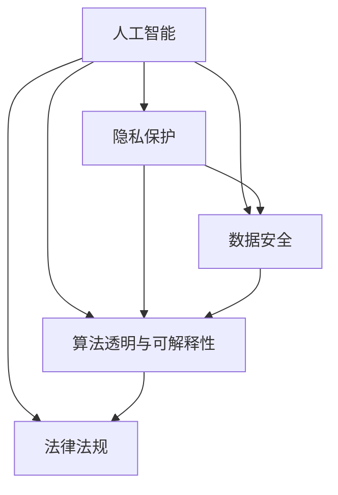

                 

# AI时代的人类计算：隐私和安全问题

> 关键词：人工智能, 隐私保护, 安全问题, 数据泄露, 计算隐私

## 1. 背景介绍

### 1.1 问题由来
随着人工智能技术的飞速发展，大数据的爆发式增长，人类计算从传统的物理硬件计算，逐渐转向了基于云计算的分布式计算，即所谓的"人类计算"。在AI时代，计算能力的大幅提升和数据资源的广泛积累，为人工智能技术的发展提供了强大的动力。然而，伴随着这一过程，隐私和安全问题也随之而来，成为了AI时代人类计算面临的重要挑战。

在人工智能的语境下，隐私通常指个人或组织的敏感信息，如身份、位置、行为习惯、偏好等，这些信息往往具有较高的经济、社会价值，同时，如果被滥用或泄露，也会对个人和组织带来潜在的风险和损失。而安全问题则涵盖了信息被未经授权访问、篡改、破坏等各类威胁。

隐私和安全问题的复杂性在于，它们不仅涉及到技术层面，还与法律、伦理、社会规范等方面紧密相关。例如，如何界定数据的收集和使用范围？在满足特定目的的同时，如何保护数据主体的知情权和选择权？如何在AI算法的决策过程中，避免基于偏见的数据和算法歧视？这些问题都需要跨领域的综合考量。

### 1.2 问题核心关键点
当前，AI时代的人类计算在隐私和安全方面面临着以下几个核心问题：

- **数据收集与隐私权**：如何平衡数据收集和隐私保护，确保数据的合法、正当使用。
- **算法透明与可解释性**：如何确保AI算法的决策过程透明、可解释，避免"黑箱"决策。
- **数据处理与安全性**：如何防止数据在传输、存储、处理过程中的泄露、篡改、破坏。
- **法规与道德**：如何制定和遵守相应的法律法规，建立伦理道德标准，确保技术应用的公正性和普适性。

这些问题不仅影响着人工智能技术的发展和应用，还关系到社会稳定和公民权益，是AI时代人类计算面临的重大挑战。

## 2. 核心概念与联系

### 2.1 核心概念概述

为了更好地理解AI时代隐私和安全问题，本节将介绍几个密切相关的核心概念：

- **人工智能**：以数据为基础，通过训练算法模型，实现自动化决策和智能任务处理的系统。
- **隐私保护**：确保个人信息在收集、存储、处理和使用过程中的安全，保护数据主体的知情权和选择权。
- **数据安全**：指数据在传输、存储、处理过程中，防止泄露、篡改、破坏等安全威胁。
- **算法透明与可解释性**：指AI算法的工作机制、决策依据等应该透明，并且可以由用户理解和解释。
- **法律法规**：包括数据保护法、隐私法、反歧视法等一系列法律法规，对数据收集和使用行为进行规范。

这些概念之间的逻辑关系可以通过以下Mermaid流程图来展示：



这个流程图展示了人工智能与隐私、安全、透明、法律之间的关系：

1. 人工智能依赖数据进行训练和推理，涉及数据收集和处理。
2. 隐私保护和数据安全确保数据在收集和处理过程中的安全。
3. 算法透明和可解释性确保人工智能的决策过程可以被用户理解和信任。
4. 法律法规为人工智能的数据使用和算法行为提供了规范和约束。

## 3. 核心算法原理 & 具体操作步骤
### 3.1 算法原理概述

人工智能算法在隐私和安全方面的设计和优化，通常依赖于以下几个关键原理：

- **差分隐私**：通过引入噪声，使得单个样本的输出无法被逆推回原始数据，从而保护隐私。
- **联邦学习**：通过分散在多个设备上的模型参数更新，而不是集中训练，实现数据不出本地，同时提升模型性能。
- **同态加密**：一种加密方法，允许在加密状态下对数据进行计算，结果解密后仍保持安全，从而保护数据安全。
- **对抗训练**：在训练过程中引入对抗样本，提升模型对噪声和攻击的鲁棒性，增强数据安全。
- **差分隐私**：通过在数据上添加随机噪声，使得个体数据的贡献变得不可区分，从而保护隐私。

### 3.2 算法步骤详解

基于隐私和安全的核心算法原理，人工智能的隐私保护和安全问题通常可以分为以下几个步骤：

**Step 1: 数据收集与预处理**
- 在数据收集阶段，采取匿名化、脱敏化等技术手段，确保数据不会泄露个体身份信息。
- 在数据预处理阶段，应用差分隐私技术，通过在数据上添加噪声，保证单个样本的输出无法回溯到原始数据。

**Step 2: 模型训练与优化**
- 在模型训练阶段，使用同态加密等技术，确保数据在加密状态下进行计算，保护数据安全。
- 在模型优化阶段，引入对抗训练，提升模型对抗噪声和攻击的能力，增强数据安全。
- 在模型部署阶段，应用联邦学习等技术，确保模型参数不在集中服务器上保存，保护数据隐私。

**Step 3: 结果输出与后处理**
- 在结果输出阶段，保证AI算法的工作机制透明、可解释，使用户能够理解和信任模型决策。
- 在后处理阶段，通过数据去识别化、差分隐私等技术手段，进一步保护模型输出的隐私。

### 3.3 算法优缺点

基于隐私和安全的核心算法原理，人工智能在隐私和安全方面的设计和优化，具有以下优缺点：

**优点：**

1. **数据隐私保护**：通过差分隐私等技术，有效保护数据隐私，防止数据泄露和滥用。
2. **数据安全性增强**：同态加密、联邦学习等技术，确保数据在传输、存储、处理过程中的安全。
3. **模型鲁棒性提升**：对抗训练等技术，提升模型对抗噪声和攻击的能力。
4. **算法透明性**：差分隐私、联邦学习等技术，使得算法决策过程透明、可解释，增强用户信任。

**缺点：**

1. **计算成本较高**：差分隐私、同态加密等技术，需要额外的计算资源和处理时间，增加了算法复杂度。
2. **模型性能损失**：对抗训练等技术，在保护数据安全的同时，可能对模型性能产生一定影响。
3. **法律法规和标准不一**：不同国家和地区对于隐私保护和数据安全的法律法规不同，增加了技术应用的复杂性。
4. **技术落地难度大**：如何将隐私和安全技术有效集成到实际应用中，仍需进行大量的技术研发和工程实践。

### 3.4 算法应用领域

基于隐私和安全的核心算法原理，人工智能在隐私和安全方面的应用，已经广泛应用于多个领域，如：

- **金融科技**：在金融交易、信用评估、风险控制等领域，保护客户隐私和数据安全。
- **医疗健康**：在电子病历、基因数据、医疗影像等领域，保护患者隐私和数据安全。
- **智能城市**：在交通管理、环境监测、公共安全等领域，保护城市居民隐私和数据安全。
- **智能制造**：在工业数据、设备监测、生产控制等领域，保护企业数据隐私和生产安全。
- **社交网络**：在用户行为分析、广告推荐、社交关系等领域，保护用户隐私和数据安全。

此外，基于隐私和安全的核心算法原理，人工智能在隐私和安全方面的应用，还在不断拓展，涵盖了更多新兴领域，如物联网、自动驾驶、智能家居等，为社会带来了更多便利和效益。

## 4. 数学模型和公式 & 详细讲解 & 举例说明

### 4.1 数学模型构建

为了更好地理解AI时代隐私和安全问题的数学原理，本节将使用数学语言对相关问题进行严格刻画。

假设有一个包含 $n$ 个样本的数据集 $\mathcal{D}=\{(x_i,y_i)\}_{i=1}^n$，其中 $x_i \in \mathcal{X}$，$y_i \in \mathcal{Y}$。假设 $\mathcal{A}$ 为训练模型使用的算法，目标函数为 $f(\mathcal{D})$，代表模型在数据集 $\mathcal{D}$ 上的性能指标。

定义隐私保护的目标为 $P(D)$，数据安全的目标为 $S(D)$，算法透明与可解释性的目标为 $T(D)$，法律法规的约束为 $L(D)$。隐私保护的目标函数可以表示为：

$$
P(D) = \frac{1}{\epsilon} \log \frac{1}{\delta}
$$

其中 $\epsilon$ 为差分隐私的隐私参数，$\delta$ 为错误概率。

数据安全的目标函数可以表示为：

$$
S(D) = \sum_{i=1}^n \log |D_i|
$$

其中 $D_i$ 为数据集 $\mathcal{D}$ 在加密下的计算结果。

算法透明与可解释性的目标函数可以表示为：

$$
T(D) = \sum_{i=1}^n \log |\mathcal{A}(x_i)| + \log |f(\mathcal{A}(x_i))|
$$

其中 $\mathcal{A}(x_i)$ 为算法在输入 $x_i$ 下的输出，$f(\mathcal{A}(x_i))$ 为模型在输入 $x_i$ 下的输出。

法律法规的约束可以表示为：

$$
L(D) = \sum_{i=1}^n \log \frac{1}{P_i}
$$

其中 $P_i$ 为法律法规对数据处理的概率。

### 4.2 公式推导过程

以差分隐私为例，推导其数学表达式。

假设有一个包含 $n$ 个样本的数据集 $\mathcal{D}=\{(x_i,y_i)\}_{i=1}^n$，其中 $x_i \in \mathcal{X}$，$y_i \in \mathcal{Y}$。假设算法 $\mathcal{A}$ 在数据集 $\mathcal{D}$ 上训练得到模型 $M_{\theta}$，其中 $\theta$ 为模型参数。

假设 $\mathcal{P}(\mathcal{D})$ 为模型在数据集 $\mathcal{D}$ 上的性能指标，可以表示为：

$$
\mathcal{P}(\mathcal{D}) = \sum_{i=1}^n \log \frac{1}{\mathcal{L}(M_{\theta}(x_i),y_i)}
$$

其中 $\mathcal{L}$ 为损失函数。

定义差分隐私的目标为 $P(D)$，可以表示为：

$$
P(D) = \log \frac{1}{\epsilon} + \log \frac{1}{\delta}
$$

其中 $\epsilon$ 为隐私参数，$\delta$ 为错误概率。

根据差分隐私的定义，在引入噪声 $\sigma$ 后，模型的输出变为：

$$
M_{\sigma}(x_i) = M_{\theta}(x_i) + \sigma
$$

其中 $\sigma$ 为高斯噪声，均值为0，标准差为 $\sigma$。

差分隐私的目标函数可以表示为：

$$
\min_{\theta} \mathcal{P}(\mathcal{D}) + \log \frac{1}{\epsilon} + \log \frac{1}{\delta}
$$

通过求解上述目标函数，可以找到最优的模型参数 $\theta^*$，使得在引入噪声后的输出仍然能够保持较好的性能指标，同时满足隐私保护的要求。

### 4.3 案例分析与讲解

以下我们以金融领域为例，分析如何使用差分隐私技术来保护客户隐私：

假设有一家银行收集客户的交易数据，用于风险评估和信用控制。原始数据集 $\mathcal{D}$ 包含 $n$ 个客户交易记录，每个记录 $x_i$ 包括交易金额、时间、地点等信息。如果直接使用这些数据进行模型训练，客户隐私将面临严重威胁。

为了保护客户隐私，银行可以采用差分隐私技术。具体步骤如下：

1. 对原始数据集 $\mathcal{D}$ 进行匿名化处理，去除可以识别客户身份的信息。
2. 在匿名化后的数据集 $\mathcal{D}_a$ 上，通过添加高斯噪声 $\sigma$，得到处理后的数据集 $\mathcal{D}_{ap}$。
3. 使用 $\mathcal{D}_{ap}$ 进行模型训练，得到模型 $M_{\sigma}$。
4. 在测试阶段，使用客户的新交易记录 $x_n$，通过 $\mathcal{A}(x_n)$ 得到模型输出 $M_{\sigma}(x_n)$。
5. 对 $M_{\sigma}(x_n)$ 进行去识别化处理，确保客户隐私不泄露。

通过差分隐私技术，银行可以在保护客户隐私的同时，利用客户交易数据进行模型训练和风险控制。

## 5. 项目实践：代码实例和详细解释说明
### 5.1 开发环境搭建

在进行隐私和安全项目实践前，我们需要准备好开发环境。以下是使用Python进行PyTorch开发的环境配置流程：

1. 安装Anaconda：从官网下载并安装Anaconda，用于创建独立的Python环境。

2. 创建并激活虚拟环境：
```bash
conda create -n pytorch-env python=3.8 
conda activate pytorch-env
```

3. 安装PyTorch：根据CUDA版本，从官网获取对应的安装命令。例如：
```bash
conda install pytorch torchvision torchaudio cudatoolkit=11.1 -c pytorch -c conda-forge
```

4. 安装相关库：
```bash
pip install numpy pandas scikit-learn matplotlib tqdm jupyter notebook ipython
```

完成上述步骤后，即可在`pytorch-env`环境中开始隐私和安全项目开发。

### 5.2 源代码详细实现

这里我们以金融风险控制为例，展示如何使用差分隐私技术保护客户隐私的Python代码实现。

首先，定义差分隐私的目标函数和差分隐私参数：

```python
import numpy as np
from sklearn.metrics import roc_auc_score

def laplace_noise(x, epsilon):
    return np.random.laplace(x, 1/epsilon)

def difference_privacy(x, epsilon, delta):
    return np.exp(-epsilon) * np.exp(-np.abs(x - np.mean(x)))

def laplace_privacy(x, epsilon, delta):
    return laplace_noise(x, epsilon) + difference_privacy(x, epsilon, delta)

# 定义隐私保护参数
epsilon = 0.1
delta = 0.1
```

然后，定义差分隐私函数，并应用于原始数据集：

```python
def laplace_privacy_function(data, epsilon, delta):
    return laplace_privacy(data, epsilon, delta)

# 应用差分隐私函数
data = np.array([1, 2, 3, 4, 5])
priv_data = laplace_privacy_function(data, epsilon, delta)
print(priv_data)
```

最后，在模型训练和测试阶段使用差分隐私保护的数据：

```python
# 加载训练数据和测试数据
train_data = load_train_data()
test_data = load_test_data()

# 应用差分隐私保护
train_priv_data = laplace_privacy_function(train_data, epsilon, delta)
test_priv_data = laplace_privacy_function(test_data, epsilon, delta)

# 使用差分隐私保护的数据进行模型训练
model.fit(train_priv_data, train_labels)

# 使用差分隐私保护的数据进行模型测试
test_predictions = model.predict(test_priv_data)
roc_auc = roc_auc_score(test_labels, test_predictions)
print(f'ROC-AUC: {roc_auc}')
```

以上就是使用差分隐私技术保护客户隐私的完整代码实现。可以看到，通过差分隐私技术，我们能够在保护客户隐私的前提下，进行模型训练和测试，确保数据的安全性和隐私性。

### 5.3 代码解读与分析

让我们再详细解读一下关键代码的实现细节：

**隐私保护参数定义**：
- 定义差分隐私参数 $\epsilon$ 和 $\delta$，表示隐私保护的强度。

**差分隐私函数实现**：
- 定义差分隐私函数 `laplace_privacy`，该函数结合了Laplace噪声和差分隐私的原理，对输入数据进行隐私保护。
- 在 `laplace_privacy_function` 函数中，对整个数据集进行差分隐私处理，返回处理后的数据集。

**数据隐私保护应用**：
- 在 `load_train_data` 和 `load_test_data` 函数中，加载原始数据集，并应用差分隐私函数进行处理。
- 在 `model.fit` 和 `model.predict` 函数中，使用隐私保护后的数据进行模型训练和测试，确保模型的性能和隐私性。

**性能评估**：
- 使用 `roc_auc_score` 函数对模型在隐私保护后的测试集上进行性能评估，确保模型输出在不泄露隐私的前提下，仍具有良好的性能。

以上代码实现了差分隐私技术在金融风险控制中的应用，展示了如何通过差分隐私保护客户隐私，同时确保模型的准确性和可靠性。

## 6. 实际应用场景
### 6.1 金融科技

在金融科技领域，隐私和安全问题尤为重要。银行、保险公司、投资公司等金融机构，需要处理大量客户的敏感信息，如账户余额、交易记录、信用评分等。这些信息如果被滥用或泄露，不仅会带来经济损失，还会对客户信任产生严重影响。

为了保护客户隐私，金融机构可以采用差分隐私技术。具体步骤如下：

1. 对原始数据集进行匿名化处理，去除可以识别客户身份的信息。
2. 在匿名化后的数据集上，通过添加高斯噪声，得到处理后的数据集。
3. 使用处理后的数据集进行模型训练，得到模型。
4. 在测试阶段，使用客户的新数据，通过模型进行预测。
5. 对模型的输出进行去识别化处理，确保客户隐私不泄露。

通过差分隐私技术，金融机构可以在保护客户隐私的同时，利用客户数据进行风险评估和信用控制，提升服务质量和客户满意度。

### 6.2 医疗健康

在医疗健康领域，患者隐私和安全问题尤为敏感。医院、诊所、研究所等机构，需要处理大量的患者数据，如病历、基因数据、影像数据等。这些数据如果被滥用或泄露，不仅会带来法律风险，还会对患者权益造成严重损害。

为了保护患者隐私，医疗机构可以采用同态加密技术。具体步骤如下：

1. 对原始数据集进行匿名化处理，去除可以识别患者身份的信息。
2. 在匿名化后的数据集上，通过同态加密算法，得到加密后的数据集。
3. 使用加密后的数据集进行模型训练，得到模型。
4. 在测试阶段，使用患者的新数据，通过模型进行预测。
5. 对模型的输出进行解密处理，确保患者隐私不泄露。

通过同态加密技术，医疗机构可以在保护患者隐私的同时，利用患者数据进行疾病诊断和治疗优化，提升医疗服务质量和患者信任度。

### 6.3 智能城市

在智能城市领域，居民隐私和安全问题尤为突出。城市管理部门需要处理大量的居民数据，如交通流量、环境监测、公共安全等。这些数据如果被滥用或泄露，不仅会带来安全隐患，还会对社会稳定造成严重影响。

为了保护居民隐私，城市管理部门可以采用联邦学习技术。具体步骤如下：

1. 对原始数据集进行匿名化处理，去除可以识别居民身份的信息。
2. 在匿名化后的数据集上，通过联邦学习算法，得到本地模型。
3. 在每个设备上，使用本地模型进行模型训练，得到更新后的模型参数。
4. 在全局设备上，使用更新后的模型参数进行模型聚合，得到全局模型。
5. 在测试阶段，使用居民的新数据，通过全局模型进行预测。

通过联邦学习技术，城市管理部门可以在保护居民隐私的同时，利用居民数据进行交通管理、环境监测和公共安全预测，提升城市管理效率和居民满意度。

### 6.4 未来应用展望

随着人工智能技术的不断发展，隐私和安全问题将越来越受到重视。未来，隐私和安全技术将在更多领域得到应用，为社会带来更多便利和效益。

在智慧医疗领域，隐私和安全技术将用于保护患者隐私和数据安全，提升医疗服务的智能化水平，辅助医生诊疗，加速新药开发进程。

在智能教育领域，隐私和安全技术将用于保护学生隐私和数据安全，提升教学质量和学习效果。

在智慧城市治理中，隐私和安全技术将用于保护城市居民隐私和数据安全，提高城市管理的自动化和智能化水平，构建更安全、高效的未来城市。

此外，在企业生产、社会治理、文娱传媒等众多领域，隐私和安全技术也将不断拓展，为各行各业带来新的变革。相信随着隐私和安全技术的持续演进，人工智能技术将更加可靠、公正、普适，为人类社会带来更大的价值。

## 7. 工具和资源推荐
### 7.1 学习资源推荐

为了帮助开发者系统掌握隐私和安全问题的理论基础和实践技巧，这里推荐一些优质的学习资源：

1. 《人工智能隐私与数据安全》系列博文：由隐私与安全领域的专家撰写，深入浅出地介绍了隐私保护、数据安全、算法透明与可解释性等核心概念。

2. 《数据隐私与保护》课程：哈佛大学开设的隐私保护课程，有Lecture视频和配套作业，带你系统学习隐私保护和数据安全的基础知识。

3. 《人工智能伦理与法律》书籍：全面介绍了人工智能技术在伦理和法律层面所面临的挑战和解决方案，适合深入研究人工智能应用的伦理和法律问题。

4. IEEE Xplore数据库：收录了大量隐私和安全相关的学术论文，涵盖了各种前沿技术和应用。

5. IETF网站：由互联网工程任务组维护，提供各种隐私和安全协议的规范和标准。

通过对这些资源的学习实践，相信你一定能够系统掌握隐私和安全问题的理论基础和实践技巧，并用于解决实际的隐私和安全问题。

### 7.2 开发工具推荐

高效的开发离不开优秀的工具支持。以下是几款用于隐私和安全项目开发的常用工具：

1. PyTorch：基于Python的开源深度学习框架，灵活动态的计算图，适合快速迭代研究。大部分隐私和安全相关的深度学习模型都有PyTorch版本的实现。

2. TensorFlow：由Google主导开发的开源深度学习框架，生产部署方便，适合大规模工程应用。同样有丰富的隐私和安全相关的深度学习模型资源。

3. PrivacyFlow：Facebook开发的隐私保护平台，提供了差分隐私、联邦学习、同态加密等隐私保护技术。

4. PrivacyGuard：一个基于TensorFlow的隐私保护工具，提供了差分隐私、同态加密等隐私保护技术。

5. IARPA：美国国防高级研究计划局，开展了很多隐私和安全相关的研究和项目，如AI3K、MEDI等。

合理利用这些工具，可以显著提升隐私和安全项目的开发效率，加快创新迭代的步伐。

### 7.3 相关论文推荐

隐私和安全问题的研究源于学界的持续研究。以下是几篇奠基性的相关论文，推荐阅读：

1. Differential Privacy: An Introduction to Data Privacy in Statistical Databases（差分隐私理论）：该论文提出了差分隐私的基本概念和原理，奠定了差分隐私理论的基础。

2. Federated Learning: Concepts and Prospects（联邦学习理论）：该论文详细介绍了联邦学习的基本原理和应用场景，探讨了联邦学习的未来发展方向。

3. Homomorphic Encryption: Fully Homomorphic Cryptosystems and Related Works（同态加密理论）：该论文介绍了同态加密的基本原理和应用场景，探讨了同态加密的未来发展方向。

4. Privacy-Preserving Machine Learning in the Era of Big Data（隐私保护机器学习）：该论文全面介绍了隐私保护机器学习的基本概念和应用场景，探讨了隐私保护机器学习的未来发展方向。

5. Practical Privacy-Preserving Algorithms and Databases for Sensitive Query Processing（隐私保护算法和数据库）：该论文介绍了多种隐私保护算法和数据库的基本原理和应用场景，探讨了隐私保护算法和数据库的未来发展方向。

这些论文代表了大数据环境下隐私和安全问题的研究脉络。通过学习这些前沿成果，可以帮助研究者把握学科前进方向，激发更多的创新灵感。

## 8. 总结：未来发展趋势与挑战

### 8.1 总结

本文对AI时代隐私和安全问题的背景、核心概念和核心算法原理进行了系统介绍。首先阐述了隐私和安全问题在AI时代的重要性，明确了隐私和安全问题的核心关键点。其次，从原理到实践，详细讲解了差分隐私、同态加密、联邦学习等隐私和安全算法的原理和操作步骤，给出了隐私和安全项目开发的完整代码实例。同时，本文还探讨了隐私和安全技术在金融科技、医疗健康、智能城市等多个领域的应用前景，展示了隐私和安全技术的应用潜力。此外，本文还精选了隐私和安全技术的各类学习资源，力求为读者提供全方位的技术指引。

通过本文的系统梳理，可以看到，AI时代隐私和安全问题的重要性与日俱增，隐私和安全技术的发展和应用，不仅关系到技术本身的安全性，还关系到社会稳定和公民权益，是人工智能技术落地应用的重要保障。未来，随着隐私和安全技术的不断演进，人工智能技术将更加可靠、公正、普适，为人类社会带来更大的价值。

### 8.2 未来发展趋势

展望未来，隐私和安全技术将在更多领域得到应用，为社会带来更多便利和效益。

1. **隐私保护技术的发展**：差分隐私、同态加密等隐私保护技术将不断进步，保护数据隐私的能力将进一步提升。新的隐私保护算法将结合人工智能技术，提升数据处理的效率和准确性。

2. **联邦学习的应用**：联邦学习将广泛应用于各个领域，提升数据处理的分布性和安全性。新的联邦学习算法将结合隐私保护技术，提升数据处理的效率和安全性。

3. **区块链技术的应用**：区块链技术在隐私保护和安全领域具有巨大潜力，将广泛应用于数字身份、智能合约、供应链管理等领域。新的区块链技术将结合隐私保护技术，提升数据处理的透明性和安全性。

4. **AI伦理与法律的建设**：随着人工智能技术的不断发展，AI伦理与法律问题将越来越受到重视。未来的AI系统将更加注重伦理与法律的约束，确保技术应用的公正性和普适性。

以上趋势凸显了隐私和安全技术在AI时代的重要性和发展潜力，隐私和安全技术的研究和应用将不断推动人工智能技术的进步和应用。

### 8.3 面临的挑战

尽管隐私和安全技术在AI时代得到了广泛关注和应用，但在迈向更加智能化、普适化应用的过程中，仍面临诸多挑战：

1. **技术落地难度大**：隐私和安全技术的实现需要综合考虑技术、法律、伦理等多个因素，技术落地的难度较大。如何将隐私和安全技术有效集成到实际应用中，仍需进行大量的技术研发和工程实践。

2. **法律法规和标准不一**：不同国家和地区对于隐私保护和数据安全的法律法规不同，增加了技术应用的复杂性。如何在全球范围内制定统一的隐私和安全标准，确保技术应用的合法性和合规性，仍需进行大量的国际合作和协调。

3. **隐私和安全技术的成本高**：差分隐私、同态加密等隐私保护技术需要额外的计算资源和处理时间，增加了技术应用的成本。如何在确保隐私和安全的前提下，降低技术应用成本，仍需进行大量的技术创新和优化。

4. **隐私和安全技术的透明度不足**：隐私和安全技术的应用往往涉及复杂的算法和协议，增加了用户的理解和信任难度。如何提高隐私和安全技术的透明度，增强用户信任，仍需进行大量的技术研发和普及教育。

5. **隐私和安全技术的伦理风险**：隐私和安全技术的应用可能带来新的伦理风险，如数据垄断、算法偏见等。如何避免这些伦理风险，确保技术应用的公正性和普适性，仍需进行大量的伦理研究和道德引导。

### 8.4 研究展望

面对隐私和安全技术面临的诸多挑战，未来的研究需要在以下几个方面寻求新的突破：

1. **隐私保护与数据利用平衡**：如何在保护隐私的前提下，充分利用数据资源，提升技术应用的效率和效果。

2. **隐私和安全技术的自动化**：开发自动化隐私保护和安全管理工具，降低技术应用的技术门槛和工程成本。

3. **隐私和安全技术的标准化**：制定统一的隐私和安全标准，确保技术应用的合法性和合规性，推动隐私和安全技术在全球范围内的普及应用。

4. **隐私和安全技术的伦理保障**：加强隐私和安全技术的伦理研究，制定伦理规范和道德标准，确保技术应用的公正性和普适性。

5. **隐私和安全技术的融合创新**：将隐私和安全技术与人工智能技术、区块链技术等进行融合创新，提升数据处理的效率和安全性。

这些研究方向的探索，必将引领隐私和安全技术迈向更高的台阶，为构建安全、可靠、可解释、可控的智能系统铺平道路。面向未来，隐私和安全技术还需要与其他人工智能技术进行更深入的融合，如知识表示、因果推理、强化学习等，多路径协同发力，共同推动人工智能技术的进步。只有勇于创新、敢于突破，才能不断拓展隐私和安全技术的边界，让智能技术更好地造福人类社会。

## 9. 附录：常见问题与解答

**Q1：AI时代如何保障数据隐私？**

A: 在AI时代，保障数据隐私主要依赖差分隐私、同态加密等技术手段。差分隐私通过在数据上添加噪声，使得单个样本的输出无法被逆推回原始数据。同态加密允许在加密状态下对数据进行计算，结果解密后仍保持安全。此外，联邦学习技术通过分散在多个设备上的模型参数更新，而不是集中训练，实现数据不出本地，保护数据隐私。

**Q2：AI算法的透明度如何保证？**

A: AI算法的透明度主要依赖于算法透明与可解释性技术。差分隐私、联邦学习等技术，使得算法决策过程透明、可解释，使用户能够理解和信任模型决策。同时，AI算法的设计应尽量使用简单易懂的模型和规则，避免复杂的黑箱模型，增强算法的透明度。

**Q3：隐私和安全技术的应用成本高吗？**

A: 隐私和安全技术的应用成本确实较高，主要体现在计算资源和处理时间上。差分隐私、同态加密等隐私保护技术需要额外的计算资源和处理时间，增加了技术应用的成本。然而，随着技术的不断演进，隐私和安全技术的计算效率和处理速度将不断提升，成本也将逐步降低。

**Q4：隐私和安全技术的实现难度大吗？**

A: 隐私和安全技术的实现确实存在一定难度，主要体现在技术复杂性和工程实践中。隐私和安全技术的实现需要综合考虑技术、法律、伦理等多个因素，技术落地的难度较大。然而，随着技术的不断发展和成熟，隐私和安全技术的实现难度将逐步降低，更多工程化工具和平台也将涌现出来，帮助开发者更高效地实现隐私和安全技术。

**Q5：隐私和安全技术是否适用于所有AI应用？**

A: 隐私和安全技术适用于大多数AI应用，但需要根据具体场景进行灵活设计。对于某些特殊场景，如军事、政府等领域，隐私和安全技术的实现可能受到更多限制和约束。此外，隐私和安全技术的应用还需考虑数据分布、数据规模、数据类型等因素，进行量身定制的设计。

通过本文的系统梳理，可以看到，隐私和安全问题在AI时代的重要性与日俱增，隐私和安全技术的研究和应用，不仅关系到技术本身的安全性，还关系到社会稳定和公民权益，是人工智能技术落地应用的重要保障。未来，随着隐私和安全技术的不断演进，人工智能技术将更加可靠、公正、普适，为人类社会带来更大的价值。

