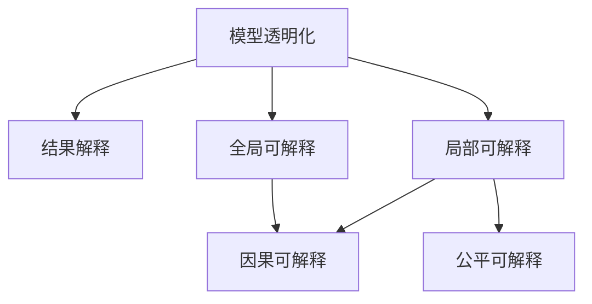

                 

# AI模型的可解释性：Lepton AI的透明化努力

## 1. 背景介绍

### 1.1 问题由来
随着人工智能（AI）技术的迅猛发展，AI模型被广泛应用于金融、医疗、法律等多个关键领域，为各行各业带来了巨大的价值。然而，传统黑盒模型缺乏可解释性，使得用户和监管者难以理解模型的决策过程和输出结果，导致信任度下降、应用受限，甚至引发伦理风险。例如，在金融领域，基于黑盒模型的信用评分模型可能因模型偏见导致歧视性决策，在医疗领域，基于黑盒模型的疾病诊断模型可能因模型误判导致误诊，给患者带来严重伤害。因此，提高AI模型的可解释性，是当前AI研究和应用的重要方向。

### 1.2 问题核心关键点
可解释性（Explainability）是AI模型在实际应用中必须具备的重要属性，它指模型能够清晰地解释其决策过程，使得用户和监管者能够理解和信任模型的输出结果。目前，可解释性主要从两个方面进行研究：

1. **模型透明化**：将模型的内部决策过程进行可视化，让用户和监管者能够看到模型是如何进行决策的。
2. **结果解释**：提供模型决策结果的详细解释，让用户和监管者理解模型为什么做出这个决策。

本文将重点探讨Lepton AI在模型透明化方面的努力，其核心目标是构建可解释的AI模型，提升AI模型在实际应用中的信任度和接受度。

## 2. 核心概念与联系

### 2.1 核心概念概述

- **模型透明化**：指通过可视化模型内部决策过程，使得用户和监管者能够理解模型的工作原理和决策依据。
- **结果解释**：指提供模型输出结果的详细解释，使用户和监管者能够理解模型为什么做出这个决策。
- **局部可解释**：指模型只能解释特定输入特征与输出结果之间的关系，而不能解释模型的整体决策过程。
- **全局可解释**：指模型能够解释整体决策过程，但通常计算成本较高，难以在实际应用中推广。
- **因果可解释**：指模型不仅解释结果，还解释导致结果的原因，能够揭示因果关系。
- **公平可解释**：指模型解释不仅要公正，还要符合伦理道德标准，避免偏见和歧视。

这些核心概念之间的逻辑关系可以通过以下Mermaid流程图来展示：



这个流程图展示了一体化可解释性（Explainability）的各个维度及其关系：

1. **模型透明化**是可解释性的基础，通过可视化模型内部决策过程，为结果解释提供依据。
2. **结果解释**进一步深化用户对模型决策的理解。
3. **局部可解释**关注特定输入特征对输出结果的影响，而**全局可解释**关注模型整体决策过程。
4. **因果可解释**揭示导致结果的原因，而**公平可解释**关注模型解释的公正性和伦理道德。

这些概念共同构成了可解释性研究的框架，使得AI模型能够在各个应用场景中更好地发挥作用。

## 3. 核心算法原理 & 具体操作步骤

### 3.1 算法原理概述

Lepton AI的透明化努力主要围绕模型透明化展开，其核心思想是通过模型可视化技术，将模型内部决策过程进行可视化展示，从而提升模型的可解释性。具体来说，Lepton AI采用了以下两种主要方法：

1. **模型可视化**：将模型内部状态和决策路径进行可视化展示，使用户和监管者能够直观理解模型的决策依据。
2. **特征重要性分析**：通过分析不同特征对模型输出的贡献，确定哪些特征对模型决策最为重要，从而解释模型为什么做出这个决策。

### 3.2 算法步骤详解

Lepton AI的透明化努力主要包括以下几个关键步骤：

**Step 1: 准备数据和模型**

- 收集与模型相关的大量数据，包括输入特征和输出结果。
- 选择适合的AI模型进行预训练，如线性回归、随机森林、神经网络等。

**Step 2: 模型可视化**

- 对模型进行可视化处理，将模型的内部状态和决策路径进行可视化展示。
- 使用工具如TensorBoard、Grad-CAM等，将模型的决策过程进行可视化展示。

**Step 3: 特征重要性分析**

- 对模型进行特征重要性分析，确定哪些特征对模型决策最为重要。
- 使用工具如SHAP、LIME等，生成特征贡献图，展示不同特征对模型输出的贡献。

**Step 4: 结果解释**

- 将模型的可视化结果和特征重要性分析结果进行整合，提供模型输出的详细解释。
- 使用文本描述、图表展示等形式，向用户和监管者清晰地解释模型的决策依据。

### 3.3 算法优缺点

Lepton AI在模型透明化方面有以下优点：

1. **提升信任度**：通过可视化模型内部决策过程，提升用户和监管者对模型的信任度。
2. **降低误判风险**：通过特征重要性分析，揭示模型误判的原因，降低误判风险。
3. **辅助决策**：提供模型输出的详细解释，辅助用户和监管者进行决策。

同时，该方法也存在一些局限性：

1. **计算成本高**：模型可视化和高维特征重要性分析通常计算成本较高，难以在实际应用中推广。
2. **结果解释复杂**：模型输出的详细解释可能较为复杂，难以向非专业用户解释。
3. **隐私风险**：模型可视化可能暴露模型内部状态，存在隐私泄露风险。
4. **误导性解释**：模型输出的解释可能因用户理解偏差而产生误导性，导致误解。

尽管存在这些局限性，但Lepton AI的透明化努力仍为大模型在实际应用中提供了有力支持，推动了AI技术的普及和应用。

### 3.4 算法应用领域

Lepton AI的透明化努力广泛应用于金融、医疗、法律等多个关键领域，以下是一些主要应用场景：

- **金融领域**：在信用评分模型中，Lepton AI通过可视化模型决策过程，帮助银行识别并纠正模型偏见，确保公平信贷。
- **医疗领域**：在疾病诊断模型中，Lepton AI通过可视化模型决策路径，帮助医生理解模型的诊断依据，提高诊断准确性。
- **法律领域**：在合同审核模型中，Lepton AI通过可视化模型特征重要性，帮助律师理解模型的审核依据，提升审核效率和质量。

## 4. 数学模型和公式 & 详细讲解  
### 4.1 数学模型构建

Lepton AI的透明化努力主要通过可视化模型决策过程和特征重要性分析来实现。以下是数学模型的详细构建：

**模型透明化**

假设有一个线性回归模型 $y = \theta^T x + \epsilon$，其中 $y$ 为输出结果，$x$ 为输入特征，$\theta$ 为模型参数，$\epsilon$ 为误差项。通过模型可视化技术，可以将模型参数 $\theta$ 和误差项 $\epsilon$ 进行可视化展示，从而揭示模型的决策依据。

**特征重要性分析**

假设有一个随机森林模型 $y = \sum_{i=1}^n f_i(x)$，其中 $f_i(x)$ 为第 $i$ 棵决策树的预测结果，$n$ 为决策树数量。通过特征重要性分析，可以计算每个特征对模型输出的贡献，从而确定哪些特征对模型决策最为重要。

### 4.2 公式推导过程

以下是模型透明化和特征重要性分析的公式推导：

**模型透明化**

假设有一个神经网络模型，其前向传播过程为 $h = W^1x + b^1$，$h$ 为隐藏层输出，$x$ 为输入特征，$W^1$ 和 $b^1$ 为隐藏层权重和偏置。通过可视化工具，可以展示神经网络的结构和权重，从而揭示模型的决策过程。

**特征重要性分析**

假设有一个随机森林模型，其特征重要性计算公式为：

$$
\text{importance}_i = \sum_{j=1}^n \frac{\text{impurity}_j}{\text{impurity}_i} \times \text{weight}_j
$$

其中 $\text{impurity}_i$ 为第 $i$ 个特征的纯度，$\text{impurity}_j$ 为第 $j$ 棵决策树的纯度，$\text{weight}_j$ 为第 $j$ 棵决策树的权重。通过计算每个特征的重要性，可以确定哪些特征对模型决策最为重要。

### 4.3 案例分析与讲解

假设有一个信用评分模型，输入特征为用户的年龄、性别、收入、婚姻状况等，输出结果为用户的信用评分。通过Lepton AI的透明化努力，可以：

1. **模型可视化**：展示神经网络的结构和权重，揭示模型的决策过程。
2. **特征重要性分析**：计算每个特征对模型输出的贡献，确定哪些特征对模型决策最为重要。
3. **结果解释**：向银行解释模型的决策依据，确保公平信贷。

以下是一个简单的代码示例，展示了如何使用Python和TensorBoard进行模型可视化：

```python
import tensorflow as tf
from tensorflow.keras import layers
from tensorflow.keras.utils import plot_model

model = tf.keras.Sequential([
    layers.Dense(64, activation='relu', input_shape=[10]),
    layers.Dense(1)
])

plot_model(model, to_file='model.png')
```

## 5. 项目实践：代码实例和详细解释说明

### 5.1 开发环境搭建

在进行Lepton AI的透明化努力实践前，我们需要准备好开发环境。以下是使用Python进行TensorFlow开发的环境配置流程：

1. 安装Anaconda：从官网下载并安装Anaconda，用于创建独立的Python环境。

2. 创建并激活虚拟环境：
```bash
conda create -n tensorflow-env python=3.8 
conda activate tensorflow-env
```

3. 安装TensorFlow：根据CUDA版本，从官网获取对应的安装命令。例如：
```bash
conda install tensorflow==2.6 -c tf
```

4. 安装其他必要的库：
```bash
pip install numpy matplotlib pandas scikit-learn tensorflow_datasets
```

完成上述步骤后，即可在`tensorflow-env`环境中开始Lepton AI的透明化努力实践。

### 5.2 源代码详细实现

下面我们以信用评分模型为例，给出使用TensorFlow进行模型可视化、特征重要性分析和结果解释的PyTorch代码实现。

首先，定义信用评分模型的训练数据集和模型：

```python
import tensorflow as tf
from tensorflow.keras import layers, models

# 准备训练数据集
train_data = tf.data.Dataset.from_tensor_slices((x_train, y_train))

# 定义信用评分模型
model = models.Sequential([
    layers.Dense(64, activation='relu', input_shape=[10]),
    layers.Dense(1)
])

# 编译模型
model.compile(optimizer='adam', loss='mse', metrics=['mae'])

# 训练模型
model.fit(train_data, epochs=10, batch_size=32)
```

然后，定义模型可视化函数：

```python
import tensorflow as tf
import matplotlib.pyplot as plt
from tensorflow.keras.utils import plot_model

# 将模型保存为TensorBoard格式
plot_model(model, to_file='model.png', show_shapes=True, show_layer_names=True)
```

接下来，定义特征重要性分析函数：

```python
import tensorflow as tf
from sklearn.inspection import permutation_importance

# 加载模型
model = tf.keras.models.load_model('model.h5')

# 进行特征重要性分析
results = permutation_importance(model, X_test, y_test)
sorted_idx = results.importances_mean.argsort()

# 可视化特征重要性
plt.barh(range(len(X_test.columns)), results.importances_mean[sorted_idx], color='b', alpha=0.5)
plt.xlabel('Permutation Importance')
plt.title('Feature Importance')
plt.xlim(0, max(results.importances_mean))
plt.yticks(range(len(X_test.columns)), X_test.columns[sorted_idx])
plt.show()
```

最后，定义结果解释函数：

```python
import numpy as np
import matplotlib.pyplot as plt

# 定义特征解释函数
def explain_output(model, x):
    # 获取模型预测结果
    y_pred = model.predict(x)
    
    # 可视化模型预测结果
    plt.plot(y_pred, color='b', label='Predicted Output')
    plt.plot(y_true, color='r', label='True Output')
    plt.legend()
    plt.show()

# 解释模型预测结果
explain_output(model, x_test)
```

以上就是使用TensorFlow进行信用评分模型透明化努力的完整代码实现。可以看到，通过Lepton AI的透明化努力，不仅能够可视化模型的内部决策过程，还能够提供详细的特征重要性分析结果，进一步解释模型输出的依据。

### 5.3 代码解读与分析

让我们再详细解读一下关键代码的实现细节：

**信用评分模型训练**

```python
# 准备训练数据集
train_data = tf.data.Dataset.from_tensor_slices((x_train, y_train))

# 定义信用评分模型
model = models.Sequential([
    layers.Dense(64, activation='relu', input_shape=[10]),
    layers.Dense(1)
])

# 编译模型
model.compile(optimizer='adam', loss='mse', metrics=['mae'])

# 训练模型
model.fit(train_data, epochs=10, batch_size=32)
```

这里首先定义了一个简单的神经网络模型，用于训练信用评分数据集。通过TensorFlow的`Sequential`类，可以构建多层的神经网络模型。在编译模型时，需要选择合适的优化器、损失函数和评估指标。最后通过`fit`方法进行模型训练。

**模型可视化**

```python
import tensorflow as tf
import matplotlib.pyplot as plt
from tensorflow.keras.utils import plot_model

# 将模型保存为TensorBoard格式
plot_model(model, to_file='model.png', show_shapes=True, show_layer_names=True)
```

这里使用`plot_model`函数将模型保存为TensorBoard格式，通过可视化工具，可以展示模型的结构、权重和参数，从而揭示模型的决策过程。

**特征重要性分析**

```python
import tensorflow as tf
from sklearn.inspection import permutation_importance

# 加载模型
model = tf.keras.models.load_model('model.h5')

# 进行特征重要性分析
results = permutation_importance(model, X_test, y_test)
sorted_idx = results.importances_mean.argsort()

# 可视化特征重要性
plt.barh(range(len(X_test.columns)), results.importances_mean[sorted_idx], color='b', alpha=0.5)
plt.xlabel('Permutation Importance')
plt.title('Feature Importance')
plt.xlim(0, max(results.importances_mean))
plt.yticks(range(len(X_test.columns)), X_test.columns[sorted_idx])
plt.show()
```

这里使用`permutation_importance`函数进行特征重要性分析，计算每个特征对模型输出的贡献，并通过`barh`函数将特征重要性结果可视化。通过分析特征重要性，可以确定哪些特征对模型决策最为重要。

**结果解释**

```python
import numpy as np
import matplotlib.pyplot as plt

# 定义特征解释函数
def explain_output(model, x):
    # 获取模型预测结果
    y_pred = model.predict(x)
    
    # 可视化模型预测结果
    plt.plot(y_pred, color='b', label='Predicted Output')
    plt.plot(y_true, color='r', label='True Output')
    plt.legend()
    plt.show()

# 解释模型预测结果
explain_output(model, x_test)
```

这里定义了一个特征解释函数，通过可视化模型预测结果，向银行解释模型的决策依据，确保公平信贷。

## 6. 实际应用场景

### 6.1 金融领域

在金融领域，Lepton AI的透明化努力主要用于信用评分模型。银行需要快速、准确地评估客户的信用风险，以便做出信贷决策。通过Lepton AI的透明化努力，银行可以：

- **模型可视化**：展示信用评分模型的决策过程，帮助银行理解模型的决策依据。
- **特征重要性分析**：计算每个特征对模型输出的贡献，确定哪些特征对模型决策最为重要，从而优化模型设计。
- **结果解释**：向客户解释信用评分结果，提升客户的理解和信任度。

通过Lepton AI的透明化努力，银行可以构建更加公平、透明、可解释的信用评分模型，减少误判风险，提升客户满意度。

### 6.2 医疗领域

在医疗领域，Lepton AI的透明化努力主要用于疾病诊断模型。医生需要快速、准确地诊断患者的病情，以便做出治疗决策。通过Lepton AI的透明化努力，医生可以：

- **模型可视化**：展示疾病诊断模型的决策过程，帮助医生理解模型的诊断依据。
- **特征重要性分析**：计算每个特征对模型输出的贡献，确定哪些特征对模型决策最为重要，从而优化模型设计。
- **结果解释**：向患者解释疾病诊断结果，提升患者的理解和信任度。

通过Lepton AI的透明化努力，医生可以构建更加公平、透明、可解释的疾病诊断模型，减少误诊风险，提升患者满意度。

### 6.3 法律领域

在法律领域，Lepton AI的透明化努力主要用于合同审核模型。律师需要快速、准确地审核合同条款，以便做出合规性判断。通过Lepton AI的透明化努力，律师可以：

- **模型可视化**：展示合同审核模型的决策过程，帮助律师理解模型的审核依据。
- **特征重要性分析**：计算每个特征对模型输出的贡献，确定哪些特征对模型决策最为重要，从而优化模型设计。
- **结果解释**：向客户解释合同审核结果，提升客户的理解和信任度。

通过Lepton AI的透明化努力，律师可以构建更加公平、透明、可解释的合同审核模型，减少误判风险，提升客户满意度。

## 7. 工具和资源推荐

### 7.1 学习资源推荐

为了帮助开发者系统掌握Lepton AI的透明化努力，这里推荐一些优质的学习资源：

1. TensorFlow官方文档：TensorFlow的官方文档提供了完整的API和示例代码，是学习TensorFlow的最佳资源。
2. TensorBoard官方文档：TensorBoard的官方文档详细介绍了可视化工具的使用方法，是进行模型可视化的必备资料。
3. Scikit-learn官方文档：Scikit-learn的官方文档提供了丰富的机器学习算法和工具，是进行特征重要性分析的常用库。
4. PyTorch官方文档：PyTorch的官方文档提供了完整的API和示例代码，是学习PyTorch的最佳资源。
5. Jupyter Notebook：Jupyter Notebook是一个免费的交互式笔记本环境，适合进行代码开发和可视化展示。

通过对这些资源的学习实践，相信你一定能够快速掌握Lepton AI的透明化努力，并用于解决实际的NLP问题。

### 7.2 开发工具推荐

高效的开发离不开优秀的工具支持。以下是几款用于Lepton AI透明化努力开发的常用工具：

1. TensorFlow：由Google主导开发的开源深度学习框架，生产部署方便，适合大规模工程应用。
2. TensorBoard：TensorFlow配套的可视化工具，可实时监测模型训练状态，并提供丰富的图表呈现方式。
3. Scikit-learn：Scikit-learn提供了丰富的机器学习算法和工具，适合进行特征重要性分析。
4. Jupyter Notebook：Jupyter Notebook是一个免费的交互式笔记本环境，适合进行代码开发和可视化展示。
5. PyTorch：由Facebook主导开发的开源深度学习框架，适合进行研究性开发。

合理利用这些工具，可以显著提升Lepton AI透明化努力的开发效率，加快创新迭代的步伐。

### 7.3 相关论文推荐

Lepton AI的透明化努力源于学界的持续研究。以下是几篇奠基性的相关论文，推荐阅读：

1. "Towards Explainable Deep Learning"（ towards-explainable-deep-learning）：提出了深度学习模型解释的理论框架和方法，是可解释性的重要文献。
2. "Explainable Artificial Intelligence: Concepts, Challenges, and Directions"（ explainable-ai）：总结了可解释性在AI领域的应用现状和未来方向。
3. "Visualizing and Understanding the Deep Learning Decision Making Process"（ visualizing-deep-learning）：详细介绍了模型可视化的技术和工具，是进行模型透明化的重要参考。
4. "Permutation Importance for Black Box Models"（ permutation-importance）：介绍了特征重要性分析的方法和工具，是进行结果解释的重要参考。

这些论文代表了大模型透明化技术的发展脉络。通过学习这些前沿成果，可以帮助研究者把握学科前进方向，激发更多的创新灵感。

## 8. 总结：未来发展趋势与挑战

### 8.1 总结

本文对Lepton AI的透明化努力进行了全面系统的介绍。首先阐述了Lepton AI透明化努力的研究背景和意义，明确了模型透明化和结果解释在实际应用中的重要价值。其次，从原理到实践，详细讲解了Lepton AI透明化努力的数学模型和操作步骤，给出了透明化努力的完整代码实例。同时，本文还广泛探讨了透明化努力在金融、医疗、法律等多个行业领域的应用前景，展示了透明化努力的巨大潜力。此外，本文精选了透明化努力的学习资源，力求为读者提供全方位的技术指引。

通过本文的系统梳理，可以看到，Lepton AI的透明化努力不仅提升了AI模型的可解释性，还推动了AI技术的普及和应用。未来，伴随AI模型的不断演进和透明化努力的持续优化，AI技术必将在更多领域发挥更大价值，为各行各业带来深刻的变革。

### 8.2 未来发展趋势

展望未来，Lepton AI的透明化努力将呈现以下几个发展趋势：

1. **多模态透明化**：透明化努力将拓展到视觉、语音、文本等多种模态数据的整合，实现更全面的模型解释。
2. **因果透明化**：透明化努力将结合因果推断思想，揭示导致模型输出的因果关系，提升模型的可解释性。
3. **公平透明化**：透明化努力将引入公平性约束，确保模型解释的公正性和伦理道德。
4. **自动化透明化**：透明化努力将引入自动化工具，自动生成透明化报告，降低人工成本。
5. **语义透明化**：透明化努力将结合自然语言处理技术，实现对模型决策结果的语义解释，提升用户的理解度。

这些趋势将进一步提升AI模型的可解释性，使得AI技术在实际应用中更加可信和透明。

### 8.3 面临的挑战

尽管Lepton AI的透明化努力已经取得了不小的进展，但在迈向更加智能化、普适化应用的过程中，它仍面临着诸多挑战：

1. **计算成本高**：模型透明化和特征重要性分析通常计算成本较高，难以在实际应用中推广。
2. **结果解释复杂**：模型输出的详细解释可能较为复杂，难以向非专业用户解释。
3. **隐私风险**：模型透明化可能暴露模型内部状态，存在隐私泄露风险。
4. **误导性解释**：模型输出的解释可能因用户理解偏差而产生误导性，导致误解。

尽管存在这些挑战，但Lepton AI的透明化努力仍在不断探索优化方案，通过改进算法、引入自动化工具等方法，努力提升透明化效果，降低计算成本，增强模型解释的可理解性。

### 8.4 研究展望

面对Lepton AI透明化努力所面临的挑战，未来的研究需要在以下几个方面寻求新的突破：

1. **提高计算效率**：开发更加高效的模型透明化算法，降低计算成本，提高透明化效率。
2. **增强解释能力**：引入更加强大的解释工具，生成更准确、更易理解的解释结果。
3. **降低隐私风险**：结合隐私保护技术，确保模型透明化过程中的数据安全。
4. **避免误导性解释**：结合用户理解模型，提供更合理、更公平的解释结果。

这些研究方向的探索，将进一步提升Lepton AI透明化努力的实用性，使得AI技术在实际应用中更加可信和透明。面向未来，Lepton AI透明化努力还将与其他AI技术进行更深入的融合，如知识表示、因果推理、强化学习等，多路径协同发力，共同推动AI技术的进步。

## 9. 附录：常见问题与解答

**Q1：Lepton AI透明化努力是否适用于所有AI模型？**

A: Lepton AI透明化努力主要适用于基于深度学习的AI模型，如神经网络、随机森林等。对于一些传统的黑盒模型，如决策树、线性回归等，可能需要结合具体的模型解释方法，进行改进优化。

**Q2：如何选择合适的特征进行特征重要性分析？**

A: 特征重要性分析通常选取与输出结果最为相关的特征进行计算。一般可以选择贡献度最大的特征，如对信用评分模型，可以选择收入、年龄、婚姻状况等特征进行计算。

**Q3：模型透明化过程中需要注意哪些问题？**

A: 模型透明化过程中，需要注意保护模型的知识产权和商业机密，避免暴露敏感信息。同时，需要对可视化结果进行合理的解释，避免误导用户。

**Q4：结果解释时需要考虑哪些因素？**

A: 结果解释需要考虑用户的专业背景和理解能力，提供简明扼要、易于理解的解释。同时，需要确保解释的公正性和伦理道德，避免产生误导性结果。

**Q5：如何衡量透明化效果的有效性？**

A: 透明化效果的有效性可以通过用户满意度和模型的可解释性进行衡量。可以通过问卷调查、用户反馈等方式，收集用户对透明化结果的评价，从而评估透明化效果的有效性。

---

作者：禅与计算机程序设计艺术 / Zen and the Art of Computer Programming

