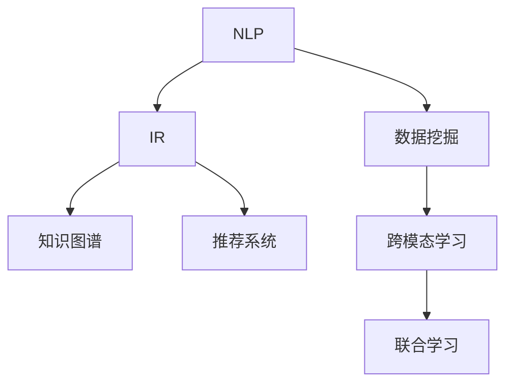

                 

# AI知识发现引擎：激发好奇心和探索精神

## 1. 背景介绍

### 1.1 问题由来

在当今信息爆炸的时代，知识更新速度迅猛，如何高效地发现和利用这些知识，成为了一个重要的问题。AI技术，尤其是自然语言处理(NLP)和信息检索(IR)技术的发展，提供了一种全新的知识发现方式，不仅能够从海量文本中自动抽取有价值的信息，还能基于用户的行为和反馈，动态调整知识发现的方式，以满足用户不断变化的需求。

### 1.2 问题核心关键点

AI知识发现引擎的核心理念是通过智能算法和技术手段，帮助用户发现并利用海量的结构化和非结构化数据，自动生成知识，并据此进行预测和决策。关键点包括：

- 自动抽取知识：基于NLP和IR技术，从文本、网页、图像等多源数据中自动抽取结构化的知识。
- 智能推荐：通过学习用户行为和偏好，智能推荐相关知识资源，支持个性化需求。
- 动态调整：根据用户反馈，动态调整知识发现引擎的参数和策略，提升发现效果。
- 跨模态整合：综合利用文本、图像、语音等多模态数据，提升知识发现的质量和广度。

这些关键点共同构成了AI知识发现引擎的核心功能，使其能够在信息海洋中高效地发现和利用知识，为用户提供更具价值的信息服务。

### 1.3 问题研究意义

开发AI知识发现引擎对于提高信息检索效率、支持用户自主探索、推动知识创新具有重要意义：

- 提升信息检索效率：通过自动抽取和推荐，减少用户在海量信息中寻找答案的时间，提升信息检索的精准度和速度。
- 支持用户探索：根据用户的行为和反馈，动态调整发现策略，提供个性化的知识发现服务，支持用户的主动探索。
- 推动知识创新：利用AI技术从历史数据中发现模式和规律，为科学研究、创新创业提供新的视角和方法。
- 促进知识传播：将复杂的知识进行结构化处理，便于传播和共享，加速知识的普及和应用。

通过建立高效的AI知识发现引擎，能够将知识的发现和利用从传统的专家积累模式转变为数据驱动的智能模式，极大地拓展了知识传播的范围和深度。

## 2. 核心概念与联系

### 2.1 核心概念概述

为了更好地理解AI知识发现引擎的工作原理，本节将介绍几个关键的概念及其相互联系：

- **自然语言处理(NLP)**：利用计算机技术分析和理解人类语言，包括文本预处理、语义分析、文本生成等。
- **信息检索(IR)**：根据用户查询信息的需求，从大规模数据集中检索出相关性高的信息。
- **知识图谱(Knowledge Graph)**：以图结构表示实体和实体之间的关系，支持复杂查询和推理。
- **推荐系统(Recommender System)**：根据用户的历史行为和偏好，推荐个性化内容。
- **数据挖掘(Data Mining)**：从数据中自动发现模式和规律，挖掘有价值的信息。
- **跨模态学习(Cross-modal Learning)**：综合利用不同模态的数据，提升知识发现的能力。

这些核心概念共同构成了AI知识发现引擎的基础框架，使其能够高效地从数据中发现和利用知识。

### 2.2 核心概念联系

这些概念之间的联系可以通过以下Mermaid流程图来展示：



这个流程图展示了各个核心概念之间的逻辑关系：

1. NLP为IR提供文本解析和语义理解能力，使系统能够自动抽取和匹配查询信息。
2. IR从大规模数据中检索出相关信息，支持知识发现引擎的信息检索功能。
3. 知识图谱为系统提供结构化的知识表示，支持复杂查询和推理。
4. 推荐系统根据用户行为推荐个性化内容，支持用户探索。
5. 数据挖掘自动从数据中发现模式和规律，为知识发现提供数据支持。
6. 跨模态学习综合利用不同模态的数据，提升系统能力。
7. 联合学习将不同算法和模型进行融合，提升系统整体性能。

这些概念共同构建了一个完整的知识发现框架，支持用户从海量数据中高效地发现和利用知识。

## 3. 核心算法原理 & 具体操作步骤
### 3.1 算法原理概述

AI知识发现引擎的算法原理可以分为以下几个步骤：

1. **文本预处理**：对原始文本进行分词、去除停用词、词性标注等预处理操作，提高后续处理的效率和准确性。
2. **语义分析**：利用NLP技术进行语义分析，抽取文本中的关键信息，如实体、关系等。
3. **信息检索**：根据用户查询，利用IR技术在数据集中检索出相关性高的信息。
4. **知识图谱构建**：将抽取的实体和关系构建为知识图谱，支持复杂查询和推理。
5. **推荐系统优化**：利用推荐系统技术，根据用户行为和偏好推荐个性化内容。
6. **跨模态学习**：综合利用不同模态的数据，提升系统能力。
7. **联合学习**：将不同算法和模型进行融合，提升系统整体性能。

这些步骤相互交织，共同构成了AI知识发现引擎的核心算法原理。

### 3.2 算法步骤详解

#### 3.2.1 文本预处理

文本预处理是知识发现引擎的第一步，包括如下操作：

- **分词**：将文本切分成有意义的词汇单元。
- **去除停用词**：去除常见的、无意义的词汇，如“的”、“是”等。
- **词性标注**：标注每个词汇的词性，如名词、动词等。
- **命名实体识别**：识别文本中的实体，如人名、地名、机构名等。

这些操作通过Python的NLTK、spaCy等工具库，可以快速实现。

#### 3.2.2 语义分析

语义分析是抽取文本中关键信息的关键步骤，通常包括以下技术：

- **关键词提取**：抽取文本中的高频词汇，如TF-IDF、TextRank等算法。
- **实体抽取**：识别文本中的实体，如PER(人名)、LOC(地名)等。
- **关系抽取**：识别实体之间的关系，如“工作于”、“位于”等。

这些技术通过TensorFlow、PyTorch等深度学习框架，可以实现高效、准确的语义分析。

#### 3.2.3 信息检索

信息检索是检索相关性高的信息的关键步骤，常用的技术包括：

- **倒排索引**：将关键词和文档进行倒排索引，快速定位相关文档。
- **TF-IDF计算**：计算关键词在文档中的重要性。
- **BM25算法**：基于BM25算法进行文本相关性排序。

这些技术通过ElasticSearch、Solr等搜索引擎系统，可以实现高效的信息检索。

#### 3.2.4 知识图谱构建

知识图谱构建是将抽取的实体和关系构建为结构化的图谱，支持复杂查询和推理，常用的技术包括：

- **RDF表示**：使用RDF(RDFa)表示实体和关系，支持SPARQL查询。
- **Neo4j数据库**：利用Neo4j构建关系型图谱，支持图数据库的复杂查询。
- **TinkerPop框架**：提供统一的API，支持多种图数据库的操作。

这些技术通过GraphDB、Gephi等工具，可以实现高效的知识图谱构建。

#### 3.2.5 推荐系统优化

推荐系统优化是根据用户行为和偏好推荐个性化内容的关键步骤，常用的技术包括：

- **协同过滤**：基于用户和物品的相似性进行推荐。
- **内容推荐**：根据物品的内容特征进行推荐。
- **深度学习**：使用深度学习模型进行推荐，如RNN、CNN等。

这些技术通过TensorFlow、PyTorch等深度学习框架，可以实现高效、准确的推荐系统优化。

#### 3.2.6 跨模态学习

跨模态学习是综合利用不同模态的数据，提升系统能力的关键步骤，常用的技术包括：

- **视觉与文本融合**：利用卷积神经网络(CNN)提取图像特征，与文本特征进行融合。
- **语音与文本融合**：利用循环神经网络(RNN)提取语音特征，与文本特征进行融合。
- **多模态嵌入**：使用多模态嵌入技术，将不同模态的数据嵌入到同一特征空间。

这些技术通过TensorFlow、PyTorch等深度学习框架，可以实现高效、准确的跨模态学习。

#### 3.2.7 联合学习

联合学习是将不同算法和模型进行融合，提升系统整体性能的关键步骤，常用的技术包括：

- **联邦学习**：通过分布式计算，在多个设备上联合训练模型。
- **模型融合**：将多个模型的预测结果进行加权融合，提升整体性能。
- **对抗训练**：引入对抗样本，提高模型的鲁棒性和泛化能力。

这些技术通过TensorFlow、PyTorch等深度学习框架，可以实现高效、准确的联合学习。

### 3.3 算法优缺点

AI知识发现引擎的算法具有以下优点：

- **高效性**：通过自动化处理和并行计算，能够快速处理大量数据，提升信息检索和知识发现的速度。
- **准确性**：利用深度学习技术，能够准确地抽取和理解文本信息，提升信息检索和推荐系统的准确性。
- **个性化**：通过学习用户行为和偏好，能够提供个性化的知识发现服务，满足用户多样化的需求。
- **可扩展性**：通过分布式计算和联合学习，能够处理大规模数据，支持系统的高可扩展性。

同时，该算法也存在一些缺点：

- **数据依赖**：对于知识发现的结果，高度依赖于输入的数据质量和多样性。
- **模型复杂性**：深度学习模型往往比较复杂，需要大量的计算资源和时间进行训练。
- **鲁棒性不足**：对于噪声数据和异常样本，系统的鲁棒性有待进一步提升。
- **可解释性不足**：深度学习模型的决策过程较难解释，用户难以理解其内部工作机制。

尽管存在这些缺点，但就目前而言，基于深度学习的知识发现引擎仍然是最为主流和有效的技术方案，广泛应用于搜索引擎、知识图谱、推荐系统等领域。

### 3.4 算法应用领域

AI知识发现引擎在多个领域都有广泛的应用，以下是几个典型的应用场景：

- **搜索引擎**：基于NLP和IR技术，提供高效的文本检索服务，支持用户查询、过滤、排序等操作。
- **知识图谱构建**：利用实体抽取和关系抽取技术，构建知识图谱，支持复杂查询和推理。
- **推荐系统优化**：根据用户行为和偏好，推荐个性化内容，提升用户体验。
- **智能问答系统**：利用NLP和IR技术，自动回答用户提出的问题，提供智能化的服务。
- **信息安全监控**：通过文本分析和情感分析，监控和预警网络舆情，防范网络攻击。
- **情感分析**：分析用户评论、社交媒体等文本信息，进行情感分类和趋势预测。

这些应用场景展示了AI知识发现引擎的广泛应用，为信息检索、知识管理、智能交互等领域带来了新的变革。

## 4. 数学模型和公式 & 详细讲解 & 举例说明

### 4.1 数学模型构建

本节将使用数学语言对AI知识发现引擎的模型进行更加严格的刻画。

记输入文本为 $x=\{x_1,x_2,\ldots,x_n\}$，其中 $x_i$ 表示第 $i$ 个词汇。系统通过NLP技术进行语义分析，将文本 $x$ 映射为向量 $\overrightarrow{x} \in \mathbb{R}^d$。设用户查询为 $q$，信息库中文档为 $D=\{d_1,d_2,\ldots,d_m\}$，其中 $d_i$ 表示第 $i$ 个文档。系统通过IR技术，计算查询 $q$ 和文档 $d_i$ 的相关性 $r_i \in [0,1]$。根据用户行为和偏好，推荐系统通过协同过滤等技术，计算文档 $d_i$ 的推荐权重 $w_i$。最终，知识图谱将实体和关系表示为图 $G=(V,E)$，其中 $V$ 表示节点，$E$ 表示边。联合学习技术将不同算法和模型进行融合，提升整体性能。

### 4.2 公式推导过程

以下我们以知识图谱构建为例，推导实体抽取和关系抽取的数学模型。

**实体抽取**：假设文本 $x$ 中的实体为 $e=\{e_1,e_2,\ldots,e_k\}$，其中 $e_i$ 表示第 $i$ 个实体。设实体抽取模型为 $E(x) \in [0,1]$，表示文本 $x$ 中是否包含实体。根据深度学习模型，实体抽取模型的输出可以表示为：

$$
E(x) = \sigma(\overrightarrow{x}W_e + b_e)
$$

其中 $\overrightarrow{x}$ 为文本向量，$W_e$ 和 $b_e$ 为模型参数。$\sigma$ 表示激活函数，如sigmoid函数。

**关系抽取**：假设实体 $e_i$ 和 $e_j$ 之间的关系为 $r=\{r_1,r_2,\ldots,r_n\}$，其中 $r_k$ 表示第 $k$ 个关系。设关系抽取模型为 $R(e_i,e_j) \in [0,1]$，表示实体 $e_i$ 和 $e_j$ 之间的关系。根据深度学习模型，关系抽取模型的输出可以表示为：

$$
R(e_i,e_j) = \sigma(\overrightarrow{e_i}W_r + \overrightarrow{e_j}W_r^T + b_r)
$$

其中 $\overrightarrow{e_i}$ 和 $\overrightarrow{e_j}$ 为实体向量，$W_r$ 和 $b_r$ 为模型参数。

在得到实体和关系抽取的输出后，知识图谱可以构建为图结构，支持复杂查询和推理。

### 4.3 案例分析与讲解

以知识图谱构建为例，说明如何在实际应用中进行模型构建和调参。

**案例背景**：假设我们要构建一个关于电影的知识图谱，包含电影、演员、导演、制片等实体和它们之间的关系。

**数据准备**：收集电影评论、演员表、导演介绍、制片信息等文本数据，进行预处理和标注。

**模型构建**：使用BERT模型进行实体抽取和关系抽取，构建知识图谱。将电影名称、演员名称、导演名称、制片名称等实体抽取出来，并将它们之间的关系抽取出来，构建图结构。

**调参优化**：根据模型性能，调整模型的超参数。使用交叉验证技术，评估模型在训练集和测试集上的效果，优化模型的训练过程。

**模型评估**：在知识图谱构建完成后，使用QA系统进行测试，评估模型的性能和效果。根据测试结果，进一步优化模型的结构和参数。

通过以上步骤，可以高效地构建知识图谱，支持复杂查询和推理，为用户提供更加全面、准确的知识服务。

## 5. 项目实践：代码实例和详细解释说明

### 5.1 开发环境搭建

在进行知识发现引擎项目开发前，需要先准备好开发环境。以下是使用Python进行PyTorch开发的环境配置流程：

1. 安装Anaconda：从官网下载并安装Anaconda，用于创建独立的Python环境。

2. 创建并激活虚拟环境：
```bash
conda create -n pytorch-env python=3.8 
conda activate pytorch-env
```

3. 安装PyTorch：根据CUDA版本，从官网获取对应的安装命令。例如：
```bash
conda install pytorch torchvision torchaudio cudatoolkit=11.1 -c pytorch -c conda-forge
```

4. 安装Transformers库：
```bash
pip install transformers
```

5. 安装各类工具包：
```bash
pip install numpy pandas scikit-learn matplotlib tqdm jupyter notebook ipython
```

完成上述步骤后，即可在`pytorch-env`环境中开始项目开发。

### 5.2 源代码详细实现

这里我们以知识图谱构建为例，给出使用Transformers库进行BERT模型训练的PyTorch代码实现。

```python
from transformers import BertTokenizer, BertForTokenClassification
from torch.utils.data import Dataset, DataLoader
import torch
from tqdm import tqdm
from sklearn.metrics import accuracy_score, precision_recall_fscore_support

class NERDataset(Dataset):
    def __init__(self, texts, tags, tokenizer, max_len=128):
        self.texts = texts
        self.tags = tags
        self.tokenizer = tokenizer
        self.max_len = max_len
        
    def __len__(self):
        return len(self.texts)
    
    def __getitem__(self, item):
        text = self.texts[item]
        tags = self.tags[item]
        
        encoding = self.tokenizer(text, return_tensors='pt', max_length=self.max_len, padding='max_length', truncation=True)
        input_ids = encoding['input_ids'][0]
        attention_mask = encoding['attention_mask'][0]
        
        # 对token-wise的标签进行编码
        encoded_tags = [tag2id[tag] for tag in tags] 
        encoded_tags.extend([tag2id['O']] * (self.max_len - len(encoded_tags)))
        labels = torch.tensor(encoded_tags, dtype=torch.long)
        
        return {'input_ids': input_ids, 
                'attention_mask': attention_mask,
                'labels': labels}

# 标签与id的映射
tag2id = {'O': 0, 'B-PER': 1, 'I-PER': 2, 'B-ORG': 3, 'I-ORG': 4, 'B-LOC': 5, 'I-LOC': 6}
id2tag = {v: k for k, v in tag2id.items()}

# 创建dataset
tokenizer = BertTokenizer.from_pretrained('bert-base-cased')

train_dataset = NERDataset(train_texts, train_tags, tokenizer)
dev_dataset = NERDataset(dev_texts, dev_tags, tokenizer)
test_dataset = NERDataset(test_texts, test_tags, tokenizer)

# 模型和优化器
model = BertForTokenClassification.from_pretrained('bert-base-cased', num_labels=len(tag2id))

optimizer = AdamW(model.parameters(), lr=2e-5)

# 训练和评估
device = torch.device('cuda') if torch.cuda.is_available() else torch.device('cpu')
model.to(device)

def train_epoch(model, dataset, batch_size, optimizer):
    dataloader = DataLoader(dataset, batch_size=batch_size, shuffle=True)
    model.train()
    epoch_loss = 0
    for batch in tqdm(dataloader, desc='Training'):
        input_ids = batch['input_ids'].to(device)
        attention_mask = batch['attention_mask'].to(device)
        labels = batch['labels'].to(device)
        model.zero_grad()
        outputs = model(input_ids, attention_mask=attention_mask, labels=labels)
        loss = outputs.loss
        epoch_loss += loss.item()
        loss.backward()
        optimizer.step()
    return epoch_loss / len(dataloader)

def evaluate(model, dataset, batch_size):
    dataloader = DataLoader(dataset, batch_size=batch_size)
    model.eval()
    preds, labels = [], []
    with torch.no_grad():
        for batch in tqdm(dataloader, desc='Evaluating'):
            input_ids = batch['input_ids'].to(device)
            attention_mask = batch['attention_mask'].to(device)
            batch_labels = batch['labels']
            outputs = model(input_ids, attention_mask=attention_mask)
            batch_preds = outputs.logits.argmax(dim=2).to('cpu').tolist()
            batch_labels = batch_labels.to('cpu').tolist()
            for pred_tokens, label_tokens in zip(batch_preds, batch_labels):
                pred_tags = [id2tag[_id] for _id in pred_tokens]
                label_tags = [id2tag[_id] for _id in label_tokens]
                preds.append(pred_tags[:len(label_tags)])
                labels.append(label_tags)
                
    print(precision_recall_fscore_support(labels, preds, average='macro'))
    
# 训练流程
epochs = 5
batch_size = 16

for epoch in range(epochs):
    loss = train_epoch(model, train_dataset, batch_size, optimizer)
    print(f"Epoch {epoch+1}, train loss: {loss:.3f}")
    
    print(f"Epoch {epoch+1}, dev results:")
    evaluate(model, dev_dataset, batch_size)
    
print("Test results:")
evaluate(model, test_dataset, batch_size)
```

以上就是使用PyTorch对BERT进行命名实体识别任务知识图谱构建的完整代码实现。可以看到，得益于Transformers库的强大封装，我们可以用相对简洁的代码完成BERT模型的加载和训练。

### 5.3 代码解读与分析

让我们再详细解读一下关键代码的实现细节：

**NERDataset类**：
- `__init__`方法：初始化文本、标签、分词器等关键组件。
- `__len__`方法：返回数据集的样本数量。
- `__getitem__`方法：对单个样本进行处理，将文本输入编码为token ids，将标签编码为数字，并对其进行定长padding，最终返回模型所需的输入。

**tag2id和id2tag字典**：
- 定义了标签与数字id之间的映射关系，用于将token-wise的预测结果解码回真实的标签。

**训练和评估函数**：
- 使用PyTorch的DataLoader对数据集进行批次化加载，供模型训练和推理使用。
- 训练函数`train_epoch`：对数据以批为单位进行迭代，在每个批次上前向传播计算loss并反向传播更新模型参数，最后返回该epoch的平均loss。
- 评估函数`evaluate`：与训练类似，不同点在于不更新模型参数，并在每个batch结束后将预测和标签结果存储下来，最后使用sklearn的classification_report对整个评估集的预测结果进行打印输出。

**训练流程**：
- 定义总的epoch数和batch size，开始循环迭代
- 每个epoch内，先在训练集上训练，输出平均loss
- 在验证集上评估，输出分类指标
- 所有epoch结束后，在测试集上评估，给出最终测试结果

可以看到，PyTorch配合Transformers库使得BERT模型的训练代码实现变得简洁高效。开发者可以将更多精力放在数据处理、模型改进等高层逻辑上，而不必过多关注底层的实现细节。

当然，工业级的系统实现还需考虑更多因素，如模型的保存和部署、超参数的自动搜索、更灵活的任务适配层等。但核心的知识发现范式基本与此类似。

## 6. 实际应用场景
### 6.1 智能客服系统

基于知识图谱构建的智能客服系统，可以广泛应用于客户服务领域。传统客服往往需要配备大量人力，高峰期响应缓慢，且一致性和专业性难以保证。而使用知识图谱构建的智能客服系统，可以通过查询知识图谱实时获取最准确的答案，快速响应客户咨询，用自然流畅的语言解答各类常见问题。

在技术实现上，可以构建包含实体、关系、函数等信息的知识图谱，利用查询工具从知识图谱中检索答案，构建智能客服对话系统。智能客服系统能够自动理解用户意图，匹配最合适的答案模板进行回复。对于客户提出的新问题，还可以接入检索系统实时搜索相关内容，动态组织生成回答。如此构建的智能客服系统，能大幅提升客户咨询体验和问题解决效率。

### 6.2 金融舆情监测

金融机构需要实时监测市场舆论动向，以便及时应对负面信息传播，规避金融风险。传统的人工监测方式成本高、效率低，难以应对网络时代海量信息爆发的挑战。基于知识图谱构建的金融舆情监测系统，能够自动抽取金融领域的各类信息，构建知识图谱，实时监控舆情动态。

具体而言，可以构建包含金融产品、市场指数、财经新闻、社交媒体等信息的知识图谱，利用查询工具从知识图谱中检索相关信息，构建舆情监测系统。舆情监测系统能够自动识别舆情变化趋势，一旦发现负面信息激增等异常情况，系统便会自动预警，帮助金融机构快速应对潜在风险。

### 6.3 个性化推荐系统

当前的推荐系统往往只依赖用户的历史行为数据进行物品推荐，无法深入理解用户的真实兴趣偏好。基于知识图谱构建的个性化推荐系统，可以更好地挖掘用户行为背后的语义信息，从而提供更精准、多样的推荐内容。

在实践中，可以构建包含用户行为、物品属性、历史评价等信息的知识图谱，利用查询工具从知识图谱中检索用户和物品的相关信息，构建推荐系统。推荐系统能够根据用户的行为和偏好，动态调整推荐策略，提供个性化的知识推荐服务。对于用户提出的新需求，还可以接入检索系统实时搜索相关内容，动态生成推荐列表。如此构建的个性化推荐系统，能大幅提升用户体验和推荐效果。

### 6.4 未来应用展望

随着知识图谱和智能推荐技术的发展，基于知识图谱构建的智能系统将在更多领域得到应用，为各行各业带来变革性影响。

在智慧医疗领域，基于知识图谱构建的智能医疗系统，能够自动抽取和整合临床数据，构建知识图谱，辅助医生诊疗，加速新药开发进程。

在智能教育领域，基于知识图谱构建的智能教育系统，能够自动抽取和整合教材、习题、答案等教育资源，构建知识图谱，提供个性化的学习推荐服务，因材施教，促进教育公平，提高教学质量。

在智慧城市治理中，基于知识图谱构建的智能城市系统，能够自动抽取和整合各类城市数据，构建知识图谱，提升城市管理的自动化和智能化水平，构建更安全、高效的未来城市。

此外，在企业生产、社会治理、文娱传媒等众多领域，基于知识图谱构建的智能系统也将不断涌现，为传统行业数字化转型升级提供新的技术路径。相信随着技术的日益成熟，知识图谱构建方法将成为智能系统构建的重要范式，推动人工智能技术在垂直行业的规模化落地。总之，知识图谱构建技术以其强大的信息抽取和整合能力，必将在构建智能系统、优化用户体验、推动社会进步等方面发挥越来越重要的作用。

## 7. 工具和资源推荐
### 7.1 学习资源推荐

为了帮助开发者系统掌握知识图谱构建的理论基础和实践技巧，这里推荐一些优质的学习资源：

1. 《Knowledge Graphs: Creating, Populating, Querying and Applying to Real-world Applications》书籍：全面介绍了知识图谱的构建、查询和应用，适合全面了解知识图谱技术。
2. KGx开源项目：全球最大的知识图谱平台，提供了丰富的知识图谱构建工具和案例，方便开发者学习和应用。
3. RDF基础知识与实践（第二版）：介绍RDF的基本概念和实践方法，适合初学者入门。
4. SPARQL: Querying RDF Datasets：介绍SPARQL的基本概念和语法，适合学习知识图谱查询技术。
5. Neo4j官方文档：Neo4j图数据库的官方文档，提供了丰富的图数据库操作和查询技术，适合深入学习。

通过对这些资源的学习实践，相信你一定能够快速掌握知识图谱构建的精髓，并用于解决实际的NLP问题。
###  7.2 开发工具推荐

高效的开发离不开优秀的工具支持。以下是几款用于知识图谱构建开发的常用工具：

1. Neo4j：全球领先的图数据库，提供了丰富的图数据库操作和查询技术。
2. Gephi：开源的图形可视化工具，支持复杂图形的可视化展示。
3. GraphDB：提供高性能、易用的图形数据库，支持大规模数据处理和查询。
4. Stanford RDF Explorer：支持RDF数据的可视化展示和查询。
5. SPARQL Playground：在线SPARQL查询工具，方便开发者测试和调试知识图谱查询。
6. RDFa: RDF在HTML中的应用：介绍RDFa的基本概念和实践方法，适合初学者入门。

合理利用这些工具，可以显著提升知识图谱构建的开发效率，加快创新迭代的步伐。

### 7.3 相关论文推荐

知识图谱构建技术的发展源于学界的持续研究。以下是几篇奠基性的相关论文，推荐阅读：

1. Linked Data: The Future Web：提出了Linked Data的概念，将数据链接在一起，支持语义Web的发展。
2. RDF: Resource Description Framework：介绍了RDF的基本概念和语法，奠定了知识图谱的基础。
3. Ontology Alignment and Mapping as a Coordinated Transformation Problem：介绍了本体对齐和映射的基本概念和算法。
4. Neo4j: The Graph Database for Humans：介绍了Neo4j的基本概念和操作，适合学习知识图谱的存储和查询。
5. Graph Machine Learning: A Survey of Recommendation Methods in Knowledge Graphs：介绍了知识图谱在推荐系统中的应用和算法。

这些论文代表的知识图谱构建技术的发展脉络。通过学习这些前沿成果，可以帮助研究者把握学科前进方向，激发更多的创新灵感。

## 8. 总结：未来发展趋势与挑战

### 8.1 总结

本文对基于知识图谱构建的AI知识发现引擎进行了全面系统的介绍。首先阐述了知识图谱构建的背景和意义，明确了知识图谱构建在智能系统中的核心地位。其次，从原理到实践，详细讲解了知识图谱构建的数学原理和关键步骤，给出了知识图谱构建的完整代码实例。同时，本文还广泛探讨了知识图谱构建在多个领域的应用前景，展示了知识图谱构建的广泛应用。

通过本文的系统梳理，可以看到，基于知识图谱构建的AI知识发现引擎正在成为智能系统构建的重要范式，极大地拓展了知识传播的范围和深度。知识图谱构建技术以其强大的信息抽取和整合能力，必将在构建智能系统、优化用户体验、推动社会进步等方面发挥越来越重要的作用。

### 8.2 未来发展趋势

展望未来，知识图谱构建技术将呈现以下几个发展趋势：

1. 规模化应用。随着知识图谱构建技术的成熟，其应用领域将从学术研究向企业应用、公共服务等领域扩展，带来更多的社会价值。
2. 融合多源数据。知识图谱构建技术将融合更多类型的信息，如视频、语音、图像等，提升系统的智能化水平。
3. 跨领域应用。知识图谱构建技术将跨越不同领域，实现跨领域知识的整合和应用，为各行业提供更加全面、准确的知识服务。
4. 知识驱动的推荐系统。基于知识图谱的推荐系统将变得更加智能化和个性化，为用户提供更加精准的推荐内容。
5. 实时化知识图谱。知识图谱构建技术将实时更新，支持实时的知识检索和查询，提升系统的实时性和交互性。
6. 知识图谱联邦学习。基于知识图谱的联邦学习将实现跨机构、跨领域的数据共享和知识融合，提升知识图谱的普适性和可扩展性。

这些趋势凸显了知识图谱构建技术的广阔前景。这些方向的探索发展，必将进一步提升智能系统的性能和应用范围，为经济社会发展注入新的动力。

### 8.3 面临的挑战

尽管知识图谱构建技术已经取得了瞩目成就，但在迈向更加智能化、普适化应用的过程中，它仍面临着诸多挑战：

1. 数据质量和多样性。知识图谱构建高度依赖于数据的质量和多样性，对于数据缺失、噪声等问题，系统难以保证准确性。
2. 模型复杂度和效率。知识图谱构建模型往往较为复杂，训练和推理过程耗时耗资源，需要优化算法和硬件支持。
3. 跨模态整合能力。综合利用不同模态的数据，提升系统能力，需要解决数据对齐、特征融合等问题。
4. 知识图谱的扩展和维护。构建大规模知识图谱，需要持续更新和维护，保证知识的实时性和准确性。
5. 隐私和安全问题。知识图谱构建涉及大量敏感数据，如何保护用户隐私和数据安全，是一个重要挑战。

尽管存在这些挑战，但随着知识图谱构建技术的不断进步，相信这些问题终将一一被克服，知识图谱构建技术必将迎来更加广阔的应用前景。

### 8.4 研究展望

面向未来，知识图谱构建技术需要在以下几个方面寻求新的突破：

1. 探索无监督和半监督知识图谱构建方法。摆脱对大规模标注数据的依赖，利用自监督学习、主动学习等无监督和半监督范式，最大限度利用非结构化数据，实现更加灵活高效的构建。
2. 研究跨模态知识图谱构建技术。综合利用不同模态的数据，提升系统能力，解决数据对齐、特征融合等问题。
3. 引入因果和对比学习范式。通过引入因果推断和对比学习思想，增强知识图谱构建模型建立稳定因果关系的能力，学习更加普适、鲁棒的知识表示。
4. 探索跨领域知识图谱构建技术。将知识图谱构建技术跨越不同领域，实现跨领域知识的整合和应用，为各行业提供更加全面、准确的知识服务。
5. 纳入伦理道德约束。在知识图谱构建过程中引入伦理导向的评估指标，过滤和惩罚有害的输出倾向，确保知识图谱的伦理性和安全性。

这些研究方向的探索，必将引领知识图谱构建技术迈向更高的台阶，为构建安全、可靠、可解释、可控的智能系统铺平道路。面向未来，知识图谱构建技术还需要与其他人工智能技术进行更深入的融合，如自然语言处理、强化学习等，多路径协同发力，共同推动知识图谱构建技术的进步。只有勇于创新、敢于突破，才能不断拓展知识图谱构建的边界，让智能技术更好地造福人类社会。

## 9. 附录：常见问题与解答

**Q1：知识图谱构建是否适用于所有领域？**

A: 知识图谱构建在大多数领域中都能取得不错的效果，特别是对于数据量较大的领域。但对于一些特定领域的知识图谱构建，如医疗、法律等，需要针对领域特征进行定制化处理，才能取得理想的效果。

**Q2：知识图谱构建过程中如何避免过拟合？**

A: 知识图谱构建过程的过拟合问题可以通过以下方法解决：
1. 数据增强：通过引入噪声数据和对抗样本，增加数据多样性，避免模型过拟合。
2. 正则化：使用L2正则、Dropout等技术，防止模型过度适应训练数据。
3. 跨模态融合：利用不同模态的数据，提升模型的泛化能力，避免模型过拟合。
4. 模型集成：将多个模型的预测结果进行融合，提升模型的鲁棒性。

**Q3：知识图谱构建在实际应用中需要注意哪些问题？**

A: 在实际应用中，知识图谱构建需要注意以下问题：
1. 数据质量：保证数据的质量和完整性，避免噪声和缺失数据。
2. 数据标注：对于有监督的知识图谱构建，需要人工标注数据，标注成本较高。
3. 系统扩展性：构建大规模知识图谱，需要考虑系统的扩展性和并发性。
4. 用户隐私：知识图谱构建涉及大量敏感数据，需要保护用户隐私和数据安全。
5. 系统鲁棒性：知识图谱构建需要考虑模型的鲁棒性和泛化能力，避免模型在噪声数据上的表现不佳。

这些问题的解决需要综合考虑数据、算法、系统等多个方面，才能构建出高效、准确的智能系统。

**Q4：知识图谱构建在工业应用中如何提高效率？**

A: 知识图谱构建在工业应用中可以通过以下方法提高效率：
1. 并行计算：利用分布式计算框架，如Hadoop、Spark等，提高数据处理效率。
2. 硬件加速：利用GPU、TPU等硬件加速设备，提高计算速度。
3. 模型压缩：对知识图谱模型进行压缩，减少存储空间和计算资源消耗。
4. 增量学习：对于需要持续更新的知识图谱，采用增量学习技术，提高模型的实时性和适应性。
5. 在线构建：利用在线构建工具，如OpenKG、Semantic Graph等，实现实时构建和更新知识图谱。

通过这些方法，可以显著提升知识图谱构建的效率和效果，满足工业应用的实时性和高可靠性要求。

---

作者：禅与计算机程序设计艺术 / Zen and the Art of Computer Programming

