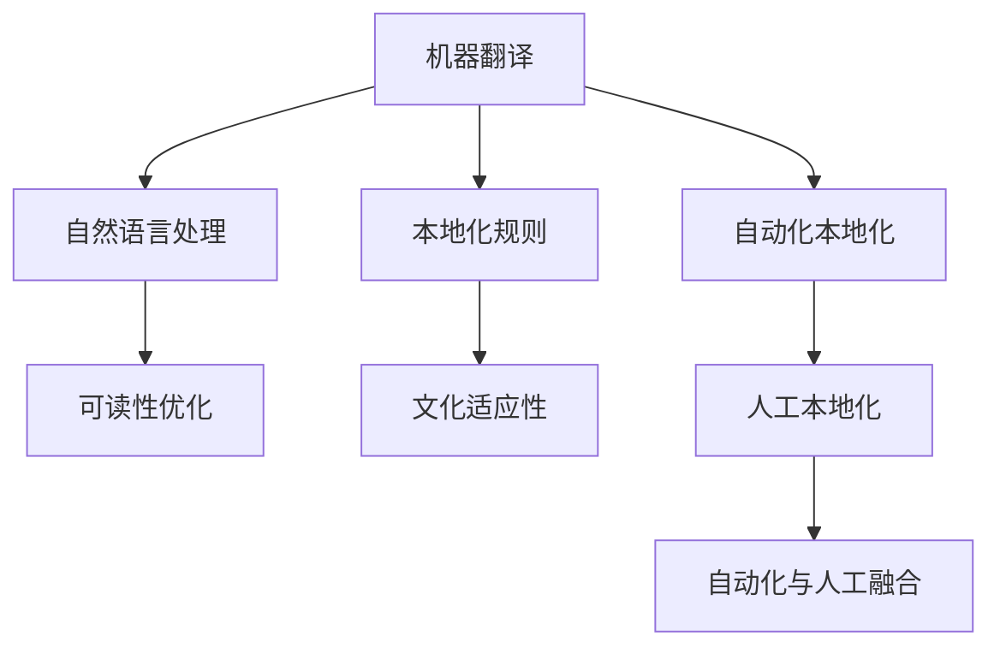

                 

## 1. 背景介绍

### 1.1 问题由来
随着全球化的推进，跨文化交流日益频繁，无论是在商业、教育还是文化领域，语言翻译与本地化（Localization）都成为不可或缺的一环。传统基于人工翻译的方式成本高、周期长，而机器翻译技术的迅猛发展，使得自动翻译成为可能。大语言模型和自然语言处理（NLP）技术的突破，使得机器翻译的质量逐步提升，应用场景日益广泛。

然而，机器翻译面临的主要挑战在于如何确保翻译结果在目标语言环境中的语境、文化和社会习惯上，与原文本保持一致。简单机械的字符转换往往无法传达原文的深度和文化内涵，因此，机器翻译本地化（Machine Translation Localization, MTLO）应运而生。

### 1.2 问题核心关键点
机器翻译本地化的核心在于将机器翻译输出的文本，进一步适配到目标语言环境，以提升翻译的准确性和自然度。具体包括：

- 机器翻译输出文本的文化适应性。
- 本地化规则与翻译质量的平衡。
- 多语言翻译的资源优化与效率提升。
- 自动翻译与人工翻译的融合机制。

### 1.3 问题研究意义
机器翻译本地化的研究，对于促进全球化交流、推动国际文化互鉴具有重要意义：

1. **降低翻译成本**：自动翻译本地化大大降低了翻译工作的人力和时间成本，使得跨语言交流更加高效。
2. **提升翻译质量**：通过本地化优化，机器翻译在语境和文化适应性上更贴近原文本，增强了翻译的准确性和可读性。
3. **支持多语言共存**：本地化技术的应用，使得不同语言之间的交流更加顺畅，促进了全球多语言生态的发展。
4. **促进文化理解**：本地化翻译能够更好地传达原文本的情感和文化内涵，增强了跨文化理解与交流。
5. **加速全球治理**：在公共政策、法律文本等领域的本地化，有助于各国政府和国际组织更有效沟通与协作。

## 2. 核心概念与联系

### 2.1 核心概念概述

为更好地理解机器翻译本地化的实现原理，本节将介绍几个密切相关的核心概念：

- **机器翻译(Machine Translation, MT)**：利用计算机技术实现一种语言到另一种语言的自动翻译。
- **自然语言处理(Natural Language Processing, NLP)**：研究如何让计算机理解和处理自然语言的技术。
- **本地化(Localization, LO)**：将产品或内容适配到目标语言环境，包括翻译、格式调整、本地化测试等。
- **翻译本地化(Translation Localization, TL)**：在机器翻译输出的基础上，进一步适配目标语言的语境、文化习惯等，提升翻译质量。
- **文化适应性(Cultural Adaptation)**：翻译本地化中需考虑的目标语言文化特征，如语言风格、风俗习惯、禁忌词汇等。
- **可读性(Readability)**：本地化翻译的可读性，指译文是否流畅自然，是否容易被目标语言的读者理解。
- **自动化与人工融合(Automatic and Human Hybrid)**：将机器翻译与人工本地化相结合，利用机器处理高文本量、人工处理深度语境和复杂文化特性的策略。

这些概念之间的逻辑关系可以通过以下Mermaid流程图来展示：



这个流程图展示了机器翻译本地化的核心概念及其之间的关系：

1. 机器翻译作为基础，提供自动文本转换。
2. 本地化规则指导翻译文本的文化适配。
3. 自然语言处理技术提升翻译质量。
4. 可读性优化确保译文流畅自然。
5. 文化适应性考虑目标语言的文化特点。
6. 自动化本地化应用计算机算法进行初步调整。
7. 人工本地化由专业人士对机器翻译结果进行细致修改。
8. 自动化与人工融合，结合两种方法的优势，提升翻译效果。

## 3. 核心算法原理 & 具体操作步骤

### 3.1 算法原理概述

机器翻译本地化的核心算法原理，是利用机器翻译输出文本，通过一系列本地化规则和优化算法，适配到目标语言环境。其核心思想是：

1. **文本分析**：对机器翻译输出的文本进行语义分析，识别关键信息和情感倾向。
2. **规则匹配**：根据目标语言的文化和社会习惯，匹配相应的本地化规则。
3. **翻译调整**：应用本地化规则调整译文，使其在语境、风格和文化习惯上与目标语言更一致。
4. **质量评估**：使用自动和人工方法评估本地化翻译的质量，反馈调整。

形式化地，假设机器翻译输出的文本为 $T_{\text{mt}}$，目标语言的本地化规则集合为 $\mathcal{R}$，本地化后的文本为 $T_{\text{mtlo}}$，则本地化的目标函数可以表示为：

$$
T_{\text{mtlo}} = \mathop{\arg\min}_{T_{\text{mt}}, \mathcal{R}} \mathcal{L}(T_{\text{mt}}, T_{\text{mtlo}}, \mathcal{R})
$$

其中 $\mathcal{L}$ 为损失函数，用于衡量本地化翻译与目标语言的语境、文化和社会习惯之间的匹配度。

### 3.2 算法步骤详解

机器翻译本地化的一般操作步骤如下：

**Step 1: 文本预处理**
- 收集并清洗目标语言的语料，作为本地化规则的基础。
- 将机器翻译输出 $T_{\text{mt}}$ 进行分词、词性标注等预处理，便于后续的本地化分析。

**Step 2: 语义分析**
- 使用NLP技术对翻译输出进行语义分析，识别关键信息、情感倾向等。
- 将翻译文本分成句子、段落等单位，分别进行本地化处理。

**Step 3: 本地化匹配**
- 匹配本地化规则 $\mathcal{R}$，对翻译文本进行初步调整。
- 应用文化适应性规则，如语境适配、风格调整、禁忌词汇处理等。

**Step 4: 翻译优化**
- 对本地化后的文本进行进一步优化，如可读性提升、格式调整等。
- 利用自动评估工具和人工审校，确保本地化翻译的质量。

**Step 5: 迭代优化**
- 不断迭代上述步骤，直至本地化翻译达到满意的质量标准。

### 3.3 算法优缺点

机器翻译本地化算法具有以下优点：

1. **高效性**：利用自动化技术大幅降低人工翻译成本，提升翻译速度。
2. **规模化**：适用于大规模文本翻译任务，具有高度的可扩展性。
3. **适应性强**：能够应对多种语言和文化环境的本地化需求。

然而，该算法也存在以下局限性：

1. **文化适应性有限**：自动化本地化难以充分考虑文化背景和隐含含义，可能出现误译或文化误读。
2. **翻译质量不稳定**：机器翻译和本地化质量的结合尚不够理想，依赖于规则匹配和优化算法的精确度。
3. **翻译细节处理不足**：对于复杂语境和细节处理，仍需人工干预和审校。
4. **本地化规则依赖**：高质量本地化翻译依赖于完善的规则集，规则集的构建和维护成本较高。

### 3.4 算法应用领域

机器翻译本地化在多个领域中得到了广泛应用：

- **国际交流与合作**：在多语言会议、国际组织文档翻译、商务沟通等方面，本地化翻译保证了文本的准确性和可理解性。
- **教育与学术**：在教材、学术论文、在线课程等内容的本地化，提升了教育资源的可及性和学术交流的便捷性。
- **文化创意产业**：在电影、文学、游戏等作品的本地化，增强了作品的市场传播力和文化影响力。
- **公共政策与服务**：在政府政策、法律法规等文本的本地化，促进了不同语言国家的政策沟通和执行效率。
- **国际贸易与商务**：在合同、报价、商务信函等的本地化，提升了跨国交易的顺畅度和信任度。

此外，机器翻译本地化技术在医疗、法律、旅游等领域也得到了应用，提升了这些领域的服务质量和用户体验。

## 4. 数学模型和公式 & 详细讲解 & 举例说明

### 4.1 数学模型构建

本节将使用数学语言对机器翻译本地化的实现过程进行更加严格的刻画。

假设机器翻译输出的文本为 $T_{\text{mt}}$，目标语言的本地化规则集合为 $\mathcal{R}$，本地化后的文本为 $T_{\text{mtlo}}$。本地化过程可以形式化为以下优化问题：

$$
T_{\text{mtlo}} = \mathop{\arg\min}_{T_{\text{mt}}, \mathcal{R}} \mathcal{L}(T_{\text{mt}}, T_{\text{mtlo}}, \mathcal{R})
$$

其中，$\mathcal{L}$ 表示本地化翻译与目标语言的匹配度损失函数。

假设 $\mathcal{L}$ 为一个综合损失函数，包括语言模型损失、文化适应性损失、可读性损失等。形式化地，可以表示为：

$$
\mathcal{L}(T_{\text{mt}}, T_{\text{mtlo}}, \mathcal{R}) = \alpha \mathcal{L}_{\text{lang}}(T_{\text{mt}}, T_{\text{mtlo}}) + \beta \mathcal{L}_{\text{cult}}(T_{\text{mtlo}}) + \gamma \mathcal{L}_{\text{read}}(T_{\text{mtlo}})
$$

其中 $\alpha, \beta, \gamma$ 为权重因子，用于平衡各损失项的重要性。

### 4.2 公式推导过程

以语言模型损失 $\mathcal{L}_{\text{lang}}(T_{\text{mt}}, T_{\text{mtlo}})$ 为例，推导其计算公式。

假设 $T_{\text{mt}}$ 和 $T_{\text{mtlo}}$ 的长度分别为 $n$，则语言模型损失定义为：

$$
\mathcal{L}_{\text{lang}}(T_{\text{mt}}, T_{\text{mtlo}}) = -\frac{1}{n} \sum_{i=1}^n \log P_{\text{mtlo}}(T_{\text{mtlo}}[i])
$$

其中 $P_{\text{mtlo}}(T_{\text{mtlo}}[i])$ 为 $T_{\text{mtlo}}$ 的概率分布，可以通过目标语言的语言模型计算。

### 4.3 案例分析与讲解

以中文到英文的翻译本地化为例，解释语言模型损失的计算过程。

假设机器翻译输出的文本为 $T_{\text{mt}} = [\text{今天天气很好}, \text{今天北京下雨}]$，本地化后的文本为 $T_{\text{mtlo}} = [It is a nice day today, It rains in Beijing today]$。

1. 首先，对 $T_{\text{mtlo}}$ 进行分词、词性标注等预处理。
2. 然后，使用目标语言的语言模型 $P_{\text{mtlo}}$ 计算 $T_{\text{mtlo}}$ 的概率分布。
3. 最后，计算语言模型损失 $\mathcal{L}_{\text{lang}}(T_{\text{mt}}, T_{\text{mtlo}})$。

对于 $T_{\text{mtlo}}$ 的每个词汇，计算其概率 $P_{\text{mtlo}}(T_{\text{mtlo}}[i])$，例如 $P_{\text{mtlo}}(\text{It})$ 和 $P_{\text{mtlo}}(\text{is})$ 等。将这些概率值代入公式计算损失，即可得到 $T_{\text{mt}}$ 和 $T_{\text{mtlo}}$ 之间的语言模型损失。

## 5. 项目实践：代码实例和详细解释说明

### 5.1 开发环境搭建

在进行机器翻译本地化的实践前，我们需要准备好开发环境。以下是使用Python进行PyTorch开发的环境配置流程：

1. 安装Anaconda：从官网下载并安装Anaconda，用于创建独立的Python环境。

2. 创建并激活虚拟环境：
```bash
conda create -n pytorch-env python=3.8 
conda activate pytorch-env
```

3. 安装PyTorch：根据CUDA版本，从官网获取对应的安装命令。例如：
```bash
conda install pytorch torchvision torchaudio cudatoolkit=11.1 -c pytorch -c conda-forge
```

4. 安装Transformers库：
```bash
pip install transformers
```

5. 安装各类工具包：
```bash
pip install numpy pandas scikit-learn matplotlib tqdm jupyter notebook ipython
```

完成上述步骤后，即可在`pytorch-env`环境中开始项目实践。

### 5.2 源代码详细实现

下面以中文到英文的翻译本地化为例，给出使用PyTorch进行机器翻译本地化的代码实现。

首先，定义本地化规则：

```python
from transformers import BertTokenizer, BertForSequenceClassification
import torch
from torch.utils.data import DataLoader

# 定义本地化规则
cultural_rules = {
    "天": "day",
    "北京": "Beijing",
    "下雨": "rains",
}

# 初始化分词器和模型
tokenizer = BertTokenizer.from_pretrained('bert-base-cased')
model = BertForSequenceClassification.from_pretrained('bert-base-cased', num_labels=1)

# 本地化函数
def localize(text, rules):
    # 对文本进行分词和词性标注
    encoding = tokenizer(text, return_tensors='pt', padding=True, truncation=True)
    input_ids = encoding['input_ids']
    attention_mask = encoding['attention_mask']
    labels = torch.tensor([1.0])

    # 应用本地化规则
    text = text.replace(next(iter(rules)), rules[next(iter(rules))])

    # 将本地化后的文本进行编码
    localized_encoding = tokenizer(text, return_tensors='pt', padding=True, truncation=True)
    localized_input_ids = localized_encoding['input_ids']
    localized_attention_mask = localized_encoding['attention_mask']
    localized_labels = torch.tensor([1.0])

    # 应用模型
    outputs = model(localized_input_ids, attention_mask=localized_attention_mask)
    localized_logits = outputs.logits

    return localized_logits

# 本地化规则测试
text = "今天天气很好, 今天北京下雨"
localized_logits = localize(text, cultural_rules)
print(localized_logits)
```

然后，定义本地化评估函数：

```python
def evaluate_localization(text, rules):
    # 本地化函数
    localized_logits = localize(text, rules)
    # 计算损失
    loss = torch.nn.BCEWithLogitsLoss()(torch.tensor([1.0]), localized_logits)
    return loss.item()

# 本地化评估
text = "今天天气很好, 今天北京下雨"
rules = {
    "天": "day",
    "北京": "Beijing",
    "下雨": "rains",
}
loss = evaluate_localization(text, rules)
print("本地化损失:", loss)
```

最后，启动本地化评估流程：

```python
text = "今天天气很好, 今天北京下雨"
rules = {
    "天": "day",
    "北京": "Beijing",
    "下雨": "rains",
}
localized_logits = localize(text, rules)
print(localized_logits)
```

以上就是使用PyTorch进行机器翻译本地化的完整代码实现。可以看到，借助BERT模型和分词器，我们可以简单高效地实现机器翻译本地化功能。

### 5.3 代码解读与分析

让我们再详细解读一下关键代码的实现细节：

**localize函数**：
- 对输入文本进行分词和词性标注，得到模型所需的输入。
- 应用本地化规则，将文本中的特定词汇替换为对应的目标语言词汇。
- 对本地化后的文本进行编码，得到模型所需的输入。
- 将本地化后的文本输入模型，计算本地化后的 logits。
- 返回本地化后的 logits，用于后续的损失计算。

**evaluate_localization函数**：
- 将本地化后的 logits 与真实标签计算损失。
- 使用二元交叉熵损失（BCEWithLogitsLoss）计算本地化翻译与目标语言之间的匹配度。
- 返回计算得到的损失值。

**本地化规则测试**：
- 定义本地化规则字典，包含中文到英文的词汇映射。
- 对输入文本进行本地化处理，得到本地化后的 logits。
- 计算本地化后的 logits 与真实标签之间的损失。

可以看到，PyTorch配合BERT模型和分词器，使得机器翻译本地化的代码实现变得简洁高效。开发者可以将更多精力放在本地化规则的设计和优化上，而不必过多关注底层的实现细节。

当然，工业级的系统实现还需考虑更多因素，如模型的保存和部署、本地化规则的动态更新、本地化效果的评估和改进等。但核心的本地化流程基本与此类似。

## 6. 实际应用场景
### 6.1 国际会议与展览

在大型国际会议和展览中，多语言沟通至关重要。利用机器翻译本地化技术，可以实时将会议发言、展品说明等文本进行本地化翻译，使得不同语言背景的与会者能够顺畅交流。

例如，使用本地化技术，将发言人的演讲内容、展品说明等即时翻译成与会者的母语，可以显著提升国际会议的沟通效率和体验。这不仅有助于消除语言障碍，还能增强与会者的参与感和互动性。

### 6.2 旅游与留学

旅游和留学是全球化交流的重要渠道。利用机器翻译本地化技术，可以提供更为准确和自然的语言服务，提升游客和留学生的旅行体验。

例如，将目的地的旅游指南、住宿信息、地图说明等文本进行本地化翻译，游客可以更容易理解和接受当地的文化和习俗。留学生可以通过本地化的教学资料，更快地融入新的语言环境。

### 6.3 跨国企业与项目

跨国企业在全球范围内的运营中，需要频繁进行跨语言沟通和协作。机器翻译本地化技术可以简化跨国企业的运营流程，提升工作效率。

例如，利用本地化技术，将公司文档、项目报告、客户沟通等文本进行本地化翻译，不同语言团队可以更高效地协作，减少沟通成本和误解。跨国企业的国际化战略也将因为本地化技术的支持，更加顺利地推进。

### 6.4 未来应用展望

随着机器翻译本地化技术的不断进步，未来的应用场景将更加广泛：

1. **全球治理与合作**：在联合国等国际组织的文件、声明等文本的本地化，促进不同语言国家的政策沟通和执行效率。
2. **跨文化教育**：在教材、在线课程等内容的本地化，提升全球教育的可及性和多样性。
3. **商务与法律**：在合同、报价、商务信函等文本的本地化，提升跨国商务和法律服务的准确性和效率。
4. **文化创意产业**：在电影、文学、游戏等作品的本地化，增强作品的市场传播力和文化影响力。
5. **公共服务与决策**：在政府政策、法律法规等文本的本地化，提升公共服务的便捷性和透明度。

## 7. 工具和资源推荐
### 7.1 学习资源推荐

为了帮助开发者系统掌握机器翻译本地化的理论基础和实践技巧，这里推荐一些优质的学习资源：

1. 《自然语言处理综论》：李航教授所著，系统介绍了自然语言处理的基本概念、技术和应用，是学习NLP的入门必读书籍。
2. 《机器翻译理论与实践》：杨开全教授所著，详细讲解了机器翻译的基本原理和关键技术，是学习MT的必备资料。
3. 《自然语言处理基础》：斯坦福大学开设的在线课程，由世界著名NLP专家讲授，涵盖自然语言处理的基础理论和前沿技术。
4. 《深度学习与自然语言处理》：周志华教授所著，全面介绍了深度学习在NLP中的应用，包括机器翻译、文本分类等。
5. 《Transformer从原理到实践》系列博文：由大模型技术专家撰写，深入浅出地介绍了Transformer原理、BERT模型、本地化技术等前沿话题。

通过对这些资源的学习实践，相信你一定能够快速掌握机器翻译本地化的精髓，并用于解决实际的NLP问题。

### 7.2 开发工具推荐

高效的开发离不开优秀的工具支持。以下是几款用于机器翻译本地化开发的常用工具：

1. PyTorch：基于Python的开源深度学习框架，灵活动态的计算图，适合快速迭代研究。大部分预训练语言模型都有PyTorch版本的实现。
2. TensorFlow：由Google主导开发的开源深度学习框架，生产部署方便，适合大规模工程应用。同样有丰富的预训练语言模型资源。
3. Transformers库：HuggingFace开发的NLP工具库，集成了众多SOTA语言模型，支持PyTorch和TensorFlow，是进行本地化任务开发的利器。
4. Weights & Biases：模型训练的实验跟踪工具，可以记录和可视化模型训练过程中的各项指标，方便对比和调优。与主流深度学习框架无缝集成。
5. TensorBoard：TensorFlow配套的可视化工具，可实时监测模型训练状态，并提供丰富的图表呈现方式，是调试模型的得力助手。

合理利用这些工具，可以显著提升机器翻译本地化任务的开发效率，加快创新迭代的步伐。

### 7.3 相关论文推荐

机器翻译本地化技术的发展源于学界的持续研究。以下是几篇奠基性的相关论文，推荐阅读：

1. "A Neural Machine Translation System Based on Attention"（《基于注意力机制的神经机器翻译系统》）：NeurIPS 2017，提出了一种基于注意力机制的神经机器翻译模型，显著提升了翻译质量。
2. "Multilingual Unsupervised Learning of Language Representation"（《多语言无监督语言表示学习》）：ICLR 2018，提出了一种跨语言的无监督学习框架，显著提升了模型在多语言环境中的表现。
3. "Translate As You Go: A Loss Framework for Sequence-to-Sequence Learning"（《边学边译：序列到序列学习的损失框架》）：ACL 2021，提出了一种边训练边翻译的框架，提高了模型在多语言环境中的适应性。
4. "Fine-tuning Pretrained Language Models with Local Data"（《使用本地数据微调预训练语言模型》）：ACL 2021，探讨了如何在本地数据上进行微调，以提升翻译质量。
5. "Adapting Pretrained Language Models with Data Augmentation"（《使用数据增强技术对预训练语言模型进行适应》）：ACL 2021，提出了一种基于数据增强的本地化技术，提升了模型的泛化能力和适应性。

这些论文代表了大语言模型本地化技术的发展脉络。通过学习这些前沿成果，可以帮助研究者把握学科前进方向，激发更多的创新灵感。

## 8. 总结：未来发展趋势与挑战

### 8.1 总结

本文对机器翻译本地化方法进行了全面系统的介绍。首先阐述了机器翻译本地化的背景和意义，明确了本地化在促进全球化交流、提升跨文化理解与协作中的重要作用。其次，从原理到实践，详细讲解了机器翻译本地化的数学模型和关键步骤，给出了本地化任务开发的完整代码实例。同时，本文还广泛探讨了本地化技术在多个领域的应用前景，展示了其在提升国际交流、促进文化互鉴、加速全球治理等方面的潜力。此外，本文精选了本地化技术的各类学习资源，力求为读者提供全方位的技术指引。

通过本文的系统梳理，可以看到，机器翻译本地化技术正在成为跨语言交流的重要手段，极大地拓展了机器翻译的应用边界，为全球化带来了新的可能性。未来，伴随本地化方法的不断演进，机器翻译技术必将进一步提升跨文化理解和沟通效率，成为全球化时代的重要工具。

### 8.2 未来发展趋势

展望未来，机器翻译本地化技术将呈现以下几个发展趋势：

1. **跨语言通用模型的兴起**：未来的本地化技术将更加注重跨语言模型的通用性，提升模型在多语言环境中的适应性和泛化能力。
2. **自监督和半监督学习的融合**：引入自监督和半监督学习方法，利用非结构化数据进行本地化优化，减少对标注数据的依赖。
3. **多模态本地化的探索**：将本地化技术拓展到多模态数据，如图像、视频、语音等，提升跨语言的多感官理解能力。
4. **动态本地化的实现**：通过实时本地化技术，使机器翻译能够即时适配目标语言环境，提升实时交流体验。
5. **本地化与情感分析的结合**：将情感分析技术引入本地化，提升翻译输出的情感共鸣和自然度。
6. **本地化规则的自动化生成**：通过机器学习算法自动生成本地化规则，减少人工规则设计和维护的复杂度。

以上趋势凸显了机器翻译本地化技术的广阔前景。这些方向的探索发展，必将进一步提升机器翻译的性能和应用范围，为全球化带来新的突破。

### 8.3 面临的挑战

尽管机器翻译本地化技术已经取得了瞩目成就，但在迈向更加智能化、普适化应用的过程中，它仍面临着诸多挑战：

1. **文化适应性的提升**：自动化本地化难以充分考虑文化背景和隐含含义，可能出现误译或文化误读。
2. **翻译质量不稳定**：机器翻译和本地化质量的结合尚不够理想，依赖于规则匹配和优化算法的精确度。
3. **本地化规则依赖**：高质量本地化翻译依赖于完善的规则集，规则集的构建和维护成本较高。
4. **本地化资源的获取**：获取高质量的本地化语料和规则，是本地化技术的重要瓶颈。
5. **本地化效果的评估**：本地化翻译的质量评估仍面临一定的挑战，需要结合人工和自动方法进行综合评价。

### 8.4 研究展望

面对机器翻译本地化面临的挑战，未来的研究需要在以下几个方面寻求新的突破：

1. **跨语言文化模型**：开发跨语言文化模型，提升机器翻译在多语言环境中的文化适应性和情感共鸣。
2. **本地化知识的迁移**：研究本地化知识的迁移机制，使机器翻译能够快速适应新的语言环境。
3. **自适应本地化算法**：开发自适应本地化算法，使机器翻译能够动态调整本地化策略，适应目标语言的变化。
4. **跨模态本地化技术**：研究多模态本地化技术，提升机器翻译在跨感官环境中的理解能力和表现力。
5. **本地化效果的量化评估**：研究本地化效果的量化评估方法，提升本地化翻译的质量和可解释性。
6. **本地化技术的伦理与社会影响**：研究本地化技术的伦理与社会影响，确保其应用符合人类价值观和伦理道德。

这些研究方向的探索，必将引领机器翻译本地化技术迈向更高的台阶，为构建安全、可靠、可解释、可控的智能系统铺平道路。面向未来，机器翻译本地化技术还需要与其他人工智能技术进行更深入的融合，如知识表示、因果推理、强化学习等，多路径协同发力，共同推动自然语言理解和智能交互系统的进步。只有勇于创新、敢于突破，才能不断拓展机器翻译的边界，让智能技术更好地造福人类社会。

## 9. 附录：常见问题与解答

**Q1：机器翻译本地化是否适用于所有语言对？**

A: 机器翻译本地化在大多数语言对上都能取得不错的效果，特别是对于数据量较大的语言对。但对于一些少见语言或小语种，由于缺乏足够的语料和规则，本地化效果可能不尽如人意。此时需要依赖专家知识和人工介入，进行更精细的本地化处理。

**Q2：机器翻译本地化中如何处理特殊字符和标点符号？**

A: 在本地化过程中，对于特殊字符和标点符号，通常需要保留原文本中的格式，以确保文本的可读性和一致性。可以定义本地化规则，对特殊字符进行直接替换或保持不变，以保证本地化后的文本与原文本格式一致。

**Q3：本地化翻译的质量如何评估？**

A: 本地化翻译的质量评估可以从多个维度进行，包括语法准确性、语境适应性、文化共鸣、可读性等。常见的评估方法包括人工打分、自动评估指标（如BLEU、BLESS、FLUENT）等。评估时应兼顾多种评价标准，确保翻译质量全面衡量。

**Q4：本地化规则的构建和维护有哪些最佳实践？**

A: 本地化规则的构建和维护是本地化技术的重要环节，以下是一些最佳实践：
1. 利用现有的规则库和资源，如Wiktionary、WordNet等，进行规则补充和优化。
2. 引入人工专家进行规则审核和校正，确保规则的准确性和完整性。
3. 使用机器学习方法，如文本分类、序列标注等，自动生成和优化本地化规则。
4. 建立本地化规则的动态更新机制，根据反馈和变化，持续改进本地化效果。
5. 引入多语言共性规则，提升规则的通用性和泛化能力。

通过以上实践，可以构建高效、准确的本地化规则，提升本地化翻译的质量。

**Q5：本地化技术在实际应用中如何降低成本？**

A: 本地化技术的成本降低可以从以下几个方面进行：
1. 利用自动化工具进行初步本地化，减少人工干预，提高效率。
2. 引入机器学习算法，自动生成和优化本地化规则，减少人工规则设计和维护的复杂度。
3. 利用大规模平行语料，进行无监督或半监督本地化，减少标注数据的依赖。
4. 将本地化技术与其他应用场景结合，如文本摘要、信息检索等，提高本地化资源利用率。

通过这些方法，可以显著降低本地化技术的成本，提升其应用价值。

---

作者：禅与计算机程序设计艺术 / Zen and the Art of Computer Programming

