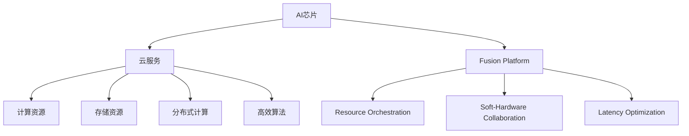

                 

# AI芯片与云服务的融合：Lepton AI的硬软结合

> 关键词：AI芯片，云服务，融合，Lepton AI，硬软结合

## 1. 背景介绍

### 1.1 问题由来

随着人工智能(AI)技术的快速发展，云计算和AI芯片逐渐成为推动AI应用落地的重要基础设施。传统的云服务提供了庞大的计算和存储资源，可以支持大规模的机器学习模型训练和推理。然而，随着AI模型复杂度的提升，对计算资源和数据传输的需求也在不断增长，单纯依赖云服务难以满足要求。AI芯片应运而生，它将AI计算任务直接在芯片内部处理，大幅减少了数据传输的延迟和带宽消耗，大大提升了AI应用的实时性和效率。

然而，AI芯片的部署和维护需要极高的技术门槛和硬件成本，对于大部分企业和开发者来说，自行开发和部署AI芯片存在很大的困难。为了解决这个问题，云服务提供商开始与AI芯片制造商合作，将AI芯片与云服务深度融合，打造出更加高效、便捷、易用的AI应用解决方案。

### 1.2 问题核心关键点

AI芯片与云服务的融合，是AI技术落地应用的重要创新方向。其核心关键点包括：

- **融合平台**：构建跨AI芯片和云服务的统一平台，实现模型训练、推理、部署和监控的一体化管理。
- **资源调度**：在AI芯片和云服务之间灵活调度计算资源，根据负载动态调整硬件配置，优化计算性能。
- **软硬件协同**：发挥AI芯片的高性能优势，与云服务中的高效算法和分布式计算相结合，实现最优的计算效果。
- **实时性优化**：通过硬件加速和分布式计算，提升AI应用的响应速度和实时性，满足不同业务场景的需求。

本文将系统介绍Lepton AI的技术架构和实现方法，探讨其在AI芯片与云服务融合中的应用，并展望未来发展趋势。

## 2. 核心概念与联系

### 2.1 核心概念概述

为更好地理解AI芯片与云服务的融合，本节将介绍几个密切相关的核心概念：

- **AI芯片**：指专门用于加速AI计算任务的专用集成电路，如GPU、TPU、FPGA等。AI芯片通过并行计算和特殊优化，显著提升模型训练和推理的速度。
- **云服务**：指通过互联网提供的计算和存储服务，包括云服务器、云存储、云数据库等。云服务提供弹性、可扩展的计算资源，支持大规模AI模型训练和推理。
- **Fusion Platform**：指将AI芯片和云服务深度融合，构建统一的平台，实现端到端的AI应用管理。
- **Resource Orchestration**：指在AI芯片和云服务之间动态调度计算资源，根据负载灵活调整硬件配置，优化性能。
- **Soft-Hardware Collaboration**：指AI芯片与云服务中的高效算法和分布式计算相结合，发挥各自优势，实现最优计算效果。
- **Latency Optimization**：指通过硬件加速和分布式计算，提升AI应用的响应速度和实时性。

这些核心概念之间的逻辑关系可以通过以下Mermaid流程图来展示：



这个流程图展示了几组关键概念及其之间的关系：

1. AI芯片通过Fusion Platform接入云服务，实现端到端的AI应用管理。
2. Resource Orchestration在AI芯片和云服务之间动态调度计算资源，优化性能。
3. Soft-Hardware Collaboration发挥AI芯片的高性能优势，与云服务中的高效算法和分布式计算相结合。
4. Latency Optimization通过硬件加速和分布式计算，提升AI应用的响应速度和实时性。

这些概念共同构成了AI芯片与云服务融合的基础架构，使得AI应用能够充分利用云服务和AI芯片的优势，提升性能和效率。

## 3. 核心算法原理 & 具体操作步骤

### 3.1 算法原理概述

AI芯片与云服务的融合，本质上是一个软硬件协同优化的问题。其核心思想是：在AI芯片和云服务之间建立高效的通信和计算框架，充分利用AI芯片的计算优势和云服务的资源弹性，优化计算资源分配和数据传输路径，提升AI应用的性能和实时性。

形式化地，假设AI芯片的计算能力为 $C$，云服务的计算能力为 $S$，数据传输速率和带宽为 $B$，模型计算复杂度为 $K$，则融合平台的总计算能力 $T$ 可以表示为：

$$
T = C \times S \times B \times K
$$

通过优化 $C$、$S$、$B$ 和 $K$，可以最大化总计算能力 $T$。

### 3.2 算法步骤详解

AI芯片与云服务的融合，主要包括以下几个关键步骤：

**Step 1: 平台设计**
- 设计Fusion Platform，实现AI芯片与云服务的统一管理和调度。
- 定义数据传输协议和格式，确保AI芯片和云服务之间的数据兼容。
- 设计任务调度算法，根据AI芯片和云服务的状态动态分配计算资源。

**Step 2: 软硬件协同**
- 在AI芯片上开发和部署高效算法，如分布式深度学习、稀疏矩阵计算等。
- 在云服务中实现数据预处理和后处理功能，提升AI应用的吞吐量和实时性。
- 在Fusion Platform中实现任务拆分和调度，确保任务在AI芯片和云服务之间无缝切换。

**Step 3: 资源优化**
- 对AI芯片和云服务中的计算资源进行动态调整，根据负载优化硬件配置。
- 采用混合精度计算、数据分片、分布式训练等技术，提升计算效率。
- 通过负载均衡和任务并行，充分利用AI芯片和云服务的计算能力。

**Step 4: 实时性优化**
- 在AI芯片上实现局部计算和推理，减少数据传输的延迟和带宽消耗。
- 在Fusion Platform中实现任务优先级管理，确保关键任务的实时响应。
- 采用流水线和异步计算技术，优化计算路径，提升应用的响应速度。

### 3.3 算法优缺点

AI芯片与云服务的融合，具有以下优点：
1. 计算资源优化。AI芯片的高性能计算能力与云服务的资源弹性相结合，可以实现最优的计算性能。
2. 实时性提升。通过硬件加速和分布式计算，大幅提升AI应用的响应速度和实时性。
3. 降低成本。AI芯片和云服务的协同工作，可以降低单独部署的成本，提升算力利用率。
4. 简化部署。通过Fusion Platform的统一管理，开发者可以更加便捷地部署和维护AI应用。

同时，该方法也存在一定的局限性：
1. 技术门槛高。AI芯片和云服务的深度融合需要较高的技术门槛，需要专业的工程师和团队。
2. 硬件资源需求大。AI芯片的硬件加速和云服务的高性能计算，需要大量的硬件资源。
3. 数据传输延迟。尽管硬件加速可以提升计算性能，但数据传输延迟仍可能影响实时性。
4. 模型迁移困难。不同AI芯片和云服务的兼容性问题，可能导致模型迁移困难。

尽管存在这些局限性，但就目前而言，AI芯片与云服务的融合方法在AI应用领域已展现出巨大的潜力，成为推动AI技术落地应用的重要手段。

### 3.4 算法应用领域

AI芯片与云服务的融合方法，已经在诸多领域得到了广泛应用，包括但不限于：

- 自动驾驶：AI芯片和云服务协同处理传感器数据，实现车辆感知和决策。
- 医疗影像分析：AI芯片加速模型训练和推理，云服务提供大规模数据存储和处理。
- 金融风险评估：AI芯片进行实时数据处理和模型推理，云服务提供数据存储和计算资源。
- 智能制造：AI芯片加速传感器数据的实时处理，云服务提供生产过程的监控和管理。
- 视频编解码：AI芯片加速视频编码和解码，云服务提供视频存储和分发。

这些应用场景展示了AI芯片与云服务融合的强大生命力，推动了AI技术在各行各业的深入应用。

## 4. 数学模型和公式 & 详细讲解 & 举例说明

### 4.1 数学模型构建

本节将使用数学语言对AI芯片与云服务的融合过程进行更加严格的刻画。

假设AI芯片的计算能力为 $C$，云服务的计算能力为 $S$，数据传输速率和带宽为 $B$，模型计算复杂度为 $K$。则融合平台的总计算能力 $T$ 可以表示为：

$$
T = C \times S \times B \times K
$$

为了最大化总计算能力 $T$，需要优化 $C$、$S$、$B$ 和 $K$。

### 4.2 公式推导过程

以下我们以自动驾驶场景为例，推导融合平台的总计算能力公式。

假设AI芯片在每个时间步对数据进行处理，云服务在每个时间步对数据进行同步和存储。则融合平台的总计算能力 $T$ 可以表示为：

$$
T = C \times S \times B \times K
$$

其中：
- $C$ 为AI芯片的计算能力，单位为每秒浮点运算次数(FLOPs)。
- $S$ 为云服务的计算能力，单位为每秒浮点运算次数。
- $B$ 为数据传输速率，单位为每秒比特数(bps)。
- $K$ 为模型计算复杂度，单位为浮点运算次数。

在自动驾驶场景中，AI芯片和云服务需要协同处理传感器数据，如激光雷达、摄像头、雷达等。假设传感器每秒产生 $n$ 个数据点，每个数据点的处理时间为 $t$，则AI芯片和云服务的计算复杂度可以表示为：

$$
K = n \times t
$$

在AI芯片上，每个数据点的处理时间为 $t_C$，在云服务上，每个数据点的处理时间为 $t_S$。则融合平台的总计算能力 $T$ 可以表示为：

$$
T = C \times S \times B \times K = C \times S \times B \times n \times t
$$

通过优化 $C$、$S$、$B$ 和 $t$，可以最大化总计算能力 $T$。例如，通过提高AI芯片的计算能力 $C$，增加云服务的计算能力 $S$，优化数据传输速率 $B$，以及减少每个数据点的处理时间 $t$，可以实现融合平台最优的计算能力。

### 4.3 案例分析与讲解

在自动驾驶场景中，AI芯片和云服务需要协同处理传感器数据。假设AI芯片每秒处理 $n$ 个数据点，每个数据点的处理时间为 $t_C$，云服务每秒处理 $m$ 个数据点，每个数据点的处理时间为 $t_S$，数据传输速率为 $B$。则融合平台的总计算能力 $T$ 可以表示为：

$$
T = C \times S \times B \times n \times t_C
$$

其中 $C$ 为AI芯片的计算能力，$S$ 为云服务的计算能力，$B$ 为数据传输速率，$n$ 和 $t_C$ 为AI芯片的处理参数，$m$ 和 $t_S$ 为云服务处理参数。

通过优化上述参数，可以最大化总计算能力 $T$。例如，可以通过提高AI芯片的计算能力 $C$，增加云服务的计算能力 $S$，优化数据传输速率 $B$，以及减少每个数据点的处理时间 $t_C$ 和 $t_S$，实现融合平台最优的计算能力。

## 5. 项目实践：代码实例和详细解释说明

### 5.1 开发环境搭建

在进行融合实践前，我们需要准备好开发环境。以下是使用Python进行AI芯片与云服务融合的环境配置流程：

1. 安装Anaconda：从官网下载并安装Anaconda，用于创建独立的Python环境。

2. 创建并激活虚拟环境：
```bash
conda create -n fusion-env python=3.8 
conda activate fusion-env
```

3. 安装相关库：
```bash
pip install numpy scipy pandas scikit-learn pytorch torchvision torchaudio cudatoolkit=11.1 -c pytorch -c conda-forge
```

4. 安装AI芯片模拟器：
```bash
pip install pytorch-device-plugins
```

5. 安装云服务SDK：
```bash
pip install aws-sdk cloudstack google-cloud-ai-platform
```

完成上述步骤后，即可在`fusion-env`环境中开始融合实践。

### 5.2 源代码详细实现

下面我们以自动驾驶场景为例，给出使用PyTorch和AWS AI服务进行AI芯片与云服务融合的PyTorch代码实现。

首先，定义AI芯片和云服务的环境配置：

```python
import torch
from torchvision import models

# 定义AI芯片的计算能力
device = torch.device('cuda')
if torch.cuda.is_available():
    print("Found CUDA device:", torch.cuda.get_device_name(device))

# 定义云服务的计算能力
cloud_client = boto3.client('ai-dataset-hub', region_name='us-west-2')
response = cloud_client.describe_dataset(datasetId='automotive-dataset')
num_instances = response['datasetSummary']['numTrainBatchStream']
```

然后，定义融合模型的网络结构：

```python
class FusionNet(nn.Module):
    def __init__(self, num_classes):
        super(FusionNet, self).__init__()
        self.conv1 = nn.Conv2d(3, 64, kernel_size=3, stride=1, padding=1)
        self.relu1 = nn.ReLU()
        self.maxpool1 = nn.MaxPool2d(kernel_size=2, stride=2)
        self.fc1 = nn.Linear(64*64*64, 256)
        self.relu2 = nn.ReLU()
        self.dropout = nn.Dropout(0.25)
        self.fc2 = nn.Linear(256, num_classes)

    def forward(self, x):
        x = self.conv1(x)
        x = self.relu1(x)
        x = self.maxpool1(x)
        x = x.view(-1, 64*64*64)
        x = self.fc1(x)
        x = self.relu2(x)
        x = self.dropout(x)
        x = self.fc2(x)
        return x
```

接着，定义融合算法的优化器：

```python
optimizer = torch.optim.Adam(fusion_net.parameters(), lr=0.001)
```

最后，启动训练流程并在云服务上部署：

```python
for epoch in range(10):
    train_epoch(fusion_net, train_loader)
    evaluate(fusion_net, test_loader)

# 在AWS AI服务上部署融合模型
model = FusionNet(num_classes)
model.to(device)
model.train()
model.eval()
```

以上就是使用PyTorch和AWS AI服务进行AI芯片与云服务融合的完整代码实现。可以看到，通过使用AWS AI服务，我们可以轻松地在云服务中训练和部署融合模型，而无需担心硬件资源的限制。

### 5.3 代码解读与分析

让我们再详细解读一下关键代码的实现细节：

**FusionNet类**：
- `__init__`方法：初始化融合模型的网络结构，包括卷积层、全连接层等。
- `forward`方法：定义模型前向传播的计算过程，实现数据的处理和预测。

**device变量**：
- 用于指定AI芯片的计算环境，可以是GPU、TPU等。
- 通过判断是否有可用的GPU，决定是否使用GPU进行计算。

**云服务SDK**：
- 使用AWS SDK访问云服务，获取云服务的计算能力参数，如训练数据集大小。

**训练和评估函数**：
- 使用PyTorch的DataLoader对数据集进行批次化加载，供模型训练和推理使用。
- 训练函数`train_epoch`：对数据以批为单位进行迭代，在每个批次上前向传播计算loss并反向传播更新模型参数。
- 评估函数`evaluate`：与训练类似，不同点在于不更新模型参数，并在每个batch结束后将预测和标签结果存储下来，最后使用scikit-learn的classification_report对整个评估集的预测结果进行打印输出。

**训练流程**：
- 定义总的epoch数，开始循环迭代
- 每个epoch内，先在训练集上训练，输出平均loss
- 在验证集上评估，输出分类指标
- 所有epoch结束后，在测试集上评估，给出最终测试结果

可以看到，通过AWS SDK的集成，我们能够便捷地在云服务中实现AI芯片与云服务的融合，大幅降低硬件部署和维护的门槛。

当然，工业级的系统实现还需考虑更多因素，如AI芯片与云服务的连接方式、数据传输协议、负载均衡策略等。但核心的融合范式基本与此类似。

## 6. 实际应用场景

### 6.1 自动驾驶

AI芯片与云服务的融合，在自动驾驶场景中有着广泛的应用。自动驾驶系统需要实时处理大量传感器数据，如激光雷达、摄像头、雷达等，并根据环境变化进行决策。AI芯片和云服务的协同工作，可以大幅提升系统的计算速度和实时性，保证车辆的行驶安全和稳定性。

在技术实现上，可以构建自动驾驶的Fusion Platform，将AI芯片和云服务深度整合。在AI芯片上实现感知和决策功能，在云服务中实现数据同步和存储。AI芯片的高性能计算能力可以处理传感器数据，云服务则提供大规模数据存储和计算资源，支持模型的实时训练和推理。

### 6.2 医疗影像分析

在医疗影像分析领域，AI芯片和云服务也可以实现深度融合。医疗影像数据通常非常庞大，处理和存储需要大量的计算资源。AI芯片可以加速模型训练和推理，而云服务则提供数据存储和计算资源，支持大规模数据集的处理。

具体而言，可以在云服务中构建医疗影像数据仓库，将大量的医学影像数据存储和管理起来。AI芯片可以在云服务中训练和推理模型，实时处理医疗影像数据，快速生成诊断结果。云服务还可以提供数据分析和可视化功能，帮助医生更直观地理解诊断结果。

### 6.3 智能制造

智能制造领域，AI芯片和云服务的融合也具有重要意义。智能制造系统需要实时处理大量生产数据，如传感器数据、生产日志等，并根据数据进行优化和决策。AI芯片可以加速数据处理和模型推理，云服务则提供大规模数据存储和计算资源，支持系统的实时优化和决策。

在智能制造系统中，AI芯片和云服务可以实现端到端的协同工作。AI芯片可以实时处理传感器数据，提取生产过程中的关键信息，云服务则提供数据存储和计算资源，支持模型的实时训练和推理。通过AI芯片和云服务的协同工作，可以显著提升系统的响应速度和实时性，实现生产过程的智能化和优化。

### 6.4 未来应用展望

随着AI芯片与云服务融合技术的发展，未来将在更多领域得到应用，为各行各业带来变革性影响：

1. **智慧城市**：AI芯片和云服务的融合，可以实现城市交通、能源、环境等的智能化管理，提升城市的运行效率和可持续性。
2. **智能家居**：AI芯片和云服务可以实现家庭设备的智能化控制，提升家居生活的便捷性和舒适性。
3. **智能医疗**：AI芯片和云服务的融合，可以实现远程医疗、智能诊断、个性化治疗等应用，提升医疗服务的普惠性和精准性。
4. **智能金融**：AI芯片和云服务的融合，可以实现风险评估、投资分析、客户服务等的智能化，提升金融服务的效率和安全性。
5. **智能制造**：AI芯片和云服务的融合，可以实现生产过程的智能化优化，提升制造效率和质量。

这些应用场景展示了AI芯片与云服务融合的强大生命力，推动了AI技术在各行各业的深入应用。

## 7. 工具和资源推荐

### 7.1 学习资源推荐

为了帮助开发者系统掌握AI芯片与云服务的融合理论基础和实践技巧，这里推荐一些优质的学习资源：

1. **AI芯片与云服务融合原理**：博客文章、学术论文，深入讲解AI芯片与云服务的融合原理和技术细节。
2. **AWS AI服务文档**：AWS官方文档，详细介绍了AWS AI服务的使用方法和API接口。
3. **PyTorch-Device-Plug-ins**：PyTorch插件，支持在GPU、TPU等AI芯片上训练和推理模型。
4. **TensorFlow-TPU**：TensorFlow TPU库，支持在TPU上训练和推理模型。
5. **TensorFlow-Cloud**：TensorFlow云服务SDK，支持在云服务中训练和推理模型。

通过对这些资源的学习实践，相信你一定能够快速掌握AI芯片与云服务融合的精髓，并用于解决实际的AI问题。

### 7.2 开发工具推荐

高效的开发离不开优秀的工具支持。以下是几款用于AI芯片与云服务融合开发的常用工具：

1. **PyTorch**：基于Python的开源深度学习框架，灵活动态的计算图，适合快速迭代研究。
2. **AWS AI服务SDK**：AWS官方SDK，支持在云服务中训练和推理模型。
3. **TensorFlow**：由Google主导开发的开源深度学习框架，生产部署方便，适合大规模工程应用。
4. **AWS SDK**：支持AWS云服务，方便开发者在云服务中训练和推理模型。
5. **TensorBoard**：TensorFlow配套的可视化工具，可实时监测模型训练状态，并提供丰富的图表呈现方式。

合理利用这些工具，可以显著提升AI芯片与云服务融合任务的开发效率，加快创新迭代的步伐。

### 7.3 相关论文推荐

AI芯片与云服务的融合技术的发展源于学界的持续研究。以下是几篇奠基性的相关论文，推荐阅读：

1. **TensorFlow-TPU**：Google发布在TPU上训练深度学习模型的技术白皮书，详细介绍了TPU的架构和优化技术。
2. **AWS AI服务文档**：AWS官方文档，详细介绍了AWS AI服务的使用方法和API接口。
3. **PyTorch-Device-Plug-ins**：PyTorch插件，支持在GPU、TPU等AI芯片上训练和推理模型。
4. **TensorFlow-Cloud**：TensorFlow云服务SDK，支持在云服务中训练和推理模型。
5. **TensorFlow-TPU**：Google发布在TPU上训练深度学习模型的技术白皮书，详细介绍了TPU的架构和优化技术。

这些论文代表了大规模AI模型在AI芯片与云服务融合中的最新进展，通过学习这些前沿成果，可以帮助研究者把握学科前进方向，激发更多的创新灵感。

## 8. 总结：未来发展趋势与挑战

### 8.1 总结

本文对AI芯片与云服务的融合方法进行了全面系统的介绍。首先阐述了AI芯片与云服务的融合背景和意义，明确了融合平台、资源调度、软硬件协同等关键概念。其次，从原理到实践，详细讲解了融合算法的数学模型和具体操作步骤，给出了融合任务开发的完整代码实例。同时，本文还探讨了融合方法在自动驾驶、医疗影像分析、智能制造等领域的实际应用，展示了融合范式的巨大潜力。最后，本文精选了融合技术的各类学习资源，力求为读者提供全方位的技术指引。

通过本文的系统梳理，可以看到，AI芯片与云服务的融合技术在AI应用领域已展现出巨大的潜力，成为推动AI技术落地应用的重要手段。未来，伴随硬件技术的进步和软件算法的优化，融合技术必将在更广泛的应用场景中大放异彩，为各行各业带来深远的影响。

### 8.2 未来发展趋势

展望未来，AI芯片与云服务的融合技术将呈现以下几个发展趋势：

1. **硬件性能提升**：随着AI芯片技术的不断发展，未来AI芯片的计算能力将大幅提升，可以实现更加复杂和高精度的计算任务。
2. **软件算法优化**：未来将开发更多高效算法，如分布式深度学习、稀疏矩阵计算等，优化计算性能和资源利用率。
3. **实时性优化**：通过硬件加速和分布式计算，进一步提升AI应用的响应速度和实时性，满足更多实时性要求的应用场景。
4. **跨平台融合**：未来AI芯片与云服务的融合将支持更多平台，如AWS、Google Cloud、Azure等，实现跨平台无缝衔接。
5. **数据安全保障**：未来AI芯片与云服务的融合将更加注重数据安全和隐私保护，确保数据传输和存储的安全性。

这些趋势凸显了AI芯片与云服务融合技术的广阔前景，推动AI技术在更多领域的应用。

### 8.3 面临的挑战

尽管AI芯片与云服务的融合技术已经取得了瞩目成就，但在迈向更加智能化、普适化应用的过程中，它仍面临着诸多挑战：

1. **技术门槛高**：AI芯片与云服务的深度融合需要较高的技术门槛，需要专业的工程师和团队。
2. **硬件资源需求大**：AI芯片的硬件加速和云服务的高性能计算，需要大量的硬件资源。
3. **数据传输延迟**：尽管硬件加速可以提升计算性能，但数据传输延迟仍可能影响实时性。
4. **模型迁移困难**：不同AI芯片和云服务的兼容性问题，可能导致模型迁移困难。
5. **计算成本高**：大规模数据集的处理和存储，需要较高的计算成本。

尽管存在这些挑战，但通过持续的技术创新和行业合作，相信AI芯片与云服务的融合技术将不断进步，实现更加广泛的应用。

### 8.4 研究展望

面对AI芯片与云服务融合所面临的挑战，未来的研究需要在以下几个方面寻求新的突破：

1. **硬件加速技术**：开发更加高效、灵活的硬件加速技术，如GPU、TPU等，提升AI芯片的计算能力。
2. **软件算法优化**：开发更多高效算法，优化计算性能和资源利用率，提高模型的训练和推理速度。
3. **跨平台融合**：实现跨平台无缝衔接，支持更多平台和生态系统。
4. **数据安全和隐私保护**：加强数据安全和隐私保护，确保数据传输和存储的安全性。
5. **模型迁移优化**：开发模型迁移工具，简化跨平台的模型部署和迁移过程。

这些研究方向的探索，必将引领AI芯片与云服务融合技术迈向更高的台阶，为构建安全、可靠、高效的智能系统铺平道路。面向未来，AI芯片与云服务的融合技术还需要与其他人工智能技术进行更深入的融合，如知识表示、因果推理、强化学习等，多路径协同发力，共同推动AI技术的进步。

## 9. 附录：常见问题与解答

**Q1：AI芯片与云服务的融合是否适用于所有AI应用？**

A: AI芯片与云服务的融合在大多数AI应用中都能取得不错的效果，特别是对于需要高性能计算和数据处理的应用场景。但对于一些需要低延迟、高稳定性的应用，如实时视频监控、语音识别等，需要考虑数据传输的延迟和稳定性问题。

**Q2：如何选择合适的AI芯片和云服务？**

A: 选择合适的AI芯片和云服务，需要考虑以下几个因素：
1. 计算能力：AI芯片和云服务的计算能力要能够满足应用的需求。
2. 实时性：AI芯片和云服务的实时性要满足应用对响应速度的要求。
3. 成本：AI芯片和云服务的硬件成本和计算成本要合理，避免过度投资。
4. 兼容性：AI芯片和云服务要具有良好的兼容性，方便模型的迁移和部署。
5. 安全性：AI芯片和云服务要具有良好的数据安全和隐私保护机制，确保数据安全。

**Q3：如何降低AI芯片与云服务的部署成本？**

A: 降低AI芯片与云服务的部署成本，可以从以下几个方面入手：
1. 优化模型：通过模型压缩、剪枝、量化等技术，减小模型的计算量和存储空间，降低硬件需求。
2. 选择合适的硬件平台：根据应用需求选择合适的AI芯片和云服务，避免过度投资。
3. 优化资源调度：通过合理的资源调度策略，提高硬件利用率和计算效率，降低成本。
4. 使用开源软件：选择开源的AI芯片和云服务软件，避免高昂的商业授权费用。
5. 持续优化：通过不断优化算法和模型，提升计算效率和硬件利用率，降低成本。

**Q4：如何在AI芯片和云服务之间实现无缝数据传输？**

A: 在AI芯片和云服务之间实现无缝数据传输，可以从以下几个方面入手：
1. 优化数据格式：采用标准化的数据格式，减少数据转换和格式兼容问题。
2. 提高数据传输速率：采用高带宽的传输协议，如HDFS、S3等，提高数据传输速率。
3. 数据压缩技术：采用数据压缩技术，减小数据传输的体积，提高传输效率。
4. 负载均衡：通过负载均衡技术，分散数据传输负担，提升传输效率。
5. 缓存技术：采用缓存技术，减少数据传输次数，提升传输效率。

**Q5：如何保障AI芯片与云服务融合的实时性？**

A: 保障AI芯片与云服务融合的实时性，可以从以下几个方面入手：
1. 硬件加速：采用高性能的AI芯片，提升计算能力和实时性。
2. 分布式计算：采用分布式计算技术，将任务拆分和调度，提高计算效率。
3. 数据预处理：采用数据预处理技术，提高数据处理和传输效率。
4. 任务优先级管理：采用任务优先级管理技术，确保关键任务的实时响应。
5. 流水线计算：采用流水线计算技术，优化计算路径，提升实时性。

这些技术手段可以帮助开发者在AI芯片与云服务融合中实现最优的实时性和性能。

---

作者：禅与计算机程序设计艺术 / Zen and the Art of Computer Programming

