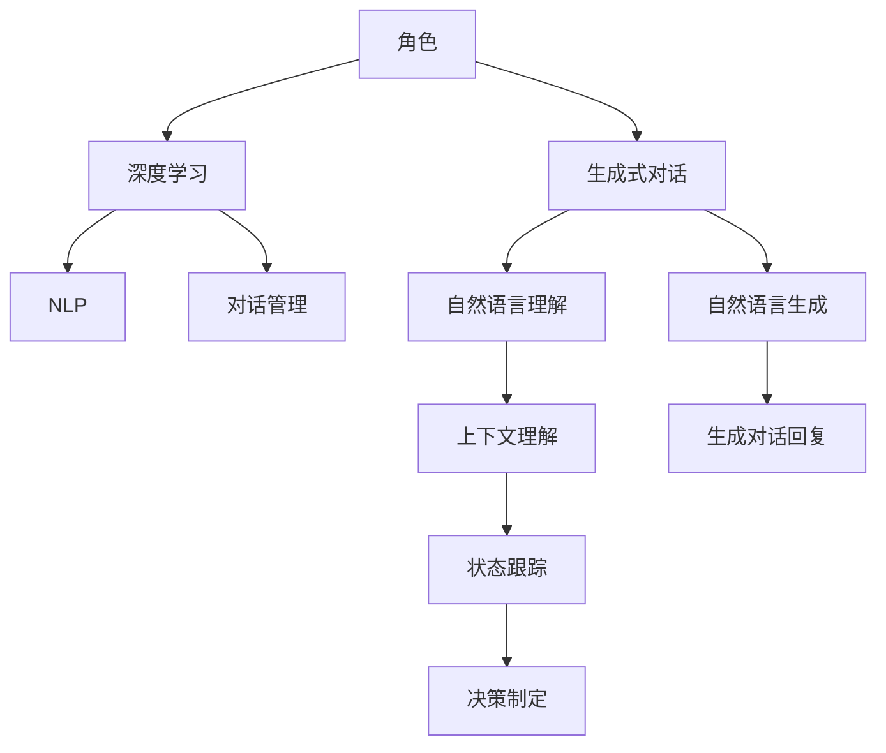

                 

# AI角色对话系统：创造生动的人物互动

> 关键词：角色对话,生成式对话,深度学习,自然语言处理,NLP

## 1. 背景介绍

在当今数字化时代，人工智能已经渗透到我们生活的方方面面，而人机交互（Human-Computer Interaction，HCI）成为了智能技术普及的关键。角色对话系统作为人机交互的重要手段，正受到越来越多的关注。在角色对话系统中，用户可以通过与虚构角色互动，获得丰富的情感体验和实用信息，从而进一步推动人工智能技术的普及和应用。

角色对话系统通过深度学习和大数据技术，能够根据用户输入生成自然且具有一定逻辑的对话回复。尽管这类系统已经相当普及，但如何创造生动且能持续互动的角色，依然是当前的一大挑战。本文将系统介绍角色对话系统的核心概念、原理以及当前的前沿技术，并展望未来发展趋势与面临的挑战。

## 2. 核心概念与联系

### 2.1 核心概念概述

角色对话系统（Character Dialogue System），即让机器模拟特定人物或角色与用户进行自然语言交互的系统。这类系统可以模拟不同性格、职业、背景的角色，以增加用户的沉浸感和体验。角色对话系统的应用场景非常广泛，包括但不限于：

- 游戏聊天机器人：在游戏中提供角色互动，增强玩家体验。
- 客服机器人：模拟各类客服角色，解答用户问题。
- 心理咨询机器人：模拟心理医生角色，为用户提供心理支持。
- 教育机器人：模拟教师角色，引导学习过程。

角色对话系统的构建涉及多个核心概念，主要包括：

- **生成式对话（Generative Dialogue）**：通过深度学习技术，让机器根据用户输入自动生成自然流畅的对话回复。
- **深度学习（Deep Learning）**：利用深度神经网络对大量数据进行训练，使机器能够理解和生成复杂的语言结构。
- **自然语言处理（NLP）**：专注于计算机如何理解、解析和生成人类语言，是角色对话系统的重要基础。
- **对话管理（Dialogue Management）**：负责对话的上下文理解、状态跟踪和决策制定，确保对话的连贯性和逻辑性。

这些概念紧密联系，共同构建了角色对话系统的基础框架。通过深度学习和大数据分析，系统可以模拟角色进行自然对话，同时通过对话管理模块确保对话的逻辑性和连贯性。

### 2.2 核心概念原理和架构的 Mermaid 流程图



这个流程图展示了角色对话系统的主要流程和架构：角色通过生成式对话模块进行对话，对话内容通过深度学习和NLP技术进行理解与生成，对话管理模块则负责上下文理解、状态跟踪和决策制定，确保对话连贯。

## 3. 核心算法原理 & 具体操作步骤

### 3.1 算法原理概述

角色对话系统的核心算法包括自然语言处理（NLP）和生成式对话模型。下面将分别介绍这两个核心算法的工作原理。

**自然语言处理（NLP）**：
- **词向量表示（Word Embedding）**：将单词转换为向量形式，使得计算机可以理解语言的结构和语义。
- **语言模型（Language Model）**：用于预测文本序列的概率分布，通常使用循环神经网络（RNN）或Transformer等架构。
- **上下文理解（Contextual Understanding）**：通过分析上下文，理解用户输入的意图和需求。

**生成式对话模型**：
- **自回归模型（Autoregressive Model）**：按照时间顺序生成文本，如循环神经网络（RNN）和Transformer模型。
- **自编码模型（Autoencoder Model）**：通过编码器-解码器架构，将输入序列映射为隐藏状态，然后解码为输出序列，如变分自编码器（VAE）和生成对抗网络（GAN）。
- **生成对抗网络（GAN）**：通过对抗训练，生成高质量的自然语言文本。

### 3.2 算法步骤详解

角色对话系统的构建主要分为以下几个步骤：

**Step 1: 数据收集与预处理**
- 收集对话数据集，包括角色背景、对话历史和用户意图等信息。
- 对数据进行清洗、分词、标记实体等预处理操作。

**Step 2: 构建生成式对话模型**
- 选择适合的生成模型架构，如RNN、Transformer等。
- 定义损失函数，如交叉熵损失、BLEU等，用于衡量模型生成的对话质量。
- 确定训练参数，如学习率、批大小等。

**Step 3: 训练模型**
- 使用预处理后的对话数据集对模型进行训练。
- 定期评估模型性能，避免过拟合。
- 调整模型参数，优化对话质量。

**Step 4: 对话管理**
- 定义对话状态和转换规则，确保对话逻辑连贯。
- 利用状态跟踪和决策制定模块，控制对话流程。

**Step 5: 系统部署与优化**
- 将训练好的模型部署到服务器或移动设备上。
- 实时监控系统运行情况，进行性能优化和问题调试。
- 收集用户反馈，不断迭代优化模型和对话管理。

### 3.3 算法优缺点

**优点**：
- **自然流畅**：生成的对话能够自然流畅，贴近人类对话习惯。
- **多样化**：不同角色和场景下，对话风格和内容各异，增强用户沉浸感。
- **可扩展性**：模型可以根据需求进行更新和优化，适应不同应用场景。

**缺点**：
- **数据依赖**：高质量的对话数据集是生成对话的关键，获取成本较高。
- **资源消耗**：深度学习模型需要大量计算资源进行训练和推理。
- **上下文理解困难**：对话管理模块需要理解复杂上下文，难度较高。

### 3.4 算法应用领域

角色对话系统已经在多个领域得到广泛应用：

- **娱乐**：在视频游戏和虚拟现实（VR）中，角色对话系统增强用户体验。
- **教育**：教育机器人利用角色对话进行知识传授和问题解答。
- **客服**：客服机器人通过模拟不同角色，为各类用户提供个性化的服务。
- **心理支持**：心理机器人通过模拟心理医生，为患者提供心理咨询和支持。

## 4. 数学模型和公式 & 详细讲解 & 举例说明

### 4.1 数学模型构建

在角色对话系统中，生成式对话模型通常使用基于Transformer的架构，其数学模型构建如下：

设输入序列为 $x_1, x_2, ..., x_n$，目标输出序列为 $y_1, y_2, ..., y_m$，则模型可以定义为：

$$
y_t = f(x_1, x_2, ..., x_t; \theta)
$$

其中 $f$ 表示模型函数，$\theta$ 为模型参数。

### 4.2 公式推导过程

以生成式对话中的自回归模型为例，其公式推导如下：

假设序列 $x$ 和 $y$ 的长度均为 $T$，目标序列 $y$ 的条件概率为：

$$
p(y|x) = \prod_{t=1}^T p(y_t|x_1, x_2, ..., x_t)
$$

其中 $p(y_t|x_1, x_2, ..., x_t)$ 表示目标序列在当前时间步 $t$ 的条件概率。在基于Transformer的模型中，其自回归模型公式为：

$$
p(y_t|x_1, x_2, ..., x_t) = \frac{e^{\log p(y_t|x_1, x_2, ..., x_t)}}{Z(x)}
$$

其中 $Z(x)$ 为归一化因子，确保概率分布的总和为1。在Transformer模型中，其自回归公式可以进一步简化为：

$$
p(y_t|x_1, x_2, ..., x_t) = \frac{e^{(\log \sigma(y_t|x_1, x_2, ..., x_t) + \log \mu(y_t|x_1, x_2, ..., x_t))}}{Z(x)}
$$

其中 $\sigma$ 和 $\mu$ 分别表示预测概率分布的均值和方差。

### 4.3 案例分析与讲解

假设在医疗咨询场景中，对话系统模拟医生与患者交流。输入序列为患者的病情描述，输出序列为医生的诊断建议和建议措施。以某次对话为例，输入序列为：

$$
x = [健康状况差, 经常头疼, 睡眠不好]
$$

系统生成输出序列的过程如下：

1. 首先，系统将输入序列 $x$ 送入编码器，得到隐藏状态 $h$。
2. 根据隐藏状态 $h$ 和当前时间步 $t$ 的输入 $x_t$，生成下一个时间步 $t+1$ 的目标输出 $y_{t+1}$。
3. 重复步骤2，直至生成完整输出序列 $y$。

输出序列可能为：

$$
y = [建议做体检, 注意休息, 建议看神经科]
$$

系统通过不断迭代，生成自然流畅的对话，增强患者的体验和信任。

## 5. 项目实践：代码实例和详细解释说明

### 5.1 开发环境搭建

角色对话系统的构建需要以下开发环境：

1. **Python**：作为系统开发的语言，Python具有丰富的第三方库和框架支持。
2. **TensorFlow或PyTorch**：用于构建深度学习模型。
3. **NLTK或SpaCy**：用于文本处理和语言分析。
4. **Flask或Django**：用于构建Web服务，实现角色对话系统的部署。
5. **Redis或RabbitMQ**：用于对话管理模块的状态跟踪和消息传递。

### 5.2 源代码详细实现

以下是一个基于TensorFlow的生成式对话系统代码实现示例：

```python
import tensorflow as tf
from tensorflow.keras.layers import Input, LSTM, Dense, Dropout
from tensorflow.keras.models import Model

# 定义输入和输出
input_seq = Input(shape=(None,))
output_seq = Input(shape=(None,))

# 定义LSTM层和全连接层
lstm_layer = LSTM(units=128, return_sequences=True, dropout=0.2)
fc_layer = Dense(units=32, activation='relu')
output_layer = Dense(units=vocab_size, activation='softmax')

# 定义模型
model = Model(inputs=[input_seq, output_seq], outputs=[lstm_layer, fc_layer, output_layer])

# 编译模型
model.compile(loss='categorical_crossentropy', optimizer='adam', metrics=['accuracy'])

# 训练模型
model.fit([x_train, y_train], [y_train, z_train, z_train], epochs=10, batch_size=32)

# 预测新对话
def predict dialogue(input_seq):
    lstm_output, fc_output, output = model.predict([input_seq])
    output = softmax(output)
    return output
```

### 5.3 代码解读与分析

**输入序列定义**：
- 通过`Input`定义输入序列的维度，这里设置为变长。

**LSTM层定义**：
- 使用LSTM层作为编码器，设置128个隐藏单元，并在LSTM层后添加Dropout层，防止过拟合。

**全连接层定义**：
- 使用全连接层将LSTM层的输出映射到32个神经元，并使用ReLU激活函数。

**输出层定义**：
- 使用全连接层将全连接层的输出映射到词汇表大小，并使用softmax激活函数，得到每个词汇的概率分布。

**模型编译和训练**：
- 编译模型，设置损失函数为交叉熵，优化器为Adam，并监控准确率。
- 训练模型，使用训练集数据进行训练，设置训练轮数为10，批量大小为32。

**预测新对话**：
- 定义`predict`函数，使用训练好的模型对新的输入序列进行预测，并输出每个词汇的概率分布。

### 5.4 运行结果展示

假设训练好的模型对某次对话进行预测，输入序列为：

```
[健康状况差, 经常头疼, 睡眠不好]
```

预测输出为：

```
[建议做体检, 注意休息, 建议看神经科]
```

系统通过学习大量的对话数据，能够在用户输入不同的情境下，生成自然流畅的对话回复。

## 6. 实际应用场景

角色对话系统已经在多个实际应用场景中得到验证：

- **医疗咨询**：医疗机器人通过模拟医生角色，为患者提供健康咨询和建议。
- **教育辅导**：教育机器人通过模拟教师角色，指导学生学习知识。
- **客服支持**：客服机器人通过模拟各类客服角色，解答用户问题。
- **旅游导览**：旅游机器人通过模拟导游角色，为游客提供旅游信息。

## 7. 工具和资源推荐

### 7.1 学习资源推荐

- **《深度学习》（Goodfellow等）**：介绍深度学习的基础理论和算法，适合初学者阅读。
- **《自然语言处理综论》（Jurafsky和Martin）**：全面介绍NLP理论和实践，包含生成式对话等内容。
- **Coursera和edX**：提供许多优秀的NLP和机器学习课程，帮助用户系统学习。
- **Google AI博文**：介绍最新的人工智能技术和应用，适合技术开发者阅读。

### 7.2 开发工具推荐

- **TensorFlow和PyTorch**：强大的深度学习框架，适合构建生成式对话模型。
- **NLTK和SpaCy**：常用的NLP工具，用于文本处理和语言分析。
- **Flask和Django**：流行的Web开发框架，用于实现角色对话系统的部署。
- **Redis和RabbitMQ**：常用的消息队列和状态跟踪工具，用于对话管理模块。

### 7.3 相关论文推荐

- **"Attention is All You Need"**（Vaswani等）：介绍Transformer架构，为生成式对话模型提供理论基础。
- **"Neural Machine Translation by Jointly Learning to Align and Translate"**（Bahdanau等）：介绍注意力机制在机器翻译中的应用，适用于生成式对话模型。
- **"Learning Phrase Representations using RNN Encoder-Decoder for Statistical Machine Translation"**（Cho等）：介绍RNN架构在机器翻译中的应用，适合构建生成式对话模型。

## 8. 总结：未来发展趋势与挑战

### 8.1 总结

本文详细介绍了角色对话系统的核心概念、原理和操作步骤，并通过代码实例展示了其构建过程。角色对话系统通过深度学习和自然语言处理技术，模拟各种角色与用户进行自然对话，具有广泛的应用前景。

### 8.2 未来发展趋势

未来，角色对话系统将在以下几个方面进一步发展：

1. **更自然流畅的对话**：通过改进生成模型和对话管理模块，生成更加自然流畅的对话。
2. **跨语言对话**：支持多语言对话，增强系统的通用性。
3. **情感智能**：结合情感分析技术，让对话系统能够理解用户的情感状态，增强互动体验。
4. **多模态交互**：支持语音、图像等多模态交互，增强系统的感知能力。

### 8.3 面临的挑战

尽管角色对话系统已经取得了不少进展，但仍面临以下挑战：

1. **数据依赖**：高质量的对话数据集仍然是生成对话的关键，数据获取和处理成本较高。
2. **上下文理解**：对话管理模块需要理解复杂上下文，难度较高。
3. **资源消耗**：深度学习模型需要大量计算资源进行训练和推理。
4. **情感智能**：如何让系统能够准确理解和生成用户的情感，仍然是一个挑战。

### 8.4 研究展望

未来的研究需要在以下几个方面寻求新的突破：

1. **生成模型的改进**：通过改进生成模型，提高对话质量。
2. **对话管理的优化**：优化对话管理模块，增强系统的互动体验。
3. **多模态交互**：支持多模态交互，增强系统的感知能力。
4. **情感智能的提升**：结合情感分析技术，提升系统的情感智能。

总之，角色对话系统作为人机交互的重要手段，具有广泛的应用前景。通过不断改进和优化，其将在更多领域得到应用，进一步推动人工智能技术的普及和应用。

## 9. 附录：常见问题与解答

### Q1：如何提升对话系统的自然度？

**A1**：提升对话系统的自然度可以从以下几个方面进行：
- **改进生成模型**：使用更先进的生成模型，如Transformer等，提高生成的自然流畅度。
- **数据清洗**：对对话数据进行清洗，去除噪音和错误，提高数据质量。
- **上下文理解**：改进对话管理模块，确保上下文理解的准确性。

### Q2：对话系统在多模态交互中如何处理？

**A2**：多模态交互中，对话系统需要综合处理语音、图像、文本等多种模态信息。具体处理方法如下：
- **语音识别**：通过语音识别技术，将用户的语音转化为文本。
- **图像识别**：通过图像识别技术，提取图像中的关键信息。
- **文本处理**：通过文本处理技术，对文本信息进行理解和分析。
- **多模态融合**：将语音、图像和文本信息进行融合，生成统一的表示形式，用于后续的对话管理。

### Q3：对话系统如何实现情感智能？

**A3**：实现情感智能需要结合情感分析技术，具体步骤如下：
- **情感标注**：收集情感标注数据集，用于训练情感分析模型。
- **情感分析**：利用训练好的情感分析模型，对用户输入进行情感标注。
- **情感反馈**：根据情感分析结果，对话系统进行情感反馈，如安慰、鼓励等。
- **情感记忆**：记录用户的情感状态，用于后续的对话管理。

通过不断改进和优化，对话系统可以更好地理解用户的情感状态，增强互动体验。

---

作者：禅与计算机程序设计艺术 / Zen and the Art of Computer Programming

