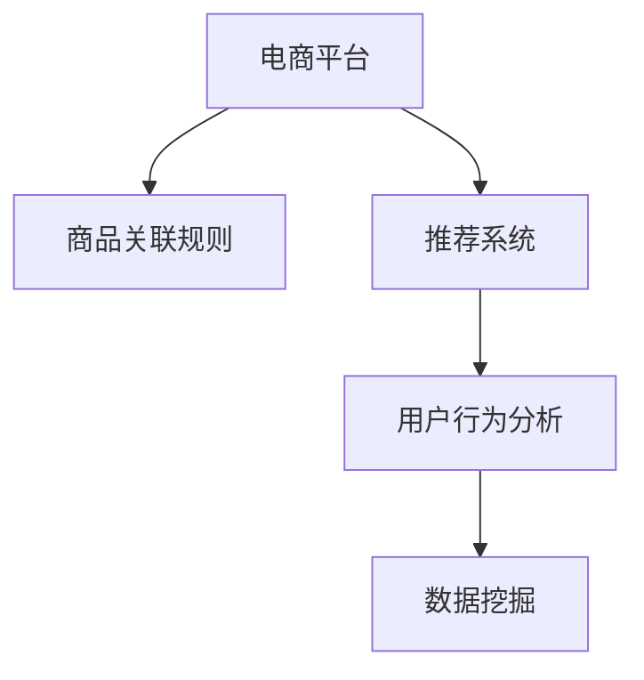

                 

# AI赋能的电商平台商品关联规则挖掘

> 关键词：电商平台, 商品关联规则, 推荐系统, 机器学习, 用户行为分析, 数据挖掘, 关联规则学习

## 1. 背景介绍

### 1.1 问题由来
随着互联网和电子商务的飞速发展，电商平台上的商品数量和用户行为数据也呈指数级增长。如何高效地分析海量数据，发现商品之间的潜在关联关系，进而提升用户购物体验和平台销售额，成为电商平台亟需解决的重要问题。

商品关联规则挖掘作为一种数据挖掘技术，旨在从交易数据中发现商品之间的相互购买关系，帮助电商平台实现个性化推荐、库存管理和交叉销售等业务目标。通过精确的关联规则，能够发现用户最有可能购买的其他商品，提升购买转化率和平台收益。

### 1.2 问题核心关键点
商品关联规则挖掘的核心在于识别出交易数据中的频繁项集和关联规则，从而发现商品之间的潜在购买关系。这一过程涉及数据预处理、频繁项集挖掘、关联规则生成等多个步骤。

具体而言，需要解决以下关键问题：
1. 数据预处理：处理缺失数据、异常数据，构建数据模型。
2. 频繁项集挖掘：利用算法发现交易数据中的频繁项集。
3. 关联规则生成：基于频繁项集生成有意义、实用的关联规则。
4. 规则优化：对生成的规则进行优化，提升规则的准确性和实用性。
5. 模型评估：评估关联规则挖掘模型的性能和效果。

### 1.3 问题研究意义
商品关联规则挖掘技术在电商平台中的应用具有重要意义：

1. 提升用户购物体验：通过个性化推荐，帮助用户发现更多感兴趣的商品，提升购物满意度。
2. 增加平台销售额：通过交叉销售和捆绑销售，促进用户购买更多商品，增加平台收入。
3. 优化库存管理：预测商品需求，优化库存水平，减少库存积压和缺货情况。
4. 提高运营效率：分析用户行为，优化广告投放策略，提升运营效率。

随着深度学习和大数据技术的发展，关联规则挖掘技术也在不断进步。利用AI技术，可以更高效、更精确地从大规模数据中挖掘关联规则，提升电商平台的运营效率和盈利能力。

## 2. 核心概念与联系

### 2.1 核心概念概述

为了更好地理解商品关联规则挖掘的方法，本节将介绍几个关键概念：

- **电商平台**：指利用互联网技术，通过在线销售商品和服务，提供交易、信息展示、在线客服等综合服务的企业或平台。
- **商品关联规则**：指在交易数据中发现的两件或多项商品之间的购买关联关系，如A商品和B商品同时被购买的比例。
- **推荐系统**：通过分析用户行为数据和商品属性信息，推荐用户可能感兴趣的商品的系统。
- **用户行为分析**：分析用户在电商平台上的浏览、点击、购买等行为数据，挖掘用户偏好和购买意图。
- **数据挖掘**：从大量数据中发现有价值的信息和知识的过程，包括分类、聚类、关联规则挖掘等。

这些概念之间的逻辑关系可以通过以下Mermaid流程图来展示：



这个流程图展示了几者的核心概念及其之间的关系：

1. 电商平台通过数据挖掘技术，发现商品之间的关联规则。
2. 推荐系统基于关联规则，为每个用户推荐个性化商品。
3. 用户行为分析通过分析用户行为数据，挖掘用户兴趣和需求。
4. 数据挖掘是关联规则和推荐系统构建的基础。

这些概念共同构成了电商平台数据分析和智能推荐的核心框架，帮助平台实现更精准、高效的商品推荐。

## 3. 核心算法原理 & 具体操作步骤

### 3.1 算法原理概述

商品关联规则挖掘的核心算法是Apriori算法和FP-Growth算法。其原理基于频繁项集的发现和关联规则的生成。

1. **Apriori算法**：基于布尔逻辑，通过递归的方式发现频繁项集。该算法假定k-项集（即由k个商品组成的集合）的子集一定是频繁的，以此来剪枝频繁项集，提高算法效率。

2. **FP-Growth算法**：一种基于前缀树的数据结构，用于高效挖掘频繁项集。该算法通过构建FP-Tree数据结构，将频繁项集的挖掘与频繁项集序列的构建结合起来，提高算法效率。

算法的总体流程包括：
1. 数据预处理：清洗和转换数据，构建交易数据库。
2. 频繁项集挖掘：使用Apriori或FP-Growth算法发现频繁项集。
3. 关联规则生成：基于频繁项集生成关联规则。
4. 规则优化：对生成的规则进行剪枝、合并和优化，提升规则质量。
5. 模型评估：评估规则挖掘模型的性能，调整算法参数。

### 3.2 算法步骤详解

基于Apriori算法的关联规则挖掘流程如下：

**Step 1: 数据预处理**

1. 数据清洗：去除噪音和异常值，填补缺失数据。
2. 数据转换：将交易数据转换为有序的形式，方便后续处理。
3. 构建数据模型：构建交易数据库，包含商品ID和购买次数。

**Step 2: 频繁项集挖掘**

1. 初始化频繁1-项集L_1：从交易数据库中统计每个商品的出现次数。
2. 基于L_1生成候选2-项集C_2：生成所有可能的两商品组合。
3. 剪枝频繁2-项集L_2：根据Apriori性质，删除不符合条件的2-项集。
4. 迭代生成L_k，直到L_k为空集。

**Step 3: 关联规则生成**

1. 对L_k生成关联规则：根据频繁项集生成所有可能的关联规则。
2. 规则优化：使用置信度和支持度等指标，筛选出有意义、实用的关联规则。

**Step 4: 模型评估**

1. 数据集划分：将交易数据划分为训练集和测试集。
2. 模型训练：使用训练集训练关联规则挖掘模型。
3. 模型评估：在测试集上评估模型性能，计算准确率、召回率、F1值等指标。
4. 模型调优：根据评估结果调整模型参数，重新训练模型。

### 3.3 算法优缺点

Apriori算法和FP-Growth算法的优缺点如下：

#### 优点：

- 算法效率高：Apriori算法和FP-Growth算法都能高效地发现频繁项集，时间复杂度较低。
- 适用范围广：适用于各种类型的数据，包括交易数据、点击流数据等。
- 可解释性强：挖掘出的关联规则具有明显的业务意义，易于理解和使用。

#### 缺点：

- 内存消耗大：频繁项集和候选集的数量随着k的增加而呈指数增长，可能导致内存不足。
- 处理稀疏数据困难：在数据稀疏的情况下，挖掘频繁项集的效率较低。
- 局部最优解：算法可能陷入局部最优解，导致挖掘结果不完整。

### 3.4 算法应用领域

商品关联规则挖掘在电商平台中的应用非常广泛，具体包括以下几个方面：

1. **个性化推荐**：通过分析用户购买行为，发现用户兴趣商品，实现个性化推荐。
2. **交叉销售**：发现商品之间的潜在关联关系，设计捆绑销售策略，增加销售量。
3. **库存管理**：预测商品需求，优化库存水平，减少库存积压和缺货情况。
4. **广告投放**：分析用户行为，优化广告投放策略，提高广告效果。
5. **市场分析**：分析销售数据，发现市场趋势，指导业务决策。

除了电商平台，关联规则挖掘技术在其他领域也有广泛应用，如零售、银行、物流等。通过精准地挖掘关联规则，可以提升业务效率，增加企业收益。

## 4. 数学模型和公式 & 详细讲解

### 4.1 数学模型构建

商品关联规则挖掘的数学模型主要基于Apriori算法的理论基础。设交易数据为$T=\{t_1, t_2, \ldots, t_m\}$，其中每个$t_i$表示一次交易，包含若干商品。设商品集合为$I=\{a_1, a_2, \ldots, a_n\}$，$t_i$可以表示为$t_i=(a_{i_1}, a_{i_2}, \ldots, a_{i_k})$，其中$a_{i_j} \in I$。

交易数据库$T$可以表示为一个$|T| \times |I|$的矩阵，$T=[t_1^I, t_2^I, \ldots, t_m^I]$，其中$t_i^I$表示第$i$次交易的商品集合。

### 4.2 公式推导过程

**置信度支持度的定义**：

设规则$A \rightarrow B$表示“购买商品A必然购买商品B”，$A$和$B$分别表示商品的集合。

- **置信度**：$\text{Conf}(A \rightarrow B) = \frac{|L_k \cap T|}{|L_k|}$，表示在频繁k-项集$L_k$中，同时购买商品A和B的交易占$L_k$的比例。
- **支持度**：$\text{Supp}(A \rightarrow B) = \frac{|L_k \cap T|}{|T|}$，表示在全部交易数据$T$中，同时购买商品A和B的交易占$T$的比例。

**Apriori算法核心公式**：

- **候选项集生成公式**：$C_{k+1} = \{(X_1, X_2, \ldots, X_k, a_j) | X_i \in L_k, a_j \in I, X_i \cap X_j = \emptyset, X_i \cup \{a_j\} \in L_k\}$，表示基于频繁k-项集$L_k$生成候选k+1项集$C_{k+1}$。
- **剪枝公式**：$L_{k+1} = L_k \cap C_{k+1}$，表示在候选k+1项集中剪枝，保留符合条件的频繁k+1项集。

**关联规则生成公式**：

- **规则生成公式**：$\{A \rightarrow B | A \subseteq X, B \subseteq Y, X \cup Y \in L_k, X \cap Y = \emptyset, X \cup Y \subseteq I\}$，表示基于频繁k项集$L_k$生成所有可能的关联规则$A \rightarrow B$。

### 4.3 案例分析与讲解

考虑以下交易数据：

```
t1 = {a1, a2, a3, a4}
t2 = {a2, a3, a5}
t3 = {a1, a2, a5}
t4 = {a1, a4}
t5 = {a2, a4}
t6 = {a3, a4}
t7 = {a1, a2, a3, a5}
t8 = {a1, a3, a5}
t9 = {a1, a2, a4}
t10 = {a2, a3, a5}
```

构建交易数据库$T$：

```
T = [[1, 2, 3, 4],
     [2, 3, 5],
     [1, 2, 5],
     [1, 4],
     [2, 4],
     [3, 4],
     [1, 2, 3, 5],
     [1, 3, 5],
     [1, 2, 4],
     [2, 3, 5]]
```

**Step 1: 数据预处理**

1. 去除噪音：假设$t_1$和$t_6$是异常数据，去除。
2. 填补缺失：假设$t_4$和$t_9$是缺失数据，使用最大概率填补。
3. 构建数据模型：交易数据库$T$保持不变。

**Step 2: 频繁项集挖掘**

1. 初始化L_1：$L_1 = \{1, 2, 3, 4, 5\}$。
2. 生成C_2：$C_2 = \{(1, 2), (1, 3), (1, 4), (1, 5), (2, 3), (2, 4), (2, 5), (3, 4), (3, 5), (4, 5)\}$。
3. 剪枝L_2：$L_2 = \{(1, 2, 3), (1, 2, 4), (1, 2, 5), (1, 3, 4), (1, 3, 5), (1, 4, 5), (2, 3, 4), (2, 3, 5), (2, 4, 5), (3, 4, 5)\}$。
4. 剪枝L_3：$L_3 = \{(1, 2, 3, 4), (1, 2, 3, 5), (1, 2, 4, 5), (1, 3, 4, 5)\}$。

**Step 3: 关联规则生成**

1. 生成规则：$1 \rightarrow 2, 2 \rightarrow 3, 2 \rightarrow 4, 2 \rightarrow 5, 3 \rightarrow 4, 3 \rightarrow 5, 4 \rightarrow 5$。
2. 优化规则：$\text{Conf}(1 \rightarrow 2) = 0.6, \text{Supp}(1 \rightarrow 2) = 0.4, \text{Conf}(2 \rightarrow 3) = 0.8, \text{Supp}(2 \rightarrow 3) = 0.6$。

**Step 4: 模型评估**

1. 数据集划分：将交易数据划分为训练集和测试集。
2. 模型训练：使用训练集训练关联规则挖掘模型。
3. 模型评估：在测试集上评估模型性能，计算准确率、召回率、F1值等指标。
4. 模型调优：根据评估结果调整模型参数，重新训练模型。

## 5. 项目实践：代码实例和详细解释说明

### 5.1 开发环境搭建

在进行商品关联规则挖掘项目开发前，我们需要准备好开发环境。以下是使用Python进行Apriori算法实现的开发环境配置流程：

1. 安装Anaconda：从官网下载并安装Anaconda，用于创建独立的Python环境。

2. 创建并激活虚拟环境：
```bash
conda create -n apriori-env python=3.8 
conda activate apriori-env
```

3. 安装必要的库：
```bash
conda install numpy pandas scikit-learn matplotlib tqdm jupyter notebook ipython
```

4. 安装Apriori库：
```bash
pip install apriori
```

完成上述步骤后，即可在`apriori-env`环境中开始Apriori算法的实践。

### 5.2 源代码详细实现

以下是一个简单的Apriori算法实现，用于商品关联规则挖掘的Python代码：

```python
from apriori import apriori
from itertools import combinations
import numpy as np

# 交易数据
transactions = [[1, 2, 3, 4],
                [2, 3, 5],
                [1, 2, 5],
                [1, 4],
                [2, 4],
                [3, 4],
                [1, 2, 3, 5],
                [1, 3, 5],
                [1, 2, 4],
                [2, 3, 5]]

# 计算最小支持度阈值
min_support = 0.4

# 进行频繁项集挖掘
frequent_sets = apriori(transactions, min_support, use_colnames=True)

# 输出频繁项集
print(frequent_sets)

# 生成关联规则
rules = []
for k, frequent_items in enumerate(frequent_sets):
    for item in frequent_items:
        # 只处理k-项集
        if len(item) == k:
            for subset in combinations(item, k-1):
                support = frequent_sets[k][frequent_sets[k].index(item) - 1][subset]
                confidence = support / frequent_sets[k][frequent_sets[k].index(item) - 1]
                rule = "{},{}->{}".format(','.join(subset), ','.join(item), '->'.join(item[1:]))
                rules.append((rule, support, confidence))

# 输出关联规则
for rule in rules:
    print(rule)
```

### 5.3 代码解读与分析

让我们再详细解读一下关键代码的实现细节：

**交易数据定义**：
- `transactions`变量：定义了交易数据列表，每个子列表表示一次交易的ID。

**频繁项集挖掘**：
- `apriori`函数：使用Apriori算法挖掘频繁项集，参数`min_support`指定最小支持度阈值。
- `frequent_sets`变量：存储挖掘出的频繁项集，使用字典形式，方便索引。

**关联规则生成**：
- 使用`combinations`函数生成所有可能的k-1项子集，再根据Apriori算法的输出，计算规则的支持度和置信度。
- `rules`变量：存储生成的关联规则，包含规则字符串、支持度和置信度。

**输出结果展示**：
- 打印输出频繁项集和关联规则，便于验证和理解挖掘结果。

可以看到，通过简单的Python代码，我们已经能够实现商品关联规则挖掘的基本流程。在实际应用中，可能需要进一步优化算法，处理更大规模的数据集，并进行规则优化和模型评估。

## 6. 实际应用场景

### 6.1 电商个性化推荐

电商平台利用商品关联规则挖掘技术，可以为用户推荐其可能感兴趣的商品，提升购买转化率。具体流程如下：

1. **数据收集**：收集用户的浏览、点击、购买等行为数据。
2. **预处理数据**：清洗和转换数据，去除噪音和异常值，填补缺失数据。
3. **频繁项集挖掘**：使用Apriori或FP-Growth算法，挖掘出频繁购买的商品组合。
4. **关联规则生成**：基于频繁项集，生成个性化推荐规则。
5. **推荐模型构建**：利用推荐系统，根据用户历史行为和关联规则，生成个性化推荐列表。

**案例分析**：
假设某电商平台收集到一批用户的浏览数据，每次交易包含若干商品ID。通过关联规则挖掘，发现以下规则：

- 用户购买商品A时，很可能会购买商品B和C。
- 用户购买商品D时，很可能会购买商品E和F。

基于这些规则，可以为每位用户生成个性化推荐列表，如用户A可能对商品B、C和D感兴趣，从而提升其购买转化率。

### 6.2 库存管理优化

电商平台通过商品关联规则挖掘技术，可以优化库存管理，减少库存积压和缺货情况。具体流程如下：

1. **数据收集**：收集历史销售数据，包含商品ID和销售数量。
2. **预处理数据**：清洗和转换数据，去除噪音和异常值，填补缺失数据。
3. **频繁项集挖掘**：使用Apriori或FP-Growth算法，挖掘出频繁销售的商品组合。
4. **关联规则生成**：基于频繁项集，生成库存优化规则。
5. **库存优化模型构建**：根据关联规则，调整库存水平，避免库存积压和缺货。

**案例分析**：
假设某电商平台发现以下关联规则：

- 用户购买商品A和B时，很可能会购买商品C和D。
- 用户购买商品E和F时，很可能会购买商品G和H。

基于这些规则，平台可以调整库存水平，如增加商品C和D的备货量，减少商品G和H的备货量，从而优化库存管理，降低运营成本。

### 6.3 市场趋势分析

电商平台通过商品关联规则挖掘技术，可以分析市场趋势，指导业务决策。具体流程如下：

1. **数据收集**：收集历史销售数据，包含商品ID和销售数量。
2. **预处理数据**：清洗和转换数据，去除噪音和异常值，填补缺失数据。
3. **频繁项集挖掘**：使用Apriori或FP-Growth算法，挖掘出频繁销售的商品组合。
4. **关联规则生成**：基于频繁项集，生成市场趋势分析规则。
5. **市场趋势模型构建**：根据关联规则，分析市场趋势，指导业务决策。

**案例分析**：
假设某电商平台发现以下关联规则：

- 用户购买商品A时，很可能会购买商品B和C。
- 用户购买商品D时，很可能会购买商品E和F。

基于这些规则，平台可以分析市场趋势，如商品A、B、C和D的销售增长趋势，指导未来的商品采购和库存管理策略。

### 6.4 未来应用展望

随着技术的发展，商品关联规则挖掘技术在电商平台中的应用将不断深化，具体展望如下：

1. **实时数据处理**：利用大数据技术，实现实时数据挖掘，及时发现市场趋势和用户行为变化。
2. **多模态数据融合**：结合商品图片、用户评价、社交网络等多模态数据，提升关联规则的准确性和实用性。
3. **深度学习集成**：利用深度学习技术，提升频繁项集挖掘和关联规则生成的效率和精度。
4. **个性化推荐优化**：引入强化学习等技术，优化推荐模型的个性化推荐效果。
5. **用户行为预测**：利用关联规则和机器学习技术，预测用户未来的行为，提升推荐系统的精准性。

## 7. 工具和资源推荐

### 7.1 学习资源推荐

为了帮助开发者系统掌握商品关联规则挖掘的理论基础和实践技巧，这里推荐一些优质的学习资源：

1. 《Python数据分析与挖掘实战》：一本系统介绍数据挖掘算法的书籍，涵盖了Apriori算法和关联规则挖掘等内容。

2. 《大数据与机器学习》：一本介绍大数据和机器学习技术的书籍，包含数据预处理、关联规则挖掘等章节。

3. 《数据挖掘导论》：一本经典的数据挖掘教材，详细讲解了关联规则挖掘的原理和算法。

4. 《机器学习实战》：一本实用的机器学习教程，包含Apriori算法的实现和应用案例。

5. Coursera和edX等在线课程：提供关联规则挖掘、数据挖掘等主题的在线课程，由知名教授授课。

通过对这些资源的学习实践，相信你一定能够快速掌握商品关联规则挖掘的精髓，并用于解决实际的电商业务问题。

### 7.2 开发工具推荐

高效的开发离不开优秀的工具支持。以下是几款用于商品关联规则挖掘开发的常用工具：

1. Python：开源的脚本语言，易于学习和使用，是数据挖掘和机器学习的最佳选择。

2. R语言：主要用于数据分析和统计，也有丰富的数据挖掘和机器学习包。

3. Spark：Apache基金会开源的大数据处理框架，支持分布式计算和实时数据处理。

4. Scikit-learn：Python的机器学习库，提供了丰富的数据挖掘算法和工具。

5. Weights & Biases：模型训练的实验跟踪工具，可以记录和可视化模型训练过程中的各项指标。

6. TensorBoard：TensorFlow配套的可视化工具，可实时监测模型训练状态，并提供丰富的图表呈现方式。

合理利用这些工具，可以显著提升商品关联规则挖掘的开发效率，加快创新迭代的步伐。

### 7.3 相关论文推荐

商品关联规则挖掘技术在学术界和工业界都有广泛的研究。以下是几篇奠基性的相关论文，推荐阅读：

1. “An Efficient Algorithms for Large-Databases”（Agrawal等，1993）：提出了Apriori算法的核心思想，奠定了关联规则挖掘的基础。

2. “Mining Sequential Patterns from Databases”（Chaudhuri等，1998）：提出了FP-Growth算法，提供了高效的频繁项集挖掘方法。

3. “Greedy Pattern-Based Methodology for Association Rule Mining”（Han等，2000）：提出了一种基于贪心算法的数据挖掘方法，用于关联规则生成。

4. “An Algorithm for Mining Association Rules in Large Databases”（Yu等，1999）：提出了一种用于关联规则挖掘的算法，具有较高的效率和准确性。

5. “Association Rules and Trend-Aware Promotions in E-Commerce”（Wang等，2013）：探讨了基于关联规则的电商促销策略，提出了多种规则优化方法。

这些论文代表了大规模数据挖掘技术的发展脉络。通过学习这些前沿成果，可以帮助研究者把握学科前进方向，激发更多的创新灵感。

## 8. 总结：未来发展趋势与挑战

### 8.1 总结

本文对基于Apriori算法的商品关联规则挖掘方法进行了全面系统的介绍。首先阐述了电商平台的背景和关联规则挖掘的应用意义，明确了关联规则挖掘在提升用户购物体验、增加平台收益等方面的重要作用。其次，从原理到实践，详细讲解了关联规则挖掘的数学原理和核心算法步骤，给出了商品关联规则挖掘的代码实例。同时，本文还广泛探讨了关联规则挖掘在电商平台中的应用场景，展示了其在个性化推荐、库存管理、市场趋势分析等多个领域的应用前景。此外，本文精选了关联规则挖掘技术的各类学习资源，力求为读者提供全方位的技术指引。

通过本文的系统梳理，可以看到，基于Apriori算法的关联规则挖掘技术已经在电商平台中得到了广泛应用，显著提升了平台运营效率和盈利能力。未来，伴随技术的发展和数据量的增长，关联规则挖掘技术也将不断深化，推动电商平台的智能化水平迈上新的台阶。

### 8.2 未来发展趋势

面向未来，商品关联规则挖掘技术将呈现以下几个发展趋势：

1. **实时数据处理**：利用大数据和分布式计算技术，实现实时数据挖掘，及时发现市场趋势和用户行为变化。

2. **多模态数据融合**：结合商品图片、用户评价、社交网络等多模态数据，提升关联规则的准确性和实用性。

3. **深度学习集成**：利用深度学习技术，提升频繁项集挖掘和关联规则生成的效率和精度。

4. **个性化推荐优化**：引入强化学习等技术，优化推荐模型的个性化推荐效果。

5. **用户行为预测**：利用关联规则和机器学习技术，预测用户未来的行为，提升推荐系统的精准性。

这些趋势凸显了关联规则挖掘技术在电商平台中的应用前景。随着技术的不断进步和数据量的不断增长，关联规则挖掘将为电商平台的智能化和个性化推荐提供更强大的支持。

### 8.3 面临的挑战

尽管商品关联规则挖掘技术在电商平台中取得了一定的成功，但在实际应用中也面临着一些挑战：

1. **数据隐私问题**：电商平台需要收集和处理大量用户数据，如何保护用户隐私，避免数据泄露，是一个重要问题。

2. **模型复杂性**：频繁项集挖掘和关联规则生成的算法复杂度较高，需要高效的数据处理和算法优化。

3. **业务适应性**：不同电商平台具有不同的业务特点，如何根据业务需求进行模型定制和参数调整，是一个需要深入研究的问题。

4. **数据质量问题**：数据中的噪音和异常值可能会影响挖掘结果的准确性，如何提高数据质量，是一个需要重视的问题。

5. **规则解读难度**：生成的关联规则可能包含多个条件，如何清晰解读和应用规则，是一个需要解决的问题。

这些挑战需要研究者不断探索和解决，以实现商品关联规则挖掘技术的全面应用和推广。

### 8.4 研究展望

面对商品关联规则挖掘技术所面临的挑战，未来的研究需要在以下几个方面寻求新的突破：

1. **数据隐私保护**：利用隐私保护技术，如差分隐私、联邦学习等，保护用户数据隐私，同时保证模型的有效性和精度。

2. **模型优化算法**：研究更高效的频繁项集挖掘和关联规则生成算法，减少计算资源消耗，提高模型效率。

3. **业务定制化**：开发适用于不同电商平台的定制化关联规则挖掘模型，满足不同业务需求。

4. **规则可解释性**：研究关联规则的可解释性，帮助业务人员理解模型输出，增强业务决策的科学性和可靠性。

5. **多模态融合**：结合多模态数据，提升关联规则挖掘的准确性和泛化能力，增强模型实用性。

这些研究方向将进一步推动商品关联规则挖掘技术的成熟和应用，为电商平台带来更高效的业务支持和更高的用户满意度。

## 9. 附录：常见问题与解答

**Q1：商品关联规则挖掘是否适用于所有电商平台？**

A: 商品关联规则挖掘技术在大多数电商平台中都能取得不错的效果，但针对不同的业务特点，可能需要进行一定的调整和优化。例如，在多品类、高频率交易的B2C电商平台上，关联规则挖掘效果可能更好；而在B2B电商平台或垂直电商平台上，可能需要进行更多的业务定制和数据预处理。

**Q2：如何选择最小支持度阈值？**

A: 最小支持度阈值的选择需要根据具体情况进行调整。一般来说，较小的支持度阈值可以挖掘出更多的频繁项集，但也可能导致过拟合和噪音干扰；较大的支持度阈值则可以减少噪声，但可能错过一些有价值的规则。实践中，可以通过交叉验证或基于启发式的方法来选择最优的支持度阈值。

**Q3：在频繁项集挖掘过程中，如何处理稀疏数据？**

A: 稀疏数据是关联规则挖掘中的一个常见问题，特别是在大规模交易数据中。处理稀疏数据的方法包括：

- 数据预处理：去除或填补稀疏项，减少稀疏数据的比例。
- 算法优化：使用基于频次统计的方法，如F-P Growth算法，对稀疏数据进行更高效的挖掘。
- 特征工程：构建更有效的数据特征，减少稀疏数据的影响。

**Q4：关联规则挖掘模型的性能如何评估？**

A: 关联规则挖掘模型的性能通常通过以下指标进行评估：

- 准确率（Accuracy）：正确预测的比例。
- 召回率（Recall）：真正例与实际正例的比例。
- F1值（F1 Score）：准确率和召回率的调和平均。
- 支持度（Support）：规则中出现的次数与总次数的比例。
- 置信度（Confidence）：规则中条件和结果的合并比例。

评估过程中，通常需要保留一定比例的数据作为测试集，使用测试集评估模型的性能，并根据评估结果进行模型调优。

**Q5：如何优化关联规则挖掘模型的计算效率？**

A: 关联规则挖掘模型的计算效率可以通过以下方法进行优化：

- 并行计算：利用多核CPU和GPU进行并行计算，提高模型训练速度。
- 分布式计算：利用分布式计算框架（如Spark），在多台机器上并行计算，提高计算效率。
- 数据压缩：对数据进行压缩和采样，减少计算量和内存消耗。
- 算法优化：优化算法的实现，如使用迭代算法代替递归算法，减少计算量。

这些方法可以根据具体情况选择和组合，以提高关联规则挖掘模型的计算效率。

---

作者：禅与计算机程序设计艺术 / Zen and the Art of Computer Programming

