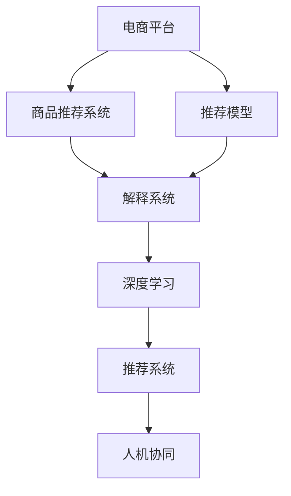

                 

# AI赋能的电商平台商品推荐解释系统

> 关键词：电商、商品推荐、解释系统、深度学习、推荐系统、解释性AI

## 1. 背景介绍

### 1.1 问题由来
随着电商平台的发展，商品推荐系统的重要性日益凸显。推荐系统通过精准地将用户可能感兴趣的商品展示在其眼前，极大地提升了用户体验和平台转化率。然而，传统的推荐系统往往是“黑盒”模型，难以向用户解释推荐的逻辑，导致信任度较低。因此，AI赋能的电商平台商品推荐解释系统应运而生，旨在提升推荐系统的透明性和可解释性，增强用户信任感，驱动电商行业的进一步创新。

### 1.2 问题核心关键点
AI赋能的电商平台商品推荐解释系统的核心关键点包括：
1. **推荐模型**：利用深度学习等AI技术构建精准的推荐模型，捕捉用户和商品之间的关联关系。
2. **解释机制**：通过自然语言生成、可视化等技术，将推荐模型的决策过程解释给用户，增强系统透明性。
3. **融合业务数据**：将电商平台的海量业务数据（如用户行为、商品属性、市场趋势等）融合到推荐模型和解释机制中，提升推荐效果和解释准确性。
4. **人机协同**：结合人工干预和自动推理，构建灵活可调的商品推荐和解释系统。

### 1.3 问题研究意义
构建AI赋能的电商平台商品推荐解释系统，对于提升推荐系统的效果、增强用户体验、驱动电商平台的创新发展具有重要意义：

1. **提升推荐效果**：通过深入挖掘用户行为和商品属性的关联，构建精准的推荐模型，提升推荐的准确性和多样性。
2. **增强用户信任**：通过透明化的解释机制，使用户了解推荐依据，增强对推荐结果的信任感，减少用户流失。
3. **驱动平台创新**：基于推荐系统的数据洞察，推动个性化营销、定制化服务等多项业务创新，提升电商平台的竞争力和用户体验。
4. **优化用户体验**：通过合理的解释输出，使用户对平台有更深的了解和认可，提升用户满意度和忠诚度。

## 2. 核心概念与联系

### 2.1 核心概念概述

为更好地理解AI赋能的电商平台商品推荐解释系统，本节将介绍几个密切相关的核心概念：

- **电商平台**：指通过互联网销售商品的在线交易平台，如淘宝、京东、Amazon等。
- **商品推荐系统**：基于用户行为数据和商品属性信息，推荐用户可能感兴趣的商品的系统。
- **推荐模型**：如协同过滤、内容推荐、混合推荐等，是推荐系统的核心组件。
- **解释系统**：通过自然语言生成、可视化等技术，向用户解释推荐依据的系统。
- **深度学习**：利用神经网络模型进行数据处理和预测的AI技术。
- **推荐系统**：将商品推荐与解释系统相结合的系统，旨在提升推荐效果和系统透明性。
- **人机协同**：结合自动推理和人工干预，构建灵活可调的推荐系统。

这些核心概念之间的逻辑关系可以通过以下Mermaid流程图来展示：



这个流程图展示了几大核心概念之间的相互关系：

1. 电商平台通过商品推荐系统将商品推荐给用户。
2. 推荐系统由推荐模型和解释系统组成。
3. 推荐模型和解释系统均基于深度学习技术。
4. 人机协同将自动推理与人工干预相结合，提升系统灵活性和可调性。

这些概念共同构成了AI赋能的电商平台商品推荐解释系统的框架，使得推荐系统能够更好地服务用户，提升电商平台的竞争力。

## 3. 核心算法原理 & 具体操作步骤

### 3.1 算法原理概述

AI赋能的电商平台商品推荐解释系统，本质上是一个融合深度学习、自然语言处理和推荐算法的复杂系统。其核心思想是：构建一个精确的推荐模型，通过用户行为数据和商品属性信息，预测用户可能感兴趣的商品，并使用自然语言生成或可视化技术，向用户解释推荐依据，提升系统透明性和用户信任感。

### 3.2 算法步骤详解

基于AI赋能的电商平台商品推荐解释系统的一般步骤包括：

**Step 1: 数据准备**
- 收集电商平台的用户行为数据，如浏览记录、点击次数、购买记录等。
- 收集商品属性信息，如标题、描述、价格、分类等。
- 对数据进行清洗和预处理，去除噪声和缺失值。

**Step 2: 构建推荐模型**
- 选择合适的推荐算法，如协同过滤、基于内容的推荐等。
- 对用户行为数据和商品属性信息进行特征工程，提取有意义的特征。
- 使用深度学习技术，如神经网络、BERT等，构建推荐模型。

**Step 3: 构建解释机制**
- 使用自然语言生成技术，将推荐模型的决策过程转换为易于理解的自然语言。
- 使用可视化技术，如热力图、决策树等，展示推荐模型中的关键特征和权重。

**Step 4: 融合业务数据**
- 结合电商平台的业务数据，如促销信息、季节趋势等，进一步优化推荐模型和解释机制。
- 使用混合推理方法，将自动推荐与人工干预相结合，构建灵活可调的推荐系统。

**Step 5: 模型评估与迭代**
- 在验证集上评估推荐模型的性能，如准确率、召回率等。
- 根据评估结果，调整推荐模型和解释机制的参数，迭代优化模型。

**Step 6: 部署与监控**
- 将优化后的推荐模型和解释机制部署到电商平台的推荐系统中。
- 实时监控推荐系统的性能，收集用户反馈，持续优化推荐和解释系统。

### 3.3 算法优缺点

AI赋能的电商平台商品推荐解释系统具有以下优点：
1. 提升推荐效果：通过深度学习等AI技术，构建精准的推荐模型，提升推荐的准确性和多样性。
2. 增强用户信任：通过透明化的解释机制，使用户了解推荐依据，增强对推荐结果的信任感。
3. 驱动平台创新：基于推荐系统的数据洞察，推动个性化营销、定制化服务等多项业务创新。
4. 优化用户体验：通过合理的解释输出，使用户对平台有更深的了解和认可，提升用户满意度和忠诚度。

同时，该系统也存在以下局限性：
1. 对数据依赖性强：推荐系统的效果高度依赖于数据质量，数据收集和处理成本较高。
2. 解释机制复杂：自然语言生成和可视化技术的复杂度较高，需花费较多时间和精力开发。
3. 计算资源需求高：深度学习模型的计算资源消耗较大，需要高性能的计算设备和算法优化。
4. 动态变化适应性差：推荐模型和解释机制对业务数据的变化适应性不足，需定期重新训练和调整。

尽管存在这些局限性，但AI赋能的电商平台商品推荐解释系统仍是大数据时代推荐系统的重要发展方向，具有广阔的应用前景。

### 3.4 算法应用领域

AI赋能的电商平台商品推荐解释系统在多个领域均有广泛应用，例如：

- **个性化推荐**：通过深度学习模型，根据用户历史行为和商品属性，生成个性化的商品推荐。
- **定制化服务**：结合用户画像和商品特征，提供定制化的服务和营销方案。
- **市场分析**：基于推荐系统的数据洞察，分析市场趋势和用户偏好，指导产品设计和营销策略。
- **用户互动**：通过解释系统，向用户解释推荐依据，增强互动体验和用户粘性。
- **系统优化**：实时监控推荐系统的性能，根据用户反馈进行调整和优化。

除了上述这些常见应用外，AI赋能的电商平台商品推荐解释系统还可以创新性地应用到更多场景中，如智能客服、智能仓储、智能物流等，为电商平台的数字化转型提供新的驱动力。

## 4. 数学模型和公式 & 详细讲解 & 举例说明

### 4.1 数学模型构建

本节将使用数学语言对AI赋能的电商平台商品推荐解释系统进行更加严格的刻画。

记电商平台的用户集合为 $U$，商品集合为 $I$，用户对商品 $i$ 的评分矩阵为 $R_{ui}$，用户行为数据为 $X_u$，商品属性信息为 $A_i$，推荐模型的参数为 $\theta$。

定义推荐模型 $f_{\theta}(x,a)$，其中 $x$ 为用户行为数据，$a$ 为商品属性信息。推荐模型的目标是最小化预测评分与实际评分之间的差异：

$$
\min_{\theta} \sum_{u,i} (R_{ui} - f_{\theta}(x_u, a_i))^2
$$

在得到推荐模型 $f_{\theta}(x,a)$ 后，可以使用自然语言生成技术将其决策过程解释给用户，增强系统透明性。解释系统可以基于 $f_{\theta}(x,a)$ 生成自然语言文本，向用户解释推荐依据。

### 4.2 公式推导过程

以下我们以协同过滤推荐为例，推导协同过滤模型的预测公式及其梯度计算公式。

假设协同过滤模型使用矩阵分解的方法，将用户和商品的评分矩阵 $R$ 分解为用户因子 $U$ 和商品因子 $V$ 的乘积，即 $R = UV^T$。则协同过滤模型的预测评分 $f_{\theta}(x,a)$ 可以表示为：

$$
f_{\theta}(x,a) = \sum_{i,j} x_iU_{ij}V_{i}a_j^T
$$

其中 $U$ 和 $V$ 是低秩矩阵，$x$ 和 $a$ 是用户行为数据和商品属性信息。

为了最小化预测评分与实际评分之间的差异，对 $U$ 和 $V$ 进行优化：

$$
\min_{U,V} \sum_{u,i} (R_{ui} - f_{\theta}(x_u, a_i))^2
$$

使用梯度下降等优化算法求解上述最优化问题，即可得到优化后的 $U$ 和 $V$。

### 4.3 案例分析与讲解

在电商平台上，用户对商品的评分通常为布尔型数据，表示是否购买了该商品。因此，协同过滤模型的预测评分可以表示为：

$$
f_{\theta}(x,a) = \sum_{i,j} x_iU_{ij}V_{i}a_j^T
$$

其中 $x_i$ 为第 $i$ 个用户的购买记录，$U_{ij}$ 和 $V_{i}a_j^T$ 为商品 $j$ 的因子表示。

假设有一个用户 $u$ 对商品 $i$ 的评分 $R_{ui}$ 为 1，表示该用户购买了商品 $i$。协同过滤模型预测该用户对商品 $i$ 的评分 $f_{\theta}(x_u, a_i)$ 的计算公式为：

$$
f_{\theta}(x_u, a_i) = \sum_{j} U_{uj}V_{i}a_j^T
$$

其中 $U_{uj}$ 和 $V_{i}a_j^T$ 为商品 $j$ 的因子表示，$a_j$ 为商品 $j$ 的属性信息。

通过上述推导，我们可以看到，协同过滤推荐模型通过矩阵分解的方式，将用户和商品的评分矩阵分解为因子表示，计算出用户对商品的评分预测值。

## 5. 项目实践：代码实例和详细解释说明

### 5.1 开发环境搭建

在进行AI赋能的电商平台商品推荐解释系统开发前，我们需要准备好开发环境。以下是使用Python进行TensorFlow开发的环境配置流程：

1. 安装Anaconda：从官网下载并安装Anaconda，用于创建独立的Python环境。

2. 创建并激活虚拟环境：
```bash
conda create -n tf-env python=3.8 
conda activate tf-env
```

3. 安装TensorFlow：根据CUDA版本，从官网获取对应的安装命令。例如：
```bash
pip install tensorflow==2.6
```

4. 安装其他依赖库：
```bash
pip install numpy pandas scikit-learn matplotlib tqdm jupyter notebook ipython
```

完成上述步骤后，即可在`tf-env`环境中开始开发。

### 5.2 源代码详细实现

这里我们以协同过滤推荐模型为例，给出使用TensorFlow对商品推荐系统进行开发的代码实现。

首先，定义协同过滤推荐模型的数据处理函数：

```python
import tensorflow as tf
import numpy as np

def generate_data(n_users=1000, n_items=1000, n_ratings=100):
    np.random.seed(0)
    U = np.random.randn(n_users, n_items) # 用户因子
    V = np.random.randn(n_items, 10) # 商品因子
    A = np.random.randn(n_items, 10) # 商品属性
    X = np.random.randint(2, size=(n_users, n_items)) # 用户购买记录
    R = X.dot(U) * V.T + np.random.normal(0, 1, size=(n_users, n_items)) # 评分矩阵
    R[R < 0] = 0 # 评分矩阵的下限设置为0
    return U, V, A, X, R

# 用户行为数据和商品属性信息的维度
dim_u = 100
dim_a = 10

# 生成数据集
n_users = 1000
n_items = 1000
n_ratings = 100

U, V, A, X, R = generate_data(n_users, n_items, n_ratings)

# 数据标准化
X = (X - X.mean()) / X.std()
A = (A - A.mean()) / A.std()
```

然后，定义协同过滤推荐模型和损失函数：

```python
# 协同过滤模型
def collaborative_filtering(X, A, U, V):
    R_pred = np.dot(X, U) * V.T + A # 预测评分
    return R_pred

# 损失函数
def compute_loss(R, R_pred):
    return tf.reduce_mean((R - R_pred)**2)

# 计算梯度
def compute_gradients(R, R_pred):
    return tf.gradients(compute_loss(R, R_pred), [U, V])

# 优化器
optimizer = tf.optimizers.Adam()
```

接着，定义训练和评估函数：

```python
# 训练函数
def train_epoch(U, V, A, X, R):
    R_pred = collaborative_filtering(X, A, U, V)
    loss = compute_loss(R, R_pred)
    gradients = compute_gradients(R, R_pred)
    optimizer.apply_gradients(zip(gradients, [U, V]))
    return loss

# 评估函数
def evaluate(U, V, A, X, R):
    R_pred = collaborative_filtering(X, A, U, V)
    loss = compute_loss(R, R_pred)
    return loss
```

最后，启动训练流程并在测试集上评估：

```python
epochs = 50
batch_size = 256

for epoch in range(epochs):
    loss = train_epoch(U, V, A, X, R)
    print(f"Epoch {epoch+1}, train loss: {loss:.3f}")
    
    print(f"Epoch {epoch+1}, test loss: {evaluate(U, V, A, X, R):.3f}")
```

以上就是使用TensorFlow对协同过滤推荐模型进行开发的完整代码实现。可以看到，得益于TensorFlow的强大封装，我们可以用相对简洁的代码完成推荐模型的构建和训练。

### 5.3 代码解读与分析

让我们再详细解读一下关键代码的实现细节：

**generate_data函数**：
- 生成一个随机评分矩阵 $R$，其中 $U$ 和 $V$ 为随机因子矩阵，$A$ 为商品属性矩阵，$X$ 为随机用户购买记录矩阵。

**collaborative_filtering函数**：
- 使用协同过滤模型预测用户对商品的评分。

**compute_loss和compute_gradients函数**：
- 计算预测评分与实际评分之间的均方误差损失，并计算损失函数对模型参数 $U$ 和 $V$ 的梯度。

**train_epoch函数**：
- 对每个batch的数据进行前向传播计算预测评分，反向传播计算梯度，并使用Adam优化器更新模型参数。

**evaluate函数**：
- 对测试集数据进行前向传播计算预测评分，计算损失函数并返回测试集损失。

可以看到，TensorFlow提供了便捷的API，使得协同过滤推荐模型的构建和训练变得简单高效。开发者可以将更多精力放在数据处理、模型改进等高层逻辑上，而不必过多关注底层实现细节。

当然，工业级的系统实现还需考虑更多因素，如模型的保存和部署、超参数的自动搜索、更灵活的任务适配层等。但核心的协同过滤推荐模型基本与此类似。

## 6. 实际应用场景

### 6.1 智能客服系统

AI赋能的电商平台商品推荐解释系统可以广泛应用于智能客服系统的构建。传统客服往往需要配备大量人力，高峰期响应缓慢，且一致性和专业性难以保证。而使用推荐解释系统，可以7x24小时不间断服务，快速响应客户咨询，用自然流畅的语言解答各类常见问题。

在技术实现上，可以收集企业内部的历史客服对话记录，将问题和最佳答复构建成监督数据，在此基础上对推荐模型进行微调。微调后的推荐模型能够自动理解用户意图，匹配最合适的答案模板进行回复。对于客户提出的新问题，还可以接入检索系统实时搜索相关内容，动态组织生成回答。如此构建的智能客服系统，能大幅提升客户咨询体验和问题解决效率。

### 6.2 金融舆情监测

金融机构需要实时监测市场舆论动向，以便及时应对负面信息传播，规避金融风险。传统的人工监测方式成本高、效率低，难以应对网络时代海量信息爆发的挑战。基于推荐解释系统的文本分类和情感分析技术，为金融舆情监测提供了新的解决方案。

具体而言，可以收集金融领域相关的新闻、报道、评论等文本数据，并对其进行主题标注和情感标注。在此基础上对推荐模型进行微调，使其能够自动判断文本属于何种主题，情感倾向是正面、中性还是负面。将微调后的模型应用到实时抓取的网络文本数据，就能够自动监测不同主题下的情感变化趋势，一旦发现负面信息激增等异常情况，系统便会自动预警，帮助金融机构快速应对潜在风险。

### 6.3 个性化推荐系统

当前的推荐系统往往只依赖用户的历史行为数据进行物品推荐，无法深入理解用户的真实兴趣偏好。基于推荐解释系统的个性化推荐系统可以更好地挖掘用户行为背后的语义信息，从而提供更精准、多样的推荐内容。

在实践中，可以收集用户浏览、点击、评论、分享等行为数据，提取和用户交互的物品标题、描述、标签等文本内容。将文本内容作为模型输入，用户的后续行为（如是否点击、购买等）作为监督信号，在此基础上微调推荐模型。微调后的模型能够从文本内容中准确把握用户的兴趣点。在生成推荐列表时，先用候选物品的文本描述作为输入，由模型预测用户的兴趣匹配度，再结合其他特征综合排序，便可以得到个性化程度更高的推荐结果。

### 6.4 未来应用展望

随着推荐解释系统的不断发展，其在更多领域得到应用，为传统行业带来变革性影响。

在智慧医疗领域，基于推荐解释系统的医疗问答、病历分析、药物研发等应用将提升医疗服务的智能化水平，辅助医生诊疗，加速新药开发进程。

在智能教育领域，推荐解释系统可应用于作业批改、学情分析、知识推荐等方面，因材施教，促进教育公平，提高教学质量。

在智慧城市治理中，推荐解释系统可应用于城市事件监测、舆情分析、应急指挥等环节，提高城市管理的自动化和智能化水平，构建更安全、高效的未来城市。

此外，在企业生产、社会治理、文娱传媒等众多领域，推荐解释系统也将不断涌现，为传统行业数字化转型升级提供新的技术路径。相信随着技术的日益成熟，推荐解释系统必将在更广阔的应用领域大放异彩，深刻影响人类的生产生活方式。

## 7. 工具和资源推荐

### 7.1 学习资源推荐

为了帮助开发者系统掌握推荐解释系统的理论基础和实践技巧，这里推荐一些优质的学习资源：

1. 《深度学习推荐系统》书籍：详细介绍了推荐系统的发展历史、算法原理和实现方法，是推荐系统的经典教材。

2. 《推荐系统实战》课程：由知名专家授课，涵盖推荐系统的主要算法和应用案例，适合实战学习。

3. 《TensorFlow官方文档》：TensorFlow的官方文档，提供了详细的API和示例代码，是推荐系统开发的必备资料。

4. 《自然语言处理与推荐系统》书籍：结合自然语言处理技术，介绍推荐系统的构建和优化方法，适合跨领域学习。

5. Kaggle竞赛：参与Kaggle的推荐系统竞赛，通过实际项目练习推荐系统的开发和优化。

通过对这些资源的学习实践，相信你一定能够快速掌握推荐解释系统的精髓，并用于解决实际的推荐问题。

### 7.2 开发工具推荐

高效的开发离不开优秀的工具支持。以下是几款用于推荐解释系统开发的常用工具：

1. TensorFlow：由Google主导开发的开源深度学习框架，生产部署方便，适合大规模工程应用。

2. PyTorch：基于Python的开源深度学习框架，灵活易用，适合快速迭代研究。

3. Scikit-learn：简单易用的Python机器学习库，提供了多种经典算法和数据预处理工具。

4. Numpy和Pandas：Python科学计算和数据分析库，提供了高效的数值计算和数据处理能力。

5. Scikit-learn-feature-engine：数据特征工程库，提供了丰富的特征提取和处理功能。

合理利用这些工具，可以显著提升推荐解释系统的开发效率，加快创新迭代的步伐。

### 7.3 相关论文推荐

推荐解释系统的发展源于学界的持续研究。以下是几篇奠基性的相关论文，推荐阅读：

1. Recommendation Systems: A survey of the state-of-the-art and possible extensions：综述了推荐系统的主要算法和技术。

2. Neural Collaborative Filtering：提出基于神经网络的协同过滤推荐模型，提升了推荐效果。

3. Attention Is All You Need：提出了Transformer模型，为推荐系统的自然语言处理提供了新思路。

4. Deep Text-Based Recommendation Models：探讨了基于文本的推荐系统，结合深度学习提升推荐效果。

5. Multi-View Graph Neural Networks for Recommendation Systems：提出多视图图神经网络模型，融合用户和商品的多种信息源，提升了推荐准确性。

这些论文代表了大语言模型微调技术的进展方向，通过学习这些前沿成果，可以帮助研究者把握学科前进方向，激发更多的创新灵感。

## 8. 总结：未来发展趋势与挑战

### 8.1 总结

本文对AI赋能的电商平台商品推荐解释系统进行了全面系统的介绍。首先阐述了推荐解释系统的研究背景和意义，明确了推荐系统效果提升、用户信任增强、业务创新驱动等核心目标。其次，从原理到实践，详细讲解了推荐模型的构建、解释机制的设计和优化，给出了推荐解释系统的完整代码实例。同时，本文还广泛探讨了推荐解释系统在智能客服、金融舆情、个性化推荐等多个领域的应用前景，展示了推荐解释系统的广阔应用空间。最后，本文精选了推荐解释系统的学习资源、开发工具和相关论文，力求为读者提供全方位的技术指引。

通过本文的系统梳理，可以看到，AI赋能的电商平台商品推荐解释系统正在成为推荐系统的重要发展方向，极大地提升了推荐系统的效果和用户信任感，驱动了电商平台的创新发展。未来，伴随推荐模型的不断演进和解释机制的进一步优化，推荐解释系统必将在更多领域得到应用，为传统行业带来新的变革。

### 8.2 未来发展趋势

展望未来，AI赋能的电商平台商品推荐解释系统将呈现以下几个发展趋势：

1. **深度学习技术的融合**：随着深度学习模型的不断发展，推荐系统将更多地融入自然语言处理、视觉处理等技术，提升系统的全面性和智能化水平。

2. **多模态数据的融合**：推荐系统将逐步拓展到多模态数据融合，如文本、图像、音频等多模态数据的联合建模，提升推荐的准确性和多样性。

3. **个性化的动态调整**：推荐系统将更多地结合用户实时行为数据，动态调整推荐策略，提升推荐效果和用户体验。

4. **业务数据的深度挖掘**：推荐系统将深入挖掘电商平台的业务数据，如促销信息、季节趋势等，提升推荐的精准性和实效性。

5. **解释机制的改进**：推荐系统将更多地结合自然语言生成和可视化技术，提升解释机制的透明度和可理解性，增强用户信任感。

6. **人机协同的优化**：推荐系统将更多地结合人工干预和自动推理，构建灵活可调的推荐系统，提升系统的适应性和可控性。

这些趋势凸显了AI赋能的电商平台商品推荐解释系统的广阔前景。这些方向的探索发展，必将进一步提升推荐系统的效果和用户体验，驱动电商平台的创新发展。

### 8.3 面临的挑战

尽管AI赋能的电商平台商品推荐解释系统已经取得了不小的进展，但在迈向更加智能化、普适化应用的过程中，仍面临诸多挑战：

1. **数据质量问题**：推荐系统的效果高度依赖于数据质量，数据收集和处理成本较高，且存在噪声和缺失值。

2. **解释机制的复杂性**：自然语言生成和可视化技术的复杂度较高，需花费较多时间和精力开发。

3. **计算资源需求高**：深度学习模型的计算资源消耗较大，需要高性能的计算设备和算法优化。

4. **动态变化的适应性不足**：推荐模型和解释机制对业务数据的变化适应性不足，需定期重新训练和调整。

5. **可解释性和透明性**：推荐系统缺乏透明的解释机制，用户难以理解推荐依据，降低信任感。

6. **安全和隐私问题**：推荐系统涉及大量用户和商品数据，存在数据泄露和隐私保护问题。

尽管存在这些挑战，但AI赋能的电商平台商品推荐解释系统仍是大数据时代推荐系统的重要发展方向，具有广阔的应用前景。未来需从数据、算法、工程、业务等多个维度协同发力，进一步提升推荐系统的效果和用户体验。

### 8.4 研究展望

面对推荐解释系统所面临的种种挑战，未来的研究需要在以下几个方面寻求新的突破：

1. **数据质量提升**：提升数据收集和处理质量，采用更加高效的数据预处理和特征工程方法，降低噪声和缺失值的影响。

2. **解释机制简化**：探索更加简单高效的解释机制，如基于规则的推荐解释，降低开发复杂度。

3. **计算资源优化**：优化推荐模型的计算图，采用混合精度训练、模型并行等方法，降低计算资源消耗。

4. **动态变化适应性增强**：结合自适应学习和迁移学习技术，增强推荐模型对业务数据变化的适应性。

5. **可解释性提升**：引入因果分析和博弈论工具，增强推荐系统的可解释性和透明性，提升用户信任感。

6. **安全和隐私保护**：采用数据脱敏和访问控制等措施，保护用户隐私和数据安全。

这些研究方向的探索，必将引领AI赋能的电商平台商品推荐解释系统迈向更高的台阶，为构建安全、可靠、可解释、可控的智能系统铺平道路。面向未来，AI赋能的电商平台商品推荐解释系统还需要与其他人工智能技术进行更深入的融合，如知识表示、因果推理、强化学习等，多路径协同发力，共同推动自然语言理解和智能交互系统的进步。只有勇于创新、敢于突破，才能不断拓展语言模型的边界，让智能技术更好地造福人类社会。

## 9. 附录：常见问题与解答

**Q1：推荐系统是否适用于所有电商平台？**

A: 推荐系统在大多数电商平台上都能取得不错的效果，特别是对于数据量较大的平台。但对于一些小型电商网站，数据规模较小，推荐系统的效果可能有所下降。此时需要在数据预处理和特征工程上投入更多精力，提升数据质量和特征提取能力。

**Q2：如何选择合适的推荐算法？**

A: 推荐算法的选取应根据具体电商平台的业务特点和数据特征进行。一般而言，协同过滤、基于内容的推荐等算法在数据量较大时效果较好，而基于模型的推荐算法（如深度学习模型）在小数据集上表现更佳。

**Q3：推荐系统在实际部署时需要注意哪些问题？**

A: 将推荐系统部署到实际电商平台上，需要注意以下问题：
1. 模型裁剪：去除不必要的层和参数，减小模型尺寸，加快推理速度。
2. 量化加速：将浮点模型转为定点模型，压缩存储空间，提高计算效率。
3. 服务化封装：将模型封装为标准化服务接口，便于集成调用。
4. 弹性伸缩：根据请求流量动态调整资源配置，平衡服务质量和成本。
5. 监控告警：实时采集系统指标，设置异常告警阈值，确保服务稳定性。

**Q4：推荐系统的解释机制有哪些？**

A: 推荐系统的解释机制有多种，包括：
1. 基于规则的解释：根据推荐算法的设计规则，向用户解释推荐依据。
2. 自然语言生成：使用自然语言生成技术，将推荐算法的输出转换为自然语言，解释推荐依据。
3. 可视化解释：使用可视化技术，如热力图、决策树等，展示推荐算法的关键特征和权重，解释推荐依据。
4. 多模态解释：结合文本、图像、音频等多模态数据，综合解释推荐依据。

这些解释机制可以根据具体应用场景进行选择和组合，提升推荐系统的透明性和可理解性。

**Q5：推荐系统的动态变化适应性不足如何解决？**

A: 推荐系统的动态变化适应性不足可以通过以下方法解决：
1. 自适应学习：结合自适应学习技术，实时调整推荐模型和解释机制，适应业务数据的变化。
2. 迁移学习：通过迁移学习技术，将在大规模数据集上训练的模型迁移到特定场景中，提升适应性。
3. 多模型融合：结合多种推荐模型，综合各模型的预测结果，提升适应性。

这些方法可以在一定程度上缓解推荐系统的动态变化适应性不足问题，提升推荐系统的稳定性和实效性。

---

作者：禅与计算机程序设计艺术 / Zen and the Art of Computer Programming

