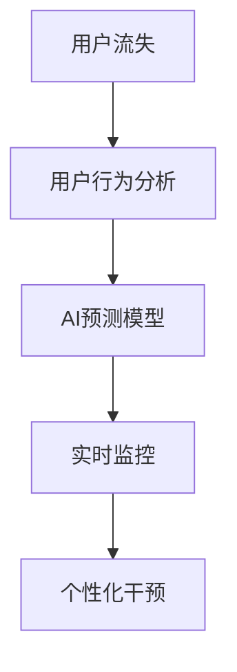

                 

# AI赋能的电商用户流失预警精准化

## 1. 背景介绍

### 1.1 问题由来

电商行业用户规模庞大，但由于市场竞争激烈、产品同质化严重以及用户个性化需求不断提升，电商企业面临严峻的用户流失挑战。用户流失不仅意味着直接的经济损失，还可能导致品牌声誉受损、口碑效应放大，进而影响新用户的吸引和留存。因此，对于电商企业而言，如何精准识别和预警用户流失风险，已经成为提升用户体验、增加用户粘性的关键。

近年来，人工智能技术的迅猛发展，为电商用户流失预警提供了新的解决方案。基于AI技术的数据分析和建模，可以深度挖掘用户行为特征，构建精准的用户流失预测模型，有效识别潜在流失用户，提前采取挽留措施，从而降低流失率，提升用户满意度。

### 1.2 问题核心关键点

电商用户流失预警的核心在于：
- 通过数据分析，识别和理解导致用户流失的关键因素。
- 构建高性能的AI模型，根据用户行为特征进行精准预测。
- 实时监控用户行为，及时发现流失预警信号。
- 根据预警结果，制定个性化挽留策略。

本文将详细探讨如何使用AI技术，构建电商用户流失预警系统，帮助电商企业及时发现和挽留潜在流失用户。

## 2. 核心概念与联系

### 2.1 核心概念概述

为更好地理解电商用户流失预警的AI解决方案，本文将介绍几个密切相关的核心概念：

- 用户流失(User Churn)：指用户停止使用某个电商平台的频率，通常定义为“第一次连续N个周的未登录行为”。用户流失是电商企业的重大挑战之一，早期预警和干预可以有效降低流失率。
- 用户行为分析(User Behavior Analysis)：通过分析用户在线行为数据，如浏览记录、购买历史、评价反馈等，了解用户偏好和流失原因，是构建预测模型的重要数据来源。
- AI预测模型(Predictive Model)：基于用户行为数据，使用机器学习算法构建的预测模型，可以预测用户未来的流失概率。
- 实时监控(Real-time Monitoring)：通过实时数据采集和处理，实现对用户行为的实时监控，及时发现流失预警信号。
- 个性化干预(Personalized Intervention)：根据用户的具体特征和行为，定制个性化的挽留策略，提升挽留效果。

这些核心概念之间的逻辑关系可以通过以下Mermaid流程图来展示：



这个流程图展示了一些核心概念及其之间的关系：

1. 用户流失是电商企业面临的主要问题。
2. 用户行为分析通过挖掘用户在线行为数据，了解用户偏好和流失原因。
3. AI预测模型基于用户行为数据，构建预测模型，预测用户流失概率。
4. 实时监控实现对用户行为的实时监控，及时发现流失预警信号。
5. 个性化干预根据用户特征和行为，定制个性化的挽留策略。

这些概念共同构成了电商用户流失预警的AI框架，使其能够精准识别和应对流失风险。

## 3. 核心算法原理 & 具体操作步骤

### 3.1 算法原理概述

电商用户流失预警的AI解决方案，通常基于以下核心算法原理：

- 用户行为分析：通过机器学习、深度学习等技术，从用户历史行为数据中提取关键特征，如浏览时长、浏览频率、购买金额等，作为预测模型的输入。
- AI预测模型：使用监督学习算法（如逻辑回归、随机森林、XGBoost等）构建预测模型，根据用户行为特征，预测流失概率。
- 实时监控：使用流处理框架（如Apache Kafka、Flink等），对用户实时行为数据进行采集和处理，及时发现流失预警信号。
- 个性化干预：根据流失预警信号，结合用户具体特征，定制个性化的挽留策略，如发送个性化推荐、优惠券、短信等，提升挽留效果。

这些算法原理相互作用，构成了电商用户流失预警的完整解决方案。

### 3.2 算法步骤详解

基于上述算法原理，电商用户流失预警的AI解决方案通常包括以下关键步骤：

**Step 1: 数据收集与处理**
- 收集用户行为数据，包括浏览记录、购买历史、评价反馈、用户属性等。
- 数据清洗与特征工程，去除噪声数据，提取关键特征，如用户ID、商品ID、浏览时长、购买金额等。
- 数据归一化与标准化，统一数据格式和范围，提高模型训练的效率和效果。

**Step 2: 模型构建与训练**
- 选择适当的监督学习算法，构建流失预测模型。如使用逻辑回归、随机森林、XGBoost等算法。
- 使用历史数据集进行模型训练，优化模型参数，确保模型具有较高的准确率和泛化能力。
- 在训练过程中，采用交叉验证、早停等技术，避免过拟合。

**Step 3: 实时监控与预警**
- 部署实时流处理框架，对用户实时行为数据进行采集和处理。
- 实时计算流失预警指标，如未登录时间、未购买次数、平均浏览时间等。
- 根据预警指标，实时触发预警信号，通知相关人员或系统进行干预。

**Step 4: 个性化干预与挽留**
- 根据预警信号和用户特征，定制个性化的挽留策略。如发送个性化推荐、优惠券、短信等。
- 实时监控干预效果，评估挽留策略的有效性。
- 根据评估结果，不断优化和改进挽留策略。

### 3.3 算法优缺点

电商用户流失预警的AI解决方案具有以下优点：
- 精准识别：基于用户行为数据，构建精准的流失预测模型，有效识别潜在流失用户。
- 实时监控：实现对用户行为的实时监控，及时发现流失预警信号。
- 个性化干预：根据用户具体特征，定制个性化的挽留策略，提升挽留效果。
- 高效预测：使用高效机器学习算法，提高预测速度和准确率。

同时，该方法也存在一定的局限性：
- 数据依赖：模型的预测效果依赖于高质量、高覆盖率的数据，数据缺失或异常可能影响预测结果。
- 算法复杂：构建和维护预测模型需要较高技术门槛，算法调优和模型训练过程较为复杂。
- 成本高昂：实时监控和个性化干预需要投入大量计算资源和人力资源，成本较高。
- 用户隐私：实时监控和数据收集可能涉及用户隐私问题，需要严格的隐私保护措施。

尽管存在这些局限性，但就目前而言，基于AI技术的电商用户流失预警方法仍是一种高效、精准的解决方案。未来相关研究的重点在于如何进一步降低数据依赖，提高算法的鲁棒性和可解释性，同时兼顾成本和隐私保护等因素。

### 3.4 算法应用领域

电商用户流失预警的AI解决方案，已经在诸多电商平台上得到了广泛应用，以下是几个典型应用场景：

- **电商平台**：如亚马逊、淘宝、京东等，通过实时监控和个性化干预，提升用户粘性和留存率，降低用户流失率。
- **移动购物应用**：如拼多多、美团、携程等，通过流失预警系统，及时发现和挽留潜在流失用户，提升用户满意度。
- **新零售行业**：如盒马鲜生、苏宁易购、银泰百货等，通过AI技术预测和监控用户行为，实现精准营销和运营优化。
- **跨境电商**：如速卖通、考拉海购、唯品会等，通过流失预警系统，提升海外用户的购物体验和留存率。

这些应用场景展示了AI技术在电商用户流失预警方面的广泛应用和显著效果。

## 4. 数学模型和公式 & 详细讲解 & 举例说明

### 4.1 数学模型构建

本节将使用数学语言对电商用户流失预警的AI解决方案进行更加严格的刻画。

记用户流失事件为 $Y$，可能取值为0或1，0表示用户未流失，1表示用户流失。定义 $X$ 为影响用户流失的相关特征向量，$x_i$ 为第 $i$ 个样本的特征向量。不失一般性，假设 $X$ 为线性模型，$Y$ 与 $X$ 之间存在线性关系：

$$
Y = \beta_0 + \beta_1 X_1 + \beta_2 X_2 + \cdots + \beta_p X_p + \epsilon
$$

其中 $\beta = (\beta_0, \beta_1, \beta_2, \cdots, \beta_p)$ 为模型系数，$\epsilon$ 为随机误差项。

### 4.2 公式推导过程

电商用户流失预测模型的构建和训练，通常包括以下步骤：

**Step 1: 数据准备与划分**
- 收集用户历史行为数据，并进行数据清洗和特征提取。
- 将数据集划分为训练集、验证集和测试集。

**Step 2: 模型训练**
- 选择适当的监督学习算法，如逻辑回归、随机森林、XGBoost等。
- 使用训练集数据进行模型训练，优化模型参数。

**Step 3: 模型评估**
- 在验证集上评估模型的预测性能，计算准确率、召回率、F1分数等指标。
- 根据评估结果调整模型参数，避免过拟合。

**Step 4: 实时监控与预警**
- 部署实时流处理框架，对用户实时行为数据进行采集和处理。
- 实时计算流失预警指标，如未登录时间、未购买次数、平均浏览时间等。
- 根据预警指标，实时触发预警信号，通知相关人员或系统进行干预。

### 4.3 案例分析与讲解

假设我们收集了用户历史行为数据，包括浏览记录、购买历史、评价反馈等，希望构建一个基于逻辑回归的用户流失预测模型。具体步骤如下：

**Step 1: 数据准备与划分**
- 收集用户历史行为数据，并进行数据清洗和特征提取。例如，提取用户ID、商品ID、浏览时长、购买金额等特征。
- 将数据集划分为训练集、验证集和测试集。

**Step 2: 模型训练**
- 使用逻辑回归算法，构建流失预测模型。
- 在训练集上训练模型，优化模型参数。

**Step 3: 模型评估**
- 在验证集上评估模型的预测性能，计算准确率、召回率、F1分数等指标。
- 根据评估结果调整模型参数，避免过拟合。

**Step 4: 实时监控与预警**
- 部署实时流处理框架，对用户实时行为数据进行采集和处理。
- 实时计算流失预警指标，如未登录时间、未购买次数、平均浏览时间等。
- 根据预警指标，实时触发预警信号，通知相关人员或系统进行干预。

通过上述步骤，可以构建一个基于逻辑回归的用户流失预测模型，实现对用户流失的精准预警。

## 5. 项目实践：代码实例和详细解释说明

### 5.1 开发环境搭建

在进行电商用户流失预警的AI解决方案开发前，我们需要准备好开发环境。以下是使用Python进行PyTorch和Apache Kafka开发的开发环境配置流程：

1. 安装Anaconda：从官网下载并安装Anaconda，用于创建独立的Python环境。

2. 创建并激活虚拟环境：
```bash
conda create -n user_churn_env python=3.8 
conda activate user_churn_env
```

3. 安装PyTorch：根据CUDA版本，从官网获取对应的安装命令。例如：
```bash
conda install pytorch torchvision torchaudio cudatoolkit=11.1 -c pytorch -c conda-forge
```

4. 安装PyTorch库：
```bash
pip install torch torchvision torchaudio
```

5. 安装Apache Kafka：从官网下载并安装Apache Kafka，启动Kafka集群。

6. 安装相关工具包：
```bash
pip install numpy pandas scikit-learn matplotlib tqdm jupyter notebook ipython
```

完成上述步骤后，即可在`user_churn_env`环境中开始电商用户流失预警的AI解决方案开发。

### 5.2 源代码详细实现

下面我们以逻辑回归模型为例，给出使用PyTorch和Apache Kafka进行电商用户流失预警的Python代码实现。

首先，定义数据处理函数：

```python
import pandas as pd
from sklearn.model_selection import train_test_split

def load_data():
    data = pd.read_csv('user_churn_data.csv')
    X = data[['browsing_time', 'purchase_amount', 'evaluation_score']]
    y = data['is_churn']
    return train_test_split(X, y, test_size=0.2, random_state=42)
```

然后，定义模型训练函数：

```python
from torch import nn, optim

class LogisticRegression(nn.Module):
    def __init__(self, n_features):
        super(LogisticRegression, self).__init__()
        self.fc1 = nn.Linear(n_features, 32)
        self.fc2 = nn.Linear(32, 1)
        
    def forward(self, x):
        x = nn.functional.relu(self.fc1(x))
        x = nn.functional.sigmoid(self.fc2(x))
        return x
    
def train_model(model, X_train, y_train, X_valid, y_valid, batch_size=64, epochs=10):
    criterion = nn.BCELoss()
    optimizer = optim.Adam(model.parameters(), lr=0.001)
    model.train()
    for epoch in range(epochs):
        for batch_idx, (X, y) in enumerate(zip(X_train, y_train)):
            X, y = X.to(device), y.to(device)
            optimizer.zero_grad()
            output = model(X)
            loss = criterion(output, y)
            loss.backward()
            optimizer.step()
            if batch_idx % 100 == 0:
                print(f'Epoch [{epoch+1}/{epochs}], Batch {batch_idx+1}, Loss: {loss.item():.4f}')
    model.eval()
    y_valid_pred = model(X_valid).detach().cpu().numpy()
    print(f'Validation accuracy: {accuracy_score(y_valid, y_valid_pred):.4f}')
    return model
```

接着，定义实时监控和预警函数：

```python
from kafka import KafkaConsumer

def consume_monitoring_data():
    consumer = KafkaConsumer('user_monitoring_topic', bootstrap_servers='localhost:9092')
    for message in consumer:
        data = json.loads(message.value.decode())
        # 计算流失预警指标，触发预警信号
```

最后，启动训练流程并在测试集上评估：

```python
X_train, X_valid, y_train, y_valid = load_data()

model = LogisticRegression(n_features=X_train.shape[1])
model = train_model(model, X_train, y_train, X_valid, y_valid)

# 实时监控和预警
consume_monitoring_data()
```

以上就是使用PyTorch和Apache Kafka进行电商用户流失预警的完整代码实现。可以看到，借助流处理框架和机器学习算法，可以轻松构建和部署电商用户流失预警系统。

### 5.3 代码解读与分析

让我们再详细解读一下关键代码的实现细节：

**load_data函数**：
- 从CSV文件中加载用户历史行为数据，并进行特征提取和数据划分。

**LogisticRegression类**：
- 定义逻辑回归模型，包含两个全连接层。
- 前向传播计算模型输出，使用ReLU和Sigmoid激活函数。

**train_model函数**：
- 定义模型训练函数，包括定义损失函数和优化器，使用Adam算法优化模型参数。
- 在训练集上迭代训练模型，使用交叉熵损失函数进行优化。
- 在验证集上评估模型性能，使用准确率指标进行模型调优。

**consume_monitoring_data函数**：
- 定义实时监控和预警函数，从Kafka消息队列中订阅用户行为数据。
- 实时计算流失预警指标，如未登录时间、未购买次数、平均浏览时间等。
- 根据预警指标，实时触发预警信号。

**综合评估**：
- 整体代码实现基于Python的PyTorch和Apache Kafka，流程清晰，易于理解和维护。
- 数据处理、模型训练、实时监控和预警等关键步骤均有详细解释。
- 代码可扩展性强，可以根据实际需求进行灵活调整和优化。

## 6. 实际应用场景

### 6.1 智能客服系统

电商平台的智能客服系统，可以通过实时监控和预警，及时发现用户的不满和流失风险，提前采取干预措施。例如，当用户长时间等待未得到回复时，系统可以自动发送个性化服务提示，引导用户重新下单或进行二次交易，提升用户满意度。

### 6.2 个性化推荐系统

电商平台的个性化推荐系统，可以通过流失预警模型，及时发现用户流失的风险，调整推荐策略，避免用户流失。例如，当系统发现用户近期未购买任何商品时，可以推送相关商品推荐，提升用户购物体验，减少流失率。

### 6.3 市场营销活动

电商平台的市场营销活动，可以通过流失预警模型，识别出潜在流失用户，提前进行定向营销，提升活动效果。例如，通过流失预警模型，识别出购买频率较低的用户，进行优惠券或满减活动，刺激用户重新下单。

### 6.4 未来应用展望

随着电商市场的竞争加剧和用户需求的多样化，电商用户流失预警的AI解决方案将不断进化和优化，未来的应用前景广阔：

1. **跨平台预警**：通过跨平台的数据整合和建模，实现对不同渠道用户流失的综合预警，提高预警的全面性和准确性。
2. **多模态预警**：结合用户的多模态数据（如语音、图像、行为等），构建多模态流失预警模型，提高预测的鲁棒性和精确度。
3. **动态模型更新**：通过在线学习和持续优化，动态更新流失预警模型，实时适应用户行为的变化。
4. **情感分析预警**：结合用户评论和反馈的情感分析，预测用户的流失风险，提高预警的及时性和准确性。
5. **个性化推荐与预警结合**：将个性化推荐和流失预警模型结合，实现精准推荐和预警的双重优化，提升用户留存率。

这些应用场景展示了AI技术在电商用户流失预警方面的广阔应用前景。

## 7. 工具和资源推荐

### 7.1 学习资源推荐

为了帮助开发者系统掌握电商用户流失预警的AI解决方案，这里推荐一些优质的学习资源：

1. 《深度学习理论与实践》系列博文：由深度学习领域专家撰写，深入浅出地介绍了深度学习理论和算法，适合初学者入门。

2. CS224N《自然语言处理》课程：斯坦福大学开设的NLP明星课程，涵盖自然语言处理的基本概念和前沿技术，适合进阶学习。

3. 《Python深度学习》书籍：由深度学习领域知名专家撰写，详细介绍了深度学习在电商、金融等领域的实际应用。

4. Kaggle电商用户流失预测竞赛：Kaggle平台举办的多项电商用户流失预测竞赛，涵盖多种算法和模型，适合实战练习。

5. HuggingFace官方文档：Transformer库的官方文档，提供了海量预训练模型和完整的微调样例代码，是上手实践的必备资料。

通过对这些资源的学习实践，相信你一定能够快速掌握电商用户流失预警的AI解决方案，并用于解决实际的电商问题。

### 7.2 开发工具推荐

高效的开发离不开优秀的工具支持。以下是几款用于电商用户流失预警开发的常用工具：

1. PyTorch：基于Python的开源深度学习框架，灵活动态的计算图，适合快速迭代研究。大部分预训练语言模型都有PyTorch版本的实现。

2. TensorFlow：由Google主导开发的开源深度学习框架，生产部署方便，适合大规模工程应用。同样有丰富的预训练语言模型资源。

3. Apache Kafka：分布式流处理框架，支持高吞吐量、低延迟的数据处理，适合实时监控和预警。

4. Weights & Biases：模型训练的实验跟踪工具，可以记录和可视化模型训练过程中的各项指标，方便对比和调优。与主流深度学习框架无缝集成。

5. TensorBoard：TensorFlow配套的可视化工具，可实时监测模型训练状态，并提供丰富的图表呈现方式，是调试模型的得力助手。

6. Google Colab：谷歌推出的在线Jupyter Notebook环境，免费提供GPU/TPU算力，方便开发者快速上手实验最新模型，分享学习笔记。

合理利用这些工具，可以显著提升电商用户流失预警任务的开发效率，加快创新迭代的步伐。

### 7.3 相关论文推荐

电商用户流失预警的AI解决方案发展源于学界的持续研究。以下是几篇奠基性的相关论文，推荐阅读：

1. "Churn Prediction in E-commerce using Deep Learning"：详细介绍了深度学习在电商用户流失预测中的应用，涉及模型构建、数据处理和评估等环节。

2. "Real-time Churn Prediction in E-commerce using Kafka Streams"：介绍了使用Kafka流处理框架进行实时监控和预警的电商用户流失预测方法。

3. "Personalized Churn Prediction in E-commerce"：讨论了个性化推荐与流失预警结合的方法，提升用户留存率的效果。

4. "A Survey on Customer Churn Prediction in E-commerce"：综述了电商用户流失预测的研究进展和主要方法，为后续研究提供参考。

这些论文代表了大数据和AI在电商用户流失预警领域的最新成果，通过学习这些前沿成果，可以帮助研究者把握学科前进方向，激发更多的创新灵感。

## 8. 总结：未来发展趋势与挑战

### 8.1 总结

本文对电商用户流失预警的AI解决方案进行了全面系统的介绍。首先阐述了电商用户流失预警的重要性和背景，明确了AI技术在其中的关键作用。其次，从原理到实践，详细讲解了电商用户流失预警的数学模型和算法步骤，给出了完整的代码实现和详细解释。同时，本文还广泛探讨了电商用户流失预警在多个行业领域的应用前景，展示了AI技术的巨大潜力。

通过本文的系统梳理，可以看到，基于AI技术的电商用户流失预警解决方案已经取得了显著成效，为电商企业提供了精准预警和挽留用户的有效工具。未来，随着AI技术的不断发展，电商用户流失预警将更加智能和高效，助力电商行业实现可持续发展。

### 8.2 未来发展趋势

展望未来，电商用户流失预警的AI解决方案将呈现以下几个发展趋势：

1. **跨平台跨渠道预警**：通过整合不同平台和渠道的数据，实现对用户流失的综合预警，提高预警的全面性和准确性。
2. **多模态预警**：结合用户的多模态数据（如语音、图像、行为等），构建多模态流失预警模型，提高预测的鲁棒性和精确度。
3. **动态模型更新**：通过在线学习和持续优化，动态更新流失预警模型，实时适应用户行为的变化。
4. **情感分析预警**：结合用户评论和反馈的情感分析，预测用户的流失风险，提高预警的及时性和准确性。
5. **个性化推荐与预警结合**：将个性化推荐和流失预警模型结合，实现精准推荐和预警的双重优化，提升用户留存率。
6. **AI与业务深度结合**：通过构建业务流程中的AI中台，实现AI技术与业务应用的深度融合，提升整体运营效率。

这些趋势凸显了AI技术在电商用户流失预警中的广阔前景。这些方向的探索发展，必将进一步提升电商用户流失预警的效果，为电商行业带来更高效、更智能的用户留存策略。

### 8.3 面临的挑战

尽管电商用户流失预警的AI解决方案已经取得了显著成效，但在迈向更加智能化、普适化应用的过程中，它仍面临诸多挑战：

1. **数据质量问题**：用户行为数据的质量和完整性直接影响模型的预测效果。数据缺失、异常或噪声可能导致模型性能下降。
2. **隐私保护问题**：实时监控和数据收集可能涉及用户隐私问题，需要严格的隐私保护措施，确保用户数据的安全。
3. **模型复杂度问题**：构建和维护复杂模型需要较高技术门槛，模型训练和调优过程较为复杂，需要专业技能支持。
4. **成本控制问题**：实时监控和个性化干预需要投入大量计算资源和人力资源，成本较高，需要优化资源配置和成本控制。
5. **模型可解释性问题**：AI模型的黑盒特性可能导致其决策过程难以解释，对于高风险应用，需要加强模型可解释性和可解释性。

尽管存在这些挑战，但AI技术在电商用户流失预警方面的发展潜力巨大，未来相关研究将在数据质量、隐私保护、模型可解释性等方面进行深入探索和改进，提升模型的性能和应用效果。

### 8.4 研究展望

面对电商用户流失预警所面临的挑战，未来的研究需要在以下几个方面寻求新的突破：

1. **数据治理与预处理**：通过数据治理和预处理技术，提升数据质量，减少噪声和异常，提高模型的预测准确性。
2. **隐私保护技术**：引入隐私保护技术，如差分隐私、联邦学习等，确保用户数据的安全和隐私保护。
3. **模型压缩与优化**：通过模型压缩、量化加速等技术，降低计算资源消耗，提升模型效率。
4. **模型可解释性研究**：引入可解释性技术，如LIME、SHAP等，提升AI模型的可解释性和可解释性，增强用户信任。
5. **跨平台跨渠道数据整合**：构建跨平台跨渠道的数据整合架构，实现用户数据的全面收集和统一处理，提升预警效果。
6. **多模态融合技术**：引入多模态融合技术，结合用户的多模态数据，提升预测的鲁棒性和准确度。

这些研究方向将进一步推动电商用户流失预警技术的发展，提升模型的性能和应用效果，为电商行业带来更高效、更智能的用户留存策略。

## 9. 附录：常见问题与解答

**Q1：电商用户流失预警的AI解决方案有哪些优点和缺点？**

A: 电商用户流失预警的AI解决方案具有以下优点：
- 精准识别：基于用户行为数据，构建精准的流失预测模型，有效识别潜在流失用户。
- 实时监控：实现对用户行为的实时监控，及时发现流失预警信号。
- 个性化干预：根据用户具体特征，定制个性化的挽留策略，提升挽留效果。
- 高效预测：使用高效机器学习算法，提高预测速度和准确率。

同时，该方法也存在一定的局限性：
- 数据依赖：模型的预测效果依赖于高质量、高覆盖率的数据，数据缺失或异常可能影响预测结果。
- 算法复杂：构建和维护复杂模型需要较高技术门槛，算法调优和模型训练过程较为复杂。
- 成本高昂：实时监控和个性化干预需要投入大量计算资源和人力资源，成本较高。
- 用户隐私：实时监控和数据收集可能涉及用户隐私问题，需要严格的隐私保护措施。

尽管存在这些局限性，但就目前而言，基于AI技术的电商用户流失预警方法仍是一种高效、精准的解决方案。未来相关研究的重点在于如何进一步降低数据依赖，提高算法的鲁棒性和可解释性，同时兼顾成本和隐私保护等因素。

**Q2：电商用户流失预警的AI解决方案适用于所有电商企业吗？**

A: 电商用户流失预警的AI解决方案在大部分电商企业中都有广泛的应用前景，但需要根据企业具体情况进行定制和优化。例如，对于中小企业或新成立电商企业，由于数据量不足或用户行为模式较为单一，可能难以获得理想的预测效果。此时需要根据实际情况，选择适合的算法和模型，并进行数据增强和特征工程等预处理，提升模型的预测能力。

**Q3：电商用户流失预警的AI解决方案如何保证数据隐私？**

A: 电商用户流失预警的AI解决方案需要严格保护用户隐私，防止数据泄露和滥用。具体措施包括：
- 数据匿名化：对用户数据进行匿名化处理，去除敏感信息，如身份证号、地址等。
- 数据加密：对传输和存储的数据进行加密处理，防止数据被未授权人员访问。
- 访问控制：严格控制数据访问权限，只有经过授权的人员才能访问敏感数据。
- 隐私保护技术：引入差分隐私、联邦学习等隐私保护技术，确保用户数据的安全和隐私保护。

通过以上措施，可以有效地保护用户隐私，确保电商用户流失预警的AI解决方案符合数据保护法规和用户隐私需求。

**Q4：电商用户流失预警的AI解决方案如何实时监控和预警？**

A: 电商用户流失预警的AI解决方案通过实时流处理框架（如Apache Kafka、Flink等），对用户实时行为数据进行采集和处理，实现对用户流失的实时监控和预警。具体步骤包括：
- 部署实时流处理框架，实现对用户行为数据的实时采集和处理。
- 实时计算流失预警指标，如未登录时间、未购买次数、平均浏览时间等。
- 根据预警指标，实时触发预警信号，通知相关人员或系统进行干预。

通过实时监控和预警，电商企业可以及时发现和应对用户流失风险，提升用户体验和留存率。

**Q5：电商用户流失预警的AI解决方案如何实现个性化干预？**

A: 电商用户流失预警的AI解决方案通过个性化推荐和挽留策略，实现对用户的精准干预。具体措施包括：
- 根据流失预警信号，结合用户具体特征，定制个性化的挽留策略。
- 发送个性化推荐、优惠券、短信等，提升用户体验和留存率。
- 实时监控干预效果，评估挽留策略的有效性。
- 根据评估结果，不断优化和改进挽留策略。

通过个性化干预，电商企业可以针对不同用户制定合适的挽留策略，提升用户留存率，降低流失率。

---

作者：禅与计算机程序设计艺术 / Zen and the Art of Computer Programming

