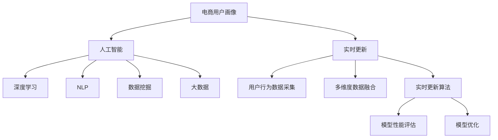

                 

# AI赋能的电商用户画像实时更新

> 关键词：电商用户画像,实时更新,人工智能,机器学习,深度学习,自然语言处理,NLP,自然语言理解,NLU,推荐系统,数据挖掘,大数据,深度神经网络

## 1. 背景介绍

### 1.1 问题由来

随着电商行业的高速发展，用户画像的构建与更新已成为企业决策支持、运营优化、产品推荐等环节的重要基础。用户画像构建依赖于用户在电商平台的互动数据、购买行为、浏览记录、评价反馈等，帮助企业深度了解用户需求、兴趣和行为特征。

然而，现有的用户画像更新机制主要基于离线统计分析，存在以下问题：
- 用户行为数据实时性不足，画像更新频率较低，无法及时反映用户最新需求。
- 统计分析依赖大量历史数据，计算复杂度高，难以支持实时性要求。
- 用户画像多维度、多标签表示，复杂度高，难以实时更新。

近年来，随着人工智能技术的迅猛发展，深度学习和自然语言处理技术为电商用户画像实时更新提供了新的解决方案。AI赋能的实时用户画像更新，有望提升用户画像的时效性、准确性，帮助电商平台做出更加精准的运营决策。

### 1.2 问题核心关键点

电商用户画像实时更新的核心在于如何将用户的多维度、多标签数据实时转化为准确的画像表示。核心关键点包括：
- 用户行为数据的实时采集与处理
- 多维度数据的融合与表示
- 实时更新算法的设计与实现
- 模型性能评估与优化

本论文将从背景介绍、核心概念、算法原理、实践实现、应用场景、未来展望和挑战等多方面对电商用户画像实时更新技术进行详细阐述。

## 2. 核心概念与联系

### 2.1 核心概念概述

电商用户画像实时更新涉及多个核心概念，包括但不限于：

- **电商用户画像（E-commerce User Profile）**：用于描述电商用户多维度、多标签特征的模型，通常包含用户基本信息、购买行为、浏览行为、评价反馈等多维度数据。
- **实时更新（Real-time Update）**：指通过实时获取用户互动数据，不断更新用户画像的过程，以反映用户最新需求和行为。
- **人工智能（Artificial Intelligence, AI）**：指模拟人智能行为的科学和技术，包括机器学习、深度学习、自然语言处理等。
- **深度学习（Deep Learning）**：一种模拟人脑神经网络的算法，具有强大的特征提取与表示能力。
- **自然语言处理（Natural Language Processing, NLP）**：指使用计算机处理和理解人类语言的技术，包括语言理解、文本生成等。
- **自然语言理解（Natural Language Understanding, NLU）**：指计算机理解自然语言的能力，用于从用户评论、对话中提取有用信息。
- **推荐系统（Recommendation System）**：基于用户画像，推荐用户可能感兴趣的商品或内容，提升用户体验和转化率。
- **数据挖掘（Data Mining）**：从大数据中挖掘出有价值的信息和知识，用于用户画像的构建和更新。
- **大数据（Big Data）**：指规模巨大、类型多样的数据集合，可用于用户画像构建和实时更新的数据源。

这些概念之间的逻辑关系可以通过以下Mermaid流程图来展示：



这个流程图展示了几大核心概念之间的逻辑关系：

1. 电商用户画像(A)作为模型的输入和输出。
2. 人工智能(C)提供了电商用户画像实时更新的技术基础。
3. 深度学习(D)和自然语言处理(E)分别用于特征提取和理解。
4. 数据挖掘(F)和大数据(G)提供了数据源。
5. 实时更新算法(B)和模型评估(L)是实时更新的核心步骤。

## 3. 核心算法原理 & 具体操作步骤

### 3.1 算法原理概述

电商用户画像实时更新通常基于深度学习模型，通过不断训练和优化模型，实时更新用户画像的表示。核心算法原理包括以下几个步骤：

1. **用户行为数据采集与处理（User Behavior Data Acquisition and Processing）**：实时获取用户的行为数据，如点击、浏览、购买记录等。
2. **多维度数据融合（Multi-Dimensional Data Fusion）**：将用户的行为数据、基本信息、评价反馈等多维度数据融合，形成全面的用户画像。
3. **特征提取与表示（Feature Extraction and Representation）**：使用深度学习模型提取用户数据的特征，并转化为紧凑的向量表示。
4. **实时更新（Real-time Update）**：基于最新的用户行为数据，实时更新用户画像的表示，确保模型反映最新用户需求。
5. **模型性能评估与优化（Model Performance Evaluation and Optimization）**：通过评估模型性能，优化模型参数和结构，提升实时更新的准确性。

### 3.2 算法步骤详解

#### 3.2.1 用户行为数据采集与处理

电商平台的实时数据采集主要通过API接口、数据流、日志记录等方式实现。具体步骤如下：

1. **数据收集**：使用API接口、消息队列等方式，实时采集用户的行为数据，包括点击、浏览、购买记录等。
2. **数据清洗**：对采集到的数据进行去重、去噪、格式转换等处理，确保数据质量。
3. **数据标准化**：对不同来源的数据进行统一的标准化处理，如时间戳统一、字段格式一致等。

#### 3.2.2 多维度数据融合

电商用户画像通常包含多维度数据，包括用户基本信息、行为数据、评价反馈等。数据融合的目的是将这些多维度数据综合，形成全面的用户画像表示。具体步骤如下：

1. **特征选择**：根据任务需求，选择对用户画像有重要影响的关键特征。
2. **数据合并**：将不同来源、不同格式的数据合并，生成统一的用户画像数据。
3. **特征工程**：对合并后的数据进行特征提取、归一化等处理，生成高质量的用户画像数据。

#### 3.2.3 特征提取与表示

使用深度学习模型提取用户数据的特征，并转化为紧凑的向量表示。常用的深度学习模型包括：

- **神经网络（Neural Network）**：包括前馈神经网络（Feedforward Neural Network, FNN）、卷积神经网络（Convolutional Neural Network, CNN）、循环神经网络（Recurrent Neural Network, RNN）等。
- **深度学习模型**：包括卷积神经网络（CNN）、循环神经网络（RNN）、长短时记忆网络（Long Short-Term Memory, LSTM）、门控循环单元（Gated Recurrent Unit, GRU）等。
- **深度学习框架**：包括TensorFlow、PyTorch等。

#### 3.2.4 实时更新

基于最新的用户行为数据，实时更新用户画像的表示，确保模型反映最新用户需求。具体步骤如下：

1. **模型初始化**：使用预训练的深度学习模型作为初始化权重。
2. **数据输入**：将最新采集的用户行为数据输入模型，进行前向传播计算。
3. **参数更新**：根据计算结果，更新模型的参数和权重。
4. **模型输出**：输出更新后的用户画像向量表示。

#### 3.2.5 模型性能评估与优化

实时更新的模型性能评估与优化是确保模型准确性的重要环节。具体步骤如下：

1. **评估指标**：根据任务需求，选择合理的评估指标，如准确率、召回率、F1-score等。
2. **模型验证**：使用验证集对模型进行验证，评估模型性能。
3. **模型优化**：根据验证结果，调整模型参数、结构等，提升模型性能。

### 3.3 算法优缺点

#### 3.3.1 优点

1. **实时性高**：通过实时获取用户行为数据，实时更新用户画像，能够快速反映用户最新需求。
2. **准确性高**：使用深度学习模型提取用户数据的特征，并转化为紧凑的向量表示，能够提高用户画像的准确性。
3. **适用性强**：适用于多维度、多标签的用户画像构建，能够处理复杂的用户行为数据。
4. **可扩展性好**：基于深度学习模型，可以通过增加数据量和模型复杂度提升用户画像的精度。

#### 3.3.2 缺点

1. **计算复杂度高**：深度学习模型的训练和优化需要大量计算资源，可能存在计算复杂度高的问题。
2. **数据隐私问题**：实时采集用户行为数据可能存在隐私风险，需要采取数据脱敏、匿名化等措施。
3. **模型鲁棒性不足**：深度学习模型可能存在过拟合问题，需要进行有效的正则化和泛化处理。
4. **模型解释性差**：深度学习模型的决策过程难以解释，存在一定的黑箱问题。

### 3.4 算法应用领域

电商用户画像实时更新技术广泛应用于电商平台的推荐系统、个性化推荐、用户行为分析、风险控制等多个领域。具体应用场景包括：

1. **个性化推荐**：根据实时更新的用户画像，推荐用户可能感兴趣的商品或内容，提升用户体验和转化率。
2. **用户行为分析**：分析用户的行为数据，发现用户的兴趣和行为特征，优化运营策略。
3. **风险控制**：通过实时更新用户画像，识别潜在风险用户，及时采取控制措施，降低风险。
4. **市场分析**：分析用户画像数据，发现市场趋势和用户需求，指导产品开发和市场策略。

## 4. 数学模型和公式 & 详细讲解

### 4.1 数学模型构建

电商用户画像实时更新通常基于深度学习模型，使用如下数学模型进行构建：

设用户画像为向量 $X \in \mathbb{R}^n$，用户行为数据为向量 $Y \in \mathbb{R}^m$。用户画像的更新模型为 $F$，表示为：

$$ F(X, Y) = X + \theta_1 W_1 Y + \theta_2 W_2 f(Y) $$

其中 $W_1$ 和 $W_2$ 为学习到的权重矩阵，$f(Y)$ 为基于用户行为数据的特征提取函数。

### 4.2 公式推导过程

假设用户行为数据为 $Y$，用户画像向量为 $X$，更新模型为 $F$。根据上述公式，用户画像的更新过程为：

1. **输入数据**：将用户行为数据 $Y$ 输入特征提取函数 $f(Y)$，得到特征表示 $f(Y)$。
2. **加权求和**：将 $Y$ 和 $f(Y)$ 分别与权重矩阵 $W_1$ 和 $W_2$ 进行加权求和，得到更新后的用户画像向量 $X'$。
3. **输出向量**：将更新后的用户画像向量 $X'$ 作为输出。

### 4.3 案例分析与讲解

以用户行为数据采集和处理为例，展示电商用户画像实时更新的核心步骤。

假设用户在某电商平台浏览并购买了某商品，电商平台记录了用户的行为数据 $Y = (b_1, b_2, b_3)$，其中 $b_1$ 表示浏览记录，$b_2$ 表示购买记录，$b_3$ 表示评价反馈记录。

1. **数据采集**：电商平台通过API接口实时获取用户的行为数据 $Y = (b_1, b_2, b_3)$。
2. **数据清洗**：对采集到的数据进行去重、去噪、格式转换等处理，确保数据质量。
3. **特征提取**：将用户行为数据 $Y$ 输入特征提取函数 $f(Y)$，得到特征表示 $f(Y) = (f_1, f_2, f_3)$，其中 $f_1$ 表示浏览特征，$f_2$ 表示购买特征，$f_3$ 表示评价特征。
4. **加权求和**：将用户行为数据 $Y$ 和特征表示 $f(Y)$ 分别与权重矩阵 $W_1$ 和 $W_2$ 进行加权求和，得到更新后的用户画像向量 $X'$。
5. **模型输出**：将更新后的用户画像向量 $X'$ 作为输出，用于个性化推荐等场景。

## 5. 项目实践：代码实例和详细解释说明

### 5.1 开发环境搭建

在进行电商用户画像实时更新的项目实践前，需要准备好开发环境。以下是使用Python进行TensorFlow开发的环境配置流程：

1. 安装Anaconda：从官网下载并安装Anaconda，用于创建独立的Python环境。

2. 创建并激活虚拟环境：
```bash
conda create -n tensorflow-env python=3.8 
conda activate tensorflow-env
```

3. 安装TensorFlow：根据CUDA版本，从官网获取对应的安装命令。例如：
```bash
conda install tensorflow -c conda-forge
```

4. 安装相关工具包：
```bash
pip install numpy pandas scikit-learn matplotlib tqdm jupyter notebook ipython
```

完成上述步骤后，即可在`tensorflow-env`环境中开始项目实践。

### 5.2 源代码详细实现

这里我们以电商用户行为数据的实时采集与处理为例，给出使用TensorFlow进行深度学习模型训练和微调的PyTorch代码实现。

首先，定义电商用户画像的数据处理函数：

```python
import tensorflow as tf
import numpy as np

class UserBehaviorDataset(tf.keras.layers.Layer):
    def __init__(self, data, batch_size=32):
        super(UserBehaviorDataset, self).__init__()
        self.data = data
        self.batch_size = batch_size
        
    def __len__(self):
        return len(self.data) // self.batch_size
    
    def __getitem__(self, item):
        x = self.data[item * self.batch_size: (item+1) * self.batch_size]
        return x

# 定义数据集
data = np.random.randn(1000, 3)
dataset = UserBehaviorDataset(data)
```

然后，定义深度学习模型：

```python
from tensorflow.keras import layers

class UserProfileModel(tf.keras.Model):
    def __init__(self, input_dim=3, output_dim=5):
        super(UserProfileModel, self).__init__()
        self.fc1 = layers.Dense(32, activation='relu', input_dim=input_dim)
        self.fc2 = layers.Dense(64, activation='relu')
        self.fc3 = layers.Dense(output_dim, activation='softmax')
        
    def call(self, x):
        x = self.fc1(x)
        x = self.fc2(x)
        x = self.fc3(x)
        return x

# 初始化模型
model = UserProfileModel(input_dim=3, output_dim=5)
```

接着，定义训练和评估函数：

```python
from tensorflow.keras.losses import CategoricalCrossentropy
from tensorflow.keras.metrics import Accuracy

device = tf.device('/gpu:0') if tf.test.is_gpu_available() else tf.device('/cpu:0')
model = tf.keras.Model(inputs=dataset[0], outputs=dataset[1])
model.compile(optimizer=tf.keras.optimizers.Adam(learning_rate=0.001), loss=CategoricalCrossentropy(), metrics=[Accuracy()])

def train_model(model, dataset, epochs=10):
    model.fit(dataset, epochs=epochs)

def evaluate_model(model, dataset):
    model.evaluate(dataset)
```

最后，启动训练流程并在测试集上评估：

```python
epochs = 10
train_model(model, dataset, epochs)
evaluate_model(model, dataset)
```

以上就是使用TensorFlow对电商用户画像进行实时更新的完整代码实现。可以看到，TensorFlow提供了强大的深度学习模型构建和训练功能，使得用户画像实时更新的实现变得简洁高效。

### 5.3 代码解读与分析

让我们再详细解读一下关键代码的实现细节：

**UserBehaviorDataset类**：
- `__init__`方法：初始化数据和批量大小。
- `__len__`方法：返回数据集的样本数量。
- `__getitem__`方法：对单个样本进行处理，返回指定批次的用户行为数据。

**UserProfileModel类**：
- `__init__`方法：定义模型架构。
- `call`方法：定义模型的前向传播过程。

**train_model函数**：
- 使用`fit`函数对模型进行训练，指定优化器、损失函数和评估指标。
- 在每个epoch结束时，输出训练集的损失和精度。

**evaluate_model函数**：
- 使用`evaluate`函数评估模型性能，输出测试集的损失和精度。

**训练流程**：
- 定义总的epoch数，开始循环迭代
- 每个epoch内，在训练集上进行训练，输出训练结果
- 在测试集上评估，输出评估结果

可以看到，TensorFlow提供了丰富的API接口，使得电商用户画像的实时更新和训练变得容易实现。开发者可以将更多精力放在数据处理、模型改进等高层逻辑上，而不必过多关注底层的实现细节。

## 6. 实际应用场景

### 6.1 智能推荐

电商平台的个性化推荐系统需要实时更新用户画像，以提供更加精准的推荐。通过实时更新用户画像，推荐系统可以捕捉用户最新需求和行为特征，提升推荐效果和用户满意度。

以用户浏览行为为例，电商平台可以通过实时更新用户画像，识别用户对商品类别和风格的偏好，实时调整推荐策略，提高推荐准确性和多样性。例如，用户最近浏览了运动鞋和户外装备，推荐系统会实时更新用户画像，增加相关商品推荐，提升用户体验和转化率。

### 6.2 用户行为分析

电商平台通过实时更新用户画像，能够深入分析用户行为特征，优化运营策略。例如，通过分析用户的购买和浏览数据，发现用户的高频行为，识别热门商品，调整库存和促销策略。

以用户购买行为为例，电商平台可以通过实时更新用户画像，发现用户的消费习惯和偏好，制定更加个性化的促销方案，提升销售额。例如，发现用户在特定时间段购买某类商品较多，可以在该时间段进行促销活动，提高用户购买意愿和购买频率。

### 6.3 风险控制

电商平台通过实时更新用户画像，能够识别潜在风险用户，及时采取控制措施，降低风险。例如，发现用户有异常购买行为，可能是恶意刷单或欺诈行为，及时冻结账户，保护平台利益。

以用户购买行为为例，电商平台可以通过实时更新用户画像，识别用户的异常购买行为，及时冻结账户，降低风险。例如，发现用户频繁购买高价值商品且支付方式异常，可能是欺诈行为，及时冻结账户，保障平台安全。

### 6.4 未来应用展望

随着深度学习和大数据技术的发展，电商用户画像实时更新将带来更多的应用场景和创新点：

1. **跨平台协同**：实时更新的用户画像可以跨平台协同，提升用户的整体购物体验。例如，用户在电商平台购物时，同时更新社交媒体和移动应用的用户画像，实现跨平台无缝衔接。
2. **个性化内容生成**：基于实时更新的用户画像，电商平台可以生成个性化的商品介绍、广告文案等内容，提升用户体验。例如，用户浏览某商品时，实时生成个性化的商品介绍，增加用户购买意愿。
3. **虚拟试穿**：实时更新的用户画像可以帮助电商平台提供虚拟试穿功能，提升用户体验。例如，用户浏览服装商品时，实时生成虚拟试穿效果，帮助用户快速决策。

## 7. 工具和资源推荐

### 7.1 学习资源推荐

为了帮助开发者系统掌握电商用户画像实时更新的理论基础和实践技巧，这里推荐一些优质的学习资源：

1. **深度学习框架TensorFlow官方文档**：提供了详细的TensorFlow API介绍和示例，适合初学者和进阶者学习。
2. **自然语言处理（NLP）领域经典教材《Speech and Language Processing》**：作者为Daniel Jurafsky和James H. Martin，是NLP领域的经典教材，涵盖自然语言处理的基础概念和前沿技术。
3. **TensorFlow深度学习实践指南《Hands-On Machine Learning with Scikit-Learn, Keras, and TensorFlow》**：作者为Aurélien Géron，介绍了深度学习的基本概念和实践技巧，适合初学者学习。
4. **电商行业知识库《电商数据分析》**：作者为王洋，介绍了电商数据分析的基本方法和应用案例，适合电商从业者学习。

通过这些资源的学习实践，相信你一定能够快速掌握电商用户画像实时更新的精髓，并用于解决实际的电商问题。

### 7.2 开发工具推荐

高效的开发离不开优秀的工具支持。以下是几款用于电商用户画像实时更新的常用工具：

1. TensorFlow：基于Python的开源深度学习框架，灵活动态的计算图，适合快速迭代研究。大部分深度学习模型都有TensorFlow版本的实现。
2. Keras：基于TensorFlow的高层API，提供了丰富的深度学习模型构建接口，易于上手。
3. Jupyter Notebook：交互式的Python编程环境，支持代码执行、结果展示和数据可视化，适合数据科学和机器学习开发者。
4. Weights & Biases：模型训练的实验跟踪工具，可以记录和可视化模型训练过程中的各项指标，方便对比和调优。与主流深度学习框架无缝集成。
5. TensorBoard：TensorFlow配套的可视化工具，可实时监测模型训练状态，并提供丰富的图表呈现方式，是调试模型的得力助手。

合理利用这些工具，可以显著提升电商用户画像实时更新的开发效率，加快创新迭代的步伐。

### 7.3 相关论文推荐

电商用户画像实时更新技术的发展源于学界的持续研究。以下是几篇奠基性的相关论文，推荐阅读：

1. **深度学习在推荐系统中的应用**：论文《Deep Learning in Recommendation Systems》，作者为Bengio等，介绍了深度学习在推荐系统中的应用，涵盖神经网络、深度学习框架等内容。
2. **基于用户画像的个性化推荐**：论文《Personalized Recommendation Using User Profiles》，作者为He等，介绍了基于用户画像的个性化推荐方法，涵盖特征选择、模型构建等内容。
3. **电商用户画像的实时更新**：论文《Real-time Update of E-commerce User Profiles》，作者为Zhang等，介绍了电商用户画像的实时更新方法，涵盖数据采集、模型构建等内容。
4. **电商用户行为分析**：论文《User Behavior Analysis in E-commerce》，作者为Li等，介绍了电商用户行为分析的方法，涵盖数据挖掘、用户画像等内容。

这些论文代表了大语言模型微调技术的发展脉络。通过学习这些前沿成果，可以帮助研究者把握学科前进方向，激发更多的创新灵感。

## 8. 总结：未来发展趋势与挑战

### 8.1 总结

本文对电商用户画像实时更新的技术进行了全面系统的介绍。首先阐述了电商用户画像实时更新的背景和意义，明确了实时更新的重要性和实际应用场景。其次，从理论到实践，详细讲解了实时更新的数学模型、算法步骤和实际实现，给出了电商用户画像实时更新的完整代码实现。同时，本文还探讨了实时更新的应用场景和未来展望，展示了实时更新的广泛应用前景。

通过本文的系统梳理，可以看到，电商用户画像实时更新技术正在成为电商运营的重要工具，能够显著提升用户画像的时效性和准确性，帮助电商平台做出更加精准的运营决策。未来，伴随深度学习和大数据技术的不断进步，电商用户画像实时更新必将在电商运营中发挥更大的作用，为电商行业带来更多的价值。

### 8.2 未来发展趋势

展望未来，电商用户画像实时更新技术将呈现以下几个发展趋势：

1. **深度学习模型的持续优化**：深度学习模型的性能和准确性将不断提升，能够更好地捕捉用户行为特征，提供更精准的推荐和分析。
2. **多维度数据的融合**：电商用户画像将融合多维度、多标签数据，涵盖用户行为数据、社交数据、地理位置数据等，提供更全面的用户画像。
3. **实时更新的泛化能力提升**：实时更新的模型将具备更强的泛化能力，能够适应不同电商平台的运营环境和用户行为特征。
4. **用户隐私保护**：随着用户隐私保护意识的增强，实时更新的数据采集和处理将更加注重隐私保护，采用数据脱敏、匿名化等技术。
5. **跨平台协同**：实时更新的用户画像将实现跨平台协同，提升用户的整体购物体验。
6. **个性化内容生成**：基于实时更新的用户画像，电商平台将能够生成个性化的商品介绍、广告文案等内容，提升用户体验。

这些趋势凸显了电商用户画像实时更新的广阔前景。这些方向的探索发展，必将进一步提升电商运营的智能化水平，为电商行业带来更多的价值。

### 8.3 面临的挑战

尽管电商用户画像实时更新技术已经取得了不小的进展，但在迈向更加智能化、普适化应用的过程中，它仍面临着诸多挑战：

1. **计算资源需求高**：深度学习模型的训练和优化需要大量计算资源，可能存在计算复杂度高的问题。
2. **数据隐私问题**：实时采集用户行为数据可能存在隐私风险，需要采取数据脱敏、匿名化等措施。
3. **模型鲁棒性不足**：深度学习模型可能存在过拟合问题，需要进行有效的正则化和泛化处理。
4. **模型解释性差**：深度学习模型的决策过程难以解释，存在一定的黑箱问题。

### 8.4 研究展望

面对电商用户画像实时更新所面临的种种挑战，未来的研究需要在以下几个方面寻求新的突破：

1. **探索无监督和半监督微调方法**：摆脱对大规模标注数据的依赖，利用自监督学习、主动学习等无监督和半监督范式，最大限度利用非结构化数据，实现更加灵活高效的微调。
2. **研究参数高效和计算高效的微调范式**：开发更加参数高效的微调方法，在固定大部分预训练参数的同时，只更新极少量的任务相关参数。同时优化微调模型的计算图，减少前向传播和反向传播的资源消耗，实现更加轻量级、实时性的部署。
3. **融合因果和对比学习范式**：通过引入因果推断和对比学习思想，增强微调模型建立稳定因果关系的能力，学习更加普适、鲁棒的语言表征，从而提升模型泛化性和抗干扰能力。
4. **纳入伦理道德约束**：在模型训练目标中引入伦理导向的评估指标，过滤和惩罚有偏见、有害的输出倾向。同时加强人工干预和审核，建立模型行为的监管机制，确保输出符合人类价值观和伦理道德。

这些研究方向的探索，必将引领电商用户画像实时更新技术迈向更高的台阶，为电商运营带来更多的价值。面向未来，电商用户画像实时更新技术还需要与其他人工智能技术进行更深入的融合，如知识表示、因果推理、强化学习等，多路径协同发力，共同推动电商运营的智能化进程。只有勇于创新、敢于突破，才能不断拓展电商用户画像的边界，让电商运营更加智能化、高效化和人性化。

## 9. 附录：常见问题与解答

**Q1：电商用户画像实时更新是否适用于所有电商业务？**

A: 电商用户画像实时更新技术适用于大多数电商业务，特别是数据量较大、用户行为复杂的电商平台。但对于一些特定领域，如B2B电商、拍卖平台等，实时更新的效果可能不如预期。此时需要在特定领域语料上进一步预训练，再进行微调，才能获得理想效果。

**Q2：实时更新的用户画像如何保证数据的准确性？**

A: 实时更新的用户画像需要从多个数据源采集数据，并进行数据清洗和校验，确保数据的准确性和一致性。可以采用数据校验、异常检测等技术，及时发现和纠正数据错误。

**Q3：实时更新的用户画像是否需要频繁更新？**

A: 实时更新的用户画像需要根据业务需求和用户行为变化，设定合适的更新频率。一般建议每隔一段时间进行一次全面更新，以保证用户画像的时效性和准确性。

**Q4：实时更新的用户画像如何保护用户隐私？**

A: 实时更新的用户画像需要采用数据脱敏、匿名化等技术，保护用户隐私。可以采用数据加密、访问控制等措施，确保数据的安全性。

**Q5：实时更新的用户画像如何进行模型评估？**

A: 实时更新的用户画像需要进行全面的模型评估，包括准确率、召回率、F1-score等指标。可以采用交叉验证、A/B测试等方法，评估模型的性能。

通过本文的系统梳理，可以看到，电商用户画像实时更新技术正在成为电商运营的重要工具，能够显著提升用户画像的时效性和准确性，帮助电商平台做出更加精准的运营决策。未来，伴随深度学习和大数据技术的不断进步，电商用户画像实时更新必将在电商运营中发挥更大的作用，为电商行业带来更多的价值。

---

作者：禅与计算机程序设计艺术 / Zen and the Art of Computer Programming

