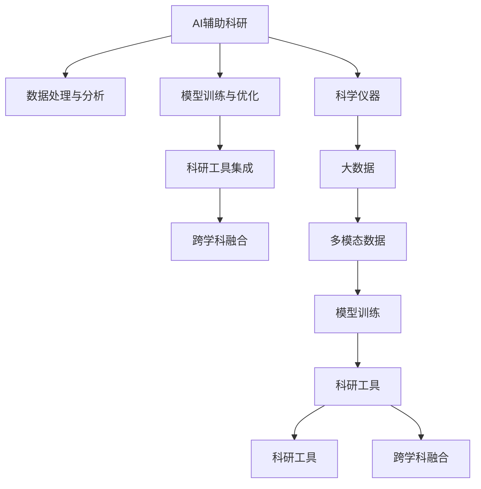

                 

# AI辅助科研：加速科学发现的新范式

> 关键词：AI辅助科研,科学发现,加速,新范式,机器学习,深度学习,科学研究,科学仪器,数据驱动,大数据,多模态,模型训练,科研工具

## 1. 背景介绍

### 1.1 问题由来

科学研究的进步依赖于持续的探索和发现。然而，传统的科研模式往往耗时长、成本高、效率低。如何利用现有的信息技术手段，加速科学发现的步伐，已成为科技界关注的焦点。人工智能（AI）技术的兴起，为科学研究的智能化提供了新的方向。特别是在数据驱动的科学时代，AI辅助科研已经成为加速科学发现的重要工具。

### 1.2 问题核心关键点

AI辅助科研的核心在于，通过构建智能化的科研平台和工具，利用机器学习和深度学习技术，对海量数据进行高效处理和分析，从而加速科学发现的进程。

具体而言，AI辅助科研主要包括以下几个关键点：

- **数据处理与分析**：利用AI技术对科学数据进行清洗、筛选、分类、聚类等预处理，从而提取有价值的信息。
- **模型训练与优化**：基于数据驱动的建模，利用深度学习等算法训练高效模型，并对模型进行调优，以提高预测和推理能力。
- **科研工具集成**：将AI技术集成到科研工具中，辅助科学家进行实验设计、数据采集、结果分析等全流程科研活动。
- **跨学科融合**：打破不同学科之间的壁垒，利用多模态数据融合技术，促进交叉学科的协同创新。

## 2. 核心概念与联系

### 2.1 核心概念概述

为更好地理解AI辅助科研的概念，本节将介绍几个密切相关的核心概念：

- **AI辅助科研**：利用人工智能技术，辅助科学家进行科学研究和数据分析，加速科学发现的进程。
- **机器学习（Machine Learning, ML）**：一种通过算法和模型自动学习数据模式和规律，从而进行预测和决策的技术。
- **深度学习（Deep Learning, DL）**：一种特殊类型的机器学习，通过多层神经网络对数据进行非线性映射和特征提取，适用于处理复杂的多模态数据。
- **科学仪器**：各种用于科学实验的工具和设备，如显微镜、光谱仪、质谱仪等。
- **大数据（Big Data）**：大规模、多样化的数据集，通常需要通过先进的数据处理技术进行分析和利用。
- **多模态数据（Multimodal Data）**：不同类型（如文本、图像、音频）的数据组合，广泛应用于跨学科研究。
- **模型训练（Model Training）**：通过输入训练数据，优化模型参数，提高模型性能的过程。
- **科研工具**：为科学研究提供支持和辅助的各类软件和工具，如数据分析软件、仿真工具等。

这些核心概念之间的逻辑关系可以通过以下Mermaid流程图来展示：



这个流程图展示了AI辅助科研的核心概念及其之间的关系：

1. AI辅助科研通过数据处理与分析、模型训练与优化等技术，对科学数据进行高效处理和分析。
2. 通过科研工具集成，将AI技术应用到科研全流程中，辅助科学家进行实验设计和数据分析。
3. 多模态数据的融合，使得AI模型能够从不同类型的数据中提取更多信息，促进跨学科的协同创新。
4. 科学仪器和数据库的引入，进一步丰富了AI模型的输入，提升了模型的预测和推理能力。

这些核心概念共同构成了AI辅助科研的框架，使其能够更好地服务于科学研究。

## 3. 核心算法原理 & 具体操作步骤
### 3.1 算法原理概述

AI辅助科研的核心算法原理主要基于数据驱动的机器学习和深度学习技术。其核心思想是通过构建高效的数据模型，对海量科学数据进行自动化的处理和分析，从而加速科学发现的步伐。

具体而言，AI辅助科研的过程包括以下几个关键步骤：

1. **数据收集与预处理**：收集科学实验中产生的各种数据，包括实验数据、观测数据、文献数据等，并进行清洗、筛选、标注等预处理工作。
2. **特征提取与选择**：利用特征提取算法，将原始数据转化为模型可接受的输入特征，并进行特征选择，以提高模型的性能。
3. **模型构建与训练**：基于预处理后的数据，构建高效的数据模型（如神经网络、随机森林等），并通过大量数据进行模型训练和优化。
4. **结果验证与分析**：对训练好的模型进行验证和评估，通过交叉验证等方法，确保模型的泛化能力。
5. **应用与部署**：将训练好的模型应用于实际的科学研究和数据分析任务中，进行预测、分类、聚类等操作。

### 3.2 算法步骤详解

以下是AI辅助科研的核心算法步骤的详细说明：

**Step 1: 数据收集与预处理**

1. 收集科学实验中的原始数据，包括实验数据、观测数据、文献数据等。
2. 对数据进行清洗、筛选、去噪等预处理操作，确保数据的准确性和完整性。
3. 对文本数据进行分词、标引等预处理操作，便于后续的特征提取和建模。
4. 对图像数据进行归一化、增强等预处理操作，提高数据质量。

**Step 2: 特征提取与选择**

1. 利用特征提取算法（如NLP领域的词嵌入、图像领域的卷积神经网络）将原始数据转化为特征向量。
2. 进行特征选择，去除无关的特征，降低计算复杂度，提高模型性能。
3. 利用降维算法（如主成分分析PCA、t-SNE等）进行特征降维，减少特征空间的维度。

**Step 3: 模型构建与训练**

1. 选择合适的机器学习或深度学习模型（如神经网络、随机森林等），基于预处理后的数据进行模型构建。
2. 设置训练参数，如学习率、迭代次数、批大小等，进行模型训练。
3. 利用交叉验证等技术评估模型性能，避免过拟合。
4. 对模型进行调优，如调整网络结构、修改超参数等，提高模型精度。

**Step 4: 结果验证与分析**

1. 利用测试集对模型进行验证，评估模型在新数据上的性能。
2. 分析模型输出的结果，解释模型的决策过程和预测依据。
3. 根据验证结果，调整模型参数或选择新的模型，进行模型迭代优化。

**Step 5: 应用与部署**

1. 将训练好的模型应用于实际的科研任务中，进行预测、分类、聚类等操作。
2. 对模型的输出结果进行可视化展示，帮助科学家更好地理解实验结果。
3. 根据应用效果，进行模型的优化和调整，提高模型的实际应用效果。

### 3.3 算法优缺点

AI辅助科研的机器学习和深度学习算法具有以下优点：

- **高效性**：自动化处理大量数据，提高了科研工作的效率。
- **准确性**：通过精确的模型训练和优化，提高了结果的准确性。
- **可扩展性**：模型可以根据需要灵活调整，适用于多种科研任务。
- **可解释性**：通过特征提取和模型解释技术，能够解释模型的决策过程。

同时，这些算法也存在一些缺点：

- **依赖高质量数据**：模型的性能依赖于高质量的训练数据，数据标注和清洗工作量大。
- **计算资源要求高**：深度学习模型需要大量的计算资源进行训练和推理，硬件成本高。
- **模型复杂性**：深度学习模型的结构和参数复杂，难以理解和调试。
- **可解释性不足**：一些复杂的深度学习模型缺乏可解释性，难以理解和解释模型的决策依据。

### 3.4 算法应用领域

AI辅助科研的机器学习和深度学习算法在多个科研领域得到了广泛应用，包括但不限于以下几个方向：

- **生物学研究**：利用AI技术对基因组数据进行分析和预测，加速新药物的研发和疾病诊断。
- **天文学研究**：利用AI技术处理大型望远镜观测数据，发现新的星系、恒星等天体。
- **物理研究**：利用AI技术处理高能物理实验数据，发现新的物理现象和规律。
- **地球科学**：利用AI技术处理遥感数据，研究气候变化、地质结构等科学问题。
- **环境科学**：利用AI技术分析环境监测数据，预测气候变化、污染物扩散等环境问题。
- **医学研究**：利用AI技术处理医疗影像和电子病历数据，辅助疾病诊断和治疗决策。

这些领域的研究成果，得益于AI技术的深度应用，极大地加速了科学发现的步伐，推动了人类对自然界的理解和探索。

## 4. 数学模型和公式 & 详细讲解 & 举例说明

### 4.1 数学模型构建

以下是AI辅助科研中的几个核心数学模型及其构建方法：

- **线性回归模型**：用于处理单变量或多变量的线性关系，形式为 $y = \beta_0 + \beta_1 x_1 + ... + \beta_n x_n$，其中 $y$ 为预测变量，$x_i$ 为输入特征，$\beta_i$ 为回归系数。
- **决策树模型**：通过树形结构对数据进行分类，形式为 $T = (N, R, L)$，其中 $N$ 为树节点，$R$ 为节点的分裂规则，$L$ 为叶子节点的类别标签。
- **卷积神经网络（CNN）模型**：用于处理图像数据，通过卷积层、池化层、全连接层等组成，形式为 $y = W_{out} \cdot g(W_{conv} \cdot x + b_{conv} + h_{pool}) + b_{out}$，其中 $x$ 为输入图像，$W$ 为卷积核和全连接层的权重，$b$ 为偏置项，$g$ 为激活函数。
- **长短期记忆网络（LSTM）模型**：用于处理序列数据，通过循环神经网络结构实现，形式为 $h_t = f_t(W_{in} \cdot x_t + b_{in})$，其中 $h_t$ 为时间步 $t$ 的隐藏状态，$x_t$ 为时间步 $t$ 的输入，$f_t$ 为激活函数。

### 4.2 公式推导过程

以下是线性回归模型和决策树模型的公式推导过程：

**线性回归模型**

设样本集为 $D = \{(x_i, y_i)\}_{i=1}^N$，其中 $x_i \in \mathbb{R}^n$ 为输入特征向量，$y_i \in \mathbb{R}$ 为预测变量。假设模型为 $y = \beta_0 + \beta_1 x_1 + ... + \beta_n x_n$。

根据最小二乘法，最优的回归系数 $\beta_0, \beta_1, ..., \beta_n$ 满足：

$$
\hat{\beta} = \mathop{\arg\min}_{\beta} \sum_{i=1}^N (y_i - (\beta_0 + \beta_1 x_{1,i} + ... + \beta_n x_{n,i}))^2
$$

即求解如下线性方程组：

$$
(X^T X)^{-1} X^T y = \hat{\beta}
$$

其中 $X = [x_1, x_2, ..., x_n] \in \mathbb{R}^{N \times n}$ 为样本特征矩阵，$y = [y_1, y_2, ..., y_N] \in \mathbb{R}^N$ 为样本标签向量，$\hat{\beta} = [\hat{\beta}_0, \hat{\beta}_1, ..., \hat{\beta}_n] \in \mathbb{R}^n$ 为回归系数向量。

**决策树模型**

设样本集为 $D = \{(x_i, y_i)\}_{i=1}^N$，其中 $x_i \in \mathbb{R}^n$ 为输入特征向量，$y_i \in \{0, 1\}$ 为分类标签。假设模型为 $T = (N, R, L)$。

根据决策树算法，通过贪心策略构建决策树的过程如下：

1. 选择最佳分裂特征 $x_j$，计算各个子节点的纯度指标 $p_j$。
2. 对于每个子节点 $N_j$，递归地构建子树 $T_j$。
3. 对每个叶子节点 $L_i$，分配相应的分类标签 $y_i$。

其中，分裂特征的选择和子节点的纯度计算可以基于信息熵、基尼系数等指标进行。

### 4.3 案例分析与讲解

以生物学研究中的基因组数据为例，进行详细的案例分析：

**背景**

基因组数据通常包含大量的序列和突变信息，通过对这些数据的分析，可以发现新的基因突变、基因表达模式等科学问题。传统的基因组数据分析需要耗费大量的人力和时间，效率低下。

**方法**

1. 数据收集：收集大规模的基因组数据，包括DNA序列、基因表达数据等。
2. 预处理：对数据进行清洗、去噪、归一化等预处理操作。
3. 特征提取：利用生物信息学工具，提取基因序列的特征，如核苷酸频率、基因表达水平等。
4. 模型构建：构建随机森林、支持向量机等机器学习模型，对基因组数据进行分类和预测。
5. 结果验证：利用交叉验证等技术，验证模型的泛化能力。
6. 应用与部署：将训练好的模型应用于新数据的预测和分析，辅助生物学研究。

**结果**

通过AI辅助科研，科学家可以更快地分析大量基因组数据，发现新的基因突变、基因表达模式等科学问题，加速新药物的研发和疾病诊断。

## 5. 项目实践：代码实例和详细解释说明

### 5.1 开发环境搭建

在进行AI辅助科研的代码实现前，我们需要准备好开发环境。以下是使用Python进行PyTorch和TensorFlow开发的环境配置流程：

1. 安装Anaconda：从官网下载并安装Anaconda，用于创建独立的Python环境。

2. 创建并激活虚拟环境：
```bash
conda create -n pytorch-env python=3.8 
conda activate pytorch-env
```

3. 安装PyTorch：根据CUDA版本，从官网获取对应的安装命令。例如：
```bash
conda install pytorch torchvision torchaudio cudatoolkit=11.1 -c pytorch -c conda-forge
```

4. 安装TensorFlow：根据CUDA版本，从官网获取对应的安装命令。例如：
```bash
conda install tensorflow tensorflow-gpu -c conda-forge
```

5. 安装各类工具包：
```bash
pip install numpy pandas scikit-learn matplotlib tqdm jupyter notebook ipython
```

完成上述步骤后，即可在`pytorch-env`环境中开始AI辅助科研的实践。

### 5.2 源代码详细实现

以下是一个利用Python和PyTorch实现线性回归模型的代码示例：

```python
import torch
import torch.nn as nn
import torch.optim as optim
from torch.utils.data import DataLoader
from sklearn.model_selection import train_test_split
from sklearn.datasets import make_regression

# 生成模拟数据
X, y = make_regression(n_samples=1000, n_features=2, n_informative=2, n_targets=1, noise=0.1)

# 数据预处理
X_train, X_test, y_train, y_test = train_test_split(X, y, test_size=0.2, random_state=42)
X_train = torch.tensor(X_train, dtype=torch.float32)
X_test = torch.tensor(X_test, dtype=torch.float32)
y_train = torch.tensor(y_train, dtype=torch.float32)
y_test = torch.tensor(y_test, dtype=torch.float32)

# 定义模型
class LinearRegression(nn.Module):
    def __init__(self, input_dim):
        super(LinearRegression, self).__init__()
        self.linear = nn.Linear(input_dim, 1)

    def forward(self, x):
        return self.linear(x)

# 定义损失函数和优化器
criterion = nn.MSELoss()
optimizer = optim.SGD(model.parameters(), lr=0.01, momentum=0.9)

# 训练模型
model = LinearRegression(X_train.shape[1])
for epoch in range(1000):
    optimizer.zero_grad()
    outputs = model(X_train)
    loss = criterion(outputs, y_train)
    loss.backward()
    optimizer.step()
    if (epoch+1) % 100 == 0:
        print(f'Epoch {epoch+1}, Loss: {loss.item()}')

# 测试模型
with torch.no_grad():
    outputs = model(X_test)
    loss = criterion(outputs, y_test)
    print(f'Test Loss: {loss.item()}')
```

这段代码展示了如何使用PyTorch实现线性回归模型，并进行模型训练和测试。

### 5.3 代码解读与分析

让我们再详细解读一下关键代码的实现细节：

**数据生成与预处理**

1. 使用sklearn的make_regression函数生成模拟数据，包含100个样本和2个特征。
2. 对数据进行训练集和测试集的划分，其中80%作为训练集，20%作为测试集。
3. 将数据转换为PyTorch张量，并进行归一化处理。

**模型定义**

1. 定义一个线性回归模型，包括一个线性层，将输入特征映射到输出标签。
2. 在模型前向传播过程中，使用线性层进行预测。

**损失函数与优化器**

1. 定义均方误差损失函数，用于计算模型预测值与真实标签之间的差异。
2. 使用随机梯度下降优化器，设置学习率和动量参数。

**模型训练**

1. 在每个epoch中，先使用optimizer.zero_grad()将梯度清零，确保每次更新时从零开始。
2. 将输入特征输入模型，得到模型预测值。
3. 计算损失函数，使用backward()函数计算梯度，并通过optimizer.step()更新模型参数。
4. 每100个epoch输出一次损失值，以便监控模型训练过程。

**模型测试**

1. 在测试集上使用model(X_test)进行预测。
2. 计算预测值与真实标签之间的损失，输出最终测试损失。

以上代码实现展示了线性回归模型的基本流程，包括数据生成、模型定义、损失函数、优化器、模型训练和测试等关键环节。开发者可以根据具体任务，在此基础上进行模型改进和优化。

## 6. 实际应用场景

### 6.1 生物信息学研究

AI辅助科研在生物信息学领域有着广泛的应用，通过AI技术处理和分析基因组数据、蛋白质结构数据等，加速新药物的研发和疾病诊断。

例如，在基因组数据中，利用AI技术进行基因突变分析和基因表达模式预测，可以发现新的癌症突变基因，加速癌症研究。

### 6.2 天文学研究

AI辅助科研在天文学领域也得到了广泛应用，通过AI技术处理大型望远镜观测数据，发现新的星系、恒星等天体。

例如，利用AI技术对天文图像进行自动标注和分类，可以帮助天文学家快速发现新的天体和星系。

### 6.3 物理学研究

AI辅助科研在物理学领域同样具有重要意义，通过AI技术处理高能物理实验数据，发现新的物理现象和规律。

例如，利用AI技术分析粒子物理实验数据，可以发现新的粒子或现象，推动高能物理研究的发展。

### 6.4 地球科学研究

AI辅助科研在地球科学领域也有广泛应用，通过AI技术处理遥感数据，研究气候变化、地质结构等科学问题。

例如，利用AI技术分析卫星遥感数据，可以预测气候变化趋势，研究地质结构的分布和变化。

### 6.5 环境科学研究

AI辅助科研在环境科学领域同样具有重要意义，通过AI技术分析环境监测数据，预测气候变化、污染物扩散等环境问题。

例如，利用AI技术分析气象数据，可以预测天气变化，研究气候变化对环境的影响。

### 6.6 医学研究

AI辅助科研在医学领域也得到了广泛应用，通过AI技术处理医疗影像和电子病历数据，辅助疾病诊断和治疗决策。

例如，利用AI技术分析医疗影像数据，可以辅助医生进行疾病诊断，提高诊断的准确性和效率。

### 6.7 未来应用展望

随着AI技术的不断进步，AI辅助科研的应用范围和深度将进一步拓展，为科学研究带来更多的创新和突破。

1. **多模态数据融合**：未来AI辅助科研将更加注重多模态数据的融合，利用文本、图像、视频等多种数据类型，提高模型的表现能力。
2. **跨学科协同创新**：AI辅助科研将打破不同学科之间的壁垒，促进跨学科的协同创新，推动科学研究的全面发展。
3. **大规模分布式计算**：随着计算资源的不断扩展，AI辅助科研将更多地采用分布式计算，加速模型的训练和推理。
4. **模型解释与可视化**：未来AI辅助科研将更加注重模型的可解释性，通过可视化技术，帮助科学家更好地理解和解释模型。
5. **自动化科研流程**：AI辅助科研将实现全流程自动化，从数据收集、预处理到模型训练、结果分析，大大提高科研效率。

总之，AI辅助科研正在成为加速科学发现的重要手段，未来将为科学研究带来更多的创新和突破。

## 7. 工具和资源推荐

### 7.1 学习资源推荐

为帮助开发者系统掌握AI辅助科研的理论基础和实践技巧，这里推荐一些优质的学习资源：

1. **深度学习基础课程**：斯坦福大学的CS231n课程，深入讲解深度学习的基础理论和实践方法，是入门深度学习的最佳选择。
2. **机器学习实战**：周志华博士所著的《机器学习》，系统介绍了机器学习的理论基础和应用方法，是学习机器学习的经典教材。
3. **TensorFlow官方文档**：Google提供的TensorFlow官方文档，包含丰富的示例代码和实践指南，是学习TensorFlow的必备资料。
4. **PyTorch官方文档**：Facebook提供的PyTorch官方文档，提供了丰富的教程和示例代码，是学习PyTorch的必备资料。
5. **Kaggle平台**：Kaggle是一个数据科学竞赛平台，提供大量的数据集和开源代码，是学习AI辅助科研的重要资源。

通过对这些资源的学习实践，相信你一定能够快速掌握AI辅助科研的理论基础和实践技巧，并用于解决实际的科学问题。

### 7.2 开发工具推荐

高效的开发离不开优秀的工具支持。以下是几款用于AI辅助科研开发的常用工具：

1. **Jupyter Notebook**：一个强大的交互式开发环境，支持Python、R等多种编程语言，非常适合进行科研数据分析和模型训练。
2. **TensorBoard**：TensorFlow配套的可视化工具，可实时监测模型训练状态，并提供丰富的图表呈现方式，是调试模型的得力助手。
3. **Weights & Biases**：模型训练的实验跟踪工具，可以记录和可视化模型训练过程中的各项指标，方便对比和调优。
4. **Scikit-learn**：一个强大的Python机器学习库，提供丰富的数据预处理和模型训练功能，非常适合进行科研数据分析。
5. **Pandas**：一个强大的Python数据处理库，支持数据清洗、筛选、聚合等操作，非常适合进行科研数据处理。

合理利用这些工具，可以显著提升AI辅助科研的开发效率，加快创新迭代的步伐。

### 7.3 相关论文推荐

AI辅助科研的发展得益于学界的持续研究。以下是几篇奠基性的相关论文，推荐阅读：

1. **Deep Learning for Genomic Data Analysis**：一篇综述性论文，介绍了AI技术在基因组数据处理和分析中的应用，是研究生物信息学的重要参考。
2. **TensorFlow: A System for Large-Scale Machine Learning**：Google提供的TensorFlow系统介绍，详细介绍了TensorFlow的架构和应用方法，是学习TensorFlow的重要参考资料。
3. **DeepMind AlphaFold: A Generic Framework for Predictive Molecular Modeling**：DeepMind公司发表的AlphaFold论文，展示了AI技术在蛋白质结构预测中的应用，是研究生物信息学的经典案例。
4. **A Deep Learning Framework for Detecting Proteins in Electron Microscopy Images**：一篇使用深度学习技术进行蛋白质检测的论文，展示了AI技术在生物成像中的应用，是研究生物信息学的经典案例。
5. **Towards Explainable AI: Intuitive Explanations of Black Box Models Using Logic-Based Theories**：一篇关于可解释AI的论文，展示了如何将符号化的先验知识与神经网络模型结合，是研究AI辅助科研的重要参考资料。

这些论文代表了大规模数据驱动的科学研究的最新进展，为AI辅助科研提供了重要的理论基础和技术指导。

## 8. 总结：未来发展趋势与挑战

### 8.1 总结

本文对AI辅助科研的原理和实践进行了全面系统的介绍。首先阐述了AI辅助科研的核心思想和方法，明确了AI技术在科学研究中的重要作用。其次，从原理到实践，详细讲解了AI辅助科研的数学模型和关键步骤，给出了具体的代码实现和案例分析。同时，本文还广泛探讨了AI辅助科研在多个科研领域的应用前景，展示了AI技术在科学研究中的巨大潜力。此外，本文精选了AI辅助科研的学习资源、开发工具和相关论文，力求为读者提供全方位的技术指引。

通过本文的系统梳理，可以看到，AI辅助科研正在成为加速科学发现的重要手段，AI技术在科学研究中的应用范围和深度将不断拓展。未来，伴随AI技术的不断进步，AI辅助科研必将在更多的科研领域带来新的突破，推动科学研究的全面发展。

### 8.2 未来发展趋势

展望未来，AI辅助科研将呈现以下几个发展趋势：

1. **多模态数据融合**：未来AI辅助科研将更加注重多模态数据的融合，利用文本、图像、视频等多种数据类型，提高模型的表现能力。
2. **跨学科协同创新**：AI辅助科研将打破不同学科之间的壁垒，促进跨学科的协同创新，推动科学研究的全面发展。
3. **大规模分布式计算**：随着计算资源的不断扩展，AI辅助科研将更多地采用分布式计算，加速模型的训练和推理。
4. **模型解释与可视化**：未来AI辅助科研将更加注重模型的可解释性，通过可视化技术，帮助科学家更好地理解和解释模型。
5. **自动化科研流程**：AI辅助科研将实现全流程自动化，从数据收集、预处理到模型训练、结果分析，大大提高科研效率。

### 8.3 面临的挑战

尽管AI辅助科研在多个科研领域取得了显著成果，但仍面临诸多挑战：

1. **数据质量与标注**：高质量的标注数据是AI辅助科研的基础，但数据标注工作量大、成本高，难以大规模获取。
2. **模型复杂性与可解释性**：深度学习模型通常具有复杂的结构和参数，难以理解和解释，影响科学家的信任和接受度。
3. **计算资源限制**：深度学习模型需要大量的计算资源进行训练和推理，硬件成本高，难以在小型科研机构推广应用。
4. **伦理与安全性**：AI技术在科学研究中的应用可能带来伦理和安全问题，需要制定相应的规范和标准。

### 8.4 研究展望

未来AI辅助科研的研究方向将在以下几个方面进行深入探索：

1. **数据驱动的科研范式**：进一步探索AI技术在科学研究中的应用，推动数据驱动的科研范式发展。
2. **可解释性与可信任性**：开发更可解释的AI模型，提升模型的可信任度和科学家的接受度。
3. **跨学科知识整合**：将符号化的先验知识与AI技术结合，促进跨学科知识的整合与应用。
4. **自动化科研工具**：开发更加智能化的科研工具，辅助科学家进行数据处理、模型训练等任务。
5. **伦理与安全保障**：制定AI技术在科学研究中的应用规范，确保技术的安全性和伦理合规性。

这些研究方向的探索，将推动AI辅助科研技术向更成熟、更普适的方向发展，为科学研究带来更多的创新和突破。

## 9. 附录：常见问题与解答

**Q1: 如何选择合适的AI辅助科研工具？**

A: 选择合适的AI辅助科研工具需要考虑以下几个方面：

1. **工具的可扩展性**：工具是否支持大规模数据处理，是否能够灵活扩展，以应对大规模科研数据的处理需求。
2. **工具的易用性**：工具是否易于上手，是否提供丰富的文档和教程，是否支持可视化操作。
3. **工具的社区支持**：工具是否有活跃的社区支持，是否有丰富的开源代码和实践案例，是否容易获取技术支持。
4. **工具的性能**：工具是否具有高效的计算能力，是否能够满足科研任务的需求，是否具有良好的扩展性和可维护性。

通过综合考虑这些因素，可以更好地选择合适的AI辅助科研工具。

**Q2: AI辅助科研是否适用于所有科研领域？**

A: AI辅助科研在多个科研领域得到了广泛应用，但仍有一些领域需要进一步探索和优化：

1. **社会科学**：社会科学数据具有高维度和复杂性，需要进一步探索适用的AI技术。
2. **生命科学**：生命科学数据通常具有高噪声和高度复杂性，需要进一步探索适用的AI技术。
3. **物理实验**：物理实验数据通常具有高精度和高要求，需要进一步探索适用的AI技术。

未来随着AI技术的不断发展，AI辅助科研将更加广泛地应用于各个科研领域。

**Q3: 在AI辅助科研中，如何处理数据标注的问题？**

A: 数据标注是AI辅助科研的基础，但标注工作量大、成本高，难以大规模获取。以下是一些处理数据标注问题的策略：

1. **自动标注**：利用半监督学习和弱监督学习技术，自动标注数据，减少人工标注的工作量。
2. **众包标注**：利用众包平台进行数据标注，将标注任务外包给大量标注人员，提高标注效率和质量。
3. **无监督学习**：利用无监督学习技术，从大量未标注数据中自动提取特征和模式，提高数据标注的效率和准确性。
4. **多模态数据融合**：利用多模态数据融合技术，从不同数据源中提取信息，减少对单一数据源的依赖。

通过这些策略，可以有效处理数据标注的问题，提高AI辅助科研的效率和效果。

**Q4: AI辅助科研在实际应用中面临哪些挑战？**

A: AI辅助科研在实际应用中面临以下挑战：

1. **数据质量与标注**：高质量的标注数据是AI辅助科研的基础，但数据标注工作量大、成本高，难以大规模获取。
2. **模型复杂性与可解释性**：深度学习模型通常具有复杂的结构和参数，难以理解和解释，影响科学家的信任和接受度。
3. **计算资源限制**：深度学习模型需要大量的计算资源进行训练和推理，硬件成本高，难以在小型科研机构推广应用。
4. **伦理与安全性**：AI技术在科学研究中的应用可能带来伦理和安全问题，需要制定相应的规范和标准。

通过综合考虑这些因素，可以有效应对AI辅助科研面临的挑战。

**Q5: 未来AI辅助科研的发展方向是什么？**

A: 未来AI辅助科研的发展方向将在以下几个方面进行深入探索：

1. **数据驱动的科研范式**：进一步探索AI技术在科学研究中的应用，推动数据驱动的科研范式发展。
2. **可解释性与可信任性**：开发更可解释的AI模型，提升模型的可信任度和科学家的接受度。
3. **跨学科知识整合**：将符号化的先验知识与AI技术结合，促进跨学科知识的整合与应用。
4. **自动化科研工具**：开发更加智能化的科研工具，辅助科学家进行数据处理、模型训练等任务。
5. **伦理与安全保障**：制定AI技术在科学研究中的应用规范，确保技术的安全性和伦理合规性。

这些研究方向的探索，将推动AI辅助科研技术向更成熟、更普适的方向发展，为科学研究带来更多的创新和突破。

---

作者：禅与计算机程序设计艺术 / Zen and the Art of Computer Programming

