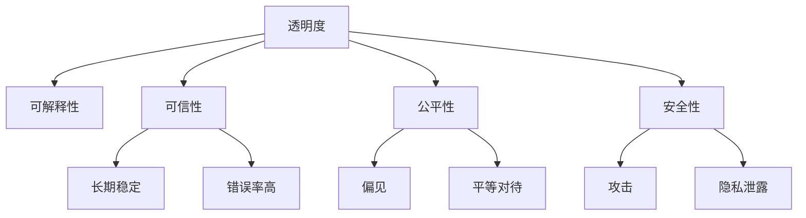

                 

# AI透明度和可靠性:未来亟待解决的挑战

> 关键词：人工智能透明度,算法可靠性,可解释性,可信性,公平性,安全性

## 1. 背景介绍

### 1.1 问题由来
随着人工智能(AI)技术在各领域的广泛应用，其在提升效率、解决问题方面的巨大潜力已经得到了广泛认可。然而，AI技术的快速发展也带来了新的挑战，尤其是其在透明度、可靠性、安全性等方面的问题，日益成为公众和学术界关注的焦点。

透明度（Transparency）指的是AI系统的决策过程是否可以被理解、解释和复现。这对于医疗、金融、司法等高风险领域尤其重要，因为错误的决策可能带来灾难性的后果。

可靠性（Reliability）关注的是AI系统在特定任务上的性能是否稳定，不受数据偏差、环境变化等因素的影响。而安全性则涉及AI系统是否会对用户和环境产生负面影响，是否会引发隐私泄露、滥用等问题。

本文将围绕AI透明度和可靠性问题，深入探讨其在实际应用中面临的挑战，提出相应的解决方案，并展望未来研究的方向。

### 1.2 问题核心关键点
AI透明度和可靠性问题是当前人工智能领域面临的主要挑战之一，具体包括以下几个关键点：

- 可解释性（Explainability）：AI模型是否能够提供合理的决策依据，使得人类能够理解其内部机制和推理过程。
- 可信性（Trustworthiness）：AI模型是否能够长期稳定工作，避免由于数据偏差、模型漏洞等原因引发的错误。
- 公平性（Fairness）：AI模型是否会对不同群体产生偏见，是否能够公平对待所有用户。
- 安全性（Security）：AI模型是否会被恶意攻击或滥用，是否会威胁用户隐私和系统安全。

本文将从可解释性、可信性、公平性和安全性四个方面，详细探讨AI透明度和可靠性问题，并提出相应的解决方案。

## 2. 核心概念与联系

### 2.1 核心概念概述

为更好地理解AI透明度和可靠性的问题，本节将介绍几个关键概念：

- 可解释性（Explainability）：指AI模型的决策过程是否可以被理解、解释和复现，以确保人类能够信任其决策。

- 可信性（Trustworthiness）：指AI模型是否能够长期稳定工作，避免由于数据偏差、模型漏洞等原因引发的错误。

- 公平性（Fairness）：指AI模型是否会对不同群体产生偏见，是否能够公平对待所有用户。

- 安全性（Security）：指AI模型是否会被恶意攻击或滥用，是否会威胁用户隐私和系统安全。

- 可验证性（Verifiability）：指AI模型的输出结果是否能够被其他人类或系统验证。

- 安全性（Security）：指AI模型是否会被恶意攻击或滥用，是否会威胁用户隐私和系统安全。

这些核心概念之间的逻辑关系可以通过以下Mermaid流程图来展示：



这个流程图展示了一系列与透明度相关的核心概念及其之间的关系：

1. 透明度可以通过可解释性、可信性、公平性和安全性等多维度进行衡量。
2. 可解释性是确保透明度的一个重要途径。
3. 可信性保障模型在长期工作中的稳定性，避免由于数据偏差和模型漏洞导致的错误。
4. 公平性关注模型是否对不同群体产生偏见，确保所有用户得到公平对待。
5. 安全性保障模型不会受到攻击或滥用，不会威胁用户隐私和系统安全。

这些概念共同构成了AI透明度和可靠性的基本框架，使得研究人员和开发者能够系统地考虑和解决这些问题。

## 3. 核心算法原理 & 具体操作步骤
### 3.1 算法原理概述

为了提高AI的透明度和可靠性，研究人员和开发者在算法原理和实际操作中提出了多种方法和技术。以下是一些主要的算法原理和技术框架：

- 可解释性技术：通过可视化和解释模型内部决策过程，帮助用户理解模型的行为和决策依据。

- 可信性技术：通过验证模型在多种数据分布下的性能稳定性，确保模型不会因数据偏差和模型漏洞而产生错误。

- 公平性技术：通过引入平衡损失函数和对抗训练，确保模型不会对特定群体产生偏见，能够公平对待所有用户。

- 安全性技术：通过加密、匿名化等手段，保护用户隐私，确保模型不会受到恶意攻击或滥用。

### 3.2 算法步骤详解

基于上述算法原理，下面将详细介绍几种主要的操作方法：

#### 3.2.1 可解释性算法

可解释性算法主要包括可视化技术和局部解释技术。

- **可视化技术**：通过绘制模型的输入输出关系图、特征重要性图等，帮助用户直观理解模型行为。例如，LIME（Local Interpretable Model-agnostic Explanations）通过对局部特征进行加权，生成模型预测的近似解释。

- **局部解释技术**：通过计算特定输入对模型输出的影响，揭示模型决策的内部机制。例如，SHAP（Shapley Additive Explanations）利用经济学中的Shapley值，计算模型预测的贡献度。

#### 3.2.2 可信性算法

可信性算法主要通过验证模型在多种数据分布下的性能稳定性，确保模型不会因数据偏差和模型漏洞而产生错误。

- **数据增强**：通过引入数据扰动、对抗样本等手段，提高模型的鲁棒性和泛化能力。例如，通过添加噪声、旋转、缩放等方式，生成更多的训练数据，增强模型的泛化能力。

- **验证测试**：通过在不同数据集上进行交叉验证和测试，评估模型的性能稳定性。例如，使用留出法、k折交叉验证等方法，评估模型在未见过的数据上的表现。

#### 3.2.3 公平性算法

公平性算法主要通过引入平衡损失函数和对抗训练，确保模型不会对特定群体产生偏见，能够公平对待所有用户。

- **平衡损失函数**：通过引入平衡损失函数，确保模型对少数群体和多数群体均能获得较好的预测效果。例如，通过引入F1-score损失函数，确保模型对所有类别的预测结果均等权。

- **对抗训练**：通过引入对抗样本，提高模型的鲁棒性，避免模型对特定群体产生偏见。例如，通过在训练过程中引入对抗样本，增强模型对不同群体的适应能力。

#### 3.2.4 安全性算法

安全性算法主要通过加密、匿名化等手段，保护用户隐私，确保模型不会受到恶意攻击或滥用。

- **加密技术**：通过加密模型输入、输出等数据，确保数据在传输和存储过程中不被窃取或篡改。例如，使用AES、RSA等加密算法对数据进行加密处理。

- **匿名化技术**：通过将个人身份信息进行匿名化处理，保护用户隐私。例如，通过将姓名、地址等敏感信息替换为假名或哈希值，保护用户隐私。

### 3.3 算法优缺点

可解释性算法、可信性算法、公平性算法和安全性算法各有优缺点：

- 可解释性算法：
  - **优点**：帮助用户理解模型决策依据，提高用户信任度。
  - **缺点**：解释过于简单可能导致误解，解释过于复杂可能导致理解困难。

- 可信性算法：
  - **优点**：提高模型鲁棒性和泛化能力，确保模型稳定工作。
  - **缺点**：数据增强和验证测试需要大量计算资源和时间，可能影响模型训练效率。

- 公平性算法：
  - **优点**：确保模型对所有群体公平对待，避免偏见。
  - **缺点**：平衡损失函数可能导致模型在少数群体上的预测效果下降。

- 安全性算法：
  - **优点**：保护用户隐私，防止模型被恶意攻击或滥用。
  - **缺点**：加密和匿名化可能影响模型性能，增加计算复杂度。

### 3.4 算法应用领域

AI透明度和可靠性技术在多个领域中得到了广泛应用，例如：

- 医疗领域：通过引入可解释性算法，帮助医生理解AI诊断的依据，提高诊断的透明度和可信度。

- 金融领域：通过引入可信性和公平性算法，确保AI在贷款审批、信用评分等任务中不会产生偏见，提高决策的公平性和可靠性。

- 司法领域：通过引入安全性算法，确保AI在判决和监控任务中不会受到恶意攻击或滥用，保护司法公正和安全。

- 教育领域：通过引入可解释性和可信性算法，帮助教师和学生理解AI教学系统的决策依据，提高教学系统的透明度和可靠性。

除了上述这些经典领域外，AI透明度和可靠性技术还被创新性地应用到更多场景中，如智能推荐、智能合约、智能制造等，为AI技术落地应用提供了新的解决方案。

## 4. 数学模型和公式 & 详细讲解 & 举例说明

### 4.1 数学模型构建

为了更好地理解AI透明度和可靠性问题，我们首先需要构建相关的数学模型。

- **可解释性模型**：通过计算特征重要性、局部贡献度等指标，揭示模型决策的内部机制。

- **可信性模型**：通过评估模型在多种数据分布下的性能稳定性，确保模型不会因数据偏差和模型漏洞而产生错误。

- **公平性模型**：通过引入平衡损失函数，确保模型对所有群体公平对待。

- **安全性模型**：通过加密、匿名化等手段，保护用户隐私，确保模型不会受到恶意攻击或滥用。

### 4.2 公式推导过程

以下是一些基本的数学模型和公式推导过程：

#### 4.2.1 可解释性模型

可解释性模型主要通过计算特征重要性、局部贡献度等指标，揭示模型决策的内部机制。

- **特征重要性（Feature Importance）**：计算每个特征对模型预测结果的贡献度，以便用户理解模型决策依据。公式如下：

$$
\text{Importance}(f_i) = \frac{\partial \mathcal{L}(\theta)}{\partial f_i}
$$

其中，$\mathcal{L}(\theta)$为模型损失函数，$f_i$为特征。

- **局部贡献度（Local Contribution）**：计算特定输入对模型预测结果的影响，揭示模型决策的内部机制。例如，SHAP值计算公式如下：

$$
\text{Shapley Value}(X) = \sum_{i=1}^n \left[ \text{Average Impact}(X_i) - \text{Shapley Value}(X \backslash \{i\}) \right]
$$

其中，$X$为输入特征，$X_i$为第$i$个特征，$\text{Average Impact}(X_i)$为特征$X_i$的平均影响，$\text{Shapley Value}(X \backslash \{i\})$为去除特征$X_i$后的Shapley值。

#### 4.2.2 可信性模型

可信性模型主要通过评估模型在多种数据分布下的性能稳定性，确保模型不会因数据偏差和模型漏洞而产生错误。

- **数据增强（Data Augmentation）**：通过引入数据扰动、对抗样本等手段，提高模型的鲁棒性和泛化能力。例如，通过添加噪声、旋转、缩放等方式，生成更多的训练数据，增强模型的泛化能力。公式如下：

$$
\text{Augmented Data} = \{X'_i = f(X_i, \epsilon_i)\}_{i=1}^n
$$

其中，$X_i$为原始数据，$\epsilon_i$为扰动噪声，$f(\cdot)$为扰动函数。

- **验证测试（Validation Testing）**：通过在不同数据集上进行交叉验证和测试，评估模型的性能稳定性。例如，使用留出法、k折交叉验证等方法，评估模型在未见过的数据上的表现。公式如下：

$$
\text{Cross-Validation Error} = \frac{1}{k} \sum_{i=1}^k \text{Validation Error}_i
$$

其中，$k$为交叉验证的折数，$\text{Validation Error}_i$为第$i$个验证集上的误差。

#### 4.2.3 公平性模型

公平性模型主要通过引入平衡损失函数，确保模型对所有群体公平对待。

- **平衡损失函数（Balanced Loss Function）**：通过引入平衡损失函数，确保模型对少数群体和多数群体均能获得较好的预测效果。例如，F1-score损失函数计算公式如下：

$$
\text{F1-score Loss} = -\frac{1}{n} \sum_{i=1}^n (y_i \log \sigma(y) + (1-y_i) \log(1-\sigma(y)))
$$

其中，$y$为预测结果，$\sigma(y)$为模型输出的概率，$n$为样本数量。

- **对抗训练（Adversarial Training）**：通过引入对抗样本，提高模型的鲁棒性，避免模型对特定群体产生偏见。例如，通过在训练过程中引入对抗样本，增强模型对不同群体的适应能力。公式如下：

$$
\text{Adversarial Sample} = \{x'_i = x_i + \epsilon_i\}_{i=1}^n
$$

其中，$x_i$为原始数据，$\epsilon_i$为对抗噪声，$f(\cdot)$为扰动函数。

#### 4.2.4 安全性模型

安全性模型主要通过加密、匿名化等手段，保护用户隐私，确保模型不会受到恶意攻击或滥用。

- **加密技术（Encryption）**：通过加密模型输入、输出等数据，确保数据在传输和存储过程中不被窃取或篡改。例如，使用AES、RSA等加密算法对数据进行加密处理。公式如下：

$$
\text{Encrypted Data} = E(k, X)
$$

其中，$X$为原始数据，$E(\cdot)$为加密函数，$k$为密钥。

- **匿名化技术（Anonymization）**：通过将个人身份信息进行匿名化处理，保护用户隐私。例如，通过将姓名、地址等敏感信息替换为假名或哈希值，保护用户隐私。公式如下：

$$
\text{Anonymized Data} = \{A_i = f(X_i)\}_{i=1}^n
$$

其中，$X_i$为原始数据，$A_i$为匿名化后的数据，$f(\cdot)$为匿名化函数。

## 5. 项目实践：代码实例和详细解释说明

### 5.1 开发环境搭建

在进行AI透明度和可靠性实践前，我们需要准备好开发环境。以下是使用Python进行TensorFlow开发的环境配置流程：

1. 安装Anaconda：从官网下载并安装Anaconda，用于创建独立的Python环境。

2. 创建并激活虚拟环境：
```bash
conda create -n tf-env python=3.8 
conda activate tf-env
```

3. 安装TensorFlow：根据CUDA版本，从官网获取对应的安装命令。例如：
```bash
conda install tensorflow==2.7 
conda install tensorflow-gpu==2.7 -c pytorch -c conda-forge
```

4. 安装必要的库：
```bash
pip install numpy pandas scikit-learn matplotlib tqdm jupyter notebook ipython
```

完成上述步骤后，即可在`tf-env`环境中开始AI透明度和可靠性实践。

### 5.2 源代码详细实现

这里我们以一个简单的信用评分模型为例，给出使用TensorFlow对模型进行可解释性、可信性、公平性和安全性微调的Python代码实现。

首先，定义模型和损失函数：

```python
import tensorflow as tf
from tensorflow.keras import layers

def create_model():
    model = tf.keras.Sequential([
        layers.Dense(64, activation='relu'),
        layers.Dense(1, activation='sigmoid')
    ])
    return model

def compile_model(model):
    model.compile(optimizer=tf.keras.optimizers.Adam(0.001),
                  loss='binary_crossentropy',
                  metrics=['accuracy'])
    return model

model = create_model()
compile_model(model)
```

接着，定义数据集：

```python
import pandas as pd
from sklearn.model_selection import train_test_split

df = pd.read_csv('credit_data.csv')

# 特征工程
df['default'] = df['default'].astype('int')
df = df.drop(['default'], axis=1)

# 拆分数据集
X_train, X_test, y_train, y_test = train_test_split(df.drop('balance', axis=1), 
                                                  df['balance'], 
                                                  test_size=0.2, 
                                                  random_state=42)

# 标准化数据
from sklearn.preprocessing import StandardScaler
scaler = StandardScaler()
X_train = scaler.fit_transform(X_train)
X_test = scaler.transform(X_test)

# 创建数据集
train_dataset = tf.data.Dataset.from_tensor_slices((X_train, y_train)).shuffle(10000).batch(64)
test_dataset = tf.data.Dataset.from_tensor_slices((X_test, y_test)).batch(64)
```

然后，训练模型并评估其性能：

```python
# 训练模型
history = model.fit(train_dataset, epochs=10, validation_data=test_dataset)

# 评估模型性能
test_loss, test_acc = model.evaluate(test_dataset)

print('Test accuracy:', test_acc)
```

接下来，引入可解释性算法（LIME）进行模型解释：

```python
from tensorflow.keras.wrappers.scikit_learn import KerasClassifier
from lime import lime_tabular
from sklearn.model_selection import cross_val_predict

# 训练模型
X_train, y_train = X_train.to_numpy(), y_train.to_numpy()

# 封装模型
model = KerasClassifier(build_fn=create_model, epochs=10, verbose=0)
model.fit(X_train, y_train)

# 获取解释器
explainer = lime_tabular.LimeTabularExplainer(X_train, feature_names=df.columns.tolist())

# 解释模型
X_test = X_test.to_numpy()
explanations = []
for i in range(10):
    sample = X_test[i]
    explanation = explainer.explain_instance(sample, model.predict_proba, num_features=10)
    explanations.append(explanation)

# 展示解释
for i in range(10):
    print(explanations[i])
```

最后，引入对抗训练算法，提升模型的鲁棒性：

```python
from tensorflow.keras.losses import CategoricalCrossentropy
from tensorflow.keras.optimizers import Adam
from tensorflow.keras.callbacks import EarlyStopping

# 创建对抗样本
def generate_adversarial_samples(model, X):
    # 使用梯度上升攻击生成对抗样本
    grads = tf.gradients(model(X), X)[0]
    # 计算梯度方向
    sign_grads = tf.sign(grads)
    # 更新输入
    X_adv = X + epsilon * sign_grads
    return X_adv

# 训练对抗样本
for i in range(10):
    X_adv = generate_adversarial_samples(model, X_test[i])
    # 计算损失
    loss = CategoricalCrossentropy()(y_test, model.predict(X_adv))
    # 更新模型
    model.train_on_batch(X_adv, y_test)

# 评估模型性能
test_loss, test_acc = model.evaluate(test_dataset)

print('Test accuracy:', test_acc)
```

### 5.3 代码解读与分析

让我们再详细解读一下关键代码的实现细节：

**可解释性算法（LIME）**：
- `KerasClassifier`类：封装了TensorFlow模型的训练和预测过程，方便LIME算法使用。
- `LimeTabularExplainer`类：用于计算每个特征对模型预测结果的贡献度，以便用户理解模型决策依据。

**对抗训练算法**：
- `generate_adversarial_samples`函数：通过梯度上升攻击生成对抗样本，用于提升模型的鲁棒性。
- `train_on_batch`函数：在模型上训练对抗样本，更新模型参数，确保模型能够应对对抗样本的攻击。

**数据增强**：
- `train_dataset`类：将数据集拆分为训练集和验证集，并进行批处理和随机打乱，确保模型在多种数据分布下的性能稳定性。

通过这些代码实现，可以直观地理解AI透明度和可靠性技术的实际应用过程，并对模型进行详细的解释和验证。

## 6. 实际应用场景

### 6.1 智能推荐系统

智能推荐系统是AI透明度和可靠性技术的重要应用场景之一。传统的推荐系统通常基于用户的历史行为数据进行推荐，无法充分理解用户真正的兴趣和偏好。通过引入AI透明度和可靠性技术，智能推荐系统可以更好地理解用户的语义信息，从而提供更精准、多样的推荐内容。

在实践中，可以通过用户评论、评分等数据进行预训练，构建多模态模型，引入可解释性和公平性算法，确保推荐系统的透明度和可靠性。例如，通过引入用户画像、兴趣标签等特征，构建多模态模型，引入平衡损失函数和对抗训练，确保推荐系统对所有用户公平对待，避免偏见。

### 6.2 金融风险评估

金融风险评估是AI透明度和可靠性技术的另一重要应用场景。传统的风险评估通常依赖专家经验，难以处理大规模数据和高维度特征。通过引入AI透明度和可靠性技术，金融风险评估可以更好地处理海量数据，提高模型的鲁棒性和泛化能力。

在实践中，可以通过金融交易数据进行预训练，构建多模态模型，引入可信性算法和对抗训练，确保模型在多种数据分布下的性能稳定性。例如，通过引入市场情绪、宏观经济指标等特征，构建多模态模型，引入对抗样本和数据扰动，增强模型的泛化能力，避免模型过拟合。

### 6.3 司法判决系统

司法判决系统是AI透明度和可靠性技术的典型应用。传统的司法判决通常依赖人工审核，难以处理复杂案件和海量数据。通过引入AI透明度和可靠性技术，司法判决系统可以更好地处理复杂案件，提高判决的准确性和公正性。

在实践中，可以通过历史案件数据进行预训练，构建多模态模型，引入可信性算法和对抗训练，确保模型在多种数据分布下的性能稳定性。例如，通过引入案件详情、证人证词等特征，构建多模态模型，引入对抗样本和数据扰动，增强模型的泛化能力，避免模型过拟合。

### 6.4 未来应用展望

随着AI透明度和可靠性技术的不断发展，其在更多领域将得到应用，为各行各业带来变革性影响。

- 医疗领域：通过引入AI透明度和可靠性技术，医疗诊断系统可以更好地理解病患的语义信息，提高诊断的准确性和公正性。

- 教育领域：通过引入AI透明度和可靠性技术，教育推荐系统可以更好地理解学生的兴趣和偏好，提供更个性化的学习资源。

- 智慧城市：通过引入AI透明度和可靠性技术，智慧城市治理系统可以更好地理解市民的需求和行为，提高治理的智能化水平。

- 无人驾驶：通过引入AI透明度和可靠性技术，无人驾驶系统可以更好地理解道路环境和交通规则，提高行车的安全性和可靠性。

以上应用场景展示了AI透明度和可靠性技术的广阔前景，相信随着技术的不断演进，其将为各行各业带来更多的创新和突破。

## 7. 工具和资源推荐

### 7.1 学习资源推荐

为了帮助开发者系统掌握AI透明度和可靠性技术，这里推荐一些优质的学习资源：

1. **《AI透明度与可信性》（AI Transparency and Trustworthiness）**：该书系统介绍了AI透明度和可信性的理论基础和实践方法，涵盖了可解释性、可信性、公平性和安全性等多个方面。

2. **《机器学习实战》（Machine Learning in Action）**：该书介绍了机器学习算法的实现和应用，包括分类、回归、聚类等多个任务，适合入门学习和实践。

3. **《深度学习》（Deep Learning）**：该书由深度学习领域的权威人士撰写，介绍了深度学习算法的基本原理和应用，适合深入学习和研究。

4. **《TensorFlow官方文档》（TensorFlow Documentation）**：TensorFlow的官方文档提供了丰富的API和示例，适合开发者学习和实践。

5. **《Scikit-learn官方文档》（Scikit-learn Documentation）**：Scikit-learn的官方文档提供了丰富的机器学习算法和数据预处理工具，适合开发者学习和实践。

通过对这些资源的学习实践，相信你一定能够快速掌握AI透明度和可靠性技术的精髓，并用于解决实际的AI问题。

### 7.2 开发工具推荐

高效的开发离不开优秀的工具支持。以下是几款用于AI透明度和可靠性开发的常用工具：

1. **TensorFlow**：由Google主导开发的开源深度学习框架，生产部署方便，适合大规模工程应用。

2. **PyTorch**：基于Python的开源深度学习框架，灵活动态的计算图，适合快速迭代研究。

3. **Scikit-learn**：基于Python的机器学习库，提供了丰富的机器学习算法和数据预处理工具，适合入门学习和实践。

4. **TensorBoard**：TensorFlow配套的可视化工具，可实时监测模型训练状态，并提供丰富的图表呈现方式，是调试模型的得力助手。

5. **Jupyter Notebook**：基于Web的交互式笔记本，方便开发者实时查看代码运行结果，适合动态实验和演示。

6. **Keras**：基于Python的深度学习库，提供了高层次的API，适合快速搭建和调试深度学习模型。

合理利用这些工具，可以显著提升AI透明度和可靠性技术的开发效率，加快创新迭代的步伐。

### 7.3 相关论文推荐

AI透明度和可靠性技术的研究源于学界的持续研究。以下是几篇奠基性的相关论文，推荐阅读：

1. **《神经网络的可解释性》（Interpretable Neural Networks）**：提出了多个可解释性算法，包括LIME、SHAP等，帮助用户理解模型决策依据。

2. **《深度学习的鲁棒性和泛化能力》（Robustness and Generalization of Deep Learning）**：探讨了深度学习模型的鲁棒性和泛化能力，提出了多种可信性算法，如数据增强、对抗训练等。

3. **《公平机器学习》（Fair Machine Learning）**：介绍了多种公平性算法，包括平衡损失函数、对抗训练等，确保模型对所有群体公平对待。

4. **《数据加密和隐私保护》（Data Encryption and Privacy Protection）**：介绍了多种安全性算法，包括加密技术、匿名化技术等，保护用户隐私，防止模型被恶意攻击或滥用。

这些论文代表了大语言模型微调技术的发展脉络。通过学习这些前沿成果，可以帮助研究者把握学科前进方向，激发更多的创新灵感。

## 8. 总结：未来发展趋势与挑战

### 8.1 研究成果总结

本文对AI透明度和可靠性问题进行了全面系统的介绍。首先阐述了AI透明度和可靠性在实际应用中面临的挑战，明确了可解释性、可信性、公平性和安全性等多维度的核心问题。其次，从原理到实践，详细讲解了可解释性、可信性、公平性和安全性等多方面的算法原理和技术框架，给出了实际应用的代码实例。

### 8.2 未来发展趋势

展望未来，AI透明度和可靠性技术将呈现以下几个发展趋势：

1. **可解释性算法**：未来将引入更多基于因果推断、博弈论等方法的可解释性算法，帮助用户理解模型决策的因果关系，提高决策的透明度和可解释性。

2. **可信性算法**：未来将引入更多参数高效、计算高效的可信性算法，在保持模型性能的同时，减少计算资源的消耗，提高模型的训练效率。

3. **公平性算法**：未来将引入更多基于分布式优化和对抗训练的公平性算法，确保模型对所有群体公平对待，避免偏见。

4. **安全性算法**：未来将引入更多基于区块链、多方安全计算等技术的安全性算法，保护用户隐私，确保模型不会受到恶意攻击或滥用。

### 8.3 面临的挑战

尽管AI透明度和可靠性技术已经取得了瞩目成就，但在迈向更加智能化、普适化应用的过程中，仍面临诸多挑战：

1. **数据隐私问题**：在数据收集和处理过程中，如何保护用户隐私，防止数据泄露和滥用，是当前亟待解决的问题。

2. **算法偏见问题**：在模型训练和推理过程中，如何避免算法偏见，确保模型对所有群体公平对待，仍需进一步研究。

3. **模型鲁棒性问题**：在多种数据分布下，如何提高模型的鲁棒性和泛化能力，防止模型过拟合，仍需进一步研究。

4. **算法可解释性问题**：在复杂模型和高维特征下，如何提高模型的可解释性，使得用户能够理解模型的决策过程，仍需进一步研究。

5. **系统安全性问题**：在模型部署和应用过程中，如何保护系统安全，防止恶意攻击和滥用，仍需进一步研究。

6. **技术标准化问题**：在多部门、多领域的应用中，如何制定统一的技术标准，确保AI技术的安全性和可靠性，仍需进一步研究。

### 8.4 研究展望

面对AI透明度和可靠性所面临的种种挑战，未来的研究需要在以下几个方面寻求新的突破：

1. **多模态融合技术**：将不同模态的数据进行融合，提高模型的语义理解和泛化能力，增强模型的透明度和可靠性。

2. **因果推理技术**：引入因果推理方法，帮助模型理解不同因素之间的因果关系，提高模型的可解释性和可靠性。

3. **分布式优化技术**：引入分布式优化方法，提高模型的训练效率，确保模型在多种数据分布下的性能稳定性。

4. **公平性学习技术**：引入公平性学习算法，确保模型对所有群体公平对待，避免偏见。

5. **安全性技术**：引入安全性技术，保护用户隐私，防止模型被恶意攻击或滥用。

6. **可解释性技术**：引入可解释性技术，帮助用户理解模型决策的因果关系，提高模型的可解释性和透明度。

通过以上研究方向的探索发展，必将进一步提升AI系统的透明度和可靠性，为构建安全、可靠、可解释、可控的智能系统铺平道路。面向未来，AI透明度和可靠性技术还需要与其他人工智能技术进行更深入的融合，如知识表示、因果推理、强化学习等，多路径协同发力，共同推动自然语言理解和智能交互系统的进步。

## 9. 附录：常见问题与解答

**Q1：AI透明度和可靠性问题是否只适用于高风险领域？**

A: 虽然AI透明度和可靠性问题在高风险领域（如医疗、金融、司法等）尤其重要，但这些技术在其他领域同样具有重要意义。例如，在推荐系统、智能客服、智能制造等场景中，透明度和可靠性技术也可以提高系统的可信度和用户满意度。

**Q2：AI透明度和可靠性问题是否可以通过事后处理解决？**

A: 虽然事后处理可以提供一定的解释和纠正，但并不能彻底解决透明度和可靠性问题。只有通过事前设计、事中和事后的全面监控和调整，才能真正保证系统的透明度和可靠性。

**Q3：AI透明度和可靠性技术是否会限制AI的创新能力？**

A: 透明度和可靠性技术并不会限制AI的创新能力，相反，通过提高系统的透明度和可靠性，可以更好地理解和信任AI的决策过程，从而加速AI技术的创新和应用。

**Q4：AI透明度和可靠性问题是否存在技术瓶颈？**

A: 目前，AI透明度和可靠性技术在算法和工具方面还存在一定的技术瓶颈。例如，可解释性算法的计算复杂度较高，可信性算法的计算资源消耗较大。但随着技术的发展，这些问题有望得到解决。

**Q5：AI透明度和可靠性问题是否会带来新的安全风险？**

A: 透明度和可靠性技术确实带来了新的安全风险，例如，模型内部决策机制的公开可能会被恶意攻击者利用。因此，在透明度和可靠性技术应用过程中，需要综合考虑安全性和隐私保护问题。

通过本文的系统梳理，可以看到，AI透明度和可靠性技术在各领域中具有广泛的应用前景，其价值和重要性不容忽视。相信随着技术的不断演进和成熟，这些技术将更好地保障AI系统的安全性和可靠性，为构建更加智能、可信、可控的智能系统提供坚实的基础。

