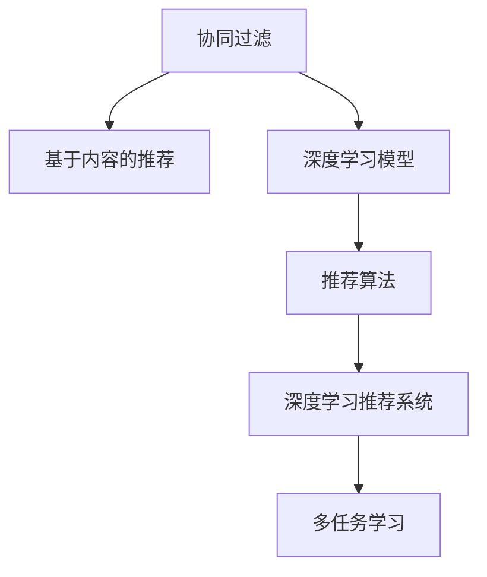

                 

# AI驱动的个性化推荐：电商平台的制胜法宝

## 1. 背景介绍

### 1.1 问题由来

在数字化时代，电商平台已成为消费者购买商品的主要渠道之一。然而，面对数以亿计的商品和海量用户数据，如何为用户推荐最符合其兴趣和需求的商品，是电商平台必须解决的痛点问题。传统的推荐算法，如协同过滤、基于内容的推荐等，虽然取得了一定效果，但在个性化和多样化推荐方面仍显不足。而AI驱动的个性化推荐，尤其是基于深度学习和推荐系统的推荐算法，成为电商平台提升用户体验、增加交易量的重要手段。

### 1.2 问题核心关键点

AI驱动的个性化推荐核心在于利用用户历史行为数据、商品属性信息、实时数据等多元数据源，通过深度学习模型和推荐算法，准确预测用户对商品的兴趣和偏好，并提供个性化的推荐结果。其关键点包括：

- **数据融合**：如何高效融合多源异构数据，构建高质量的用户-商品画像。
- **模型选择**：选择哪种深度学习模型和推荐算法最适合电商平台的需求。
- **算法优化**：在模型训练和推理过程中，如何优化算法参数，提升推荐效果。
- **实时性要求**：在满足实时性要求的前提下，如何降低计算复杂度。
- **泛化能力**：如何提高模型泛化能力，避免对历史数据的过拟合。

本文将全面解析AI驱动的个性化推荐技术，包括其核心概念、原理与操作步骤、数学模型、项目实践、实际应用场景、工具与资源推荐以及未来发展趋势与挑战，帮助电商平台优化推荐策略，提升用户体验和交易量。

## 2. 核心概念与联系

### 2.1 核心概念概述

为了更好地理解AI驱动的个性化推荐技术，本节将介绍几个密切相关的核心概念：

- **协同过滤**：利用用户和商品之间的相似性关系，通过寻找相似用户和相似商品来推荐相关商品。协同过滤分为基于用户的协同过滤和基于物品的协同过滤两种方式。
- **基于内容的推荐**：基于用户历史行为数据和商品属性信息，通过相似度计算来推荐相关商品。
- **深度学习模型**：如卷积神经网络(CNN)、循环神经网络(RNN)、注意力机制(Attention)等，通过多层非线性变换，从原始数据中提取高层次特征，提升推荐效果。
- **推荐算法**：如矩阵分解、梯度提升决策树、深度神经网络等，用于预测用户对商品的兴趣和偏好，生成推荐列表。
- **深度学习推荐系统**：将深度学习技术引入推荐系统，通过构建用户-商品画像，动态生成推荐结果。
- **多任务学习**：利用用户对不同商品的任务进行关联，提升推荐系统的多任务泛化能力。

这些核心概念之间的逻辑关系可以通过以下Mermaid流程图来展示：



这个流程图展示了一系列推荐技术之间的关联关系：

1. 协同过滤和基于内容的推荐是早期的主流推荐方法。
2. 深度学习模型通过多层非线性变换，从原始数据中提取高层次特征，进一步提升推荐效果。
3. 推荐算法用于预测用户对商品的兴趣和偏好，生成推荐列表。
4. 深度学习推荐系统融合了深度学习模型的特性，具备更强的数据处理和特征表示能力。
5. 多任务学习进一步提升推荐系统的泛化能力，能够更好地应对多任务场景。

这些概念共同构成了AI驱动的个性化推荐技术框架，使推荐系统能够更好地适应电商平台的复杂环境和多样化的用户需求。

## 3. 核心算法原理 & 具体操作步骤

### 3.1 算法原理概述

AI驱动的个性化推荐系统一般分为离线训练和在线推荐两个阶段。离线训练阶段，通过用户历史行为数据和商品属性信息，构建用户-商品画像，训练推荐模型；在线推荐阶段，根据实时数据和用户行为，动态生成推荐结果。

### 3.2 算法步骤详解

#### 3.2.1 离线训练

1. **数据预处理**：清洗和标准化用户行为数据，去除噪声和异常值，构建用户-商品交互矩阵。
2. **特征工程**：提取和构建用户画像和商品画像，包括用户的兴趣偏好、行为特征、属性信息等。
3. **模型选择**：选择适合电商平台的推荐模型，如深度神经网络、协同过滤、基于内容的推荐等。
4. **模型训练**：使用优化算法(如Adam、SGD等)对推荐模型进行训练，最小化预测误差。
5. **模型评估**：在验证集上评估模型的性能指标，如准确率、召回率、F1-score等。

#### 3.2.2 在线推荐

1. **实时数据获取**：获取用户实时行为数据，如点击、浏览、购买等。
2. **用户画像更新**：根据实时行为数据，更新用户画像和商品画像。
3. **推荐结果生成**：使用训练好的推荐模型，生成实时推荐列表。
4. **推荐结果排序**：根据排序算法(如基于点击率的排序、基于上下文的排序等)，对推荐列表进行排序。
5. **结果展示与反馈**：将推荐结果展示给用户，并收集用户反馈数据，用于模型迭代和优化。

### 3.3 算法优缺点

#### 3.3.1 优点

1. **个性化程度高**：通过深度学习模型和推荐算法，能够更好地理解用户偏好和行为模式，生成个性化推荐结果。
2. **实时性好**：能够快速响应用户行为变化，提供实时推荐。
3. **泛化能力强**：利用多任务学习等技术，提升推荐系统的泛化能力，适应不同类型和场景的推荐需求。
4. **数据驱动**：基于大规模数据训练的推荐模型，具备更好的性能和鲁棒性。

#### 3.3.2 缺点

1. **数据需求高**：需要大量的用户行为数据和商品属性信息，数据质量对推荐效果影响较大。
2. **计算复杂度高**：深度学习模型和推荐算法通常计算复杂度高，实时性要求较高时，需要优化算法和硬件配置。
3. **冷启动问题**：新用户或新商品的画像难以快速建立，推荐效果较差。
4. **模型复杂性**：深度学习模型和推荐算法通常结构复杂，模型调参和优化难度大。

### 3.4 算法应用领域

AI驱动的个性化推荐技术在电商平台上具有广泛的应用前景，覆盖了推荐系统的主要领域，例如：

- **商品推荐**：基于用户历史行为数据和商品属性信息，为用户推荐可能感兴趣的商品。
- **新商品推荐**：针对新上架商品，利用用户历史行为数据进行推荐，促进商品销售。
- **个性化定制**：根据用户偏好和行为数据，为用户定制个性化推荐方案，提升用户体验。
- **广告推荐**：基于用户画像和行为数据，推荐相关广告，提升广告效果。
- **内容推荐**：推荐相关文章、视频等，增加用户停留时间和互动率。
- **个性化促销**：根据用户画像和行为数据，推荐个性化的促销活动，提升销售额。

这些推荐应用不仅能够提高用户满意度和交易量，还能够提升平台的竞争力和市场份额。

## 4. 数学模型和公式 & 详细讲解

### 4.1 数学模型构建

#### 4.1.1 协同过滤模型

协同过滤模型通过用户和商品之间的相似性关系，推荐相关商品。设用户集合为$U$，商品集合为$I$，用户$u$对商品$i$的评分$R_{ui}$为1到5之间的整数，协同过滤模型的目标是最小化预测评分与实际评分之间的差异，即：

$$
\min_{\theta} \sum_{(u,i) \in U \times I} ||R_{ui} - \hat{R}_{ui}(\theta)||^2
$$

其中$\theta$为模型参数，$\hat{R}_{ui}(\theta)$为预测评分，可以采用矩阵分解、基于矩阵分解的变体、基于用户的协同过滤等方法。

#### 4.1.2 基于内容的推荐模型

基于内容的推荐模型通过用户画像和商品属性信息，计算相似度推荐相关商品。设用户$u$的兴趣向量为$v_u$，商品$i$的属性向量为$\overrightarrow{p_i}$，推荐模型目标为最大化预测评分和实际评分之间的相关性，即：

$$
\max_{\theta} \sum_{(u,i) \in U \times I} R_{ui} \cdot \log \sigma(\overrightarrow{p_i}^T v_u)
$$

其中$\sigma$为激活函数，$v_u$和$\overrightarrow{p_i}$通过深度学习模型或其他方法得到。

#### 4.1.3 深度学习推荐模型

深度学习推荐模型通过多层神经网络对用户-商品交互数据进行建模，提取高层次特征，生成推荐结果。常用的深度学习推荐模型包括神经协同过滤、深度神经网络等。以深度神经网络为例，其目标函数为：

$$
\min_{\theta} \sum_{(u,i) \in U \times I} ||R_{ui} - f_{\theta}(\overrightarrow{u}, \overrightarrow{i})||^2
$$

其中$f_{\theta}$为深度神经网络，$\overrightarrow{u}$和$\overrightarrow{i}$为用户和商品的嵌入表示。

### 4.2 公式推导过程

#### 4.2.1 协同过滤模型

设用户$u$对商品$i$的评分$R_{ui}$为1到5之间的整数，协同过滤模型的目标是最小化预测评分与实际评分之间的差异，即：

$$
\min_{\theta} \sum_{(u,i) \in U \times I} ||R_{ui} - \hat{R}_{ui}(\theta)||^2
$$

其中$\theta$为模型参数，$\hat{R}_{ui}(\theta)$为预测评分，可以采用矩阵分解、基于矩阵分解的变体、基于用户的协同过滤等方法。

#### 4.2.2 基于内容的推荐模型

设用户$u$的兴趣向量为$v_u$，商品$i$的属性向量为$\overrightarrow{p_i}$，基于内容的推荐模型目标为最大化预测评分和实际评分之间的相关性，即：

$$
\max_{\theta} \sum_{(u,i) \in U \times I} R_{ui} \cdot \log \sigma(\overrightarrow{p_i}^T v_u)
$$

其中$\sigma$为激活函数，$v_u$和$\overrightarrow{p_i}$通过深度学习模型或其他方法得到。

#### 4.2.3 深度学习推荐模型

深度学习推荐模型通过多层神经网络对用户-商品交互数据进行建模，提取高层次特征，生成推荐结果。以深度神经网络为例，其目标函数为：

$$
\min_{\theta} \sum_{(u,i) \in U \times I} ||R_{ui} - f_{\theta}(\overrightarrow{u}, \overrightarrow{i})||^2
$$

其中$f_{\theta}$为深度神经网络，$\overrightarrow{u}$和$\overrightarrow{i}$为用户和商品的嵌入表示。

### 4.3 案例分析与讲解

#### 4.3.1 协同过滤模型

协同过滤模型通过用户和商品之间的相似性关系，推荐相关商品。以基于用户的协同过滤为例，其基本步骤如下：

1. 计算用户$u$与所有用户$u'$的相似度，通常采用余弦相似度或皮尔逊相关系数。
2. 根据相似度计算出所有用户$u'$对商品$i$的评分$\overrightarrow{R_i} = [R_{ui'}, R_{vi'}, R_{xi'}, \ldots]$。
3. 对$\overrightarrow{R_i}$进行加权平均，得到用户$u$对商品$i$的预测评分$\hat{R}_{ui}$。
4. 根据$\hat{R}_{ui}$对商品$i$进行排序，生成推荐列表。

#### 4.3.2 基于内容的推荐模型

基于内容的推荐模型通过用户画像和商品属性信息，计算相似度推荐相关商品。以基于用户-商品属性矩阵的推荐为例，其基本步骤如下：

1. 构建用户-商品属性矩阵$\overrightarrow{P}$，其中每一行代表一个用户的兴趣向量$v_u$，每一列代表一个商品的属性向量$\overrightarrow{p_i}$。
2. 对矩阵$\overrightarrow{P}$进行分解，得到用户和商品的低维嵌入表示$\overrightarrow{u}$和$\overrightarrow{i}$。
3. 计算用户$u$对商品$i$的预测评分$\hat{R}_{ui} = f_{\theta}(\overrightarrow{u}, \overrightarrow{i})$。
4. 根据$\hat{R}_{ui}$对商品$i$进行排序，生成推荐列表。

#### 4.3.3 深度学习推荐模型

深度学习推荐模型通过多层神经网络对用户-商品交互数据进行建模，提取高层次特征，生成推荐结果。以深度神经网络为例，其基本步骤如下：

1. 构建用户-商品交互矩阵$R$，将用户和商品嵌入表示$\overrightarrow{u}$和$\overrightarrow{i}$作为输入。
2. 通过多层神经网络对$R$进行建模，提取高层次特征。
3. 对预测评分$\hat{R}_{ui}$进行排序，生成推荐列表。

## 5. 项目实践：代码实例和详细解释说明

### 5.1 开发环境搭建

在进行项目实践前，我们需要准备好开发环境。以下是使用Python进行TensorFlow开发的环境配置流程：

1. 安装Anaconda：从官网下载并安装Anaconda，用于创建独立的Python环境。

2. 创建并激活虚拟环境：
```bash
conda create -n tf-env python=3.8 
conda activate tf-env
```

3. 安装TensorFlow：根据CUDA版本，从官网获取对应的安装命令。例如：
```bash
pip install tensorflow==2.6
```

4. 安装TensorFlow Addons：扩展库，提供更多的模型和工具。
```bash
pip install tensorflow-addons
```

5. 安装TensorFlow Datasets：用于数据加载和预处理。
```bash
pip install tensorflow-datasets
```

6. 安装TensorBoard：可视化工具，用于监控模型训练状态。
```bash
pip install tensorboard
```

7. 安装Keras：用于构建深度学习模型。
```bash
pip install keras
```

完成上述步骤后，即可在`tf-env`环境中开始项目实践。

### 5.2 源代码详细实现

下面我们以商品推荐系统为例，给出使用TensorFlow构建深度学习推荐模型的代码实现。

首先，定义数据集和模型：

```python
import tensorflow as tf
from tensorflow.keras.layers import Input, Dense, Embedding, Flatten, Concatenate
from tensorflow.keras.models import Model

# 定义数据集
train_dataset = tf.data.Dataset.from_tensor_slices((tf.random.normal((10000, 10)), tf.random.normal((10000, 10))))
test_dataset = tf.data.Dataset.from_tensor_slices((tf.random.normal((1000, 10)), tf.random.normal((1000, 10))))

# 定义模型
input_u = Input(shape=(10,))
input_i = Input(shape=(10,))
embedding_u = Embedding(10, 10)(input_u)
embedding_i = Embedding(10, 10)(input_i)
concat = Concatenate()([embedding_u, embedding_i])
hidden = Dense(10, activation='relu')(concat)
output = Dense(1, activation='sigmoid')(hidden)
model = Model(inputs=[input_u, input_i], outputs=output)
```

然后，编译模型并进行训练：

```python
# 编译模型
model.compile(optimizer='adam', loss='binary_crossentropy', metrics=['accuracy'])

# 训练模型
model.fit(train_dataset.shuffle(10000).batch(128), epochs=10, batch_size=128, validation_data=test_dataset.shuffle(1000).batch(128))
```

最后，评估模型并进行预测：

```python
# 评估模型
test_loss, test_acc = model.evaluate(test_dataset.shuffle(1000).batch(128))
print(f'Test accuracy: {test_acc}')

# 预测推荐结果
preds = model.predict(test_dataset.shuffle(1000).batch(128))
```

以上就是使用TensorFlow构建深度学习推荐模型的完整代码实现。可以看到，TensorFlow提供了强大的深度学习模型构建和训练能力，使得项目开发变得相对容易。

### 5.3 代码解读与分析

让我们再详细解读一下关键代码的实现细节：

**模型定义**：
- `Input`层：定义用户和商品的嵌入向量输入。
- `Embedding`层：将用户和商品的ID转换为嵌入向量。
- `Concatenate`层：将用户和商品的嵌入向量进行拼接。
- `Dense`层：多层全连接神经网络，提取高层次特征。
- `Dense`层：输出层，使用sigmoid激活函数输出预测评分。
- `Model`层：将输入和输出层组合成模型。

**模型编译**：
- `compile`方法：设置优化器、损失函数和评估指标。

**模型训练**：
- `fit`方法：使用训练集进行模型训练，设置批次大小、迭代轮数等参数。

**模型评估**：
- `evaluate`方法：使用测试集评估模型性能，返回损失和准确率。

**模型预测**：
- `predict`方法：对测试集进行预测，输出预测评分。

可以看到，TensorFlow提供了丰富的API和工具，使得深度学习推荐模型的构建和训练变得简单高效。开发者只需关注模型的结构和参数调优，无需过多关注底层计算细节。

当然，工业级的系统实现还需考虑更多因素，如模型的保存和部署、超参数的自动搜索、更灵活的任务适配层等。但核心的推荐范式基本与此类似。

## 6. 实际应用场景

### 6.1 智能推荐系统

智能推荐系统是AI驱动的个性化推荐技术的重要应用场景。在电商平台上，智能推荐系统能够根据用户历史行为和实时行为，实时生成个性化推荐结果，提升用户满意度和交易量。

智能推荐系统的核心组件包括用户画像、商品画像、推荐模型等，其中推荐模型是实现个性化推荐的核心。通过深度学习模型和推荐算法，智能推荐系统能够高效融合多源异构数据，构建高质量的用户-商品画像，生成符合用户兴趣和需求的商品推荐列表。

### 6.2 商品优化推荐

商品优化推荐是智能推荐系统的重要应用场景之一。电商平台上每天有大量商品上架和下架，如何为这些新商品推荐合适的目标用户，提升销售效果，是平台需要解决的痛点问题。

商品优化推荐系统通过深度学习模型和推荐算法，利用用户历史行为数据和商品属性信息，生成商品的目标用户画像和目标用户群体，从而提升新商品的曝光率和点击率，增加销售额。

### 6.3 广告定向推荐

广告定向推荐是智能推荐系统的另一重要应用场景。电商平台上的广告系统需要精准定位目标用户，提升广告效果。

广告定向推荐系统通过深度学习模型和推荐算法，利用用户画像和行为数据，生成广告的目标用户群体，从而实现精准定向，提升广告的点击率和转化率。

### 6.4 未来应用展望

展望未来，AI驱动的个性化推荐技术将在更多领域得到应用，为各行各业带来变革性影响。

在医疗领域，智能推荐系统可以帮助医生推荐最适合的药品和治疗方法，提升医疗效果。在金融领域，智能推荐系统可以帮助用户推荐最适合的理财产品和投资策略，降低投资风险。在教育领域，智能推荐系统可以帮助学生推荐最适合的课程和学习资源，提升学习效果。

此外，在更多场景下，如旅游、房产、娱乐等，智能推荐系统都能发挥重要作用，提升用户体验和满意度。

## 7. 工具和资源推荐

### 7.1 学习资源推荐

为了帮助开发者系统掌握AI驱动的个性化推荐技术，这里推荐一些优质的学习资源：

1. 《深度学习推荐系统：原理与实践》系列博文：由深度学习推荐系统专家撰写，深入浅出地介绍了推荐系统的原理、技术和实践方法。

2. CS231n《卷积神经网络》课程：斯坦福大学开设的深度学习经典课程，涵盖了卷积神经网络、深度神经网络等基础知识。

3. 《推荐系统》书籍：由推荐系统专家撰写，全面介绍了推荐系统的发展历程、算法和应用。

4. KDD Cup比赛：通过参加KDD Cup推荐系统比赛，实战演练推荐系统算法和优化方法。

5. OpenAI Blog：OpenAI博客，收录了大量深度学习推荐系统的高质量论文和实战经验。

通过对这些资源的学习实践，相信你一定能够快速掌握AI驱动的个性化推荐技术的精髓，并用于解决实际的推荐问题。

### 7.2 开发工具推荐

高效的开发离不开优秀的工具支持。以下是几款用于AI驱动的个性化推荐开发的常用工具：

1. TensorFlow：由Google主导开发的开源深度学习框架，灵活高效，支持多种模型和算法。

2. PyTorch：Facebook开源的深度学习框架，易用性强，适合快速迭代和原型开发。

3. TensorFlow Datasets：用于数据加载和预处理的工具，支持多种数据格式和处理方式。

4. TensorBoard：可视化工具，用于监控模型训练状态，提供丰富的图表呈现方式。

5. Keras：用于构建深度学习模型的高级API，适合快速搭建和测试推荐模型。

合理利用这些工具，可以显著提升AI驱动的个性化推荐技术的开发效率，加快创新迭代的步伐。

### 7.3 相关论文推荐

AI驱动的个性化推荐技术的发展源于学界的持续研究。以下是几篇奠基性的相关论文，推荐阅读：

1. Matrix Factorization Techniques for Recommender Systems：提出矩阵分解方法，用于推荐系统的用户-商品画像建模。

2. DeepFM: A Neural Collaborative Filtering Approach：提出DeepFM模型，将FM模型与深度神经网络相结合，提升推荐效果。

3. Attention-based Recommender Systems：提出基于注意力机制的推荐系统，利用用户行为数据和商品属性信息，提升推荐效果。

4. Neural Collaborative Filtering：提出神经协同过滤方法，利用神经网络对用户-商品交互数据进行建模。

5. Multi-task Learning for Recommender Systems：提出多任务学习技术，提升推荐系统的泛化能力和推荐效果。

这些论文代表了大语言模型微调技术的发展脉络。通过学习这些前沿成果，可以帮助研究者把握学科前进方向，激发更多的创新灵感。

## 8. 总结：未来发展趋势与挑战

### 8.1 研究成果总结

本文对AI驱动的个性化推荐技术进行了全面系统的介绍。首先阐述了推荐系统的核心概念、原理与操作步骤，明确了推荐系统在电商平台的重要性。其次，从理论到实践，详细讲解了深度学习推荐模型的构建、训练和优化方法，给出了项目实践的代码实例。同时，本文还广泛探讨了推荐系统在智能推荐、商品优化推荐、广告定向推荐等多个场景的应用前景，展示了推荐系统的强大潜力。

通过本文的系统梳理，可以看到，AI驱动的个性化推荐系统已经成为电商平台的重要组成部分，在提升用户体验、增加交易量方面发挥了重要作用。未来，伴随推荐技术的不断演进，推荐系统必将在更多领域得到应用，为各行各业带来变革性影响。

### 8.2 未来发展趋势

展望未来，AI驱动的个性化推荐技术将呈现以下几个发展趋势：

1. 数据融合技术：随着数据量的增加和数据源的多样化，数据融合技术将成为推荐系统的重要组成部分，提升推荐系统的数据质量和多样性。

2. 多模态推荐系统：将视觉、语音、文本等多种模态数据融合到推荐系统中，提升推荐系统的泛化能力和用户体验。

3. 联邦学习：利用分布式数据源进行模型训练，提升推荐系统的鲁棒性和安全性。

4. 自适应推荐系统：根据用户反馈和行为变化，动态调整推荐策略，提升推荐系统的个性化和多样化。

5. 跨平台推荐系统：在多个平台间进行推荐策略的协同优化，提升推荐系统的整体效果。

6. 实时推荐系统：实现毫秒级的实时推荐，提升推荐系统的实时性和用户体验。

这些趋势凸显了AI驱动的个性化推荐技术的广阔前景。这些方向的探索发展，必将进一步提升推荐系统的性能和应用范围，为电商平台的智能化和个性化带来新的突破。

### 8.3 面临的挑战

尽管AI驱动的个性化推荐技术已经取得了瞩目成就，但在迈向更加智能化、普适化应用的过程中，它仍面临着诸多挑战：

1. 数据质量问题：推荐系统依赖大量高质量的数据，数据质量对推荐效果影响较大，如何获取和处理高质量数据是关键。

2. 计算资源需求：深度学习模型和推荐算法通常计算复杂度高，需要高性能的硬件支持，如何优化算法和硬件配置是挑战。

3. 冷启动问题：新用户和商品的画像难以快速建立，推荐效果较差，如何快速适应新用户和商品是挑战。

4. 模型复杂性：深度学习模型和推荐算法通常结构复杂，模型调参和优化难度大，如何简化模型结构是挑战。

5. 鲁棒性和安全性：推荐系统面临诸多安全威胁，如何提升推荐系统的鲁棒性和安全性是挑战。

6. 可解释性和透明性：推荐系统通常被认为是"黑盒"系统，难以解释其内部工作机制和决策逻辑，如何提升推荐系统的透明性和可解释性是挑战。

正视推荐系统面临的这些挑战，积极应对并寻求突破，将使推荐系统走向成熟的迈进。相信随着学界和产业界的共同努力，这些挑战终将一一被克服，推荐系统必将在构建智能推荐系统迈向更高的台阶，为电商平台带来更丰富的用户体验和更高的交易量。

### 8.4 研究展望

面对AI驱动的个性化推荐系统所面临的挑战，未来的研究需要在以下几个方面寻求新的突破：

1. 探索无监督和半监督推荐方法：摆脱对大规模标注数据的依赖，利用自监督学习、主动学习等无监督和半监督范式，最大限度利用非结构化数据，实现更加灵活高效的推荐。

2. 研究参数高效和计算高效的推荐范式：开发更加参数高效的推荐方法，在固定大部分预训练参数的情况下，只更新极少量的任务相关参数。同时优化推荐模型的计算图，减少前向传播和反向传播的资源消耗，实现更加轻量级、实时性的部署。

3. 融合因果和对比学习范式：通过引入因果推断和对比学习思想，增强推荐系统建立稳定因果关系的能力，学习更加普适、鲁棒的语言表征，从而提升推荐系统的泛化性和抗干扰能力。

4. 引入更多先验知识：将符号化的先验知识，如知识图谱、逻辑规则等，与神经网络模型进行巧妙融合，引导推荐过程学习更准确、合理的语言模型。同时加强不同模态数据的整合，实现视觉、语音等多模态信息与文本信息的协同建模。

5. 结合因果分析和博弈论工具：将因果分析方法引入推荐系统，识别出推荐系统的决策关键特征，增强输出解释的因果性和逻辑性。借助博弈论工具刻画人机交互过程，主动探索并规避推荐系统的脆弱点，提高系统稳定性。

6. 纳入伦理道德约束：在推荐系统的训练目标中引入伦理导向的评估指标，过滤和惩罚有偏见、有害的输出倾向。同时加强人工干预和审核，建立推荐系统的监管机制，确保推荐系统的输出符合人类价值观和伦理道德。

这些研究方向的探索，必将引领AI驱动的个性化推荐系统迈向更高的台阶，为构建安全、可靠、可解释、可控的智能系统铺平道路。面向未来，AI驱动的个性化推荐技术还需要与其他人工智能技术进行更深入的融合，如知识表示、因果推理、强化学习等，多路径协同发力，共同推动推荐系统技术的进步。

## 9. 附录：常见问题与解答

**Q1：深度学习推荐系统是否适用于所有电商推荐场景？**

A: 深度学习推荐系统在大多数电商推荐场景中都能取得不错的效果，特别是对于数据量较大的场景。但对于一些数据量较少的场景，如新上架商品推荐等，可能需要结合协同过滤等传统推荐方法，以提高推荐效果。此外，对于一些需要时效性、个性化很强的场景，如实时推荐等，深度学习推荐系统需要优化算法和硬件配置，以实现实时性要求。

**Q2：如何优化深度学习推荐系统的计算资源消耗？**

A: 深度学习推荐系统计算复杂度高，如何优化计算资源消耗是关键。可以考虑以下方法：
1. 模型裁剪：去除不必要的层和参数，减小模型尺寸，加快推理速度。
2. 量化加速：将浮点模型转为定点模型，压缩存储空间，提高计算效率。
3. 模型并行：通过分布式训练和推理，利用多台计算资源进行并行计算，提高效率。
4. 多任务学习：通过多任务学习技术，提升推荐系统的泛化能力和计算效率。

这些方法可以综合应用，以实现深度学习推荐系统的计算资源优化。

**Q3：深度学习推荐系统如何处理冷启动问题？**

A: 深度学习推荐系统在冷启动问题上的表现较差，但可以通过以下方法缓解：
1. 模型迁移：利用预训练模型，迁移学习到新用户的画像和商品画像。
2. 少量标注样本学习：通过少量的标注样本，快速适应新用户的偏好。
3. 协同过滤推荐：在冷启动阶段，利用协同过滤推荐方法，缓解数据不足的问题。
4. 利用外部信息：结合用户行为数据、商品属性信息等外部信息，辅助深度学习模型生成推荐结果。

通过综合应用这些方法，深度学习推荐系统可以更好地应对冷启动问题。

**Q4：推荐系统如何处理数据质量问题？**

A: 推荐系统依赖大量高质量的数据，数据质量对推荐效果影响较大。可以通过以下方法处理数据质量问题：
1. 数据清洗：去除噪声和异常值，构建高质量的用户-商品画像。
2. 数据增强：通过回译、近义替换等方式扩充训练集，提升数据多样性。
3. 数据融合：利用多源异构数据，构建更全面、准确的用户-商品画像。
4. 异常检测：检测并处理异常数据，提升推荐系统的鲁棒性。

通过这些方法，可以显著提升推荐系统的数据质量，提高推荐效果。

**Q5：如何提升推荐系统的透明性和可解释性？**

A: 推荐系统通常被认为是"黑盒"系统，难以解释其内部工作机制和决策逻辑。可以通过以下方法提升推荐系统的透明性和可解释性：
1. 模型可解释性：利用可解释性技术，如LIME、SHAP等，解释推荐系统的决策过程。
2. 可视化工具：使用可视化工具，如TensorBoard、Tableau等，展示推荐系统的训练和推理过程。
3. 用户反馈：收集用户反馈，分析推荐系统的输出效果和改进方向。
4. 多任务学习：利用多任务学习技术，提升推荐系统的透明性和可解释性。

通过这些方法，可以显著提升推荐系统的透明性和可解释性，增强用户信任。

---

作者：禅与计算机程序设计艺术 / Zen and the Art of Computer Programming

