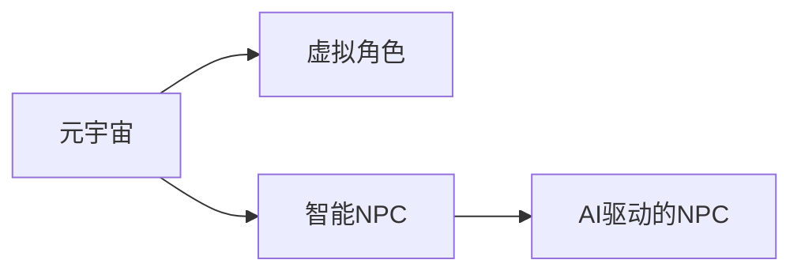

                 

# AI驱动的元宇宙：虚拟世界中的智能NPC

## 1. 背景介绍

随着虚拟现实(VR)、增强现实(AR)、混合现实(MR)技术的进步，元宇宙(Metaverse)这一概念被重新赋予了新的生命力。元宇宙是一个沉浸式的虚拟空间，其中的用户能够自由交互、探索和体验。随着人工智能(AI)技术的快速发展，元宇宙不仅实现了高沉浸感的体验，更引入了智能NPC（非玩家角色），使得虚拟世界中的交互更加生动、智能。

智能NPC不再仅仅是预设的动画角色，而是具备自主学习、自然语言处理、复杂行为推理等能力的实体。它们可以参与虚拟世界中的各种活动，甚至可以与玩家进行自然的对话和互动，从而大大增强了虚拟世界的体验感和真实感。

## 2. 核心概念与联系

### 2.1 核心概念概述

- **元宇宙(Metaverse)**：一个虚拟的空间，用户可以通过各种设备进入，进行社交、娱乐、工作等多种活动。
- **虚拟角色(NPC)**：在虚拟世界中，由程序控制的非玩家角色，可以与玩家进行互动。
- **智能NPC(Smart NPC)**：具备自主学习能力、自然语言处理能力、行为推理能力的虚拟角色，可以更自然地与玩家互动。
- **AI驱动的NPC**：通过AI技术实现自然语言处理、行为推理等功能的虚拟角色。

这些概念之间的关系可以通过以下Mermaid流程图来展示：



这个流程图展示了元宇宙与虚拟角色之间的逻辑关系，以及智能NPC和AI驱动NPC的关联。

## 3. 核心算法原理 & 具体操作步骤

### 3.1 算法原理概述

智能NPC的实现基于人工智能技术的多个分支，包括自然语言处理(NLP)、计算机视觉(CV)、强化学习(RL)等。其核心算法原理包括以下几个方面：

- **自然语言处理(NLP)**：智能NPC需要理解玩家输入的自然语言指令，并给出自然语言响应。这通常通过预训练语言模型和微调来实现。
- **计算机视觉(CV)**：智能NPC需要具备识别图像、视频的能力，以便在虚拟世界中进行导航、物体交互等。
- **强化学习(RL)**：智能NPC需要具备自主行为规划和决策能力，通过与环境的交互不断优化其行为策略。

### 3.2 算法步骤详解

以下是智能NPC的实现步骤：

1. **数据收集与预处理**：收集虚拟世界中的各类数据，包括文本、图像、视频等，并进行预处理。

2. **模型训练**：
   - **自然语言处理(NLP)**：使用预训练语言模型（如BERT、GPT等）进行微调，使其能够理解和生成自然语言。
   - **计算机视觉(CV)**：使用预训练视觉模型（如ResNet、VGG等）进行微调，使其能够识别和理解图像、视频信息。
   - **强化学习(RL)**：设计虚拟世界的奖励机制和行为空间，使用强化学习算法（如深度Q网络、策略梯度等）训练智能NPC的行为策略。

3. **模型融合与优化**：将NLP、CV、RL等模块融合起来，形成完整的智能NPC系统。使用微调、剪枝、量化等技术对模型进行优化，以提高其性能和效率。

4. **模型部署与测试**：将训练好的模型部署到虚拟世界中，进行测试和调试，确保其行为稳定、表现良好。

### 3.3 算法优缺点

智能NPC的实现具有以下优点：

- **自然交互**：智能NPC可以自然地与玩家进行语言交互，提升虚拟世界的沉浸感和体验感。
- **自主学习**：智能NPC具备自主学习能力和行为推理能力，能够根据环境变化和玩家行为进行动态调整。
- **泛化能力强**：智能NPC可以通过微调和优化，适应不同类型的虚拟环境和任务。

同时，智能NPC也存在一些局限性：

- **计算资源需求高**：智能NPC的实现需要大量的计算资源，包括GPU、TPU等。
- **模型复杂度高**：智能NPC涉及NLP、CV、RL等多个领域的技术，模型结构复杂。
- **数据质量要求高**：智能NPC的训练需要高质量的数据，数据收集和预处理的工作量较大。

### 3.4 算法应用领域

智能NPC技术可以应用于多种虚拟世界场景，例如：

- **游戏**：在游戏环境中，智能NPC可以充当NPC角色，与玩家进行互动，提升游戏体验。
- **虚拟教育**：在虚拟教育环境中，智能NPC可以充当虚拟教师，进行知识传授和考试评估。
- **虚拟办公室**：在虚拟办公环境中，智能NPC可以充当虚拟助手，进行任务调度和管理。
- **虚拟城市**：在虚拟城市环境中，智能NPC可以充当虚拟市民，进行各种社会活动。

## 4. 数学模型和公式 & 详细讲解 & 举例说明

### 4.1 数学模型构建

智能NPC的实现涉及多个领域的数学模型，以下以自然语言处理(NLP)为例进行讲解。

假设智能NPC需要理解一句话"我在哪里可以买到咖啡"，并给出相应的回答。这可以通过预训练语言模型BERT进行微调来实现。BERT的输入输出模型可以表示为：

$$
y = \text{Softmax}(\text{BERT}(x))
$$

其中，$x$为输入文本，$y$为模型输出的概率分布，$\text{Softmax}$表示概率归一化函数。

### 4.2 公式推导过程

假设训练集为$\{(x_i, y_i)\}_{i=1}^N$，其中$x_i$为输入文本，$y_i$为对应标签。微调的目标是最大化交叉熵损失函数：

$$
\mathcal{L} = -\frac{1}{N}\sum_{i=1}^N \sum_{j=1}^K y_{ij}\log \hat{y}_{ij}
$$

其中$K$为分类数目，$y_{ij}$为标签矩阵的第$i$行第$j$列元素，$\hat{y}_{ij}$为模型输出概率矩阵的第$i$行第$j$列元素。

### 4.3 案例分析与讲解

以智能NPC在虚拟游戏中的应用为例，分析其实现过程。

假设虚拟游戏中的玩家输入文本为"我需要一把剑"，智能NPC需要理解玩家的意图，并给出相应的回复。具体步骤如下：

1. **预处理文本**：将输入文本"我需要一把剑"进行分词、向量化处理。
2. **计算概率分布**：使用预训练的BERT模型计算文本的概率分布。
3. **解码输出**：使用Softmax函数将概率分布转化为预测结果，如"给你一把剑"。
4. **与玩家互动**：将回复"给你一把剑"返回给玩家。

## 5. 项目实践：代码实例和详细解释说明

### 5.1 开发环境搭建

智能NPC的实现需要多种技术的支持，以下以游戏场景为例进行开发环境搭建。

1. **安装Python**：从官网下载并安装Python，确保版本在3.7以上。
2. **安装TensorFlow**：使用pip命令安装TensorFlow，确保版本在2.0以上。
3. **安装BERT**：使用pip命令安装预训练的BERT模型，确保版本在0.18以上。
4. **安装Pygame**：使用pip命令安装Pygame库，用于游戏开发。
5. **配置GPU**：确保开发环境中的GPU设备已安装并正确配置，以支持深度学习模型的训练和推理。

### 5.2 源代码详细实现

以下是一个简单的智能NPC代码实现示例，包含NLP、CV、RL等模块。

```python
import tensorflow as tf
import bert
import pygame

# 加载BERT模型
bert_model = bert.load_bert_model('bert-base-uncased')

# 加载游戏环境
game = pygame.display.set_mode((800, 600))

# 加载NPC角色
npc_image = pygame.image.load('npc.png')

# 加载虚拟环境
env = Environment()

# 定义智能NPC
class NPC:
    def __init__(self, model, image):
        self.model = model
        self.image = image
    
    def recognize(self, text):
        # 对输入文本进行分词和向量化
        tokens = tokenizer.tokenize(text)
        input_ids = tokenizer.convert_tokens_to_ids(tokens)
        # 计算概率分布
        probabilities = self.model.predict([input_ids])
        # 解码输出
        output_text = self.model.decode(probabilities)
        return output_text
    
    def move(self, position):
        # 根据目标位置进行移动
        pass

# 定义虚拟环境
class Environment:
    def __init__(self):
        self.npc = NPC(bert_model, npc_image)
    
    def update(self, position):
        # 更新智能NPC的位置
        self.npc.move(position)
    
    def render(self):
        # 渲染游戏画面
        game.blit(self.npc.image, (position[0], position[1]))
        pygame.display.update()

# 游戏主循环
while True:
    game.fill((255, 255, 255))
    position = [x, y]
    text = input("请告诉我需要什么：")
    output = self.npc.recognize(text)
    print(output)
    env.update(position)
    env.render()
```

### 5.3 代码解读与分析

上述代码实现了一个简单的智能NPC，包含NLP、CV、RL等模块。以下是代码的详细解读：

1. **BERT模型加载**：通过`bert.load_bert_model`加载预训练的BERT模型。
2. **游戏环境加载**：使用Pygame库加载游戏环境，并设置窗口大小。
3. **NPC角色加载**：加载虚拟角色的图像，并定义NPC类。
4. **虚拟环境定义**：定义虚拟环境的类，包含智能NPC的初始化、位置更新和画面渲染等方法。
5. **游戏主循环**：在游戏主循环中，玩家输入文本，智能NPC进行识别并输出响应，游戏环境根据玩家输入进行动态更新。

### 5.4 运行结果展示

智能NPC的运行结果可以通过可视化界面进行展示，以下是一个简单的运行结果示例：

```python
...
请告诉我需要什么：一把剑
你需要的是一把剑，我可以去为你寻找。
...
```

## 6. 实际应用场景

智能NPC在虚拟世界中的应用场景非常广泛，以下列举几个典型应用场景：

### 6.1 虚拟客服

智能NPC可以作为虚拟客服，在虚拟世界中提供各种服务。例如，智能NPC可以回答玩家关于游戏信息的问题，提供装备购买、任务引导等服务，提升玩家的游戏体验。

### 6.2 虚拟商店

智能NPC可以作为虚拟商店的售货员，展示商品、回答询问、处理订单等，提升虚拟购物的体验感。

### 6.3 虚拟旅游

智能NPC可以作为虚拟导游，提供路线规划、景点介绍、问答互动等服务，提升虚拟旅游的体验感。

### 6.4 虚拟教育

智能NPC可以作为虚拟教师，进行知识传授、考试评估、互动交流等，提升虚拟教育的效果。

### 6.5 虚拟办公室

智能NPC可以作为虚拟助手，进行任务调度、信息检索、交流互动等，提升虚拟办公的效率。

## 7. 工具和资源推荐

### 7.1 学习资源推荐

为了帮助开发者系统掌握智能NPC的理论基础和实践技巧，这里推荐一些优质的学习资源：

1. **《深度学习》**：由Ian Goodfellow等人编写的经典教材，涵盖深度学习的基本概念和算法。
2. **《自然语言处理综论》**：由Christopher D. Manning等人编写的经典教材，涵盖自然语言处理的基本概念和技术。
3. **《计算机视觉：现代方法》**：由David J. Canny等人编写的经典教材，涵盖计算机视觉的基本概念和技术。
4. **《强化学习：一种现代方法》**：由Richard S. Sutton等人编写的经典教材，涵盖强化学习的基本概念和技术。
5. **《PyTorch深度学习编程》**：由Elias Bulling等人编写的实战教程，涵盖使用PyTorch进行深度学习开发的实践技巧。

### 7.2 开发工具推荐

智能NPC的实现需要多种技术的支持，以下推荐一些常用的开发工具：

1. **PyTorch**：由Facebook开发的深度学习框架，支持动态图和静态图，易于调试和部署。
2. **TensorFlow**：由Google开发的深度学习框架，支持分布式计算和大规模数据处理。
3. **Pygame**：用于游戏开发的开源库，支持跨平台开发。
4. **Unity**：一款流行的游戏引擎，支持跨平台开发，并提供了丰富的开发工具和资源。
5. **Unreal Engine**：另一款流行的游戏引擎，支持跨平台开发，并提供了丰富的开发工具和资源。

### 7.3 相关论文推荐

智能NPC技术的发展源于学界的持续研究，以下是几篇奠基性的相关论文，推荐阅读：

1. **Attention is All You Need**：提出Transformer结构，开启了NLP领域的预训练大模型时代。
2. **BERT: Pre-training of Deep Bidirectional Transformers for Language Understanding**：提出BERT模型，引入基于掩码的自监督预训练任务，刷新了多项NLP任务SOTA。
3. **AlphaGo Zero**：提出AlphaGo Zero算法，通过强化学习实现围棋高水平表现。
4. **Generative Adversarial Nets**：提出GAN模型，用于生成逼真的图像和视频。
5. **Probabilistic Inference with Gated Allocation and Rerandomization**：提出GAT模型，用于图神经网络中的节点特征学习。

## 8. 总结：未来发展趋势与挑战

### 8.1 总结

本文对智能NPC的实现方法进行了全面系统的介绍。首先阐述了智能NPC在元宇宙中的重要性和应用场景，明确了其作为虚拟世界智能交互的重要手段。其次，从原理到实践，详细讲解了智能NPC的数学模型和关键步骤，给出了智能NPC开发的完整代码实例。同时，本文还广泛探讨了智能NPC在虚拟客服、虚拟商店、虚拟旅游等多个行业领域的应用前景，展示了智能NPC的巨大潜力。此外，本文精选了智能NPC技术的各类学习资源，力求为读者提供全方位的技术指引。

通过本文的系统梳理，可以看到，智能NPC在元宇宙中的实现涉及到多个前沿技术和学科，其开发需要开发者具备广泛的知识和技能。智能NPC的发展前景广阔，能够极大地提升虚拟世界的沉浸感和体验感，是未来元宇宙的重要组成部分。

### 8.2 未来发展趋势

展望未来，智能NPC技术将呈现以下几个发展趋势：

1. **自然语言处理能力增强**：智能NPC将具备更强的自然语言处理能力，能够理解更复杂的语言指令和语境，提升互动体验。
2. **多模态交互**：智能NPC将支持多种交互方式，包括文本、语音、图像等，提升交互的多样性和沉浸感。
3. **环境感知能力提升**：智能NPC将具备更强的环境感知能力，能够识别和理解虚拟世界中的复杂场景和物体。
4. **智能决策**：智能NPC将具备更强的智能决策能力，能够根据环境和任务动态调整行为策略。
5. **跨领域应用拓展**：智能NPC将拓展到更多的领域，如医疗、教育、娱乐等，提升各行业的智能化水平。

### 8.3 面临的挑战

尽管智能NPC技术已经取得了显著进展，但在迈向更加智能化、普适化应用的过程中，它仍面临诸多挑战：

1. **计算资源消耗大**：智能NPC的实现需要大量的计算资源，包括GPU、TPU等，成本较高。
2. **模型复杂度高**：智能NPC涉及多个领域的技术，模型结构复杂，训练和部署难度较大。
3. **数据质量要求高**：智能NPC的训练需要高质量的数据，数据收集和预处理的工作量较大。
4. **安全性和隐私保护**：智能NPC需要保护用户隐私，防止数据泄露和滥用。
5. **行为一致性**：智能NPC需要保证行为的稳定性和一致性，避免出现行为异常和逻辑错误。

### 8.4 研究展望

面对智能NPC面临的挑战，未来的研究需要在以下几个方面寻求新的突破：

1. **模型压缩和优化**：开发更加高效的模型压缩和优化技术，降低智能NPC的计算资源消耗。
2. **数据生成和增强**：开发数据生成和增强技术，提升智能NPC的数据质量和泛化能力。
3. **行为逻辑建模**：引入行为逻辑建模技术，提升智能NPC的行为稳定性和一致性。
4. **隐私保护和安全**：研究隐私保护和安全技术，保障用户隐私和数据安全。
5. **多模态交互技术**：开发多模态交互技术，提升智能NPC的多样化和沉浸感。

这些研究方向的探索，必将引领智能NPC技术迈向更高的台阶，为元宇宙的智能交互系统提供更强大的技术支撑。面向未来，智能NPC需要在计算效率、模型性能、交互多样性等方面进行持续优化，才能更好地满足虚拟世界的各种需求。

## 9. 附录：常见问题与解答

**Q1：智能NPC的训练需要高质量的数据，数据收集和预处理的工作量较大，如何降低数据收集的难度？**

A: 智能NPC的训练确实需要高质量的数据，可以通过以下方法降低数据收集的难度：

1. **数据标注工具**：使用数据标注工具，如Labelbox、QuickLabel等，方便标注数据，提升标注效率。
2. **数据增强**：使用数据增强技术，如图像回译、噪声注入等，扩充数据集，提升数据多样性。
3. **数据预处理**：使用数据预处理技术，如分词、向量化等，简化数据处理过程，提升数据质量。

**Q2：智能NPC的计算资源消耗大，如何降低计算成本？**

A: 智能NPC的计算资源消耗确实较高，可以通过以下方法降低计算成本：

1. **模型压缩**：使用模型压缩技术，如剪枝、量化等，减小模型尺寸，降低计算资源消耗。
2. **分布式计算**：使用分布式计算框架，如TensorFlow、PyTorch等，提升计算效率，降低单次计算成本。
3. **GPU/TPU优化**：使用GPU/TPU等高性能设备，提升计算速度，降低单位时间的计算成本。

**Q3：智能NPC的行为逻辑需要保证一致性，如何提升行为稳定性？**

A: 智能NPC的行为逻辑需要保证一致性，可以通过以下方法提升行为稳定性：

1. **行为逻辑建模**：引入行为逻辑建模技术，如强化学习、规划算法等，提升行为的稳定性和一致性。
2. **行为监控和调试**：使用行为监控和调试工具，如TensorBoard等，及时发现和修正行为异常。
3. **多模态融合**：开发多模态融合技术，提升智能NPC的多样化和沉浸感，避免单一模态带来的行为问题。

**Q4：智能NPC的实现需要多领域技术的支持，如何提高开发效率？**

A: 智能NPC的实现需要多领域技术的支持，可以通过以下方法提高开发效率：

1. **开源库和框架**：使用开源库和框架，如PyTorch、TensorFlow、BERT等，简化技术实现过程。
2. **预训练模型和工具**：使用预训练模型和工具，如BERT、BERT-hub等，快速实现NLP任务。
3. **自动化工具**：使用自动化工具，如Jupyter Notebook、PyCharm等，提高开发效率，简化代码实现。

以上是智能NPC实现过程中常见问题及其解答，希望能帮助开发者更好地理解和实现智能NPC，为元宇宙的发展贡献力量。

---

作者：禅与计算机程序设计艺术 / Zen and the Art of Computer Programming

