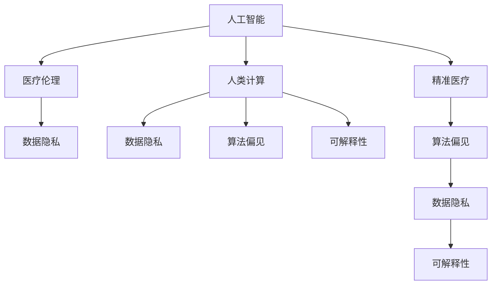

                 

# AI驱动的创新：人类计算在医疗行业的道德考虑

> 关键词：人工智能, 医疗, 人类计算, 道德, 医疗伦理, 精准医疗, 数据隐私, 算法偏见

## 1. 背景介绍

### 1.1 问题由来
近年来，人工智能技术在医疗行业的应用越来越广泛。从医疗影像的自动分析，到基因组数据的深度挖掘，再到机器人手术的精准操作，AI技术在提升医疗服务质量、降低医疗成本、改善患者体验等方面都展现了巨大的潜力。然而，AI在医疗领域的迅猛发展，也引发了一系列道德和伦理问题，引起了学界和社会的高度关注。

人工智能在医疗行业的应用，其核心在于利用机器学习和数据分析技术，对医疗数据进行处理和预测，辅助医生进行诊断和治疗决策。这种技术虽然为医疗行业带来了前所未有的便利和可能性，但也带来了新的风险和挑战。例如，AI算法的可解释性问题、数据隐私保护问题、算法偏见和歧视问题等。这些问题如果不能妥善解决，将可能对患者权益、医疗公平和医疗伦理造成严重影响。

### 1.2 问题核心关键点
本文将探讨人工智能技术在医疗行业应用的道德问题，特别是人类计算（Human Computation）在医疗领域的挑战与应对策略。我们关注以下几个核心关键点：

1. **数据隐私和伦理问题**：医疗数据通常包含大量敏感信息，如何在保证数据隐私的前提下，实现AI算法的训练和应用。
2. **算法偏见和歧视**：AI算法可能因训练数据偏差而产生偏见，如何避免算法偏见对医疗决策的不利影响。
3. **可解释性和透明度**：医疗AI算法的决策过程缺乏透明度，如何提高算法的可解释性，确保医生和患者对其决策的信任。
4. **计算效率和公平性**：在有限的计算资源下，如何设计高效的计算模型，同时保证算法的公平性。

## 2. 核心概念与联系

### 2.1 核心概念概述

为了更好地理解人工智能在医疗行业的道德问题，本节将介绍几个关键概念：

- **人工智能（AI）**：指使用计算机算法和数据处理技术，模拟和扩展人类智能，以实现自主决策和问题解决。
- **人类计算（Human Computation）**：指利用人类智慧和专业知识，辅助计算机进行复杂的数据处理和决策过程，包括但不限于数据分析、模型训练、解释验证等。
- **医疗伦理（Medical Ethics）**：涉及医学实践和医疗决策中的道德原则，包括尊重患者权利、保护数据隐私、避免歧视等。
- **精准医疗（Precision Medicine）**：基于个体基因组信息、环境因素和生活方式等，实现对疾病的个性化预防和治疗。
- **数据隐私（Data Privacy）**：指在处理和使用数据时，保护个人隐私和数据安全的措施和机制。

这些概念之间的关系可以通过以下Mermaid流程图来展示：



这个流程图展示了几组关键概念之间的关系：

1. 人工智能是医疗领域的主要技术手段，其应用过程中需要考虑伦理道德问题。
2. 人类计算在医疗AI的训练和应用过程中扮演重要角色，同时受到数据隐私和算法偏见的影响。
3. 精准医疗依赖于AI和人类计算，但也需要确保算法公平和数据隐私。
4. 数据隐私是AI和精准医疗的核心挑战，如何保护患者隐私是应用AI技术的前提。

## 3. 核心算法原理 & 具体操作步骤
### 3.1 算法原理概述

人工智能在医疗行业的核心应用原理是利用机器学习算法对医疗数据进行分析，提取有价值的信息，辅助医生进行诊断和治疗决策。这种算法通常基于大量的历史数据进行训练，并利用这些数据来预测未来的医疗事件。其核心步骤包括数据收集、模型训练、模型评估和模型应用。

### 3.2 算法步骤详解

以下以医疗影像自动分析为例，介绍人工智能在医疗领域的基本应用步骤：

1. **数据收集**：从医院信息系统、电子病历系统、医学影像数据库等来源，收集医疗影像和相关数据。数据包括病人的医疗记录、影像图像、实验室检查结果等。

2. **数据预处理**：对收集到的数据进行清洗和预处理，去除噪音和异常值，对数据进行标准化和归一化处理，以保证模型训练的一致性和有效性。

3. **模型训练**：使用机器学习算法（如深度学习、支持向量机、决策树等）对处理后的数据进行模型训练。训练过程中需要选择合适的训练算法、损失函数、优化器等，并进行超参数调优。

4. **模型评估**：对训练好的模型进行测试，评估其在独立数据集上的性能。常用的评估指标包括准确率、召回率、F1分数、ROC曲线等。

5. **模型应用**：将训练好的模型应用于新的医疗影像数据，辅助医生进行诊断和治疗决策。模型应用过程中需要考虑数据隐私和算法透明度的要求。

### 3.3 算法优缺点

人工智能在医疗领域的应用具有以下优点：

1. **提高诊断和治疗效率**：AI算法可以快速处理大量医疗数据，辅助医生进行精准诊断和治疗。
2. **降低医疗成本**：自动化和智能化操作可以减少人工操作，降低医疗成本。
3. **改善患者体验**：AI可以提供个性化医疗服务，提高患者满意度和治疗效果。

同时，也存在以下缺点：

1. **算法偏见和歧视**：训练数据可能存在偏差，导致AI算法产生偏见，影响诊断和治疗的公平性。
2. **数据隐私和安全问题**：医疗数据包含大量敏感信息，如何在保证隐私的同时，进行AI训练和应用，是一个重大挑战。
3. **算法可解释性不足**：AI算法的决策过程缺乏透明度，医生和患者难以理解和信任。
4. **计算资源消耗大**：高精度的医疗AI模型通常需要大量的计算资源，这在资源有限的医疗环境中是一个问题。

### 3.4 算法应用领域

人工智能在医疗领域的应用已经覆盖了多个领域，包括但不限于：

- **医疗影像分析**：利用深度学习算法对医疗影像进行自动分析和诊断，如X光片、CT、MRI等。
- **基因组数据分析**：基于基因组数据，进行疾病预测和个性化治疗方案设计。
- **药物研发**：利用机器学习算法预测新药效果，加速药物研发进程。
- **电子病历分析**：分析电子病历数据，辅助医生进行疾病预测和诊断。
- **患者监护**：通过可穿戴设备和传感器，实时监测患者健康状况，提供个性化的健康管理建议。

## 4. 数学模型和公式 & 详细讲解  
### 4.1 数学模型构建

在人工智能在医疗领域的应用中，数学模型构建是非常重要的一环。以下以医疗影像分类为例，介绍常用的数学模型及其构建过程。

假设我们有$m$个医疗影像数据，每个数据由$n$个特征组成。我们希望训练一个二分类模型，将影像分为正常和异常两类。

定义$X$为影像特征矩阵，$y$为影像标签向量（0表示正常，1表示异常）。模型的目标是最小化预测误差。

常用的数学模型包括逻辑回归、支持向量机、决策树等。这里以逻辑回归为例，介绍模型的构建过程。

### 4.2 公式推导过程

逻辑回归的数学模型为：

$$
P(y=1|X;\theta) = \frac{1}{1+\exp(-\theta^TX)}
$$

其中，$\theta$为模型的参数向量，$X$为输入特征矩阵。

模型的目标是最小化交叉熵损失函数：

$$
L(\theta) = -\frac{1}{m}\sum_{i=1}^m y_i\log P(y=1|X_i;\theta) + (1-y_i)\log (1-P(y=1|X_i;\theta))
$$

### 4.3 案例分析与讲解

以医疗影像分类为例，逻辑回归模型的构建和训练过程如下：

1. **数据准备**：将医疗影像数据进行标准化和归一化处理，生成特征矩阵$X$和标签向量$y$。

2. **模型初始化**：随机初始化模型参数$\theta$。

3. **模型训练**：使用梯度下降算法，迭代优化模型参数$\theta$，最小化交叉熵损失函数$L(\theta)$。

4. **模型评估**：使用独立数据集对训练好的模型进行测试，评估其性能指标。

## 5. 项目实践：代码实例和详细解释说明
### 5.1 开发环境搭建

在进行AI医疗项目开发前，需要搭建相应的开发环境。以下是使用Python和TensorFlow搭建环境的步骤：

1. **安装Anaconda**：从官网下载并安装Anaconda，用于创建独立的Python环境。

2. **创建并激活虚拟环境**：
```bash
conda create -n tensorflow-env python=3.8 
conda activate tensorflow-env
```

3. **安装TensorFlow**：根据CUDA版本，从官网获取对应的安装命令。例如：
```bash
conda install tensorflow tensorflow-gpu=cuda11.1 cudatoolkit=11.1 -c tensorflow -c conda-forge
```

4. **安装各类工具包**：
```bash
pip install numpy pandas scikit-learn matplotlib tqdm jupyter notebook ipython
```

完成上述步骤后，即可在`tensorflow-env`环境中开始开发工作。

### 5.2 源代码详细实现

以下是一个简单的医疗影像分类的TensorFlow代码实现：

```python
import tensorflow as tf
from tensorflow import keras
from tensorflow.keras import layers

# 定义数据准备函数
def preprocess_data(data_dir, batch_size=64):
    train_data = keras.preprocessing.image_dataset_from_directory(
        data_dir, 
        image_size=(256, 256), 
        batch_size=batch_size, 
        class_mode='binary'
    )
    return train_data

# 定义模型
model = keras.Sequential([
    layers.Conv2D(32, (3, 3), activation='relu', input_shape=(256, 256, 3)),
    layers.MaxPooling2D((2, 2)),
    layers.Conv2D(64, (3, 3), activation='relu'),
    layers.MaxPooling2D((2, 2)),
    layers.Conv2D(128, (3, 3), activation='relu'),
    layers.MaxPooling2D((2, 2)),
    layers.Flatten(),
    layers.Dense(128, activation='relu'),
    layers.Dense(1, activation='sigmoid')
])

# 定义模型编译和训练函数
def compile_and_train(model, train_data, epochs=10):
    model.compile(
        optimizer='adam',
        loss='binary_crossentropy',
        metrics=['accuracy']
    )
    model.fit(
        train_data,
        epochs=epochs,
        validation_split=0.2
    )

# 调用数据准备和模型训练函数
train_data = preprocess_data('data/train')
compile_and_train(model, train_data)
```

### 5.3 代码解读与分析

让我们再详细解读一下关键代码的实现细节：

**preprocess_data函数**：
- 定义数据准备函数，用于加载和预处理医疗影像数据。使用`keras.preprocessing.image_dataset_from_directory`函数，将目录下的医疗影像数据自动加载为TensorFlow数据集，并进行标准化和归一化处理。

**模型定义**：
- 定义一个简单的卷积神经网络模型，用于医疗影像分类。模型包含若干卷积层和全连接层，最后一层输出二分类概率。

**模型编译和训练函数**：
- 使用`model.compile`函数，定义优化器、损失函数和评估指标。
- 使用`model.fit`函数，进行模型训练。训练过程中，使用验证集进行模型评估。

**数据准备和模型训练函数调用**：
- 调用`preprocess_data`函数准备训练数据集。
- 调用`compile_and_train`函数，完成模型的编译和训练。

可以看到，TensorFlow提供了一系列简单易用的高级API，使得医疗影像分类的实现变得非常直观和高效。

### 5.4 运行结果展示

在上述代码实现中，训练完成后，我们可以使用以下代码进行模型评估：

```python
test_data = preprocess_data('data/test')
test_loss, test_acc = model.evaluate(test_data)
print(f'Test accuracy: {test_acc:.4f}')
```

通过运行上述代码，我们可以得到模型在测试集上的准确率，评估其分类效果。

## 6. 实际应用场景
### 6.1 智能影像诊断

基于AI的医疗影像自动分析技术，已经在多个医院和研究机构得到了广泛应用。通过训练深度学习模型，AI可以对医疗影像进行自动分析和诊断，如X光片、CT、MRI等影像数据的分析，辅助医生进行疾病诊断。

在技术实现上，可以收集大量已标注的医疗影像数据，作为模型的训练集。使用深度学习算法（如卷积神经网络、残差网络等）对影像特征进行提取和分类，训练出高精度的医疗影像分类模型。微调模型可以针对不同医院和医生的需求，进行个性化优化，提升诊断效果。

### 6.2 基因组数据分析

基因组数据包含大量的基因序列信息，是精准医疗的重要基础。通过分析基因组数据，AI可以预测个体患病的风险，设计个性化的治疗方案，提高治疗效果。

在技术实现上，可以收集大量的基因组数据，构建基因型与表型之间的关联模型。使用深度学习算法（如循环神经网络、自编码器等）对基因组数据进行处理和分析，识别出与疾病相关的基因变异。微调模型可以针对不同的疾病，进行个性化训练，提高预测准确性。

### 6.3 药物研发

药物研发是一个漫长且昂贵的过程，通过AI技术可以加速药物研发进程。AI可以预测新药的疗效和副作用，优化药物设计，降低研发成本。

在技术实现上，可以收集大量的药物和基因数据，构建药物与基因之间的关联模型。使用深度学习算法（如卷积神经网络、自编码器等）对药物和基因数据进行处理和分析，预测新药的疗效和副作用。微调模型可以针对不同的药物，进行个性化优化，提高药物研发效率。

### 6.4 未来应用展望

随着AI技术的不断进步，其在医疗领域的应用前景广阔。未来，AI将在以下几个方面发挥更大作用：

1. **个性化医疗**：基于基因组数据和医疗影像，提供个性化的治疗方案，提高治疗效果。
2. **远程医疗**：通过AI技术，实现远程诊断和治疗，提高医疗服务的可及性和覆盖面。
3. **医疗资源优化**：利用AI技术，优化医疗资源分配，提高医疗服务效率。
4. **医疗数据挖掘**：利用AI技术，挖掘医疗数据中的潜在信息，辅助医疗决策。

## 7. 工具和资源推荐
### 7.1 学习资源推荐

为了帮助开发者系统掌握AI在医疗行业的应用，这里推荐一些优质的学习资源：

1. **《深度学习与医学影像分析》课程**：由Coursera开设的深度学习在医学影像分析中的应用课程，涵盖深度学习算法、医疗影像数据处理、模型训练等多个方面。

2. **《机器学习与精准医疗》书籍**：由著名学者编写，详细介绍机器学习在精准医疗中的应用，包括基因组数据分析、药物研发等多个领域。

3. **《AI在医疗中的应用》报告**：由世界卫生组织发布的AI在医疗领域应用报告，涵盖AI在医疗影像分析、基因组数据分析、药物研发等多个方面的应用案例。

4. **AI医疗开源项目**：如OpenMined等，提供大量的AI医疗项目代码和数据集，供开发者学习和参考。

5. **医疗伦理在线课程**：如Coursera上的《医疗伦理与生物伦理学》课程，介绍医疗伦理的基础知识和应用场景，帮助开发者在应用AI技术时考虑伦理问题。

通过这些学习资源，相信你一定能够快速掌握AI在医疗行业的应用方法，并用于解决实际的医疗问题。

### 7.2 开发工具推荐

高效的开发离不开优秀的工具支持。以下是几款用于AI医疗开发常用的工具：

1. **TensorFlow**：由Google主导开发的开源深度学习框架，适合大规模工程应用。

2. **PyTorch**：基于Python的开源深度学习框架，支持动态计算图，适合快速迭代研究。

3. **Keras**：由Google开发的高级API，提供简单易用的深度学习模型构建接口。

4. **Jupyter Notebook**：提供交互式编程环境，支持代码编写、数据处理、模型训练等。

5. **Anaconda**：创建独立的Python环境，方便管理和安装各类Python包。

合理利用这些工具，可以显著提升AI医疗项目的开发效率，加快创新迭代的步伐。

### 7.3 相关论文推荐

AI在医疗行业的应用涉及多学科知识，以下是几篇奠基性的相关论文，推荐阅读：

1. **《Deep Learning for Medical Imaging》**：深度学习在医疗影像分析中的应用综述。

2. **《Precision Medicine via Deep Learning》**：深度学习在精准医疗中的应用研究。

3. **《AI in Drug Discovery and Development》**：AI在药物研发中的应用综述。

4. **《Machine Learning in Genomics》**：深度学习在基因组数据分析中的应用研究。

5. **《Ethics and AI in Healthcare》**：AI在医疗伦理中的应用研究。

这些论文代表了大AI在医疗行业的研究进展，通过学习这些前沿成果，可以帮助研究者把握学科前进方向，激发更多的创新灵感。

## 8. 总结：未来发展趋势与挑战
### 8.1 研究成果总结

本文对AI在医疗行业应用的道德问题进行了全面系统的介绍。首先阐述了AI技术在医疗领域的应用背景和意义，明确了AI在医疗应用中面临的伦理道德挑战。其次，从原理到实践，详细讲解了AI在医疗领域的应用步骤和关键技术，给出了医疗影像分类等代码实现示例。同时，本文还探讨了AI在医疗影像诊断、基因组数据分析、药物研发等多个领域的应用前景，展示了AI技术的巨大潜力。

通过本文的系统梳理，可以看到，AI在医疗领域的应用虽然带来了许多便利，但也面临诸多伦理和道德问题。如何平衡技术进步与伦理道德，是当前AI应用中的重要课题。未来，AI技术需要在保障伦理道德的前提下，不断推动医疗服务的智能化和普惠化。

### 8.2 未来发展趋势

展望未来，AI在医疗领域的应用将呈现以下几个发展趋势：

1. **数据隐私保护技术**：随着AI应用的普及，数据隐私保护技术将得到更多关注。未来，将有更多基于隐私保护的数据处理方法被研究和应用，保障患者数据的安全。

2. **算法公平性**：在AI模型训练过程中，将更加注重算法公平性。未来的AI算法将更加公正透明，避免因数据偏见而导致的歧视问题。

3. **可解释性增强**：AI算法的可解释性将成为重要的研究方向。未来，将有更多可解释性强的AI算法被研发，提高医生和患者对AI决策的信任。

4. **计算资源优化**：AI在医疗领域的应用需要大量的计算资源。未来，将有更多高效计算方法和优化技术被研究和应用，提高AI算法的计算效率。

5. **多模态融合**：AI在医疗领域的应用将更多地融合多模态数据。未来的AI算法将能够处理文本、影像、基因等多种数据类型，实现全面的医疗信息整合。

6. **伦理道德规范**：AI在医疗领域的应用将更加注重伦理道德规范。未来的AI算法将更加尊重患者权利，保障医疗公平。

以上趋势凸显了AI在医疗领域的广阔前景。这些方向的探索发展，将进一步提升AI在医疗领域的应用效果，推动医疗服务的智能化和普惠化。

### 8.3 面临的挑战

尽管AI在医疗领域的应用前景广阔，但在迈向更加智能化、普惠化应用的过程中，它仍面临诸多挑战：

1. **数据隐私和安全问题**：医疗数据包含大量敏感信息，如何在保障隐私的前提下，进行AI训练和应用，是一个重大挑战。

2. **算法偏见和歧视**：训练数据可能存在偏差，导致AI算法产生偏见，影响诊断和治疗的公平性。

3. **计算资源消耗大**：高精度的医疗AI模型通常需要大量的计算资源，这在资源有限的医疗环境中是一个问题。

4. **算法可解释性不足**：AI算法的决策过程缺乏透明度，医生和患者难以理解和信任。

5. **伦理道德规范缺失**：AI在医疗领域的应用需要更多的伦理道德规范，避免技术滥用。

6. **多模态数据融合困难**：医疗数据类型多样，如何有效地融合多种数据类型，实现全面的医疗信息整合，是一个重要挑战。

正视AI在医疗领域应用中的这些挑战，积极应对并寻求突破，将是大规模AI技术迈向成熟的必由之路。

### 8.4 研究展望

面向未来，AI在医疗领域的应用研究需要从多个方面进行突破：

1. **数据隐私保护技术**：开发更加高效的数据保护技术，如联邦学习、差分隐私等，保障患者数据的安全。

2. **算法公平性**：引入更多的公平性约束和正则化技术，避免因数据偏见而导致的歧视问题。

3. **可解释性增强**：研究可解释性强的AI算法，提高医生和患者对AI决策的信任。

4. **计算资源优化**：开发高效的计算方法和优化技术，如模型剪枝、量化加速等，提高AI算法的计算效率。

5. **多模态数据融合**：研究多模态数据融合技术，实现全面的医疗信息整合。

6. **伦理道德规范**：制定AI在医疗领域应用的伦理道德规范，确保技术应用的合法性和公平性。

这些研究方向的探索，将引领AI在医疗领域的应用走向更加成熟和可靠，为医疗服务的智能化和普惠化提供有力保障。

## 9. 附录：常见问题与解答

**Q1：AI在医疗领域的应用是否会取代医生？**

A: AI在医疗领域的应用可以辅助医生进行诊断和治疗，提高医疗服务的效率和质量。但AI无法完全取代医生，医生的经验、判断和人文关怀是AI难以替代的。AI在医疗领域的应用更多是作为医生的助手，帮助医生做出更好的决策。

**Q2：AI在医疗领域的应用是否会导致医疗数据的泄露？**

A: 医疗数据包含大量敏感信息，如果处理不当，可能会导致数据泄露。为了保障数据隐私，需要在数据处理和存储过程中采用加密、匿名化等技术，同时遵循相关的隐私保护法规，如GDPR、HIPAA等。

**Q3：AI在医疗领域的应用是否会引入新的偏见和歧视？**

A: AI算法的偏见和歧视问题是一个重要课题。为了避免AI算法引入新的偏见和歧视，需要在数据收集和模型训练过程中，进行公平性约束和正则化，引入多样化的数据样本，避免因数据偏见而导致的歧视问题。

**Q4：AI在医疗领域的应用是否会降低医疗服务的可及性？**

A: AI在医疗领域的应用可以提高医疗服务的可及性，特别是在资源有限的地区。通过AI技术，可以远程诊断和治疗，提供高质量的医疗服务。但同时，也需要保障医疗服务的公平性和可及性，避免因技术应用不均衡而导致的医疗资源分配不公。

**Q5：AI在医疗领域的应用是否会引发伦理道德问题？**

A: AI在医疗领域的应用需要遵循伦理道德规范，避免技术滥用。在AI算法设计和应用过程中，需要尊重患者权利，保障医疗公平，避免技术对医疗伦理的影响。

---

作者：禅与计算机程序设计艺术 / Zen and the Art of Computer Programming

