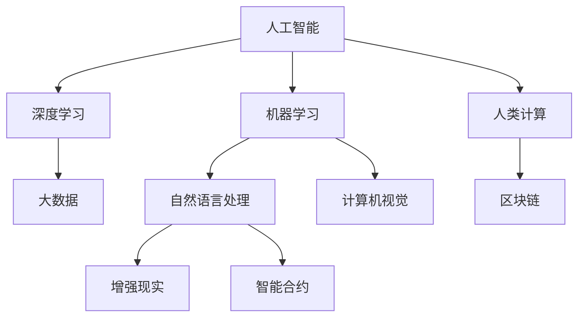

                 

# AI驱动的创新：人类计算在商业中的应用

> 关键词：人工智能(AI)，人类计算(Human Computation)，机器学习(Machine Learning)，商业应用，大数据(Big Data)，区块链(Blockchain)，自然语言处理(Natural Language Processing, NLP)，计算机视觉(Computer Vision)，增强现实(Augmented Reality, AR)，智能合约(Smart Contracts)

## 1. 背景介绍

### 1.1 问题由来

随着技术的飞速发展，人工智能(AI)正逐渐渗透到各个行业的核心业务中，尤其是大数据和机器学习算法的发展，为商业应用带来了颠覆性的变革。在企业管理、营销、供应链管理等诸多领域，AI技术的引入极大地提升了效率，降低了成本，创造了新的商业价值。然而，在AI技术实际应用中，我们也面临着一系列挑战和问题，如数据隐私保护、算法透明度、模型偏见等。

### 1.2 问题核心关键点

AI在商业应用中主要面临以下几个核心挑战：

- 数据质量与可用性：高质量、高可用性的大数据是AI应用的前提。如何高效获取、存储、管理数据，是商业应用中的关键问题。
- 算法复杂性与透明度：复杂的机器学习模型往往难以解释，如何设计简单、透明的算法，让决策过程可控、可解释，是AI技术普及的障碍。
- 模型偏见与公平性：训练数据中的偏见可能导致模型在特定群体上表现不佳，如何设计无偏、公平的模型，保障AI应用的社会公正性，是AI技术应用的伦理挑战。
- 数据隐私与安全性：在AI应用中，数据隐私和安全性问题尤为突出，如何保护用户数据隐私，防止数据泄露和滥用，是AI应用中的重要挑战。
- 技术与业务融合：AI技术的商业应用需要与企业现有的业务系统深度融合，如何在技术实现中兼顾业务需求，实现无缝集成，是AI应用成功的关键。

### 1.3 问题研究意义

研究AI在商业中的应用，对于推动企业管理创新、提升企业竞争力、增强用户体验具有重要意义：

1. 提升效率：通过自动化和智能决策，大幅降低人工操作，提高生产效率，缩短业务周期。
2. 优化决策：基于数据驱动的洞察，提供科学决策支持，减少人为错误，提高决策准确性。
3. 创新产品与服务：利用AI技术，创新业务模式，开发新型产品与服务，满足用户多样化需求。
4. 拓展市场：通过数据分析与预测，精准定位目标客户，优化市场营销策略，拓展新市场。
5. 风险管理：利用AI进行风险识别与控制，提升业务抗风险能力，保障企业稳健发展。
6. 提升用户体验：通过个性化推荐、智能客服等应用，提升客户体验，增强品牌忠诚度。

## 2. 核心概念与联系

### 2.1 核心概念概述

为更好地理解AI在商业应用中的核心技术，本节将介绍几个密切相关的核心概念：

- 人工智能(AI)：利用计算机科学和数学方法，实现对数据的分析、理解和决策，具备模拟人类智能的能力。
- 人类计算(Human Computation)：指通过人机交互，利用人类智慧和算力来解决复杂问题的计算范式。
- 机器学习(Machine Learning, ML)：基于数据驱动，让机器自动学习规律，进行预测和决策。
- 深度学习(Deep Learning)：机器学习的一个分支，通过多层神经网络模型，学习到复杂特征，解决高维非线性问题。
- 大数据(Big Data)：海量、多样、实时、价值密度低的数据集合，为AI提供数据基础。
- 区块链(Blockchain)：一种分布式账本技术，用于去中心化、透明、安全的数据记录与交换。
- 自然语言处理(NLP)：研究计算机如何理解、处理和生成自然语言的技术。
- 计算机视觉(Computer Vision, CV)：让计算机理解和解释图像和视频的技术。
- 增强现实(Augmented Reality, AR)：通过计算机生成信息增强现实环境，提供沉浸式体验。
- 智能合约(Smart Contracts)：在区块链上自动执行、控制数字资产的合约。

这些核心概念之间的逻辑关系可以通过以下Mermaid流程图来展示：



这个流程图展示了大数据、深度学习、人类计算、自然语言处理、计算机视觉、区块链等核心技术之间的相互联系和融合。

## 3. 核心算法原理 & 具体操作步骤

### 3.1 算法原理概述

AI在商业应用中主要依赖于机器学习和大数据技术。其核心原理是通过对海量数据的分析，发现数据中的规律和模式，然后利用这些规律进行预测和决策。以下是AI在商业应用中常用的算法原理概述：

- 监督学习(Supervised Learning)：利用带有标签的数据，训练模型预测未知数据，常见于分类和回归任务。
- 无监督学习(Unsupervised Learning)：无需标签数据，通过聚类、降维等方法，发现数据的内在结构，适用于数据探索和预处理。
- 强化学习(Reinforcement Learning)：通过试错方法，训练模型在复杂环境中进行决策，常见于游戏、机器人等领域。
- 半监督学习(Semi-supervised Learning)：利用少量标签数据和大量未标签数据，进行联合学习，提升模型性能。
- 迁移学习(Transfer Learning)：将在一个任务上学到的知识，迁移到另一个任务上，减少学习成本，提升模型泛化能力。
- 参数高效微调(Parameter-Efficient Fine-Tuning, PEFT)：只更新少量的模型参数，而固定大部分预训练权重，以提高微调效率，避免过拟合。
- 对抗学习(Adversarial Learning)：通过对抗样本训练模型，提高模型的鲁棒性和泛化能力。
- 自监督学习(Self-Supervised Learning)：利用数据本身的信息，无需标签进行自我监督学习，提升模型性能。

### 3.2 算法步骤详解

AI在商业应用中常用的算法步骤包括：

1. 数据预处理：清洗、归一化、特征工程等，确保数据质量。
2. 模型选择与训练：选择适合任务的模型，利用大数据进行训练，优化模型参数。
3. 模型评估与优化：通过测试集进行模型评估，优化模型性能。
4. 模型部署与应用：将训练好的模型部署到业务系统，进行实际应用。
5. 持续监控与迭代：监控模型表现，收集新数据，不断迭代优化模型。

### 3.3 算法优缺点

AI在商业应用中具有以下优点：

- 提升效率：自动化处理大量重复性工作，降低人工成本，提升效率。
- 优化决策：基于数据分析和预测，提供科学决策支持。
- 数据驱动：利用大数据和机器学习，发现数据中的规律和趋势，支持业务决策。
- 快速迭代：通过模型优化和重新训练，快速应对市场变化。

然而，AI技术在商业应用中也存在一些缺点：

- 数据依赖：依赖高质量、大容量的数据，获取和存储成本较高。
- 算法复杂：一些复杂算法难以解释，缺乏透明度。
- 技术门槛：需要专业知识和技能，门槛较高。
- 公平性问题：数据偏见可能导致模型不公平，影响决策公正性。
- 风险管理：复杂模型可能引入新风险，需要进行风险评估和控制。

### 3.4 算法应用领域

AI技术在商业应用中，广泛涉及以下领域：

- 数据分析与挖掘：通过大数据分析，发现市场趋势、客户行为等洞察，指导业务决策。
- 推荐系统：基于用户行为数据，推荐个性化的商品、内容、服务等。
- 智能客服：通过自然语言处理和机器学习，提供自动化的客户服务，提升用户体验。
- 财务分析：利用机器学习进行财务报表分析，预测市场走势，优化投资策略。
- 供应链管理：通过预测与优化，提高供应链效率，降低运营成本。
- 风险管理：通过机器学习预测风险，进行风险控制与缓解。
- 营销与广告：利用大数据分析客户行为，优化营销策略，提升广告效果。
- 产品设计与开发：利用AI进行用户需求分析，辅助产品设计与创新。

## 4. 数学模型和公式 & 详细讲解 & 举例说明

### 4.1 数学模型构建

在商业应用中，常见的数学模型包括回归模型、分类模型、聚类模型等。以线性回归模型为例，进行详细讲解。

假设回归模型为 $y = wx + b$，其中 $y$ 为预测值，$x$ 为输入特征，$w$ 为权重，$b$ 为截距。已知训练数据集 $(x_i, y_i)$，$i = 1, 2, ..., n$，则最小二乘法拟合的优化目标为：

$$
\min_{w,b} \sum_{i=1}^n (y_i - wx_i - b)^2
$$

通过求解上述优化问题，得到模型参数 $w$ 和 $b$。

### 4.2 公式推导过程

线性回归模型的最小二乘法求解过程如下：

1. 求取样本均值 $\bar{x} = \frac{1}{n} \sum_{i=1}^n x_i$ 和 $\bar{y} = \frac{1}{n} \sum_{i=1}^n y_i$。
2. 计算样本协方差矩阵 $S_{xx} = \frac{1}{n} \sum_{i=1}^n (x_i - \bar{x})(x_i - \bar{x})$ 和 $S_{xy} = \frac{1}{n} \sum_{i=1}^n (x_i - \bar{x})(y_i - \bar{y})$。
3. 计算回归系数 $w = S_{xy}S_{xx}^{-1}$，截距 $b = \bar{y} - wx$。

通过上述推导，可以求得线性回归模型的参数 $w$ 和 $b$，从而进行预测。

### 4.3 案例分析与讲解

以电商平台商品推荐系统为例，分析如何使用机器学习算法进行推荐。

1. 数据预处理：收集用户浏览历史、点击记录、购买记录等数据，进行清洗和特征工程。
2. 模型训练：选择基于协同过滤、矩阵分解等方法的推荐模型，利用用户行为数据进行训练。
3. 模型评估：通过AUC、RMSE等指标评估模型性能。
4. 模型部署：将训练好的模型部署到推荐系统，实时预测商品推荐结果。
5. 持续优化：不断收集用户反馈和行为数据，对模型进行迭代优化。

## 5. 项目实践：代码实例和详细解释说明

### 5.1 开发环境搭建

在进行AI商业应用开发前，需要准备好开发环境。以下是使用Python进行TensorFlow开发的开发环境配置流程：

1. 安装Anaconda：从官网下载并安装Anaconda，用于创建独立的Python环境。

2. 创建并激活虚拟环境：
```bash
conda create -n tf-env python=3.8 
conda activate tf-env
```

3. 安装TensorFlow：根据CUDA版本，从官网获取对应的安装命令。例如：
```bash
conda install tensorflow -c pytorch -c conda-forge
```

4. 安装其他依赖工具包：
```bash
pip install numpy pandas scikit-learn matplotlib tensorflow_datasets
```

完成上述步骤后，即可在`tf-env`环境中开始AI商业应用开发。

### 5.2 源代码详细实现

下面我们以推荐系统为例，给出使用TensorFlow进行推荐模型的PyTorch代码实现。

```python
import tensorflow as tf
from tensorflow.keras.layers import Input, Embedding, Dot, Dense
from tensorflow.keras.models import Model

# 输入层
user_input = Input(shape=(1,), name='user')
item_input = Input(shape=(1,), name='item')

# 嵌入层
user_embedding = Embedding(input_dim=n_users, output_dim=128, name='user_embedding')(user_input)
item_embedding = Embedding(input_dim=n_items, output_dim=128, name='item_embedding')(item_input)

# 点积层
dot_product = Dot(axes=1)([user_embedding, item_embedding])

# 线性输出层
output = Dense(1, activation='sigmoid')(dot_product)

# 模型
model = Model(inputs=[user_input, item_input], outputs=output)

# 编译模型
model.compile(optimizer='adam', loss='binary_crossentropy', metrics=['accuracy'])

# 训练模型
model.fit([train_user, train_item], train_click, epochs=10, batch_size=128)
```

### 5.3 代码解读与分析

让我们再详细解读一下关键代码的实现细节：

- `Input`层：定义输入层的维度，用户输入和商品输入均为单维数据。
- `Embedding`层：将用户ID和商品ID嵌入到128维向量空间中，方便进行点积计算。
- `Dot`层：计算用户和商品的向量点积，得到一个标量。
- `Dense`层：将点积结果映射为0-1之间的概率，用于判断用户是否点击商品。
- `Model`类：将上述各层组成模型，指定输入和输出。
- `compile`方法：编译模型，指定优化器和损失函数。
- `fit`方法：训练模型，指定训练数据和参数。

通过上述代码，可以构建一个简单的基于协同过滤的推荐系统，利用用户和商品的交互数据进行训练。

### 5.4 运行结果展示

```python
import numpy as np
from sklearn.metrics import roc_auc_score

# 测试集
test_user = [user_id]
test_item = [item_id]
predictions = model.predict([test_user, test_item])[0][0]
probability = predictions

# 计算AUC值
auc = roc_auc_score(true_labels, probability)
print(f"AUC: {auc:.3f}")
```

通过上述代码，可以计算推荐系统在测试集上的AUC值，评估模型性能。

## 6. 实际应用场景

### 6.1 电商平台推荐

电商平台利用AI推荐系统，提升用户购物体验，增加销售收入。推荐系统通过分析用户历史行为数据，预测用户对商品的可能兴趣，从而推荐个性化商品，提高转化率。

在技术实现上，推荐系统可以通过协同过滤、基于内容推荐、混合推荐等方法进行设计。协同过滤基于用户和商品交互数据，预测用户可能感兴趣的商品。基于内容推荐通过商品特征分析，相似度匹配，推荐相关商品。混合推荐将两种方法结合，提升推荐效果。

### 6.2 智能客服系统

智能客服系统利用自然语言处理和机器学习技术，为用户提供自动化客户服务。通过分析客户咨询数据，建立知识库和对话模型，系统能够自动理解客户意图，匹配最合适的答案，提供智能客服。

在技术实现上，智能客服系统通过构建意图识别和对话生成模型，进行自动对话。系统首先对客户输入进行意图识别，然后选择合适的回答模板，进行自然语言生成，返回给用户。

### 6.3 金融风险管理

金融机构利用AI技术，进行金融风险管理。通过分析市场数据和客户行为，预测金融市场走势，识别潜在风险，进行风险控制。

在技术实现上，风险管理系统可以通过时间序列预测、机器学习分类等方法进行设计。时间序列预测模型利用历史数据，预测未来金融市场走势。分类模型通过客户行为数据，预测客户违约概率，进行风险控制。

### 6.4 未来应用展望

随着AI技术的不断进步，未来的商业应用将更加广泛和深入。以下是AI技术在商业应用中的未来展望：

- 个性化推荐：通过深度学习和数据分析，实现更加精准和多样化的个性化推荐，提升用户体验。
- 智能客服：利用自然语言处理和机器学习，实现更加智能和个性化的智能客服，提高服务效率和质量。
- 金融智能投顾：通过智能投顾系统，利用AI技术进行股票、基金等资产投资决策，提升投资回报率。
- 供应链优化：通过AI技术进行供应链管理，实现需求预测、库存优化、物流调度等，降低运营成本，提升供应链效率。
- 医疗智能诊断：利用AI技术进行医学影像分析、病历诊断等，辅助医生决策，提高医疗服务质量。

## 7. 工具和资源推荐

### 7.1 学习资源推荐

为了帮助开发者系统掌握AI在商业应用的技术基础和实践技巧，这里推荐一些优质的学习资源：

1. 《深度学习》系列书籍：Yoshua Bengio、Ian Goodfellow等作者所著，系统介绍了深度学习的理论基础和实践方法。
2. Coursera《机器学习》课程：由Andrew Ng教授开设，讲解机器学习的基本概念和算法。
3. Udacity《深度学习专项课程》：提供深度学习的理论和实践教程，涵盖各种深度学习模型和应用。
4. Kaggle竞赛平台：全球知名的数据科学竞赛平台，提供丰富的数据集和比赛，可以锻炼实战能力。
5. TensorFlow官方文档：TensorFlow官方提供的详细教程和示例，是TensorFlow应用开发的必备资源。

通过对这些资源的学习实践，相信你一定能够快速掌握AI在商业应用中的核心技术，并用于解决实际的商业问题。

### 7.2 开发工具推荐

高效的开发离不开优秀的工具支持。以下是几款用于AI商业应用开发的常用工具：

1. TensorFlow：由Google主导开发的开源深度学习框架，生产部署方便，适合大规模工程应用。
2. PyTorch：基于Python的开源深度学习框架，灵活动态的计算图，适合快速迭代研究。
3. Scikit-learn：基于Python的机器学习库，提供了丰富的算法和工具，适合数据挖掘和模型训练。
4. Keras：基于Python的深度学习库，提供了简单易用的API，适合快速原型开发。
5. H2O.ai：提供一站式机器学习平台，支持多种算法和工具，适合企业级应用。
6. IBM Watson Studio：提供云端机器学习平台，支持数据探索、模型训练、应用部署等，适合企业级应用。

合理利用这些工具，可以显著提升AI商业应用开发的效率，加速技术创新和应用落地。

### 7.3 相关论文推荐

AI在商业应用中涉及的算法和技术众多，以下是几篇奠基性的相关论文，推荐阅读：

1. "Deep Learning" by Ian Goodfellow, Yoshua Bengio, and Aaron Courville。
2. "Neural Networks and Deep Learning" by Michael Nielsen。
3. "Pattern Recognition and Machine Learning" by Christopher Bishop。
4. "Gan Investment Algorithm" by Ian Goodfellow and Xiaocheng Xu。
5. "Customer Recommendation Systems" by Benjamin F. T. Buunk and William A. van Hees。

这些论文代表了大数据、深度学习、机器学习等领域的研究进展，为AI商业应用提供了坚实的理论基础。

## 8. 总结：未来发展趋势与挑战

### 8.1 总结

本文对AI在商业应用中的核心技术进行了全面系统的介绍。首先阐述了AI在商业应用中的研究背景和意义，明确了AI技术在提升效率、优化决策、个性化推荐等方面的独特价值。其次，从原理到实践，详细讲解了监督学习、回归模型、推荐系统等关键算法的数学原理和实现步骤。同时，本文还广泛探讨了AI技术在电商平台、智能客服、金融风险管理等多个行业领域的应用前景，展示了AI技术的广泛应用。

通过本文的系统梳理，可以看到，AI技术在商业应用中具有巨大的潜力，能够显著提升企业的运营效率和竞争力。未来，伴随AI技术的不断演进，AI在商业应用中的实际落地将更加广泛和深入，为各行各业带来深刻变革。

### 8.2 未来发展趋势

展望未来，AI在商业应用中呈现以下几个发展趋势：

1. 技术融合：AI技术与大数据、物联网、区块链等技术的深度融合，将带来更全面、更智能的解决方案。
2. 应用场景扩大：AI技术在更多垂直行业的应用，将推动产业升级和创新，催生新的商业模式。
3. 数据驱动：基于AI技术的智能决策和个性化推荐，将大幅提升用户体验和满意度。
4. 自动化水平提升：AI技术的普及，将大幅提升各行业的自动化水平，降低人工成本，提升效率。
5. 跨领域应用：AI技术在不同领域的交叉应用，将推动行业深度融合，产生协同效应。
6. 人机协作：AI技术与人类智慧的有机结合，将提升人机协作水平，推动人类智能的全面发展。

以上趋势凸显了AI技术在商业应用中的广阔前景。这些方向的探索发展，必将进一步推动AI技术的商业应用，为各行各业带来深刻变革。

### 8.3 面临的挑战

尽管AI技术在商业应用中已经取得了显著进展，但在迈向更加智能化、普适化应用的过程中，仍面临诸多挑战：

1. 数据隐私与安全性：在AI应用中，数据隐私和安全性问题尤为突出，如何保护用户数据隐私，防止数据泄露和滥用，是AI应用中的重要挑战。
2. 技术复杂性与透明度：一些复杂算法难以解释，缺乏透明度，如何设计简单、透明的算法，让决策过程可控、可解释，是AI技术普及的障碍。
3. 公平性与偏见：数据偏见可能导致模型在特定群体上表现不佳，如何设计无偏、公平的模型，保障AI应用的社会公正性，是AI技术应用的伦理挑战。
4. 技术与业务融合：AI技术的商业应用需要与企业现有的业务系统深度融合，如何在技术实现中兼顾业务需求，实现无缝集成，是AI应用成功的关键。
5. 风险管理：复杂模型可能引入新风险，需要进行风险评估和控制。

### 8.4 研究展望

面对AI在商业应用中面临的挑战，未来的研究需要在以下几个方面寻求新的突破：

1. 数据隐私保护：开发新的隐私保护技术，如差分隐私、联邦学习等，保障用户数据安全。
2. 算法透明度提升：设计可解释的算法，提升决策过程的透明度和可控性。
3. 公平性算法优化：开发公平性算法，消除数据偏见，保障AI应用的公正性。
4. 技术业务融合：深入研究AI技术与业务系统的深度融合，提升系统集成度。
5. 风险管理与控制：开发新的风险评估和管理工具，保障AI系统的稳健性。

这些研究方向将推动AI技术在商业应用中的落地和普及，助力各行业实现数字化转型，提升企业竞争力。

## 9. 附录：常见问题与解答

**Q1：AI在商业应用中的核心技术是什么？**

A: AI在商业应用中的核心技术主要包括大数据、机器学习、深度学习、自然语言处理、计算机视觉、增强现实等。这些技术通过数据分析、模型训练和智能决策，为商业应用提供技术支持。

**Q2：AI在商业应用中面临哪些主要挑战？**

A: AI在商业应用中面临的主要挑战包括数据隐私与安全、算法复杂性与透明度、公平性问题、技术与业务融合、风险管理等。这些挑战需要通过技术创新和政策引导，逐步解决。

**Q3：如何提升AI在商业应用中的技术透明度？**

A: 设计可解释的算法是提升AI技术透明度的关键。可以使用可视化工具，如TensorBoard、Keras等，展示模型内部结构和计算过程。同时，可以引入因果分析和模型解释技术，解释模型决策的因果逻辑。

**Q4：AI在商业应用中的未来趋势是什么？**

A: AI在商业应用中的未来趋势包括技术融合、应用场景扩大、数据驱动、自动化水平提升、跨领域应用、人机协作等。这些趋势将推动AI技术在更多行业中的落地应用，带来深刻变革。

**Q5：AI在商业应用中如何实现跨领域应用？**

A: AI技术通过多领域数据融合、多模态数据整合、跨领域知识应用等方式，实现跨领域应用。例如，将自然语言处理和计算机视觉结合，实现多模态智能客服系统；将AI与物联网结合，实现智能城市等。

总之，AI技术在商业应用中的不断发展和演进，将为各行业带来深刻的变革，推动智能商业时代的到来。面对未来的挑战，我们需要持续探索和创新，不断优化和提升AI技术，实现技术与人类的深度融合，共同创造更美好的未来。

---

作者：禅与计算机程序设计艺术 / Zen and the Art of Computer Programming

