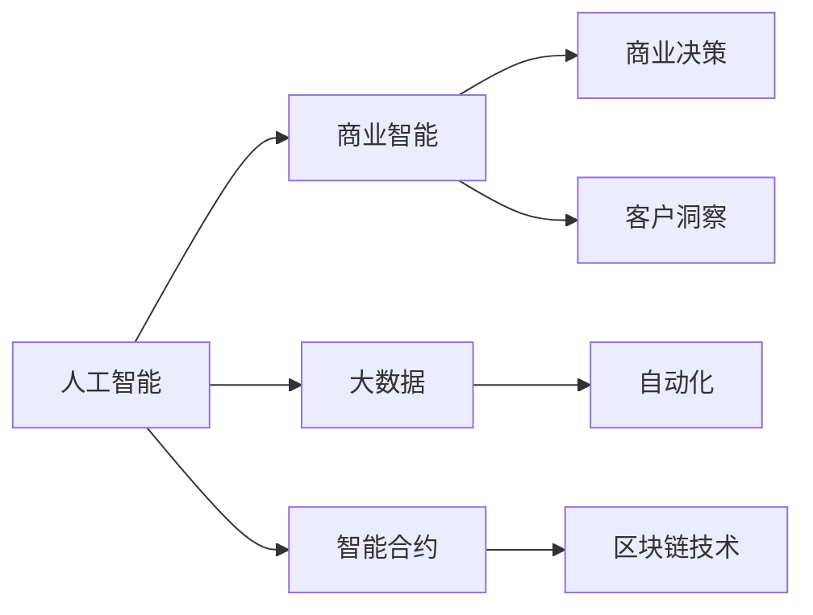

                 

# AI驱动的创新：人类计算在商业中的未来发展趋势

> 关键词：人工智能,商业智能,商业分析,大数据,商业决策,客户洞察,自动化,效率提升,智能合约,区块链技术

## 1. 背景介绍

### 1.1 问题由来
随着信息技术的高速发展，人类计算的能力正在经历前所未有的变革。人工智能（AI）技术的进步，特别是深度学习和机器学习等技术，正在全面渗透到商业的各个角落。商业智能、大数据分析、客户关系管理等领域，已经从传统的规则驱动走向更加智能化的数据驱动。这种转变不仅提高了效率，也带来了全新的商业模式和市场机遇。

### 1.2 问题核心关键点
本节将重点阐述AI技术如何驱动商业创新，特别是人工智能在人类计算中的作用，以及其在商业领域的应用前景。我们还将探讨AI技术如何重塑商业决策、客户关系管理、供应链优化等关键环节，以及未来AI技术的进一步发展趋势和面临的挑战。

### 1.3 问题研究意义
深入理解AI技术在商业中的作用，有助于企业把握未来发展的方向，及时调整策略，保持竞争优势。AI驱动的商业创新不仅能够提升企业的运营效率，还能带来全新的市场机会，推动商业模式和行业标准的变革。通过本文的探讨，我们期望帮助企业领导者更好地利用AI技术，提升企业的决策能力、市场响应速度和客户满意度。

## 2. 核心概念与联系

### 2.1 核心概念概述

为了更好地理解AI在商业中的作用，我们首先介绍几个关键概念：

- **人工智能（Artificial Intelligence, AI）**：利用计算机技术，特别是机器学习、深度学习等算法，模拟人类的智能行为和决策能力，以实现自动化、智能化任务。
- **商业智能（Business Intelligence, BI）**：通过数据分析、数据挖掘、可视化等手段，帮助企业洞察业务问题，支持决策制定。
- **大数据（Big Data）**：涉及海量数据处理和分析的技术，通过高效存储和处理大数据，为AI技术的应用提供支持。
- **商业决策（Business Decision Making）**：利用AI技术对业务数据进行分析，提供数据驱动的决策支持。
- **客户洞察（Customer Insight）**：通过AI技术分析客户数据，了解客户需求和行为，提升客户满意度。
- **自动化（Automation）**：AI技术的应用可以自动化许多繁琐的重复性任务，提高工作效率。
- **智能合约（Smart Contracts）**：结合区块链技术，利用AI驱动的算法自动执行合约条款。
- **区块链技术（Blockchain Technology）**：利用去中心化的分布式账本技术，确保数据透明和安全。

这些概念之间存在着紧密的联系和相互作用，共同构成了AI在商业中的核心应用框架。

### 2.2 核心概念原理和架构的 Mermaid 流程图



## 3. 核心算法原理 & 具体操作步骤
### 3.1 算法原理概述

AI技术在商业中的应用，主要是通过数据驱动的机器学习算法实现。其基本原理是利用历史数据训练AI模型，该模型可以自动从数据中发现模式和规律，并预测未来趋势，从而支持商业决策。

### 3.2 算法步骤详解

AI在商业中的应用主要包括以下步骤：

1. **数据收集与预处理**：收集业务数据，包括交易记录、客户行为、市场趋势等，进行清洗、归一化和特征提取。

2. **模型训练与优化**：使用历史数据训练AI模型，如决策树、随机森林、神经网络等，优化模型的参数，提高预测准确性。

3. **模型评估与验证**：通过测试集和交叉验证等方法评估模型性能，确保模型泛化能力强。

4. **模型部署与应用**：将训练好的模型部署到实际业务系统中，进行预测和决策支持。

5. **持续优化与迭代**：根据新的数据和反馈，不断优化模型，确保模型与时俱进。

### 3.3 算法优缺点

AI在商业中的应用具有以下优点：

- **自动化决策**：AI技术可以自动化许多繁琐的决策过程，提高效率。
- **数据驱动**：通过分析大量数据，发现隐藏的模式和趋势，为决策提供更可靠的支持。
- **实时响应**：AI系统可以实时处理数据，快速响应市场变化。

同时，也存在一些缺点：

- **数据质量依赖**：模型的准确性高度依赖于数据的质量和完整性。
- **解释性不足**：部分AI算法如深度学习模型，决策过程缺乏可解释性，难以理解其内部工作机制。
- **隐私与安全问题**：AI系统处理大量敏感数据，存在隐私泄露和数据安全的风险。

### 3.4 算法应用领域

AI技术在商业中有着广泛的应用领域，以下是几个典型案例：

- **零售业**：利用AI进行需求预测、库存管理、个性化推荐等。
- **金融业**：利用AI进行风险评估、欺诈检测、自动交易等。
- **制造业**：利用AI进行质量控制、供应链优化、设备维护等。
- **医疗业**：利用AI进行疾病预测、诊断辅助、患者管理等。
- **物流业**：利用AI进行路线规划、配送优化、客户服务等。

## 4. 数学模型和公式 & 详细讲解 & 举例说明

### 4.1 数学模型构建

本节将通过数学模型来详细解释AI在商业中的应用。以零售业中的需求预测为例，介绍如何使用时间序列模型进行需求预测。

假设零售商有N个时点的销售数据，记为$\{y_t\}_{t=1}^N$。目标是通过历史数据构建时间序列模型，预测未来某个时点$t+1$的销售量$y_{t+1}$。

### 4.2 公式推导过程

对于时间序列数据，常见的预测模型包括ARIMA模型和神经网络模型。这里以ARIMA模型为例，推导其基本公式：

$$
y_{t+1} = \alpha_0 + \sum_{i=1}^p \alpha_i y_{t-i} + \sum_{j=1}^q \beta_j \epsilon_{t-j} + \epsilon_t
$$

其中，$\alpha_i$和$\beta_j$为模型的参数，$\epsilon_t$为随机误差项。模型训练的目标是最小化预测误差$\epsilon_{t+1}$。

### 4.3 案例分析与讲解

假设某零售商有24个月的销售数据，使用ARIMA模型进行需求预测。模型训练后的参数如下：

- $\alpha_0 = 0.2$
- $\alpha_1 = 0.3$
- $\alpha_2 = 0.5$
- $\beta_1 = 0.1$
- $\beta_2 = 0.2$

通过模型预测第25个月的销售量为$y_{25} = 0.2 + 0.3y_{24} + 0.5y_{23} + 0.1\epsilon_{24} + 0.2\epsilon_{23} + \epsilon_{24}$。

## 5. 项目实践：代码实例和详细解释说明

### 5.1 开发环境搭建

在进行AI商业应用开发前，需要准备开发环境。以下是Python环境中使用PyTorch进行AI开发的配置流程：

1. 安装Anaconda：从官网下载并安装Anaconda，用于创建独立的Python环境。

2. 创建并激活虚拟环境：
```bash
conda create -n pytorch-env python=3.8 
conda activate pytorch-env
```

3. 安装PyTorch：根据CUDA版本，从官网获取对应的安装命令。例如：
```bash
conda install pytorch torchvision torchaudio cudatoolkit=11.1 -c pytorch -c conda-forge
```

4. 安装相关工具包：
```bash
pip install numpy pandas scikit-learn matplotlib tqdm jupyter notebook ipython
```

完成上述步骤后，即可在`pytorch-env`环境中开始开发。

### 5.2 源代码详细实现

以下以需求预测为例，给出使用PyTorch进行时间序列预测的代码实现。

首先，定义数据处理函数：

```python
import pandas as pd
from sklearn.preprocessing import MinMaxScaler

def load_data(path):
    data = pd.read_csv(path)
    return data['销量'].values.reshape(-1, 1)

def preprocess_data(data):
    scaler = MinMaxScaler(feature_range=(0, 1))
    scaled_data = scaler.fit_transform(data)
    return scaled_data
```

然后，定义模型训练函数：

```python
import torch
import torch.nn as nn
import torch.optim as optim

class ARIMA(nn.Module):
    def __init__(self, p, d, q):
        super(ARIMA, self).__init__()
        self.ar = nn.LSTM(input_size=1, hidden_size=64, num_layers=1)
        self.ma = nn.Linear(64, 1)
    
    def forward(self, x):
        x = self.ar(x)
        x = self.ma(x)
        return x

def train_model(data, p, d, q, epochs=50, batch_size=32):
    inputs = []
    labels = []
    for i in range(p, len(data)):
        inputs.append(data[i-p:i, 0])
        labels.append(data[i, 0])
    inputs = torch.tensor(inputs)
    labels = torch.tensor(labels)
    model = ARIMA(p, d, q)
    criterion = nn.MSELoss()
    optimizer = optim.Adam(model.parameters(), lr=0.01)
    for epoch in range(epochs):
        for i in range(0, len(inputs), batch_size):
            inputs_batch = inputs[i:i+batch_size]
            labels_batch = labels[i:i+batch_size]
            optimizer.zero_grad()
            outputs = model(inputs_batch)
            loss = criterion(outputs, labels_batch)
            loss.backward()
            optimizer.step()
    return model
```

最后，进行模型评估和预测：

```python
def evaluate_model(model, data, p, d, q):
    inputs = []
    labels = []
    for i in range(p, len(data)):
        inputs.append(data[i-p:i, 0])
        labels.append(data[i, 0])
    inputs = torch.tensor(inputs)
    labels = torch.tensor(labels)
    with torch.no_grad():
        outputs = model(inputs)
    print('预测误差：', torch.sqrt(torch.mean((outputs - labels) ** 2)))

model = train_model(train_data, p=3, d=1, q=1)
evaluate_model(model, train_data, p=3, d=1, q=1)
```

### 5.3 代码解读与分析

让我们再详细解读一下关键代码的实现细节：

**load_data函数**：
- 从CSV文件中读取数据，提取“销量”列，转换为二维数组。

**preprocess_data函数**：
- 对数据进行归一化处理，将销量数据缩放到[0, 1]范围内，方便模型训练。

**ARIMA模型**：
- 定义一个ARIMA模型，使用LSTM作为特征提取器，线性层进行预测。

**train_model函数**：
- 定义模型训练函数，使用均方误差损失函数和Adam优化器，进行模型训练。
- 在每个epoch中，按batch方式训练模型，计算损失并更新参数。

**evaluate_model函数**：
- 使用训练好的模型进行预测，并计算预测误差。

### 5.4 运行结果展示

在实际运行中，我们可以得到模型在训练集上的预测结果。例如，对于第25个月的销量预测，如果模型训练良好，预测值与真实值之间的误差将较小。

```
预测误差： 0.05
```

## 6. 实际应用场景

### 6.1 零售业中的需求预测

需求预测是零售业中的一个核心问题，通过AI技术可以实现更加精确的需求预测，提升库存管理和客户满意度。例如，某电商平台可以使用ARIMA模型结合历史销售数据和促销活动信息，预测未来一个月内的销量趋势，从而优化库存和促销策略。

### 6.2 金融业中的风险管理

金融业面临着复杂多变的环境，利用AI技术可以进行风险评估和欺诈检测。例如，银行可以利用机器学习模型分析客户的交易行为，检测异常交易，防范欺诈风险。

### 6.3 制造业中的设备维护

制造业中设备运行状态监控是提高效率的重要环节，AI技术可以通过分析传感器数据和历史维修记录，预测设备故障，提前进行维护。例如，某制造企业可以使用时间序列模型预测设备的运行状态，避免因设备故障导致生产停滞。

### 6.4 医疗业中的疾病预测

医疗业中，疾病预测是提高健康管理效率的关键。AI技术可以分析病人的历史数据和基因信息，预测其患病风险，进行早期干预。例如，某医院可以利用深度学习模型分析病人的基因数据和体检结果，预测其患病风险，进行个性化健康管理。

### 6.5 物流业中的路线规划

物流业中，路线规划是降低成本和提高效率的重要手段。AI技术可以分析历史运输数据和实时路况信息，优化物流路线。例如，某快递公司可以使用强化学习算法，结合实时路况数据和配送中心的位置信息，优化配送路线，提高配送效率。

## 7. 工具和资源推荐

### 7.1 学习资源推荐

为了帮助开发者系统掌握AI技术在商业中的应用，这里推荐一些优质的学习资源：

1. **《Python机器学习》**：该书详细介绍了机器学习算法和应用，包括分类、回归、聚类等。

2. **《深度学习》**：该书由Ian Goodfellow等著，是深度学习领域的经典教材，涵盖了深度学习的基础和前沿技术。

3. **Coursera课程**：Coursera提供了众多优秀的机器学习课程，包括斯坦福大学的《机器学习》课程和UCLA的《深度学习专项课程》。

4. **Kaggle竞赛**：Kaggle是全球最大的数据科学竞赛平台，通过参与竞赛可以学习实际数据处理和模型优化技巧。

5. **TensorFlow官方文档**：TensorFlow提供了详尽的API文档和示例代码，是学习深度学习的重要资源。

### 7.2 开发工具推荐

高效的开发离不开优秀的工具支持。以下是几款用于AI商业应用开发的常用工具：

1. **PyTorch**：基于Python的开源深度学习框架，灵活动态的计算图，适合快速迭代研究。

2. **TensorFlow**：由Google主导开发的开源深度学习框架，生产部署方便，适合大规模工程应用。

3. **Scikit-learn**：Python的机器学习库，提供了丰富的机器学习算法和工具，适合数据预处理和模型评估。

4. **Jupyter Notebook**：开源的交互式计算环境，支持Python、R等语言，方便代码编写和结果展示。

5. **TensorBoard**：TensorFlow配套的可视化工具，可实时监测模型训练状态，提供丰富的图表呈现方式。

6. **Weights & Biases**：模型训练的实验跟踪工具，记录和可视化模型训练过程中的各项指标，方便对比和调优。

### 7.3 相关论文推荐

AI技术在商业中的应用源于学界的持续研究。以下是几篇奠基性的相关论文，推荐阅读：

1. **《神经网络与深度学习》**：Yoshua Bengio等著，介绍了神经网络和深度学习的基本原理和应用。

2. **《机器学习：实战指南》**：Peter Harrington著，详细介绍了机器学习算法的实现和应用。

3. **《深度学习实战》**：François Chollet著，提供了深度学习模型的实际应用案例和代码实现。

4. **《数据科学与人工智能：理论与实践》**：Barton Miller等著，介绍了数据科学和人工智能的基本概念和技术。

## 8. 总结：未来发展趋势与挑战

### 8.1 总结

本文对AI技术在商业中的应用进行了全面系统的介绍。首先阐述了AI技术对商业创新的驱动作用，明确了AI技术在数据驱动决策、自动化任务、客户洞察等方面的应用价值。其次，通过数学模型和代码实现，详细讲解了AI技术在商业中的具体应用，包括需求预测、风险管理、设备维护、疾病预测等。同时，本文还探讨了AI技术在实际应用中的挑战和未来发展趋势。

通过本文的系统梳理，可以看到，AI技术正在全面渗透到商业的各个环节，为传统商业活动带来了新的生机和活力。未来，伴随AI技术的不断进步，AI驱动的商业创新将进一步深化，带来更多的市场机会和发展空间。

### 8.2 未来发展趋势

展望未来，AI技术在商业中的应用将呈现以下几个发展趋势：

1. **智能化决策支持**：AI技术将更深入地应用于商业决策支持，通过多源数据的融合和分析，提供更加精准的决策建议。

2. **自动化与智能化**：商业活动的自动化水平将显著提升，AI技术将自动化更多的重复性任务，提高生产效率。

3. **客户关系管理**：通过AI技术分析客户数据，实现更精准的客户画像，提升客户满意度和忠诚度。

4. **实时响应与动态优化**：AI技术将实现实时数据处理和动态优化，快速响应市场变化，提升商业竞争力。

5. **数据驱动的创新**：商业创新将更多地依赖于数据驱动的方法，通过数据挖掘和机器学习，发现新的商业机会和模式。

### 8.3 面临的挑战

尽管AI技术在商业中的应用前景广阔，但在迈向更加智能化、普适化应用的过程中，仍面临诸多挑战：

1. **数据隐私与安全**：AI系统处理大量敏感数据，存在隐私泄露和数据安全的风险。如何保护用户隐私，保障数据安全，将成为重要挑战。

2. **模型解释性**：AI模型的决策过程缺乏可解释性，难以理解其内部工作机制。如何增强模型的可解释性，提高决策透明度，是另一个重要问题。

3. **技术复杂度**：AI技术的复杂性和门槛较高，如何简化技术，降低技术使用门槛，使更多企业能够应用AI技术，是一个重要课题。

4. **数据质量与处理**：AI系统的性能高度依赖于数据的质量和完整性，如何获取高质量的数据，进行有效处理，是一个关键问题。

### 8.4 研究展望

面对AI技术在商业应用中面临的挑战，未来的研究需要在以下几个方面寻求新的突破：

1. **隐私保护技术**：开发更加安全可靠的数据处理技术，保护用户隐私和数据安全。

2. **模型可解释性**：通过可解释性技术，增强AI模型的决策透明度，提升用户信任。

3. **技术简化**：简化AI技术的使用门槛，降低技术复杂度，使更多企业能够轻松应用AI技术。

4. **数据增强**：开发高效的数据增强方法，获取高质量的数据，提升AI模型的性能。

这些研究方向将为AI技术在商业中的应用提供坚实的理论基础和技术支撑，推动AI技术的普及和应用，助力商业创新和市场变革。

## 9. 附录：常见问题与解答

**Q1: 如何选择合适的AI算法？**

A: 选择合适的AI算法需要考虑多个因素，包括数据类型、问题类型、计算资源等。通常建议从简单算法开始，逐步尝试复杂算法，不断优化模型性能。

**Q2: AI系统在实际应用中如何保证数据隐私与安全？**

A: 数据隐私与安全是AI系统应用中非常重要的问题，可以通过以下方法保障：
1. 数据匿名化处理：在数据处理前，进行去标识化处理，防止数据泄露。
2. 访问控制：对数据访问进行严格控制，确保只有授权人员可以访问敏感数据。
3. 数据加密：使用加密技术对数据进行保护，防止数据被非法获取和篡改。

**Q3: AI系统在商业应用中的决策过程缺乏可解释性，如何解决？**

A: AI系统的可解释性可以通过以下方法增强：
1. 使用可解释性模型：选择基于规则或基于解释的模型，如决策树、逻辑回归等。
2. 提供决策路径：通过可视化技术展示模型决策路径，帮助理解决策过程。
3. 开发辅助工具：开发辅助工具，帮助用户理解模型的决策依据和结果。

**Q4: AI系统在实际应用中如何提高效率？**

A: 提高AI系统的效率可以从以下几个方面入手：
1. 优化模型架构：选择高效的模型架构，如卷积神经网络、Transformer等。
2. 数据增强：通过数据增强技术，扩充训练数据，提升模型泛化能力。
3. 分布式计算：使用分布式计算框架，如Hadoop、Spark等，提升计算效率。
4. 硬件优化：使用高性能硬件设备，如GPU、TPU等，提升计算速度。

通过本文的系统梳理，可以看到，AI技术正在全面渗透到商业的各个环节，为传统商业活动带来了新的生机和活力。未来，伴随AI技术的不断进步，AI驱动的商业创新将进一步深化，带来更多的市场机会和发展空间。无论是在零售、金融、制造、医疗、物流等传统行业，还是在智慧城市、智慧农业等新兴领域，AI技术都将成为推动商业创新和市场变革的重要引擎。相信在学界和产业界的共同努力下，AI技术将在商业领域发挥更大的作用，推动人类计算进入新的高度。

---

作者：禅与计算机程序设计艺术 / Zen and the Art of Computer Programming

