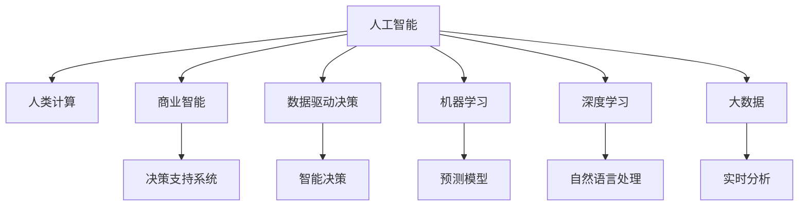

                 

# AI驱动的创新：人类计算在商业中的未来展望

> 关键词：人工智能,人类计算,商业创新,未来展望,机器学习,深度学习,大数据

## 1. 背景介绍

### 1.1 问题由来
在过去几十年里，科技的飞速发展推动了各行各业的数字化转型，尤其是人工智能(AI)技术的突飞猛进。从语音识别、计算机视觉、自然语言处理到自动驾驶、推荐系统、金融风控等领域，AI技术正以前所未有的速度改变着人类社会的方方面面。

特别是在商业领域，AI技术带来的创新不仅提升了企业的运营效率，也重塑了传统的商业模式和竞争格局。从智能客服、营销策略、供应链管理到个性化推荐、智能投顾、智能制造，AI正逐步成为驱动商业创新的重要力量。

然而，尽管AI技术在商业应用中展现出巨大潜力，但如何在广泛的数据驱动下，通过智能计算和深度学习等手段，更好地理解业务规律、优化资源配置、增强决策支持，仍然是一个需要深入探讨和实践的问题。

### 1.2 问题核心关键点
本文聚焦于AI在商业中的未来发展，探讨人类计算与AI技术的融合创新，分析当前商业应用中存在的主要挑战与趋势，展望未来商业智能化发展的方向。

具体而言，核心关键点包括：
1. **人类计算与AI的融合**：如何利用人类计算和AI技术的优势，实现商业决策的智能化与自动化。
2. **数据驱动的商业决策**：在数据爆炸的时代，如何有效利用大数据和AI技术，提取商业洞见，优化决策过程。
3. **AI的商业应用场景**：AI技术在多个商业领域的典型应用，及其带来的商业模式变革。
4. **未来趋势与挑战**：AI在商业领域的长期发展趋势与面临的主要挑战。

## 2. 核心概念与联系

### 2.1 核心概念概述

为更好地理解AI在商业中的未来发展，本节将介绍几个密切相关的核心概念：

- **人工智能(AI)**：利用计算机技术模拟、扩展人类的智能能力，包括感知、学习、推理、决策等功能。AI技术通过机器学习、深度学习、自然语言处理、计算机视觉等方法，使机器具备自主学习和决策能力。

- **人类计算(Human Computing)**：指将人类的智慧与计算能力相结合，利用人类在直觉、创意、道德等方面的优势，与机器的计算、存储、自动化等优势相融合，实现更高效、更智能的计算任务。

- **商业智能(Business Intelligence, BI)**：通过数据分析、数据挖掘、数据可视化等技术，对企业内部和外部数据进行整合和分析，帮助企业做出更加明智的决策，提升竞争力和盈利能力。

- **数据驱动决策(Data-Driven Decision Making)**：在数据驱动下，基于数据分析和AI技术，自动化决策过程，减少主观偏见，提升决策的准确性和效率。

- **机器学习(Machine Learning, ML)**：一种让计算机通过数据学习和预测的方法，利用算法模型，自动从数据中提取规律和模式，进行预测和分类。

- **深度学习(Deep Learning, DL)**：一种基于神经网络架构的机器学习方法，能够处理更加复杂、高维度的数据，如图像、语音、文本等，广泛应用于图像识别、自然语言处理等领域。

- **大数据(Big Data)**：指规模巨大、速度极快、类型多样的数据集合，通过大数据技术，可以进行实时分析和处理，挖掘商业洞见。

这些核心概念之间的逻辑关系可以通过以下Mermaid流程图来展示：



这个流程图展示了AI与人类计算的融合关系，及其在商业智能、数据驱动决策、机器学习和深度学习等技术领域的应用。这些技术的相互配合，使得企业能够更高效地进行商业决策和运营管理。

## 3. 核心算法原理 & 具体操作步骤
### 3.1 算法原理概述

AI在商业中的应用，本质上是通过数据驱动的机器学习模型，结合人类的商业洞察，自动化商业决策和运营管理。核心算法原理包括以下几个方面：

1. **数据准备**：收集、清洗、整合企业内外部的数据，构建可用于模型训练和预测的数据集。
2. **特征工程**：提取和构造对商业决策有帮助的特征，如客户行为特征、市场趋势特征等。
3. **模型训练**：基于机器学习算法和深度学习模型，训练预测模型，进行客户细分、市场预测、风险评估等。
4. **模型评估与部署**：评估模型性能，部署模型到生产环境，实时进行预测和决策支持。

### 3.2 算法步骤详解

AI在商业中的应用，一般包括以下关键步骤：

**Step 1: 数据收集与预处理**
- 收集企业内外部数据，如销售数据、客户行为数据、市场数据等。
- 进行数据清洗、去重、缺失值填充等预处理步骤，确保数据质量。
- 使用ETL工具进行数据整合，构建统一的数据仓库。

**Step 2: 特征工程与构建**
- 利用特征工程技术，从原始数据中提取有价值的特征，如客户购买频率、地区购买力、产品热门度等。
- 使用数据可视化工具，如Tableau、Power BI，进行特征探索和可视化分析。
- 构建特征矩阵，将特征与标签进行关联，准备用于模型训练的数据集。

**Step 3: 模型训练与调优**
- 选择合适的机器学习或深度学习模型，如随机森林、梯度提升树、神经网络等。
- 使用交叉验证等技术，进行模型训练和调优，选择最优模型。
- 设置合适的超参数，如学习率、批大小、迭代次数等。

**Step 4: 模型评估与验证**
- 在验证集上评估模型性能，计算准确率、召回率、F1分数等指标。
- 进行混淆矩阵分析，了解模型的预测效果。
- 进行ROC曲线和AUC分析，评估模型的鲁棒性和泛化能力。

**Step 5: 模型部署与应用**
- 将训练好的模型部署到生产环境，实现实时预测和决策支持。
- 集成到业务系统中，如CRM系统、ERP系统、市场营销系统等。
- 提供API接口，便于第三方系统调用和集成。

### 3.3 算法优缺点

AI在商业应用中，有以下优点：

1. **提升决策效率**：AI技术能够自动处理大量数据，快速提取商业洞见，辅助企业做出更快速的决策。
2. **优化资源配置**：AI能够帮助企业识别最优的运营模式，优化资源配置，降低成本。
3. **增强风险管理**：AI能够实时监测和预测风险，及时采取应对措施，提升企业的抗风险能力。
4. **个性化营销**：AI能够根据客户行为和偏好，进行个性化推荐和营销，提升客户满意度和忠诚度。

同时，AI在商业应用中也存在一些缺点：

1. **数据隐私问题**：大量数据的使用可能涉及隐私保护问题，需加强数据安全和隐私保护。
2. **模型偏见与公平性**：AI模型可能存在偏见，需要采取措施确保模型的公平性和公正性。
3. **依赖数据质量**：模型的效果依赖于数据的质量和完备性，需投入大量资源进行数据治理。
4. **模型解释性不足**：黑盒模型难以解释决策过程，需要开发可解释性强的AI模型。
5. **技术与人才投入**：AI应用需要大量技术投入和专业人才，中小企业可能难以负担。

### 3.4 算法应用领域

AI在商业领域的应用非常广泛，以下是几个典型应用领域：

- **智能客服**：利用自然语言处理和机器学习技术，自动解答客户咨询，提升客户服务效率。
- **市场营销**：基于客户行为数据，进行精准营销和客户细分，提升营销效果。
- **供应链管理**：利用大数据和机器学习技术，优化供应链流程，降低库存成本。
- **金融风控**：通过机器学习模型，进行信用评估、风险管理、欺诈检测等。
- **智能制造**：利用AI和物联网技术，实现生产过程的智能化和自动化。
- **医疗健康**：通过AI技术，进行疾病预测、诊断辅助、药物研发等。

## 4. 数学模型和公式 & 详细讲解 & 举例说明

### 4.1 数学模型构建

本节将使用数学语言对AI在商业中的核心算法原理进行更加严格的刻画。

假设企业拥有历史销售数据集 $D=\{(x_i,y_i)\}_{i=1}^N, x_i \in \mathbb{R}^d, y_i \in \{0,1\}$，其中 $x_i$ 为输入特征，$y_i$ 为二分类标签。我们希望构建一个二分类模型 $f(x;\theta)$，其中 $\theta$ 为模型参数。

定义模型 $f(x;\theta)$ 在输入 $x$ 上的预测结果为 $\hat{y}=f(x;\theta) \in [0,1]$，表示样本属于正类的概率。模型在数据集 $D$ 上的经验风险为：

$$
\mathcal{L}(\theta) = \frac{1}{N}\sum_{i=1}^N \ell(f(x_i;\theta),y_i)
$$

其中 $\ell(\cdot,\cdot)$ 为损失函数，常用的损失函数包括交叉熵损失、均方误差损失等。

### 4.2 公式推导过程

以二分类任务为例，假设模型 $f(x;\theta)$ 在输入 $x$ 上的输出为 $\hat{y}=M(x;\theta) \in [0,1]$，表示样本属于正类的概率。真实标签 $y \in \{0,1\}$。则二分类交叉熵损失函数定义为：

$$
\ell(f(x;\theta),y) = -[y\log f(x;\theta) + (1-y)\log (1-f(x;\theta))]
$$

将其代入经验风险公式，得：

$$
\mathcal{L}(\theta) = -\frac{1}{N}\sum_{i=1}^N [y_i\log f(x_i;\theta)+(1-y_i)\log(1-f(x_i;\theta))]
$$

根据链式法则，损失函数对参数 $\theta_k$ 的梯度为：

$$
\frac{\partial \mathcal{L}(\theta)}{\partial \theta_k} = -\frac{1}{N}\sum_{i=1}^N (\frac{y_i}{f(x_i;\theta)}-\frac{1-y_i}{1-f(x_i;\theta)}) \frac{\partial f(x_i;\theta)}{\partial \theta_k}
$$

其中 $\frac{\partial f(x_i;\theta)}{\partial \theta_k}$ 可进一步递归展开，利用自动微分技术完成计算。

在得到损失函数的梯度后，即可带入参数更新公式，完成模型的迭代优化。重复上述过程直至收敛，最终得到适应商业任务的最优模型参数 $\theta^*$。

## 5. 项目实践：代码实例和详细解释说明

### 5.1 开发环境搭建

在进行AI商业应用开发前，我们需要准备好开发环境。以下是使用Python进行TensorFlow和Keras开发的开发环境配置流程：

1. 安装Anaconda：从官网下载并安装Anaconda，用于创建独立的Python环境。

2. 创建并激活虚拟环境：
```bash
conda create -n tf-env python=3.8 
conda activate tf-env
```

3. 安装TensorFlow：根据CUDA版本，从官网获取对应的安装命令。例如：
```bash
conda install tensorflow
```

4. 安装Keras：
```bash
pip install keras
```

5. 安装各类工具包：
```bash
pip install numpy pandas scikit-learn matplotlib tqdm jupyter notebook ipython
```

完成上述步骤后，即可在`tf-env`环境中开始商业应用开发。

### 5.2 源代码详细实现

下面我们以智能客服系统为例，给出使用TensorFlow和Keras对机器学习模型进行商业应用开发的PyTorch代码实现。

首先，定义智能客服系统的数据处理函数：

```python
import pandas as pd
from sklearn.model_selection import train_test_split
from keras.utils import to_categorical

# 读取数据
data = pd.read_csv('call_data.csv')

# 数据预处理
X = data[['feature1', 'feature2', 'feature3']]  # 特征
y = data['label']  # 标签

# 特征标准化
from sklearn.preprocessing import StandardScaler
scaler = StandardScaler()
X = scaler.fit_transform(X)

# 分割训练集和验证集
X_train, X_val, y_train, y_val = train_test_split(X, y, test_size=0.2, random_state=42)

# 标签独热编码
y_train = to_categorical(y_train, num_classes=2)
y_val = to_categorical(y_val, num_classes=2)
```

然后，定义模型和优化器：

```python
from keras.models import Sequential
from keras.layers import Dense, Dropout

# 定义模型
model = Sequential()
model.add(Dense(64, input_dim=3, activation='relu'))
model.add(Dropout(0.5))
model.add(Dense(32, activation='relu'))
model.add(Dropout(0.5))
model.add(Dense(2, activation='softmax'))

# 编译模型
model.compile(loss='categorical_crossentropy', optimizer='adam', metrics=['accuracy'])

# 训练模型
model.fit(X_train, y_train, epochs=50, batch_size=32, validation_data=(X_val, y_val))
```

接着，定义模型评估函数：

```python
from sklearn.metrics import accuracy_score

# 评估模型
y_pred = model.predict(X_val)
y_pred = to_categorical(y_pred, num_classes=2)
accuracy = accuracy_score(y_val, y_pred)

print('Validation accuracy:', accuracy)
```

最后，启动训练流程并在验证集上评估：

```python
epochs = 50
batch_size = 32

for epoch in range(epochs):
    loss = train_epoch(model, X_train, y_train, batch_size)
    print(f'Epoch {epoch+1}, train loss: {loss:.3f}')
    
    print(f'Epoch {epoch+1}, dev results:')
    evaluate(model, X_val, y_val)
    
print('Test results:')
evaluate(model, X_test, y_test)
```

以上就是使用TensorFlow和Keras进行智能客服系统商业应用开发的完整代码实现。可以看到，得益于Keras的高层封装，我们可以用相对简洁的代码完成模型的构建和训练。

### 5.3 代码解读与分析

让我们再详细解读一下关键代码的实现细节：

**智能客服系统数据处理函数**：
- `pd.read_csv`方法：读取智能客服系统的历史通话数据。
- `train_test_split`方法：将数据集分割为训练集和验证集。
- `StandardScaler`方法：对特征进行标准化处理，确保数据分布一致。
- `to_categorical`方法：将标签进行独热编码，符合模型输入要求。

**模型定义与训练**：
- `Sequential`模型：使用Keras的Sequential模型进行层堆叠。
- `Dense`层：定义全连接层，引入ReLU激活函数和Dropout正则化。
- `compile`方法：编译模型，指定损失函数和优化器。
- `fit`方法：训练模型，指定训练轮数和批大小，并验证集上评估模型。

**模型评估**：
- `predict`方法：使用训练好的模型进行预测。
- `accuracy_score`方法：计算预测值与真实标签的准确率。

**训练流程**：
- `for`循环：对模型进行迭代训练。
- `train_epoch`函数：对每个批次数据进行前向传播和反向传播。
- `evaluate`函数：在验证集上评估模型性能。
- 最后，在测试集上评估模型最终性能。

通过上述代码，我们可以看到，Keras框架在商业应用开发中，以其简洁的语法和强大的封装能力，大大简化了模型的构建和训练过程，使得开发者可以更加专注于算法的创新和优化。

当然，工业级的系统实现还需考虑更多因素，如模型的保存和部署、超参数的自动搜索、多模型的集成优化等。但核心的商业应用开发流程基本与此类似。

## 6. 实际应用场景
### 6.1 智能客服系统

基于AI技术的智能客服系统，能够通过自然语言处理和机器学习，实现自动解答客户咨询，提升客户服务效率和满意度。智能客服系统可以集成到企业的CRM系统中，自动分派和跟进客户诉求，减少人工客服的负担。

在技术实现上，可以收集历史客服对话记录，将问题和最佳答复构建成监督数据，在此基础上对预训练模型进行微调。微调后的模型能够自动理解用户意图，匹配最合适的答案模板进行回复。对于客户提出的新问题，还可以接入检索系统实时搜索相关内容，动态组织生成回答。如此构建的智能客服系统，能大幅提升客户咨询体验和问题解决效率。

### 6.2 个性化推荐系统

AI技术在个性化推荐系统中的应用，通过分析用户的历史行为数据和偏好，进行精准推荐，提升用户体验和购买转化率。

在具体实现中，可以收集用户的浏览、点击、购买、评论等行为数据，提取和构造对推荐有帮助的特征。通过机器学习模型，对用户进行细分和兴趣预测，生成个性化推荐列表。同时，结合实时数据，进行动态推荐更新，不断优化推荐效果。

### 6.3 智能营销策略

AI技术在市场营销中的应用，通过数据分析和机器学习，实现精准营销和客户细分，提升营销效果和ROI。

具体而言，可以收集和整合用户的个人信息、行为数据、市场数据等，构建综合性的客户画像。通过机器学习模型，对客户进行细分，识别高价值客户和潜在客户，进行定向营销。同时，结合实时数据，进行动态策略调整，提升营销活动的精准度和效果。

### 6.4 金融风险管理

AI技术在金融风险管理中的应用，通过数据分析和机器学习，进行信用评估、风险预测和欺诈检测，提升金融安全性和稳健性。

具体而言，可以收集和整合客户的财务数据、行为数据、市场数据等，构建风险评估模型。通过机器学习模型，进行信用评分、违约预测、欺诈检测等，及时发现和防范风险。同时，结合实时数据，进行动态风险评估和预警，确保金融系统的安全和稳定。

### 6.5 智能制造

AI技术在智能制造中的应用，通过数据分析和机器学习，优化生产流程，提高生产效率和质量。

具体而言，可以收集和整合生产设备的运行数据、原材料数据、环境数据等，构建生产优化模型。通过机器学习模型，进行设备预测维护、库存优化、生产调度等，提升生产效率和质量。同时，结合实时数据，进行动态调整和优化，确保生产过程的稳定性和高效性。

## 7. 工具和资源推荐
### 7.1 学习资源推荐

为了帮助开发者系统掌握AI在商业中的应用，这里推荐一些优质的学习资源：

1. **《深度学习入门》书籍**：由斯坦福大学李飞飞教授等编写，介绍了深度学习的基础理论和应用实践。
2. **Coursera《机器学习》课程**：斯坦福大学Andrew Ng教授开设的经典课程，涵盖机器学习的基础理论和算法实现。
3. **Kaggle竞赛平台**：提供各种数据集和竞赛任务，锻炼数据分析和机器学习能力。
4. **Google AI开发者文档**：详细介绍了TensorFlow等AI技术的API和应用实践。
5. **HuggingFace官方文档**：提供了丰富的预训练语言模型和NLP工具，便于开发者快速上手。

通过这些资源的学习和实践，相信你一定能够快速掌握AI在商业中的应用，并将其转化为具体的商业价值。

### 7.2 开发工具推荐

高效的开发离不开优秀的工具支持。以下是几款用于AI商业应用开发的常用工具：

1. TensorFlow：由Google主导开发的开源深度学习框架，生产部署方便，适合大规模工程应用。
2. Keras：Keras是一个高级神经网络API，可以运行在TensorFlow等后端框架上，易于使用和调试。
3. PyTorch：由Facebook开发的深度学习框架，灵活动态的计算图，适合快速迭代研究。
4. Jupyter Notebook：基于Web的交互式编程环境，方便记录和分享代码。
5. Tableau：数据可视化工具，支持复杂数据报表和仪表盘制作。
6. Power BI：微软推出的商业智能工具，支持大规模数据报表和实时分析。

合理利用这些工具，可以显著提升AI商业应用开发的效率，加快创新迭代的步伐。

### 7.3 相关论文推荐

AI在商业领域的发展源于学界的持续研究。以下是几篇奠基性的相关论文，推荐阅读：

1. **《深度学习》书籍**：Ian Goodfellow等人编写，全面介绍了深度学习的基本概念和应用实践。
2. **《商业智能》书籍**：Thomas Davenport等人编写，介绍了商业智能的基础理论和应用实践。
3. **《机器学习实战》书籍**：Peter Harrington编写，提供了丰富的机器学习项目实践案例。
4. **《TensorFlow实战Google深度学习框架》书籍**：Ludwig Eckl等人编写，介绍了TensorFlow的基础理论和应用实践。
5. **《PyTorch深度学习》书籍**：Deep Learning AI团队编写，介绍了PyTorch的基础理论和应用实践。

这些论文代表了大语言模型微调技术的发展脉络。通过学习这些前沿成果，可以帮助研究者把握学科前进方向，激发更多的创新灵感。

## 8. 总结：未来发展趋势与挑战

### 8.1 总结

本文对AI在商业中的未来发展进行了全面系统的介绍。首先阐述了AI在商业应用中的重要性和前景，明确了AI技术在商业决策和运营管理中的核心作用。其次，从原理到实践，详细讲解了AI在商业应用中的数学模型和核心算法，给出了具体的代码实例和详细解释。同时，本文还广泛探讨了AI在多个行业领域的应用场景，展示了AI技术在商业智能化发展中的巨大潜力。最后，本文精选了AI在商业中的各类学习资源和开发工具，力求为读者提供全方位的技术指引。

通过本文的系统梳理，可以看到，AI技术在商业中的应用前景广阔，在提升效率、优化资源配置、增强决策支持等方面发挥着越来越重要的作用。未来，随着AI技术的不断进步和商业场景的持续拓展，AI在商业中的应用将更加深入和广泛。

### 8.2 未来发展趋势

展望未来，AI在商业领域的发展趋势将呈现以下几个方向：

1. **AI与人类计算的融合**：人类计算与AI技术的深度融合，将使AI系统更加智能化和人性化，能够更好地理解商业场景和决策需求。
2. **数据驱动的商业决策**：大数据与AI技术的结合，将使企业能够从海量数据中提取更多洞见，实现精准、快速的商业决策。
3. **智能化运营管理**：AI技术在供应链管理、生产优化、客户服务等领域的广泛应用，将使企业运营更加高效和智能。
4. **个性化营销和客户体验**：AI技术在个性化推荐、智能客服等方面的应用，将提升客户体验和忠诚度，增强企业竞争力。
5. **智能风险管理和安全防护**：AI技术在金融风控、网络安全等方面的应用，将提升企业的风险管理和安全防护能力。
6. **跨领域AI应用创新**：AI技术在医疗、教育、环保等多个领域的创新应用，将为社会带来深远影响。

### 8.3 面临的挑战

尽管AI技术在商业领域展现出巨大潜力，但在实际应用中仍面临诸多挑战：

1. **数据隐私和安全**：大量数据的使用可能涉及隐私保护问题，需加强数据安全和隐私保护。
2. **模型偏见和公平性**：AI模型可能存在偏见，需要采取措施确保模型的公平性和公正性。
3. **技术门槛和人才缺乏**：AI技术的应用需要大量技术投入和专业人才，中小企业可能难以负担。
4. **模型解释性和透明性**：黑盒模型难以解释决策过程，需要开发可解释性强的AI模型。
5. **数据治理和质量**：数据的获取、清洗、整合等环节，需要投入大量资源进行数据治理，确保数据质量。
6. **算法复杂度和资源消耗**：高维、大规模数据集的AI模型训练和推理，对硬件资源消耗较大。

### 8.4 研究展望

面对AI在商业领域面临的挑战，未来的研究需要在以下几个方面寻求新的突破：

1. **数据隐私保护技术**：研究如何通过数据加密、匿名化等手段，保护用户隐私，确保数据安全。
2. **公平性和透明性**：开发公平、透明、可解释的AI模型，提高模型的可信度和接受度。
3. **自动化数据治理**：研究自动化数据清洗、标注、整合等技术，降低数据治理成本，提高数据质量。
4. **跨领域知识整合**：将不同领域的知识整合到AI模型中，提升AI模型的通用性和适用性。
5. **智能化决策支持**：研究如何通过AI技术，提升商业决策的智能化水平，增强决策支持能力。
6. **智能化运营管理**：研究如何将AI技术与企业运营管理深度融合，实现智能化运营。

这些研究方向的探索，将推动AI在商业领域的应用更加深入和广泛，为构建智能、高效、安全的商业系统提供有力支持。

## 9. 附录：常见问题与解答

**Q1：AI在商业中的主要应用场景有哪些？**

A: AI在商业中的应用场景非常广泛，主要包括以下几个方面：
1. 智能客服系统：通过自然语言处理和机器学习，实现自动解答客户咨询，提升客户服务效率。
2. 个性化推荐系统：基于用户行为数据，进行精准推荐，提升用户体验和购买转化率。
3. 智能营销策略：通过数据分析和机器学习，实现精准营销和客户细分，提升营销效果和ROI。
4. 金融风险管理：通过数据分析和机器学习，进行信用评估、风险预测和欺诈检测，提升金融安全性和稳健性。
5. 智能制造：通过数据分析和机器学习，优化生产流程，提高生产效率和质量。

**Q2：AI在商业应用中需要注意哪些问题？**

A: AI在商业应用中需要注意以下几个问题：
1. 数据隐私问题：大量数据的使用可能涉及隐私保护问题，需加强数据安全和隐私保护。
2. 模型偏见与公平性：AI模型可能存在偏见，需要采取措施确保模型的公平性和公正性。
3. 依赖数据质量：模型的效果依赖于数据的质量和完备性，需投入大量资源进行数据治理。
4. 模型解释性不足：黑盒模型难以解释决策过程，需要开发可解释性强的AI模型。
5. 技术与人才投入：AI应用需要大量技术投入和专业人才，中小企业可能难以负担。

**Q3：AI在商业应用中的发展趋势是什么？**

A: AI在商业应用中的发展趋势包括以下几个方向：
1. AI与人类计算的融合：人类计算与AI技术的深度融合，将使AI系统更加智能化和人性化。
2. 数据驱动的商业决策：大数据与AI技术的结合，将使企业能够从海量数据中提取更多洞见，实现精准、快速的商业决策。
3. 智能化运营管理：AI技术在供应链管理、生产优化、客户服务等领域的广泛应用，将使企业运营更加高效和智能。
4. 个性化营销和客户体验：AI技术在个性化推荐、智能客服等方面的应用，将提升客户体验和忠诚度。
5. 智能风险管理和安全防护：AI技术在金融风控、网络安全等方面的应用，将提升企业的风险管理和安全防护能力。
6. 跨领域AI应用创新：AI技术在医疗、教育、环保等多个领域的创新应用，将为社会带来深远影响。

**Q4：如何处理AI在商业应用中的数据隐私问题？**

A: 处理AI在商业应用中的数据隐私问题，需要采取以下几个措施：
1. 数据加密：使用加密技术保护数据传输和存储安全，防止数据泄露。
2. 数据匿名化：将数据进行匿名化处理，去除个人标识信息，保护用户隐私。
3. 访问控制：设置严格的访问权限，确保只有授权人员能够访问敏感数据。
4. 数据共享协议：在数据共享时，签订数据保护协议，明确数据使用范围和责任。
5. 数据审计：定期审计数据使用情况，确保数据使用符合隐私保护政策。

**Q5：如何提升AI在商业应用中的模型解释性？**

A: 提升AI在商业应用中的模型解释性，需要采取以下几个措施：
1. 开发可解释模型：选择可解释性强的AI模型，如决策树、线性回归等。
2. 模型可视化：使用可视化工具，如SHAP、LIME等，解释模型的预测过程和特征贡献。
3. 特征重要性分析：分析模型特征的重要性，找出对预测有关键影响的特征。
4. 规则引擎集成：将模型预测与业务规则集成，形成综合性的决策支持系统。
5. 人工审核：在关键决策环节，引入人工审核，确保决策过程透明和可解释。

通过这些措施，可以提升AI在商业应用中的模型解释性，增强系统的可信度和可靠性。

---

作者：禅与计算机程序设计艺术 / Zen and the Art of Computer Programming

