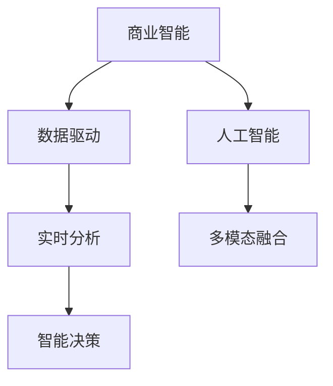

                 

# AI驱动的创新：人类计算在商业中的潜力

> 关键词：人工智能,商业智能,数据驱动,计算效率,决策支持,未来商业模式

## 1. 背景介绍

### 1.1 问题由来

在数字化时代，数据已经成为商业的核心资产。然而，随着数据规模的急剧膨胀，传统的计算和分析手段已经无法满足商业决策的需求。尤其是大数据、人工智能等新技术的涌现，使得数据的处理和分析变得更加复杂。

商业智能（Business Intelligence, BI）已经成为企业决策的重要工具，帮助企业从海量数据中提取价值，支持商业策略的制定和执行。然而，传统的商业智能系统依赖于人工操作和经验，效率低下，无法应对实时数据流的挑战。

人工智能（Artificial Intelligence, AI）技术的快速发展，尤其是深度学习和大规模计算的出现，为商业智能带来了新的突破。利用AI技术，可以从海量数据中自动发现隐藏的知识和规律，支持企业快速、准确地制定商业策略，提升决策效率和精准度。

### 1.2 问题核心关键点

AI驱动的商业智能，即利用人工智能技术对商业数据进行自动化处理和分析，以提高商业决策的效率和准确性。这种模式的核心关键点包括：

- 数据驱动：基于大数据和机器学习算法，从数据中提取商业洞察。
- 自动化处理：通过自动化流程，提高数据处理和分析的效率。
- 实时响应：能够实时处理和分析数据流，快速响应市场变化。
- 多模态融合：整合不同类型的数据（如文本、图像、视频等），提供更全面的商业洞察。
- 智能决策：通过机器学习模型，辅助决策者做出更加科学和合理的决策。

### 1.3 问题研究意义

AI驱动的商业智能对商业世界的意义重大：

1. 提升决策效率：通过自动化和智能化处理，大幅缩短数据处理和分析的时间，加速商业决策的制定。
2. 提高决策质量：利用机器学习模型从海量数据中挖掘出隐藏的模式和规律，辅助决策者做出更科学、更精准的决策。
3. 优化资源配置：通过数据分析，优化企业资源配置，提升生产效率和经济效益。
4. 增强市场竞争力：掌握市场动态，制定更具竞争力的商业策略，提高企业的市场份额和盈利能力。
5. 创造新的商业模式：通过数据驱动的智能决策，解锁新的商业机会，拓展市场空间。

## 2. 核心概念与联系

### 2.1 核心概念概述

为了更好地理解AI驱动的商业智能，本节将介绍几个密切相关的核心概念：

- 商业智能（Business Intelligence, BI）：通过数据分析和可视化，帮助企业做出更好的商业决策。
- 人工智能（Artificial Intelligence, AI）：利用机器学习、深度学习等技术，从数据中提取知识和规律。
- 数据驱动（Data-Driven）：基于数据进行决策，而非依赖经验和直觉。
- 实时分析（Real-Time Analytics）：对实时数据流进行分析和处理，快速响应市场变化。
- 多模态融合（Multimodal Fusion）：整合不同类型的数据，提供更全面的商业洞察。
- 智能决策（Intelligent Decision-Making）：通过机器学习模型，辅助决策者做出更科学的决策。

这些核心概念之间的逻辑关系可以通过以下Mermaid流程图来展示：



这个流程图展示了大语言模型的核心概念及其之间的关系：

1. 商业智能基于数据驱动，提供数据分析和决策支持。
2. 人工智能技术通过对数据的深度学习，提取知识规律。
3. 实时分析在数据驱动的基础上，快速响应市场变化。
4. 多模态融合整合不同类型的数据，提供全面的商业洞察。
5. 智能决策通过机器学习模型，辅助决策者做出科学决策。

这些概念共同构成了AI驱动商业智能的框架，使得企业能够利用数据驱动和人工智能技术，实现更高效、精准的商业决策。

## 3. 核心算法原理 & 具体操作步骤
### 3.1 算法原理概述

AI驱动的商业智能，本质上是利用机器学习算法对商业数据进行分析和处理，以支持商业决策的过程。其核心算法原理包括：

1. 数据预处理：对原始数据进行清洗、归一化、特征提取等预处理操作。
2. 模型训练：利用机器学习算法，如回归、分类、聚类等，对数据进行训练，提取知识规律。
3. 特征选择：从原始数据中提取最有用的特征，提高模型的泛化能力。
4. 模型评估：通过交叉验证、ROC曲线、AUC等指标，评估模型的性能。
5. 决策支持：将训练好的模型应用于实际数据，支持商业决策。

### 3.2 算法步骤详解

AI驱动的商业智能算法步骤主要包括以下几个关键步骤：

**Step 1: 数据收集与预处理**
- 收集企业内部和外部的相关数据，如销售数据、客户数据、市场数据等。
- 对数据进行清洗、去重、归一化等预处理操作，确保数据的质量和一致性。
- 对非结构化数据（如文本、图像）进行结构化处理，以便后续分析。

**Step 2: 特征工程**
- 根据业务需求，选择合适的特征进行提取。如销售数据中的日期、时间、销售量等。
- 对特征进行降维、转换等操作，提高模型的泛化能力。
- 利用机器学习算法，如主成分分析（PCA）、特征选择（Lasso、Ridge等）等，选择最有用的特征。

**Step 3: 模型选择与训练**
- 根据业务需求选择合适的机器学习模型，如线性回归、逻辑回归、决策树等。
- 利用训练数据，对模型进行训练，调整模型参数，提高模型的准确性。
- 使用交叉验证等技术，评估模型的性能，避免过拟合。

**Step 4: 实时数据处理**
- 利用流计算技术，对实时数据流进行处理和分析，支持实时决策。
- 对实时数据进行采样、窗口滑动等操作，确保处理效率和准确性。
- 利用机器学习算法，如时间序列分析、滑动窗口回归等，提取实时数据中的规律。

**Step 5: 决策支持与可视化**
- 将训练好的模型应用于实际数据，提供决策支持。
- 利用可视化工具，将分析结果直观展示，支持商业决策。
- 通过仪表盘、报表等形式，将分析结果呈现给决策者，辅助其制定决策。

### 3.3 算法优缺点

AI驱动的商业智能具有以下优点：
1. 自动化处理：自动化的数据处理和分析流程，大幅提升工作效率。
2. 提高决策质量：利用机器学习模型，从海量数据中挖掘隐藏的模式和规律，提高决策质量。
3. 实时响应：实时处理和分析数据流，快速响应市场变化。
4. 多模态融合：整合不同类型的数据，提供更全面的商业洞察。
5. 智能决策：通过机器学习模型，辅助决策者做出更科学的决策。

同时，该方法也存在一些缺点：
1. 数据质量要求高：数据预处理和清洗工作量大，对数据质量要求高。
2. 模型复杂度高：机器学习模型结构复杂，需要一定的专业知识。
3. 依赖算力：大规模数据的处理和分析需要高性能计算资源。
4. 数据隐私问题：商业数据涉及隐私，需注意数据安全和合规性。

尽管存在这些局限性，但就目前而言，AI驱动的商业智能方法在商业决策中已经得到了广泛应用，成为企业决策的重要手段。

### 3.4 算法应用领域

AI驱动的商业智能已经被广泛应用于各个行业领域，具体包括：

1. **零售业**：通过销售数据分析，优化商品推荐、库存管理、价格优化等。
2. **金融业**：利用风险评估模型，进行信用评估、欺诈检测、投资组合优化等。
3. **制造业**：通过生产数据分析，优化生产计划、设备维护、供应链管理等。
4. **服务业**：利用客户数据分析，进行个性化营销、客户关系管理、服务质量监控等。
5. **医疗业**：通过患者数据分析，进行疾病预测、诊断辅助、治疗方案优化等。
6. **物流业**：通过运输数据分析，优化物流路线、仓库管理、配送调度等。

除了这些常见领域外，AI驱动的商业智能还被创新性地应用于更多场景中，如智慧城市治理、智慧农业、智慧旅游等，为各个行业带来了新的机遇和挑战。

## 4. 数学模型和公式 & 详细讲解 & 举例说明
### 4.1 数学模型构建

AI驱动的商业智能中，常用的数学模型包括回归模型、分类模型、聚类模型等。以下以线性回归模型为例，说明其构建过程。

假设企业销售数据为 $(x,y)$，其中 $x$ 表示自变量（如日期、时间、销售量等），$y$ 表示因变量（如销售额、利润等）。

定义线性回归模型为 $y = \theta_0 + \theta_1 x_1 + \theta_2 x_2 + ... + \theta_n x_n$，其中 $\theta_0, \theta_1, \theta_2, ..., \theta_n$ 为模型参数。

目标是通过最小化损失函数，求解最优参数 $\theta$：

$$
\min_{\theta} \sum_{i=1}^n (y_i - (\theta_0 + \theta_1 x_{i1} + \theta_2 x_{i2} + ... + \theta_n x_{in}))^2
$$

### 4.2 公式推导过程

在线性回归模型中，利用梯度下降法求解最优参数 $\theta$。梯度下降法的更新公式为：

$$
\theta_k = \theta_k - \alpha \frac{1}{N} \sum_{i=1}^N (y_i - (\theta_0 + \theta_1 x_{i1} + \theta_2 x_{i2} + ... + \theta_n x_{in})) \frac{\partial (\theta_0 + \theta_1 x_{i1} + \theta_2 x_{i2} + ... + \theta_n x_{in}))}{\partial \theta_k}
$$

其中 $\alpha$ 为学习率，$N$ 为样本数量。

利用链式法则，可进一步得到：

$$
\frac{\partial (\theta_0 + \theta_1 x_{i1} + \theta_2 x_{i2} + ... + \theta_n x_{in}))}{\partial \theta_k} = x_{ik}
$$

将上式代入梯度下降法更新公式，可得：

$$
\theta_k = \theta_k - \alpha \frac{1}{N} \sum_{i=1}^N (y_i - (\theta_0 + \theta_1 x_{i1} + \theta_2 x_{i2} + ... + \theta_n x_{in})) x_{ik}
$$

通过迭代优化，不断更新参数 $\theta$，最小化损失函数，最终得到线性回归模型。

### 4.3 案例分析与讲解

以一家零售企业的销售额预测为例，通过线性回归模型进行预测：

假设企业收集了过去一年的销售数据，包含每日销售额 $y$ 和当日时间 $x_1$、季节性因素 $x_2$、促销活动 $x_3$ 等。

- **数据收集与预处理**：收集过去一年的销售数据，进行清洗、归一化等预处理操作，将数据转换为模型可用的格式。
- **特征工程**：选择时间 $x_1$、季节性因素 $x_2$、促销活动 $x_3$ 等特征，构建特征矩阵 $X$。
- **模型训练**：利用历史销售数据，通过梯度下降法训练线性回归模型，求得最优参数 $\theta$。
- **实时预测**：实时获取当天的日期、时间、季节性因素、促销活动等数据，通过线性回归模型计算出当天的销售额预测值 $y$。

通过线性回归模型，企业可以实时预测当天的销售额，优化库存管理和营销策略，提升销售效率。

## 5. 项目实践：代码实例和详细解释说明
### 5.1 开发环境搭建

在进行商业智能开发前，我们需要准备好开发环境。以下是使用Python进行TensorFlow开发的环境配置流程：

1. 安装Anaconda：从官网下载并安装Anaconda，用于创建独立的Python环境。

2. 创建并激活虚拟环境：
```bash
conda create -n tf-env python=3.8 
conda activate tf-env
```

3. 安装TensorFlow：根据CUDA版本，从官网获取对应的安装命令。例如：
```bash
conda install tensorflow -c pytorch -c conda-forge
```

4. 安装各类工具包：
```bash
pip install numpy pandas scikit-learn matplotlib tqdm jupyter notebook ipython
```

完成上述步骤后，即可在`tf-env`环境中开始商业智能项目的开发。

### 5.2 源代码详细实现

下面我们以零售业销售额预测为例，给出使用TensorFlow进行线性回归的PyTorch代码实现。

首先，定义数据处理函数：

```python
import tensorflow as tf
import numpy as np

def load_data(filename):
    with open(filename, 'r') as f:
        data = f.readlines()
    data = np.array([x.split(',') for x in data])
    return data[:, 1::2], data[:, 0]

# 加载数据
X_train, y_train = load_data('train.csv')
X_test, y_test = load_data('test.csv')
```

然后，定义线性回归模型：

```python
def linear_regression(input_dim, output_dim):
    model = tf.keras.Sequential([
        tf.keras.layers.Dense(output_dim, input_dim=input_dim, activation='linear')
    ])
    return model

# 构建模型
input_dim = 3  # 时间、季节性因素、促销活动
output_dim = 1  # 销售额
model = linear_regression(input_dim, output_dim)
```

接着，定义损失函数和优化器：

```python
from tensorflow.keras.losses import MeanSquaredError
from tensorflow.keras.optimizers import SGD

# 定义损失函数
loss_fn = MeanSquaredError()

# 定义优化器
optimizer = SGD(learning_rate=0.01)
```

最后，执行模型训练和预测：

```python
# 定义训练集和测试集
train_dataset = tf.data.Dataset.from_tensor_slices((X_train, y_train))
test_dataset = tf.data.Dataset.from_tensor_slices((X_test, y_test))

# 定义批量大小
batch_size = 32

# 模型训练
model.compile(optimizer=optimizer, loss=loss_fn)
model.fit(train_dataset.shuffle(buffer_size=1000).batch(batch_size),
          validation_data=test_dataset.shuffle(buffer_size=1000).batch(batch_size),
          epochs=100)

# 模型预测
y_pred = model.predict(X_test)
```

以上就是使用TensorFlow进行线性回归模型的代码实现。可以看到，TensorFlow提供的高层次API使得模型的构建和训练过程变得非常简单。

### 5.3 代码解读与分析

让我们再详细解读一下关键代码的实现细节：

**load_data函数**：
- 读取CSV文件，并将数据转换为numpy数组。

**linear_regression函数**：
- 构建线性回归模型，包含一个全连接层，激活函数为线性函数。

**训练与预测流程**：
- 定义训练集和测试集，使用TensorFlow的Dataset API进行数据加载和预处理。
- 设置批量大小，使用模型编译函数进行模型训练，并使用测试集进行验证。
- 使用模型的predict函数进行预测，计算预测值。

## 6. 实际应用场景
### 6.1 零售业

AI驱动的商业智能在零售业中有着广泛的应用，帮助企业实现销售预测、库存管理、价格优化等。具体应用包括：

1. **销售预测**：通过历史销售数据，预测未来销售趋势，优化库存水平。
2. **价格优化**：利用客户行为数据分析，制定最优价格策略，提升销售额和利润率。
3. **库存管理**：实时监控库存状态，预测需求波动，优化采购和补货策略。
4. **客户分析**：分析客户购买行为和偏好，制定个性化营销策略，提升客户满意度。

### 6.2 金融业

AI驱动的商业智能在金融业中的应用主要集中在风险管理、客户服务和投资决策等方面：

1. **风险管理**：利用历史交易数据，预测市场风险和信用风险，制定风险控制策略。
2. **客户服务**：通过客户行为数据分析，提供个性化金融产品推荐，提升客户体验。
3. **投资决策**：利用市场数据和财经新闻，预测股票价格走势，辅助投资决策。

### 6.3 制造业

在制造业中，AI驱动的商业智能可以帮助企业实现生产计划优化、设备维护、供应链管理等：

1. **生产计划优化**：利用生产数据，预测生产瓶颈，优化生产计划，提升生产效率。
2. **设备维护**：通过设备传感器数据，预测设备故障，提前进行维护，减少停机时间。
3. **供应链管理**：利用市场和供应链数据，优化物流和库存管理，降低成本。

### 6.4 未来应用展望

随着AI驱动的商业智能技术的不断成熟，未来将在更多领域得到应用，带来新的商业机遇：

1. **智能客服**：利用AI技术，构建智能客服系统，提升客户体验和服务效率。
2. **智能制造**：通过AI驱动的商业智能，实现智能制造和柔性生产，提升生产效率和产品质量。
3. **智慧城市**：利用AI驱动的商业智能，构建智慧城市治理系统，提高城市管理效率和居民生活质量。
4. **智慧医疗**：通过AI驱动的商业智能，优化诊疗方案，提升医疗服务质量和效率。

## 7. 工具和资源推荐
### 7.1 学习资源推荐

为了帮助开发者系统掌握AI驱动的商业智能的理论基础和实践技巧，这里推荐一些优质的学习资源：

1. 《深度学习》书籍：Ian Goodfellow等著，全面介绍深度学习的基本概念和算法。
2. 《Python数据科学手册》书籍：Jake VanderPlas著，介绍Python在数据科学和机器学习中的应用。
3. 《TensorFlow实战》书籍：Shashank Singh等著，详细介绍TensorFlow的使用方法和最佳实践。
4. Coursera《机器学习》课程：Andrew Ng教授主讲，涵盖机器学习的基本理论和算法。
5. Udacity《深度学习专项》课程：涵盖深度学习、神经网络、优化算法等主题。

通过对这些资源的学习实践，相信你一定能够快速掌握AI驱动商业智能的精髓，并用于解决实际的商业问题。

### 7.2 开发工具推荐

高效的开发离不开优秀的工具支持。以下是几款用于AI驱动商业智能开发的常用工具：

1. TensorFlow：由Google主导开发的开源深度学习框架，生产部署方便，适合大规模工程应用。
2. PyTorch：基于Python的开源深度学习框架，灵活动态的计算图，适合快速迭代研究。
3. Scikit-learn：Python的机器学习库，提供丰富的机器学习算法和工具。
4. Jupyter Notebook：用于数据科学和机器学习的交互式开发环境，支持Python、R等多种语言。
5. Anaconda：用于创建和管理Python环境的工具，方便快速安装和部署AI工具。

合理利用这些工具，可以显著提升AI驱动商业智能的开发效率，加快创新迭代的步伐。

### 7.3 相关论文推荐

AI驱动的商业智能领域的研究源于学界的持续探索。以下是几篇奠基性的相关论文，推荐阅读：

1. "Deep Learning for Business: Data Science, Machine Learning, and Analytics with Python"书籍：Susan Hayward等著，介绍深度学习在商业应用中的基本概念和算法。
2. "Business Intelligence with Python"书籍：Eugene Babaev等著，介绍Python在商业智能中的应用。
3. "A Survey on Business Intelligence using Artificial Intelligence and Machine Learning"论文：Jayashree Rao等著，综述AI在商业智能中的应用。
4. "Data Mining and Statistical Learning"书籍：Tibshirani等著，介绍数据挖掘和统计学习的基本方法和算法。
5. "Artificial Intelligence for Business"书籍：Larry Robertson等著，介绍AI技术在商业中的具体应用。

这些论文代表了大语言模型微调技术的发展脉络。通过学习这些前沿成果，可以帮助研究者把握学科前进方向，激发更多的创新灵感。

## 8. 总结：未来发展趋势与挑战
### 8.1 研究成果总结

本文对AI驱动的商业智能进行了全面系统的介绍。首先阐述了AI驱动商业智能的研究背景和意义，明确了数据驱动、自动化处理、实时响应等关键点。其次，从原理到实践，详细讲解了AI驱动商业智能的数学模型和算法步骤，给出了具体的代码实现。同时，本文还广泛探讨了AI驱动商业智能在零售、金融、制造等多个行业领域的应用前景，展示了AI驱动商业智能的巨大潜力。

通过本文的系统梳理，可以看到，AI驱动的商业智能技术在商业决策中已经得到了广泛应用，成为企业决策的重要手段。未来，伴随AI驱动商业智能技术的不断演进，将进一步提升商业决策的效率和质量，推动商业智能的智能化发展。

### 8.2 未来发展趋势

展望未来，AI驱动的商业智能将呈现以下几个发展趋势：

1. 自动化程度提升：随着AI技术的不断成熟，自动化处理流程将更加智能化，提升决策效率和质量。
2. 实时响应能力增强：利用流计算和实时数据处理技术，支持实时决策，及时应对市场变化。
3. 多模态融合深入：整合不同类型的数据，提供更全面、更精准的商业洞察。
4. 智能决策能力提升：利用更先进、更复杂的机器学习算法，提升智能决策的准确性和科学性。
5. 行业应用拓展：在零售、金融、制造、医疗等多个领域，AI驱动的商业智能将带来新的商业机遇和挑战。

### 8.3 面临的挑战

尽管AI驱动的商业智能已经取得了瞩目成就，但在迈向更加智能化、普适化应用的过程中，仍面临以下挑战：

1. 数据隐私和安全：商业数据涉及隐私和敏感信息，如何保护数据安全和合规性，是一个重要的课题。
2. 数据质量和一致性：数据预处理和清洗工作量大，对数据质量和一致性要求高。
3. 模型复杂度：机器学习模型结构复杂，需要一定的专业知识。
4. 计算资源需求：大规模数据的处理和分析需要高性能计算资源。
5. 模型解释性：复杂的AI模型缺乏可解释性，难以理解和调试。

### 8.4 研究展望

面向未来，AI驱动的商业智能需要在以下几个方面寻求新的突破：

1. 提高数据质量和一致性：优化数据预处理流程，提高数据质量和一致性。
2. 简化模型结构：开发更高效、更轻量级的AI算法，提高模型的可解释性和可部署性。
3. 融合多模态数据：整合不同类型的数据，提供更全面的商业洞察。
4. 增强模型解释性：开发更易于理解和解释的AI模型，提高模型的可信度和实用性。
5. 结合业务需求：深入了解不同行业的业务需求，开发更具针对性的商业智能解决方案。

只有从数据、算法、业务等多个维度协同发力，才能真正实现AI驱动商业智能技术在各行业的广泛应用。相信随着学界和产业界的共同努力，这些挑战终将一一被克服，AI驱动的商业智能必将在构建智能商业决策系统中发挥重要作用。

## 9. 附录：常见问题与解答

**Q1：AI驱动的商业智能是否适用于所有行业？**

A: AI驱动的商业智能在大多数行业中都有广泛的应用，尤其是在数据密集型的领域。但某些行业，如农业、能源等，由于数据量和质量的原因，应用效果可能不如其他行业。

**Q2：AI驱动的商业智能如何提升决策效率？**

A: AI驱动的商业智能通过自动化和智能化处理，大幅提升数据处理和分析的速度，快速生成商业洞察，支持决策者快速做出决策。

**Q3：AI驱动的商业智能需要哪些计算资源？**

A: AI驱动的商业智能需要高性能计算资源，如GPU、TPU等。同时，还需要足够的数据存储空间和网络带宽。

**Q4：AI驱动的商业智能如何保护数据隐私？**

A: 数据隐私和安全是AI驱动商业智能的一个重要课题。需要采用数据加密、访问控制、审计记录等措施，确保数据安全。

**Q5：AI驱动的商业智能如何结合业务需求？**

A: 深入了解不同行业的业务需求，开发具有针对性的商业智能解决方案，将AI技术与业务需求紧密结合，提高商业智能的实用性和效果。

---

作者：禅与计算机程序设计艺术 / Zen and the Art of Computer Programming

