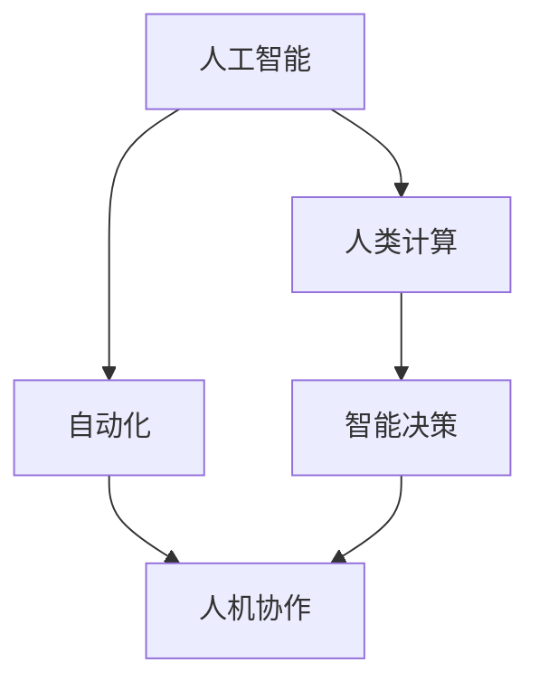

                 

# AI驱动的创新：人类计算在未来的工作

> 关键词：人工智能,人类计算,工作创新,未来技术,自动化,智能决策,人机协作,智能应用

## 1. 背景介绍

在过去的几十年中，人工智能（AI）技术迅猛发展，已经在许多领域产生了深远影响。从图像识别、自然语言处理到机器翻译、自动驾驶，AI的应用场景日益广泛。但与此同时，人类计算工作也面临着前所未有的挑战与机遇。本文将探讨AI在推动人类计算创新方面的重要性与未来发展方向。

### 1.1 问题由来

随着技术进步，越来越多的工作被机器所取代，这导致许多人面临职业转换的挑战。同时，AI也在赋予人们新的能力，能够更加高效、智能地完成工作。因此，如何在自动化和人类创新之间找到平衡，成为了一个重要议题。AI不仅能够完成重复性任务，还能通过数据分析、模式识别等能力，帮助人类在复杂任务中做出更好的决策。

### 1.2 问题核心关键点

AI与人类计算的未来结合涉及以下几个关键点：

- 自动化与决策辅助：AI能够执行许多日常工作，但人类仍然需要在高层次决策和创新性任务中扮演关键角色。
- 数据驱动的洞察力：AI能从大量数据中提取有价值的洞察，帮助人类做出更准确的判断。
- 人机协作：AI和人类在各自擅长的领域中各司其职，共同完成任务。
- 创造性思维：AI可以辅助人类进行创造性思维，生成新颖的解决方案。

这些关键点揭示了AI在推动人类计算创新中的核心作用。

### 1.3 问题研究意义

研究AI与人类计算的未来结合，对于提升工作效率、促进职业转型以及推动社会进步具有重要意义：

1. **提升效率**：通过自动化重复性工作，AI能够大幅提升工作效率，让人们有更多时间从事创造性和战略性任务。
2. **促进转型**：AI能够帮助劳动者从传统行业中转型，进入更具挑战性和创新性的领域。
3. **推动创新**：AI能够提供数据洞察和模式识别，帮助人类发现新的商业模式和技术突破。
4. **增强决策力**：AI可以辅助人类在复杂问题上进行决策，提高决策的准确性和效率。
5. **促进协作**：AI可以在不同角色和团队之间建立协作，提升整体创新能力。

## 2. 核心概念与联系

### 2.1 核心概念概述

要理解AI在人类计算中的作用，我们需要掌握以下几个核心概念：

- **人工智能**：通过算法和数据训练，能够执行人类任务的智能机器。
- **人类计算**：指人类在复杂问题解决和创新性任务中的思维和决策过程。
- **自动化**：利用技术自动执行某些任务，减少人类干预。
- **人机协作**：指AI和人类在共同完成任务时的协同工作。
- **智能决策**：利用AI提供的数据和分析，帮助人类做出更优的决策。

这些概念之间相互关联，共同构成了AI与人类计算的未来发展框架。

### 2.2 核心概念原理和架构的 Mermaid 流程图



该流程图展示了AI、自动化、人类计算、智能决策和人机协作之间的相互关系：

1. AI作为自动化工具，能够执行重复性任务，减少人类工作量。
2. 在自动化基础上，人类计算能够发挥其创造性和战略性思维，完成复杂任务。
3. 智能决策依赖于AI的数据分析和模式识别能力，辅助人类做出更好的决策。
4. 人机协作则强调AI和人类在各自擅长领域的协同工作，共同完成任务。

## 3. 核心算法原理 & 具体操作步骤

### 3.1 算法原理概述

基于AI的自动化和智能决策，可以显著提升工作效率和创新能力。其核心原理在于：

- **数据驱动的自动化**：通过数据分析和模式识别，AI能够自动执行某些任务。
- **智能决策支持**：AI能够提供数据洞察和预测，辅助人类做出更优的决策。

### 3.2 算法步骤详解

基于AI的自动化和智能决策可以分为以下步骤：

1. **数据收集**：从各种来源收集数据，包括历史数据、传感器数据、用户行为数据等。
2. **数据处理**：清洗、整理数据，进行特征提取，准备用于模型训练。
3. **模型训练**：使用机器学习算法，如深度学习、强化学习等，训练AI模型。
4. **模型部署**：将训练好的模型部署到实际应用中，执行自动化任务。
5. **智能决策**：在模型基础上，利用数据分析和模式识别，提供决策支持。

### 3.3 算法优缺点

基于AI的自动化和智能决策具有以下优点：

- **效率提升**：AI能够自动化执行重复性任务，大幅提升工作效率。
- **质量提升**：AI能够提供数据洞察和预测，提高决策的准确性。
- **成本降低**：通过自动化和智能决策，减少人工干预，降低成本。

但同时也存在以下缺点：

- **依赖数据**：AI的性能依赖于数据的质量和多样性。
- **技术复杂**：构建和维护AI系统需要较高的技术门槛。
- **伦理问题**：AI决策的透明性和可解释性仍需进一步研究。

### 3.4 算法应用领域

基于AI的自动化和智能决策在以下领域具有广泛应用：

- **制造业**：利用AI进行自动化生产、质量控制、设备维护等。
- **金融业**：利用AI进行风险评估、投资分析、欺诈检测等。
- **医疗业**：利用AI进行疾病预测、个性化治疗、药物研发等。
- **零售业**：利用AI进行库存管理、推荐系统、客户服务等。
- **物流业**：利用AI进行路径规划、货物追踪、需求预测等。

## 4. 数学模型和公式 & 详细讲解 & 举例说明

### 4.1 数学模型构建

基于AI的自动化和智能决策可以建模为以下过程：

$$
\text{Auto-decision} = \text{Data Collection} + \text{Data Processing} + \text{Model Training} + \text{Model Deployment} + \text{Intelligent Decision}
$$

其中，数据收集和处理是基础，模型训练是核心，模型部署和智能决策是应用。

### 4.2 公式推导过程

以推荐系统为例，推荐模型可以表示为：

$$
R_{item} = \mathbf{w} \cdot \phi_{item} + b
$$

其中，$R_{item}$ 为物品$i$的评分，$\mathbf{w}$ 为评分向量，$\phi_{item}$ 为物品$i$的特征向量，$b$ 为偏置项。

在模型训练中，通过最小化损失函数$\mathcal{L}$，更新模型参数$\mathbf{w}$和$b$：

$$
\mathbf{w} \leftarrow \mathbf{w} - \eta \nabla_{\mathbf{w}}\mathcal{L}
$$

其中，$\eta$ 为学习率，$\nabla_{\mathbf{w}}\mathcal{L}$ 为损失函数对评分向量的梯度。

### 4.3 案例分析与讲解

一个典型的应用案例是亚马逊的推荐系统。通过收集用户的浏览和购买数据，训练推荐模型，能够精准推荐用户感兴趣的商品，提升用户体验和销售额。

## 5. 项目实践：代码实例和详细解释说明

### 5.1 开发环境搭建

开发环境搭建包括：

1. 安装Python：使用Anaconda或Miniconda安装Python 3.8及以上版本。
2. 安装相关库：安装Pandas、Numpy、Scikit-Learn、TensorFlow等库。
3. 准备数据集：准备用于训练和测试的推荐系统数据集。
4. 设置环境：配置GPU加速，启动Jupyter Notebook环境。

### 5.2 源代码详细实现

以下是使用TensorFlow构建推荐系统的示例代码：

```python
import tensorflow as tf
from tensorflow.keras.layers import Input, Dense, Embedding, Add, Activation
from tensorflow.keras.models import Model

# 定义模型结构
user_input = Input(shape=(1,), name='user_input')
user_embedding = Embedding(1000, 16, name='user_embedding')(user_input)
item_input = Input(shape=(1,), name='item_input')
item_embedding = Embedding(1000, 16, name='item_embedding')(item_input)
concat = Add()([user_embedding, item_embedding])
output = Dense(1, activation='sigmoid')(concat)

# 定义模型并编译
model = Model(inputs=[user_input, item_input], outputs=output)
model.compile(optimizer='adam', loss='binary_crossentropy', metrics=['accuracy'])

# 训练模型
model.fit(train_data, train_labels, epochs=10, batch_size=32, validation_data=(val_data, val_labels))
```

### 5.3 代码解读与分析

该代码片段展示了如何使用TensorFlow构建一个基本的推荐系统模型。模型包含用户嵌入、物品嵌入、加法和输出层，使用Sigmoid激活函数进行二分类。模型训练使用Adam优化器和二元交叉熵损失函数，并监测准确率。

## 6. 实际应用场景

### 6.1 制造业

在制造业中，AI可以用于自动化生产、质量控制、设备维护等任务。通过传感器数据和机器视觉技术，AI可以实时监测生产线状态，预测设备故障，优化生产流程，减少人工干预。

### 6.2 金融业

金融业利用AI进行风险评估、投资分析、欺诈检测等。AI可以通过分析历史数据和市场趋势，预测股票价格，识别异常交易行为，辅助投资决策，提高风险管理能力。

### 6.3 医疗业

在医疗业，AI可以用于疾病预测、个性化治疗、药物研发等。通过分析患者数据和医疗记录，AI可以识别疾病风险，推荐个性化治疗方案，加速新药开发进程。

### 6.4 零售业

零售业利用AI进行库存管理、推荐系统、客户服务等。通过分析消费者行为数据，AI可以优化库存管理，个性化推荐商品，提升客户满意度。

### 6.5 物流业

物流业利用AI进行路径规划、货物追踪、需求预测等。通过分析交通和订单数据，AI可以优化配送路线，提高运输效率，预测需求高峰，减少物流成本。

## 7. 工具和资源推荐

### 7.1 学习资源推荐

1. **《深度学习》课程**：斯坦福大学Andrew Ng教授的深度学习课程，涵盖深度学习基础知识和应用。
2. **《Python for Data Analysis》书籍**：使用Python进行数据分析的经典书籍，适合初学者。
3. **TensorFlow官方文档**：TensorFlow官方文档，提供详细的使用指南和示例代码。
4. **Kaggle竞赛**：参加Kaggle数据科学竞赛，提升数据处理和模型构建能力。
5. **GitHub项目**：浏览GitHub上的开源项目，学习优秀代码和最佳实践。

### 7.2 开发工具推荐

1. **Jupyter Notebook**：开源的交互式笔记本环境，适合数据分析和模型构建。
2. **PyCharm**：功能强大的Python IDE，提供代码编写、调试、测试等功能。
3. **Anaconda**：Python科学计算平台，包含大量科学计算和数据分析库。
4. **AWS SageMaker**：亚马逊的云端AI平台，提供云服务和API，方便模型部署和调用。

### 7.3 相关论文推荐

1. **《深度学习》书籍**：Ian Goodfellow、Yoshua Bengio和Aaron Courville的深度学习经典教材。
2. **《机器学习》书籍**：Tom Mitchell的经典机器学习著作，涵盖基础理论和应用实例。
3. **《强化学习》书籍**：Richard Sutton和Andrew Barto的强化学习经典教材。
4. **《人工智能道德指南》**：探讨AI伦理和社会影响的书籍，帮助理解AI技术的潜在风险和挑战。

## 8. 总结：未来发展趋势与挑战

### 8.1 研究成果总结

本文介绍了AI在推动人类计算创新中的重要性与未来发展方向。通过自动化和智能决策，AI能够显著提升工作效率和创新能力，推动各行业的数字化转型。

### 8.2 未来发展趋势

未来AI与人类计算的发展趋势包括：

1. **自动化水平提升**：随着技术进步，更多复杂任务将实现自动化，减少人工干预。
2. **智能决策辅助**：AI将提供更精准的数据洞察和预测，辅助人类做出更优决策。
3. **人机协作深化**：AI和人类在各自擅长的领域中各司其职，共同完成任务。
4. **跨领域融合**：AI与其他技术（如物联网、区块链等）的深度融合，将带来更多创新应用。
5. **伦理与规范**：AI技术的发展需要遵循伦理规范，确保数据隐私和安全。

### 8.3 面临的挑战

尽管AI与人类计算的未来发展充满潜力，但也面临诸多挑战：

1. **数据隐私**：AI依赖大量数据，如何保护用户隐私是一个重要问题。
2. **模型透明性**：AI决策的透明性和可解释性仍需进一步研究。
3. **伦理问题**：AI在决策过程中可能产生偏见和歧视，需进行严格的伦理审查。
4. **技术门槛**：AI技术的构建和维护需要较高的技术门槛。
5. **计算资源**：大规模AI模型需要大量计算资源，资源分配和成本控制仍需优化。

### 8.4 研究展望

未来的研究应关注以下几个方向：

1. **隐私保护**：开发隐私保护技术，确保数据使用的透明性和安全性。
2. **模型可解释性**：提升AI模型的可解释性，帮助用户理解和信任AI决策。
3. **伦理规范**：建立AI伦理规范，确保AI技术的公平性和透明性。
4. **跨学科融合**：将AI与更多学科（如心理学、社会学等）进行交叉研究，提升AI的社会价值。
5. **技术普及**：推动AI技术向更多行业普及，提升各行业的数字化水平。

## 9. 附录：常见问题与解答

**Q1: AI如何影响未来工作？**

A: AI将取代许多重复性、机械化的工作，使人们有更多时间从事创新性、战略性任务。同时，AI能够辅助人类完成复杂任务，提高工作效率和质量。

**Q2: 如何平衡AI与人类计算的关系？**

A: 在复杂任务中，人类应发挥创造性和战略性思维，而AI则处理数据和重复性工作。人机协作能够充分发挥各自优势，共同完成任务。

**Q3: AI的伦理问题如何解决？**

A: 建立AI伦理规范，确保AI技术的公平性、透明性和可解释性。定期进行伦理审查，识别和纠正AI决策中的偏见和歧视。

**Q4: AI技术的普及有哪些障碍？**

A: 数据隐私、技术门槛、计算资源等问题仍是AI普及的障碍。需通过技术创新和政策支持，克服这些挑战。

**Q5: AI的未来发展方向是什么？**

A: AI的未来发展方向包括自动化水平提升、智能决策辅助、人机协作深化、跨领域融合等。同时，需关注隐私保护、伦理规范、技术普及等挑战。

---

作者：禅与计算机程序设计艺术 / Zen and the Art of Computer Programming

