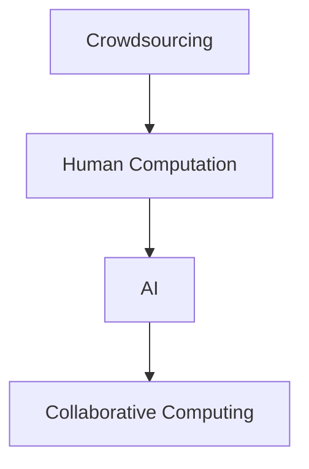

                 

## 1. 背景介绍

随着人工智能技术的快速发展和广泛应用，越来越多的研究者和企业将目光投向了利用AI驱动创新的新方向。其中一个重要领域就是众包（Crowdsourcing）与人类计算（Human Computation）的结合。本文将深入探讨这一主题，并详细阐述其在AI驱动创新中的作用与潜力。

### 1.1 问题由来

近年来，随着互联网和信息技术的飞速发展，众包和人类计算的概念逐渐引起人们的关注。众包是指将一些工作外包给大量非专业人员的在线工作平台，例如Amazon Mechanical Turk。而人类计算则更强调利用人类认知能力的独特优势，进行复杂的计算和分析任务，如Foldit和Foldamind等。

这两种方法结合AI，可以在大规模、复杂的问题解决中发挥出巨大的潜力。AI可以自动筛选和分类数据，自动化分析任务，而人类则可以在AI的辅助下，完成更复杂、更具创造性的工作。这种结合方式不仅提高了工作效率，也大大拓展了创新的边界。

### 1.2 问题核心关键点

本文聚焦于以下几个核心关键点：

- 众包与人类计算的概念和区别。
- AI在众包与人类计算中的作用。
- 如何将AI技术与人类优势相结合，实现创新。
- 面临的挑战与未来发展方向。

## 2. 核心概念与联系

### 2.1 核心概念概述

为了更好地理解众包与人类计算的结合方式，本节将介绍几个关键概念：

- **众包（Crowdsourcing）**：通过在线平台，将任务分发给非专业人员的群体，利用大规模、分布式的劳动力来解决问题。

- **人类计算（Human Computation）**：利用人类的认知能力进行复杂计算任务，通过设计巧妙的任务来引导人类完成。

- **人工智能（AI）**：通过机器学习、深度学习等算法，自动地从数据中学习规律，辅助人类完成任务。

- **协同计算（Collaborative Computing）**：利用人类的协作和互动来解决问题，与AI结合形成更为强大的计算能力。

这些概念之间的逻辑关系可以通过以下Mermaid流程图来展示：



这个流程图展示了众包、人类计算和AI之间的联系与互动：

1. 众包通过在线平台将任务分发给大量人员。
2. 人类计算通过巧妙的任务设计，引导人类完成复杂计算。
3. AI辅助人类完成工作，提升效率和准确性。
4. 协同计算将AI与人类协作相结合，形成更强大的计算能力。

## 3. 核心算法原理 & 具体操作步骤

### 3.1 算法原理概述

AI在众包与人类计算中的作用，主要体现在以下几个方面：

- **任务筛选与分类**：通过自动化的方式，AI可以高效地从大量任务中筛选出适合众包和人类计算的任务，并根据任务的复杂程度进行分类。

- **数据预处理**：AI可以对数据进行预处理，如去噪、归一化、特征提取等，确保数据质量，减少人为误差。

- **模型训练与优化**：利用机器学习算法，AI可以快速训练并优化模型，提高任务完成的效率和准确性。

- **结果分析与反馈**：AI可以对人类计算结果进行分析和评估，识别错误，并给出改进建议，形成闭环反馈。

### 3.2 算法步骤详解

基于上述原理，众包与人类计算的AI驱动创新一般包括以下几个关键步骤：

**Step 1: 任务定义与筛选**

- 确定任务类型与要求，定义明确的输出格式。
- 利用AI算法对任务进行筛选与分类，选择适合众包或人类计算的任务。

**Step 2: 数据准备与预处理**

- 收集、清洗、标注任务相关的数据，确保数据质量。
- 使用AI技术对数据进行预处理，如去噪、归一化、特征提取等。

**Step 3: 模型训练与优化**

- 选择合适的AI算法，如机器学习、深度学习等，进行模型训练。
- 通过调参和优化，提高模型的准确性和鲁棒性。

**Step 4: 协同计算与人类计算**

- 将任务拆分为多个子任务，分配给不同的人或团队完成。
- 利用AI技术辅助人类完成复杂任务，提高效率和准确性。
- 通过协同计算，利用人类的互动和协作，进一步提升任务完成的效果。

**Step 5: 结果评估与反馈**

- 使用AI技术对人类计算结果进行评估，识别错误和改进点。
- 反馈结果给人类工作者，进行必要的修改和优化。
- 形成闭环反馈机制，不断提升任务完成质量。

### 3.3 算法优缺点

AI在众包与人类计算中的作用，既有其优点，也存在一些缺点：

**优点**：

- 高效处理大规模任务：AI可以快速处理大量数据，筛选和分类任务，大幅提高工作效率。
- 提高任务完成质量：AI可以对数据进行预处理和优化，减少人为误差，提升任务完成质量。
- 促进协同计算：AI可以辅助人类进行复杂任务，并通过协同计算，利用人类的协作，形成更强大的计算能力。

**缺点**：

- 依赖数据质量：AI算法的有效性依赖于高质量的数据，数据噪音和偏差会影响结果。
- 复杂任务依赖人类：AI在处理复杂任务时，仍需人类工作者进行判断和决策。
- 需要持续优化：AI算法需要不断调整和优化，才能适应任务的变化和需求。

### 3.4 算法应用领域

AI驱动的众包与人类计算技术，已经在多个领域得到了应用，例如：

- **自然语言处理（NLP）**：利用AI筛选和分类文本数据，进行文本分析、情感分析、机器翻译等任务。
- **生物信息学**：利用AI筛选和分类生物数据，进行基因序列分析、蛋白质结构预测等任务。
- **金融分析**：利用AI筛选和分类金融数据，进行股票预测、风险评估等任务。
- **社交网络分析**：利用AI筛选和分类社交数据，进行用户行为分析、情感分析等任务。

这些应用展示了AI在众包与人类计算中的广泛前景和巨大潜力。

## 4. 数学模型和公式 & 详细讲解 & 举例说明

### 4.1 数学模型构建

为了更好地理解AI在众包与人类计算中的作用，我们将从数学模型角度进行详细讲解。

假设我们有一个众包任务，任务类型为分类，数据集为$D=\{(x_i,y_i)\}_{i=1}^N$，其中$x_i$为输入，$y_i$为输出标签。

任务筛选与分类的目标是找到最适合众包和人类计算的任务。可以通过以下步骤构建模型：

1. 定义任务完成质量指标：$Q(x,y)$，用于评估任务完成的质量。
2. 定义任务筛选函数：$S(x)$，用于判断任务是否适合众包或人类计算。
3. 定义任务分类函数：$C(x)$，用于将任务分类为简单、中等或复杂。

模型的目标是最小化任务完成质量指标，即：

$$
\min_{Q,S,C} \sum_{i=1}^N Q(x_i,y_i)
$$

### 4.2 公式推导过程

在任务筛选和分类后，进行数据预处理和模型训练。数据预处理的目标是减少噪音和偏差，提高数据质量。可以使用以下步骤：

1. 数据清洗：去除数据中的噪音和错误，确保数据完整性。
2. 数据归一化：对数据进行标准化处理，使数据分布一致。
3. 特征提取：从原始数据中提取有用的特征，提高模型性能。

数据预处理可以表示为：

$$
D' = F(D) = \{\tilde{x}_i\}_{i=1}^N
$$

其中$F$为预处理函数。

在进行模型训练时，可以使用机器学习算法，如支持向量机（SVM）、随机森林（Random Forest）等，对数据进行训练和优化。训练过程可以表示为：

$$
\theta = \arg\min_{\theta} L(D',y,\theta)
$$

其中$L$为损失函数，$\theta$为模型参数。

### 4.3 案例分析与讲解

以机器翻译任务为例，分析AI在众包与人类计算中的作用。

假设我们需要翻译一段英文文本$x$到中文，数据集为$D=\{(x_i,y_i)\}_{i=1}^N$。

1. **任务筛选与分类**：首先，利用AI算法对大量任务进行筛选和分类，选择适合众包和人类计算的任务。例如，使用文本分类算法，将文本按照语言类型和领域进行分类。

2. **数据预处理**：对数据进行清洗、归一化和特征提取，确保数据质量。例如，去除噪音和错误，进行文本分词和去除停用词。

3. **模型训练与优化**：使用神经网络算法，如LSTM、GRU等，进行模型训练和优化。训练过程中，利用AI技术进行调参和优化，提高模型准确性。

4. **协同计算与人类计算**：将翻译任务拆分为多个子任务，分配给不同的众包工作者或人类计算者完成。利用AI技术辅助人类工作者，提高翻译效率和准确性。例如，使用BLEU算法对翻译结果进行评估，并提供改进建议。

5. **结果评估与反馈**：使用AI技术对翻译结果进行评估，识别错误和改进点，形成闭环反馈机制。例如，利用BLEU算法和人工评审，对翻译结果进行评估，并给出改进建议。

## 5. 项目实践：代码实例和详细解释说明

### 5.1 开发环境搭建

在进行AI驱动的众包与人类计算项目实践前，我们需要准备好开发环境。以下是使用Python进行项目开发的环境配置流程：

1. 安装Anaconda：从官网下载并安装Anaconda，用于创建独立的Python环境。

2. 创建并激活虚拟环境：
```bash
conda create -n ai-env python=3.8 
conda activate ai-env
```

3. 安装必要的库：
```bash
conda install numpy scipy pandas matplotlib scikit-learn transformers
pip install tensorflow keras jupyter notebook ipython
```

4. 安装AWS CLI：
```bash
pip install awscli
```

完成上述步骤后，即可在`ai-env`环境中开始项目开发。

### 5.2 源代码详细实现

下面我们以机器翻译任务为例，给出使用Transformers库对BERT模型进行众包与人类计算的Python代码实现。

首先，定义机器翻译任务的数据处理函数：

```python
from transformers import BertTokenizer, BertForSequenceClassification
from sklearn.model_selection import train_test_split
import torch
import numpy as np
import pandas as pd

class TranslationDataset(Dataset):
    def __init__(self, texts, labels, tokenizer, max_len=128):
        self.texts = texts
        self.labels = labels
        self.tokenizer = tokenizer
        self.max_len = max_len
        
    def __len__(self):
        return len(self.texts)
    
    def __getitem__(self, item):
        text = self.texts[item]
        label = self.labels[item]
        
        encoding = self.tokenizer(text, return_tensors='pt', max_length=self.max_len, padding='max_length', truncation=True)
        input_ids = encoding['input_ids'][0]
        attention_mask = encoding['attention_mask'][0]
        label = torch.tensor(label, dtype=torch.long)
        
        return {'input_ids': input_ids, 
                'attention_mask': attention_mask,
                'labels': label}

# 创建dataset
tokenizer = BertTokenizer.from_pretrained('bert-base-cased')

train_texts, dev_texts, test_texts = train_test_split(train_data, test_size=0.2)
train_labels, dev_labels, test_labels = train_test_split(train_labels, test_size=0.2)

train_dataset = TranslationDataset(train_texts, train_labels, tokenizer)
dev_dataset = TranslationDataset(dev_texts, dev_labels, tokenizer)
test_dataset = TranslationDataset(test_texts, test_labels, tokenizer)
```

然后，定义模型和优化器：

```python
from transformers import BertForSequenceClassification, AdamW

model = BertForSequenceClassification.from_pretrained('bert-base-cased', num_labels=2)

optimizer = AdamW(model.parameters(), lr=2e-5)
```

接着，定义训练和评估函数：

```python
from torch.utils.data import DataLoader
from tqdm import tqdm
from sklearn.metrics import accuracy_score

device = torch.device('cuda') if torch.cuda.is_available() else torch.device('cpu')
model.to(device)

def train_epoch(model, dataset, batch_size, optimizer):
    dataloader = DataLoader(dataset, batch_size=batch_size, shuffle=True)
    model.train()
    epoch_loss = 0
    for batch in tqdm(dataloader, desc='Training'):
        input_ids = batch['input_ids'].to(device)
        attention_mask = batch['attention_mask'].to(device)
        labels = batch['labels'].to(device)
        model.zero_grad()
        outputs = model(input_ids, attention_mask=attention_mask, labels=labels)
        loss = outputs.loss
        epoch_loss += loss.item()
        loss.backward()
        optimizer.step()
    return epoch_loss / len(dataloader)

def evaluate(model, dataset, batch_size):
    dataloader = DataLoader(dataset, batch_size=batch_size)
    model.eval()
    preds, labels = [], []
    with torch.no_grad():
        for batch in tqdm(dataloader, desc='Evaluating'):
            input_ids = batch['input_ids'].to(device)
            attention_mask = batch['attention_mask'].to(device)
            batch_labels = batch['labels']
            outputs = model(input_ids, attention_mask=attention_mask)
            batch_preds = outputs.logits.argmax(dim=2).to('cpu').tolist()
            batch_labels = batch_labels.to('cpu').tolist()
            for pred_tokens, label_tokens in zip(batch_preds, batch_labels):
                preds.append(pred_tokens[:len(label_tokens)])
                labels.append(label_tokens)
                
    print('Accuracy: {:.2f}'.format(accuracy_score(labels, preds)))
```

最后，启动训练流程并在测试集上评估：

```python
epochs = 5
batch_size = 16

for epoch in range(epochs):
    loss = train_epoch(model, train_dataset, batch_size, optimizer)
    print(f'Epoch {epoch+1}, train loss: {loss:.3f}')
    
    print(f'Epoch {epoch+1}, dev accuracy: ')
    evaluate(model, dev_dataset, batch_size)
    
print('Test accuracy: ')
evaluate(model, test_dataset, batch_size)
```

以上就是使用PyTorch对BERT模型进行机器翻译任务众包与人类计算的完整代码实现。可以看到，得益于Transformers库的强大封装，我们可以用相对简洁的代码完成BERT模型的加载和微调。

### 5.3 代码解读与分析

让我们再详细解读一下关键代码的实现细节：

**TranslationDataset类**：
- `__init__`方法：初始化文本、标签、分词器等关键组件。
- `__len__`方法：返回数据集的样本数量。
- `__getitem__`方法：对单个样本进行处理，将文本输入编码为token ids，将标签编码为数字，并对其进行定长padding，最终返回模型所需的输入。

**训练和评估函数**：
- 使用PyTorch的DataLoader对数据集进行批次化加载，供模型训练和推理使用。
- 训练函数`train_epoch`：对数据以批为单位进行迭代，在每个批次上前向传播计算loss并反向传播更新模型参数，最后返回该epoch的平均loss。
- 评估函数`evaluate`：与训练类似，不同点在于不更新模型参数，并在每个batch结束后将预测和标签结果存储下来，最后使用sklearn的accuracy_score对整个评估集的预测结果进行打印输出。

**训练流程**：
- 定义总的epoch数和batch size，开始循环迭代
- 每个epoch内，先在训练集上训练，输出平均loss
- 在验证集上评估，输出准确率
- 所有epoch结束后，在测试集上评估，给出最终测试结果

可以看到，PyTorch配合Transformers库使得BERT微调的代码实现变得简洁高效。开发者可以将更多精力放在数据处理、模型改进等高层逻辑上，而不必过多关注底层的实现细节。

当然，工业级的系统实现还需考虑更多因素，如模型的保存和部署、超参数的自动搜索、更灵活的任务适配层等。但核心的众包与人类计算范式基本与此类似。

## 6. 实际应用场景

### 6.1 智能客服系统

基于大语言模型微调的对话技术，可以广泛应用于智能客服系统的构建。传统客服往往需要配备大量人力，高峰期响应缓慢，且一致性和专业性难以保证。而使用微调后的对话模型，可以7x24小时不间断服务，快速响应客户咨询，用自然流畅的语言解答各类常见问题。

在技术实现上，可以收集企业内部的历史客服对话记录，将问题和最佳答复构建成监督数据，在此基础上对预训练对话模型进行微调。微调后的对话模型能够自动理解用户意图，匹配最合适的答案模板进行回复。对于客户提出的新问题，还可以接入检索系统实时搜索相关内容，动态组织生成回答。如此构建的智能客服系统，能大幅提升客户咨询体验和问题解决效率。

### 6.2 金融舆情监测

金融机构需要实时监测市场舆论动向，以便及时应对负面信息传播，规避金融风险。传统的人工监测方式成本高、效率低，难以应对网络时代海量信息爆发的挑战。基于大语言模型微调的文本分类和情感分析技术，为金融舆情监测提供了新的解决方案。

具体而言，可以收集金融领域相关的新闻、报道、评论等文本数据，并对其进行主题标注和情感标注。在此基础上对预训练语言模型进行微调，使其能够自动判断文本属于何种主题，情感倾向是正面、中性还是负面。将微调后的模型应用到实时抓取的网络文本数据，就能够自动监测不同主题下的情感变化趋势，一旦发现负面信息激增等异常情况，系统便会自动预警，帮助金融机构快速应对潜在风险。

### 6.3 个性化推荐系统

当前的推荐系统往往只依赖用户的历史行为数据进行物品推荐，无法深入理解用户的真实兴趣偏好。基于大语言模型微调技术，个性化推荐系统可以更好地挖掘用户行为背后的语义信息，从而提供更精准、多样的推荐内容。

在实践中，可以收集用户浏览、点击、评论、分享等行为数据，提取和用户交互的物品标题、描述、标签等文本内容。将文本内容作为模型输入，用户的后续行为（如是否点击、购买等）作为监督信号，在此基础上微调预训练语言模型。微调后的模型能够从文本内容中准确把握用户的兴趣点。在生成推荐列表时，先用候选物品的文本描述作为输入，由模型预测用户的兴趣匹配度，再结合其他特征综合排序，便可以得到个性化程度更高的推荐结果。

### 6.4 未来应用展望

随着大语言模型微调技术的发展，未来在更多领域中将展现出巨大的潜力。

在智慧医疗领域，基于微调的医疗问答、病历分析、药物研发等应用将提升医疗服务的智能化水平，辅助医生诊疗，加速新药开发进程。

在智能教育领域，微调技术可应用于作业批改、学情分析、知识推荐等方面，因材施教，促进教育公平，提高教学质量。

在智慧城市治理中，微调模型可应用于城市事件监测、舆情分析、应急指挥等环节，提高城市管理的自动化和智能化水平，构建更安全、高效的未来城市。

此外，在企业生产、社会治理、文娱传媒等众多领域，基于大模型微调的人工智能应用也将不断涌现，为NLP技术带来了全新的突破。相信随着预训练语言模型和微调方法的不断进步，未来在更多领域中，AI驱动的创新将迎来新的高潮。

## 7. 工具和资源推荐

### 7.1 学习资源推荐

为了帮助开发者系统掌握大语言模型微调的理论基础和实践技巧，这里推荐一些优质的学习资源：

1. 《Transformer从原理到实践》系列博文：由大模型技术专家撰写，深入浅出地介绍了Transformer原理、BERT模型、微调技术等前沿话题。

2. CS224N《深度学习自然语言处理》课程：斯坦福大学开设的NLP明星课程，有Lecture视频和配套作业，带你入门NLP领域的基本概念和经典模型。

3. 《Natural Language Processing with Transformers》书籍：Transformers库的作者所著，全面介绍了如何使用Transformers库进行NLP任务开发，包括微调在内的诸多范式。

4. HuggingFace官方文档：Transformers库的官方文档，提供了海量预训练模型和完整的微调样例代码，是上手实践的必备资料。

5. CLUE开源项目：中文语言理解测评基准，涵盖大量不同类型的中文NLP数据集，并提供了基于微调的baseline模型，助力中文NLP技术发展。

通过对这些资源的学习实践，相信你一定能够快速掌握大语言模型微调的精髓，并用于解决实际的NLP问题。

### 7.2 开发工具推荐

高效的开发离不开优秀的工具支持。以下是几款用于大语言模型微调开发的常用工具：

1. PyTorch：基于Python的开源深度学习框架，灵活动态的计算图，适合快速迭代研究。大部分预训练语言模型都有PyTorch版本的实现。

2. TensorFlow：由Google主导开发的开源深度学习框架，生产部署方便，适合大规模工程应用。同样有丰富的预训练语言模型资源。

3. Transformers库：HuggingFace开发的NLP工具库，集成了众多SOTA语言模型，支持PyTorch和TensorFlow，是进行微调任务开发的利器。

4. Weights & Biases：模型训练的实验跟踪工具，可以记录和可视化模型训练过程中的各项指标，方便对比和调优。与主流深度学习框架无缝集成。

5. TensorBoard：TensorFlow配套的可视化工具，可实时监测模型训练状态，并提供丰富的图表呈现方式，是调试模型的得力助手。

6. Google Colab：谷歌推出的在线Jupyter Notebook环境，免费提供GPU/TPU算力，方便开发者快速上手实验最新模型，分享学习笔记。

合理利用这些工具，可以显著提升大语言模型微调任务的开发效率，加快创新迭代的步伐。

### 7.3 相关论文推荐

大语言模型和微调技术的发展源于学界的持续研究。以下是几篇奠基性的相关论文，推荐阅读：

1. Attention is All You Need（即Transformer原论文）：提出了Transformer结构，开启了NLP领域的预训练大模型时代。

2. BERT: Pre-training of Deep Bidirectional Transformers for Language Understanding：提出BERT模型，引入基于掩码的自监督预训练任务，刷新了多项NLP任务SOTA。

3. Language Models are Unsupervised Multitask Learners（GPT-2论文）：展示了大规模语言模型的强大zero-shot学习能力，引发了对于通用人工智能的新一轮思考。

4. Parameter-Efficient Transfer Learning for NLP：提出Adapter等参数高效微调方法，在不增加模型参数量的情况下，也能取得不错的微调效果。

5. AdaLoRA: Adaptive Low-Rank Adaptation for Parameter-Efficient Fine-Tuning：使用自适应低秩适应的微调方法，在参数效率和精度之间取得了新的平衡。

6. Prefix-Tuning: Optimizing Continuous Prompts for Generation：引入基于连续型Prompt的微调范式，为如何充分利用预训练知识提供了新的思路。

这些论文代表了大语言模型微调技术的发展脉络。通过学习这些前沿成果，可以帮助研究者把握学科前进方向，激发更多的创新灵感。

## 8. 总结：未来发展趋势与挑战

### 8.1 总结

本文对基于AI驱动的众包与人类计算技术进行了全面系统的介绍。首先阐述了众包与人类计算的概念和应用，明确了AI在其中的重要作用。其次，从原理到实践，详细讲解了AI驱动的众包与人类计算的数学模型和算法步骤，给出了具体的代码实现。同时，本文还探讨了AI驱动的众包与人类计算在多个领域的应用，展示了其广阔前景。最后，本文精选了学习资源、开发工具和相关论文，力求为读者提供全方位的技术指引。

通过本文的系统梳理，可以看到，AI驱动的众包与人类计算技术在多个领域都展示了其巨大潜力和广阔前景。利用AI技术，可以大大提升众包和人类计算的效率和质量，为各行各业带来革命性的变革。

### 8.2 未来发展趋势

展望未来，AI驱动的众包与人类计算技术将呈现以下几个发展趋势：

1. 任务多样性增强：随着AI技术的发展，众包和人类计算可以处理更加复杂和多样的任务，如图像识别、视频分析等。

2. 数据智能利用：AI技术可以更好地利用非结构化数据，提升数据的价值和利用率。

3. 协同计算深化：利用AI技术，可以进一步深化人类的协作，形成更加紧密的互动。

4. 跨领域融合：AI技术可以与其他技术进行跨领域融合，如知识图谱、自然语言理解等，提升系统性能和应用效果。

5. 自动化程度提升：AI技术可以自动化任务筛选、数据处理、模型训练等环节，减少人工干预，提升系统效率。

这些趋势将使AI驱动的众包与人类计算技术更加强大，为各行各业带来更大的创新价值。

### 8.3 面临的挑战

尽管AI驱动的众包与人类计算技术已经取得了显著进展，但在迈向更加智能化、普适化应用的过程中，仍面临以下挑战：

1. 数据质量与多样性：AI算法的效果依赖于高质量的数据，如何获取多样、全面的数据，仍然是众包与人类计算的重要挑战。

2. 任务复杂度与难度：一些复杂任务，如自然语言理解、图像识别等，对AI算法的准确性和鲁棒性提出了更高的要求。

3. 计算资源与效率：大规模数据处理和模型训练需要强大的计算资源，如何高效利用计算资源，提升系统效率，是众包与人类计算面临的重要问题。

4. 系统鲁棒性与安全性：众包与人类计算系统需要具备良好的鲁棒性和安全性，避免系统崩溃和数据泄露等问题。

5. 用户参与度与体验：如何提升用户参与度和体验，避免任务重复、用户疲劳等问题，是众包与人类计算需要解决的重要挑战。

### 8.4 研究展望

面对这些挑战，未来的研究需要在以下几个方面寻求新的突破：

1. 数据增强与多样性：利用AI技术进行数据增强和多样性扩充，提升数据质量和数量。

2. 多任务学习与协同优化：通过多任务学习技术，提升AI算法的准确性和鲁棒性，实现任务间的协同优化。

3. 计算资源优化：开发更加高效的计算框架，如分布式计算、模型压缩等，提升计算资源利用效率。

4. 系统鲁棒性与安全性：引入鲁棒性分析和安全性评估技术，提升系统的鲁棒性和安全性。

5. 用户参与度与体验：设计更人性化的任务分配机制，提升用户参与度和体验，避免任务重复和用户疲劳。

这些研究方向将进一步推动AI驱动的众包与人类计算技术的发展，为各行各业带来更大的创新价值。

## 9. 附录：常见问题与解答

**Q1：众包与人类计算的核心区别是什么？**

A: 众包与人类计算的主要区别在于任务复杂度和难度。众包通常处理一些较为简单、标准化的任务，如数据标注、文本翻译等。而人类计算则更强调利用人类的认知能力进行复杂计算和分析，如蛋白质结构预测、物理问题求解等。

**Q2：AI在众包与人类计算中的作用有哪些？**

A: AI在众包与人类计算中的作用主要体现在以下几个方面：

1. 任务筛选与分类：利用AI算法进行任务筛选和分类，选择适合众包和人类计算的任务。

2. 数据预处理：对数据进行清洗、归一化和特征提取，提高数据质量。

3. 模型训练与优化：利用AI算法进行模型训练和优化，提高任务完成效率和准确性。

4. 结果分析与反馈：对人类计算结果进行分析和评估，识别错误和改进点，形成闭环反馈机制。

**Q3：如何提升AI驱动的众包与人类计算系统的效率？**

A: 提升AI驱动的众包与人类计算系统的效率，可以从以下几个方面入手：

1. 数据增强与多样性：利用AI技术进行数据增强和多样性扩充，提升数据质量和数量。

2. 多任务学习与协同优化：通过多任务学习技术，提升AI算法的准确性和鲁棒性，实现任务间的协同优化。

3. 计算资源优化：开发更加高效的计算框架，如分布式计算、模型压缩等，提升计算资源利用效率。

4. 系统鲁棒性与安全性：引入鲁棒性分析和安全性评估技术，提升系统的鲁棒性和安全性。

5. 用户参与度与体验：设计更人性化的任务分配机制，提升用户参与度和体验，避免任务重复和用户疲劳。

通过这些措施，可以显著提升系统的效率和效果，更好地服务于各个领域。

---

作者：禅与计算机程序设计艺术 / Zen and the Art of Computer Programming

