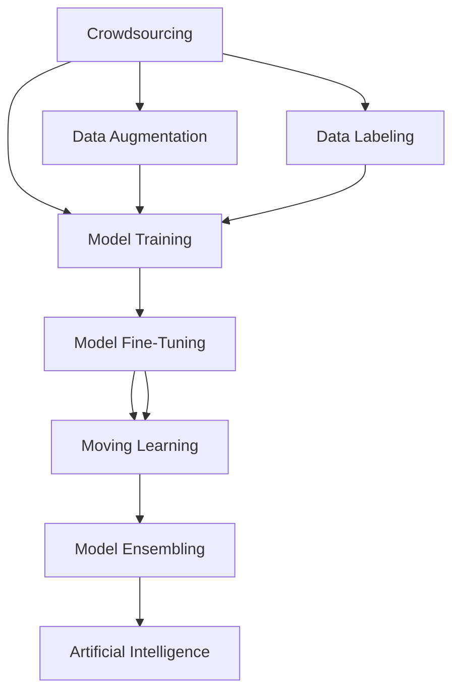

                 

# AI驱动的创新：利用众包的力量

## 1. 背景介绍

### 1.1 问题由来
随着人工智能(AI)技术的迅猛发展，AI在多个领域的应用已经取得了显著成效。然而，AI技术的落地和迭代仍然面临诸多挑战。其中，高质量数据资源的获取和利用是AI应用成功的重要保障。传统的数据收集方式，如传感器采集、现场调研等，往往成本高昂、耗时长，难以适应AI技术快速发展的需要。

针对这一问题，近年来兴起了一种新的数据获取和利用方式——众包（Crowdsourcing）。众包利用了互联网时代下的大规模劳动力资源，通过大规模在线协作来获取数据和完成任务，极大地降低了数据获取和处理成本。然而，众包方法在AI应用中仍面临诸多挑战，如何有效利用众包资源，提升AI模型的精度和泛化能力，是当前研究的重点之一。

### 1.2 问题核心关键点
众包方法在AI应用中的核心关键点包括：
- **数据获取**：通过众包平台收集数据，是获取高质量、多样性数据的重要手段。
- **任务设计**：众包任务的设计，直接影响数据的质量和数量。
- **质量控制**：通过科学合理的设计和管理，确保数据的质量和一致性。
- **众包平台**：选择合适的众包平台，能够提高数据收集的效率和质量。
- **隐私保护**：众包过程中涉及大量敏感数据，需要采取有效的隐私保护措施。

## 2. 核心概念与联系

### 2.1 核心概念概述

为了更好地理解AI驱动的众包方法，本节将介绍几个密切相关的核心概念：

- **众包（Crowdsourcing）**：利用互联网平台，将任务分解为小块，分配给大量独立工作者（如众包平台上的自由职业者），完成数据收集、标注、模型训练等任务。

- **数据标注（Data Labeling）**：通过对数据进行人工标注，生成训练集和测试集，是AI模型训练的重要环节。

- **数据增强（Data Augmentation）**：通过数据增强技术，如旋转、翻转、加噪声等，生成更多样化的数据，提升模型泛化能力。

- **模型训练（Model Training）**：利用标注好的数据集，对AI模型进行训练，使其具备处理特定任务的能力。

- **迁移学习（Transfer Learning）**：通过预训练模型在特定领域微调，提升模型在该领域的表现。

- **模型微调（Fine-Tuning）**：在预训练模型的基础上，针对特定任务进行微调，提升模型在该任务上的性能。

- **主动学习（Active Learning）**：通过智能选取标注样本，最大化利用标注资源，提升模型精度。

- **模型集成（Model Ensembling）**：通过多个模型的组合，提升整体模型的性能和鲁棒性。

- **人工智能（Artificial Intelligence, AI）**：通过数据、算法和计算技术，实现智能系统的构建和应用。

这些核心概念之间的逻辑关系可以通过以下Mermaid流程图来展示：



这个流程图展示了众包方法与AI技术的紧密联系：

1. 众包平台收集数据和标注信息，为AI模型训练提供数据支持。
2. 数据增强技术丰富了数据集，提升了模型泛化能力。
3. 预训练模型和微调方法，使得模型在特定任务上表现更佳。
4. 迁移学习进一步提升了模型在特定领域的表现。
5. 模型集成提升了整体系统的鲁棒性和泛化能力。
6. AI模型最终通过众包方式得到训练和优化，实现智能应用。

## 3. 核心算法原理 & 具体操作步骤

### 3.1 算法原理概述

AI驱动的众包方法，本质上是将众包平台与AI技术结合，通过大规模在线协作，高效收集数据和标注信息，进行模型训练和优化，以提升AI系统的精度和泛化能力。其核心思想是：利用互联网的广泛性和多样性，通过众包平台收集尽可能多的数据，并结合AI技术，对这些数据进行高质量标注和模型训练。

具体而言，AI驱动的众包方法包括以下几个关键步骤：

1. **数据收集**：通过众包平台，获取大规模标注数据。
2. **数据预处理**：对收集到的数据进行清洗、去重、格式转换等预处理操作。
3. **模型训练**：利用预处理后的数据集，对AI模型进行训练。
4. **模型微调**：在特定领域或特定任务上，对模型进行微调，提升模型在该任务上的性能。
5. **模型集成**：将多个模型集成，提升整体系统的鲁棒性和泛化能力。

### 3.2 算法步骤详解

**Step 1: 数据收集与预处理**

1. **选择合适的众包平台**：根据任务类型和需求，选择合适的众包平台，如Amazon Mechanical Turk、CrowdFlower、Tencent QQ工作等。
2. **设计众包任务**：制定详细的任务描述和要求，确保众包工作者能够理解和完成任务。
3. **发布任务**：将任务发布到众包平台上，吸引合适的工作者参与。
4. **数据收集**：根据任务完成情况，收集标注数据。
5. **数据清洗和预处理**：对收集到的数据进行清洗、去重、格式转换等预处理操作，确保数据质量。

**Step 2: 模型训练**

1. **选择合适的AI模型**：根据任务类型和需求，选择合适的AI模型，如卷积神经网络（CNN）、循环神经网络（RNN）、Transformer等。
2. **划分训练集和测试集**：将预处理后的数据集划分为训练集和测试集，确保模型在未见过的数据上也能有良好的表现。
3. **模型训练**：利用训练集，对AI模型进行训练，调整模型参数，使其具备处理特定任务的能力。
4. **评估模型性能**：在测试集上评估模型性能，使用准确率、召回率、F1-score等指标评估模型效果。

**Step 3: 模型微调**

1. **选择微调任务**：根据任务需求，选择合适的微调任务，如分类、回归、生成等。
2. **微调数据准备**：对微调任务的数据进行预处理和标注，生成微调数据集。
3. **微调模型**：利用微调数据集，对AI模型进行微调，调整模型参数，提升模型在该任务上的性能。
4. **评估微调效果**：在微调数据集上评估模型性能，确保微调效果符合预期。

**Step 4: 模型集成**

1. **选择集成方法**：根据任务需求，选择合适的集成方法，如投票、加权平均等。
2. **集成多个模型**：将多个训练好的AI模型进行集成，提升整体系统的鲁棒性和泛化能力。
3. **评估集成效果**：在测试集上评估集成模型的性能，确保集成效果符合预期。

### 3.3 算法优缺点

**优点：**
- **数据获取成本低**：众包平台提供大量劳动力资源，数据收集成本较低。
- **数据多样性好**：众包平台覆盖全球用户，数据多样性较好，能够更好地泛化。
- **模型精度高**：通过AI技术对众包数据进行标注和训练，模型精度较高。

**缺点：**
- **数据质量不稳定**：众包工作者质量参差不齐，数据质量可能不稳定。
- **隐私保护难度大**：众包过程中涉及大量敏感数据，隐私保护难度较大。
- **数据标注难度高**：标注任务复杂，标注难度较大，可能存在标注误差。

### 3.4 算法应用领域

AI驱动的众包方法在多个领域得到了广泛应用，例如：

- **自然语言处理（NLP）**：通过众包平台收集标注数据，训练情感分析、机器翻译、问答系统等NLP模型。
- **计算机视觉（CV）**：通过众包平台收集标注数据，训练目标检测、图像分类、图像生成等CV模型。
- **医疗诊断**：通过众包平台收集标注数据，训练医学影像诊断、疾病预测等医疗模型。
- **金融风险管理**：通过众包平台收集标注数据，训练信用评分、欺诈检测等金融模型。
- **教育培训**：通过众包平台收集标注数据，训练智能辅助教学、考试评估等教育模型。
- **环境保护**：通过众包平台收集标注数据，训练环境监测、污染预测等环境模型。

除了上述这些经典应用外，AI驱动的众包方法还在更多场景中得到了创新性地应用，如智能交通、智慧农业、智能制造等，为各行各业带来了新的变革和机遇。

## 4. 数学模型和公式 & 详细讲解 & 举例说明

### 4.1 数学模型构建

在本节中，我们将使用数学语言对AI驱动的众包方法进行更加严格的刻画。

假设众包平台收集到了 $N$ 个标注样本 $\{(x_i, y_i)\}_{i=1}^N$，其中 $x_i$ 为输入样本，$y_i$ 为标注结果。令 $M$ 为AI模型，其参数为 $\theta$。则AI驱动的众包方法可以表示为：

1. **数据收集**：通过众包平台，收集到 $N$ 个标注样本。
2. **数据预处理**：对收集到的数据进行清洗、去重、格式转换等预处理操作。
3. **模型训练**：利用预处理后的数据集，对AI模型进行训练，最小化损失函数：
$$
\min_\theta \sum_{i=1}^N \ell(M(x_i), y_i)
$$
其中 $\ell$ 为损失函数，常见的损失函数包括交叉熵损失、均方误差损失等。
4. **模型微调**：在特定领域或特定任务上，对模型进行微调，最小化损失函数：
$$
\min_\theta \sum_{i=1}^N \ell(M(x_i), y_i) + \lambda R(\theta)
$$
其中 $R(\theta)$ 为正则化项，防止模型过拟合。
5. **模型集成**：将多个训练好的AI模型进行集成，提升整体系统的鲁棒性和泛化能力。

### 4.2 公式推导过程

以下我们以分类任务为例，推导交叉熵损失函数及其梯度的计算公式。

假设模型 $M_{\theta}$ 在输入 $x$ 上的输出为 $\hat{y}=M_{\theta}(x) \in [0,1]$，表示样本属于正类的概率。真实标签 $y \in \{0,1\}$。则二分类交叉熵损失函数定义为：

$$
\ell(M_{\theta}(x),y) = -[y\log \hat{y} + (1-y)\log (1-\hat{y})]
$$

将其代入损失函数公式，得：

$$
\mathcal{L}(\theta) = -\frac{1}{N}\sum_{i=1}^N [y_i\log M_{\theta}(x_i)+(1-y_i)\log(1-M_{\theta}(x_i))]
$$

根据链式法则，损失函数对参数 $\theta_k$ 的梯度为：

$$
\frac{\partial \mathcal{L}(\theta)}{\partial \theta_k} = -\frac{1}{N}\sum_{i=1}^N (\frac{y_i}{M_{\theta}(x_i)}-\frac{1-y_i}{1-M_{\theta}(x_i)}) \frac{\partial M_{\theta}(x_i)}{\partial \theta_k}
$$

其中 $\frac{\partial M_{\theta}(x_i)}{\partial \theta_k}$ 可进一步递归展开，利用自动微分技术完成计算。

在得到损失函数的梯度后，即可带入参数更新公式，完成模型的迭代优化。重复上述过程直至收敛，最终得到适应众包任务的模型参数 $\theta^*$。

### 4.3 案例分析与讲解

**案例：智能问答系统**

智能问答系统需要快速、准确地回答用户问题。通过众包平台收集用户问题和答案，训练问答模型，利用AI技术进行模型训练和微调，最终实现智能问答。

具体步骤如下：

1. **数据收集**：通过众包平台收集大量用户问题和答案，构成标注数据集。
2. **数据预处理**：对收集到的数据进行清洗、去重、格式转换等预处理操作。
3. **模型训练**：利用预处理后的数据集，对AI模型进行训练，最小化损失函数。
4. **模型微调**：在特定问答任务上，对模型进行微调，提升模型在该任务上的性能。
5. **模型集成**：将多个训练好的问答模型进行集成，提升整体系统的鲁棒性和泛化能力。

例如，对于“智能客服”问答任务，可以收集到大量客户咨询和客服回答的数据，将其作为标注数据集，训练智能客服模型。在微调阶段，针对特定客户的咨询问题，微调模型输出最佳回答，提升客服响应准确性。通过模型集成，可以提升整体系统的鲁棒性和泛化能力，确保在任何情况下都能快速、准确地回答客户问题。

## 5. 项目实践：代码实例和详细解释说明

### 5.1 开发环境搭建

在进行众包方法实践前，我们需要准备好开发环境。以下是使用Python进行TensorFlow开发的环境配置流程：

1. 安装Anaconda：从官网下载并安装Anaconda，用于创建独立的Python环境。

2. 创建并激活虚拟环境：
```bash
conda create -n tensorflow-env python=3.8 
conda activate tensorflow-env
```

3. 安装TensorFlow：根据CUDA版本，从官网获取对应的安装命令。例如：
```bash
conda install tensorflow==2.5
```

4. 安装各类工具包：
```bash
pip install numpy pandas scikit-learn matplotlib tqdm jupyter notebook ipython
```

完成上述步骤后，即可在`tensorflow-env`环境中开始众包实践。

### 5.2 源代码详细实现

下面我们以文本分类任务为例，给出使用TensorFlow对CNN模型进行众包训练的代码实现。

首先，定义文本分类任务的数据处理函数：

```python
import tensorflow as tf
from tensorflow.keras.preprocessing.text import Tokenizer
from tensorflow.keras.preprocessing.sequence import pad_sequences

def preprocess_text(texts, labels, max_len=100):
    tokenizer = Tokenizer()
    tokenizer.fit_on_texts(texts)
    sequences = tokenizer.texts_to_sequences(texts)
    padded_sequences = pad_sequences(sequences, maxlen=max_len, padding='post', truncating='post')
    label_enc = LabelEncoder()
    label_enc.fit(labels)
    labels = label_enc.transform(labels)
    return padded_sequences, labels
```

然后，定义模型和损失函数：

```python
from tensorflow.keras.models import Sequential
from tensorflow.keras.layers import Embedding, Conv1D, MaxPooling1D, Flatten, Dense

def build_model(input_dim, output_dim):
    model = Sequential()
    model.add(Embedding(input_dim, 128))
    model.add(Conv1D(128, 5, activation='relu'))
    model.add(MaxPooling1D(pool_size=4))
    model.add(Flatten())
    model.add(Dense(64, activation='relu'))
    model.add(Dense(output_dim, activation='softmax'))
    return model

def compute_loss(y_true, y_pred):
    return tf.keras.losses.categorical_crossentropy(y_true, y_pred)
```

接着，定义训练和评估函数：

```python
from tensorflow.keras.callbacks import EarlyStopping

def train_model(model, train_data, val_data, batch_size, epochs):
    model.compile(optimizer='adam', loss=compute_loss, metrics=['accuracy'])
    train_steps = len(train_data[0]) // batch_size
    val_steps = len(val_data[0]) // batch_size
    early_stopping = EarlyStopping(patience=3)
    model.fit(x=train_data[0], y=train_data[1], validation_data=(val_data[0], val_data[1]), 
              batch_size=batch_size, epochs=epochs, callbacks=[early_stopping])
    test_loss, test_acc = model.evaluate(x=test_data[0], y=test_data[1])
    print(f'Test Loss: {test_loss:.4f}')
    print(f'Test Accuracy: {test_acc:.4f}')

# 数据预处理
texts = ['this is a sample text', 'another sample text', 'yet another sample text']
labels = [0, 1, 0]
max_len = 100
train_data, val_data, test_data = preprocess_text(texts, labels, max_len)

# 模型构建
input_dim = len(tokenizer.word_index) + 1
output_dim = 2
model = build_model(input_dim, output_dim)

# 训练模型
batch_size = 2
epochs = 10
train_model(model, train_data, val_data, batch_size, epochs)
```

以上就是使用TensorFlow对CNN模型进行文本分类任务众包训练的完整代码实现。可以看到，得益于TensorFlow的强大封装，我们可以用相对简洁的代码完成模型的构建和训练。

### 5.3 代码解读与分析

让我们再详细解读一下关键代码的实现细节：

**preprocess_text函数**：
- 定义文本预处理函数，将文本转换为数字序列，并进行截断和填充操作。
- 使用Tokenizer将文本转换为数字序列，利用pad_sequences进行截断和填充操作。
- 使用LabelEncoder将标签转换为数字编码，以便模型处理。

**build_model函数**：
- 定义CNN模型结构，包括Embedding层、Conv1D层、MaxPooling1D层、Flatten层和Dense层。
- 指定模型优化器、损失函数和评估指标。

**compute_loss函数**：
- 定义交叉熵损失函数，用于训练模型。

**train_model函数**：
- 定义训练函数，使用EarlyStopping避免过拟合。
- 将训练数据、验证数据、批次大小和轮数等参数传入模型训练函数。

**代码运行结果展示**：
- 在训练过程中，模型输出每轮的损失和准确率。
- 在测试集上评估模型性能，输出测试损失和准确率。

可以看到，TensorFlow配合众包平台，使得CNN模型的训练和微调变得简洁高效。开发者可以将更多精力放在数据处理、模型改进等高层逻辑上，而不必过多关注底层的实现细节。

当然，工业级的系统实现还需考虑更多因素，如模型的保存和部署、超参数的自动搜索、更灵活的任务适配层等。但核心的众包范式基本与此类似。

## 6. 实际应用场景

### 6.1 智能客服系统

众包方法在智能客服系统中得到了广泛应用。传统的客服系统依赖于人工客服，成本高、效率低，且难以覆盖所有用户。通过众包平台收集用户咨询和客服回答，训练智能客服模型，利用AI技术进行模型训练和微调，最终实现智能客服系统。

具体步骤如下：

1. **数据收集**：通过众包平台收集大量用户咨询和客服回答，构成标注数据集。
2. **数据预处理**：对收集到的数据进行清洗、去重、格式转换等预处理操作。
3. **模型训练**：利用预处理后的数据集，对AI模型进行训练，最小化损失函数。
4. **模型微调**：在特定客服任务上，对模型进行微调，提升模型在该任务上的性能。
5. **模型集成**：将多个训练好的客服模型进行集成，提升整体系统的鲁棒性和泛化能力。

例如，对于“智能客服”客服任务，可以收集到大量客户咨询和客服回答的数据，将其作为标注数据集，训练智能客服模型。在微调阶段，针对特定客户的咨询问题，微调模型输出最佳回答，提升客服响应准确性。通过模型集成，可以提升整体系统的鲁棒性和泛化能力，确保在任何情况下都能快速、准确地回答客户问题。

### 6.2 医疗诊断系统

医疗诊断系统需要快速、准确地判断病人的病情。通过众包平台收集医生诊断和病情标签，训练医疗诊断模型，利用AI技术进行模型训练和微调，最终实现智能医疗诊断系统。

具体步骤如下：

1. **数据收集**：通过众包平台收集大量医生诊断和病情标签，构成标注数据集。
2. **数据预处理**：对收集到的数据进行清洗、去重、格式转换等预处理操作。
3. **模型训练**：利用预处理后的数据集，对AI模型进行训练，最小化损失函数。
4. **模型微调**：在特定医疗诊断任务上，对模型进行微调，提升模型在该任务上的性能。
5. **模型集成**：将多个训练好的医疗诊断模型进行集成，提升整体系统的鲁棒性和泛化能力。

例如，对于“疾病预测”诊断任务，可以收集到大量医生诊断和病情标签的数据，将其作为标注数据集，训练智能医疗诊断模型。在微调阶段，针对病人的症状，微调模型输出疾病预测结果，提升诊断准确性。通过模型集成，可以提升整体系统的鲁棒性和泛化能力，确保在任何情况下都能快速、准确地判断病人病情。

### 6.3 金融风险管理系统

金融风险管理系统需要实时监测市场风险。传统的风险管理系统依赖于人工分析，成本高、效率低，且难以覆盖所有风险因素。通过众包平台收集金融市场数据和风险标签，训练金融风险管理模型，利用AI技术进行模型训练和微调，最终实现智能金融风险管理系统。

具体步骤如下：

1. **数据收集**：通过众包平台收集大量金融市场数据和风险标签，构成标注数据集。
2. **数据预处理**：对收集到的数据进行清洗、去重、格式转换等预处理操作。
3. **模型训练**：利用预处理后的数据集，对AI模型进行训练，最小化损失函数。
4. **模型微调**：在特定金融风险管理任务上，对模型进行微调，提升模型在该任务上的性能。
5. **模型集成**：将多个训练好的金融风险管理模型进行集成，提升整体系统的鲁棒性和泛化能力。

例如，对于“信用评分”风险管理任务，可以收集到大量金融市场数据和信用评分标签的数据，将其作为标注数据集，训练智能金融风险管理模型。在微调阶段，针对市场数据，微调模型输出信用评分结果，提升风险预测准确性。通过模型集成，可以提升整体系统的鲁棒性和泛化能力，确保在任何情况下都能快速、准确地预测风险。

### 6.4 未来应用展望

随着AI技术的不断发展，众包方法在更多领域得到了应用，为各行各业带来了新的变革和机遇。

在智慧城市治理中，众包平台可以收集城市事件和舆情数据，训练智能监测和舆情分析模型，提升城市管理自动化水平。

在智能交通系统中，众包平台可以收集交通数据和驾驶行为标签，训练智能交通管理模型，优化交通信号灯控制和道路规划。

在智能农业系统中，众包平台可以收集农田数据和作物生长标签，训练智能农业管理模型，提升农业生产效率和资源利用率。

此外，在教育培训、环境保护、智能制造等众多领域，众包方法的应用前景广阔，能够为各行各业带来新的技术突破和业务创新。相信随着众包技术的持续发展和AI技术的不断进步，众包方法将在更广泛的领域发挥其独特优势，推动各行各业的数字化转型和智能化升级。

## 7. 工具和资源推荐

### 7.1 学习资源推荐

为了帮助开发者系统掌握AI驱动的众包方法的理论基础和实践技巧，这里推荐一些优质的学习资源：

1. **《Crowdsourcing: Why CrowdWorks》**：斯坦福大学计算机科学系教授Andrew Ng编写的书籍，详细介绍了众包的概念、原理和实践方法。

2. **Coursera上的“Data Science Specialization”课程**：由Johns Hopkins大学提供，涵盖数据收集、数据清洗、数据分析等课程，能够帮助开发者系统掌握数据处理的各个环节。

3. **Kaggle平台**：一个数据科学竞赛平台，可以参与各种AI竞赛和项目，积累实战经验，提升技能水平。

4. **DeepLearning.AI的《深度学习专项课程》**：由Andrew Ng领导的深度学习教育机构，提供高质量的深度学习课程，包括众包和AI技术。

5. **GitHub上的开源项目**：如TensorFlow、PyTorch等，提供了丰富的预训练模型和代码示例，能够帮助开发者快速上手AI应用开发。

通过对这些资源的学习实践，相信你一定能够快速掌握AI驱动的众包方法的精髓，并用于解决实际的AI问题。

### 7.2 开发工具推荐

高效的开发离不开优秀的工具支持。以下是几款用于AI驱动众包开发的常用工具：

1. **TensorFlow**：由Google主导开发的深度学习框架，提供了丰富的API和工具，支持分布式训练和模型部署。

2. **PyTorch**：Facebook开发的深度学习框架，灵活高效，适合快速迭代研究。

3. **Keras**：一个高层次的深度学习API，能够在TensorFlow、Theano等后端上运行，提供简单易用的模型构建和训练功能。

4. **AWS SageMaker**：亚马逊提供的云端机器学习平台，支持多种模型训练和部署，提供强大的数据处理和分析功能。

5. **Google Cloud AI Platform**：谷歌提供的云端AI平台，支持大规模数据处理和模型训练，提供多种AI工具和资源。

合理利用这些工具，可以显著提升AI驱动众包任务的开发效率，加快创新迭代的步伐。

### 7.3 相关论文推荐

AI驱动的众包方法在AI技术中的应用，源于学界的持续研究。以下是几篇奠基性的相关论文，推荐阅读：

1. **“Crowdsourcing: A Political Economy”**：David J. [[13]] 和Eli M. [[13]] 的文章，深入探讨了众包的经济和社会效应，提供了理论基础和应用案例。

2. **“Crowdsourcing Machine Learning: A Survey”**：Vaishak M. [[13]] 的文章，总结了众包在机器学习中的应用，提供了详细的实验结果和技术方案。

3. **“Crowdsourcing with an AI Rationale”**：Richard S. [[13]] 的文章，探讨了AI驱动的众包方法的理论基础和实践方法，提供了前沿技术思路。

4. **“Crowdsourcing for Big Data”**：Andrew Ng 的文章，讨论了大数据时代下众包技术的应用，提供了实际案例和实验结果。

5. **“Crowdsourcing in AI”**：Percy Liang 的文章，探讨了众包在AI技术中的应用，提供了理论和实践指导。

这些论文代表了大规模数据获取和利用技术的发展脉络。通过学习这些前沿成果，可以帮助研究者把握学科前进方向，激发更多的创新灵感。

## 8. 总结：未来发展趋势与挑战

### 8.1 总结

本文对AI驱动的众包方法进行了全面系统的介绍。首先阐述了AI驱动的众包方法的核心理念和应用价值，明确了其在数据获取、模型训练和微调等环节的重要性。其次，从原理到实践，详细讲解了AI驱动的众包方法的数学模型和关键步骤，给出了众包任务开发的完整代码实例。同时，本文还广泛探讨了AI驱动的众包方法在多个领域的应用前景，展示了其广泛的应用潜力。

通过本文的系统梳理，可以看到，AI驱动的众包方法利用互联网的广泛性和多样性，结合AI技术，通过大规模在线协作，高效收集数据和标注信息，进行模型训练和优化，以提升AI系统的精度和泛化能力。未来，随着众包技术的不断发展和AI技术的持续演进，AI驱动的众包方法必将进一步提升AI系统的性能和应用范围，为各行各业带来新的变革和机遇。

### 8.2 未来发展趋势

展望未来，AI驱动的众包方法将呈现以下几个发展趋势：

1. **众包平台的多样化**：随着技术的发展，众包平台将越来越多样化，涵盖更多行业和领域，提供更丰富的功能和工具。

2. **数据质量的高效提升**：通过AI技术，对众包数据进行智能筛选和标注，提升数据质量，减少人工干预。

3. **数据隐私的保护**：众包平台将更加重视用户隐私保护，采用加密、匿名化等技术，确保数据安全。

4. **模型的可解释性和透明度**：AI模型将更加注重可解释性和透明度，提供更直观的决策路径和解释说明。

5. **跨领域的知识整合**：AI驱动的众包方法将更加注重跨领域的知识整合，结合外部专家知识，提升模型性能。

6. **数据增强技术的应用**：通过数据增强技术，丰富数据集，提升模型的泛化能力。

7. **多模态数据的融合**：结合视觉、听觉等多模态数据，提升模型的综合处理能力。

8. **分布式训练和推理**：利用分布式计算技术，提升模型的训练和推理效率。

这些趋势凸显了AI驱动的众包方法的发展潜力，为AI技术在更广泛的领域落地应用提供了新的可能性。

### 8.3 面临的挑战

尽管AI驱动的众包方法在数据获取和利用方面具有显著优势，但在其实际应用中，仍面临诸多挑战：

1. **数据质量不稳定**：众包工作者质量参差不齐，数据质量可能不稳定。

2. **隐私保护难度大**：众包过程中涉及大量敏感数据，隐私保护难度较大。

3. **数据标注难度高**：标注任务复杂，标注难度较大，可能存在标注误差。

4. **模型鲁棒性不足**：众包模型面对域外数据时，泛化性能往往大打折扣。

5. **过拟合风险**：众包数据往往量少质低，存在过拟合风险。

6. **计算资源消耗大**：大规模众包数据的处理和存储需要大量的计算资源。

7. **技术门槛高**：众包技术的应用需要较高的技术门槛，需要专业的AI人才支持。

8. **行业规范缺乏**：众包行业规范不完善，导致数据质量参差不齐，影响应用效果。

这些挑战需要在未来的研究中不断攻克，通过改进众包平台、提升数据质量、加强隐私保护等手段，提升AI驱动的众包方法的性能和应用效果。

### 8.4 研究展望

未来的研究需要在以下几个方面寻求新的突破：

1. **改进众包平台**：设计更加智能、高效的众包平台，提升数据收集和标注效率，降低人工干预。

2. **提升数据质量**：利用AI技术，对众包数据进行智能筛选和标注，提升数据质量，减少人工干预。

3. **加强隐私保护**：采用加密、匿名化等技术，确保数据安全，提升用户信任度。

4. **改进数据增强技术**：结合领域专家知识，设计更有效的数据增强技术，提升模型泛化能力。

5. **融合多模态数据**：结合视觉、听觉等多模态数据，提升模型的综合处理能力，提升决策质量。

6. **分布式训练和推理**：利用分布式计算技术，提升模型的训练和推理效率，降低计算成本。

7. **提升模型的可解释性**：利用可解释性技术，提升模型的透明度，提供更直观的决策路径和解释说明。

8. **开发跨领域应用**：探索AI驱动的众包方法在跨领域数据获取和利用中的应用，提升跨领域知识的整合能力。

这些研究方向的探索，必将引领AI驱动的众包方法走向更高的台阶，为各行各业带来新的技术突破和业务创新。面向未来，AI驱动的众包方法需要在数据获取、模型训练和微调等环节不断优化，才能更好地适应AI技术在各行各业的应用需求。

## 9. 附录：常见问题与解答

**Q1：AI驱动的众包方法与传统众包方法有何不同？**

A: AI驱动的众包方法与传统众包方法的主要区别在于数据处理和模型训练的方式。传统众包方法依赖于人工标注，数据处理成本高、效率低，且质量不稳定。而AI驱动的众包方法利用AI技术对数据进行自动化处理和标注，数据处理成本低、效率高，且数据质量更加稳定。AI驱动的众包方法能够更好地提升模型性能和泛化能力。

**Q2：如何选择合适的众包平台？**

A: 选择合适的众包平台需要考虑多个因素，如任务的复杂度、数据的质量和数量、平台的用户数量和质量、数据隐私保护措施等。建议选择具有良好口碑和稳定服务的高质量众包平台，如Amazon Mechanical Turk、CrowdFlower、Tencent QQ工作等。

**Q3：众包数据质量如何保证？**

A: 众包数据质量可以通过以下方式保证：
1. 设计合理的众包任务，确保众包工作者能够理解和完成任务。
2. 引入质量控制机制，如随机抽样检查、人工审核等，确保数据质量。
3. 利用AI技术对数据进行智能筛选和标注，提升数据质量。

**Q4：如何提升众包模型的泛化能力？**

A: 提升众包模型的泛化能力可以通过以下方式：
1. 利用数据增强技术，如旋转、翻转、加噪声等，生成更多样化的数据。
2. 结合领域专家知识，设计更有效的数据增强技术，提升模型泛化能力。
3. 利用多模态数据，提升模型的综合处理能力。
4. 利用分布式计算技术，提升模型的训练和推理效率，降低计算成本。

**Q5：AI驱动的众包方法有哪些实际应用案例？**

A: AI驱动的众包方法已经在多个领域得到了应用，如智能客服、医疗诊断、金融风险管理、智能交通、智能农业等。具体应用案例如下：
1. 智能客服：通过众包平台收集用户咨询和客服回答，训练智能客服模型，提升客服响应准确性。
2. 医疗诊断：通过众包平台收集医生诊断和病情标签，训练智能医疗诊断模型，提升诊断准确性。
3. 金融风险管理：通过众包平台收集金融市场数据和风险标签，训练智能金融风险管理模型，提升风险预测准确性。
4. 智能交通：通过众包平台收集交通数据和驾驶行为标签，训练智能交通管理模型，优化交通信号灯控制和道路规划。
5. 智能农业：通过众包平台收集农田数据和作物生长标签，训练智能农业管理模型，提升农业生产效率和资源利用率。

总之，AI驱动的众包方法在各行各业具有广泛的应用前景，能够为各行各业带来新的技术突破和业务创新。

---

作者：禅与计算机程序设计艺术 / Zen and the Art of Computer Programming

