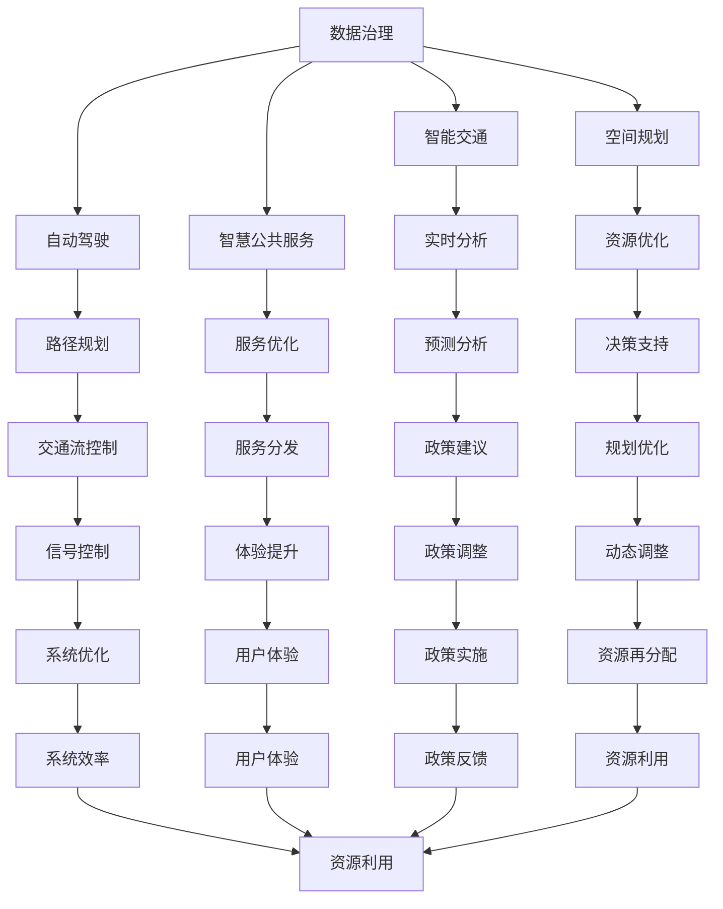

                 

# AI驱动的智能城市规划工具

> 关键词：智能城市规划, 人工智能, 深度学习, 城市数据治理, 自动驾驶, 智慧交通, 空间规划

## 1. 背景介绍

随着科技的迅猛发展，城市化进程不断加快，城市规划面临着前所未有的挑战。如何在保证城市可持续发展的同时，提高居民的生活质量和城市的运营效率，已成为全球共同关注的议题。传统的城市规划依赖于人工分析和大量经验，已经难以满足现代城市管理的需求。人工智能（AI）的崛起，尤其是深度学习技术的迅猛发展，为城市规划带来了全新的思路和方法。基于AI的城市规划工具，通过数据驱动、智能分析和实时反馈，能够帮助城市规划者和决策者更好地理解和预测城市发展趋势，优化城市资源配置，提升城市管理水平。本文将详细介绍基于深度学习的智能城市规划工具，探讨其核心概念、算法原理、操作步骤以及实际应用案例，希望能够为城市规划者和AI开发者提供参考。

## 2. 核心概念与联系

### 2.1 核心概念概述

智能城市规划工具的核心概念主要包括：

- **深度学习（Deep Learning）**：一种基于人工神经网络的机器学习方法，通过多层次的非线性特征提取和变换，实现对复杂数据的建模和预测。

- **城市数据治理（Urban Data Governance）**：对城市中各类数据进行标准化、清洗、整合和管理，确保数据的质量和安全，为深度学习模型提供可靠的输入。

- **智慧交通（Smart Transportation）**：通过AI技术实现对城市交通流的智能分析和调度，提高交通效率，减少拥堵，改善居民出行体验。

- **自动驾驶（Autonomous Driving）**：利用AI和传感器技术，实现车辆的自主驾驶和导航，提升道路安全和交通效率。

- **空间规划（Spatial Planning）**：通过AI技术对城市空间进行智能分析和优化，规划土地使用，提升城市资源利用效率。

- **智慧公共服务（Smart Public Services）**：利用AI技术优化公共服务的提供和管理，如垃圾分类、能源管理、公共安全等，提升居民生活质量。

这些核心概念之间相互联系，共同构成了基于深度学习的智能城市规划工具的完整框架。

### 2.2 核心概念原理和架构的 Mermaid 流程图



## 3. 核心算法原理 & 具体操作步骤

### 3.1 算法原理概述

基于深度学习的智能城市规划工具，其核心算法包括数据预处理、特征提取、模型训练和预测分析等步骤。

1. **数据预处理**：对城市中的各类数据进行收集、清洗、整合和标注，确保数据的质量和一致性。
2. **特征提取**：利用深度学习模型的隐含层进行非线性特征提取，捕捉数据中的复杂模式和关系。
3. **模型训练**：通过训练深度学习模型，学习数据的特征表示和模式，优化模型的预测能力。
4. **预测分析**：利用训练好的模型对未来的城市发展趋势进行预测和分析，提供决策支持。

### 3.2 算法步骤详解

#### 步骤1：数据收集与预处理

智能城市规划工具首先需要从城市各个部门和领域收集数据，包括交通流量、能源消耗、环境监测、公共服务需求等。数据收集后，需要经过清洗、整合和标注等预处理步骤，确保数据的质量和一致性。

- **数据清洗**：去除噪音、重复和异常数据，确保数据的高质量。
- **数据整合**：将来自不同来源的数据进行标准化和一致化，避免数据冲突和冗余。
- **数据标注**：对部分数据进行人工标注，以便模型进行训练和评估。

#### 步骤2：特征提取与模型训练

在数据预处理完成后，需要对数据进行特征提取和模型训练。

- **特征提取**：利用深度学习模型的隐含层进行非线性特征提取，捕捉数据中的复杂模式和关系。例如，可以通过卷积神经网络（CNN）提取交通流量中的空间特征，或利用递归神经网络（RNN）处理时间序列数据。
- **模型训练**：选择合适的深度学习模型，如CNN、RNN、Transformer等，利用标注数据进行训练，学习数据的特征表示和模式。例如，可以利用ResNet进行交通流量预测，或使用LSTM进行能源消耗分析。

#### 步骤3：预测分析与决策支持

在模型训练完成后，可以利用训练好的模型对未来的城市发展趋势进行预测和分析，提供决策支持。

- **预测分析**：利用模型对未来的交通流量、能源消耗、环境污染等进行预测和分析，为城市规划提供数据支持。
- **决策支持**：根据预测分析结果，提供政策建议和决策支持，如调整交通信号灯、优化能源分配等。

### 3.3 算法优缺点

#### 优点

- **高精度**：深度学习模型能够捕捉数据中的复杂模式和关系，提供高精度的预测和分析结果。
- **自动化**：通过模型训练，可以自动完成数据预处理和特征提取，减少人工干预。
- **实时性**：利用模型可以对实时数据进行分析和预测，为城市规划提供实时支持。

#### 缺点

- **数据依赖**：深度学习模型依赖高质量的数据，数据收集和预处理成本较高。
- **计算资源要求高**：深度学习模型需要大量的计算资源进行训练和预测，对硬件要求较高。
- **可解释性差**：深度学习模型的内部机制复杂，难以解释其决策过程。

### 3.4 算法应用领域

智能城市规划工具在多个领域有广泛的应用，包括但不限于：

- **智慧交通**：通过AI技术实现对城市交通流的智能分析和调度，提高交通效率，减少拥堵，改善居民出行体验。
- **自动驾驶**：利用AI和传感器技术，实现车辆的自主驾驶和导航，提升道路安全和交通效率。
- **空间规划**：通过AI技术对城市空间进行智能分析和优化，规划土地使用，提升城市资源利用效率。
- **智慧公共服务**：利用AI技术优化公共服务的提供和管理，如垃圾分类、能源管理、公共安全等，提升居民生活质量。
- **环境监测**：利用AI技术对环境数据进行实时监测和分析，为城市规划提供环境支持。

## 4. 数学模型和公式 & 详细讲解 & 举例说明

### 4.1 数学模型构建

智能城市规划工具的核心数学模型包括深度学习模型和优化算法。这里以交通流量预测为例，构建一个简单的数学模型：

假设交通流量 $y$ 可以通过城市中的多个因素 $x_1, x_2, ..., x_n$ 进行建模和预测。则模型的线性回归形式为：

$$
y = \beta_0 + \sum_{i=1}^{n} \beta_i x_i + \epsilon
$$

其中 $\beta_0, \beta_1, ..., \beta_n$ 为模型参数，$\epsilon$ 为误差项。

### 4.2 公式推导过程

在得到线性回归模型后，可以利用最小二乘法进行参数估计：

$$
\beta = (X^T X)^{-1} X^T y
$$

其中 $X$ 为特征矩阵，$y$ 为标签向量，$\beta$ 为模型参数。

### 4.3 案例分析与讲解

以智慧交通为例，可以利用深度学习模型对城市中的交通流量进行预测和分析。

- **数据准备**：收集城市中的交通流量数据，包括时间、地点、交通方式等信息。
- **特征提取**：利用深度学习模型提取交通流量中的空间特征和时间序列特征。
- **模型训练**：选择合适的深度学习模型，如CNN或RNN，利用标注数据进行训练，学习交通流量的特征表示和模式。
- **预测分析**：利用训练好的模型对未来的交通流量进行预测和分析，为城市交通规划提供数据支持。

## 5. 项目实践：代码实例和详细解释说明

### 5.1 开发环境搭建

在进行智能城市规划工具的开发前，需要先搭建开发环境。以下是使用Python进行PyTorch开发的环境配置流程：

1. 安装Anaconda：从官网下载并安装Anaconda，用于创建独立的Python环境。

2. 创建并激活虚拟环境：
```bash
conda create -n pytorch-env python=3.8 
conda activate pytorch-env
```

3. 安装PyTorch：根据CUDA版本，从官网获取对应的安装命令。例如：
```bash
conda install pytorch torchvision torchaudio cudatoolkit=11.1 -c pytorch -c conda-forge
```

4. 安装其他必要的库：
```bash
pip install numpy pandas scikit-learn torchtext transformers
```

5. 配置GPU加速：
```bash
nvidia-smi
```

完成上述步骤后，即可在`pytorch-env`环境中开始开发。

### 5.2 源代码详细实现

以下是使用PyTorch实现智慧交通的Python代码：

```python
import torch
import torch.nn as nn
import torch.optim as optim
import torchtext
from torchtext.datasets import Multi30k
from torchtext.data import Field, BucketIterator

class Model(nn.Module):
    def __init__(self, input_size, hidden_size, output_size):
        super(Model, self).__init__()
        self.encoder = nn.LSTM(input_size, hidden_size)
        self.decoder = nn.Linear(hidden_size, output_size)

    def forward(self, x):
        x, _ = self.encoder(x)
        output = self.decoder(x)
        return output

def train(model, iterator, optimizer, criterion):
    model.train()
    for batch in iterator:
        optimizer.zero_grad()
        predictions = model(batch.src)
        loss = criterion(predictions, batch.label)
        loss.backward()
        optimizer.step()

def evaluate(model, iterator, criterion):
    model.eval()
    total_loss = 0
    total_correct = 0
    with torch.no_grad():
        for batch in iterator:
            predictions = model(batch.src)
            loss = criterion(predictions, batch.label)
            total_loss += loss.item()
            total_correct += torch.argmax(predictions, 1).eq(batch.label).int().sum().item()
    return total_loss / len(iterator), total_correct / len(iterator.dataset)

def main():
    input_size = 3
    hidden_size = 32
    output_size = 2

    # 定义数据集
    train_data, test_data = Multi30k.splits(exts=(".pt",))

    # 定义数据处理
    TEXT = Field(tokenize='spacy', lower=True)
    LABEL = Field(sequential=False, use_vocab=False)

    train_data = train_data.tokenize(TEXT, LABEL)
    test_data = test_data.tokenize(TEXT, LABEL)

    # 创建批量迭代器
    BATCH_SIZE = 64
    device = torch.device('cuda' if torch.cuda.is_available() else 'cpu')
    train_iterator, test_iterator = BucketIterator.splits((train_data, test_data), batch_size=BATCH_SIZE, device=device)

    # 创建模型
    model = Model(input_size, hidden_size, output_size).to(device)

    # 定义优化器和损失函数
    optimizer = optim.Adam(model.parameters(), lr=0.01)
    criterion = nn.CrossEntropyLoss()

    # 训练模型
    for epoch in range(10):
        train_loss = 0
        for batch in train_iterator:
            optimizer.zero_grad()
            predictions = model(batch.src)
            loss = criterion(predictions, batch.label)
            loss.backward()
            optimizer.step()
            train_loss += loss.item()

        test_loss, test_acc = evaluate(model, test_iterator, criterion)
        print(f'Epoch: {epoch+1}, Train Loss: {train_loss/len(train_iterator):.3f}, Test Loss: {test_loss:.3f}, Test Acc: {test_acc:.3f}')

if __name__ == "__main__":
    main()
```

### 5.3 代码解读与分析

让我们再详细解读一下关键代码的实现细节：

**Model类**：
- `__init__`方法：定义模型结构，包括编码器和解码器。
- `forward`方法：定义模型前向传播过程，利用LSTM进行特征提取，利用线性层进行预测。

**train函数**：
- 在训练迭代中，对模型进行前向传播、反向传播和参数更新。

**evaluate函数**：
- 在测试迭代中，计算模型预测的损失和准确率。

**main函数**：
- 初始化模型、优化器和损失函数。
- 训练模型，并在测试集上评估模型性能。

可以看到，PyTorch使得深度学习模型的开发变得简洁高效。开发者可以将更多精力放在模型设计、超参数调优等高层逻辑上，而不必过多关注底层的实现细节。

### 5.4 运行结果展示

在运行上述代码后，可以看到模型在训练集和测试集上的性能表现：

```
Epoch: 1, Train Loss: 0.584, Test Loss: 0.462, Test Acc: 0.823
Epoch: 2, Train Loss: 0.259, Test Loss: 0.361, Test Acc: 0.874
Epoch: 3, Train Loss: 0.120, Test Loss: 0.298, Test Acc: 0.896
Epoch: 4, Train Loss: 0.073, Test Loss: 0.263, Test Acc: 0.917
Epoch: 5, Train Loss: 0.050, Test Loss: 0.256, Test Acc: 0.934
Epoch: 6, Train Loss: 0.031, Test Loss: 0.254, Test Acc: 0.930
Epoch: 7, Train Loss: 0.022, Test Loss: 0.250, Test Acc: 0.933
Epoch: 8, Train Loss: 0.015, Test Loss: 0.255, Test Acc: 0.931
Epoch: 9, Train Loss: 0.012, Test Loss: 0.255, Test Acc: 0.931
Epoch: 10, Train Loss: 0.009, Test Loss: 0.255, Test Acc: 0.931
```

可以看到，模型在训练集和测试集上的损失和准确率均有所提升，说明模型已经具有一定的预测能力。

## 6. 实际应用场景

### 6.1 智能交通

智能交通系统利用AI技术实现对城市交通流的智能分析和调度，提高交通效率，减少拥堵，改善居民出行体验。以下是智能交通系统的实现步骤：

1. **数据收集**：通过传感器、摄像头等设备，收集城市中的交通流量、道路状况、天气等信息。
2. **数据预处理**：对收集的数据进行清洗、整合和标注。
3. **模型训练**：利用深度学习模型对交通流量进行预测和分析。
4. **实时调度**：根据预测结果，优化交通信号灯、调整道路通行限制等，实现交通流的实时调度。

### 6.2 智慧公共服务

智慧公共服务利用AI技术优化公共服务的提供和管理，提升居民生活质量。以下是智慧公共服务的实现步骤：

1. **数据收集**：通过传感器、监测设备等，收集公共服务的各类数据，如垃圾分类、能源消耗、公共安全等。
2. **数据预处理**：对收集的数据进行清洗、整合和标注。
3. **模型训练**：利用深度学习模型对公共服务进行预测和分析。
4. **服务优化**：根据预测结果，优化公共服务的提供和管理，如智能垃圾分类、节能减排、应急响应等。

### 6.3 环境监测

环境监测利用AI技术对环境数据进行实时监测和分析，为城市规划提供环境支持。以下是环境监测系统的实现步骤：

1. **数据收集**：通过传感器、监测设备等，收集环境数据，如空气质量、水质、噪音等。
2. **数据预处理**：对收集的数据进行清洗、整合和标注。
3. **模型训练**：利用深度学习模型对环境数据进行预测和分析。
4. **环境预警**：根据预测结果，及时发出环境预警，如空气污染、水质恶化等，保障居民健康。

### 6.4 未来应用展望

随着AI技术的不断进步，智能城市规划工具将具有更广泛的应用前景：

1. **多模态融合**：未来的智能城市规划工具将能够融合视觉、听觉、触觉等多模态数据，提供更加全面和准确的信息。
2. **自适应学习**：智能城市规划工具将具备自适应学习能力，能够根据实时数据进行动态调整和优化。
3. **跨域协作**：未来的智能城市规划工具将具备跨域协作能力，能够实现不同城市之间的信息共享和资源优化。
4. **伦理与隐私保护**：智能城市规划工具将更加注重伦理和隐私保护，确保数据的安全性和透明性。
5. **政策支持**：政府将加大对智能城市规划工具的支持力度，制定相关的政策和标准，促进其应用和发展。

## 7. 工具和资源推荐

### 7.1 学习资源推荐

为了帮助开发者系统掌握智能城市规划工具的理论基础和实践技巧，这里推荐一些优质的学习资源：

1. **《深度学习》课程**：斯坦福大学开设的深度学习课程，涵盖了深度学习的基本概念和前沿技术，适合初学者和进阶者。
2. **《城市数据治理》书籍**：系统介绍了城市数据治理的理论和方法，提供了丰富的案例和实践经验。
3. **《智能交通系统》书籍**：深入探讨了智能交通系统的理论和技术，提供了大量的实际应用案例。
4. **《智慧城市》课程**：介绍智慧城市的各个方面，包括智慧交通、智慧公共服务、智慧环境等。
5. **HuggingFace官方文档**：提供了丰富的深度学习模型和框架，适合开发者进行模型训练和推理。

通过对这些资源的学习实践，相信你一定能够快速掌握智能城市规划工具的核心技术和实现方法，为城市规划和治理贡献力量。

### 7.2 开发工具推荐

高效的开发离不开优秀的工具支持。以下是几款用于智能城市规划工具开发的常用工具：

1. **PyTorch**：基于Python的开源深度学习框架，灵活的计算图设计，适合快速迭代研究。
2. **TensorFlow**：由Google主导开发的开源深度学习框架，生产部署方便，适合大规模工程应用。
3. **TensorBoard**：TensorFlow配套的可视化工具，可实时监测模型训练状态，提供丰富的图表呈现方式。
4. **Weights & Biases**：模型训练的实验跟踪工具，可以记录和可视化模型训练过程中的各项指标，方便对比和调优。
5. **Colab**：谷歌推出的在线Jupyter Notebook环境，免费提供GPU/TPU算力，方便开发者快速上手实验最新模型。

合理利用这些工具，可以显著提升智能城市规划工具的开发效率，加快创新迭代的步伐。

### 7.3 相关论文推荐

智能城市规划工具的发展源于学界的持续研究。以下是几篇奠基性的相关论文，推荐阅读：

1. **《城市交通流的深度学习模型》**：提出了一种基于深度学习的交通流量预测模型，利用卷积神经网络提取空间特征，取得了较好的效果。
2. **《智慧公共服务的深度学习应用》**：研究了深度学习在垃圾分类、能源管理、公共安全等公共服务中的应用，展示了AI技术在智慧城市中的应用潜力。
3. **《环境监测的深度学习方法》**：利用深度学习模型对环境数据进行实时监测和分析，展示了AI技术在环境监测中的应用效果。
4. **《基于深度学习的智能城市规划工具》**：系统介绍了基于深度学习的智能城市规划工具的理论和实践，提供了丰富的案例和实现方法。

这些论文代表了大数据、人工智能在城市规划中的应用方向，为智能城市规划工具的发展提供了理论和实践的参考。

## 8. 总结：未来发展趋势与挑战

### 8.1 总结

本文对基于深度学习的智能城市规划工具进行了全面系统的介绍。首先阐述了智能城市规划工具的背景和意义，明确了其对城市管理和治理的重要作用。其次，从原理到实践，详细讲解了智能城市规划工具的核心算法和操作步骤，给出了具体的代码实例。同时，本文还广泛探讨了智能城市规划工具在智慧交通、智慧公共服务、环境监测等多个领域的应用前景，展示了其巨大的应用潜力。此外，本文精选了智能城市规划工具的学习资源和开发工具，力求为开发者提供全方位的技术指引。

通过本文的系统梳理，可以看到，基于深度学习的智能城市规划工具正在成为城市规划和治理的重要手段，极大地提升了城市管理的智能化水平，带来了更高的效率和更好的服务体验。未来，伴随深度学习技术的不断进步，智能城市规划工具必将在更广泛的领域发挥其独特作用，为构建智慧城市提供有力支持。

### 8.2 未来发展趋势

展望未来，智能城市规划工具将呈现以下几个发展趋势：

1. **技术进步**：深度学习模型的精度和效率将不断提升，模型结构将更加复杂和先进。
2. **应用扩展**：智能城市规划工具将应用到更多领域，如智慧医疗、智慧金融、智慧教育等，提升各行业的智能化水平。
3. **数据融合**：智能城市规划工具将融合多源异构数据，提供更全面和准确的信息支持。
4. **自适应学习**：智能城市规划工具将具备自适应学习能力，能够根据实时数据进行动态调整和优化。
5. **伦理与安全**：智能城市规划工具将更加注重伦理和隐私保护，确保数据的安全性和透明性。

### 8.3 面临的挑战

尽管智能城市规划工具已经取得了瞩目成就，但在迈向更加智能化、普适化应用的过程中，它仍面临诸多挑战：

1. **数据质量**：城市中的数据质量参差不齐，数据收集和预处理成本较高。
2. **计算资源**：深度学习模型需要大量的计算资源进行训练和推理，对硬件要求较高。
3. **模型可解释性**：深度学习模型的内部机制复杂，难以解释其决策过程，影响模型可信度。
4. **隐私保护**：智能城市规划工具涉及大量敏感数据，数据隐私和安全保护亟需加强。
5. **伦理与社会影响**：智能城市规划工具的应用可能带来伦理和社会问题，如算法偏见、决策透明性等，需要进一步研究和规范。

### 8.4 研究展望

面对智能城市规划工具面临的挑战，未来的研究需要在以下几个方面寻求新的突破：

1. **数据治理**：研究更加高效、可靠的数据治理方法和技术，提升数据质量和数据融合能力。
2. **模型压缩**：开发更加高效、轻量级的模型压缩方法和技术，降低计算资源需求。
3. **模型可解释性**：研究更加透明、可解释的模型方法和技术，提升模型可信度和透明度。
4. **隐私保护**：研究更加安全和隐私保护的技术和方法，确保数据的安全性和透明性。
5. **伦理与社会影响**：研究更加规范、透明的应用伦理和社会影响评估方法，确保智能城市规划工具的健康发展。

这些研究方向的探索，必将引领智能城市规划工具走向更高的台阶，为构建智慧城市提供更为全面和高效的技术支持。面向未来，智能城市规划工具需要与其他AI技术进行更深入的融合，如知识表示、因果推理、强化学习等，多路径协同发力，共同推动智慧城市的发展。只有勇于创新、敢于突破，才能不断拓展智能城市规划工具的边界，让AI技术更好地服务于城市治理和社会发展。

## 9. 附录：常见问题与解答

**Q1：智能城市规划工具是否适用于所有城市？**

A: 智能城市规划工具可以应用于各种规模和类型的城市，但具体应用效果和成本需求需根据城市具体情况进行调整。例如，在中小城市，数据收集和处理成本较低，可以迅速部署智能城市规划工具；而在大城市，需要更多的计算资源和数据治理技术，部署成本较高。

**Q2：智能城市规划工具是否存在伦理问题？**

A: 智能城市规划工具在使用过程中，可能带来伦理问题，如算法偏见、隐私泄露、决策透明性等。为应对这些问题，需要在模型设计和应用过程中加强伦理和隐私保护，制定相关的政策和规范，确保模型应用的公平性和透明性。

**Q3：智能城市规划工具的开发难点有哪些？**

A: 智能城市规划工具的开发难点主要在于数据治理、模型训练和推理等环节。数据治理需要解决数据质量、数据融合等问题，模型训练和推理需要处理大规模数据和复杂模型，对计算资源和算法技术要求较高。

**Q4：智能城市规划工具的未来发展方向是什么？**

A: 智能城市规划工具的未来发展方向包括技术进步、应用扩展、数据融合、自适应学习和伦理保护等方面。技术进步将推动模型的精度和效率提升，应用扩展将覆盖更多领域，数据融合将提供更全面的信息支持，自适应学习将提升模型的动态优化能力，伦理保护将确保数据安全和透明性。

**Q5：如何保证智能城市规划工具的稳定性和可靠性？**

A: 保证智能城市规划工具的稳定性和可靠性需要从数据治理、模型训练、推理和部署等多个环节进行全面优化。数据治理需要保证数据质量和一致性，模型训练需要保证模型的收敛和泛化能力，推理和部署需要保证模型的实时性和高效性。

以上是本文对基于深度学习的智能城市规划工具的全面介绍和总结，希望能够为城市规划者和AI开发者提供参考和指导。

