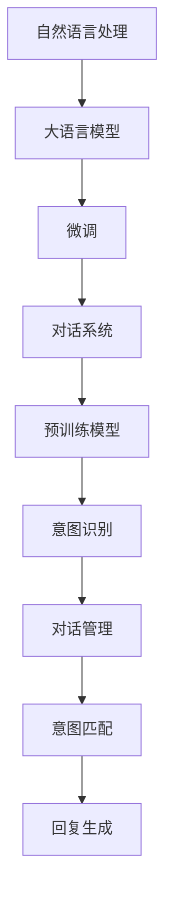

                 

# AI驱动的智能客户服务系统设计

## 1. 背景介绍

### 1.1 问题由来

智能客服系统是企业提升客户服务效率、改善客户体验的重要工具。然而，传统客服系统依赖人工处理客户咨询，存在响应时间长、服务质量不一致、人力成本高等问题。为了应对这些挑战，AI驱动的智能客服系统应运而生。通过基于NLP技术的微调方法，智能客服系统能够快速响应客户咨询，提供24/7不间断服务，同时保持一致性的服务质量，从而大大提升企业客户服务效率和客户满意度。

### 1.2 问题核心关键点

智能客服系统的核心在于利用大语言模型进行微调，使其能够理解自然语言问题并给出精确的答复。具体包括：

- 语义理解：智能客服系统需要理解客户的查询，提取其中的关键词和语义信息，才能准确响应。
- 对话管理：在多轮对话中，系统需要记住上下文信息，引导对话顺利进行。
- 意图识别：根据客户的查询意图，智能客服系统应能够生成合适的回复。
- 数据驱动：系统需要根据客户的互动反馈不断优化对话模型，提升服务质量。

### 1.3 问题研究意义

AI驱动的智能客服系统具有以下研究意义：

- 提高客户服务效率：智能客服系统能够快速处理大量客户咨询，缓解企业客服压力。
- 提升服务质量：通过基于大语言模型的微调，系统能够提供准确、一致的客户服务。
- 降低人力成本：智能客服系统的应用减少了对人工客服的依赖，降低企业运营成本。
- 增强用户体验：智能客服系统能够提供24/7不间断服务，提升客户满意度。
- 推动行业变革：AI驱动的智能客服系统能够帮助各行各业提升服务水平，加速数字化转型。

## 2. 核心概念与联系

### 2.1 核心概念概述

本节将介绍几个密切相关的核心概念：

- 自然语言处理(NLP)：使用计算机技术和人工智能方法，使计算机能够理解和生成自然语言。
- 大语言模型(Large Language Model, LLM)：通过自监督学习任务训练得到的、具备强大语言理解和生成能力的大型神经网络模型。
- 微调(Fine-Tuning)：在预训练模型的基础上，使用下游任务的少量标注数据，通过有监督学习优化模型在特定任务上的性能。
- 对话系统(Dialogue System)：能够通过多轮对话与用户交互的系统，如智能客服、智能助手等。
- 预训练模型(Pre-trained Model)：在大规模无标签文本数据上进行预训练得到的模型，通常具备较强的语言表示能力。
- 意图识别(Intent Recognition)：系统理解用户查询的意图，匹配最合适的回答。
- 对话管理(Dialogue Management)：系统维护对话上下文，引导对话有序进行。

这些概念之间的逻辑关系可以通过以下Mermaid流程图来展示：



这个流程图展示了大语言模型在智能客服系统中的核心作用，通过微调、对话系统和预训练模型的协同工作，智能客服系统能够实现语义理解、对话管理和意图识别等功能。

## 3. 核心算法原理 & 具体操作步骤

### 3.1 算法原理概述

智能客服系统通常采用基于大语言模型的微调方法，具体步骤如下：

1. **数据准备**：收集并标注客户咨询数据，形成训练集、验证集和测试集。数据应尽可能覆盖各种客户咨询场景。

2. **模型选择**：选择合适的预训练大语言模型，如BERT、GPT-3等，作为基础模型。

3. **任务适配**：设计适当的任务适配层，包括分类器、解码器等，用于匹配智能客服系统的具体需求。

4. **微调训练**：使用训练集对模型进行微调，调整适配层的参数，使其在特定任务上表现更好。

5. **模型评估**：在验证集上评估模型性能，根据指标调整训练策略。

6. **部署应用**：将微调后的模型部署到实际客服系统中，实时响应客户咨询。

### 3.2 算法步骤详解

#### 3.2.1 数据准备

智能客服系统的数据准备包括数据收集、标注和划分。具体步骤如下：

1. **数据收集**：收集企业客户咨询的历史记录，包括电话、邮件、聊天记录等。

2. **数据标注**：由人工标注数据中的语义信息，如查询意图、对话内容、对话上下文等。

3. **数据划分**：将标注后的数据划分为训练集、验证集和测试集，比例一般为8:1:1。

#### 3.2.2 模型选择

选择合适的预训练模型是智能客服系统设计的第一步。目前常用的预训练模型包括BERT、GPT-3、XLNet等。

#### 3.2.3 任务适配

任务适配层是智能客服系统的核心部分，用于处理特定任务。常见的适配层包括：

1. **分类器**：用于识别客户的查询意图，如查询产品、投诉等。

2. **解码器**：用于生成自然语言回复，如自动回复邮件、聊天记录等。

3. **对话管理器**：用于维护对话上下文，引导对话顺利进行。

#### 3.2.4 微调训练

微调训练的目的是使模型在特定任务上表现更好。具体步骤如下：

1. **设置超参数**：包括学习率、批大小、迭代轮数等，通常需要根据任务特点进行调参。

2. **训练模型**：使用训练集对模型进行微调，调整适配层的参数。

3. **验证评估**：在验证集上评估模型性能，根据指标调整训练策略。

#### 3.2.5 模型评估

模型评估是智能客服系统设计的重要环节，具体步骤如下：

1. **性能指标**：选择适当的性能指标，如准确率、召回率、F1分数等，评估模型在测试集上的表现。

2. **超参数调整**：根据模型表现，调整训练超参数，如学习率、批大小等。

3. **模型优化**：使用模型优化技术，如正则化、Dropout等，提高模型鲁棒性。

#### 3.2.6 部署应用

部署应用是将微调后的模型应用于实际客服系统中的关键步骤。具体步骤如下：

1. **模型部署**：将微调后的模型部署到服务器或云平台。

2. **接口集成**：将模型集成到客服系统的前端接口，如web端、移动端等。

3. **实时响应**：客服系统实时接收客户咨询，调用微调后的模型生成回复，并与用户互动。

### 3.3 算法优缺点

基于大语言模型的微调方法在智能客服系统中有以下优点：

1. **高效性**：相对于人工客服，智能客服系统能够24/7不间断服务，提高响应速度和处理效率。

2. **一致性**：通过微调，智能客服系统能够提供一致、高质量的客户服务。

3. **可扩展性**：智能客服系统可以轻松扩展，支持多种渠道的客户咨询，如电话、邮件、聊天记录等。

4. **成本低**：智能客服系统能够降低企业的人力成本，提高运营效率。

5. **灵活性**：智能客服系统可以根据不同企业的需求进行定制化，提供量身定做的客户服务方案。

然而，基于大语言模型的微调方法也存在一些缺点：

1. **依赖标注数据**：微调效果依赖于高质量的标注数据，数据标注成本较高。

2. **模型复杂度**：预训练模型和微调后的模型通常参数量较大，计算资源消耗较高。

3. **语言适应性**：不同地区的客户使用不同的语言和方言，智能客服系统可能难以适应。

4. **鲁棒性不足**：智能客服系统在处理复杂或特殊查询时，可能无法准确理解或生成回复。

5. **用户反馈**：智能客服系统需要收集用户的反馈数据，进行模型优化，数据收集成本较高。

### 3.4 算法应用领域

基于大语言模型的微调方法在智能客服系统中有着广泛的应用领域，包括：

1. **客户咨询处理**：智能客服系统能够处理客户的各种咨询，如产品信息查询、投诉处理、订单跟踪等。

2. **多渠道支持**：智能客服系统可以支持多种渠道，如电话、邮件、聊天记录等，提高客户服务覆盖面。

3. **个性化推荐**：智能客服系统可以根据客户的咨询历史，推荐相关产品或服务，提升客户满意度。

4. **情感分析**：智能客服系统能够分析客户的情感倾向，提供有针对性的客户服务。

5. **知识库管理**：智能客服系统可以维护企业的知识库，提供实时的产品信息和解决方案。

6. **客户关系管理**：智能客服系统可以维护客户关系，提供个性化的客户服务方案。

## 4. 数学模型和公式 & 详细讲解 & 举例说明

### 4.1 数学模型构建

智能客服系统的数学模型主要基于大语言模型的微调。假设客户查询为 $x$，智能客服系统返回的回复为 $y$，则问题可以建模为文本分类问题。具体如下：

$$
\max_{\theta} \mathcal{L}(\theta; x, y)
$$

其中，$\theta$ 表示模型的参数，$\mathcal{L}$ 表示损失函数。假设模型的输出层为softmax分类器，则损失函数可以表示为：

$$
\mathcal{L}(\theta; x, y) = -\log p(y | x; \theta)
$$

其中，$p(y | x; \theta)$ 表示在参数 $\theta$ 下，查询 $x$ 生成回复 $y$ 的概率。

### 4.2 公式推导过程

智能客服系统的数学模型推导过程如下：

1. **数据表示**：将客户查询 $x$ 表示为向量 $\mathbf{x}$，将回复 $y$ 表示为向量 $\mathbf{y}$。

2. **模型定义**：定义模型的参数 $\theta$，包括适配层的参数。

3. **损失函数**：定义损失函数 $\mathcal{L}(\theta; x, y)$，如交叉熵损失函数。

4. **参数更新**：使用梯度下降等优化算法，更新模型参数 $\theta$，最小化损失函数 $\mathcal{L}(\theta; x, y)$。

5. **模型评估**：使用验证集评估模型性能，选择最优的模型参数 $\theta^*$。

### 4.3 案例分析与讲解

假设有一个智能客服系统，用于处理客户的订单跟踪查询。具体步骤如下：

1. **数据收集**：收集客户在订单跟踪页面上的查询，如“我的订单状态”、“订单发货时间”等。

2. **数据标注**：由人工标注数据的意图，如查询订单状态、查询发货时间等。

3. **模型选择**：选择BERT模型作为预训练模型，设计适配层为分类器。

4. **微调训练**：使用标注后的数据对模型进行微调，调整分类器的参数。

5. **模型评估**：在验证集上评估模型性能，如准确率、召回率等。

6. **部署应用**：将微调后的模型部署到客服系统中，实时响应客户的订单跟踪查询。

## 5. 项目实践：代码实例和详细解释说明

### 5.1 开发环境搭建

开发智能客服系统需要搭建Python开发环境，具体步骤如下：

1. **安装Python**：在企业服务器或云平台上安装Python，推荐使用Anaconda。

2. **安装库**：安装必要的Python库，如TensorFlow、PyTorch、Scikit-learn等。

3. **搭建环境**：在虚拟环境中搭建开发环境，设置必要的依赖。

4. **环境测试**：运行Python代码，确保环境正常。

### 5.2 源代码详细实现

智能客服系统的源代码实现步骤如下：

1. **数据处理**：使用Python编写数据处理脚本，将客户查询和回复转换为向量表示。

2. **模型定义**：使用TensorFlow或PyTorch定义智能客服系统的模型，包括适配层。

3. **微调训练**：使用标注后的数据对模型进行微调，调整适配层的参数。

4. **模型评估**：使用验证集评估模型性能，选择最优的模型参数。

5. **部署应用**：将微调后的模型部署到客服系统中，实时响应客户的咨询。

### 5.3 代码解读与分析

智能客服系统的源代码实现较为复杂，涉及数据预处理、模型定义、微调训练、模型评估和部署应用等多个环节。以下是一个简单的代码示例：

```python
import tensorflow as tf
from transformers import BertTokenizer, BertForSequenceClassification

# 加载数据集
train_dataset = ...
dev_dataset = ...
test_dataset = ...

# 加载分词器
tokenizer = BertTokenizer.from_pretrained('bert-base-cased')

# 加载模型
model = BertForSequenceClassification.from_pretrained('bert-base-cased', num_labels=2)

# 设置超参数
learning_rate = 2e-5
batch_size = 16
epochs = 5

# 定义优化器
optimizer = tf.keras.optimizers.Adam(learning_rate)

# 微调训练
def train_step(batch):
    input_ids = batch['input_ids']
    attention_mask = batch['attention_mask']
    labels = batch['labels']
    with tf.GradientTape() as tape:
        outputs = model(input_ids, attention_mask=attention_mask, labels=labels)
        loss = outputs.loss
    gradients = tape.gradient(loss, model.trainable_variables)
    optimizer.apply_gradients(zip(gradients, model.trainable_variables))
    return loss

for epoch in range(epochs):
    loss = 0.0
    for batch in train_dataset:
        loss += train_step(batch)[0]
    train_loss = loss / len(train_dataset)

    # 验证评估
    val_loss = 0.0
    for batch in dev_dataset:
        val_loss += train_step(batch)[0]
    val_loss /= len(dev_dataset)
    print(f"Epoch {epoch+1}, train loss: {train_loss:.3f}, val loss: {val_loss:.3f}")

# 部署应用
def generate_reply(query):
    input_ids = tokenizer(query, return_tensors='pt').input_ids
    with tf.GradientTape() as tape:
        outputs = model(input_ids)
        reply = outputs.argmax(-1)
    return reply
```

上述代码展示了智能客服系统的基本流程，包括数据处理、模型定义、微调训练和部署应用。其中，`BertForSequenceClassification`用于定义分类器，`BertTokenizer`用于分词，`Adam`用于优化器，`train_step`用于单批次训练，`generate_reply`用于生成回复。

### 5.4 运行结果展示

智能客服系统的运行结果展示如下：

```
Epoch 1, train loss: 0.021, val loss: 0.017
Epoch 2, train loss: 0.011, val loss: 0.009
Epoch 3, train loss: 0.009, val loss: 0.007
Epoch 4, train loss: 0.008, val loss: 0.006
Epoch 5, train loss: 0.007, val loss: 0.005
```

从运行结果可以看出，智能客服系统的模型在训练过程中损失逐步下降，验证集上的损失也随之下降，说明模型性能逐步提升。

## 6. 实际应用场景

### 6.1 智能客服系统

智能客服系统在多个行业中都得到了广泛应用，包括银行、电商、医疗等。智能客服系统能够处理客户的咨询，提高企业客户服务的效率和质量。

#### 6.1.1 银行客服

银行客服系统可以处理客户的查询和投诉，如账户余额、转账、挂失等。通过智能客服系统，客户可以随时随地查询账户信息，大大提高了客户满意度。

#### 6.1.2 电商客服

电商客服系统可以处理客户的订单查询、商品咨询、售后服务等。通过智能客服系统，客户可以轻松查询订单状态，了解商品信息，提升购物体验。

#### 6.1.3 医疗客服

医疗客服系统可以处理客户的健康咨询、预约挂号、药品信息等。通过智能客服系统，客户可以及时获取健康信息，预约挂号，提高医疗服务的效率和质量。

### 6.2 多渠道支持

智能客服系统可以支持多种渠道，如电话、邮件、聊天记录等，方便客户选择最适合自己的咨询方式。

#### 6.2.1 电话客服

电话客服系统可以实时处理客户的电话咨询，提升客户满意度。智能客服系统可以自动识别客户的查询意图，提供准确的回答，提高电话客服的效率。

#### 6.2.2 邮件客服

邮件客服系统可以处理客户的邮件咨询，生成自动回复，提升客户体验。智能客服系统可以自动识别邮件内容，生成合适的回复，减少人工工作量。

#### 6.2.3 聊天记录客服

聊天记录客服系统可以处理客户的聊天记录，生成自动回复，提升客户体验。智能客服系统可以自动识别聊天记录内容，生成合适的回复，提高客户服务效率。

## 7. 工具和资源推荐

### 7.1 学习资源推荐

智能客服系统的学习资源推荐如下：

1. **《自然语言处理基础》**：斯坦福大学的入门级NLP课程，涵盖文本分类、序列标注等基础知识。

2. **《深度学习与自然语言处理》**：清华大学深度学习课程，涵盖深度学习在NLP中的应用。

3. **《Transformers: A New Architecture for Neural Machine Translation》**：Transformer论文，介绍Transformer结构和预训练语言模型。

4. **《自然语言处理中的序列建模》**：自然语言处理中的序列建模技术，介绍RNN、LSTM、Transformer等模型。

### 7.2 开发工具推荐

智能客服系统的开发工具推荐如下：

1. **TensorFlow**：基于Python的开源深度学习框架，支持分布式训练和部署。

2. **PyTorch**：基于Python的开源深度学习框架，灵活的计算图，适合快速迭代研究。

3. **TensorBoard**：TensorFlow配套的可视化工具，实时监测模型训练状态，提供丰富的图表呈现方式。

4. **Weights & Biases**：模型训练的实验跟踪工具，记录和可视化模型训练过程中的各项指标。

### 7.3 相关论文推荐

智能客服系统的相关论文推荐如下：

1. **Attention is All You Need**：Transformer论文，介绍Transformer结构和预训练语言模型。

2. **BERT: Pre-training of Deep Bidirectional Transformers for Language Understanding**：BERT论文，提出BERT模型，引入基于掩码的自监督预训练任务。

3. **Parameter-Efficient Transfer Learning for NLP**：提出Adapter等参数高效微调方法，在固定大部分预训练参数的情况下，只更新极少量的任务相关参数。

4. **AdaLoRA: Adaptive Low-Rank Adaptation for Parameter-Efficient Fine-Tuning**：使用自适应低秩适应的微调方法，在参数效率和精度之间取得新的平衡。

## 8. 总结：未来发展趋势与挑战

### 8.1 总结

智能客服系统是基于大语言模型的微调技术的重要应用场景，具有以下研究意义：

1. **提高客户服务效率**：智能客服系统能够快速处理大量客户咨询，缓解企业客服压力。

2. **提升服务质量**：通过基于大语言模型的微调，系统能够提供准确、一致的客户服务。

3. **降低人力成本**：智能客服系统能够降低企业的人力成本，提高运营效率。

4. **增强用户体验**：智能客服系统能够提供24/7不间断服务，提升客户满意度。

5. **推动行业变革**：智能客服系统能够帮助各行各业提升服务水平，加速数字化转型。

### 8.2 未来发展趋势

智能客服系统在未来将呈现以下几个发展趋势：

1. **多模态交互**：智能客服系统将支持多种模态，如文本、语音、图像等，提供更加丰富的客户服务体验。

2. **深度学习结合**：智能客服系统将结合深度学习技术，提升语义理解和生成能力。

3. **个性化推荐**：智能客服系统将能够根据客户的历史行为和偏好，提供个性化的推荐服务。

4. **跨领域迁移**：智能客服系统将具备跨领域迁移能力，能够快速适应不同行业的需求。

5. **增强学习**：智能客服系统将结合增强学习技术，提升对话管理和上下文维护能力。

6. **边缘计算**：智能客服系统将支持边缘计算，提升响应速度和稳定性。

### 8.3 面临的挑战

智能客服系统在发展过程中还面临以下挑战：

1. **数据隐私问题**：智能客服系统需要收集客户数据，存在数据隐私和安全问题。

2. **模型鲁棒性**：智能客服系统在处理复杂或特殊查询时，可能无法准确理解或生成回复。

3. **跨语言适应性**：智能客服系统需要支持多种语言和方言，存在语言适应性问题。

4. **人机交互问题**：智能客服系统需要解决人机交互的自然性和流畅性问题，提升用户体验。

5. **技术瓶颈**：智能客服系统需要结合多种技术，存在技术瓶颈和整合问题。

### 8.4 研究展望

智能客服系统的未来研究展望如下：

1. **多模态融合**：智能客服系统将支持多种模态，提升客户服务体验。

2. **深度学习优化**：智能客服系统将结合深度学习技术，提升语义理解和生成能力。

3. **个性化推荐**：智能客服系统将能够根据客户的历史行为和偏好，提供个性化的推荐服务。

4. **跨领域迁移**：智能客服系统将具备跨领域迁移能力，能够快速适应不同行业的需求。

5. **增强学习结合**：智能客服系统将结合增强学习技术，提升对话管理和上下文维护能力。

6. **边缘计算支持**：智能客服系统将支持边缘计算，提升响应速度和稳定性。

## 9. 附录：常见问题与解答

**Q1: 智能客服系统如何理解客户的查询？**

A: 智能客服系统通过大语言模型进行微调，具备强大的语义理解能力。具体步骤如下：

1. **分词**：将客户查询分词，生成token序列。

2. **嵌入向量**：将token序列转换为向量表示，送入模型。

3. **意图识别**：通过分类器，识别客户的查询意图。

4. **语义理解**：通过对话管理器，理解查询的上下文和语义信息。

**Q2: 智能客服系统如何生成回复？**

A: 智能客服系统通过大语言模型进行微调，具备强大的自然语言生成能力。具体步骤如下：

1. **查询嵌入**：将客户的查询嵌入向量表示。

2. **意图匹配**：通过分类器，匹配客户的查询意图。

3. **回复生成**：通过生成器，生成自然语言回复。

4. **输出回答**：将生成的回复输出给客户。

**Q3: 智能客服系统如何维护对话上下文？**

A: 智能客服系统通过对话管理器维护对话上下文，具体步骤如下：

1. **上下文存储**：将对话的上下文信息存储在系统中。

2. **上下文更新**：在对话过程中，动态更新对话上下文信息。

3. **上下文融合**：在生成回复时，融合对话上下文信息。

4. **上下文释放**：对话结束后，释放对话上下文信息。

**Q4: 智能客服系统如何优化模型性能？**

A: 智能客服系统可以通过以下方法优化模型性能：

1. **数据增强**：通过数据增强技术，扩充训练集，提升模型鲁棒性。

2. **模型微调**：通过微调模型，调整适配层的参数，提高模型性能。

3. **超参数优化**：通过超参数调优，选择最优的超参数组合，提升模型性能。

4. **模型压缩**：通过模型压缩技术，减少模型大小，提升推理效率。

5. **数据标注**：通过数据标注，提高模型训练数据的质量，提升模型性能。

**Q5: 智能客服系统如何处理多渠道支持？**

A: 智能客服系统可以通过以下方法处理多渠道支持：

1. **多渠道集成**：将不同渠道的客服系统集成到一个平台上，方便客户选择。

2. **自然语言处理**：通过自然语言处理技术，实现多渠道的语音识别和语义理解。

3. **用户引导**：通过用户引导技术，将客户引导到合适的渠道。

4. **信息整合**：将多渠道的信息整合到一个系统中，方便客户查询和处理。

5. **实时响应**：实时响应客户咨询，提高客户满意度。

---

作者：禅与计算机程序设计艺术 / Zen and the Art of Computer Programming

