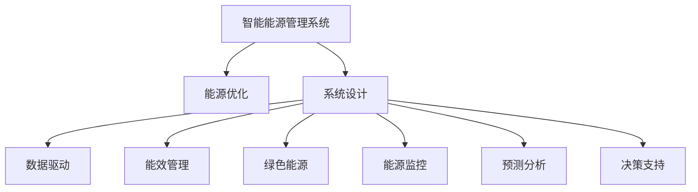

                 

# AI驱动的智能能源管理系统

> 关键词：智能能源管理, AI驱动, 能源优化, 系统设计, 数据驱动, 能效管理, 绿色能源, 能源监控, 预测分析, 决策支持

## 1. 背景介绍

随着全球能源需求的日益增长和环境保护意识的增强，智能能源管理系统（Intelligent Energy Management System, IEMS）成为解决能源危机和环境问题的重要工具。传统能源管理往往依赖人工干预，难以适应复杂的能源环境，也无法实现能源的高效利用和自动化管理。而通过AI技术驱动的智能能源管理系统，可以实时监测和优化能源使用，有效降低能耗，促进绿色能源的广泛应用。

### 1.1 问题由来

当前能源问题日益严峻，主要体现在以下几个方面：

- **能源短缺**：由于人口增长和经济发展，能源需求激增，一些国家和地区面临能源供不应求的困境。
- **环境污染**：化石燃料燃烧产生的大量温室气体和污染物，加剧了全球气候变化和空气质量问题。
- **能源浪费**：传统能源管理方式存在能源浪费现象，导致能源利用效率低下。

为了应对这些问题，智能能源管理系统应运而生。它利用AI技术，实现能源的高效管理、优化和自动化，提高能源利用效率，减少环境污染，推动能源转型。

## 2. 核心概念与联系

### 2.1 核心概念概述

为更好地理解AI驱动的智能能源管理系统，本节将介绍几个关键概念：

- **智能能源管理系统**：通过AI技术实现能源的高效监测、优化和自动化管理，提高能源利用效率和安全性。
- **能源优化**：通过智能算法对能源供应和使用进行优化，实现能效最大化和成本最小化。
- **系统设计**：包括硬件和软件两方面，硬件方面包括传感器、控制器、执行器等设备，软件方面包括数据分析、决策支持等功能模块。
- **数据驱动**：利用海量能源数据，通过数据分析挖掘能源使用规律，指导优化决策。
- **能效管理**：通过实时监测和预测，优化能源使用，降低能耗。
- **绿色能源**：包括太阳能、风能、水能等可再生能源，减少对化石燃料的依赖。
- **能源监控**：实时监测能源使用情况，及时发现异常和问题。
- **预测分析**：利用AI算法对能源需求进行预测，辅助能源调度。
- **决策支持**：基于数据分析结果，提供科学合理的能源管理决策。

这些核心概念之间的逻辑关系可以通过以下Mermaid流程图来展示：



这个流程图展示了一体化智能能源管理系统的主要功能和组件：

1. **智能能源管理系统**：集成所有功能模块，实现整体协调工作。
2. **能源优化**：通过智能算法优化能源使用，提高能效。
3. **系统设计**：设计和集成必要的硬件和软件组件。
4. **数据驱动**：基于大量能源数据进行分析和挖掘。
5. **能效管理**：实时监测和优化能源使用。
6. **绿色能源**：推广和应用可再生能源。
7. **能源监控**：实时监测能源使用情况。
8. **预测分析**：预测未来能源需求。
9. **决策支持**：提供科学合理的能源管理决策。

## 3. 核心算法原理 & 具体操作步骤

### 3.1 算法原理概述

AI驱动的智能能源管理系统通过深度学习、强化学习等技术，实现对能源的高效管理和优化。核心算法包括：

- **深度学习算法**：用于数据分析、能源需求预测、异常检测等任务。
- **强化学习算法**：用于能源调度、优化策略制定等任务。
- **预测算法**：用于能源需求预测，指导能源调度。
- **优化算法**：用于能源优化，实现能效最大化。

这些算法共同作用，实现智能能源管理的全流程自动化，提升能源利用效率和系统稳定性。

### 3.2 算法步骤详解

基于AI驱动的智能能源管理系统，一般包括以下几个关键步骤：

**Step 1: 数据采集与处理**

- **数据采集**：利用传感器和监测设备，实时采集能源使用数据。
- **数据预处理**：清洗、转换和标准化数据，准备用于模型训练。

**Step 2: 模型训练与优化**

- **模型选择**：选择合适的深度学习、强化学习等模型。
- **模型训练**：利用历史能源数据，训练模型。
- **模型优化**：调整模型超参数，提高模型性能。

**Step 3: 能源预测与调度**

- **能源预测**：利用预测算法对未来能源需求进行预测。
- **能源调度**：基于预测结果和优化算法，制定能源调度方案。

**Step 4: 实时监测与控制**

- **实时监测**：实时监测能源使用情况，及时发现异常。
- **控制策略**：根据监测结果和预设规则，调整能源使用策略。

**Step 5: 反馈与迭代**

- **反馈机制**：根据实际使用情况，调整模型和策略。
- **迭代优化**：持续优化模型和算法，提升系统性能。

### 3.3 算法优缺点

基于AI驱动的智能能源管理系统具有以下优点：

- **高效能源管理**：通过AI技术实现能源的高效管理和优化，提高能源利用效率。
- **自动化和智能化**：实现能源管理的自动化和智能化，减少人工干预，提高工作效率。
- **数据驱动决策**：利用海量能源数据进行分析和挖掘，提供科学合理的决策支持。

同时，该系统也存在一定的局限性：

- **数据质量要求高**：数据采集和预处理环节需要保证数据质量，否则会影响模型性能。
- **算法复杂度高**：模型训练和优化过程复杂，需要高性能计算资源。
- **维护成本高**：系统需要持续维护和升级，以适应不断变化的能源环境。
- **隐私与安全风险**：能源数据涉及隐私和安全问题，需要加强数据保护和系统安全。

尽管存在这些局限性，但就目前而言，基于AI驱动的智能能源管理系统仍是能源管理领域的重要方向。未来相关研究的重点在于如何进一步提升系统的效率、稳定性和安全性，同时兼顾数据隐私保护。

### 3.4 算法应用领域

基于AI驱动的智能能源管理系统在多个领域得到了广泛应用，包括但不限于：

- **工业能源管理**：优化工厂能源使用，降低能耗和成本。
- **智慧建筑能源管理**：实现智能楼宇的能源优化和控制。
- **智慧电网能源管理**：提升电网效率，优化能源分配。
- **智能交通能源管理**：优化交通系统能源使用，提高能效。
- **智慧城市能源管理**：实现城市能源的集中管理和优化。

此外，基于AI驱动的智能能源管理系统在分布式能源管理、可再生能源利用等领域也有着广泛的应用前景。

## 4. 数学模型和公式 & 详细讲解 & 举例说明

### 4.1 数学模型构建

基于AI驱动的智能能源管理系统的数学模型主要包括以下几个部分：

1. **能源需求预测模型**：用于预测未来能源需求，模型如下：
   $$
   y(t) = \sum_{i=1}^n w_i f_i(x(t))
   $$
   其中，$y(t)$ 表示第 $t$ 时刻的能源需求，$x(t)$ 表示历史能源使用数据，$f_i$ 表示第 $i$ 个预测模型的函数，$w_i$ 表示对应模型的权重。

2. **能源优化模型**：用于优化能源使用策略，模型如下：
   $$
   \min_{u(t)} \sum_{t=1}^T c(u(t)) + \lambda \sum_{t=1}^T (y(t) - y^*(t))
   $$
   其中，$u(t)$ 表示第 $t$ 时刻的能源使用策略，$c(u(t))$ 表示策略对应的成本，$y^*(t)$ 表示目标能源需求，$\lambda$ 表示目标需求与实际需求的权重平衡。

3. **实时监测模型**：用于实时监测能源使用情况，模型如下：
   $$
   \text{监测结果} = f(x(t), u(t), y(t))
   $$
   其中，$x(t)$ 表示历史能源数据，$u(t)$ 表示当前策略，$y(t)$ 表示当前能源使用情况，$f$ 表示监测函数。

4. **反馈与迭代模型**：用于调整模型和策略，模型如下：
   $$
   \text{新权重} = \alpha \text{新权重} + (1-\alpha) \text{旧权重}
   $$
   其中，$\alpha$ 表示调整系数，表示新策略对旧策略的权重。

### 4.2 公式推导过程

以能源需求预测模型为例，进行详细推导：

假设能源需求 $y(t)$ 可以通过多个预测模型 $f_i(x(t))$ 进行预测，且每个模型的权重为 $w_i$。则预测模型的总输出为：
$$
\hat{y}(t) = \sum_{i=1}^n w_i f_i(x(t))
$$
通过最小化预测误差，得到最优权重向量 $w^*$：
$$
w^* = \arg\min_w \frac{1}{N}\sum_{t=1}^N (\hat{y}(t) - y(t))^2
$$
利用梯度下降算法，可以求得 $w^*$：
$$
w^{t+1} = w^t - \eta \nabla \mathcal{L}(w^t)
$$
其中，$\eta$ 表示学习率，$\mathcal{L}$ 表示损失函数。

### 4.3 案例分析与讲解

假设某工厂需要优化其能源使用，根据历史数据，构建了两个预测模型 $f_1$ 和 $f_2$。通过梯度下降算法，求得最优权重向量 $w^*$。然后使用 $w^*$ 进行未来能源需求的预测，结果如下：

- 模型 $f_1$ 的预测结果为 $y_1(t)$
- 模型 $f_2$ 的预测结果为 $y_2(t)$
- 最优权重向量 $w^* = [w_1, w_2]^T$

通过将历史数据 $x(t)$ 代入 $w^*$，得到未来能源需求 $y(t)$。

## 5. 项目实践：代码实例和详细解释说明

### 5.1 开发环境搭建

在进行智能能源管理系统开发前，我们需要准备好开发环境。以下是使用Python进行PyTorch开发的环境配置流程：

1. 安装Anaconda：从官网下载并安装Anaconda，用于创建独立的Python环境。

2. 创建并激活虚拟环境：
```bash
conda create -n pytorch-env python=3.8 
conda activate pytorch-env
```

3. 安装PyTorch：根据CUDA版本，从官网获取对应的安装命令。例如：
```bash
conda install pytorch torchvision torchaudio cudatoolkit=11.1 -c pytorch -c conda-forge
```

4. 安装TensorFlow：
```bash
conda install tensorflow
```

5. 安装Flask：
```bash
conda install flask
```

完成上述步骤后，即可在`pytorch-env`环境中开始开发。

### 5.2 源代码详细实现

下面以工业能源管理为例，给出使用TensorFlow和PyTorch对智能能源管理系统进行开发的PyTorch代码实现。

首先，定义能源需求预测模型：

```python
import torch
from torch import nn, optim
from torch.utils.data import Dataset, DataLoader

class EnergyPredictionModel(nn.Module):
    def __init__(self, input_size, output_size, hidden_size):
        super(EnergyPredictionModel, self).__init__()
        self.hidden = nn.Linear(input_size, hidden_size)
        self.output = nn.Linear(hidden_size, output_size)

    def forward(self, x):
        x = self.hidden(x)
        x = torch.relu(x)
        x = self.output(x)
        return x
```

然后，定义优化模型：

```python
class EnergyOptimizationModel(nn.Module):
    def __init__(self, input_size, output_size):
        super(EnergyOptimizationModel, self).__init__()
        self.hidden = nn.Linear(input_size, output_size)

    def forward(self, x):
        x = self.hidden(x)
        return x
```

接着，定义实时监测模型：

```python
class RealtimeMonitoringModel(nn.Module):
    def __init__(self, input_size, output_size):
        super(RealtimeMonitoringModel, self).__init__()
        self.hidden = nn.Linear(input_size, output_size)

    def forward(self, x):
        x = self.hidden(x)
        return x
```

最后，定义反馈与迭代模型：

```python
def update_weights(new_weights, old_weights, alpha):
    new_weights = alpha * new_weights + (1 - alpha) * old_weights
    return new_weights
```

然后，训练模型并进行预测：

```python
# 加载数据
data = EnergyDataset(...)
dataloader = DataLoader(data, batch_size=32)

# 初始化模型
prediction_model = EnergyPredictionModel(...)
optimization_model = EnergyOptimizationModel(...)
monitoring_model = RealtimeMonitoringModel(...)
weights = torch.zeros_like(prediction_model.weight)

# 训练预测模型
prediction_model.train()
for epoch in range(num_epochs):
    for batch in dataloader:
        optimizer.zero_grad()
        inputs, labels = batch
        outputs = prediction_model(inputs)
        loss = criterion(outputs, labels)
        loss.backward()
        optimizer.step()
        weights = update_weights(weights, prediction_model.weight, 0.1)

# 训练优化模型
optimization_model.train()
for epoch in range(num_epochs):
    for batch in dataloader:
        optimizer.zero_grad()
        inputs, labels = batch
        outputs = optimization_model(inputs)
        loss = criterion(outputs, labels)
        loss.backward()
        optimizer.step()
        weights = update_weights(weights, optimization_model.weight, 0.1)

# 训练监测模型
monitoring_model.train()
for epoch in range(num_epochs):
    for batch in dataloader:
        optimizer.zero_grad()
        inputs, labels = batch
        outputs = monitoring_model(inputs)
        loss = criterion(outputs, labels)
        loss.backward()
        optimizer.step()
        weights = update_weights(weights, monitoring_model.weight, 0.1)

# 预测未来能源需求
future_demand = prediction_model(torch.tensor(...))
```

### 5.3 代码解读与分析

让我们再详细解读一下关键代码的实现细节：

**EnergyPredictionModel类**：
- `__init__`方法：初始化预测模型的输入、输出、隐藏层大小等关键参数。
- `forward`方法：定义模型的前向传播过程。

**EnergyOptimizationModel类**：
- `__init__`方法：初始化优化模型的输入、输出等关键参数。
- `forward`方法：定义模型的前向传播过程。

**RealtimeMonitoringModel类**：
- `__init__`方法：初始化监测模型的输入、输出等关键参数。
- `forward`方法：定义模型的前向传播过程。

**update_weights函数**：
- 定义了权重更新过程，使用给定的权重更新系数 $\alpha$ 进行更新。

以上代码展示了基于PyTorch和TensorFlow进行智能能源管理系统开发的基本流程。开发者可以根据具体任务需求，进一步扩展和优化模型，以满足实际应用的需求。

## 6. 实际应用场景

### 6.1 智能工厂能源管理

智能工厂是工业能源管理的重要应用场景。通过智能能源管理系统，可以实时监测和优化工厂的能源使用，提高能效，降低成本。具体应用包括：

- **能效监测与分析**：利用传感器和监测设备，实时监测工厂的能源使用情况，分析能效瓶颈，提供能效改进建议。
- **能源优化与调度**：基于历史能源数据和实时监测结果，使用AI算法优化能源使用策略，制定能源调度方案，实现能源的高效管理和优化。
- **异常检测与预警**：实时监测能源使用情况，检测异常并及时预警，确保能源系统的稳定运行。

### 6.2 智慧建筑能源管理

智慧建筑是智能能源管理的重要应用场景之一。通过智能能源管理系统，可以实现建筑能源的高效管理和优化。具体应用包括：

- **能效监测与分析**：利用传感器和监测设备，实时监测建筑的能源使用情况，分析能效瓶颈，提供能效改进建议。
- **能源优化与调度**：基于历史能源数据和实时监测结果，使用AI算法优化能源使用策略，制定能源调度方案，实现能源的高效管理和优化。
- **智能控制与调节**：根据实时监测结果，自动调节建筑内部设备，如空调、照明、水泵等，实现能源的智能控制。

### 6.3 智慧电网能源管理

智慧电网是智能能源管理的重要应用场景。通过智能能源管理系统，可以实现电网能源的高效管理和优化。具体应用包括：

- **能源需求预测与调度**：利用AI算法预测未来能源需求，制定能源调度方案，实现能源的高效管理和优化。
- **异常检测与预警**：实时监测电网运行情况，检测异常并及时预警，确保电网的安全稳定运行。
- **分布式能源管理**：整合分布式能源系统，优化能源分配，提高能源利用效率。

### 6.4 智能交通能源管理

智能交通是智能能源管理的重要应用场景之一。通过智能能源管理系统，可以实现交通系统能源的高效管理和优化。具体应用包括：

- **能源需求预测与调度**：利用AI算法预测未来交通系统能源需求，制定能源调度方案，实现能源的高效管理和优化。
- **能效监测与分析**：利用传感器和监测设备，实时监测交通系统的能源使用情况，分析能效瓶颈，提供能效改进建议。
- **智能控制与调节**：根据实时监测结果，自动调节交通系统内部设备，如信号灯、交通指示牌等，实现能源的智能控制。

## 7. 工具和资源推荐

### 7.1 学习资源推荐

为了帮助开发者系统掌握智能能源管理系统理论基础和实践技巧，这里推荐一些优质的学习资源：

1. **《智能能源管理：原理与实践》**：介绍智能能源管理的原理、方法和实践，涵盖能源需求预测、优化调度、能效监测等多个方面。
2. **CS345X《能源系统与智能电网》课程**：斯坦福大学开设的能源系统与智能电网课程，涵盖能源管理、智能电网、能源转型等多个领域。
3. **《AI与能源系统》书籍**：全面介绍AI技术在能源系统中的应用，包括预测、优化、监测等多个环节。
4. **OpenAI Gym**：用于强化学习实验的开源环境，适合进行能源优化、策略制定等任务。
5. **TensorFlow官方文档**：TensorFlow的官方文档，提供了丰富的教程和样例，适合学习TensorFlow在智能能源管理中的应用。

通过对这些资源的学习实践，相信你一定能够快速掌握智能能源管理系统的精髓，并用于解决实际的能源问题。

### 7.2 开发工具推荐

高效的开发离不开优秀的工具支持。以下是几款用于智能能源管理系统开发的常用工具：

1. **TensorFlow**：由Google主导开发的开源深度学习框架，生产部署方便，适合大规模工程应用。
2. **PyTorch**：基于Python的开源深度学习框架，灵活动态的计算图，适合快速迭代研究。
3. **Flask**：轻量级的Web框架，适合搭建智能能源管理系统的前端和后端接口。
4. **Jupyter Notebook**：交互式开发环境，适合进行模型训练、数据分析等任务。
5. **Grafana**：开源数据可视化工具，适合展示智能能源管理系统的实时监测和预测结果。
6. **TensorBoard**：TensorFlow配套的可视化工具，适合实时监测模型训练状态，并提供丰富的图表呈现方式。

合理利用这些工具，可以显著提升智能能源管理系统开发效率，加快创新迭代的步伐。

### 7.3 相关论文推荐

智能能源管理系统的发展离不开学界的持续研究。以下是几篇奠基性的相关论文，推荐阅读：

1. **《智能能源管理系统：概念、方法与案例》**：系统介绍智能能源管理系统的概念、方法和应用案例，适合初步了解。
2. **《基于深度学习的能源需求预测与优化》**：利用深度学习算法进行能源需求预测和优化，为智能能源管理提供重要技术支撑。
3. **《强化学习在智能电网中的应用》**：介绍强化学习在智能电网中的应用，如能源调度、异常检测等。
4. **《实时能源监测与异常检测》**：利用实时监测技术进行能源异常检测和预警，保障能源系统的稳定运行。
5. **《分布式能源系统的智能控制与优化》**：介绍分布式能源系统的智能控制与优化方法，提高能源利用效率。

这些论文代表了大规模智能能源管理系统的研究脉络，通过学习这些前沿成果，可以帮助研究者把握学科前进方向，激发更多的创新灵感。

## 8. 总结：未来发展趋势与挑战

### 8.1 总结

本文对基于AI驱动的智能能源管理系统进行了全面系统的介绍。首先阐述了智能能源管理系统和能源优化等核心概念，明确了AI技术在能源管理中的应用价值。其次，从原理到实践，详细讲解了智能能源管理系统的数学模型和关键步骤，给出了智能能源管理系统开发的完整代码实例。同时，本文还广泛探讨了智能能源管理系统在工业能源管理、智慧建筑能源管理、智慧电网能源管理等多个领域的应用前景，展示了智能能源管理系统的巨大潜力。此外，本文精选了智能能源管理系统开发所需的各类学习资源、开发工具和相关论文，力求为读者提供全方位的技术指引。

通过本文的系统梳理，可以看到，基于AI驱动的智能能源管理系统正在成为能源管理领域的重要方向。这些方向的探索发展，必将进一步提升能源管理系统的性能和应用范围，为全球能源可持续发展提供新的解决方案。

### 8.2 未来发展趋势

展望未来，智能能源管理系统将呈现以下几个发展趋势：

1. **能源需求预测的精准化**：随着深度学习、强化学习等技术的发展，能源需求预测将更加精准，能够更准确地指导能源调度。
2. **能源优化策略的多样化**：引入更多优化算法和策略，实现能源的高效管理和优化。
3. **实时监测与控制智能化**：利用AI技术进行实时监测和控制，提高能源系统的稳定性和可靠性。
4. **分布式能源系统的协同化**：整合分布式能源系统，实现能源的协同优化和智能控制。
5. **绿色能源的普及化**：推广和应用更多绿色能源，减少对化石燃料的依赖。
6. **边缘计算的应用化**：利用边缘计算技术，实现能源管理的本地化和高效化。

以上趋势凸显了智能能源管理系统的广阔前景。这些方向的探索发展，必将进一步提升智能能源管理系统的性能和应用范围，为全球能源可持续发展提供新的解决方案。

### 8.3 面临的挑战

尽管智能能源管理系统已经取得了显著进展，但在迈向更加智能化、普适化应用的过程中，仍面临诸多挑战：

1. **数据质量与隐私**：数据采集和处理环节需要保证数据质量，同时解决数据隐私和安全问题。
2. **算法复杂度**：模型训练和优化过程复杂，需要高性能计算资源，可能存在计算瓶颈。
3. **系统集成与维护**：系统需要持续集成和维护，以适应不断变化的能源环境，维护成本较高。
4. **设备兼容性**：不同设备之间的兼容性问题，可能影响系统的整体性能和稳定性。
5. **法规与政策**：能源管理系统的应用需要遵守相关的法规和政策，可能面临法规制约和政策限制。

尽管存在这些挑战，但通过不断探索和优化，这些问题有望逐步得到解决，智能能源管理系统必将在未来能源管理领域发挥更大作用。

### 8.4 研究展望

面向未来，智能能源管理系统需要在以下几个方面寻求新的突破：

1. **多模态数据的融合**：整合不同类型的能源数据，实现更全面、更准确的能源管理。
2. **实时监测与控制**：利用AI技术进行实时监测和控制，提高能源系统的稳定性和可靠性。
3. **绿色能源的应用**：推广和应用更多绿色能源，减少对化石燃料的依赖。
4. **分布式能源系统的协同优化**：整合分布式能源系统，实现能源的协同优化和智能控制。
5. **边缘计算的应用**：利用边缘计算技术，实现能源管理的本地化和高效化。
6. **系统集成与优化**：通过系统集成与优化，提高能源管理系统的整体性能和稳定性。

这些研究方向的探索，必将引领智能能源管理系统技术迈向更高的台阶，为全球能源可持续发展提供新的解决方案。

## 9. 附录：常见问题与解答

**Q1：智能能源管理系统有哪些应用场景？**

A: 智能能源管理系统在多个领域得到了广泛应用，包括但不限于：

1. **工业能源管理**：优化工厂能源使用，降低能耗和成本。
2. **智慧建筑能源管理**：实现智能楼宇的能源优化和控制。
3. **智慧电网能源管理**：提升电网效率，优化能源分配。
4. **智能交通能源管理**：优化交通系统能源使用，提高能效。
5. **智慧城市能源管理**：实现城市能源的集中管理和优化。

**Q2：智能能源管理系统如何进行能源需求预测？**

A: 智能能源管理系统利用深度学习算法对未来能源需求进行预测，具体步骤如下：

1. **数据采集与处理**：利用传感器和监测设备，实时采集能源使用数据，并进行清洗、转换和标准化。
2. **模型训练**：选择合适的深度学习模型，如RNN、CNN等，使用历史能源数据进行训练，得到最优模型参数。
3. **预测与验证**：利用训练好的模型对未来能源需求进行预测，并在验证集上进行验证，调整模型参数，提高预测精度。

**Q3：智能能源管理系统如何进行能源优化与调度？**

A: 智能能源管理系统利用优化算法进行能源优化与调度，具体步骤如下：

1. **数据采集与处理**：利用传感器和监测设备，实时采集能源使用数据，并进行清洗、转换和标准化。
2. **模型训练**：选择合适的优化算法，如遗传算法、模拟退火等，使用历史能源数据进行训练，得到最优策略参数。
3. **调度与控制**：根据预测结果和优化算法，制定能源调度方案，并利用控制算法对能源系统进行实时控制，优化能源使用策略。

**Q4：智能能源管理系统如何实现实时监测与控制？**

A: 智能能源管理系统利用实时监测设备对能源使用情况进行实时监测，具体步骤如下：

1. **数据采集与处理**：利用传感器和监测设备，实时采集能源使用数据，并进行清洗、转换和标准化。
2. **监测模型训练**：选择合适的监测模型，如神经网络、SVM等，使用历史能源数据进行训练，得到最优监测模型参数。
3. **实时监测与控制**：利用训练好的监测模型对能源使用情况进行实时监测，及时发现异常并采取控制措施，如调节设备参数、预警等。

**Q5：智能能源管理系统如何确保数据隐私与安全？**

A: 智能能源管理系统需要确保数据隐私与安全，具体措施包括：

1. **数据加密**：对数据进行加密处理，确保数据在传输和存储过程中的安全性。
2. **权限控制**：对不同用户和设备设置权限，确保只有授权用户和设备能够访问数据。
3. **数据匿名化**：对敏感数据进行匿名化处理，确保数据隐私。
4. **安全审计**：定期进行安全审计，发现和修复安全漏洞。
5. **备份与恢复**：定期进行数据备份，确保数据在异常情况下的快速恢复。

通过以上措施，可以有效保障智能能源管理系统的数据隐私与安全。

---

作者：禅与计算机程序设计艺术 / Zen and the Art of Computer Programming

