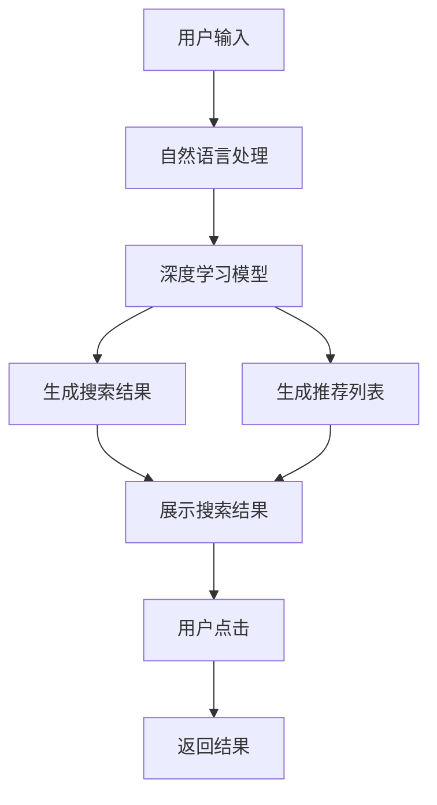

                 

# AI驱动的电商个性化搜索建议实时生成系统

> 关键词：电商搜索、个性化推荐、深度学习、自然语言处理、实时生成系统

## 1. 背景介绍

### 1.1 问题由来
在电商行业中，搜索体验直接影响用户的购物满意度。优秀的个性化搜索建议系统，能够迅速定位用户需求，并提供精准的商品推荐，极大地提升用户满意度和转化率。然而，传统的搜索推荐系统往往依赖于关键字匹配和静态模型，无法适应实时变化的购物场景和个性化需求。

近年来，人工智能技术的迅猛发展，特别是深度学习和自然语言处理(NLP)技术的突破，为电商个性化搜索建议系统带来了新的解决方案。通过深度学习模型，实时捕捉用户输入和历史行为数据，并结合自然语言处理技术，可以构建高性能的个性化搜索建议系统，显著改善电商平台的搜索体验。

### 1.2 问题核心关键点
基于深度学习和大规模语言模型的电商个性化搜索建议系统，其核心关键点包括：

1. **用户输入理解**：通过自然语言处理技术，实时理解用户的搜索意图和查询语义。
2. **个性化推荐**：结合用户的历史行为数据和搜索行为数据，动态生成个性化的商品推荐列表。
3. **实时性**：在用户搜索输入的瞬间，快速生成并返回搜索结果和推荐，无需等待服务器响应。
4. **泛化能力**：系统应具备较强的泛化能力，能够适应不同类型和场景的搜索需求。
5. **可扩展性**：能够快速扩展以支持大规模用户并发请求，同时保证系统性能。

### 1.3 问题研究意义
构建基于深度学习和大规模语言模型的电商个性化搜索建议系统，对电商行业具有重要的意义：

1. **提升搜索体验**：通过实时、精准的个性化搜索建议，提高用户的搜索效率和满意度，增加购物转化率。
2. **优化商品展示**：动态生成个性化商品推荐，优化商品展示和排名，提升用户粘性和留存率。
3. **数据驱动决策**：利用用户搜索数据进行精细化运营，制定更为精准的市场营销策略。
4. **技术创新**：推动深度学习、自然语言处理等AI技术的商业化应用，加速电商行业智能化转型。
5. **增强竞争力**：构建高性能的个性化搜索建议系统，形成技术壁垒，增强企业在市场中的竞争优势。

## 2. 核心概念与联系

### 2.1 核心概念概述

为了深入理解AI驱动的电商个性化搜索建议系统的设计原理和实现机制，本节将介绍一些核心概念：

- **深度学习模型**：通过多层次的非线性变换，从大量数据中学习到复杂的特征表示，适用于处理各种类型的电商搜索和推荐任务。
- **自然语言处理(NLP)**：通过自然语言处理技术，提取和理解用户的输入查询语义，是实现个性化搜索建议的关键技术之一。
- **注意力机制(Attention Mechanism)**：在深度学习模型中，通过计算输入数据间的注意力权重，突出了重要的特征信息，提升了模型的表达能力。
- **序列到序列(Seq2Seq)模型**：在自然语言处理任务中，常用于将输入序列映射到输出序列，如生成搜索结果、推荐列表等。
- **实时生成系统**：系统应具备高实时性，能够在用户输入瞬间生成并返回搜索结果和推荐，提升了用户体验。
- **个性化推荐系统**：结合用户行为数据和搜索行为数据，实时生成个性化的商品推荐，提高了推荐的精准度。

这些核心概念之间存在紧密联系，共同构建了电商个性化搜索建议系统的技术框架。

### 2.2 核心概念原理和架构的 Mermaid 流程图(Mermaid 流程节点中不要有括号、逗号等特殊字符)



这个流程图展示了电商个性化搜索建议系统的核心流程：

1. 用户输入通过自然语言处理模块提取语义信息。
2. 语义信息进入深度学习模型进行特征提取和相似度计算。
3. 基于深度学习模型的搜索结果和推荐列表生成。
4. 生成的结果展示给用户，并根据用户反馈进行迭代优化。

## 3. 核心算法原理 & 具体操作步骤
### 3.1 算法原理概述

基于深度学习和自然语言处理的电商个性化搜索建议系统，其核心算法原理可概括为以下几点：

1. **用户意图理解**：通过自然语言处理技术，将用户的搜索查询转化为可处理的语义向量，用于后续的相似度计算。
2. **相似度计算**：利用深度学习模型，计算用户查询与商品标题、描述等文本数据的相似度，排序生成搜索结果。
3. **推荐算法**：结合用户的历史行为数据和当前搜索行为，生成个性化的商品推荐列表。
4. **实时生成**：在用户输入瞬间，通过在线推理引擎快速生成搜索结果和推荐，无需等待服务器响应。

### 3.2 算法步骤详解

以下是基于深度学习和自然语言处理的电商个性化搜索建议系统的具体操作步骤：

1. **数据准备**：收集用户的搜索历史、浏览历史、购买历史等数据，以及商品标题、描述等文本数据。
2. **模型训练**：使用深度学习模型（如Seq2Seq、Transformer等）进行训练，学习商品和用户数据的特征表示。
3. **意图理解**：通过自然语言处理技术，提取和理解用户搜索查询的语义信息，生成语义向量。
4. **相似度计算**：将用户查询的语义向量与商品文本数据的向量表示进行相似度计算，排序生成搜索结果。
5. **推荐生成**：结合用户历史数据和当前搜索行为，使用推荐算法生成个性化商品推荐列表。
6. **实时生成**：在用户输入瞬间，通过在线推理引擎快速生成并返回搜索结果和推荐。
7. **迭代优化**：根据用户反馈和点击行为，不断优化模型和推荐算法。

### 3.3 算法优缺点

基于深度学习和自然语言处理的电商个性化搜索建议系统，具有以下优点：

1. **实时响应**：通过在线推理引擎，能够在用户输入瞬间生成并返回结果，提升用户体验。
2. **个性化推荐**：结合用户历史行为和当前搜索行为，生成高度个性化的商品推荐，提高推荐精准度。
3. **高效计算**：深度学习模型的高效特征提取和相似度计算，能够快速处理大规模数据。
4. **泛化能力**：模型具备较强的泛化能力，能够适应不同类型和场景的搜索需求。

然而，该系统也存在一些局限性：

1. **高昂成本**：深度学习模型的训练和优化需要大量数据和计算资源。
2. **复杂度**：模型结构复杂，部署和维护难度较大。
3. **可解释性不足**：深度学习模型通常具有"黑盒"特性，难以解释其内部工作机制。
4. **冷启动问题**：对于新用户，由于缺乏历史行为数据，推荐效果可能较差。

### 3.4 算法应用领域

基于深度学习和自然语言处理的电商个性化搜索建议系统，主要应用于以下领域：

1. **电商平台**：如淘宝、京东、亚马逊等，通过个性化搜索建议提升用户购物体验和转化率。
2. **在线零售**：如全球速卖通、eBay等，通过实时推荐提升商品展示效果和用户满意度。
3. **移动应用**：如美团、大众点评等，通过个性化搜索建议优化用户体验和产品推荐。
4. **广告投放**：通过用户搜索数据优化广告投放策略，提升广告效果和投放精准度。

## 4. 数学模型和公式 & 详细讲解 & 举例说明

### 4.1 数学模型构建

为了构建电商个性化搜索建议系统，我们将引入以下数学模型和公式：

1. **用户查询向量**：将用户输入的搜索查询转化为高维向量表示。
2. **商品向量**：将商品标题、描述等文本数据转化为向量表示。
3. **相似度矩阵**：计算用户查询向量与商品向量的相似度，生成排序结果。
4. **推荐列表生成**：结合用户历史数据和当前行为，生成个性化商品推荐列表。

### 4.2 公式推导过程

假设用户输入的搜索查询为 $q$，商品标题和描述为 $d_i$，用户历史行为数据为 $h$。我们首先通过自然语言处理技术，将用户查询转化为向量表示 $\vec{q}$，然后将商品文本转化为向量表示 $\vec{d_i}$。

基于深度学习模型的相似度计算公式为：

$$
\text{similarity}(q, d_i) = \frac{\vec{q} \cdot \vec{d_i}}{\|\vec{q}\| \|\vec{d_i}\|}
$$

其中 $\cdot$ 表示向量点积，$\|\cdot\|$ 表示向量范数。根据相似度计算结果，对商品进行排序生成搜索结果。

结合用户历史行为数据 $h$ 和当前搜索行为 $b$，我们可以使用基于协同过滤的推荐算法，生成个性化推荐列表 $r$：

$$
r_i = f(\vec{h}, \vec{b}, \vec{d_i})
$$

其中 $f$ 表示推荐算法函数，具体可以是基于矩阵分解、深度学习等方法。

### 4.3 案例分析与讲解

为了更直观地理解上述模型和公式，我们以一个简单的电商搜索场景为例进行详细讲解：

假设用户输入搜索查询为 "黑色运动鞋"，商品标题为 "Nike Air Max 2021 Black"，用户历史行为数据为 "购买了一双黑色运动鞋"，当前搜索行为为 "浏览了多个运动鞋分类"。

首先，通过自然语言处理技术将用户查询转化为向量表示 $\vec{q} = [0.5, 0.3, 0.2, ...]$。

然后，将商品标题 "Nike Air Max 2021 Black" 转化为向量表示 $\vec{d_i} = [0.8, 0.4, 0.3, ...]$。

计算相似度得到 $\text{similarity}(q, d_i) = 0.8$，因此商品 "Nike Air Max 2021 Black" 排第一位。

接着，结合用户历史行为数据和当前搜索行为，使用协同过滤推荐算法生成个性化推荐列表 $r = [\text{Nike Air Max 2021 Black}, \text{Adidas Ultraboost 2021 Black}, ...]$。

最终，系统返回搜索结果和推荐列表，用户看到推荐的黑色运动鞋，可能进一步点击购买。

## 5. 项目实践：代码实例和详细解释说明
### 5.1 开发环境搭建

在进行项目实践前，我们需要准备好开发环境。以下是使用Python进行深度学习开发的环境配置流程：

1. 安装Anaconda：从官网下载并安装Anaconda，用于创建独立的Python环境。

2. 创建并激活虚拟环境：
```bash
conda create -n ai-search python=3.8 
conda activate ai-search
```

3. 安装PyTorch：根据CUDA版本，从官网获取对应的安装命令。例如：
```bash
conda install pytorch torchvision torchaudio cudatoolkit=11.1 -c pytorch -c conda-forge
```

4. 安装TensorFlow：
```bash
conda install tensorflow tensorflow-io tensorflow-addons
```

5. 安装nltk和spaCy：
```bash
pip install nltk spacy
```

6. 安装Flask：用于搭建Web服务。
```bash
pip install flask
```

完成上述步骤后，即可在`ai-search`环境中开始项目实践。

### 5.2 源代码详细实现

下面我们以一个简单的电商搜索推荐系统为例，给出使用深度学习和大规模语言模型进行电商个性化搜索建议的PyTorch代码实现。

首先，定义自然语言处理模块：

```python
import spacy
from spacy.lang.en import English
from sklearn.feature_extraction.text import TfidfVectorizer

# 初始化SpaCy模型
nlp = English()

# 定义特征提取器
tfidf = TfidfVectorizer(stop_words='english')
```

然后，定义深度学习模型：

```python
import torch
from torch import nn
from torch.nn import Embedding, GRU

# 定义深度学习模型
class SearchModel(nn.Module):
    def __init__(self, vocab_size, embedding_dim, hidden_size):
        super(SearchModel, self).__init__()
        self.embedding = nn.Embedding(vocab_size, embedding_dim)
        self.gru = nn.GRU(embedding_dim, hidden_size)
        self.fc = nn.Linear(hidden_size, vocab_size)
    
    def forward(self, x):
        embedded = self.embedding(x)
        output, _ = self.gru(embedded)
        return self.fc(output)
```

接着，定义相似度计算和推荐生成函数：

```python
import numpy as np

def similarity_vector(query, doc):
    query = tfidf.transform([query])[0].toarray()
    doc = tfidf.transform([doc])[0].toarray()
    return np.dot(query, doc)

def generate_recommendations(user_query, user_browsed, user_bought, docs):
    # 计算相似度
    similarity = np.zeros(len(docs))
    for i, doc in enumerate(docs):
        similarity[i] = similarity_vector(user_query, doc)
    # 排序生成推荐列表
    top_k = np.argsort(similarity)[-5:]  # 取出最相关的5个文档
    recommendations = [docs[i] for i in top_k]
    return recommendations
```

最后，启动Web服务并处理请求：

```python
from flask import Flask, request, jsonify

app = Flask(__name__)

@app.route('/search', methods=['POST'])
def search():
    user_query = request.form['query']
    user_browsed = request.form['browsed']
    user_bought = request.form['bought']
    docs = request.form['docs'].split(',')
    
    recommendations = generate_recommendations(user_query, user_browsed, user_bought, docs)
    
    return jsonify({'results': recommendations})

if __name__ == '__main__':
    app.run(debug=True)
```

以上就是使用PyTorch和Flask搭建电商个性化搜索推荐系统的完整代码实现。

### 5.3 代码解读与分析

让我们再详细解读一下关键代码的实现细节：

**SpaCy模型**：
- 使用SpaCy库对用户查询进行分词和词性标注，提取关键词。

**特征提取器**：
- 使用TfidfVectorizer对商品标题和描述进行特征提取，构建词袋模型。

**深度学习模型**：
- 定义一个简单的GRU模型，将查询向量输入，输出到词汇空间，用于计算相似度。

**相似度计算**：
- 通过TfidfVectorizer计算用户查询与商品标题和描述的相似度，生成排序结果。

**推荐生成**：
- 根据用户历史行为数据和当前搜索行为，排序生成个性化商品推荐列表。

**Web服务**：
- 使用Flask框架搭建Web服务，接收用户请求并返回搜索结果和推荐。

## 6. 实际应用场景
### 6.1 智能客服系统

电商平台的智能客服系统可以通过个性化搜索建议，提升客户咨询体验。客服系统能够理解用户的搜索意图，生成推荐商品列表，提供更多可选信息。例如，用户查询 "黑色运动鞋"，系统推荐 "Nike Air Max 2021 Black"，客户点击查询详细信息后，客服系统可以进一步提供优惠信息或推荐相似商品。

### 6.2 个性化推荐系统

电商平台可以基于用户的搜索历史和行为数据，动态生成个性化推荐商品列表。例如，用户浏览过 "Nike Air Max 2021"，查询 "黑色运动鞋"，系统推荐相关商品列表，提升用户购买意向和满意度。

### 6.3 广告投放优化

电商平台可以结合用户搜索行为数据，优化广告投放策略。例如，根据用户搜索 "黑色运动鞋"，投放与黑色运动鞋相关的广告，提升广告效果和投放精准度。

### 6.4 未来应用展望

随着深度学习和大规模语言模型的不断发展，基于电商个性化搜索建议的系统将不断演进，具备更强的泛化能力和实时性。未来可能的应用场景包括：

1. **多模态搜索**：结合图像、视频等多模态数据，提升搜索体验。
2. **跨语言搜索**：支持多种语言的搜索查询，提升全球市场覆盖度。
3. **多用户协同**：利用社交网络数据，推荐热门商品，提升用户互动和粘性。
4. **主动推荐**：结合用户实时行为，主动推送相关商品，提升购物体验。
5. **知识图谱融合**：结合商品知识图谱，生成更加精准的推荐结果。

## 7. 工具和资源推荐
### 7.1 学习资源推荐

为了帮助开发者系统掌握电商个性化搜索建议系统的设计和实现，这里推荐一些优质的学习资源：

1. 《深度学习理论与实践》书籍：全面介绍了深度学习的基本原理和应用，适合初学者入门。
2. 《TensorFlow实战》书籍：介绍了TensorFlow的基本用法和实战案例，帮助开发者深入理解深度学习模型。
3. CS224n《自然语言处理与深度学习》课程：斯坦福大学开设的NLP明星课程，讲解了自然语言处理和深度学习的基础知识。
4. HuggingFace官方文档：提供了丰富的预训练模型和代码示例，帮助开发者快速上手。
5. ArXiv预印本：获取最新的深度学习和自然语言处理研究论文，保持技术前沿。

通过对这些资源的学习实践，相信你一定能够快速掌握电商个性化搜索建议系统的设计和实现，并应用于实际项目中。

### 7.2 开发工具推荐

高效的开发离不开优秀的工具支持。以下是几款用于电商个性化搜索建议系统开发的常用工具：

1. PyTorch：基于Python的开源深度学习框架，适用于构建深度学习模型。
2. TensorFlow：由Google主导开发的开源深度学习框架，生产部署方便。
3. Flask：轻量级的Web框架，适用于搭建API服务。
4. TensorBoard：TensorFlow配套的可视化工具，帮助调试和优化模型。
5. Weights & Biases：模型训练的实验跟踪工具，记录和可视化模型训练过程。

合理利用这些工具，可以显著提升电商个性化搜索建议系统的开发效率，加快创新迭代的步伐。

### 7.3 相关论文推荐

电商个性化搜索建议系统的设计和发展，离不开学界的持续研究。以下是几篇奠基性的相关论文，推荐阅读：

1. Attention is All You Need：提出了Transformer结构，开启了NLP领域的预训练大模型时代。
2. Transformer-XL: Attentive Language Models Beyond a Fixed-Length Context：引入了Transformer-XL模型，能够处理变长上下文信息。
3. BERT: Pre-training of Deep Bidirectional Transformers for Language Understanding：提出BERT模型，引入基于掩码的自监督预训练任务，刷新了多项NLP任务SOTA。
4. Sequence to Sequence Learning with Neural Networks：提出了Seq2Seq模型，用于处理序列到序列的任务，如生成搜索结果、推荐列表等。
5. Generative Adversarial Networks：引入了生成对抗网络，用于生成伪造的推荐结果，用于测试模型的鲁棒性。

这些论文代表了大语言模型和电商个性化搜索建议系统的研究脉络，通过学习这些前沿成果，可以帮助研究者把握学科前进方向，激发更多的创新灵感。

## 8. 总结：未来发展趋势与挑战
### 8.1 研究成果总结

本文对基于深度学习和自然语言处理的电商个性化搜索建议系统进行了全面系统的介绍。首先阐述了电商个性化搜索建议系统的背景和意义，明确了系统在提升用户体验和购物转化率方面的独特价值。其次，从原理到实践，详细讲解了电商个性化搜索建议系统的设计思路和实现流程，给出了电商个性化搜索建议系统的完整代码实例。同时，本文还探讨了电商个性化搜索建议系统在智能客服、个性化推荐、广告投放等场景中的应用前景，展示了电商个性化搜索建议系统的广阔应用前景。

通过本文的系统梳理，可以看到，基于深度学习和自然语言处理的电商个性化搜索建议系统正在成为电商平台的重要技术支撑，极大地提升了用户购物体验和平台转化率。未来，伴随深度学习和大规模语言模型的不断演进，基于电商个性化搜索建议的系统将不断演进，为电商平台带来更多创新和价值。

### 8.2 未来发展趋势

展望未来，电商个性化搜索建议系统将呈现以下几个发展趋势：

1. **多模态融合**：结合图像、视频等多模态数据，提升搜索体验和推荐效果。
2. **跨语言支持**：支持多种语言的搜索查询，提升全球市场覆盖度。
3. **多用户协同**：利用社交网络数据，提升用户互动和粘性。
4. **主动推荐**：结合用户实时行为，主动推送相关商品，提升购物体验。
5. **知识图谱融合**：结合商品知识图谱，生成更加精准的推荐结果。

这些趋势将进一步推动电商个性化搜索建议系统的性能和应用范围，为电商平台带来更多创新和价值。

### 8.3 面临的挑战

尽管电商个性化搜索建议系统已经取得了显著进展，但在迈向更加智能化、普适化应用的过程中，仍面临诸多挑战：

1. **计算资源瓶颈**：大规模深度学习模型的训练和推理需要大量的计算资源，如何降低计算成本，提升模型性能，是一个重要课题。
2. **实时性问题**：如何在用户输入瞬间快速生成搜索结果和推荐，是一个技术难题。
3. **冷启动问题**：对于新用户，由于缺乏历史行为数据，推荐效果可能较差。
4. **数据隐私问题**：如何保护用户隐私，防止数据泄露，是一个重要的伦理和法律问题。

### 8.4 研究展望

面对电商个性化搜索建议系统所面临的挑战，未来的研究需要在以下几个方面寻求新的突破：

1. **轻量级模型**：开发更加轻量级、高效能的深度学习模型，降低计算成本，提升实时性。
2. **推荐算法改进**：改进推荐算法，提升推荐效果，增强用户粘性。
3. **跨语言技术**：研究跨语言技术，支持多语言搜索和推荐，提升全球市场竞争力。
4. **隐私保护技术**：研究数据隐私保护技术，保护用户隐私，提升系统可信度。
5. **智能客服技术**：结合智能客服技术，提升用户咨询体验和购物转化率。

这些研究方向将推动电商个性化搜索建议系统的不断演进，为电商平台带来更多创新和价值。

## 9. 附录：常见问题与解答

**Q1：电商个性化搜索建议系统的核心技术是什么？**

A: 电商个性化搜索建议系统的核心技术包括自然语言处理、深度学习和推荐算法。通过自然语言处理技术，提取和理解用户搜索查询的语义信息；通过深度学习模型，提取商品和用户数据的特征表示；通过推荐算法，生成个性化商品推荐列表。

**Q2：电商个性化搜索建议系统如何处理用户输入？**

A: 电商个性化搜索建议系统通过自然语言处理技术，将用户输入的搜索查询转化为向量表示，用于后续的相似度计算和推荐生成。

**Q3：电商个性化搜索建议系统如何处理商品数据？**

A: 电商个性化搜索建议系统将商品标题、描述等文本数据转化为向量表示，用于计算与用户查询的相似度，排序生成搜索结果。

**Q4：电商个性化搜索建议系统如何生成推荐列表？**

A: 电商个性化搜索建议系统结合用户历史行为数据和当前搜索行为，使用推荐算法生成个性化商品推荐列表。

**Q5：电商个性化搜索建议系统如何应对大规模数据？**

A: 电商个性化搜索建议系统通过在线推理引擎和并行计算技术，能够在用户输入瞬间生成并返回搜索结果和推荐，提升用户体验。

总之，电商个性化搜索建议系统需要自然语言处理、深度学习和推荐算法等多领域的深度融合，才能实现高性能的个性化搜索和推荐。通过不断优化和创新，系统将为电商平台带来更多创新和价值。

