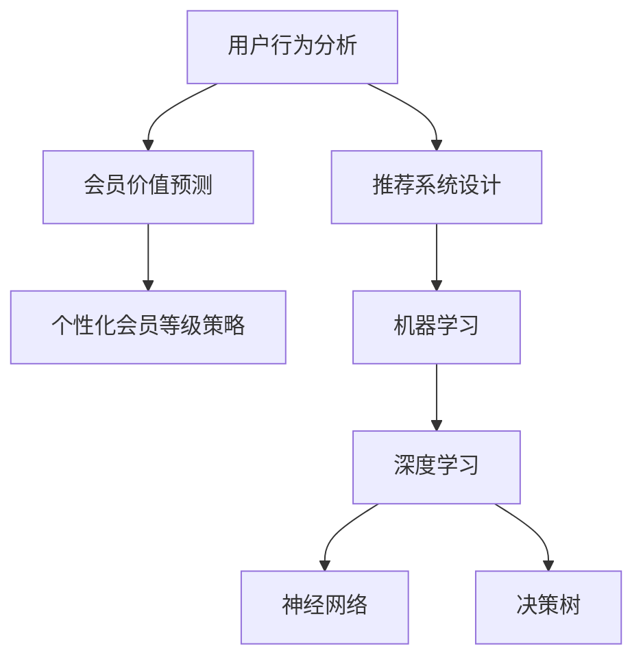

                 

# AI驱动的电商平台个性化会员等级策略

> 关键词：AI驱动, 电商平台, 个性化会员等级策略, 机器学习, 会员推荐系统, 用户行为分析, 会员价值预测, 决策树, 深度学习, 神经网络

## 1. 背景介绍

### 1.1 问题由来
随着电子商务的迅猛发展，电商平台的用户数量和订单量呈现出爆炸式增长。为了提高用户体验和商家利润，电商平台纷纷引入会员制度，通过会员等级和积分奖励机制吸引和留住优质用户。然而，由于缺乏有效的个性化策略，许多会员制度的实施效果并不理想，导致会员流失率高、用户体验差。如何通过数据驱动的方式，制定合理的会员等级策略，成为电商平台亟需解决的问题。

### 1.2 问题核心关键点
本问题涉及以下几个核心关键点：
1. **个性化会员等级策略**：如何根据用户行为和偏好，动态调整会员等级和积分，实现个性化定制。
2. **用户行为分析**：通过用户历史行为数据，挖掘用户兴趣、消费习惯等信息。
3. **会员价值预测**：基于用户行为和特征，预测用户的长期价值，帮助决策。
4. **推荐系统设计**：构建推荐引擎，根据用户行为和偏好推荐商品，提升用户满意度。
5. **算法选择与优化**：选择合适的机器学习算法，并对其进行调整和优化，以提高模型的性能和效率。

这些关键点共同构成了个性化会员等级策略的设计框架，通过数据驱动的方式，提升会员制度的效果，增加用户黏性，提升平台盈利能力。

### 1.3 问题研究意义
制定合理的个性化会员等级策略，对于电商平台具有重要意义：

1. **提升用户体验**：通过个性化的会员等级和积分奖励，满足不同用户的需求，提升用户的满意度和忠诚度。
2. **增加用户黏性**：根据用户行为和消费习惯，提供定制化的会员服务，增加用户的停留时间和回购率。
3. **提高销售转化率**：通过精准的会员推荐，增加用户的购物欲望，提升订单转化率，增加平台收入。
4. **优化资源配置**：根据用户的长期价值，合理分配平台资源，提高资源利用效率。
5. **促进平台发展**：通过有效的会员管理，吸引和留住优质用户，促进平台的长期发展。

## 2. 核心概念与联系

### 2.1 核心概念概述

为更好地理解AI驱动的电商平台个性化会员等级策略，本节将介绍几个密切相关的核心概念：

- **个性化会员等级策略**：根据用户行为和特征，动态调整会员等级和积分，实现个性化定制。
- **用户行为分析**：通过用户历史行为数据，挖掘用户兴趣、消费习惯等信息。
- **会员价值预测**：基于用户行为和特征，预测用户的长期价值，帮助决策。
- **推荐系统设计**：构建推荐引擎，根据用户行为和偏好推荐商品，提升用户满意度。
- **机器学习**：通过数据驱动的方式，构建预测模型和推荐算法，实现个性化策略。
- **深度学习**：利用神经网络等深度学习技术，处理大规模数据，提高模型的性能和泛化能力。
- **神经网络**：由多层神经元组成的计算模型，能够学习数据的复杂非线性关系。
- **决策树**：基于树形结构的分类模型，直观易懂，适用于特征选择和解释性要求较高的场景。

这些核心概念之间的逻辑关系可以通过以下Mermaid流程图来展示：



这个流程图展示了个性化会员等级策略的设计框架：

1. 用户行为分析作为输入数据，用于挖掘用户的兴趣和消费习惯。
2. 会员价值预测基于用户行为，预测用户的长期价值。
3. 个性化会员等级策略根据预测结果，动态调整会员等级和积分。
4. 推荐系统设计利用用户偏好，推荐个性化商品，提升用户满意度。
5. 机器学习与深度学习技术，为模型提供计算和优化支持。

这些概念共同构成了电商平台个性化会员等级策略的实施框架，通过数据驱动的方式，实现个性化定制和精准营销。

## 3. 核心算法原理 & 具体操作步骤
### 3.1 算法原理概述

AI驱动的电商平台个性化会员等级策略，本质上是一个基于用户行为和特征的分类问题。其核心思想是：通过机器学习模型，根据用户的行为数据，预测用户的长期价值，并根据预测结果动态调整会员等级和积分，实现个性化定制。

具体来说，假设用户的历史行为数据为 $X$，长期价值为 $Y$，则个性化会员等级策略的预测模型为 $f(X, Y)$，其中 $f$ 为机器学习模型，$X$ 为输入特征，$Y$ 为输出标签。模型的目标是通过训练，使得 $f$ 能够准确预测用户的长期价值，进而指导会员等级的调整。

### 3.2 算法步骤详解

基于用户行为和特征的个性化会员等级策略，通常包括以下几个关键步骤：

**Step 1: 数据准备和预处理**
- 收集用户的历史行为数据，包括浏览、购买、评价等行为，以及用户的基本信息（如年龄、性别、地域等）。
- 对数据进行清洗、去重、填充缺失值等预处理，确保数据质量。

**Step 2: 特征工程**
- 根据用户行为数据，设计特征工程流程，提取有意义的特征，如用户的购买频率、消费金额、停留时间等。
- 对特征进行归一化、编码等处理，方便模型训练。

**Step 3: 模型选择和训练**
- 选择合适的机器学习模型，如决策树、随机森林、深度神经网络等。
- 利用训练集对模型进行训练，调整模型的参数和超参数，最小化预测误差。

**Step 4: 会员等级策略制定**
- 根据模型的预测结果，动态调整会员等级和积分。
- 设计会员等级规则，如新用户默认等级、升级规则、积分奖励等。

**Step 5: 推荐系统集成**
- 将个性化会员等级策略与推荐系统集成，根据用户等级和偏好，推荐个性化商品。
- 利用推荐系统提升用户体验和购买率，增加平台的收入。

**Step 6: 模型评估和优化**
- 在测试集上对模型进行评估，计算准确率、召回率、F1值等指标。
- 根据评估结果，对模型进行调整和优化，提高模型的性能。

### 3.3 算法优缺点

基于用户行为和特征的个性化会员等级策略，具有以下优点：

1. **数据驱动**：通过分析用户的历史行为数据，挖掘用户兴趣和消费习惯，实现个性化定制。
2. **动态调整**：根据用户行为的变化，动态调整会员等级和积分，提高用户满意度。
3. **精准推荐**：利用推荐系统，推荐个性化商品，提升用户购买率和平台收入。
4. **提高忠诚度**：通过会员等级和积分奖励，提升用户黏性，增加用户忠诚度。

同时，该方法也存在以下局限性：

1. **数据依赖性高**：模型的效果高度依赖于用户行为数据的完整性和质量，数据缺失或不准确会导致模型失效。
2. **计算复杂度高**：深度神经网络等复杂模型，对计算资源的要求较高，训练和推理速度较慢。
3. **模型可解释性差**：深度学习模型的内部结构复杂，难以解释其决策逻辑。
4. **对抗样本风险**：模型可能受到对抗样本的攻击，导致预测结果不准确。

尽管存在这些局限性，但基于用户行为和特征的个性化会员等级策略，仍是目前电商行业最为先进和实用的会员管理方法。未来相关研究的重点在于如何进一步降低数据依赖，提高模型的效率和可解释性，同时兼顾推荐系统的鲁棒性和安全性等因素。

### 3.4 算法应用领域

基于用户行为和特征的个性化会员等级策略，在电商平台的多个应用场景中得到了广泛的应用，例如：

1. **个性化推荐**：通过分析用户行为，推荐用户感兴趣的商品，提升用户满意度。
2. **会员等级调整**：根据用户的行为和特征，动态调整会员等级和积分，实现个性化定制。
3. **购物车管理**：根据用户购物车中的商品，推荐相关商品，提升订单转化率。
4. **客户关怀**：根据用户行为和历史订单，设计个性化的营销活动，提升用户忠诚度。
5. **库存管理**：根据用户需求和预测结果，优化库存管理，减少库存积压和缺货现象。

除了上述这些经典应用外，个性化会员等级策略也被创新性地应用到更多场景中，如流失预测、客户细分、行为建模等，为电商平台提供了更全面的个性化服务。

## 4. 数学模型和公式 & 详细讲解  
### 4.1 数学模型构建

本节将使用数学语言对AI驱动的电商平台个性化会员等级策略进行更加严格的刻画。

假设用户的历史行为数据为 $X$，长期价值为 $Y$，其中 $X = (x_1, x_2, ..., x_n)$，$Y$ 为连续值或离散值。则预测模型 $f$ 可以表示为：

$$
f(X, Y) = \mathop{\arg\min}_{\theta} \mathcal{L}(\theta)
$$

其中 $\theta$ 为模型参数，$\mathcal{L}$ 为损失函数，用于衡量模型预测与真实标签之间的差异。常见的损失函数包括均方误差损失、交叉熵损失等。

### 4.2 公式推导过程

以决策树为例，推导其预测模型和损失函数。

假设决策树模型为 $f_{\theta}(x)$，其中 $x$ 为输入特征，$\theta$ 为模型参数。则决策树的预测结果可以表示为：

$$
f_{\theta}(x) = \sum_{i=1}^{k} \delta_i \cdot \phi_i(x)
$$

其中 $\delta_i$ 为节点权重，$\phi_i(x)$ 为第 $i$ 个叶节点对应的预测结果。

对于二分类问题，决策树的损失函数可以表示为：

$$
\mathcal{L}(\theta) = \frac{1}{N} \sum_{i=1}^{N} \ell(f_{\theta}(x_i), y_i)
$$

其中 $N$ 为样本数量，$\ell$ 为损失函数，如交叉熵损失。对于多分类问题，也可以使用多类交叉熵损失。

在得到决策树的预测结果后，可以利用测试集对其进行评估，计算准确率、召回率、F1值等指标，以衡量模型的性能。

### 4.3 案例分析与讲解

以电商平台个性化推荐系统为例，推导决策树模型的训练和预测过程。

**训练过程**：
1. 收集用户的历史行为数据，包括浏览、购买、评价等行为，以及用户的基本信息（如年龄、性别、地域等）。
2. 对数据进行清洗、去重、填充缺失值等预处理，确保数据质量。
3. 设计特征工程流程，提取有意义的特征，如用户的购买频率、消费金额、停留时间等。
4. 利用决策树模型对特征进行训练，调整模型的参数和超参数，最小化预测误差。
5. 在测试集上对模型进行评估，计算准确率、召回率、F1值等指标，以衡量模型的性能。

**预测过程**：
1. 根据用户的行为数据，输入决策树模型进行预测。
2. 输出预测结果，用于个性化推荐和会员等级调整。

通过以上训练和预测过程，可以构建一个基于决策树的电商平台个性化推荐系统，实现个性化推荐和会员等级调整。

## 5. 项目实践：代码实例和详细解释说明
### 5.1 开发环境搭建

在进行个性化会员等级策略的实践前，我们需要准备好开发环境。以下是使用Python进行Scikit-learn开发的开发环境配置流程：

1. 安装Anaconda：从官网下载并安装Anaconda，用于创建独立的Python环境。

2. 创建并激活虚拟环境：
```bash
conda create -n sklearn-env python=3.8 
conda activate sklearn-env
```

3. 安装Scikit-learn：从官网获取对应的安装命令。例如：
```bash
conda install scikit-learn
```

4. 安装其他必要库：
```bash
pip install pandas numpy matplotlib sklearn tqdm
```

5. 安装Jupyter Notebook：用于交互式编程和数据可视化。

完成上述步骤后，即可在`sklearn-env`环境中开始个性化会员等级策略的实践。

### 5.2 源代码详细实现

下面我们以电商平台个性化推荐系统为例，给出使用Scikit-learn库进行决策树模型训练的Python代码实现。

首先，定义数据处理函数：

```python
import pandas as pd
from sklearn.model_selection import train_test_split
from sklearn.preprocessing import StandardScaler, LabelEncoder

def load_data(path):
    data = pd.read_csv(path)
    # 处理缺失值
    data = data.dropna()
    # 处理连续型数据
    data['age'] = StandardScaler().fit_transform(data[['age']])
    # 处理离散型数据
    le = LabelEncoder()
    data['gender'] = le.fit_transform(data['gender'])
    data['city'] = le.fit_transform(data['city'])
    return data

# 加载数据
data = load_data('user_behavior.csv')

# 划分训练集和测试集
X_train, X_test, y_train, y_test = train_test_split(data.drop('value', axis=1), data['value'], test_size=0.2, random_state=42)

# 特征选择
selected_features = ['age', 'gender', 'city', 'purchase_frequency', 'purchase_amount']
X_train = X_train[selected_features]
X_test = X_test[selected_features]
```

然后，定义模型训练和预测函数：

```python
from sklearn.tree import DecisionTreeRegressor

def train_model(X_train, y_train):
    # 构建决策树模型
    model = DecisionTreeRegressor()
    # 训练模型
    model.fit(X_train, y_train)
    return model

def predict_value(model, X_test):
    # 预测测试集值
    y_pred = model.predict(X_test)
    return y_pred
```

最后，启动训练流程并在测试集上评估：

```python
# 训练模型
model = train_model(X_train, y_train)

# 预测测试集值
y_pred = predict_value(model, X_test)

# 评估模型
from sklearn.metrics import mean_squared_error
print('Mean Squared Error:', mean_squared_error(y_test, y_pred))
```

以上就是使用Scikit-learn库进行决策树模型训练的完整代码实现。可以看到，Scikit-learn库提供了方便的API接口，可以快速实现模型的训练和评估。

### 5.3 代码解读与分析

让我们再详细解读一下关键代码的实现细节：

**load_data函数**：
- 用于加载用户行为数据，并对数据进行清洗和预处理。
- 处理缺失值，去除无效数据。
- 对连续型数据进行标准化处理，以消除数据量级的差异。
- 对离散型数据进行编码，方便模型处理。

**train_model函数**：
- 定义决策树模型，并进行训练。
- 使用训练集对模型进行拟合，生成预测模型。

**predict_value函数**：
- 利用训练好的模型，对测试集进行预测。
- 输出预测值，用于后续分析和应用。

**训练流程**：
- 加载数据，并对数据进行预处理。
- 构建决策树模型，并进行训练。
- 在测试集上对模型进行评估，输出评估指标。

通过以上代码实现，可以构建一个基于决策树的电商平台个性化推荐系统，实现个性化推荐和会员等级调整。

## 6. 实际应用场景
### 6.1 智能客服系统

基于用户行为和特征的个性化会员等级策略，可以广泛应用于智能客服系统的构建。传统客服往往需要配备大量人力，高峰期响应缓慢，且一致性和专业性难以保证。而使用个性化会员等级策略，可以7x24小时不间断服务，快速响应客户咨询，用个性化的服务提升客户体验。

在技术实现上，可以收集企业内部的历史客服对话记录，将问题和最佳答复构建成监督数据，在此基础上对决策树模型进行训练。训练后的模型能够自动理解用户意图，匹配最合适的答案模板进行回复。对于客户提出的新问题，还可以接入检索系统实时搜索相关内容，动态组织生成回答。如此构建的智能客服系统，能大幅提升客户咨询体验和问题解决效率。

### 6.2 金融舆情监测

金融机构需要实时监测市场舆论动向，以便及时应对负面信息传播，规避金融风险。传统的人工监测方式成本高、效率低，难以应对网络时代海量信息爆发的挑战。基于个性化会员等级策略的决策树模型，可以用于实时舆情监测和舆情分析。

具体而言，可以收集金融领域相关的新闻、报道、评论等文本数据，并对其进行主题标注和情感标注。在此基础上对决策树模型进行微调，使其能够自动判断文本属于何种主题，情感倾向是正面、中性还是负面。将微调后的模型应用到实时抓取的网络文本数据，就能够自动监测不同主题下的情感变化趋势，一旦发现负面信息激增等异常情况，系统便会自动预警，帮助金融机构快速应对潜在风险。

### 6.3 个性化推荐系统

当前的推荐系统往往只依赖用户的历史行为数据进行物品推荐，无法深入理解用户的真实兴趣偏好。基于个性化会员等级策略的决策树模型，可以用于构建推荐系统，提升推荐效果。

在实践中，可以收集用户浏览、点击、评价等行为数据，提取和用户交互的物品标题、描述、标签等文本内容。将文本内容作为模型输入，用户的后续行为（如是否点击、购买等）作为监督信号，在此基础上对决策树模型进行微调。微调后的模型能够从文本内容中准确把握用户的兴趣点。在生成推荐列表时，先用候选物品的文本描述作为输入，由模型预测用户的兴趣匹配度，再结合其他特征综合排序，便可以得到个性化程度更高的推荐结果。

### 6.4 未来应用展望

随着个性化会员等级策略的不断发展，将在更多领域得到应用，为传统行业带来变革性影响。

在智慧医疗领域，基于个性化会员等级策略的医疗问答、病历分析、药物研发等应用将提升医疗服务的智能化水平，辅助医生诊疗，加速新药开发进程。

在智能教育领域，个性化会员等级策略可应用于作业批改、学情分析、知识推荐等方面，因材施教，促进教育公平，提高教学质量。

在智慧城市治理中，个性化会员等级策略可应用于城市事件监测、舆情分析、应急指挥等环节，提高城市管理的自动化和智能化水平，构建更安全、高效的未来城市。

此外，在企业生产、社会治理、文娱传媒等众多领域，基于个性化会员等级策略的AI应用也将不断涌现，为NLP技术带来新的发展方向。相信随着技术的日益成熟，个性化会员等级策略必将在构建人机协同的智能时代中扮演越来越重要的角色。

## 7. 工具和资源推荐
### 7.1 学习资源推荐

为了帮助开发者系统掌握AI驱动的电商平台个性化会员等级策略的理论基础和实践技巧，这里推荐一些优质的学习资源：

1. 《机器学习实战》书籍：详细介绍了机器学习的基本概念和常用算法，适合入门学习。
2. 《Python数据分析与数据可视化》书籍：介绍Python在数据分析和数据可视化中的应用，适合处理复杂数据。
3. Scikit-learn官方文档：Scikit-learn库的官方文档，提供了详细的API接口和样例代码，是学习Scikit-learn的最佳资料。
4. 《深度学习入门》书籍：介绍深度学习的基本原理和常用模型，适合进一步深入学习。
5. Kaggle平台：数据科学竞赛平台，提供大量真实数据集和竞赛机会，帮助学习者锻炼实战能力。

通过对这些资源的学习实践，相信你一定能够快速掌握AI驱动的电商平台个性化会员等级策略的精髓，并用于解决实际的业务问题。
### 7.2 开发工具推荐

高效的开发离不开优秀的工具支持。以下是几款用于AI驱动的电商平台个性化会员等级策略开发的常用工具：

1. Python：通用的编程语言，具有丰富的第三方库和框架，支持机器学习和深度学习开发。
2. Scikit-learn：开源的机器学习库，提供了大量的常用算法和模型，易于上手。
3. TensorFlow：开源的深度学习框架，支持分布式计算和高效推理。
4. PyTorch：开源的深度学习框架，具有灵活的计算图和高效的动态图处理能力。
5. Jupyter Notebook：交互式编程和数据可视化的工具，方便快速迭代和调试代码。
6. Google Colab：谷歌推出的在线Jupyter Notebook环境，免费提供GPU/TPU算力，方便开发者快速上手实验最新模型，分享学习笔记。

合理利用这些工具，可以显著提升AI驱动的电商平台个性化会员等级策略的开发效率，加快创新迭代的步伐。

### 7.3 相关论文推荐

AI驱动的电商平台个性化会员等级策略的研究源于学界的持续研究。以下是几篇奠基性的相关论文，推荐阅读：

1. "A Survey on Deep Learning Techniques for Personalized Recommendation Systems"：综述了基于深度学习的个性化推荐系统，介绍了常见模型和算法。
2. "How to Train Your Model with Online User Behavior Data: A Survey"：综述了基于在线用户行为数据的模型训练方法，介绍了特征工程和模型优化技术。
3. "A Unified Model for Personalized Recommendation and User Behavior Prediction"：提出了一种统一的模型，将个性化推荐和用户行为预测相结合，提升推荐效果。
4. "Personalized Recommendation with Deep Embeddings: A Survey and Outlook"：综述了基于深度嵌入的个性化推荐系统，介绍了模型架构和优化技术。
5. "A Survey of Recommendation System: Algorithms and Applications"：综述了推荐系统的发展历程和最新进展，介绍了常见算法和应用场景。

这些论文代表了大语言模型微调技术的发展脉络。通过学习这些前沿成果，可以帮助研究者把握学科前进方向，激发更多的创新灵感。

## 8. 总结：未来发展趋势与挑战

### 8.1 总结

本文对AI驱动的电商平台个性化会员等级策略进行了全面系统的介绍。首先阐述了个性化会员等级策略的设计背景和意义，明确了策略制定的核心关键点。其次，从原理到实践，详细讲解了个性化会员等级策略的数学模型和关键步骤，给出了模型训练和评估的完整代码实例。同时，本文还广泛探讨了策略在智能客服、金融舆情、个性化推荐等多个行业领域的应用前景，展示了策略范式的巨大潜力。此外，本文精选了策略制定的各类学习资源，力求为读者提供全方位的技术指引。

通过本文的系统梳理，可以看到，AI驱动的电商平台个性化会员等级策略是一个典型的数据驱动决策系统，通过分析用户行为和特征，实现个性化定制和精准营销。策略的实施能够提升用户体验和会员忠诚度，增加平台的收入，实现共赢发展。

### 8.2 未来发展趋势

展望未来，AI驱动的电商平台个性化会员等级策略将呈现以下几个发展趋势：

1. **数据驱动**：随着大数据技术的不断进步，个性化会员等级策略将更加依赖数据驱动，通过分析用户行为和特征，实现更加精准的推荐和决策。
2. **模型多样化**：除了决策树模型，未来将涌现更多基于深度学习、集成学习等方法的个性化会员等级策略，提升模型的性能和泛化能力。
3. **推荐系统融合**：将个性化会员等级策略与推荐系统融合，提升推荐效果，增加用户满意度和平台收入。
4. **用户互动增强**：通过互动反馈机制，及时调整个性化策略，提升用户体验和系统鲁棒性。
5. **多模态融合**：将用户的多模态数据（如文本、图像、语音等）融合，构建更加全面、准确的个性化模型。
6. **隐私保护**：随着数据隐私保护法规的日益严格，个性化会员等级策略将更加注重数据隐私和用户隐私保护，确保数据的安全和合规性。

以上趋势凸显了AI驱动的电商平台个性化会员等级策略的广阔前景。这些方向的探索发展，必将进一步提升策略的效果，为电商平台带来更优质的用户服务和更高的盈利能力。

### 8.3 面临的挑战

尽管AI驱动的电商平台个性化会员等级策略已经取得了显著成效，但在迈向更加智能化、普适化应用的过程中，仍面临诸多挑战：

1. **数据隐私问题**：随着数据隐私保护法规的日益严格，个性化会员等级策略在收集和使用用户数据时，需要严格遵守隐私保护规定，避免数据泄露和滥用。
2. **计算资源消耗**：决策树模型等复杂模型，对计算资源的要求较高，训练和推理速度较慢，需要优化算法和模型结构，降低资源消耗。
3. **模型可解释性不足**：深度学习模型难以解释其内部工作机制和决策逻辑，需要引入可解释性方法，增强策略的可解释性和可信度。
4. **对抗样本风险**：模型可能受到对抗样本的攻击，导致预测结果不准确，需要引入对抗训练等技术，提高模型的鲁棒性。
5. **模型公平性问题**：个性化会员等级策略需要避免对特定用户群体的歧视，确保模型的公平性和公正性。

这些挑战需要在未来研究中进一步探索和解决，才能将AI驱动的电商平台个性化会员等级策略推向更广泛的应用。

### 8.4 研究展望

面对AI驱动的电商平台个性化会员等级策略所面临的种种挑战，未来的研究需要在以下几个方面寻求新的突破：

1. **数据隐私保护**：采用联邦学习、差分隐私等技术，在保护用户隐私的前提下，实现数据共享和模型优化。
2. **模型优化与加速**：开发更高效的算法和模型结构，如剪枝、量化等技术，降低计算资源消耗，提高模型效率。
3. **可解释性增强**：引入可解释性方法，如LIME、SHAP等，增强策略的可解释性和可信度，提升用户信任。
4. **对抗样本防御**：引入对抗训练、鲁棒优化等技术，提高模型的鲁棒性和抗攻击能力。
5. **公平性保障**：设计公平性约束和评估指标，确保模型的公平性和公正性，避免对特定用户群体的歧视。

这些研究方向的探索，必将引领AI驱动的电商平台个性化会员等级策略迈向更高的台阶，为构建安全、可靠、可解释、可控的智能系统铺平道路。面向未来，策略制定还需要与其他AI技术进行更深入的融合，如知识表示、因果推理、强化学习等，多路径协同发力，共同推动个性化会员等级策略的进步。

## 9. 附录：常见问题与解答

**Q1：AI驱动的电商平台个性化会员等级策略是否适用于所有电商业务？**

A: AI驱动的电商平台个性化会员等级策略，适用于大多数电商业务。但对于一些特定领域的电商业务，如垂直电商、B2B电商等，需要根据实际情况进行适当调整。例如，对于B2B电商，需要考虑客户企业规模、采购频率等因素，设计相应的会员等级规则和积分奖励机制。

**Q2：如何选择适合的机器学习模型？**

A: 选择适合的机器学习模型需要考虑多个因素，包括数据类型、任务需求、模型复杂度等。一般来说，对于电商业务，可以选择决策树、随机森林、深度神经网络等模型。决策树和随机森林适用于特征工程复杂、数据量较大的场景，深度神经网络适用于特征维度高、数据量较小的场景。

**Q3：如何处理缺失数据？**

A: 缺失数据处理是模型训练中的重要步骤。常见的处理方法包括删除缺失数据、填补缺失值等。删除缺失数据简单易行，但可能导致数据量减少；填补缺失值则可以在保留数据的同时，增加模型对数据的利用率。常用的填补方法包括均值填补、中位数填补、KNN填补等。

**Q4：如何提高模型效率？**

A: 提高模型效率需要从多个方面入手，包括数据预处理、模型选择、算法优化等。在数据预处理阶段，可以采用特征工程、数据清洗等技术，提高数据质量；在模型选择阶段，可以根据任务需求选择适合的模型，避免使用过于复杂的模型；在算法优化阶段，可以采用剪枝、量化等技术，降低模型参数量和计算资源消耗。

**Q5：如何处理多模态数据？**

A: 处理多模态数据需要构建多模态模型，将不同模态的数据进行融合。常见的多模态模型包括深度残差网络、注意力机制等。在实际应用中，可以将用户的多模态数据（如文本、图像、语音等）进行融合，构建更加全面、准确的个性化模型。

通过以上常见问题的解答，相信你对AI驱动的电商平台个性化会员等级策略有了更深入的理解。在实际应用中，需要根据具体业务场景和数据特点，选择合适的模型和方法，不断优化和改进策略，提升用户体验和平台收入。

---

作者：禅与计算机程序设计艺术 / Zen and the Art of Computer Programming

