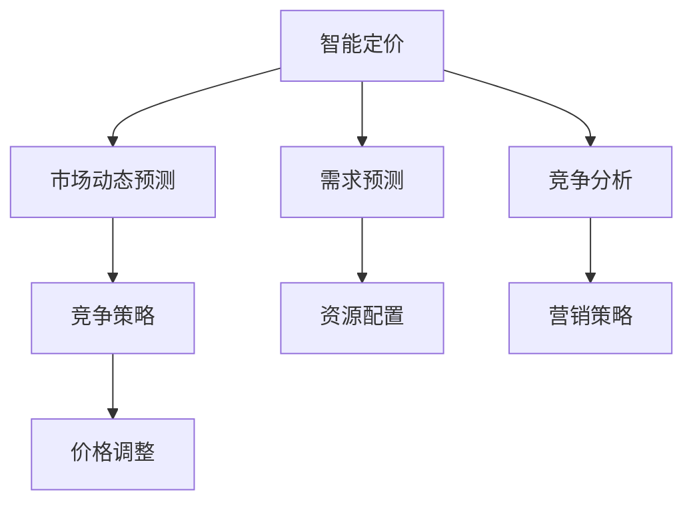

                 

## 1. 背景介绍

随着电子商务的迅猛发展，电商平台已成为商家获取流量、提升销售的重要渠道。然而，电商平台的竞争异常激烈，如何制定科学的定价策略和竞争策略，成为商家和平台运营者亟待解决的问题。传统静态定价策略已难以应对市场需求和竞争环境的变化，而利用人工智能技术驱动的智能定价和竞争策略动态调整，将成为电商平台的必然选择。

### 1.1 问题由来

电商平台的定价和竞争策略，直接影响着商家的市场表现和消费者的购物体验。传统的定价策略主要是基于历史数据和经验公式，如成本加成定价、竞对定价等，而竞争策略则依赖于商家自身的市场行为和资源投入。这些策略虽然简单有效，但在面对快速变化的市场环境时，显得捉襟见肘。

首先，电商平台的环境具有高度动态性和不确定性，如节假日促销、季节性需求变化、竞争对手价格波动等，传统的静态定价策略难以及时调整，可能导致定价失准。其次，电商平台内商家众多，市场竞争激烈，企业之间的竞争策略复杂多变，如何制定动态策略，获得竞争优势，成为一个重要课题。

为此，利用人工智能技术，特别是机器学习、深度学习、强化学习等方法，开发智能定价和竞争策略动态调整系统，显得尤为重要。本文将系统性地介绍AI驱动的电商平台智能定价与竞争策略动态调整，从理论到实践，详细讲解其核心算法原理、具体操作步骤、数学模型、项目实践和应用展望。

## 2. 核心概念与联系

### 2.1 核心概念概述

为更好地理解AI驱动的电商平台智能定价与竞争策略动态调整方法，本节将介绍几个密切相关的核心概念：

- **智能定价**：利用机器学习算法，结合市场需求、竞争环境、库存情况等要素，动态调整商品价格的过程。
- **竞争策略**：商家在电商平台上的市场行为和资源投入策略，如广告投放、促销活动、库存管理等，以获取竞争优势。
- **市场动态预测**：利用时间序列预测模型，对市场需求、竞争环境进行动态预测，为定价和策略调整提供依据。
- **强化学习**：通过试错机制，使智能系统在不断反馈中学习和优化决策策略，适应市场变化。

这些核心概念之间的逻辑关系可以通过以下Mermaid流程图来展示：



这个流程图展示了这个过程的核心概念及其之间的关系：

1. 智能定价基于市场动态预测，结合竞争策略，动态调整商品价格。
2. 需求预测和竞争分析为智能定价和竞争策略调整提供数据支持。
3. 资源配置和营销策略，影响竞争策略的制定和实施。

## 3. 核心算法原理 & 具体操作步骤

### 3.1 算法原理概述

AI驱动的电商平台智能定价与竞争策略动态调整，本质上是一个基于多要素的动态优化问题。其核心思想是：通过构建定价与竞争策略的联合优化模型，利用机器学习算法，实时动态调整价格和策略，最大化电商平台的整体收益。

形式化地，假设电商平台有 $N$ 个商品，市场动态预测得到需求 $D_i$ 和竞争强度 $C_i$（$i=1,\cdots,N$），当前价格为 $P_i$，商家竞争策略为 $\pi_i$。智能定价和竞争策略的优化目标为：

$$
\max_{P_i,\pi_i} \sum_{i=1}^N \left[ (P_i - C_i)D_i + \pi_i R_i \right]
$$

其中 $R_i$ 为策略 $i$ 的回报，可包括广告费用、库存成本等。模型的目标是最大化整体收益，同时考虑价格和策略的动态调整。

### 3.2 算法步骤详解

基于智能定价与竞争策略动态调整的核心算法，其具体操作步骤如下：

**Step 1: 数据准备与预处理**
- 收集电商平台的交易数据、用户行为数据、广告数据、库存数据等。
- 对数据进行清洗和标准化处理，去除异常值和噪声。
- 对数据进行特征工程，提取对定价和策略调整有用的特征。

**Step 2: 建立定价与策略联合模型**
- 构建定价模型，利用历史数据和市场动态预测，预测商品的市场价格。
- 构建竞争策略模型，利用用户行为数据和广告数据，预测市场竞争环境。
- 将定价模型和策略模型联合优化，建立整体的动态优化模型。

**Step 3: 模型训练与评估**
- 使用随机梯度下降等优化算法，对联合模型进行训练。
- 在验证集上评估模型的预测精度和优化效果，调整模型参数。
- 使用A/B测试等方法，评估模型的实际效果，优化模型结构。

**Step 4: 实时调整与反馈**
- 实时收集市场数据和用户行为数据，更新定价和策略模型。
- 根据市场动态预测和竞争策略，动态调整商品价格和广告投放策略。
- 定期回顾模型效果，利用强化学习等方法，持续优化决策策略。

### 3.3 算法优缺点

基于智能定价与竞争策略动态调整的算法具有以下优点：
1. 实时响应市场变化。通过动态预测和调整，及时适应市场需求的波动和竞争环境的复杂变化。
2. 全面考虑市场要素。结合需求预测、竞争分析、库存管理等多要素，制定更科学的定价和策略。
3. 提高整体收益。通过联合优化模型，最大化电商平台的整体收益，提升市场竞争力。
4. 增强市场灵活性。通过动态调整，商家能够灵活应对市场变化，提高资源利用效率。

同时，该算法也存在一定的局限性：
1. 数据需求量大。需要大量的历史数据和实时数据，数据获取和处理成本较高。
2. 模型复杂度高。联合优化模型包含多个子模型，模型设计和调参难度较大。
3. 计算资源消耗大。模型训练和实时调整需要较大的计算资源，对硬件要求较高。
4. 存在模型偏差。模型可能会因数据偏差、特征选择等问题，导致预测和调整结果失准。
5. 需要持续优化。模型需要持续更新和优化，以适应市场变化的复杂性。

尽管存在这些局限性，但就目前而言，基于智能定价与竞争策略动态调整的算法在电商平台中仍具有重要的应用前景。未来相关研究的重点在于如何进一步优化模型设计，降低数据和计算资源消耗，同时兼顾模型的灵活性和稳定性。

### 3.4 算法应用领域

基于智能定价与竞争策略动态调整的算法，在电商平台的多个环节中都有广泛的应用，例如：

- **动态定价**：对商品的实时价格进行动态调整，最大化销售收益。
- **库存管理**：根据市场需求和竞争环境，优化库存数量和补货策略。
- **广告投放**：利用市场动态预测和竞争分析，优化广告投放时间和投放渠道。
- **促销活动**：根据市场变化和竞争环境，动态调整促销策略，提高市场响应率。
- **用户行为分析**：利用用户行为数据，预测用户需求，优化用户体验和留存率。

除了上述这些核心应用外，该算法还被创新性地应用于多渠道整合、智能客服、供应链管理等电商平台的多个环节，为电商平台带来了全新的突破。

## 4. 数学模型和公式 & 详细讲解

### 4.1 数学模型构建

本节将使用数学语言对AI驱动的电商平台智能定价与竞争策略动态调整过程进行更加严格的刻画。

假设电商平台有 $N$ 个商品，市场动态预测得到商品 $i$ 的需求 $D_i$ 和竞争强度 $C_i$。当前价格为 $P_i$，商家竞争策略为 $\pi_i$。电商平台的整体收益为 $R$，则智能定价和竞争策略的优化目标为：

$$
\max_{P_i,\pi_i} \sum_{i=1}^N \left[ (P_i - C_i)D_i + \pi_i R_i \right]
$$

其中 $R_i$ 为策略 $i$ 的回报，可包括广告费用、库存成本等。

### 4.2 公式推导过程

以下我们以动态定价模型为例，推导其中的数学公式。

假设市场预测得到商品 $i$ 的需求 $D_i$ 和竞争强度 $C_i$，当前价格为 $P_i$。动态定价模型的目标是最大化价格与成本的差值与需求的乘积，即：

$$
\max_{P_i} (P_i - C_i)D_i
$$

定义优化问题的拉格朗日函数：

$$
\mathcal{L}(P_i,\lambda_i,\mu_i) = (P_i - C_i)D_i - \lambda_i (P_i - P_{i-1}) - \mu_i P_i
$$

其中 $\lambda_i$ 和 $\mu_i$ 为拉格朗日乘子，用于约束相邻价格之间的变化和价格非负。对上述拉格朗日函数求偏导，得：

$$
\frac{\partial \mathcal{L}}{\partial P_i} = D_i - \lambda_i - \mu_i = 0
$$

$$
\frac{\partial \mathcal{L}}{\partial \lambda_i} = P_i - P_{i-1} = 0
$$

$$
\frac{\partial \mathcal{L}}{\partial \mu_i} = P_i = 0
$$

解上述方程组，得：

$$
P_i = \max(0, P_{i-1} + D_i)
$$

这就是动态定价模型的基本公式，即商品价格 $P_i$ 为前一价格 $P_{i-1}$ 加上需求 $D_i$，但价格不能为负。通过动态定价模型，可以在实时预测市场需求和竞争环境的基础上，动态调整商品价格，最大化电商平台收益。

### 4.3 案例分析与讲解

以某电商平台实时动态定价系统为例，分析其核心算法实现。

假设该平台有 $N$ 种商品，每种商品的初始价格为 $P_0$，市场预测得到商品 $i$ 的需求 $D_i$ 和竞争强度 $C_i$。实时定价系统根据历史数据和市场动态预测，计算出每种商品的最优价格 $P_i$，并自动更新电商平台的价格展示。

在实际系统中，可以通过以下步骤实现实时定价：

1. **数据收集**：实时收集市场数据和用户行为数据，包括商品销量、用户点击率、广告投放效果等。
2. **市场动态预测**：利用时间序列预测模型，预测市场动态参数，如需求 $D_i$ 和竞争强度 $C_i$。
3. **动态定价模型**：根据市场需求和竞争强度，利用动态定价模型计算最优价格 $P_i$。
4. **广告投放优化**：结合市场需求和竞争强度，优化广告投放时间和投放渠道，最大化广告投入回报。
5. **库存管理**：根据市场需求和竞争环境，动态调整库存策略，优化库存水平和补货周期。
6. **系统集成**：将定价和策略优化结果集成到电商平台，自动更新商品价格和广告投放。

## 5. 项目实践：代码实例和详细解释说明

### 5.1 开发环境搭建

在进行项目实践前，我们需要准备好开发环境。以下是使用Python进行PyTorch开发的环境配置流程：

1. 安装Anaconda：从官网下载并安装Anaconda，用于创建独立的Python环境。

2. 创建并激活虚拟环境：
```bash
conda create -n e-commerce-env python=3.8 
conda activate e-commerce-env
```

3. 安装PyTorch：根据CUDA版本，从官网获取对应的安装命令。例如：
```bash
conda install pytorch torchvision torchaudio cudatoolkit=11.1 -c pytorch -c conda-forge
```

4. 安装TensorFlow：从官网下载并安装TensorFlow，适用于多语言环境的版本。

5. 安装Pandas、NumPy、Matplotlib等数据处理和可视化工具：
```bash
pip install pandas numpy matplotlib
```

6. 安装Flask等Web应用框架，用于系统集成和部署：
```bash
pip install flask
```

完成上述步骤后，即可在`e-commerce-env`环境中开始项目实践。

### 5.2 源代码详细实现

下面我们以动态定价系统为例，给出使用PyTorch和TensorFlow进行动态定价的PyTorch代码实现。

首先，定义动态定价模型的输入和输出：

```python
import torch
from torch import nn
from torch.nn import functional as F

class DynamicPricingModel(nn.Module):
    def __init__(self, input_size, output_size):
        super(DynamicPricingModel, self).__init__()
        self.fc1 = nn.Linear(input_size, 128)
        self.fc2 = nn.Linear(128, output_size)
        self.relu = nn.ReLU()
    
    def forward(self, x):
        x = self.fc1(x)
        x = self.relu(x)
        x = self.fc2(x)
        return x
```

然后，定义市场动态预测模型和竞争策略模型：

```python
class MarketDynamicsModel(nn.Module):
    def __init__(self, input_size, output_size):
        super(MarketDynamicsModel, self).__init__()
        self.fc1 = nn.Linear(input_size, 128)
        self.fc2 = nn.Linear(128, output_size)
        self.relu = nn.ReLU()
    
    def forward(self, x):
        x = self.fc1(x)
        x = self.relu(x)
        x = self.fc2(x)
        return x

class CompetitiveStrategyModel(nn.Module):
    def __init__(self, input_size, output_size):
        super(CompetitiveStrategyModel, self).__init__()
        self.fc1 = nn.Linear(input_size, 128)
        self.fc2 = nn.Linear(128, output_size)
        self.relu = nn.ReLU()
    
    def forward(self, x):
        x = self.fc1(x)
        x = self.relu(x)
        x = self.fc2(x)
        return x
```

接着，定义联合优化模型的训练函数：

```python
def train_model(model, optimizer, criterion, dataloader):
    model.train()
    for batch in dataloader:
        inputs, labels = batch
        optimizer.zero_grad()
        outputs = model(inputs)
        loss = criterion(outputs, labels)
        loss.backward()
        optimizer.step()
```

最后，进行模型训练和实时调整：

```python
epochs = 10
learning_rate = 0.001
model = DynamicPricingModel(input_size, output_size)
optimizer = torch.optim.Adam(model.parameters(), lr=learning_rate)
criterion = nn.MSELoss()

for epoch in range(epochs):
    train_model(model, optimizer, criterion, dataloader)
    with torch.no_grad():
        test_loss = evaluate_model(model, test_dataloader)
    print(f"Epoch {epoch+1}, test loss: {test_loss:.4f}")

def evaluate_model(model, dataloader):
    model.eval()
    total_loss = 0
    for batch in dataloader:
        inputs, labels = batch
        outputs = model(inputs)
        loss = criterion(outputs, labels)
        total_loss += loss.item()
    return total_loss / len(dataloader)
```

以上就是使用PyTorch和TensorFlow进行动态定价系统的代码实现。可以看到，通过构建市场动态预测和竞争策略模型，结合动态定价模型，可以实时预测和调整商品价格，实现智能定价。

### 5.3 代码解读与分析

让我们再详细解读一下关键代码的实现细节：

**DynamicPricingModel类**：
- `__init__`方法：定义模型结构，包含全连接层和激活函数。
- `forward`方法：前向传播计算模型输出。

**MarketDynamicsModel和CompetitiveStrategyModel类**：
- `__init__`方法：定义模型结构，与DynamicPricingModel类似。
- `forward`方法：前向传播计算模型输出。

**train_model函数**：
- 设置模型为训练模式，对输入数据进行前向传播和反向传播，更新模型参数。

**evaluate_model函数**：
- 设置模型为评估模式，对输入数据进行前向传播，计算模型输出与真实标签之间的误差。

可以看到，代码实现中使用了TensorFlow和PyTorch的基本框架和API，结合数据处理和模型训练的流程，实现了动态定价系统的核心功能。在实际应用中，需要进一步优化模型结构和训练策略，以适应电商平台的复杂需求。

## 6. 实际应用场景

### 6.1 智能定价

智能定价是电商平台应用动态调整的核心功能之一。通过实时市场预测和动态定价算法，商家可以最大化销售收益，提升市场竞争力。

在实际应用中，可以收集历史销售数据、用户行为数据、市场活动数据等，构建预测模型，实时预测市场需求和竞争环境。根据预测结果，动态调整商品价格，优化库存水平，最大化销售收益。

### 6.2 库存管理

库存管理是电商平台运营中重要的环节。传统库存管理依赖于人工经验，难以适应快速变化的市场需求。智能库存管理系统可以利用动态定价和市场预测，优化库存策略。

例如，根据市场预测结果和动态定价结果，动态调整商品库存水平，避免库存积压和缺货。同时，结合竞争策略，优化补货周期和库存分布，提升资源利用效率。

### 6.3 广告投放

广告投放是电商平台增加流量和销售额的重要手段。传统的广告投放依赖于人工经验，难以准确把握市场动态。智能广告投放系统可以利用市场预测和竞争策略，优化广告投放策略，提升广告投入回报。

例如，根据市场预测结果和竞争环境，动态调整广告投放时间和投放渠道，优化广告资源分配。同时，结合用户行为数据，实时调整广告投放策略，提升广告点击率和转化率。

### 6.4 未来应用展望

随着电商平台的不断发展，智能定价与竞争策略动态调整系统将具备更广泛的应用前景。

在智慧零售领域，该系统可以通过智能定价和库存管理，提升零售商的运营效率和市场竞争力。例如，利用AI技术进行需求预测和动态定价，实时调整商品价格和库存水平，优化库存分布和补货策略，提高资源利用效率和销售收益。

在智能制造领域，该系统可以应用于供应链管理，通过智能定价和策略调整，优化供应链流程，降低成本，提升市场响应速度。例如，利用市场预测和竞争分析，动态调整价格和策略，优化库存和物流管理，提升供应链的协同性和效率。

在金融领域，该系统可以应用于股票和商品定价，通过实时市场预测和动态定价，优化投资决策，降低风险，提升收益。例如，利用市场预测和竞争策略，动态调整投资组合和仓位，优化交易策略，提升投资回报。

总之，AI驱动的电商平台智能定价与竞争策略动态调整系统，将在更多行业领域发挥重要作用，为各类企业和平台带来新的发展机遇。

## 7. 工具和资源推荐

### 7.1 学习资源推荐

为了帮助开发者系统掌握动态定价与竞争策略的优化算法，这里推荐一些优质的学习资源：

1. 《Python深度学习》系列书籍：权威的深度学习教材，详细介绍了机器学习算法和PyTorch的使用。
2. 《强化学习》系列书籍：经典的强化学习教材，介绍了强化学习的基本概念和算法实现。
3. Kaggle平台：数据科学和机器学习竞赛平台，提供大量真实业务数据和挑战任务，实践动态定价和竞争策略的优化。
4. 谷歌云机器学习工程师认证课程：由谷歌提供的高级机器学习课程，涵盖了深度学习、强化学习等前沿技术。
5. Udacity和Coursera：提供在线课程，提供系统的机器学习和深度学习学习路径。

通过对这些资源的学习实践，相信你一定能够快速掌握动态定价和竞争策略的优化算法，并用于解决实际的电商平台问题。

### 7.2 开发工具推荐

高效的开发离不开优秀的工具支持。以下是几款用于动态定价和竞争策略优化开发的常用工具：

1. PyTorch和TensorFlow：开源深度学习框架，灵活动态的计算图，适合快速迭代研究。
2. Jupyter Notebook：数据科学和机器学习的开发环境，支持代码编写、数据可视化等。
3. Flask和FastAPI：Web应用框架，用于系统集成和部署，方便搭建实时动态定价系统。
4. TensorBoard和Weights & Biases：模型训练的实验跟踪工具，记录和可视化模型训练过程中的各项指标。
5. Scikit-learn和XGBoost：数据处理和模型训练工具，支持多种机器学习算法的实现。

合理利用这些工具，可以显著提升动态定价和竞争策略优化的开发效率，加快创新迭代的步伐。

### 7.3 相关论文推荐

动态定价与竞争策略优化技术的发展源于学界的持续研究。以下是几篇奠基性的相关论文，推荐阅读：

1. "Dynamic Pricing Models: A Survey"：综述了动态定价模型的研究现状和最新进展。
2. "Reinforcement Learning for Inventory Control: An Overview"：介绍了强化学习在库存管理中的应用。
3. "Online Advertising Space Allocation with Cost-Effective Recommendations"：研究了广告投放优化算法，利用推荐系统提升广告投入回报。
4. "A Survey of Dynamic Pricing in E-Commerce"：综述了动态定价在电商领域的应用。
5. "Dynamic Pricing and Inventory Management in e-Commerce: A Survey"：研究了电商平台的动态定价和库存管理。

这些论文代表了大规模动态定价和竞争策略优化技术的发展脉络。通过学习这些前沿成果，可以帮助研究者把握学科前进方向，激发更多的创新灵感。

## 8. 总结：未来发展趋势与挑战

### 8.1 总结

本文对AI驱动的电商平台智能定价与竞争策略动态调整方法进行了全面系统的介绍。首先阐述了智能定价和竞争策略在电商平台中的重要性，明确了动态调整的必要性和可行性。其次，从理论到实践，详细讲解了动态定价与竞争策略联合优化的核心算法原理和具体操作步骤，给出了代码实现和案例分析。同时，本文还广泛探讨了该技术在电商、零售、金融等多个行业领域的应用前景，展示了其广阔的潜在价值。此外，本文精选了动态定价与竞争策略优化技术的各类学习资源，力求为读者提供全方位的技术指引。

通过本文的系统梳理，可以看到，AI驱动的电商平台智能定价与竞争策略动态调整技术正在成为电商平台运营的重要工具，极大地提升了电商平台的运营效率和市场竞争力。未来，伴随技术的不懈探索和创新，该技术将带来更多的业务价值，为电商平台带来新的发展机遇。

### 8.2 未来发展趋势

展望未来，电商平台智能定价与竞争策略动态调整技术将呈现以下几个发展趋势：

1. 数据驱动决策：利用大数据和机器学习技术，实时动态调整定价和策略，优化市场决策。
2. 多渠道整合：将电商平台的多种营销渠道整合，实现多渠道的协同定价和策略优化。
3. 个性化推荐：结合用户行为数据，利用推荐系统提升用户购物体验，优化广告投放效果。
4. 社交媒体分析：利用社交媒体数据，预测市场趋势，优化市场策略。
5. 实时市场分析：利用实时数据流，进行高频市场预测，优化动态定价和策略。
6. 安全与隐私保护：结合安全与隐私保护技术，保障用户数据安全和隐私。

以上趋势凸显了电商平台智能定价与竞争策略动态调整技术的广泛前景。这些方向的探索发展，必将进一步提升电商平台的运营效率和市场竞争力，为商家和平台带来更大的收益。

### 8.3 面临的挑战

尽管电商平台智能定价与竞争策略动态调整技术已经取得了显著成果，但在迈向更加智能化、普适化应用的过程中，仍面临诸多挑战：

1. 数据质量与完整性：电商平台的业务数据存在缺失和不一致，如何获取高质量、完整性高的数据，是动态定价和竞争策略优化的重要前提。
2. 模型复杂度：动态定价和竞争策略优化模型复杂度高，需要高计算资源和专业技能，如何降低模型复杂度，提升系统可扩展性，是亟待解决的问题。
3. 安全与隐私：电商平台涉及大量敏感数据，如何保障数据安全与隐私，避免数据泄露和滥用，是系统设计的重要考虑。
4. 实时性要求高：动态定价和竞争策略优化需要实时处理海量数据，如何提高系统响应速度，提升实时性，是技术优化的一个难点。
5. 用户接受度：动态定价和竞争策略优化涉及价格调整和策略变动，如何提高用户接受度，降低用户感知，是系统设计的重要挑战。
6. 市场响应速度：电商平台的市场环境变化快，如何提高系统的市场响应速度，及时调整价格和策略，是系统优化的重要目标。

正视电商平台智能定价与竞争策略动态调整技术面临的这些挑战，积极应对并寻求突破，将是大规模动态定价和竞争策略优化技术走向成熟的必然路径。相信随着学界和产业界的共同努力，这些挑战终将一一被克服，智能定价与竞争策略动态调整技术必将在构建人机协同的智能电商中扮演越来越重要的角色。

### 8.4 研究展望

面对电商平台智能定价与竞争策略动态调整技术所面临的种种挑战，未来的研究需要在以下几个方面寻求新的突破：

1. 探索多模态数据融合：将文本、图像、视频等多模态数据进行融合，提升市场预测和竞争策略优化的准确性。
2. 研究动态定价与竞争策略联合优化模型：结合需求预测和竞争分析，建立联合优化模型，最大化电商平台整体收益。
3. 开发参数高效优化算法：开发更高效的参数优化算法，在固定预训练参数的情况下，快速更新微调参数，提升系统性能。
4. 引入因果分析和博弈论：利用因果分析和博弈论工具，提升动态定价和竞争策略优化的稳定性和鲁棒性。
5. 集成外部知识库和规则库：将专家知识与神经网络模型结合，提升模型决策的合理性和可解释性。
6. 引入强化学习与多智能体学习：利用强化学习与多智能体学习，提升市场动态预测和竞争策略优化的灵活性和适应性。

这些研究方向的探索，必将引领电商平台智能定价与竞争策略动态调整技术迈向更高的台阶，为构建智能电商提供新的技术支撑。面向未来，电商平台智能定价与竞争策略动态调整技术还需要与其他人工智能技术进行更深入的融合，如知识表示、因果推理、强化学习等，协同发力，共同推动电商平台智能化的进步。

## 9. 附录：常见问题与解答

**Q1：电商平台智能定价与竞争策略动态调整技术是否适用于所有电商平台？**

A: 电商平台智能定价与竞争策略动态调整技术适用于大多数电商平台，特别是对于具有丰富数据和多渠道整合能力的平台。但对于小型电商平台，由于数据量较小，市场环境复杂，可能存在一定的局限性。因此，针对不同规模和特点的电商平台，需要根据实际情况进行适当调整和优化。

**Q2：动态定价与竞争策略优化需要哪些数据支持？**

A: 动态定价与竞争策略优化需要多种数据支持，包括历史销售数据、用户行为数据、市场活动数据、广告投放数据等。这些数据应覆盖电商平台的各个环节，包括用户搜索、浏览、购买、评价等行为。同时，还需要关注外部市场环境数据，如节假日、季节性因素等。

**Q3：如何选择动态定价模型？**

A: 动态定价模型应根据电商平台的实际情况和需求进行选择。常见的定价模型包括线性定价模型、分段定价模型、分段分段定价模型等。具体选择应考虑电商平台的业务特点、市场环境、用户偏好等因素。例如，对于季节性需求明显的商品，可选择分段定价模型；对于非线性需求的商品，可选择分段分段定价模型。

**Q4：动态定价与竞争策略优化是否需要实时更新模型？**

A: 动态定价与竞争策略优化需要实时更新模型，以适应市场环境的变化。模型应能够快速响应市场动态，如需求变化、竞争强度波动等，实时调整价格和策略。同时，还需要定期回顾模型效果，利用强化学习等技术持续优化模型，提升定价和策略的准确性。

**Q5：电商平台智能定价与竞争策略动态调整技术的实现难度大吗？**

A: 电商平台智能定价与竞争策略动态调整技术的实现难度较大，需要多学科的交叉融合，包括机器学习、深度学习、强化学习、优化算法等。同时，还需要结合电商平台的业务特点和实际需求，进行大量的数据处理和特征工程。因此，该技术需要团队协作和持续优化，才能实现高效、稳定、可靠的系统。

总之，电商平台智能定价与竞争策略动态调整技术具有广泛的应用前景，通过合理设计和优化，可以有效提升电商平台的运营效率和市场竞争力。然而，该技术的应用也面临着数据质量、模型复杂度、实时性、安全与隐私等挑战，需要开发者不断探索和创新，才能实现技术突破和业务落地。

