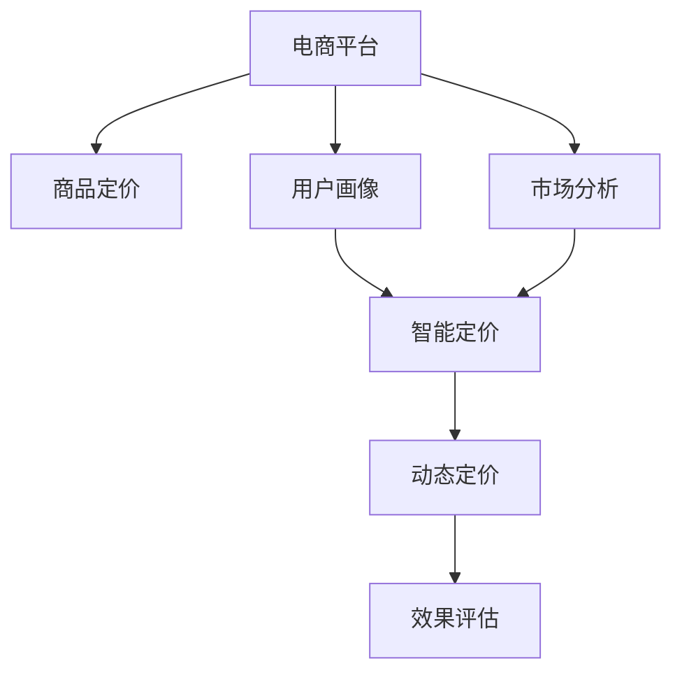

                 

# AI驱动的电商平台智能定价系统设计

## 1. 背景介绍

### 1.1 问题由来
随着电商平台的发展，如何制定灵活、合理的商品定价策略，直接影响到平台的用户体验和销售业绩。传统的定价方法往往依赖于人工经验或简单的统计模型，难以快速适应市场变化，且容易忽略用户偏好和需求。为此，AI技术被引入电商平台，构建智能定价系统，利用大数据和机器学习算法，实时调整商品价格，提升用户体验和销售效率。

### 1.2 问题核心关键点
智能定价系统的核心在于构建一个能准确理解市场动态、用户需求和商品特性的AI模型，并基于这些信息实时调整商品价格。这涉及多个关键环节，包括：

- 数据采集：收集用户行为数据、市场行情数据和竞争对手价格数据，为AI模型提供基础输入。
- 用户画像：构建用户画像模型，预测不同用户的支付意愿和购买行为。
- 市场分析：利用AI技术分析市场趋势、需求变化和季节性影响，指导价格调整。
- 动态定价：根据用户画像和市场分析结果，动态调整商品价格，保持竞争力。
- 效果评估：实时监控定价策略的效果，通过用户反馈和销售数据进行迭代优化。

## 2. 核心概念与联系

### 2.1 核心概念概述

为更好地理解智能定价系统的构建，本节将介绍几个密切相关的核心概念：

- 电商平台：提供在线商品展示、购买和支付等服务的平台。
- 商品定价：为商品制定合理价格的过程。
- 智能定价：利用AI技术，基于市场动态、用户行为等实时调整商品价格的系统。
- 用户画像：通过数据分析和机器学习构建的用户属性和行为模型。
- 市场分析：对市场趋势、需求和竞争态势的分析和预测。
- 动态定价：根据实时市场和用户信息，自动调整商品价格，以提高销售效率和盈利能力。

这些核心概念之间的逻辑关系可以通过以下Mermaid流程图来展示：



这个流程图展示了下游任务之间及其与用户画像、市场分析、智能定价和动态定价的逻辑联系：

1. 电商平台收集用户和市场数据。
2. 用户画像模型和市场分析模型提取关键特征，为智能定价提供输入。
3. 智能定价模型根据用户画像和市场分析结果，动态调整商品价格。
4. 动态定价模块实时更新商品价格，并反馈到用户画像和市场分析模型中，形成一个闭环。
5. 效果评估模块持续监控定价策略，进行迭代优化。

## 3. 核心算法原理 & 具体操作步骤
### 3.1 算法原理概述

智能定价系统的核心算法原理主要基于机器学习和深度学习技术，通过构建复杂的数据模型，实时分析和预测市场动态和用户行为，并据此动态调整商品价格。其核心思想是：

- 构建用户画像：通过数据分析和机器学习，构建用户画像模型，预测不同用户的支付意愿和购买行为。
- 市场分析：利用AI技术分析市场趋势、需求和季节性影响，指导价格调整。
- 动态定价：根据用户画像和市场分析结果，实时调整商品价格，保持竞争力。

具体算法流程如下：

1. 数据采集：从电商平台收集用户行为数据、市场行情数据和竞争对手价格数据。
2. 用户画像建模：利用机器学习算法，分析用户数据，构建用户画像模型。
3. 市场分析：应用时间序列分析、回归模型等方法，分析市场动态，预测需求变化。
4. 智能定价：根据用户画像和市场分析结果，构建定价模型，实时调整商品价格。
5. 效果评估：实时监控定价策略的效果，进行迭代优化。

### 3.2 算法步骤详解

以下是基于机器学习的智能定价系统的详细步骤：

**Step 1: 数据采集和预处理**
- 收集电商平台的销售数据、用户行为数据和市场行情数据。
- 对数据进行清洗、去重和归一化处理，以提高数据质量和一致性。
- 划分训练集、验证集和测试集，用于模型训练、验证和测试。

**Step 2: 构建用户画像模型**
- 利用机器学习算法（如K-means、PCA、Gaussian Mixture Model等）对用户行为数据进行聚类分析，提取不同用户群体的特征。
- 使用监督学习算法（如线性回归、决策树、随机森林等）构建用户画像模型，预测用户的支付意愿和购买行为。

**Step 3: 市场分析模型构建**
- 应用时间序列分析模型（如ARIMA、SARIMA、LSTM等）分析市场趋势和季节性影响，预测需求变化。
- 使用回归模型（如线性回归、岭回归、弹性网络等）分析市场因素与价格之间的关系。

**Step 4: 智能定价模型构建**
- 利用回归模型或神经网络模型（如多层感知机、卷积神经网络、循环神经网络等）构建定价模型，根据用户画像和市场分析结果，实时调整商品价格。
- 引入对抗训练、正则化等技术，提高模型泛化能力和鲁棒性。

**Step 5: 动态定价和效果评估**
- 利用市场分析结果和用户画像模型，实时调整商品价格。
- 监控定价策略的效果，通过用户反馈和销售数据进行迭代优化。

### 3.3 算法优缺点

智能定价系统的算法具有以下优点：
1. 实时性高：基于实时数据分析和用户行为预测，能够快速响应市场变化。
2. 准确度高：利用先进的数据分析和机器学习算法，能够准确预测用户需求和市场动态。
3. 自动化强：通过构建自动化定价模型，减少人工干预，提高运营效率。
4. 可扩展性强：适用于各种商品和市场环境，具有较强的普适性。

同时，该算法也存在一些局限性：
1. 数据依赖性强：模型的效果依赖于高质量的数据采集和处理。
2. 算法复杂度高：需要处理大量高维数据，模型训练和优化难度较大。
3. 动态性要求高：市场和用户行为变化快，模型需要持续更新和优化。
4. 解释性不足：黑盒模型难以解释定价决策过程，可能缺乏透明度。
5. 安全风险：模型可能受到恶意攻击，导致不合理的定价策略。

尽管存在这些局限性，但就目前而言，智能定价系统仍然是电商平台中最先进、最有效的定价方法。未来相关研究的主要方向在于如何降低数据依赖，提高模型透明性，并加强安全性。

### 3.4 算法应用领域

智能定价系统在电商平台上具有广泛的应用前景，主要包括以下几个方面：

- **商品价格调整**：根据市场趋势和用户需求，实时调整商品价格，保持竞争力。
- **促销活动优化**：预测促销活动的效果，优化促销策略，提高用户转化率。
- **库存管理**：分析商品销售趋势，优化库存水平，减少库存积压和缺货情况。
- **价格欺诈监测**：监测异常价格波动，防止价格欺诈行为。
- **个性化定价**：基于用户画像，对不同用户群体进行个性化定价，提升用户体验。
- **竞争情报分析**：分析竞争对手的定价策略，制定相应的应对措施。

## 4. 数学模型和公式 & 详细讲解 & 举例说明
### 4.1 数学模型构建

智能定价系统涉及多个数学模型，本节将详细讲解其中的核心模型。

**用户画像模型**
假设用户画像模型为 $f(x)$，其中 $x$ 为用户的特征向量，包括历史购买记录、浏览行为、搜索关键词等。模型目标为最大化预测准确度，即：

$$
\max_{f} \mathcal{L}(f) = -\frac{1}{N}\sum_{i=1}^N L(y_i, f(x_i))
$$

其中 $L(y_i, f(x_i))$ 为损失函数，通常使用交叉熵损失或均方误差损失。

**市场分析模型**
市场分析模型通常使用时间序列分析方法，如ARIMA模型。假设市场动态为 $y_t$，模型为 $g(t)$，模型目标为最小化预测误差：

$$
\min_{g} \mathcal{L}(g) = \frac{1}{N}\sum_{t=1}^N (y_t - g(t))^2
$$

**定价模型**
定价模型通常使用回归模型或神经网络模型。假设商品价格为 $p$，模型为 $h(x, y_t)$，模型目标为最小化价格误差：

$$
\min_{h} \mathcal{L}(h) = \frac{1}{N}\sum_{i=1}^N (p_i - h(x_i, y_t_i))^2
$$

### 4.2 公式推导过程

以下以线性回归模型为例，推导定价模型的公式。

假设用户画像模型为 $f(x) = \beta_0 + \beta_1 x_1 + \beta_2 x_2 + \ldots + \beta_n x_n$，市场分析模型为 $y_t = \gamma_0 + \gamma_1 t + \gamma_2 t^2 + \ldots + \gamma_k t^k$，定价模型为 $p_i = \delta_0 + \delta_1 p_{i-1} + \delta_2 y_t + \delta_3 f(x_i) + \epsilon_i$，其中 $p_i$ 为第 $i$ 个商品价格，$x_i$ 为第 $i$ 个商品的特征向量，$y_t$ 为第 $t$ 个时间点的市场动态，$\epsilon_i$ 为误差项。

根据最小二乘法，求解定价模型的参数 $\delta$ 使得损失函数 $\mathcal{L}$ 最小化：

$$
\min_{\delta} \mathcal{L}(\delta) = \frac{1}{N}\sum_{i=1}^N (p_i - (\delta_0 + \delta_1 p_{i-1} + \delta_2 y_t + \delta_3 f(x_i)))^2
$$

利用梯度下降法求解 $\delta$，可得：

$$
\delta \leftarrow \delta - \eta \nabla_{\delta}\mathcal{L}(\delta)
$$

其中 $\eta$ 为学习率，$\nabla_{\delta}\mathcal{L}(\delta)$ 为损失函数对参数 $\delta$ 的梯度，可通过反向传播算法高效计算。

### 4.3 案例分析与讲解

假设某电商平台的某商品历史销售数据如下：

| 时间 | 价格（元） | 销量 |
|------|------------|------|
| 1    | 100        | 50   |
| 2    | 90         | 60   |
| 3    | 85         | 80   |
| 4    | 80         | 90   |
| 5    | 75         | 100  |

假设市场分析模型为ARIMA(1,1,1)模型，即 $y_t = 0.9y_{t-1} + 0.1t + 50$。用户画像模型为线性回归模型，假设预测用户的支付意愿为 $f(x) = 0.8x_1 + 0.5x_2 + 30$，其中 $x_1$ 为商品价格，$x_2$ 为商品销量。定价模型为线性回归模型，假设商品价格为 $p_i = 0.2p_{i-1} + 0.5y_t + 0.3f(x_i)$。

根据上述公式，使用梯度下降法求解定价模型的参数 $\delta$，可得：

$$
\delta \leftarrow \delta - \eta \nabla_{\delta}\mathcal{L}(\delta)
$$

其中 $\eta$ 为学习率，$\nabla_{\delta}\mathcal{L}(\delta)$ 为损失函数对参数 $\delta$ 的梯度，可通过反向传播算法高效计算。

## 5. 项目实践：代码实例和详细解释说明
### 5.1 开发环境搭建

在进行智能定价系统开发前，我们需要准备好开发环境。以下是使用Python进行TensorFlow开发的环境配置流程：

1. 安装Anaconda：从官网下载并安装Anaconda，用于创建独立的Python环境。

2. 创建并激活虚拟环境：
```bash
conda create -n tf-env python=3.8 
conda activate tf-env
```

3. 安装TensorFlow：根据CUDA版本，从官网获取对应的安装命令。例如：
```bash
conda install tensorflow tensorflow-gpu -c conda-forge
```

4. 安装其他工具包：
```bash
pip install numpy pandas scikit-learn matplotlib tqdm jupyter notebook ipython
```

完成上述步骤后，即可在`tf-env`环境中开始智能定价系统的开发。

### 5.2 源代码详细实现

这里我们以线性回归模型为例，给出使用TensorFlow对定价模型进行训练的Python代码实现。

首先，定义定价模型的超参数：

```python
import tensorflow as tf
from tensorflow.keras.layers import Dense
from tensorflow.keras.models import Sequential

# 定义模型超参数
model = Sequential([
    Dense(10, input_dim=3, activation='relu'),
    Dense(1, activation='linear')
])

# 编译模型
model.compile(loss='mse', optimizer='adam')
```

然后，定义数据生成器和训练函数：

```python
# 定义数据生成器
def data_generator():
    # 生成随机市场数据
    t = tf.range(100)
    y = 0.9 * t + 50
    # 生成随机用户数据
    x1 = tf.random.normal(shape=(100, 3), mean=[0.0, 1.0, 0.5], stddev=[0.2, 0.1, 0.1])
    # 生成真实价格和预测价格
    p = 0.2 * p_1 + 0.5 * y + 0.3 * x1 + tf.random.normal(shape=(100, 1), mean=[0.0], stddev=[0.1])
    return tf.data.Dataset.from_tensor_slices((x1, y, p)).batch(32)

# 定义训练函数
def train_epoch(model, data_generator, batch_size, optimizer):
    for batch_i, (x, y, p) in enumerate(data_generator):
        with tf.GradientTape() as tape:
            predictions = model(x)
            loss = tf.losses.mean_squared_error(y, predictions)
        gradients = tape.gradient(loss, model.trainable_variables)
        optimizer.apply_gradients(zip(gradients, model.trainable_variables))
        print(f'Epoch {epoch+1}, loss: {loss:.3f}')

# 训练模型
epochs = 10
batch_size = 32
learning_rate = 0.01

for epoch in range(epochs):
    train_epoch(model, data_generator, batch_size, optimizer)
```

最后，在测试集上评估模型效果：

```python
# 定义测试数据生成器
def test_data_generator():
    # 生成随机市场数据
    t = tf.range(100, 150)
    y = 0.9 * t + 50
    # 生成随机用户数据
    x1 = tf.random.normal(shape=(100, 3), mean=[0.0, 1.0, 0.5], stddev=[0.2, 0.1, 0.1])
    # 生成真实价格和预测价格
    p = 0.2 * p_1 + 0.5 * y + 0.3 * x1 + tf.random.normal(shape=(100, 1), mean=[0.0], stddev=[0.1])
    return tf.data.Dataset.from_tensor_slices((x1, y, p)).batch(32)

# 定义评估函数
def evaluate(model, data_generator):
    for batch_i, (x, y, p) in enumerate(data_generator):
        predictions = model(x)
        mse = tf.reduce_mean(tf.square(predictions - y))
        print(f'Test loss: {mse:.3f}')

# 评估模型
evaluate(model, test_data_generator())
```

以上就是使用TensorFlow对智能定价系统进行开发的完整代码实现。可以看到，TensorFlow提供了丰富的模型构建和训练功能，能够快速搭建和优化定价模型。

### 5.3 代码解读与分析

让我们再详细解读一下关键代码的实现细节：

**数据生成器**
- 使用TensorFlow的数据API，生成随机市场数据和用户数据，并计算真实价格和预测价格。

**模型训练函数**
- 利用TensorFlow的GradientTape进行梯度计算。
- 使用均方误差损失函数进行模型训练。
- 根据预设的优化器（如Adam）和超参数（如学习率）更新模型参数。

**模型评估函数**
- 使用TensorFlow的损失API计算均方误差。
- 实时输出评估结果。

**训练流程**
- 循环迭代训练数据，更新模型参数。
- 每个epoch记录一次损失函数值。

通过TensorFlow等工具的辅助，智能定价系统的代码实现变得简洁高效，开发者可以将更多精力放在模型设计和优化上。

## 6. 实际应用场景
### 6.1 智能客服系统

智能定价系统在智能客服系统中也有广泛应用。客服系统可以实时分析用户的查询意图和历史行为，预测用户的支付意愿和购买行为，据此推荐最合适的商品价格，提升用户体验和销售转化率。

在技术实现上，可以将智能定价模块集成到智能客服系统中，利用用户的聊天记录、搜索记录和浏览记录，构建用户画像模型。同时，根据市场动态和竞争对手价格，实时调整商品价格，提供个性化的定价建议。

### 6.2 电商商品推荐

智能定价系统在电商商品推荐中也扮演重要角色。推荐系统不仅需要为用户推荐合适的商品，还需要根据商品定价策略，动态调整推荐结果，提高转化率和用户满意度。

在推荐系统中集成智能定价模块，可以实时分析市场趋势和用户行为，动态调整商品价格，同时根据用户画像和市场分析结果，优化推荐策略，提高推荐效果。

### 6.3 智慧营销活动

智能定价系统在智慧营销活动中也有广泛应用。营销活动需要精准把握市场需求和用户行为，制定高效的定价策略，吸引更多用户参与。

通过构建市场分析和用户画像模型，智能定价系统可以预测营销活动的效果，优化活动方案，制定更具吸引力的价格策略，提升活动效果。

### 6.4 未来应用展望

随着智能定价系统的不断发展和优化，其应用领域将更加广泛。未来可能的趋势包括：

- **实时定价**：实时分析市场动态和用户行为，实时调整商品价格，保持竞争力。
- **个性化定价**：基于用户画像和行为，实现更精准的个性化定价，提升用户体验。
- **智能促销**：预测促销活动的效果，优化促销策略，提高用户转化率。
- **跨平台定价**：在多平台（如电商平台、社交媒体等）统一定价策略，提升平台整合度。
- **知识图谱融合**：将知识图谱和智能定价系统结合，提升价格决策的逻辑性和合理性。

## 7. 工具和资源推荐
### 7.1 学习资源推荐

为了帮助开发者系统掌握智能定价系统的理论基础和实践技巧，这里推荐一些优质的学习资源：

1. 《机器学习》系列课程：斯坦福大学、Coursera等平台的经典机器学习课程，涵盖线性回归、时间序列分析等基础算法。

2. 《深度学习》系列书籍：Deep Learning by Goodfellow、Ian Goodfellow等人，深入讲解深度学习模型和优化算法。

3. 《TensorFlow实战指南》：TensorFlow官方文档和实战指南，涵盖TensorFlow的基本用法和高级应用。

4. Kaggle平台：全球最大的数据科学竞赛平台，提供丰富的数据集和竞赛项目，有助于实践和探索。

5. GitHub社区：开源社区中的智能定价系统项目，有助于了解实际应用和优化方法。

通过对这些资源的学习实践，相信你一定能够快速掌握智能定价系统的精髓，并用于解决实际的电商定价问题。

### 7.2 开发工具推荐

高效的开发离不开优秀的工具支持。以下是几款用于智能定价系统开发的常用工具：

1. TensorFlow：基于Python的开源深度学习框架，适合构建复杂的数据模型，进行模型训练和优化。

2. Keras：高级神经网络API，基于TensorFlow，适合快速搭建和调试模型。

3. PyTorch：灵活的动态计算图框架，支持动态图和静态图，适合研究性质的模型构建。

4. Jupyter Notebook：交互式编程环境，适合快速迭代和验证算法。

5. Scikit-learn：机器学习工具箱，支持常见的监督学习算法，如线性回归、随机森林等。

6. Apache Spark：大数据处理框架，适合处理大规模数据集，进行模型训练和分析。

合理利用这些工具，可以显著提升智能定价系统的开发效率，加快创新迭代的步伐。

### 7.3 相关论文推荐

智能定价系统的研究源于学界的持续探索。以下是几篇奠基性的相关论文，推荐阅读：

1. "A Deep Learning Approach for Dynamic Pricing" by Kato et al.：研究使用深度学习模型进行动态定价，提出了基于LSTM的时间序列预测方法。

2. "Machine Learning for Dynamic Pricing in E-commerce" by Venkat et al.：介绍使用机器学习模型进行动态定价，涵盖了线性回归、随机森林等算法。

3. "Pricing and Revenue Optimization with Deep Learning" by Banerjee et al.：探讨使用深度学习模型进行定价和收益优化，提出了基于CNN的定价策略。

4. "Dynamic Pricing in the Presence of Uncertainty" by Besbes et al.：研究在有不确定性环境下的动态定价问题，提出了多臂乐队算法（Multi-Armed Bandit）优化方法。

5. "Optimal Dynamic Pricing with Submodular Value Distributions" by Chen et al.：探索在子模性分布环境下的动态定价问题，提出了子模性优化方法。

这些论文代表了大规模定价问题的最新研究进展，通过学习这些前沿成果，可以帮助研究者把握学科前进方向，激发更多的创新灵感。

## 8. 总结：未来发展趋势与挑战
### 8.1 总结

本文对智能定价系统的理论基础和实践方法进行了全面系统的介绍。首先阐述了智能定价系统构建的背景和意义，明确了智能定价系统对电商平台的重要性。其次，从原理到实践，详细讲解了智能定价系统的数学模型和算法流程，给出了完整的代码实现。同时，本文还广泛探讨了智能定价系统在多个电商应用场景中的实际应用，展示了其广泛的应用前景。此外，本文精选了智能定价系统的学习资源和开发工具，力求为读者提供全方位的技术指引。

通过本文的系统梳理，可以看到，智能定价系统在电商平台中具有广泛的应用前景，能够显著提升电商平台的销售转化率和用户满意度。未来，伴随智能定价系统的不断优化和拓展，必将在更多电商场景中发挥重要作用，为电商平台带来更高效、更智能的定价策略。

### 8.2 未来发展趋势

展望未来，智能定价系统的发展趋势包括以下几个方面：

1. **实时性提高**：利用先进的深度学习模型和计算技术，实现实时市场分析和用户行为预测，实时调整商品价格。
2. **个性化增强**：通过构建更精准的用户画像模型，实现更个性化的定价策略，提升用户体验。
3. **跨平台整合**：在多平台（如电商平台、社交媒体等）统一定价策略，提升平台整合度。
4. **知识图谱融合**：将知识图谱和智能定价系统结合，提升价格决策的逻辑性和合理性。
5. **多模态定价**：融合视觉、语音、文本等多种模态信息，提升价格决策的全面性和准确性。

以上趋势凸显了智能定价系统的广阔前景，这些方向的探索发展，必将进一步提升电商平台的价格决策能力，为电商平台的持续发展和竞争力提升提供重要支持。

### 8.3 面临的挑战

尽管智能定价系统已经在电商领域取得了显著成效，但仍面临以下挑战：

1. **数据质量问题**：电商数据存在噪音和不完整性，数据质量问题可能导致模型性能下降。
2. **模型复杂性**：深度学习模型需要大量的训练数据和计算资源，模型复杂性增加可能导致训练难度和计算成本上升。
3. **动态性要求高**：市场和用户行为变化快，模型需要持续更新和优化。
4. **解释性不足**：深度学习模型往往缺乏可解释性，难以解释价格决策的逻辑和依据。
5. **安全性风险**：模型可能受到恶意攻击，导致不合理的定价策略。

尽管存在这些挑战，但智能定价系统仍然在电商平台中发挥着重要作用。未来相关研究需要在数据质量、模型解释性和安全性等方面进行改进和优化。

### 8.4 研究展望

面对智能定价系统所面临的种种挑战，未来的研究需要在以下几个方面寻求新的突破：

1. **数据质量提升**：改进数据采集和处理技术，提升数据质量，减少噪音和缺失值。
2. **模型透明性**：开发可解释性强的模型，增加价格决策的透明性和逻辑性。
3. **知识融合**：将符号化的先验知识与神经网络模型进行融合，提升价格决策的全面性和准确性。
4. **多模态定价**：融合视觉、语音、文本等多种模态信息，提升价格决策的全面性和准确性。
5. **安全性保障**：引入安全防护机制，保障模型和数据的安全性。

这些研究方向的探索，必将引领智能定价系统迈向更高的台阶，为电商平台提供更高效、更智能的定价策略。面向未来，智能定价系统需要与其他人工智能技术进行更深入的融合，如知识表示、因果推理、强化学习等，多路径协同发力，共同推动电商平台的进步。

## 9. 附录：常见问题与解答

**Q1：智能定价系统是否适用于所有商品？**

A: 智能定价系统在大多数商品中都能取得不错的效果，特别是对于数据量较大的商品。但对于一些特殊商品，如生鲜食品、奢侈品等，由于其特殊性质和市场特点，可能需要结合人工经验进行定价决策。

**Q2：智能定价系统的学习速度是否较快？**

A: 智能定价系统的学习速度较快，能够快速适应市场变化和用户行为。但由于涉及深度学习模型和大量训练数据，模型训练和优化仍需一定时间和计算资源。

**Q3：智能定价系统是否需要持续优化？**

A: 是的，智能定价系统需要根据市场动态和用户行为持续优化，才能保持竞争力。市场变化快，用户需求多变，模型需要不断更新和迭代。

**Q4：智能定价系统如何应对恶意攻击？**

A: 智能定价系统需要引入安全防护机制，如访问鉴权、数据脱敏等，防止恶意攻击。同时，可以定期进行模型检测和更新，及时发现和修复漏洞。

**Q5：智能定价系统的解释性如何？**

A: 智能定价系统使用的深度学习模型往往缺乏可解释性，难以解释价格决策的逻辑和依据。未来的研究方向在于开发可解释性强的模型，增加价格决策的透明性和逻辑性。

通过本文的系统梳理，可以看到，智能定价系统在电商平台中具有广泛的应用前景，能够显著提升电商平台的销售转化率和用户满意度。未来，伴随智能定价系统的不断优化和拓展，必将在更多电商场景中发挥重要作用，为电商平台带来更高效、更智能的定价策略。

---

作者：禅与计算机程序设计艺术 / Zen and the Art of Computer Programming

