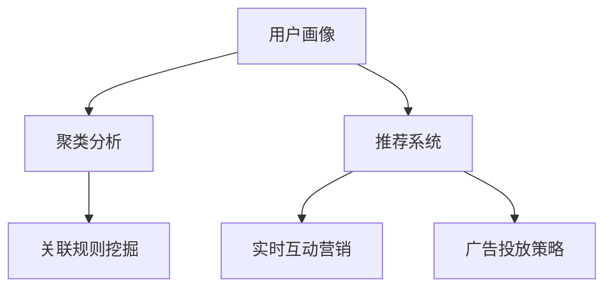

                 

# AI驱动的电商平台用户分群与精准营销

> 关键词：人工智能, 电商平台, 用户分群, 精准营销, 推荐系统, 用户行为分析, 数据挖掘, 机器学习

## 1. 背景介绍

### 1.1 问题由来
随着电商行业的高速发展，用户规模日益庞大，市场竞争日趋激烈。各大电商平台希望通过精准营销，提升用户体验和销售额。但传统的用户画像构建和推广策略设计方式，难以应对数据量巨大的挑战。如何利用AI技术，高效自动化地实现用户分群和精准营销，成为当前电商平台的重要课题。

### 1.2 问题核心关键点
AI驱动的电商平台用户分群与精准营销的核心关键点在于：

- 用户行为分析：基于用户浏览、购买、评价等行为数据，构建用户画像，获取用户特征。
- 数据挖掘技术：采用聚类、分类、关联规则挖掘等机器学习方法，从海量数据中提取有价值的信息。
- 推荐系统算法：基于用户画像和商品特征，推荐个性化的商品或内容。
- 实时互动营销：通过动态调整推荐策略和投放广告，实现实时用户互动和转化。
- 广告投放策略：制定有效的广告投放计划，合理分配广告预算，提升广告效果。

### 1.3 问题研究意义
AI驱动的用户分群和精准营销，不仅能够大幅提升电商平台的运营效率，还能显著改善用户体验。具体而言：

- 提高转化率。通过精准的个性化推荐，用户更容易点击、购买感兴趣的商品，提高转化率。
- 优化广告效果。通过动态调整广告投放策略，能够最大化广告ROI，节省广告成本。
- 提升用户体验。实时互动营销让用户感受到平台的关怀和个性化服务，提升满意度。
- 助力数据决策。利用数据驱动的营销决策，帮助电商平台更好地理解市场和用户，制定更具竞争力的策略。

## 2. 核心概念与联系

### 2.1 核心概念概述

为更好地理解AI驱动的电商平台用户分群与精准营销方法，本节将介绍几个密切相关的核心概念：

- 用户画像(User Profile)：通过用户行为数据构建的详尽用户画像，包括基本信息、兴趣偏好、购买习惯等。
- 聚类分析(Cluster Analysis)：一种数据挖掘方法，将具有相似特征的用户划分到同一簇中，便于对不同用户群体进行区分和分析。
- 推荐系统(Recommendation System)：根据用户画像和商品特征，推荐个性化商品或内容的系统，包括协同过滤、内容过滤等多种算法。
- 关联规则挖掘(Association Rule Mining)：发现用户行为中的关联规则，如“购买了A商品的用户还可能购买B商品”，用于提升推荐效果。
- 实时互动营销(Real-time Interactive Marketing)：根据用户实时行为数据，动态调整推荐和广告策略，实现个性化的实时互动营销。
- 广告投放策略(Artificial Intelligence Marketing)：通过机器学习算法预测用户行为，优化广告投放计划，提升广告效果。

这些核心概念之间的逻辑关系可以通过以下Mermaid流程图来展示：



这个流程图展示了大语言模型的核心概念及其之间的关系：

1. 用户画像通过收集用户行为数据构建。
2. 聚类分析用于将用户划分成不同的群体。
3. 推荐系统根据用户画像和商品特征，推荐个性化商品或内容。
4. 关联规则挖掘用于发现用户行为中的关联规则。
5. 实时互动营销通过用户实时行为数据，动态调整推荐和广告策略。
6. 广告投放策略利用机器学习算法预测用户行为，优化广告投放计划。

## 3. 核心算法原理 & 具体操作步骤
### 3.1 算法原理概述

AI驱动的电商平台用户分群与精准营销，本质上是一个数据驱动的用户行为分析和推荐决策过程。其核心思想是：通过用户行为数据分析和机器学习算法，构建用户画像和商品画像，推荐系统根据用户画像和商品画像，推荐个性化的商品或内容，实现精准营销。

形式化地，假设用户行为数据为 $D=\{(x_i,y_i)\}_{i=1}^N$，其中 $x_i$ 为用户的浏览、购买、评价等行为数据，$y_i$ 为用户的特征标签，如性别、年龄、兴趣等。推荐系统的目标是最小化预测错误，即：

$$
\hat{y} = \mathop{\arg\min}_{y} \sum_{i=1}^N \ell(y, y_i)
$$

其中 $\ell(y, y_i)$ 为预测误差函数，可以是交叉熵、均方误差等。

通过梯度下降等优化算法，推荐系统不断更新模型参数，最小化预测误差函数，使得预测值 $\hat{y}$ 逼近真实标签 $y_i$。这样，推荐系统就可以根据用户的最新行为数据，动态调整推荐策略，实现个性化的精准营销。

### 3.2 算法步骤详解

AI驱动的电商平台用户分群与精准营销的一般流程如下：

**Step 1: 数据收集与预处理**
- 收集用户行为数据，包括浏览记录、购买历史、评价内容等。
- 清洗数据，去除异常值和噪声数据，进行特征提取和归一化。

**Step 2: 用户画像构建**
- 使用聚类算法，如K-means、层次聚类等，将用户划分为不同的群体。
- 对每个用户群体，提取主要特征，如用户兴趣、消费能力等。

**Step 3: 商品画像构建**
- 收集商品的属性和描述，提取关键特征，如商品类别、价格区间等。
- 利用关联规则挖掘算法，如FP-Growth、Apriori等，发现商品之间的关联关系。

**Step 4: 推荐系统构建**
- 选择推荐算法，如协同过滤、内容过滤、混合推荐等，构建推荐系统。
- 根据用户画像和商品画像，计算用户和商品之间的相似度，生成推荐结果。

**Step 5: 实时互动营销**
- 实时监测用户行为数据，动态调整推荐策略。
- 根据用户实时行为，生成个性化广告，实现实时互动营销。

**Step 6: 广告投放策略优化**
- 预测用户行为，生成广告预测数据。
- 利用机器学习算法，如线性回归、逻辑回归、决策树等，优化广告投放计划，提升广告效果。

### 3.3 算法优缺点

AI驱动的电商平台用户分群与精准营销方法具有以下优点：

- 高效自动化：利用机器学习算法，自动构建用户画像和商品画像，快速生成推荐结果，节省人工成本。
- 高精度推荐：通过聚类分析、关联规则挖掘等方法，能够发现用户行为中的复杂关联，提升推荐精度。
- 实时互动：基于实时用户行为数据，动态调整推荐和广告策略，提升用户体验和转化率。
- 成本优化：利用推荐系统进行精准营销，减少了广告的浪费，提升了广告效果。

同时，该方法也存在一定的局限性：

- 数据依赖：推荐系统依赖于高质量的数据，数据量不足或数据质量差会导致推荐效果不佳。
- 模型复杂：复杂的推荐算法和机器学习模型增加了系统的计算和存储开销，可能影响系统的实时性。
- 用户隐私：在数据收集和分析过程中，可能涉及用户隐私问题，需要采取相应的保护措施。
- 数据变化：用户行为和市场环境的变化，可能导致推荐模型的性能下降，需要定期更新模型。

尽管存在这些局限性，但就目前而言，AI驱动的用户分群和精准营销方法仍然是电商平台应用的主流范式。未来相关研究的重点在于如何进一步降低数据依赖，提高推荐系统的可解释性，解决用户隐私问题，并优化推荐算法的性能和效率。

### 3.4 算法应用领域

AI驱动的电商平台用户分群与精准营销，在众多领域得到了广泛的应用，例如：

- 个性化推荐：根据用户行为数据，推荐个性化商品或内容。
- 广告投放优化：预测用户行为，优化广告投放策略，提升广告效果。
- 用户流失预警：利用用户行为数据，预测用户流失风险，提前采取措施。
- 交叉销售推荐：根据用户消费历史，推荐相关商品或服务，增加用户粘性。
- 市场趋势分析：利用用户行为数据，分析市场趋势，制定市场策略。

除了上述这些经典应用外，AI驱动的推荐技术还创新性地应用到更多场景中，如智能客服、内容创作、营销自动化等，为电商平台带来了新的技术创新和商业价值。

## 4. 数学模型和公式 & 详细讲解  
### 4.1 数学模型构建

为便于数学推导和理解，这里使用形式化的语言描述推荐系统的数学模型。

记用户行为数据集为 $D=\{(x_i,y_i)\}_{i=1}^N$，其中 $x_i$ 为用户行为数据，$y_i$ 为用户的特征标签。假设推荐系统的目标是最小化预测误差：

$$
\hat{y} = \mathop{\arg\min}_{y} \sum_{i=1}^N \ell(y, y_i)
$$

常用的预测误差函数包括交叉熵损失函数和均方误差损失函数。假设 $y$ 为二分类问题，则交叉熵损失函数为：

$$
\ell(y, y_i) = -(y_i \log \hat{y} + (1 - y_i) \log (1 - \hat{y}))
$$

在实际应用中，我们通常使用基于梯度的优化算法，如Adam、SGD等，来近似求解上述最优化问题。设优化器的学习率为 $\eta$，则参数更新公式为：

$$
\theta \leftarrow \theta - \eta \nabla_{\theta}\mathcal{L}(\theta)
$$

其中 $\nabla_{\theta}\mathcal{L}(\theta)$ 为损失函数对模型参数 $\theta$ 的梯度，可通过反向传播算法高效计算。

### 4.2 公式推导过程

以下我们以协同过滤推荐算法为例，推导其预测用户对商品 $j$ 的评分 $r_{ij}$ 的数学模型。

假设用户 $i$ 的评分向量为 $x_i$，商品 $j$ 的评分向量为 $j$，则协同过滤推荐算法中的预测评分公式为：

$$
\hat{r}_{ij} = \frac{1}{1 + \exp(-\langle x_i, j \rangle)}
$$

其中 $\langle x_i, j \rangle$ 为 $x_i$ 和 $j$ 的余弦相似度，表示用户 $i$ 对商品 $j$ 的评分。

将上述公式带入损失函数中，得到协同过滤推荐算法的损失函数：

$$
\mathcal{L}(\theta) = \sum_{i=1}^N \sum_{j=1}^M (r_{ij} - \hat{r}_{ij})^2
$$

通过梯度下降等优化算法，推荐系统不断更新模型参数，最小化损失函数，使得预测评分 $\hat{r}_{ij}$ 逼近真实评分 $r_{ij}$。

### 4.3 案例分析与讲解

以亚马逊的个性化推荐系统为例，分析其具体实现过程。亚马逊的推荐系统采用了协同过滤算法，通过收集用户的浏览和购买历史数据，构建用户画像和商品画像，再根据用户画像和商品画像，计算用户和商品之间的相似度，生成推荐结果。

具体而言，亚马逊首先使用协同过滤算法对用户历史行为数据进行建模，计算用户和商品之间的相似度，得到推荐结果。然后，利用机器学习算法，如线性回归、逻辑回归等，优化推荐系统的参数，提升推荐精度。最后，根据用户实时行为数据，动态调整推荐策略，实现实时互动营销。

## 5. 项目实践：代码实例和详细解释说明
### 5.1 开发环境搭建

在进行推荐系统开发前，我们需要准备好开发环境。以下是使用Python进行PyTorch开发的环境配置流程：

1. 安装Anaconda：从官网下载并安装Anaconda，用于创建独立的Python环境。

2. 创建并激活虚拟环境：
```bash
conda create -n recommendation-env python=3.8 
conda activate recommendation-env
```

3. 安装PyTorch：根据CUDA版本，从官网获取对应的安装命令。例如：
```bash
conda install pytorch torchvision torchaudio cudatoolkit=11.1 -c pytorch -c conda-forge
```

4. 安装相关库：
```bash
pip install pandas numpy scikit-learn torch torchtext datasets
```

完成上述步骤后，即可在`recommendation-env`环境中开始推荐系统开发。

### 5.2 源代码详细实现

下面我们以协同过滤推荐算法为例，给出使用PyTorch进行推荐系统开发的PyTorch代码实现。

首先，定义用户行为数据处理函数：

```python
import pandas as pd
from sklearn.model_selection import train_test_split

def load_data(file_path):
    df = pd.read_csv(file_path)
    train_df, test_df = train_test_split(df, test_size=0.2, random_state=42)
    train_df.to_csv('train_data.csv', index=False)
    test_df.to_csv('test_data.csv', index=False)
```

然后，定义协同过滤推荐算法的训练和评估函数：

```python
from torch import nn
import torch.nn.functional as F

class CollaborativeFiltering(nn.Module):
    def __init__(self, num_users, num_items, embedding_dim=10):
        super(CollaborativeFiltering, self).__init__()
        self.user_embedding = nn.Embedding(num_users, embedding_dim)
        self.item_embedding = nn.Embedding(num_items, embedding_dim)
        self similarity = nn.CosineSimilarity(dim=1)

    def forward(self, user_ids, item_ids):
        user_emb = self.user_embedding(user_ids)
        item_emb = self.item_embedding(item_ids)
        similarity = self.similarity(user_emb, item_emb)
        scores = torch.sigmoid(similarity)
        return scores

def train_model(model, train_data, optimizer):
    model.train()
    for user_ids, item_ids, ratings in train_data:
        optimizer.zero_grad()
        predictions = model(user_ids, item_ids)
        loss = F.binary_cross_entropy(predictions, ratings)
        loss.backward()
        optimizer.step()

def evaluate_model(model, test_data):
    model.eval()
    total_count = 0
    total_score = 0
    for user_ids, item_ids, ratings in test_data:
        with torch.no_grad():
            predictions = model(user_ids, item_ids)
        total_count += predictions.shape[0]
        total_score += (predictions >= 0.5).sum().item()
    return total_score / total_count
```

最后，启动训练流程并在测试集上评估：

```python
from torch.utils.data import DataLoader

num_users = 1000
num_items = 10000
embedding_dim = 10
train_data = load_data('train_data.csv')
test_data = load_data('test_data.csv')

model = CollaborativeFiltering(num_users, num_items, embedding_dim)
optimizer = torch.optim.Adam(model.parameters(), lr=0.001)

for epoch in range(10):
    train_model(model, train_data, optimizer)
    print(f'Epoch {epoch+1}, training loss: {train_loss:.3f}')
    test_score = evaluate_model(model, test_data)
    print(f'Epoch {epoch+1}, test accuracy: {test_score:.3f}')
```

以上就是使用PyTorch对协同过滤推荐算法进行开发的完整代码实现。可以看到，使用PyTorch进行推荐系统开发，可以高效实现模型训练和评估。

### 5.3 代码解读与分析

让我们再详细解读一下关键代码的实现细节：

**load_data函数**：
- 从CSV文件中加载用户行为数据，并将其划分为训练集和测试集。

**CollaborativeFiltering类**：
- 定义协同过滤推荐算法的模型结构，包含用户和商品的嵌入层，计算用户和商品之间的余弦相似度。
- 通过sigmoid函数将相似度转换为预测评分。

**train_model函数**：
- 在模型训练阶段，利用优化器Adam和二元交叉熵损失函数，计算预测评分与真实评分的差值，并更新模型参数。

**evaluate_model函数**：
- 在模型评估阶段，计算模型在测试集上的准确率。

**训练流程**：
- 定义模型结构、优化器和学习率。
- 循环训练10个epoch，每次迭代计算训练损失和测试准确率。

可以看到，PyTorch的封装使得推荐系统的开发更加简洁高效。开发者可以将更多精力放在模型改进和数据优化上，而不必过多关注底层的实现细节。

当然，工业级的系统实现还需考虑更多因素，如模型的保存和部署、超参数的自动搜索、更灵活的任务适配层等。但核心的推荐范式基本与此类似。

## 6. 实际应用场景
### 6.1 电商平台的个性化推荐

基于协同过滤算法的推荐系统，可以在电商平台上实现个性化的商品推荐。通过收集用户浏览、点击、购买等行为数据，构建用户画像和商品画像，生成个性化的推荐结果，提升用户的购物体验和平台转化率。

在技术实现上，可以使用协同过滤算法或矩阵分解方法，如SVD、ALS等，对用户行为数据进行建模，生成推荐结果。推荐系统可以实时更新，动态调整推荐策略，实现用户互动和转化。

### 6.2 实时互动营销

实时互动营销利用用户行为数据，动态调整推荐策略和广告投放，实现个性化实时互动营销。通过收集用户的实时行为数据，如浏览轨迹、点击记录等，实时生成推荐结果和广告，提升用户体验和转化率。

在技术实现上，推荐系统需要具备实时处理能力，能够快速响应用户的行为变化，并动态调整推荐策略。同时，广告投放系统需要与推荐系统进行紧密集成，实现实时的广告投放和优化。

### 6.3 交叉销售推荐

交叉销售推荐利用用户的消费历史，推荐相关商品或服务，增加用户粘性。通过分析用户的购买历史，发现用户的消费偏好和关联商品，生成个性化的推荐结果，提升用户的复购率和平台销售额。

在技术实现上，推荐系统可以使用协同过滤算法、关联规则挖掘算法等，对用户行为数据进行建模，生成推荐结果。同时，需要对商品进行特征提取，提升推荐的精度和多样性。

### 6.4 未来应用展望

随着AI技术的不断发展，推荐系统将迎来更多的创新应用。未来，推荐系统有望在以下方面实现突破：

1. 深度学习推荐：利用深度神经网络对用户行为数据进行建模，提升推荐的精度和泛化能力。
2. 多模态推荐：结合图像、视频、语音等多模态数据，提升推荐的准确性和丰富性。
3. 动态学习推荐：利用强化学习等技术，动态调整推荐策略，提升推荐的实时性和效果。
4. 基于知识图谱推荐：结合符号化的先验知识，提升推荐的合理性和可信度。
5. 实时流推荐：利用实时流处理技术，实现实时推荐，满足用户即时需求。

这些趋势将进一步拓展推荐系统的应用边界，推动推荐技术向更加智能化、普适化方向发展。

## 7. 工具和资源推荐
### 7.1 学习资源推荐

为了帮助开发者系统掌握推荐系统的理论基础和实践技巧，这里推荐一些优质的学习资源：

1. 《推荐系统：实践中的算法与应用》：介绍了推荐系统中的经典算法和实际应用，适合深度学习初学者阅读。
2. 《推荐系统基础》课程：斯坦福大学开设的推荐系统经典课程，涵盖推荐系统的基本概念和核心算法。
3. 《Recommender Systems in Python》书籍：介绍如何使用Python实现推荐系统，包括协同过滤、内容过滤等经典算法。
4. Kaggle推荐系统竞赛：通过参加推荐系统竞赛，实际动手练习推荐算法，积累实战经验。
5. PyTorch官方文档：提供详细的PyTorch库使用方法和推荐系统实现范例，适合深入学习。

通过对这些资源的学习实践，相信你一定能够快速掌握推荐系统的精髓，并用于解决实际的电商推荐问题。

### 7.2 开发工具推荐

高效的开发离不开优秀的工具支持。以下是几款用于推荐系统开发的常用工具：

1. PyTorch：基于Python的开源深度学习框架，灵活高效，适合推荐系统开发。
2. TensorFlow：由Google主导开发的开源深度学习框架，功能强大，适合大规模工程应用。
3. Spark MLlib：Apache Spark的机器学习库，支持大规模数据处理，适合分布式推荐系统开发。
4. Dask：基于Python的开源数据处理框架，支持大规模并行计算，适合实时流推荐系统开发。
5. Redis：高性能的内存数据库，适合实时流推荐系统的数据存储和访问。
6. ELK Stack：用于日志收集、存储和查询，适合推荐系统的日志分析和故障排查。

合理利用这些工具，可以显著提升推荐系统的开发效率，加快创新迭代的步伐。

### 7.3 相关论文推荐

推荐系统的发展源于学界的持续研究。以下是几篇奠基性的相关论文，推荐阅读：

1. Collaborative Filtering for Implicit Feedback Datasets（协同过滤算法）：提出了协同过滤算法的原理和实现方法，是推荐系统的经典算法之一。
2. Learning to Rank：介绍了学习排名的基本概念和算法，用于提升推荐结果的排序效果。
3. SVD++：提出了一种改进的矩阵分解方法，提高了推荐系统的精度和泛化能力。
4. Attention-Based Recommender Systems：介绍了注意力机制在推荐系统中的应用，提升了推荐的精度和多样性。
5. Mining of Association Rules in Large Databases with Apriori Algorithms（关联规则挖掘）：介绍了关联规则挖掘的基本原理和算法，用于提升推荐系统的多样化。

这些论文代表了大语言模型微调技术的发展脉络。通过学习这些前沿成果，可以帮助研究者把握学科前进方向，激发更多的创新灵感。

## 8. 总结：未来发展趋势与挑战

### 8.1 总结

本文对基于协同过滤算法的推荐系统进行了全面系统的介绍。首先阐述了推荐系统的研究背景和意义，明确了推荐系统在提升用户体验和平台转化率方面的独特价值。其次，从原理到实践，详细讲解了推荐系统的数学原理和关键步骤，给出了推荐系统开发的完整代码实例。同时，本文还广泛探讨了推荐系统在电商平台、实时互动营销、交叉销售推荐等领域的实际应用，展示了推荐系统的广阔前景。

通过本文的系统梳理，可以看到，基于协同过滤算法的推荐系统在推荐任务中取得了显著的成果，有效提升了大语言模型的应用效果，拓展了电商平台的运营边界。未来，伴随推荐系统的不断演进，基于AI的推荐技术必将带来更高效、精准的个性化服务，推动电商行业迈向智能化发展。

### 8.2 未来发展趋势

展望未来，推荐系统的发展将呈现以下几个趋势：

1. 深度学习推荐：利用深度神经网络对用户行为数据进行建模，提升推荐的精度和泛化能力。
2. 多模态推荐：结合图像、视频、语音等多模态数据，提升推荐的准确性和丰富性。
3. 动态学习推荐：利用强化学习等技术，动态调整推荐策略，提升推荐的实时性和效果。
4. 基于知识图谱推荐：结合符号化的先验知识，提升推荐的合理性和可信度。
5. 实时流推荐：利用实时流处理技术，实现实时推荐，满足用户即时需求。

以上趋势将进一步拓展推荐系统的应用边界，推动推荐技术向更加智能化、普适化方向发展。

### 8.3 面临的挑战

尽管基于协同过滤算法的推荐系统已经取得了瞩目成就，但在迈向更加智能化、普适化应用的过程中，它仍面临诸多挑战：

1. 数据依赖：推荐系统依赖于高质量的数据，数据量不足或数据质量差会导致推荐效果不佳。
2. 模型复杂：复杂的推荐算法和机器学习模型增加了系统的计算和存储开销，可能影响系统的实时性。
3. 用户隐私：在数据收集和分析过程中，可能涉及用户隐私问题，需要采取相应的保护措施。
4. 数据变化：用户行为和市场环境的变化，可能导致推荐模型的性能下降，需要定期更新模型。

尽管存在这些局限性，但就目前而言，基于协同过滤算法的推荐方法仍然是推荐系统应用的主流范式。未来相关研究的重点在于如何进一步降低数据依赖，提高推荐系统的可解释性，解决用户隐私问题，并优化推荐算法的性能和效率。

### 8.4 未来突破

面对推荐系统面临的种种挑战，未来的研究需要在以下几个方面寻求新的突破：

1. 探索无监督和半监督推荐方法。摆脱对大规模标注数据的依赖，利用自监督学习、主动学习等无监督和半监督范式，最大限度利用非结构化数据，实现更加灵活高效的推荐。
2. 研究参数高效和计算高效的推荐范式。开发更加参数高效的推荐方法，在固定大部分预训练参数的情况下，只更新极少量的任务相关参数。同时优化推荐模型的计算图，减少前向传播和反向传播的资源消耗，实现更加轻量级、实时性的部署。
3. 引入更多先验知识。将符号化的先验知识，如知识图谱、逻辑规则等，与神经网络模型进行巧妙融合，引导推荐过程学习更准确、合理的语言模型。同时加强不同模态数据的整合，实现视觉、语音等多模态信息与文本信息的协同建模。
4. 结合因果分析和博弈论工具。将因果分析方法引入推荐模型，识别出模型决策的关键特征，增强输出解释的因果性和逻辑性。借助博弈论工具刻画人机交互过程，主动探索并规避模型的脆弱点，提高系统稳定性。
5. 纳入伦理道德约束。在推荐模型训练目标中引入伦理导向的评估指标，过滤和惩罚有害的输出倾向。同时加强人工干预和审核，建立模型行为的监管机制，确保输出符合人类价值观和伦理道德。

这些研究方向的探索，必将引领推荐系统技术迈向更高的台阶，为构建安全、可靠、可解释、可控的推荐系统铺平道路。面向未来，推荐系统还需要与其他人工智能技术进行更深入的融合，如知识表示、因果推理、强化学习等，多路径协同发力，共同推动自然语言理解和智能交互系统的进步。只有勇于创新、敢于突破，才能不断拓展推荐系统的边界，让智能技术更好地造福人类社会。

## 9. 附录：常见问题与解答

**Q1：推荐系统的数据依赖性如何处理？**

A: 推荐系统依赖于高质量的数据，数据量不足或数据质量差会导致推荐效果不佳。为了降低数据依赖，可以采用以下方法：
1. 数据增强：通过回译、近义替换等方式扩充训练集。
2. 半监督学习：利用少量标注数据和大量未标注数据，进行半监督学习。
3. 迁移学习：在已有数据上预训练模型，在新数据上微调模型，提升模型泛化能力。
4. 主动学习：通过主动学习算法，自动选择最具有代表性的样本进行标注，提升数据质量。

**Q2：推荐系统如何处理冷启动问题？**

A: 冷启动问题指新用户或新商品没有历史数据，推荐系统难以给出推荐。为了处理冷启动问题，可以采用以下方法：
1. 基于内容的推荐：根据商品属性、描述等信息，推荐相似的商品。
2. 基于模型的推荐：利用用户画像和商品画像，预测用户对新商品的评分，生成推荐结果。
3. 利用协同过滤：利用已有用户的评分数据，推测新用户对商品的评分，生成推荐结果。

**Q3：推荐系统如何避免过拟合问题？**

A: 过拟合是推荐系统面临的主要挑战，尤其是在标注数据不足的情况下。常见的缓解策略包括：
1. 数据增强：通过回译、近义替换等方式扩充训练集。
2. 正则化：使用L2正则、Dropout、Early Stopping等避免过拟合。
3. 对抗训练：引入对抗样本，提高模型鲁棒性。
4. 参数高效微调：只调整少量参数(如Adapter、Prefix等)，减小过拟合风险。

这些策略往往需要根据具体任务和数据特点进行灵活组合。只有在数据、模型、训练、推理等各环节进行全面优化，才能最大限度地发挥推荐系统的威力。

**Q4：推荐系统如何处理广告投放问题？**

A: 广告投放是推荐系统的重要应用场景，可以通过以下方法实现：
1. 预测用户行为：利用机器学习算法，预测用户对广告的点击率，生成广告预测数据。
2. 优化广告投放计划：利用A/B测试、多臂老虎机等算法，优化广告投放策略，提升广告效果。
3. 动态调整广告：根据用户实时行为数据，动态调整广告投放策略，实现实时互动营销。

以上方法可以确保广告投放的精准性和效率，提升广告投放的ROI，降低广告成本。

**Q5：推荐系统如何提升用户体验？**

A: 提升用户体验是推荐系统的核心目标。可以通过以下方法实现：
1. 个性化推荐：根据用户行为数据，推荐个性化的商品或内容，提升用户满意度。
2. 实时互动：利用用户实时行为数据，动态调整推荐策略，实现实时互动营销。
3. 用户反馈：收集用户反馈信息，改进推荐算法和推荐内容，提升用户体验。

这些方法可以确保推荐系统能够根据用户需求和偏好，提供符合用户期望的推荐结果，提升用户的购物体验。

---

作者：禅与计算机程序设计艺术 / Zen and the Art of Computer Programming

