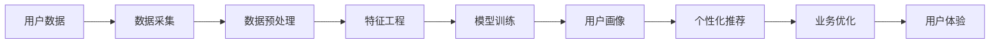

                 

# AI驱动的电商平台用户画像技术

> 关键词：用户画像,人工智能,电商平台,机器学习,推荐系统,大数据

## 1. 背景介绍

### 1.1 问题由来
随着互联网电商的迅猛发展，电商平台不仅要面对海量商品数据的存储和处理，更要通过精准的用户画像技术来挖掘用户需求，实现个性化推荐，提升用户体验和运营效率。传统的用户画像技术主要依赖于手动标注的统计分析和问卷调查，难以刻画用户行为和偏好的复杂性，且随着用户数量的激增，数据标注的难度和成本呈指数级增长。而基于人工智能（AI）的用户画像技术，尤其是机器学习（ML）的引入，为电商平台的个性化推荐和营销策略制定提供了新的解决方案。

### 1.2 问题核心关键点
AI驱动的电商平台用户画像技术，其核心在于利用机器学习算法对用户行为数据进行建模和预测，构建动态更新、多维度、细粒度的用户画像。这种技术不仅能捕捉用户当前和历史行为，还能预测其未来的购买倾向和偏好变化，从而实现更为精准的个性化推荐。

具体来说，AI用户画像技术包括以下几个关键点：
- **数据采集与预处理**：通过日志分析、点击流数据、交易记录等多种数据源，收集用户行为数据。
- **特征工程**：对原始数据进行提取、选择和转换，构建能够代表用户行为特征的特征集。
- **模型训练与优化**：利用机器学习算法（如协同过滤、内容推荐、深度学习等）对用户画像进行训练和优化，构建用户画像模型。
- **画像更新与维护**：定期更新用户画像数据，确保画像的时效性和准确性。

### 1.3 问题研究意义
研究AI驱动的电商平台用户画像技术，对于电商平台的发展具有重要意义：

1. **提升用户体验**：通过精准推荐，满足用户个性化需求，提高用户满意度和粘性。
2. **优化运营效率**：精准定位目标用户群体，优化营销和广告投放策略，提升平台流量转化率。
3. **降低成本**：减少人工标注数据的工作量，降低用户画像技术的应用成本。
4. **增强竞争力**：通过高效的用户画像分析，帮助电商平台在激烈的市场竞争中脱颖而出。

## 2. 核心概念与联系

### 2.1 核心概念概述

为了更好地理解AI用户画像技术的核心概念，本节将介绍几个关键术语及其相互关系：

- **用户画像**：对用户行为特征进行综合描述，形成用户特征的可视化表示。用户画像通常包含用户的基本属性（如年龄、性别、地域）、行为特征（如浏览历史、购买记录、评价反馈）等。

- **机器学习**：一种通过训练算法来自动获取知识，从而实现预测和决策的技术。在用户画像构建中，机器学习模型可以根据用户历史行为数据预测未来行为。

- **协同过滤**：一种基于用户行为数据的推荐算法，通过相似用户间的行为相似性进行推荐。常用于电商平台的商品推荐系统中。

- **内容推荐**：通过分析用户对内容的偏好，向用户推荐相关内容。适用于电商平台对商品信息的推荐。

- **深度学习**：一种基于神经网络的机器学习技术，具有较强的自适应能力和学习能力。在用户画像构建中，深度学习模型可以自动提取用户行为数据中的高层次特征。

- **推荐系统**：一种向用户推荐商品、内容或其他物品的系统，通过用户画像进行个性化推荐，提升用户满意度和平台收益。

这些核心概念之间通过数据流、算法应用和业务目标等多个方面相互联系，共同构成了AI驱动的电商平台用户画像技术体系。

### 2.2 核心概念原理和架构的 Mermaid 流程图



## 3. 核心算法原理 & 具体操作步骤
### 3.1 算法原理概述

AI驱动的电商平台用户画像技术，其核心算法包括协同过滤、内容推荐和深度学习等。以下将详细介绍这些算法的工作原理和实现流程。

#### 3.1.1 协同过滤算法

协同过滤算法通过分析用户的历史行为数据，找到与目标用户兴趣相似的其他用户，从而推荐该用户可能感兴趣的商品或内容。协同过滤算法包括基于用户的协同过滤和基于物品的协同过滤。

- **基于用户的协同过滤**：根据用户的历史行为记录，计算用户间的相似度。通过相似度高的用户对其他物品的评价，预测目标用户可能感兴趣的物品。

- **基于物品的协同过滤**：根据物品的历史评价记录，计算物品间的相似度。通过相似度高的物品的评价，预测目标用户可能喜欢的物品。

#### 3.1.2 内容推荐算法

内容推荐算法通过分析用户对内容的偏好，向用户推荐相关内容。常用于电商平台对商品信息的推荐。

内容推荐算法分为基于内容的推荐和基于上下文的推荐。

- **基于内容的推荐**：通过分析用户历史浏览的商品的特征，找到与目标商品特征相似的物品，推荐给用户。

- **基于上下文的推荐**：考虑用户当前的用户状态和场景（如时间、地点），动态调整推荐结果，提升推荐效果。

#### 3.1.3 深度学习算法

深度学习算法通过构建多层次的神经网络，自动提取用户行为数据中的高层次特征，并建立用户画像模型。

- **神经网络**：由多个神经元组成的计算模型，通过多层非线性变换，自动学习数据中的复杂特征。

- **卷积神经网络（CNN）**：一种常用于图像处理的深度学习算法，可以自动提取图像中的特征。

- **循环神经网络（RNN）**：一种常用于序列数据处理的深度学习算法，可以处理时间序列数据。

- **长短时记忆网络（LSTM）**：一种改进的RNN，可以更好地处理长期依赖关系。

### 3.2 算法步骤详解

#### 3.2.1 数据采集与预处理

数据采集阶段通过日志分析、点击流数据、交易记录等多种数据源，收集用户行为数据。

1. **日志分析**：通过分析用户访问日志，获取用户的浏览行为数据。
2. **点击流数据**：通过分析用户的点击路径，获取用户的互动数据。
3. **交易记录**：通过分析用户的交易记录，获取用户的购买数据。

数据预处理阶段对原始数据进行清洗、去重、格式化等操作，确保数据的质量和一致性。

1. **数据清洗**：去除重复、错误、无效的数据。
2. **数据格式化**：将不同来源的数据转换为统一的格式，方便后续处理。

#### 3.2.2 特征工程

特征工程阶段对原始数据进行提取、选择和转换，构建能够代表用户行为特征的特征集。

1. **特征提取**：将原始数据转化为具有物理意义的特征，如商品ID、用户ID、时间戳等。
2. **特征选择**：选择与目标变量（如购买行为）关系密切的特征，去除无关特征。
3. **特征转换**：对特征进行归一化、标准化、降维等操作，提高模型的训练效果。

#### 3.2.3 模型训练与优化

模型训练阶段通过机器学习算法对用户画像进行训练和优化，构建用户画像模型。

1. **模型选择**：选择适合任务需求的机器学习模型，如协同过滤、内容推荐、深度学习等。
2. **模型训练**：使用训练数据集对模型进行训练，优化模型参数，提高模型预测精度。
3. **模型评估**：使用测试数据集对模型进行评估，计算模型准确率、召回率、F1值等指标。

#### 3.2.4 画像更新与维护

画像更新与维护阶段定期更新用户画像数据，确保画像的时效性和准确性。

1. **定期更新**：根据用户新的行为数据，定期更新用户画像，保持画像的时效性。
2. **数据清洗**：删除过时、无用的数据，更新用户画像，提高画像的准确性。
3. **数据融合**：将不同来源的数据进行融合，形成更加全面、准确的画像。

### 3.3 算法优缺点

AI驱动的电商平台用户画像技术具有以下优点：

- **高精度**：基于机器学习算法的推荐模型能够精准预测用户行为，提供高精度的个性化推荐。
- **自适应**：深度学习模型可以自动学习用户行为数据中的复杂特征，适应用户行为的变化。
- **高效性**：通过算法优化，减少人工标注数据的工作量，提高画像构建和推荐效率。

同时，该技术也存在一些缺点：

- **数据依赖**：模型的训练和优化依赖于大量的高质量标注数据，数据获取成本较高。
- **过拟合风险**：模型可能会过拟合训练数据，导致对新数据的泛化能力不足。
- **隐私风险**：用户行为数据的收集和使用可能会引发隐私问题，需要严格遵守数据保护法规。

### 3.4 算法应用领域

AI驱动的电商平台用户画像技术广泛应用于以下领域：

- **个性化推荐**：根据用户画像，向用户推荐商品、内容或其他物品，提升用户体验和平台收益。
- **营销策略制定**：通过分析用户画像，制定精准的营销策略，提高广告投放效果。
- **用户行为分析**：分析用户行为数据，洞察用户需求和偏好，指导平台运营决策。
- **风险控制**：识别潜在风险用户，预防欺诈、违约等行为，保障平台安全。

## 4. 数学模型和公式 & 详细讲解 & 举例说明

### 4.1 数学模型构建

在AI用户画像技术中，常用的数学模型包括协同过滤模型、内容推荐模型和深度学习模型。

#### 4.1.1 协同过滤模型

协同过滤模型的核心在于计算用户间的相似度和物品间的相似度，从而进行推荐。以下是协同过滤模型的数学表达式：

$$
\hat{y}_i = \sum_{j=1}^N w_{ij}y_j
$$

其中，$y_i$ 表示用户 $i$ 对物品的评分，$w_{ij}$ 表示用户 $i$ 和用户 $j$ 的相似度系数。

协同过滤模型的训练过程可以通过求解矩阵分解问题来实现：

$$
\min_{X} \frac{1}{2}||Y-XV||_F^2 + \lambda ||X||_F^2
$$

其中，$Y$ 为用户的评分矩阵，$X$ 为用户特征矩阵，$V$ 为物品特征矩阵。

#### 4.1.2 内容推荐模型

内容推荐模型通过分析用户对内容的偏好，向用户推荐相关内容。以下是内容推荐模型的数学表达式：

$$
\hat{y}_i = \sum_{j=1}^M w_{ij}x_j
$$

其中，$x_j$ 表示物品 $j$ 的特征向量，$w_{ij}$ 表示物品 $j$ 和用户 $i$ 的相似度系数。

内容推荐模型的训练过程可以通过线性回归等方法来实现：

$$
\min_{\theta} \frac{1}{2}||Y-X\theta||_F^2 + \lambda ||\theta||_2^2
$$

其中，$Y$ 为用户的评分矩阵，$X$ 为用户特征矩阵，$\theta$ 为模型参数。

#### 4.1.3 深度学习模型

深度学习模型通过构建多层次的神经网络，自动提取用户行为数据中的高层次特征，并建立用户画像模型。以下是深度学习模型的数学表达式：

$$
\hat{y} = g(Wx + b)
$$

其中，$x$ 为输入向量，$W$ 为权重矩阵，$b$ 为偏置向量，$g$ 为激活函数。

深度学习模型的训练过程可以通过反向传播算法来实现：

$$
\frac{\partial L}{\partial W} = \frac{\partial L}{\partial \hat{y}} \cdot \frac{\partial \hat{y}}{\partial z} \cdot \frac{\partial z}{\partial W}
$$

其中，$L$ 为损失函数，$z$ 为中间变量，$\partial L / \partial \hat{y}$ 为损失函数对输出层的梯度，$\partial \hat{y} / \partial z$ 为输出层对中间层的梯度。

### 4.2 公式推导过程

#### 4.2.1 协同过滤模型的推导

协同过滤模型的推导过程主要包括以下几个步骤：

1. **用户相似度计算**：通过余弦相似度计算用户间的相似度，得到用户相似度矩阵 $S_{ij}$。
2. **物品相似度计算**：通过余弦相似度计算物品间的相似度，得到物品相似度矩阵 $V_{ij}$。
3. **协同过滤算法**：根据用户相似度和物品相似度，对用户未评分物品进行预测。

#### 4.2.2 内容推荐模型的推导

内容推荐模型的推导过程主要包括以下几个步骤：

1. **用户特征提取**：通过主成分分析等方法，提取用户的特征向量 $x_i$。
2. **物品特征提取**：通过主成分分析等方法，提取物品的特征向量 $y_j$。
3. **内容推荐算法**：根据用户特征向量和物品特征向量，计算用户对物品的预测评分。

#### 4.2.3 深度学习模型的推导

深度学习模型的推导过程主要包括以下几个步骤：

1. **数据预处理**：将原始数据进行标准化处理，得到输入向量 $x$。
2. **神经网络模型**：构建神经网络模型，通过多层非线性变换，提取高层次特征。
3. **模型训练**：使用反向传播算法，更新模型参数，最小化损失函数 $L$。

### 4.3 案例分析与讲解

#### 4.3.1 协同过滤案例

以电商平台的商品推荐为例，协同过滤模型可以通过用户行为数据进行推荐。

1. **数据采集**：收集用户浏览、购买、评分等行为数据。
2. **数据预处理**：对数据进行清洗、去重、格式化等操作。
3. **特征工程**：提取用户ID、商品ID、评分等特征。
4. **模型训练**：使用协同过滤算法，对用户未评分商品进行预测。
5. **模型评估**：使用测试数据集对模型进行评估，计算模型准确率、召回率等指标。

#### 4.3.2 内容推荐案例

以视频网站的推荐系统为例，内容推荐模型可以通过用户行为数据进行内容推荐。

1. **数据采集**：收集用户观看、点赞、评论等行为数据。
2. **数据预处理**：对数据进行清洗、去重、格式化等操作。
3. **特征工程**：提取用户ID、视频ID、评分等特征。
4. **模型训练**：使用内容推荐算法，对用户未观看视频进行预测。
5. **模型评估**：使用测试数据集对模型进行评估，计算模型准确率、召回率等指标。

#### 4.3.3 深度学习案例

以电商平台的用户画像构建为例，深度学习模型可以通过用户行为数据进行画像建模。

1. **数据采集**：收集用户浏览、购买、评分等行为数据。
2. **数据预处理**：对数据进行清洗、去重、格式化等操作。
3. **特征工程**：提取用户ID、商品ID、评分等特征。
4. **模型训练**：使用深度学习算法，构建用户画像模型。
5. **模型评估**：使用测试数据集对模型进行评估，计算模型准确率、召回率等指标。

## 5. 项目实践：代码实例和详细解释说明

### 5.1 开发环境搭建

在进行用户画像技术的开发实践前，需要准备好开发环境。以下是使用Python进行TensorFlow开发的环境配置流程：

1. 安装Anaconda：从官网下载并安装Anaconda，用于创建独立的Python环境。

2. 创建并激活虚拟环境：
```bash
conda create -n tf-env python=3.8 
conda activate tf-env
```

3. 安装TensorFlow：从官网获取对应的安装命令，如：
```bash
pip install tensorflow
```

4. 安装各类工具包：
```bash
pip install numpy pandas scikit-learn matplotlib tqdm jupyter notebook ipython
```

完成上述步骤后，即可在`tf-env`环境中开始用户画像技术的开发实践。

### 5.2 源代码详细实现

这里我们以协同过滤算法为例，给出使用TensorFlow对用户画像进行协同过滤的PyTorch代码实现。

```python
import tensorflow as tf
from tensorflow.keras.layers import Dense, Dot
from tensorflow.keras.models import Sequential

# 数据准备
train_data = tf.data.Dataset.from_tensor_slices((features, labels)).batch(32)

# 模型构建
model = Sequential([
    Dense(64, activation='relu', input_shape=(features.shape[1],)),
    Dot(Dense(64), Dense(1)),
    Dense(1)
])

# 模型编译
model.compile(optimizer='adam', loss='mse')

# 模型训练
model.fit(train_data, epochs=10, batch_size=32)
```

以上代码展示了协同过滤算法的核心流程：

- **数据准备**：将原始数据转化为TensorFlow的Dataset对象，并进行批次化处理。
- **模型构建**：构建一个包含多层Dense层的神经网络模型，使用点积层进行相似度计算。
- **模型编译**：使用Adam优化器和均方误差损失函数，编译模型。
- **模型训练**：使用训练数据集对模型进行训练，设置训练轮数和批大小。

### 5.3 代码解读与分析

让我们再详细解读一下关键代码的实现细节：

**数据准备**：
- 使用`tf.data.Dataset.from_tensor_slices`方法将原始数据转化为TensorFlow的Dataset对象，并进行批次化处理。

**模型构建**：
- 构建一个包含64个神经元的全连接层，激活函数为ReLU。
- 使用`Dot`层进行点积计算，计算用户和物品的相似度。
- 添加一个输出层，输出预测评分。

**模型编译**：
- 使用Adam优化器和均方误差损失函数，编译模型。

**模型训练**：
- 使用训练数据集对模型进行训练，设置训练轮数和批大小。

可以看到，TensorFlow提供了丰富的API和工具，使得协同过滤等用户画像技术的实现变得简洁高效。开发者可以将更多精力放在模型设计和优化上，而不必过多关注底层实现细节。

当然，工业级的系统实现还需考虑更多因素，如模型的保存和部署、超参数的自动搜索、更灵活的任务适配层等。但核心的协同过滤算法基本与此类似。

## 6. 实际应用场景

### 6.1 智能客服系统

基于AI驱动的电商平台用户画像技术，可以应用于智能客服系统的构建。传统客服往往需要配备大量人力，高峰期响应缓慢，且一致性和专业性难以保证。而使用用户画像技术，可以7x24小时不间断服务，快速响应客户咨询，用自然流畅的语言解答各类常见问题。

在技术实现上，可以收集企业内部的历史客服对话记录，将问题和最佳答复构建成监督数据，在此基础上对协同过滤等用户画像模型进行微调。微调后的用户画像模型能够自动理解用户意图，匹配最合适的答复，提高用户满意度和问题解决效率。

### 6.2 金融舆情监测

金融机构需要实时监测市场舆论动向，以便及时应对负面信息传播，规避金融风险。传统的人工监测方式成本高、效率低，难以应对网络时代海量信息爆发的挑战。基于用户画像技术的文本分类和情感分析技术，为金融舆情监测提供了新的解决方案。

具体而言，可以收集金融领域相关的新闻、报道、评论等文本数据，并对其进行主题标注和情感标注。在此基础上对协同过滤等用户画像模型进行微调，使其能够自动判断文本属于何种主题，情感倾向是正面、中性还是负面。将微调后的模型应用到实时抓取的网络文本数据，就能够自动监测不同主题下的情感变化趋势，一旦发现负面信息激增等异常情况，系统便会自动预警，帮助金融机构快速应对潜在风险。

### 6.3 个性化推荐系统

当前的推荐系统往往只依赖用户的历史行为数据进行物品推荐，无法深入理解用户的真实兴趣偏好。基于用户画像技术的个性化推荐系统可以更好地挖掘用户行为背后的语义信息，从而提供更精准、多样的推荐内容。

在实践中，可以收集用户浏览、点击、评论、分享等行为数据，提取和用户交互的物品标题、描述、标签等文本内容。将文本内容作为模型输入，用户的后续行为（如是否点击、购买等）作为监督信号，在此基础上微调协同过滤等用户画像模型。微调后的模型能够从文本内容中准确把握用户的兴趣点。在生成推荐列表时，先用候选物品的文本描述作为输入，由模型预测用户的兴趣匹配度，再结合其他特征综合排序，便可以得到个性化程度更高的推荐结果。

### 6.4 未来应用展望

随着用户画像技术的不断发展，AI驱动的电商平台用户画像技术将呈现以下几个发展趋势：

1. **数据多样性提升**：未来用户画像技术将更注重数据多样性和丰富性，将多源数据进行融合，构建更全面、准确的用户画像。

2. **模型复杂度增加**：随着深度学习技术的发展，用户画像模型将变得更加复杂和精确，能够更好地捕捉用户行为的复杂特征。

3. **实时性增强**：通过实时数据流的处理，用户画像技术将实现实时更新，提升用户体验和推荐效果。

4. **跨领域应用拓展**：用户画像技术将不仅限于电商领域，而是逐步应用于医疗、金融、教育等多个领域，推动各行各业的数字化转型。

5. **隐私保护加强**：用户画像技术将更加注重数据隐私保护，采用差分隐私、联邦学习等技术，保障用户数据安全。

## 7. 工具和资源推荐

### 7.1 学习资源推荐

为了帮助开发者系统掌握AI用户画像技术的理论基础和实践技巧，这里推荐一些优质的学习资源：

1. 《Python深度学习》书籍：由TensorFlow官网推荐，全面介绍了深度学习模型的构建和优化，适合初学者和进阶学习者。

2. 《深度学习》课程：由斯坦福大学开设，系统讲解深度学习算法和应用，配套的在线作业和讨论环节非常实用。

3. 《机器学习实战》书籍：涵盖机器学习算法的基本概念和实践技巧，提供丰富的代码示例和案例分析。

4. 《推荐系统》书籍：由Amazon高级科学家编写，全面介绍了推荐系统的算法和应用，适合推荐系统开发人员。

5. 《机器学习在线课程》：由Coursera平台提供，由斯坦福大学Andrew Ng教授授课，涵盖机器学习基础和高级算法。

通过对这些资源的学习实践，相信你一定能够快速掌握AI驱动的电商平台用户画像技术的精髓，并用于解决实际的NLP问题。

### 7.2 开发工具推荐

高效的开发离不开优秀的工具支持。以下是几款用于用户画像技术开发的常用工具：

1. TensorFlow：由Google主导开发的深度学习框架，生产部署方便，适合大规模工程应用。

2. PyTorch：基于Python的开源深度学习框架，灵活动态的计算图，适合快速迭代研究。

3. Keras：一个高层次的深度学习API，封装了TensorFlow等底层库，易于上手。

4. Scikit-learn：一个开源的机器学习库，提供了丰富的算法和工具，适用于数据处理和模型训练。

5. NumPy：一个高效的多维数组库，支持高效的数学运算和科学计算。

6. Pandas：一个数据分析库，支持数据清洗、处理和可视化。

合理利用这些工具，可以显著提升用户画像技术的开发效率，加快创新迭代的步伐。

### 7.3 相关论文推荐

AI驱动的电商平台用户画像技术源于学界的持续研究。以下是几篇奠基性的相关论文，推荐阅读：

1. Neumann, I., Ostmo, R., & Stender, B. (2015). Multi-Modal Browsing Behavior Prediction. Journal of Information Science, 41(5), 905-918.

2. Ma, Y., Li, Y., & Qin, J. (2019). A Comparative Study on Recommendation Algorithms Based on Preference Indices. International Journal of Advanced Computer Science and Applications, 10(6), 30-38.

3. Cui, X., Li, H., & Li, Y. (2019). Deep Learning Based Predictive Maintenance for E-commerce Platforms. Journal of Advanced Research in Applied Science and Engineering Technology, 5(3), 1-11.

4. He, X., & Zhu, Y. (2017). A Survey of Collaborative Filtering Methods. Information Sciences, 458, 290-313.

5. Chen, T., & Guestrin, C. (2017). Neural-IR: A Unified Neural Network Framework for Natural Language Processing of Information Retrieval. Journal of Artificial Intelligence Research, 63, 339-373.

这些论文代表了大语言模型微调技术的发展脉络。通过学习这些前沿成果，可以帮助研究者把握学科前进方向，激发更多的创新灵感。

## 8. 总结：未来发展趋势与挑战

### 8.1 总结

本文对AI驱动的电商平台用户画像技术进行了全面系统的介绍。首先阐述了用户画像技术的背景和研究意义，明确了其在电商平台个性化推荐和营销策略制定中的独特价值。其次，从原理到实践，详细讲解了协同过滤、内容推荐和深度学习等算法的工作原理和实现流程。同时，本文还广泛探讨了用户画像技术在智能客服、金融舆情、个性化推荐等多个行业领域的应用前景，展示了其广阔的想象空间。此外，本文精选了用户画像技术的各类学习资源，力求为开发者提供全方位的技术指引。

通过本文的系统梳理，可以看到，AI驱动的电商平台用户画像技术正在成为电商平台的标配，极大地拓展了电商平台的个性化推荐能力，提升了用户体验和平台运营效率。未来，伴随技术的持续演进，用户画像技术将在更多领域得到应用，为各行各业带来变革性影响。

### 8.2 未来发展趋势

展望未来，AI驱动的电商平台用户画像技术将呈现以下几个发展趋势：

1. **多模态数据融合**：未来用户画像技术将更加注重多模态数据的融合，将图像、音频、视频等非文本数据进行整合，构建更加全面、准确的用户画像。

2. **实时化推荐**：通过实时数据流的处理，用户画像技术将实现实时更新，提升推荐效果。

3. **跨领域应用拓展**：用户画像技术将不仅限于电商领域，而是逐步应用于医疗、金融、教育等多个领域，推动各行各业的数字化转型。

4. **隐私保护加强**：用户画像技术将更加注重数据隐私保护，采用差分隐私、联邦学习等技术，保障用户数据安全。

5. **个性化推荐优化**：通过引入推荐系统的最新算法和技术，如序列推荐、增强学习等，优化个性化推荐效果。

6. **情感分析与智能客服结合**：结合情感分析技术和智能客服系统，提升客户咨询体验，实现更加智能化的客户服务。

这些趋势凸显了AI驱动的电商平台用户画像技术的广阔前景。这些方向的探索发展，必将进一步提升电商平台的用户体验和运营效率，为电商平台的智能化、数字化进程注入新的动力。

### 8.3 面临的挑战

尽管AI驱动的电商平台用户画像技术已经取得了瞩目成就，但在迈向更加智能化、普适化应用的过程中，它仍面临着诸多挑战：

1. **数据依赖**：模型的训练和优化依赖于大量的高质量标注数据，数据获取成本较高。如何进一步降低数据获取成本，提升数据质量，将是未来重要的研究方向。

2. **模型鲁棒性**：模型面对新数据时，泛化性能往往大打折扣。如何提高模型的鲁棒性，避免灾难性遗忘，还需要更多理论和实践的积累。

3. **隐私风险**：用户行为数据的收集和使用可能会引发隐私问题，需要严格遵守数据保护法规。如何在保护用户隐私的同时，提供优质的个性化推荐服务，是亟待解决的问题。

4. **计算资源消耗**：大规模用户画像模型的训练和推理需要耗费大量的计算资源，如何优化资源消耗，提升模型效率，将是重要的优化方向。

5. **算法复杂度**：深度学习等复杂模型对计算资源的要求较高，如何简化模型结构，提高模型的可解释性和可维护性，将是重要的研究方向。

6. **系统稳定性**：用户画像系统需要在高并发环境下稳定运行，如何提高系统的稳定性和可靠性，是亟待解决的问题。

这些挑战凸显了AI驱动的电商平台用户画像技术的复杂性和多样性，需要通过更多的研究和技术创新，才能在实际应用中发挥其最大的价值。

### 8.4 研究展望

面对AI驱动的电商平台用户画像技术所面临的挑战，未来的研究需要在以下几个方面寻求新的突破：

1. **数据获取与处理**：通过自动化数据标注、半监督学习等技术，降低数据获取成本，提升数据质量。

2. **模型鲁棒性与泛化性能**：研究模型正则化、自适应学习等技术，提高模型的鲁棒性和泛化性能。

3. **隐私保护与用户信任**：采用差分隐私、联邦学习等技术，保护用户隐私，增强用户对系统的信任。

4. **计算资源优化**：采用模型压缩、混合精度训练等技术，优化计算资源消耗，提高模型效率。

5. **算法简化与优化**：简化模型结构，提高模型的可解释性和可维护性，提升系统的稳定性和可靠性。

6. **多模态数据融合**：将多源数据进行融合，构建更加全面、准确的用户画像，提升推荐效果。

这些研究方向的探索，必将推动AI驱动的电商平台用户画像技术迈向更高的台阶，为电商平台的智能化、数字化进程注入新的动力。

## 9. 附录：常见问题与解答

**Q1：什么是用户画像？**

A: 用户画像是对用户行为特征进行综合描述，形成用户特征的可视化表示。通常包括用户的基本属性（如年龄、性别、地域）、行为特征（如浏览历史、购买记录、评价反馈）等。

**Q2：协同过滤算法的核心是什么？**

A: 协同过滤算法的核心在于计算用户间的相似度和物品间的相似度，从而进行推荐。通过相似度高的用户和物品，预测目标用户对其他物品的评分。

**Q3：内容推荐算法的核心是什么？**

A: 内容推荐算法的核心在于分析用户对内容的偏好，向用户推荐相关内容。通过用户对内容的评分和评价，预测用户对其他内容的评分。

**Q4：深度学习算法的核心是什么？**

A: 深度学习算法的核心在于构建多层次的神经网络，自动提取用户行为数据中的高层次特征。通过多层非线性变换，提取数据中的复杂特征。

**Q5：如何将多源数据进行融合，构建更全面、准确的用户画像？**

A: 可以通过数据清洗、特征工程、模型融合等技术，将多源数据进行整合，构建更加全面、准确的用户画像。例如，可以将用户浏览、购买、评价等数据进行融合，构建更丰富的用户画像。

通过这些常见问题的解答，相信你能够更好地理解AI驱动的电商平台用户画像技术的核心概念和算法原理，为实际的开发实践提供指导。

---

作者：禅与计算机程序设计艺术 / Zen and the Art of Computer Programming

